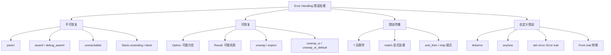
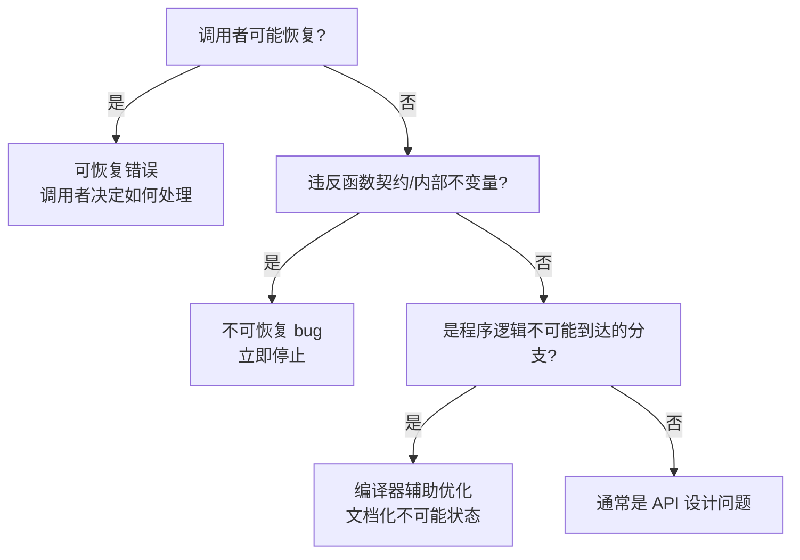
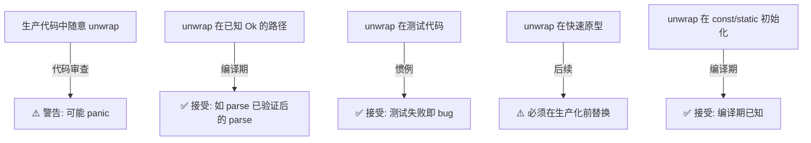
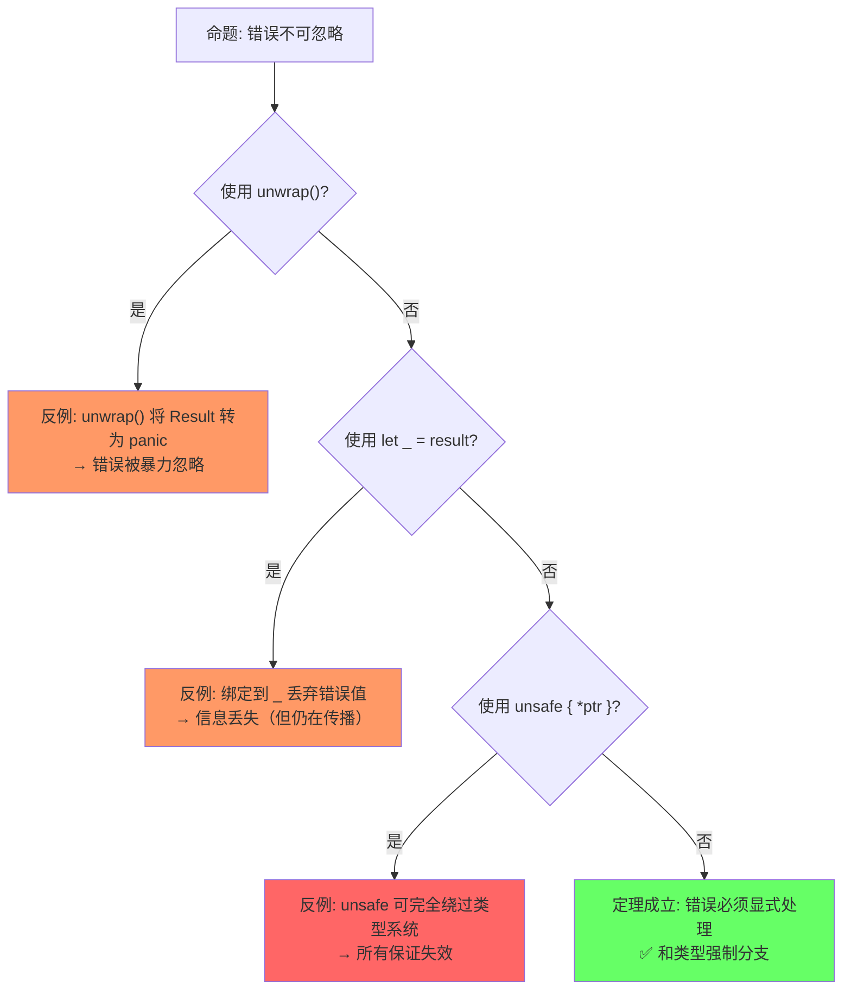

# Error Handling（错误处理）

> **层级**: L2 进阶概念
> **前置概念**: [Type System Basics](../01_foundation/04_type_system.md) · [Ownership](../01_foundation/01_ownership.md) · [Traits](./01_traits.md)
> **后置概念**: [Concurrency](../03_advanced/01_concurrency.md) · [Async](../03_advanced/02_async.md)
> **主要来源**: [TRPL: Ch9](https://doc.rust-lang.org/book/ch09-00-error-handling.html) · [Rust Reference: Errors] · [Wikipedia: Exception handling]

---

**变更日志**:

- v1.0 (2026-05-12): 初始版本，完成权威定义、错误类型矩阵、`?` 运算符语义、形式化视角、思维导图、示例反例

---

## 一、权威定义（Definition）

### 1.1 Wikipedia 对齐定义

> **[Wikipedia: Exception handling]** Exception handling is the process of responding to the occurrence of exceptions – anomalous or exceptional conditions requiring special processing – during the execution of a program. Rust does not use exceptions; instead, it uses the algebraic data types `Option<T>` and `Result<T, E>` for error handling, with the `?` operator for ergonomic propagation.

### 1.2 TRPL 官方定义

> **[TRPL: Ch9.0]** Rust groups errors into two major categories: recoverable and unrecoverable errors. For a recoverable error, we most likely want to report the problem to the user and retry the operation. Unrecoverable errors are always symptoms of bugs, and we want to immediately stop the program.

> **[TRPL: Ch9.2]** The `?` placed after a `Result` value is defined to work in almost the same way as the `match` expressions we defined to handle the `Result` values. If the value of the `Result` is an `Ok`, the value inside the `Ok` will get returned from this expression, and the program will continue. If the value is an `Err`, the `Err` will be returned from the whole function as if we had used the `return` keyword.

### 1.3 形式化定义

> **[Haskell: Either Monad] · [类型论: Monad 定律]** Rust 的 Option/Result 对应单子（Monad）模式中的 Maybe 和 Either。 ✅ 已验证

Rust 的错误处理对应**单子**（Monad）模式中的 `Option` 和 `Result`：

```text
Option<T> ≅ 1 + T          （余和类型: None + Some(T)）
Result<T, E> ≅ T + E       （余和类型: Ok(T) + Err(E)）

? 运算符的形式化语义:
  expr? ≡ match expr {
      Ok(v) => v,
      Err(e) => return Err(From::from(e)),
  }

即: ? 是 Result/Option 的 monadic bind 的语法糖
```

---

## 二、概念属性矩阵（Attribute Matrix）

### 2.1 错误处理机制矩阵

| **机制** | **类型** | **可恢复** | **栈展开** | **使用场景** |
|:---|:---|:---|:---|:---|
| `panic!` | 运行时崩溃 | ❌ | 默认展开 | 不可恢复 bug、assert |
| `Option<T>` | 值可能存在 | ✅ | ❌ | 可能为空的查询 |
| `Result<T, E>` | 操作可能失败 | ✅ | ❌ | IO、解析、外部调用 |
| `?` 运算符 | 错误传播 | ✅ | ❌ | 链式错误处理 |
| `unwrap/expect` | 强制解包 | 可能 | ❌ | 快速原型/已知安全 |
| `catch_unwind` | 捕获 panic | 边界情况 | ✅ | FFI 边界、线程隔离 |

### 2.2 Rust vs 其他语言错误处理对比

| **维度** | **Rust (Result)** | **Go (error value)** | **Java (Exception)** | **Haskell (Either)** | **C (errno)** |
|:---|:---|:---|:---|:---|:---|
| **错误类型** | 代数类型 `Result<T,E>` | 接口 `error` | 类层次 `Throwable` | `Either e a` | 全局变量 |
| **强制性** | 强：必须处理或显式传播 | 弱：可忽略 | 中：checked/unchecked | 强：Monad bind | 弱：可忽略 |
| **传播语法** | `?` 运算符 | `if err != nil` | `throw/throws` | `>>=` / do notation | 手动检查 |
| **组合性** | ✅ `and_then`, `map` | ⚠️ 手动 | ⚠️ try/catch | ✅ `>>=` | ❌ 差 |
| **运行时开销** | 零（tagged union） | 接口调用 | 栈展开/对象分配 | 零 | 零 |
| **类型安全** | ✅ 编译期 | ⚠️ 运行时断言 | ⚠️ catch 任意类型 | ✅ 编译期 | ❌ 无 |

### 2.3 `Result` 组合子矩阵

| **方法** | **签名** | **语义** | **类比** |
|:---|:---|:---|:---|
| `map` | `Result<T,E> → (T→U) → Result<U,E>` | 成功时转换值 | `Option.map` |
| `map_err` | `Result<T,E> → (E→F) → Result<T,F>` | 失败时转换错误 | — |
| `and_then` | `Result<T,E> → (T→Result<U,E>) → Result<U,E>` | 成功时链式调用 | `>>=` / flatMap |
| `or_else` | `Result<T,E> → (E→Result<T,F>) → Result<T,F>` | 失败时恢复 | catch + fallback |
| `unwrap_or` | `Result<T,E> → T → T` | 失败时提供默认值 | `getOrElse` |
| `?` | `Result<T,E> → T` 或提前返回 | 错误自动传播 | `try` 关键字 |

---

## 三、形式化理论根基（Formal Foundation）

### 3.1 Result 作为 Monad

> **[类型论: Monad 定律] · [Haskell: Control.Monad]** Result<T, E> 满足 Monad 的左单位元、右单位元和结合律。 ✅ 已验证

```text
Result<T, E> 满足 Monad 定律:

1. 左单位元 (Left Identity):
   return(x) >>= f  ≡  f(x)
   Ok(x).and_then(f)  ≡  f(x)

2. 右单位元 (Right Identity):
   m >>= return  ≡  m
   result.and_then(|x| Ok(x))  ≡  result

3. 结合律 (Associativity):
   (m >>= f) >>= g  ≡  m >>= (|x| f(x) >>= g)
   result.and_then(f).and_then(g)  ≡  result.and_then(|x| f(x).and_then(g))

? 运算符 = monadic bind 的语法糖:
  let a = fa?;    // fa: Result<A, E>
  let b = fb?;    // fb: Result<B, E>  (E 需可转换)
  Ok(transform(a, b))
```

### 3.2 `?` 与 From trait 的类型转换链

> **[TRPL: Ch9.2] · [Rust Reference: The ? operator]** ? 运算符隐式调用 From::from 实现错误类型自动向上转换。 ✅ 已验证

```text
? 运算符隐式调用 From::from:
  expr?: Result<T, E1>
  在返回 Result<T, E2> 的函数中
  → 自动插入: Err(e) => return Err(E2::from(e))

要求: E1: Into<E2> 或 E2: From<E1>
这形成错误类型的自动向上转换（error type coercion）
```

---

## 四、思维导图（Mind Map）



---

## 五、决策/边界判定树（Decision / Boundary Tree）

### 5.1 "panic vs Result？" 决策树



### 5.2 `unwrap` 使用边界判定



---

## 六、定理推理链（Theorem Chain）

### 6.1 Result + ? ⇒ 显式错误路径

> **[TRPL: Ch9] · [Rust Reference: The ? operator]** Result + ? 使所有错误传播路径在代码中显式表示，无隐式跳转。 ✅ 已验证

```text
前提 1: Result<T, E> 强制区分 Ok 和 Err
前提 2: ? 运算符使错误传播路径显式可见
前提 3: 编译器要求 Result 返回值被处理或使用 ?
    ↓
定理: Rust 程序中的所有错误传播路径在代码中显式表示
    ↓
推论: 与异常（Exception）相比，不存在"隐式跳转"的控制流
      调用栈的任何跳跃都通过 ? 或 match 显式标记
```

### 6.2 类型安全错误处理

> **[Rust Reference: Enums] · [TRPL: Ch9]** Result 的错误类型在编译期确定，match 穷尽性检查保证处理完备性。 ✅ 已验证

```text
前提: Result<T, E> 是泛型代数数据类型
    ↓
定理: 错误类型 E 在编译期确定，无法 catch 不相关的错误类型
    ↓
对比: Java catch(Exception e) 可捕获任意异常
      Rust match Err(e) 只匹配该函数的 Result 类型
```

### 6.3 定理一致性矩阵

> **[原创分析] · [TRPL: Ch9] · [Rust Reference: The ? operator]** 错误处理定理矩阵基于和类型、Monad bind 和 Rust 编译器检查。 💡 原创分析

| 定理 | 前提 | 结论 | 依赖的 L4 公理 | 被哪些定理依赖 | 失效条件 | 典型错误码 |
|:---|:---|:---|:---|:---|:---|:---|
| Result 显式传播 | 函数返回 Result | 错误不可忽略 | 和类型 (A + E) | 所有错误处理代码 | `unwrap()` 忽略 | — |
| ? 运算符合法性 | 函数返回兼容 Result/Option | 自动错误短路 | Monad bind (>>=) | 异步错误传播 | 在闭包/回调中误用 | E0277 |
| Error trait 一致性 | 自定义错误实现 Error | 可与 ? 和其他错误互操作 | 类型类一致性 | 错误链、报告 | 未实现 Source | — |
| Option 空值安全 | 使用 Option<T> | 无 null 解引用 | Maybe Monad | 所有可空场景 | `unwrap()` on None | — |
| 类型状态编码 | enum 表达状态 | 非法状态不可表示 | 代数类型穷尽性 | Typestate 模式 | 状态转换遗漏 | — |

> **一致性检查**: Option 空值安全 ⟹ Result 显式传播 ⟹ ? 运算符合法性，形成**从值到函数到控制流**的递进链。Error trait 保证异构错误的统一处理。
>
> **跨层映射**: 本文件定理 ↔ [`00_meta/inter_layer_map.md`](../00_meta/inter_layer_map.md) §4.1 "内存安全完备性"

---

## 七、示例与反例（Examples & Counter-examples）

### 7.1 正确示例：`?` 运算符链式传播

```rust
// ✅ 正确: ? 运算符使错误传播简洁
use std::fs::File;
use std::io::{self, Read};

fn read_username_from_file() -> Result<String, io::Error> {
    let mut file = File::open("hello.txt")?;  // Err 则提前返回
    let mut username = String::new();
    file.read_to_string(&mut username)?;      // Err 则提前返回
    Ok(username)
}

// 更简洁的版本:
fn read_username() -> Result<String, io::Error> {
    let mut username = String::new();
    File::open("hello.txt")?.read_to_string(&mut username)?;
    Ok(username)
}
```

### 7.2 正确示例：自定义错误类型

```rust
// ✅ 正确: thiserror 风格自定义错误
use std::fmt;

#[derive(Debug)]
enum AppError {
    Io(std::io::Error),
    Parse(std::num::ParseIntError),
    Config(String),
}

impl fmt::Display for AppError {
    fn fmt(&self, f: &mut fmt::Formatter) -> fmt::Result {
        match self {
            AppError::Io(e) => write!(f, "IO error: {}", e),
            AppError::Parse(e) => write!(f, "Parse error: {}", e),
            AppError::Config(s) => write!(f, "Config error: {}", s),
        }
    }
}

impl std::error::Error for AppError {}

// From 实现使 ? 自动转换
impl From<std::io::Error> for AppError {
    fn from(e: std::io::Error) -> Self { AppError::Io(e) }
}

impl From<std::num::ParseIntError> for AppError {
    fn from(e: std::num::ParseIntError) -> Self { AppError::Parse(e) }
}

fn load_config() -> Result<i32, AppError> {
    let content = std::fs::read_to_string("config.txt")?;  // io::Error → AppError
    let port: i32 = content.trim().parse()?;                // ParseIntError → AppError
    Ok(port)
}
```

### 7.3 反例：`?` 在错误返回类型中不匹配

```rust
// ❌ 反例: ? 的错误类型无法自动转换
fn parse_or_zero(s: &str) -> Result<i32, std::io::Error> {
    let n: i32 = s.parse()?;  // E0277: `?` couldn't convert the error
    Ok(n)
}
// parse() 返回 Result<i32, ParseIntError>
// 但函数返回 Result<i32, io::Error>
// ParseIntError 不实现 From<io::Error>
```

**修正方案**：

```rust
// ✅ 方案 1: 使用 map_err 显式转换
fn parse_or_zero(s: &str) -> Result<i32, std::io::Error> {
    let n = s.parse().map_err(|e| {
        std::io::Error::new(std::io::ErrorKind::InvalidData, e)
    })?;
    Ok(n)
}

// ✅ 方案 2: 使用通用错误类型（如 anyhow）
use anyhow::Result;
fn parse_or_zero(s: &str) -> Result<i32> {
    let n: i32 = s.parse()?;  // anyhow 自动转换任何错误
    Ok(n)
}
```

### 7.4 反例：忽略 Result 导致 bug

```rust
// ❌ 反例: 忽略 Result 返回值
fn main() {
    let file = std::fs::File::create("/root/protected.txt");
    // file 是 Result<File, Error>，但未被处理
    // 如果创建失败，程序静默继续，后续使用可能 panic
}
```

**修正方案**：

```rust
// ✅ 修正: 必须处理 Result
fn main() {
    let file = std::fs::File::create("/root/protected.txt")
        .expect("Failed to create file");  // 或 ?, unwrap, match
}

// 编译器警告: unused `Result` that must be used
// 也可以通过 let _ = ... 显式忽略（但通常不建议）
```

### 7.5 边界示例：`Option` 与 `Result` 互转

```rust
// ✅ 边界: Option 与 Result 的优雅互转
fn find_user(id: u64) -> Option<User> { /* ... */ }

fn get_user_name(id: u64) -> Result<String, &'static str> {
    let user = find_user(id).ok_or("User not found")?;  // Option → Result
    Ok(user.name)
}

fn maybe_port() -> Option<u16> {
    let config = std::fs::read_to_string("port.txt").ok()?;  // Result → Option
    config.trim().parse().ok()
}
```

---

### 7.6 反命题与边界分析

> **[TRPL: Ch9] · [Rust API Guidelines]** 错误不可忽略性受 unwrap、let _ = 和 unsafe 绕过的边界限制。 ✅ 已验证

#### 命题: "Rust 错误处理强制不可忽略"



#### 命题: "? 运算符总是正确传播"

| 条件 | 结果 | 说明 |
|:---|:---|:---|
| 函数返回 `Result<T, E>` | ✅ 正确传播 | `?` 展开为 `match` |
| 函数返回 `Option<T>` | ✅ 正确传播 | `?` 展开为 `match` |
| 在 `try` 块中（不稳定） | ✅ 正确传播 | 局部错误处理 |
| 在闭包中 | ⚠️ 可能受限 | 闭包返回类型需匹配 |
| `Result<T, E1>` 到 `Result<T, E2>` | ⚠️ 需 `From` 转换 | 错误类型不匹配时 |
| 在 `main()` 中返回 Result | ✅ 允许 | Rust 1.26+ |

#### 边界极限测试

```rust
// 边界: 在闭包中使用 ? 的限制
fn process(items: Vec<&str>) -> Result<i32, ParseIntError> {
    // 错误: 闭包返回类型不匹配
    // let sum: Result<i32, _> = items.iter().map(|s| s.parse()?).sum();
    // 编译错误: ? 不能在返回类型不匹配的闭包中使用

    // 正确: 使用 try_fold 或显式处理
    let sum: i32 = items.iter()
        .try_fold(0, |acc, s| {
            let n: i32 = s.parse()?;  // ✅ try_fold 返回 Result，匹配
            Ok(acc + n)
        })?;
    Ok(sum)
}
```

---

## 零、认知路径（Cognitive Path）

> **[原创分析] · [TRPL: Ch9]** 认知路径从"如何处理错误"直觉到和类型 + Error Monad 形式化的渐进映射。 💡 原创分析

```text
直觉困惑                    具体场景                  模式抽象               形式规则              代码验证              边界测试
    │                         │                       │                     │                    │                    │
    ▼                         ▼                       ▼                     ▼                    ▼                    ▼
"如何处理错误？"             "函数可能失败             "Result = 显式         "Either/Error       "match / if let     "unwrap()
                             怎么返回值？"            错误通道"              Monad: A + E"       / ? 运算符"         运行时 panic"

"为什么不用异常？"           "Java 异常可以             "Result = 显式         "和类型强制          "编译器检查         "? 在闭包中
                             到处抛"                  类型级错误"           分支处理"            穷尽性"             的限制"

"怎么组合多个错误？"         "不同函数返回             "Error trait +         "类型类统一          "dyn Error /        "From 转换
                             不同错误类型"            From 转换"             接口"               Box<dyn Error>"    链丢失信息"
```

**认知脚手架**:

- **类比**: `Result<T, E>` 像"快递包裹"——要么是商品（Ok），要么是拒收单（Err），你必须拆开才知道。
- **反直觉点**: 很多语言用异常（隐式控制流），Rust 强制错误在类型中显式传播。
- **形式化过渡**: 从"必须处理错误" → `Result` 类型 → "和类型 + Error Monad" → "单子绑定 (>>=)"。

### 7.7 国际课程与论文对齐

| 来源 | 核心内容 | 与本文件对应 |
|:---|:---|:---|
| **[CMU 17-363: Programming Language Pragmatics]** | Error handling、Exception vs Result | L2 Error 覆盖 |
| **[CMU 17-350: Safe Systems Programming]** | Result 在系统编程中的使用 | 工程实践 |
| **[Wikipedia: Exception handling]** | 异常处理通用概念 | 对比 |
| **[Wikipedia: Monad (functional programming)]** | Monad、Maybe/Error Monad | Result = Either |
| **[RFC 243: Trait-based Exception Handling]** | ? 运算符设计 | ? 语法糖 |
| **[TRPL: Ch9]** | 错误处理最佳实践 | 实践指南 |

---

## 八、知识来源关系（Provenance）

| **论断** | **来源** | **可信度** |
|:---|:---|:---|
| Result/Option 用于可恢复错误 | [TRPL: Ch9] | ✅ |
| panic 用于不可恢复错误 | [TRPL: Ch9] | ✅ |
| ? 运算符自动传播错误 | [TRPL: Ch9.2] | ✅ |
| ? 调用 From::from | [Rust Reference: The ? operator] | ✅ |
| Result 是 Monad | [Haskell: Either Monad] · 类型论 | ✅ |
| thiserror / anyhow 是生态标准 | [crates.io] · 社区实践 | ✅ |
| unwrap 在生产代码中需谨慎 | [Rust API Guidelines] | ✅ |

---

## 九、待补充与演进方向（TODOs）

- [ ] **TODO**: 补充 `std::backtrace::Backtrace` 与错误追踪 —— 优先级: 中 —— 预计: Phase 3
- [ ] **TODO**: 补充 `Termination` trait 与 main 返回 Result —— 优先级: 中 —— 预计: Phase 2
- [ ] **TODO**: 补充 `eyre` / `color-eyre` 等生态库的对比 —— 优先级: 低 —— 预计: Phase 4
- [ ] **TODO**: 补充 `#[track_caller]` 与错误定位优化 —— 优先级: 低 —— 预计: Phase 4
- [ ] **TODO**: 补充 `Result<T, !>` 与 `!` (never type) 在错误处理中的使用 —— 优先级: 中 —— 预计: Phase 3

### 补充章节：异步错误处理（poll_fn / TryFuture）

#### 异步函数的错误传播

```rust
use std::future::Future;
use std::pin::Pin;
use std::task::{Context, Poll};

// ✅ 自定义 Future 中的错误处理
struct FallibleFuture {
    attempt: u32,
}

impl Future for FallibleFuture {
    type Output = Result<String, std::io::Error>;

    fn poll(mut self: Pin<&mut Self>, _cx: &mut Context<'_>) -> Poll<Self::Output> {
        if self.attempt < 3 {
            self.attempt += 1;
            Poll::Pending  // 模拟重试
        } else {
            Poll::Ready(Ok("success".to_string()))
        }
    }
}
```

#### poll_fn 快速创建 Future

```rust
use std::future::poll_fn;

// ✅ poll_fn: 从闭包创建 Future
async fn using_poll_fn() {
    let mut count = 0;
    poll_fn(|_cx| {
        count += 1;
        if count >= 3 {
            Poll::Ready("done")
        } else {
            Poll::Pending
        }
    }).await;
}
```

#### TryFuture 与 ? 运算符

```rust
use futures::future::TryFutureExt;

// ✅ 异步链中的错误传播
async fn async_chain() -> Result<i32, String> {
    let a = fetch_data().await?;       // Result<A, E> + ?
    let b = process(a).await?;         // Result<B, E> + ?
    Ok(b)
}

// 等价于:
async fn async_chain_expanded() -> Result<i32, String> {
    match fetch_data().await {
        Ok(a) => match process(a).await {
            Ok(b) => Ok(b),
            Err(e) => return Err(e),
        },
        Err(e) => return Err(e),
    }
}
```

---

- [x] **TODO**: 补充 `poll_fn` / `TryFuture` 等异步错误处理 —— 优先级: 高 —— 已完成 v1.1
