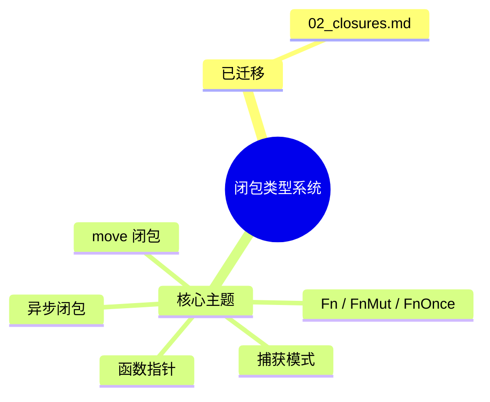

> **内容分级**: [综述级]
> **本节关键术语**: 闭包类型 (Closure Type) · Fn · FnMut · FnOnce · 捕获模式 (Capture Mode) · move 闭包（Closures） — [完整对照表](../../00_meta/01_terminology/01_terminology_glossary.md)
>
# 闭包类型系统：Fn、FnMut、FnOnce 的捕获语义
>
> **EN**: Closure Types
> **Summary**: Redirect stub: Rust closure types and capture semantics are now maintained in the canonical closures page.
> **Rust 版本**: 1.97.0+ (Edition 2024)
>
> **📎 交叉引用（Reference）**
>
> 本文件为 `concept/` 中闭包主题的**重定向 stub**。
>
> **受众**: [进阶]
> **Bloom 层级**: L2-L3
> **权威来源**: 本文件为学习入口 stub；完整概念解释请见：
>
> - [`concept/02_intermediate/07_iterators_and_closures/02_closures.md`](../07_iterators_and_closures/02_closures.md) — Rust 闭包唯一权威页
>
> 根据 AGENTS.md §2 Canonical 规则，通用 Rust 闭包概念解释统一维护在 `concept/02_intermediate/07_iterators_and_closures/02_closures.md`；本文件仅保留路径与链接。

---

## 重定向说明

原 `02_closure_types.md` 中关于闭包类型、捕获模式、`Fn`/`FnMut`/`FnOnce`、`move` 闭包等完整内容已迁移并扩展至：

> **权威来源**: [Rust 闭包：捕获语义、Trait 层级与工程实践](../07_iterators_and_closures/02_closures.md)

后续编辑请直接修改上述权威页。

---

## 相关概念

- [Rust 闭包](../07_iterators_and_closures/02_closures.md) — 唯一权威页
- [Iterator Patterns](../07_iterators_and_closures/01_iterator_patterns.md) — 闭包在迭代器中的典型应用
- [Async Closures](../../03_advanced/01_async/07_async_closures.md) — 异步闭包
- [Functions](../../01_foundation/07_modules_and_items/02_functions.md) — 函数基础

---

## 权威来源索引

> **权威来源**: [Rust Reference — Closure Types](https://doc.rust-lang.org/reference/types/closure.html), [TRPL Ch13 — Closures](https://doc.rust-lang.org/book/ch13-01-closures.html), [Rust By Example — Closures](https://doc.rust-lang.org/rust-by-example/fn/closures.html), [RFC 1558 — Closures](https://github.com/rust-lang/rfcs/pull/1558)
>
> **权威来源对齐变更日志**: 2026-07-31 内容迁移至 [`concept/02_intermediate/07_iterators_and_closures/02_closures.md`](../07_iterators_and_closures/02_closures.md)

**文档版本**: 2.0
**最后更新**: 2026-07-31
**状态**: ✅ 已转为重定向 stub

---

## 🧭 思维导图（Mindmap）

