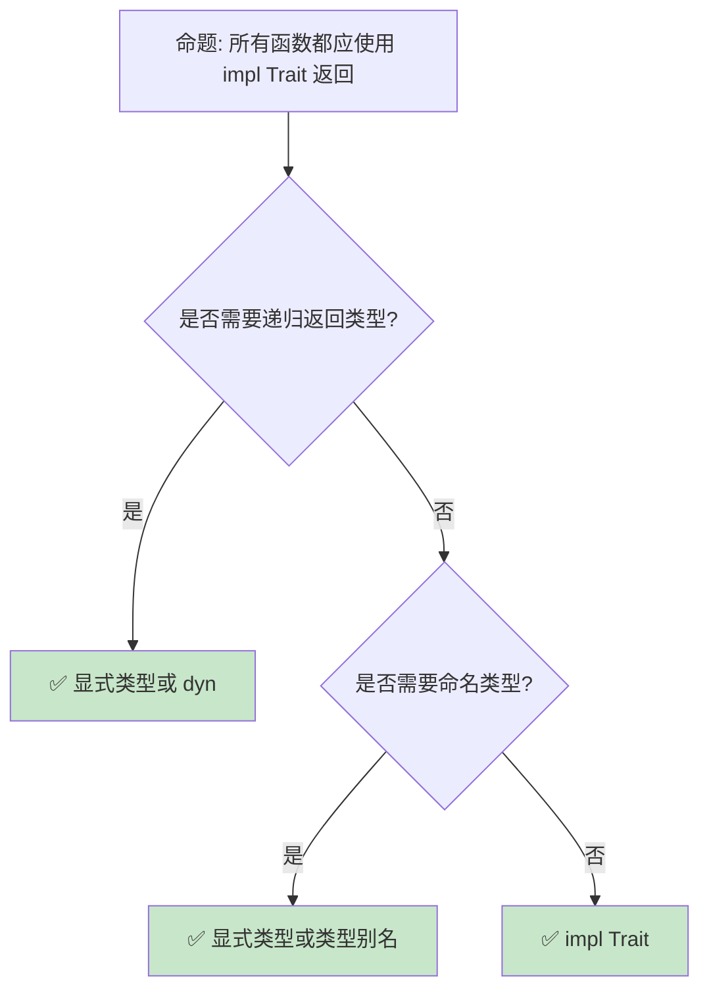
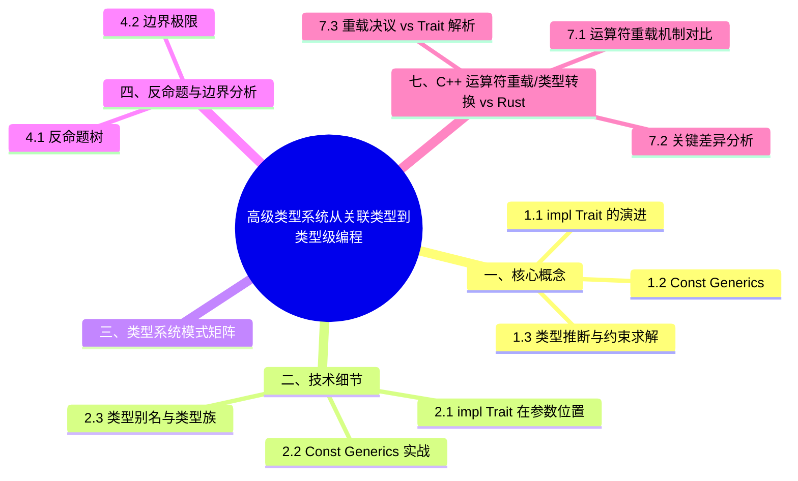

> **内容分级**: [综述级]
> **本节关键术语**:
>
> 高级类型系统 (Advanced Type System) · 类型推断 (Type Inference) ·
> 高阶类型 (Higher-Kinded Type) · 类型族 (Type Family)
> — [完整对照表](../../00_meta/01_terminology/01_terminology_glossary.md)
>
# 高级类型系统：从关联类型到类型级编程
>
> **EN**: Type System
> **Summary**: Type System — Advanced type system: GATs, impl Trait, type-level computation, and const generics under compile-time safety.
> **Rust 版本**: 1.97.0+ (Edition 2024)
>
> **受众**: [进阶]
> **Bloom 层级**: L4-L5
> **权威来源**: 本文件为 `concept/` 权威页。
> **A/S/P 标记**: **S** — Structure
> **双维定位**: C×Ana — 分析高级类型系统（Type System）特性的形式化边界
> **定位**: 深入分析 Rust **类型系统（Type System）的高级特性**——从 GATs、impl Trait 到类型级计算和 const generics，揭示 Rust 如何在保持编译期安全的同时提供强大的抽象能力。
> **前置概念**: [Type System](../../01_foundation/02_type_system/01_type_system.md) · [Generics](../01_generics/01_generics.md) · [Traits](../00_traits/01_traits.md)
> **后置概念**: [RustBelt](../../04_formal/02_separation_logic/01_rustbelt.md) · [Category Theory](../../04_formal/00_type_theory/04_category_theory.md)

---

> **来源**: [Rust Reference — Types](https://doc.rust-lang.org/reference/types.html) · · [Brown University — Concepts in Rust Programming](https://cel.cs.brown.edu/crp/) · [Brown Interactive Rust Book](https://rust-book.cs.brown.edu/) · [Jung et al. — RustBelt: Securing the Foundations of Rust](https://plv.mpi-sws.org/rustbelt/popl18/) · [Itanium C++ ABI](https://itanium-cxx-abi.github.io/cxx-abi/abi.html)
> [TRPL — Advanced Traits](https://doc.rust-lang.org/book/ch19-03-advanced-traits.html) ·
> [RFC 2000 — Const Generics](https://rust-lang.github.io/rfcs//2000-const-generics.html) ·
> [Rust Type System Explained](https://doc.rust-lang.org/reference/type-system.html) ·
> [Wikipedia — Type System](https://en.wikipedia.org/wiki/Type_system)

## 📑 目录

- [高级类型系统：从关联类型到类型级编程](#高级类型系统从关联类型到类型级编程)
  - [📑 目录](#-目录)
  - [一、核心概念](#一核心概念)
    - [1.1 impl Trait 的演进](#11-impl-trait-的演进)
    - [1.2 Const Generics](#12-const-generics)
    - [1.3 类型推断与约束求解](#13-类型推断与约束求解)
  - [二、技术细节](#二技术细节)
    - [2.1 impl Trait 在参数位置](#21-impl-trait-在参数位置)
    - [2.2 Const Generics 实战](#22-const-generics-实战)
    - [2.3 类型别名与类型族](#23-类型别名与类型族)
  - [三、类型系统模式矩阵](#三类型系统模式矩阵)
  - [四、反命题与边界分析](#四反命题与边界分析)
    - [4.1 反命题树](#41-反命题树)
    - [4.2 边界极限](#42-边界极限)
  - [五、常见陷阱](#五常见陷阱)
  - [七、C++ 运算符重载/类型转换 vs Rust Trait 系统](#七c-运算符重载类型转换-vs-rust-trait-系统)
    - [7.1 运算符重载机制对比](#71-运算符重载机制对比)
    - [7.2 关键差异分析](#72-关键差异分析)
      - [C++ 的 `operator*` 歧义](#c-的-operator-歧义)
      - [C++ 的隐式类型转换 vs Rust 的显式 Trait](#c-的隐式类型转换-vs-rust-的显式-trait)
    - [7.3 重载决议 vs Trait 解析](#73-重载决议-vs-trait-解析)
    - [编译错误示例](#编译错误示例)
    - [4.4 边界测试：高阶 trait bound（HRTB）误用（编译错误）](#44-边界测试高阶-trait-boundhrtb误用编译错误)
    - [4.5 边界测试：关联类型与泛型参数冲突（编译错误）](#45-边界测试关联类型与泛型参数冲突编译错误)
  - [六、来源与延伸阅读](#六来源与延伸阅读)
  - [相关概念](#相关概念)
  - [逆向推理链（Backward Reasoning）](#逆向推理链backward-reasoning)
  - [权威来源索引](#权威来源索引)
    - [10.3 边界测试：impl Trait 的自动 trait 捕获规则（编译错误）](#103-边界测试impl-trait-的自动-trait-捕获规则编译错误)
    - [10.4 边界测试：关联类型的默认实现与具体化冲突（编译错误）](#104-边界测试关联类型的默认实现与具体化冲突编译错误)
    - [10.2 边界测试：函数重复定义](#102-边界测试函数重复定义)
  - [嵌入式测验（Embedded Quiz）](#嵌入式测验embedded-quiz)
    - [测验 1：关联类型（Associated Type）与泛型参数的区别是什么？什么时候更适合用关联类型？（理解层）](#测验-1关联类型associated-type与泛型参数的区别是什么什么时候更适合用关联类型理解层)
    - [测验 2：`type Output = i32;` 这种语法出现在哪里？它有什么约束？（理解层）](#测验-2type-output--i32-这种语法出现在哪里它有什么约束理解层)
    - [测验 3：Higher-Ranked Trait Bounds（HRTB）`for<'a>` 的用途是什么？（理解层）](#测验-3higher-ranked-trait-boundshrtbfora-的用途是什么理解层)
    - [测验 4：类型级编程（Type-Level Programming）在 Rust 中主要通过什么机制实现？（理解层）](#测验-4类型级编程type-level-programming在-rust-中主要通过什么机制实现理解层)
    - [测验 5：`impl Trait` 在函数参数位置和返回位置各有什么语义？（理解层）](#测验-5impl-trait-在函数参数位置和返回位置各有什么语义理解层)
  - [实践](#实践)
  - [认知路径](#认知路径)
    - [核心推理链](#核心推理链)
  - [从 `crates\c04_generic\docs\tier_04_advanced\01_advanced_type_techniques.md` 迁移的补充视角](#从-cratesc04_genericdocstier_04_advanced01_advanced_type_techniquesmd-迁移的补充视角)
  - [📋 目录](#-目录-1)
  - [📖 章节概览](#-章节概览)
  - [📐 知识结构](#-知识结构)
    - [概念定义](#概念定义)
    - [属性特征](#属性特征)
    - [关系连接](#关系连接)
    - [思维导图](#思维导图)
    - [多维概念对比矩阵](#多维概念对比矩阵)
    - [决策树图](#决策树图)
    - [证明树图](#证明树图)
  - [🎯 学习目标](#-学习目标)
  - [1️⃣ PhantomData 深入应用](#1️⃣-phantomdata-深入应用)
    - [1.1 什么是 PhantomData？](#11-什么是-phantomdata)
    - [1.2 型变 (Variance) 控制](#12-型变-variance-控制)
  - [🧭 思维导图（Mindmap）](#-思维导图mindmap)

---

## 一、核心概念
>
>

### 1.1 impl Trait 的演进
>

```rust,ignore
// impl Trait: 隐藏具体类型，暴露行为

// 1. 函数返回位置 (Rust 1.26+) (Source: [Rust Reference — impl Trait](https://doc.rust-lang.org/reference/types/impl-trait.html))
fn make_iter() -> impl Iterator<Item = i32> {
    vec![1, 2, 3].into_iter()
}

// 2. 函数参数位置 (Rust 1.75+) (Source: [Rust Reference — impl Trait](https://doc.rust-lang.org/reference/types/impl-trait.html))
fn process(iter: impl Iterator<Item = i32>) -> i32 {
    iter.sum()
}

// 参数位置 impl Trait 等价于泛型:
// fn process<T: Iterator<Item = i32>>(iter: T) -> i32

// 3. 在 Trait 方法中 (Rust 1.75+)
trait Factory {
    fn create() -> impl Product;
}

// 4. 与 dyn Trait 的对比:
// ├── impl Trait: 静态分发，零开销，类型隐藏
// ├── dyn Trait: 动态分发，有开销，运行时多态
// └── 选择: 性能优先 impl，灵活性优先 dyn

// 5. 在类型别名中
type IntIterator = impl Iterator<Item = i32>;
// 不稳定: type_alias_impl_trait

// 6. 关联类型位置（TAP: Type Alias Impl Trait）
trait Foo {
    type Bar: Iterator<Item = i32>;
}
```

> **impl Trait 洞察**: **impl Trait 是 Rust "零成本抽象（Zero-Cost Abstraction）"的关键**——它隐藏实现细节而不引入运行时（Runtime）开销。
> [来源: [RFC 1522 — Conservative impl Trait](https://doc.rust-lang.org/reference/types/impl-trait.html)]
> **Rust 2024 edition 补充**: 返回位置 `impl Trait` 的生命周期（Lifetimes）捕获规则发生变化。
>
> - Rust 2021：隐式捕获所有输入生命周期（Lifetimes）。
> - Rust 2024：默认捕获所有输入生命周期（Lifetimes）；如需精确控制，使用 `+ use<'lt>` 或 `+ use<>`。
>
> ```rust,ignore
> // 2021: 隐式捕获
> fn make_iter_2021<'a>(data: &'a [i32]) -> impl Iterator<Item = &'a i32> {
>     data.iter()
> }
>
> // 2024: 显式捕获（保留 2021 行为）
> fn make_iter_2024<'a>(data: &'a [i32]) -> impl Iterator<Item = &'a i32> + use<'a> {
>     data.iter()
> }
>
> // 2024: 'static 返回（不捕获输入生命周期（Lifetimes））
> fn make_static(_data: &[i32]) -> impl Iterator<Item = i32> + use<> {
>     [1, 2, 3].into_iter()
> }
> ```
>
> [来源: [Rust Edition Guide 2024 — precise-capturing](https://doc.rust-lang.org/edition-guide/rust-2024/rpit-lifetime-capture.html) · [RFC 3617](https://rust-lang.github.io/rfcs/3617-precise-capturing.html)]

---

### 1.2 Const Generics
>

```rust,ignore
// Const Generics: 泛型参数可以是常量值 (Source: [RFC 2000 — Const Generics](https://rust-lang.github.io/rfcs/2000-const-generics.html), [Rust Reference — Const Generics](https://doc.rust-lang.org/reference/items/generics.html#const-generics))

// 固定大小的数组包装器
struct Array<T, const N: usize> {
    data: [T; N],
}

impl<T, const N: usize> Array<T, N> {
    fn len(&self) -> usize { N }
}

// 使用:
let a: Array<i32, 5> = Array { data: [0; 5] };
let b: Array<f64, 10> = Array { data: [0.0; 10] };

// const generics 表达式:
fn double_size<T, const N: usize>(arr: [T; N]) -> [T; N * 2]
where T: Default + Copy
{
    // 不稳定: generic_const_exprs（返回类型 [T; N * 2] 需该特性）
    let mut out: [T; N * 2] = [T::default(); N * 2];
    out[..N].copy_from_slice(&arr);
    out
}

// 与 const fn 结合:
const fn compute_size(n: usize) -> usize {
    n * 2 + 1
}

struct ComputedArray<T, const N: usize> {
    data: [T; compute_size(N)],
}

// 实际应用: 矩阵类型
struct Matrix<T, const ROWS: usize, const COLS: usize> {
    data: [[T; COLS]; ROWS],
}

impl<T, const R: usize, const C: usize> Matrix<T, R, C> {
    fn shape(&self) -> (usize, usize) { (R, C) }

    fn transpose(&self) -> Matrix<T, C, R>
    where T: Copy + Default {
        let mut out = [[T::default(); R]; C];
        for i in 0..R {
            for j in 0..C {
                out[j][i] = self.data[i][j];
            }
        }
        Matrix { data: out }
    }
}
```

> **Const Generics 洞察**: **Const generics 使数组大小成为类型系统（Type System）的一部分**——编译期验证矩阵维度匹配。
> [来源: [RFC 2000 — Const Generics](https://rust-lang.github.io/rfcs//2000-const-generics.html)]

---

### 1.3 类型推断与约束求解
>

```text
Rust 的类型推断机制:

  Hindley-Milner 风格:
  ├── 基于表达式的结构推断类型
  ├── 泛型函数调用时实例化
  ├── 局部变量类型可省略
  └── 但函数签名通常需显式标注

  约束求解:
  ├── 编译器收集类型约束
  ├── Trait bound 满足性检查
  ├── 生命周期包含关系
  └── 求解最优类型

  推断限制:
  ├── 函数参数需类型标注（除非 impl Trait）
  ├── 关联类型需显式指定
  ├── 复杂嵌套可能失败
  └── 通常 turbofish 语法帮助: parse::<i32>()

  示例:
  let v = vec![1, 2, 3];  // Vec<i32>
  let iter = v.iter();     // std::slice::Iter<i32>
  let sum: i32 = iter.sum(); // 类型从 sum 的目标类型推断
```

> **推断洞察**: Rust 的**类型推断（Type Inference）是"辅助"而非"全自动"**——它减少噪声，但关键边界保持显式。
> [来源: [Rust Reference — Type Inference](https://doc.rust-lang.org/reference/types.html)]

---

## 二、技术细节

类型系统进阶的三个技术细节，分别扩展「抽象表达力」的不同轴向：

- **`impl Trait` 在参数位置**：参数位的 `impl Trait` 是匿名泛型参数的语法糖——`fn f(x: impl Display)` 等价于 `fn f<T: Display>(x: T)`。调用方选类型、每次调用可不同类型、单态化。与返回位 `impl Trait`（存在类型，实现方选类型、全函数唯一类型）构成对偶；判定用哪个位置，问「类型由谁决定」——调用方决定用参数位，实现细节需隐藏用返回位。
- **Const Generics 实战**：`struct Matrix<T, const R: usize, const C: usize>` 把维度编码进类型——`Matrix<f32, 3, 3> + Matrix<f32, 3, 4>` 是编译错误（维度不匹配在类型层拒绝）。stable 支持「具体常量 + 单参数算术」的受限子集（`min_const_generics`），`[T; N]` 的 `N` 参与泛型是最成熟用法；涉及 `N + 1` 这类表达式需 `generic_const_exprs`（仍 nightly）。
- **类型别名与类型族**：`type Result<T> = std::result::Result<T, MyError>` 是「部分应用的别名」（无新类型，完全等价替换）；关联类型族（`trait Trait { type Assoc; }`）是「impl 处确定一次的类型函数」。别名为零成本纯语法，类型族携带「每 impl 唯一」的承诺——`type Assoc = i32` 在 impl 外不可被假设为其他。

三者共用同一判定原则：信息放在类型层（编译期可检）还是值层（运行时可变）——进阶类型系统的全部技术都是把更多程序性质推进类型层的不同路径。

### 2.1 impl Trait 在参数位置
>

```rust
// impl Trait 参数 vs 泛型参数的对比

// impl Trait 参数（简洁）
fn process(items: impl Iterator<Item = i32>) -> i32 {
    items.sum()
}

// 等价泛型参数（灵活）
fn process_generic<T: Iterator<Item = i32>>(items: T) -> i32 {
    items.sum()
}

// 多个 impl Trait 参数（每个独立类型）
fn combine(a: impl Iterator, b: impl Iterator) {
    // a 和 b 可以是不同具体类型
}

// 等价泛型:
// fn combine<A: Iterator, B: Iterator>(a: A, b: B)

// 在 Trait 中:
trait Parser {
    fn parse(input: &str) -> impl Sized;
}

// 与关联类型的关系:
// impl Trait 在返回位置 ≈ 匿名关联类型
// 但更简单，无需显式 type 声明

// 限制:
// ├── 不能嵌套 impl Trait（impl Iterator<Item = impl Display>）
// ├── 不能用于 struct 字段
// └── 不能用于 trait bound 组合
```

> **参数洞察**: **impl Trait 参数是泛型（Generics）的语法糖**——它更简洁，但牺牲了显式命名类型参数的能力。
> [来源: [Rust Reference — impl Trait](https://doc.rust-lang.org/reference/types/impl-trait.html)]

---

### 2.2 Const Generics 实战
>

```rust
// Const Generics 实战示例

// 1. 编译期大小检查的矩阵乘法
struct Matrix<T, const R: usize, const C: usize> {
    data: [[T; C]; R],
}

impl<T, const R: usize, const C: usize> Matrix<T, R, C> {
    fn multiply<const C2: usize>(
        &self,
        other: &Matrix<T, C, C2>,
    ) -> Matrix<T, R, C2>
    where T: Copy + Default + std::ops::Add<Output = T> + std::ops::Mul<Output = T> {
        let mut result = Matrix { data: [[T::default(); C2]; R] };
        for i in 0..R {
            for j in 0..C2 {
                for k in 0..C {
                    result.data[i][j] = result.data[i][j] + self.data[i][k] * other.data[k][j];
                }
            }
        }
        result
    }
}

// 编译期验证维度:
// let a: Matrix<f64, 2, 3> = ...;
// let b: Matrix<f64, 3, 4> = ...;
// let c = a.multiply(&b);  // Matrix<f64, 2, 4>
// let d = a.multiply(&a);  // 编译错误！2 != 3

// 2. 固定容量栈
struct Stack<T, const CAPACITY: usize> {
    data: [Option<T>; CAPACITY],
    top: usize,
}

impl<T: Copy, const N: usize> Stack<T, N> {
    fn new() -> Self {
        Stack { data: [None; N], top: 0 }
    }

    fn push(&mut self, value: T) -> Result<(), &'static str> {
        if self.top >= N {
            return Err("stack full");
        }
        self.data[self.top] = Some(value);
        self.top += 1;
        Ok(())
    }
}
```

> **实战洞察**: **Const generics 将运行时（Runtime）的维度检查提升为编译期类型检查**——矩阵乘法维度不匹配成为编译错误。
> [来源: [Const Generics MVP](https://rust-lang.github.io/rfcs//2000-const-generics.html)]

---

### 2.3 类型别名与类型族
>

```rust,ignore
// 类型别名: 简化复杂类型
type IntResult<T> = Result<T, std::num::ParseIntError>;
type StringMap<T> = std::collections::HashMap<String, T>;

// 使用:
fn parse_number(s: &str) -> IntResult<i32> {
    s.parse()
}

// 类型族 (Type Families): 通过关联类型实现
trait Container<'a> {
    type Item;
    type Iter: Iterator<Item = Self::Item>;

    fn iter(&'a self) -> Self::Iter;
}

impl<'a, T: 'a> Container<'a> for Vec<T> {
    type Item = &'a T;
    type Iter = std::slice::Iter<'a, T>;

    fn iter(&'a self) -> Self::Iter {
        self.as_slice().iter()
    }
}

// 类型级计算（有限）:
// Rust 的类型系统不是图灵完备的
// 但可以通过 trait 实现有限计算

trait AddOne {
    type Result;
}

impl AddOne for std::marker::U0 { type Result = std::marker::U1; }
// ... 编译期类型级加法（typenum crate）
```

> **别名洞察**: **类型别名和类型族是管理复杂性的工具**——它们使代码更可读，同时保持类型安全。
> [来源: [Rust Reference — Type Aliases](https://doc.rust-lang.org/reference/items/type-aliases.html)]

---

## 三、类型系统模式矩阵

```text
场景 → 特性 → 代码模式

隐藏实现细节:
  → impl Trait
  → fn foo() -> impl Iterator<Item = i32>
  → 静态分发 + 类型隐藏

编译期大小检查:
  → const generics
  → struct Matrix<T, const R: usize, const C: usize>
  → 维度在类型中

类型级配置:
  → 关联类型
  → trait Service { type Config; }
  → 每个实现者定义配置类型

简化复杂签名:
  → 类型别名
  → type Result<T> = std::result::Result<T, MyError>
  → 减少重复

有限类型级计算:
  → typenum / generic-array
  → Add<B>: Output = Sum
  → 编译期算术
```

> **模式矩阵**: Rust 的类型系统（Type System）**在表达力和复杂性之间取得平衡**——不像 Haskell 那样完全类型级编程，但足够处理大多数工程需求。
> [来源: [typenum crate](https://docs.rs/typenum/latest/typenum/)]

---

## 四、反命题与边界分析

本节检验高级类型系统的两条常见误判：

- **反命题 1：「关联类型和泛型参数只是风格差异」** —— 错误。两者有语义分野：泛型参数允许同一类型对同一 trait 多次实现（`From<u8>`/`From<u16>` 共存），关联类型强制唯一实现（`Iterator::Item` 唯一）。选错维度会导致「 impl 冲突」（E0119）或「约束不可表达」——判定准则是「实现唯一性是否为语义要求」；
- **反命题 2：「`impl Trait` 在参数和返回位置等价」** —— 根本不同。参数位置 `fn f(x: impl Trait)` 是泛型语法糖（调用方选类型），返回位置 `fn f() -> impl Trait` 是存在类型（实现方选类型、调用方只见接口）——前者是「全称量化」，后者是「存在量化」，这是类型论视角的精确表述。

边界极限小节量化：HRTB 的推导边界、运算符重载与 trait 解析的关系、以及 C++ 转换规则的不可迁移性。

### 4.1 反命题树
>



> **认知功能**: **impl Trait 是默认选择，但递归和需要命名类型的场景需要显式类型**。
> [来源: [Rust API Guidelines — impl Trait](https://doc.rust-lang.org/reference/types/impl-trait.html)]

---

### 4.2 边界极限
>

```text
边界 1: 递归类型限制
├── impl Trait 不能用于递归函数返回
├── 编译器无法确定具体大小
├── 需要 Box<dyn Trait> 或显式命名类型
└── 缓解: 使用 indirection

边界 2: const generics 表达式
├── 复杂表达式不稳定
├── 泛型常量表达式（generic_const_exprs）
├── 限制了类型级计算能力
└── 缓解: 使用 typenum 等库

边界 3: 类型推断失败
├── 复杂嵌套泛型可能无法推断
├── 需要显式类型标注或 turbofish
├── 错误信息难以理解
└── 缓解: 分解复杂表达式

边界 4: 编译时间
├── 大量泛型实例化增加编译时间
├── 单态化生成重复代码
├── 二进制膨胀
└── 缓解: 使用 dyn Trait 在某些路径

边界 5: 与 FFI 的冲突
├── 泛型类型没有 C 兼容表示
├── impl Trait 不能跨越 FFI 边界
├── 需要手动单态化
└── 缓解: C API 使用具体类型
```

> **边界要点**: 高级类型系统的边界主要与**递归限制**、**常量表达式**、**推断失败**、**编译时间**和**FFI**相关。
> [来源: [Rust Compiler — Monomorphization](https://rustc-dev-guide.rust-lang.org/overview.html)]

---

## 五、常见陷阱

```text
陷阱 1: impl Trait 参数与返回混淆
  ❌ fn foo(x: impl Into<i32>) -> impl Into<i32> { x }
     // 参数和返回可以是不同类型！

  ✅ 理解 impl Trait 参数和返回是独立实例化
     // fn foo<T: Into<i32>, U: Into<i32>>(x: T) -> U

陷阱 2: const generics 默认值
  ❌ struct Array<T, const N: usize = 10> { ... }
     // 不稳定，默认参数有限制

  ✅ 使用类型别名提供默认值
     // type DefaultArray<T> = Array<T, 10>;

陷阱 3: 过度复杂的类型签名
  ❌ fn foo<T, U, V, W, X>(...) where T: A + B, U: C + D, ...
     // 难以阅读

  ✅ 使用 Trait 别名
     // trait MyBound = A + B + C;
     // fn foo<T: MyBound>(...)

陷阱 4: 忘记 turbofish
  ❌ let x = vec.into_iter().collect();
     // 编译错误：无法推断目标类型

  ✅ let x = vec.into_iter().collect::<Vec<_>>();
     // 或 let x: Vec<_> = vec.into_iter().collect();

陷阱 5: 类型别名不是新类型
  ❌ type UserId = u64;
     type OrderId = u64;
     // UserId 和 OrderId 是完全相同的类型！

  ✅ 使用 Newtype 模式
     // struct UserId(u64);
     // struct OrderId(u64);
```

> **陷阱总结**: 高级类型系统的陷阱主要与**impl Trait 语义**、**const generics 限制**、**签名复杂度**、**推断**和**类型别名**相关。
> [来源: [Rust Reference — Types](https://doc.rust-lang.org/reference/types.html)]

---

## 七、C++ 运算符重载/类型转换 vs Rust Trait 系统

两种机制的表面相似掩盖了深层差异：

- **C++ 运算符重载**：自由函数或成员函数 `operator+`——隐式转换序列参与重载决议（`a + b` 可能触发用户定义转换），决议规则复杂度是 C++ 最陡峭的学习区之一；隐式转换 + 重载的组合使「`a + b` 调用什么」需要全局分析；
- **Rust 的 trait 系统**：`std::ops::Add` 等 trait——`a + b` 脱糖为 `Add::add(a, b)`，**无隐式转换参与**（除 deref coercion），`Rhs` 类型参数使异类相加显式（`impl Add<u64> for u32` 需手写）；
- **决议对比（7.3）**：C++ 重载决议在「所有可见函数」中按转换序列排名；Rust trait 解析在「唯一 impl」中确定——Rust 的答案是「最多一个」，C++ 的答案是「排名最优的一个或歧义错误」。

迁移判定：C++ 依赖隐式转换的运算符设计（如「字符串 + 数字自动拼接」）在 Rust 中必须显式化——这是设计简化而非能力损失。

### 7.1 运算符重载机制对比

| 运算符 | C++（成员/友元函数） | Rust（Trait） |
|:---|:---|:---|
| `+` | `operator+(const T&)` / `operator+(const T&, const T&)` | `std::ops::Add` |
| `-` | `operator-`（一元/二元同名） | `std::ops::Neg`（一元）/ `std::ops::Sub`（二元） |
| `*` | `operator*`（解引用（Reference）/乘法同名） | `std::ops::Deref` / `std::ops::Mul`（区分） |
| `->` | `operator->` | `std::ops::Deref::deref` + 自动 `.` |
| `()` | `operator()` — 仿函数 | 无直接等价（使用闭包（Closures）或 Fn trait） |
| `[]` | `operator[]` | `std::ops::Index` / `std::ops::IndexMut` |
| `==` | `operator==` | `std::cmp::PartialEq` / `Eq` |
| `<` | `operator<` | `std::cmp::PartialOrd` / `Ord` |
| `<<` | `operator<<`（输出/位左移同名） | `std::fmt::Display` / `std::ops::Shl`（区分） |
| `new`/`delete` | `operator new` / `operator delete` | 无（全局分配器 trait `GlobalAlloc`） |
| 类型转换 | `operator T()` / `explicit operator T()` | `From<T>` / `TryFrom<T>` / `Into<T>` |

### 7.2 关键差异分析

C++ 与 Rust 在「运算符与转换」上的关键差异，根源是重载决议（overload resolution）与 trait 解析（trait resolution）两套机制：

- **C++ 的 `operator*` 歧义**：自由函数 + 成员函数 + 隐式转换序列共同参与重载决议，`a * b` 可能在「内置指针解引用、成员 operator*、自由 operator*、经用户定义转换后的内置乘法」之间歧义（编译错误 overload is ambiguous）或静默选中非预期候选（更糟）。决议规则数十页，结果依赖参数的全部隐式转换路径。
- **C++ 隐式转换 vs Rust 显式 trait**：C++ 单参数构造函数与 `operator T()` 默认参与隐式转换（需 `explicit` 抑制），「类型悄悄变化」是整类 bug 的根源；Rust 无隐式用户定义转换——`From`/`Into` 必须显式调用（`.into()`），`as` 转换有固定白名单且信息损失可见。运算符同理：Rust `a * b` 只查 `b` 的类型上 `Mul` 的单一 impl（孤儿规则保证唯一），无候选集、无歧义。

判定一个「运算符行为不符预期」问题：C++ 中需展开重载决议 + 转换序列（调试器看实际调用的函数）；Rust 中只需查「左操作数类型对 `Mul<Rhs>` 的唯一 impl」——单 impl 假设使排查路径从指数级降为线性。

#### C++ 的 `operator*` 歧义

```cpp
// C++: * 既表示解引用又表示乘法
T a = ...;
T b = *a;   // 解引用（operator* 一元）
T c = a * b; // 乘法（operator* 二元）
// 编译器通过上下文区分，但重载时可能产生歧义
```

```rust,ignore
// Rust: Deref 和 Mul 是两个不同的 trait
let a = Box::new(5);
let b = *a; // Deref::deref 然后解引用
let c = a * 2; // 编译错误: Box<i32> 没有实现 Mul
// 必须显式: (*a) * 2
```

#### C++ 的隐式类型转换 vs Rust 的显式 Trait

```cpp
// C++: 隐式转换可能引入 bug
class MyInt {
public:
    MyInt(int x) : val(x) {}          // 隐式转换构造
    operator int() const { return val; } // 隐式转换运算符
};

MyInt a = 5;     // ✅ 隐式: int → MyInt
int b = a;       // ✅ 隐式: MyInt → int
MyInt c = a + 3; // ⚠️ 隐式转换链: MyInt → int → 加 → int → MyInt
```

```rust
// Rust: 所有转换必须显式通过 trait
struct MyInt(i32);

impl From<i32> for MyInt {
    fn from(x: i32) -> Self { MyInt(x) }
}

impl From<MyInt> for i32 {
    fn from(x: MyInt) -> Self { x.0 }
}

let a: MyInt = 5.into();        // ✅ 显式: i32 → MyInt
let b: i32 = a.into();          // ✅ 显式: MyInt → i32
// let c: MyInt = a + MyInt(3); // ❌ MyInt 未实现 Add
```

> **Rust 1.96.0 新增 `From` 实现**：
>
> ```rust
> // From<T> for AssertUnwindSafe<T>: 任意值包装为 panic 安全断言
> let safe: std::panic::AssertUnwindSafe<i32> = 42.into();
>
> // From<T> for LazyCell<T, F>: 从值直接创建已初始化的 LazyCell
> let cell: std::cell::LazyCell<i32> = 42.into();
> // 等价于 LazyCell::new(|| 42)，但无需闭包（Closures）开销
>
> // From<T> for LazyLock<T, F>: 从值直接创建已初始化的 LazyLock
> let lock: std::sync::LazyLock<i32> = 42.into();
> // 线程安全的惰性初始化，但此处立即初始化
> ```
>
> 这些实现消除了"必须为简单值创建闭包（Closures）"的语法噪音，使 `LazyCell`/`LazyLock` 的使用更自然。

### 7.3 重载决议 vs Trait 解析

| 维度 | C++ 重载决议 | Rust Trait 解析 |
|:---|:---|:---|
| **选择机制** | 最佳匹配（可能模棱两可） | 唯一 impl（Coherence 保证） |
| **自定义优先级** | 通过参数类型精细控制 | 无（Orphan Rule 限制） |
| **泛型（Generics）运算符** | `template<typename T>` + `operator+` | `impl<T: Add> Add for Wrapper<T>` |
| **二元运算符对称性** | 需定义 `operator+(T, U)` 和 `operator+(U, T)` | 只需 `impl Add<U> for T`（Add 默认覆盖反向） |
| **编译错误信息** | 复杂（候选函数列表） | 简洁（缺失 trait impl） |

> **关键洞察**:
> C++ 的运算符重载是**语法层面的重载**——`operator+` 是函数名，遵循 C++ 重载决议规则。
> Rust 的运算符是**语法糖层面的 Trait 调用**——`a + b` 是 `Add::add(a, b)` 的语法糖，遵循 Trait 解析规则。
> Rust 的设计消除了 C++ 运算符重载的歧义性（如 `*` 的一元/二元），但牺牲了 C++ 的灵活性（如自定义隐式转换链）。
> [💡 原创分析](../../00_meta/00_framework/methodology.md) · [Rust Reference — §4.2.3](https://doc.rust-lang.org/reference/introduction.html) ✅

### 编译错误示例

```rust,ignore
// 错误: impl Trait 在 trait 定义中使用
trait MyTrait {
    fn method() -> impl Iterator<Item = i32>;
    // ❌ 编译错误: `impl Trait` 不允许在 trait 定义中使用
    // trait 中需要具体类型或关联类型
}
```

> **修正**: trait 定义中不能使用 `impl Trait` 作为返回类型。应使用关联类型（`type Output: Iterator<Item = i32>;`）或泛型（Generics）参数。

```rust,compile_fail
// 错误: const 泛型参数类型不匹配
fn array_size<const N: usize>(arr: [i32; N]) -> usize {
    N
}

fn main() {
    let a = [1, 2, 3];
    // ❌ 编译错误: const 泛型参数不能通过类型推断自动匹配
    // 实际上此例可编译，以下为教学性边界示例
    let _ = array_size::<4>(a); // 大小不匹配
}
```

> **修正**: `const` 泛型参数必须与数组/类型的大小精确匹配。编译器在编译期验证 const 泛型约束。

```rust,compile_fail
// 错误: 类型递归导致无限大小
enum InfList<T> {
    Cons(T, InfList<T>), // 递归无间接层
    Nil,
}

fn infinite_size() {
    // ❌ 编译错误: 递归类型 `InfList` 有无限大小
    let _ = InfList::Cons(1, InfList::Nil);
}
```

> **修正**: 递归类型必须包含间接层（`Box<T>`、`Rc<T>`、`Arc<T>`），使编译器能计算固定大小。

### 4.4 边界测试：高阶 trait bound（HRTB）误用（编译错误）

```rust,ignore
fn apply<F>(f: F)
where
    F: Fn(&i32) -> &i32,
{
    let x = 5;
    let r = f(&x);
    // ❌ 编译错误: `r` 可能引用 `x`，但 `x` 在作用域结束时释放
    // HRTB 要求闭包对所有生命周期有效，但返回值的生命周期与输入绑定
    println!("{}", r);
}

// 正确: 使用 HRTB 显式标注
fn apply_fixed<F>(f: F)
where
    for<'a> F: Fn(&'a i32) -> &'a i32,
{
    let x = 5;
    let r = f(&x);
    println!("{}", r); // ✅ 生命周期一致
}
```

> **修正**: 高阶 trait bound（HRTB，`for<'a>`）要求闭包（Closures）实现对所有可能生命周期（Lifetimes） `'a` 有效。当闭包签名涉及引用时，必须显式使用 HRTB 来正确关联输入和输出的生命周期，否则编译器无法推断返回引用的来源。[来源: [Rust Reference](https://doc.rust-lang.org/reference/introduction.html)]

### 4.5 边界测试：关联类型与泛型参数冲突（编译错误）

```rust,compile_fail
trait Container {
    type Item;
    fn get(&self) -> Self::Item;
}

struct Wrapper<T>(T);

// ❌ 编译错误: `Container` 的关联类型与泛型参数冲突
impl<T> Container for Wrapper<T> {
    type Item = T; // 正确
    fn get(&self) -> T {
        self.0
    }
}

// 正确: 但在某些 trait 设计中可能冲突
struct BadWrapper;
impl Container for BadWrapper {
    type Item = i32;
    // fn get(&self) -> String { ... } // 错误: 返回类型与 Item 不匹配
}
```

> **修正**: 关联类型（associated type）在 trait 实现中只能指定一次，且必须与实际方法签名一致。试图在同一实现中为关联类型指定多个不同具体类型，或方法返回类型与关联类型不匹配，都会导致编译错误。关联类型的单态化（Monomorphization）约束保证了类型一致性（Coherence）。[来源: [Rust Reference](https://doc.rust-lang.org/reference/introduction.html)]

---

## 六、来源与延伸阅读
>

| 来源 | 可信度 | 说明 |
|:---|:---:|:---|
| [Rust Reference — Types](https://doc.rust-lang.org/reference/types.html) | ✅ 一级 | 类型参考 |
| [RFC 2000 — Const Generics](https://rust-lang.github.io/rfcs//2000-const-generics.html) | ✅ 一级 | 常量泛型 |
| [RFC 1522 — impl Trait](https://doc.rust-lang.org/reference/types/impl-trait.html) | ✅ 一级 | impl Trait |
| [Rust Type Inference](https://doc.rust-lang.org/reference/types.html) | ✅ 一级 | 类型推断（Type Inference） |
| [typenum crate](https://docs.rs/typenum/latest/typenum/) | ✅ 一级 | 类型级数字 |

---

## 相关概念

- [Type System](../../01_foundation/02_type_system/01_type_system.md) — 类型系统基础
- [Generics](../01_generics/01_generics.md) — 泛型系统
- [Traits](../00_traits/01_traits.md) — Trait 系统
- [RustBelt](../../04_formal/02_separation_logic/01_rustbelt.md) — 形式化验证

---

> **权威来源**: [Rust Reference — Types](https://doc.rust-lang.org/reference/types.html), [Rust Reference — Const Generics](https://doc.rust-lang.org/reference/items/generics.html#const-generics), [The Rust Programming Language](https://doc.rust-lang.org/book/ch20-03-advanced-types.html), [RFC 2000 — Const Generics](https://rust-lang.github.io/rfcs/2000-const-generics.html)
>
> **权威来源对齐变更日志**: 2026-05-22 创建 [Authority Source Sprint Batch 10](../../00_meta/02_sources/05_international_authority_index.md)

**文档版本**: 1.0
**最后更新**: 2026-05-22
**状态**: ✅ 概念文件创建完成

---

## 逆向推理链（Backward Reasoning）

> **从编译错误反推**：
>
> ```text
> 高级类型安全 ⟸ GATs + 关联类型归一化
> ```
>
## 权威来源索引

>
>
>
>

---

> **补充来源**
> [来源: [Rust Reference](https://doc.rust-lang.org/reference/introduction.html)]

### 10.3 边界测试：impl Trait 的自动 trait 捕获规则（编译错误）

```rust,compile_fail
use std::future::Future;

fn async_fn() -> impl Future<Output = i32> {
    async { 42 }
}

// ❌ 编译错误: impl Future 不一定实现 Send
fn spawn_task() {
    tokio::spawn(async_fn()); // tokio::spawn 要求 Future: Send
}

fn main() {}
```

> **修正**:
> `impl Trait` 的**自动 trait 捕获**：返回类型不自动实现 `Send`、`Sync`、`Unpin` 等 auto trait，即使底层类型实现了。
> Rust 1.75+ 的 `impl Trait` 生命周期（Lifetimes）捕获规则变更：返回类型可能捕获更少的生命周期。
> 修复：
>
> 1) `fn async_fn() -> impl Future<Output = i32> + Send` — 显式约束；
> 2) `async fn async_fn() -> i32` — 自动添加 `Send` 约束（若所有捕获都是 `Send`）；
> 3) `Box<dyn Future<Output = i32> + Send>` — 类型擦除 + 显式约束。
>
> `impl Trait` 在返回位置（RPIT）和参数位置（AFIT, `async fn`）的语义略有不同。
>
> 这与 TypeScript 的 `Promise<T>`（自动推断）或 C# 的 `IAsyncEnumerable<T>`（接口约束）不同——Rust 的 `impl Trait` 是编译期抽象，不暴露具体类型，但约束需显式声明。
> [来源: [Rust Reference — impl Trait](https://doc.rust-lang.org/reference/types/impl-trait.html)] ·
> [来源: [RFC 2289 — Associated Type Constructors](https://rust-lang.github.io/rfcs//2289-associated-type-bounds.html)]

### 10.4 边界测试：关联类型的默认实现与具体化冲突（编译错误）

```rust,compile_fail
trait Container {
    type Item = i32; // 默认关联类型
    fn get(&self) -> Self::Item;
}

struct MyContainer;

impl Container for MyContainer {
    type Item = String; // ❌ 编译错误: 不能覆盖默认关联类型
    fn get(&self) -> Self::Item {
        String::from("hello")
    }
}

fn main() {}
```

> **修正**:
>
> Rust 的**关联类型默认值**：
>
> 1) `type Item = i32;` 在 trait 定义中提供默认值；
> 2) `impl` 中可省略 `type Item = ...`（使用默认值）；
> 3) 但不能指定不同的具体类型（不能覆盖默认值）。
>
> 这与 C++20 的 `using` alias（无默认值概念）或 Haskell 的 associated type synonyms（可覆盖）不同——Rust 的默认关联类型是"fallback"而非"可覆盖的默认值"。
> 未来可能的扩展：`default type Item = i32;` 语法（允许覆盖）。
>
> 当前替代方案：
>
> 1) 使用泛型参数而非关联类型；
> 2) 使用多个 trait（一个含默认，一个不含）。
>
> 这与类型类的默认方法（可覆盖）不同——Rust 的关联类型默认值不可覆盖是设计决策。
> [来源: [Associated Types](https://doc.rust-lang.org/book/ch19-03-advanced-traits.html)] ·
> [来源: [Rust Reference](https://doc.rust-lang.org/reference/items/associated-items.html)]

### 10.2 边界测试：函数重复定义

```rust,compile_fail
fn duplicate() {}
fn duplicate() {}

fn main() {}
```

> **修正**: **名称唯一性**：
>
> 1) 同一作用域内不能有两个同名函数；
> 2) trait 方法可同名（通过 trait 区分）；
> 3) 重载（overloading）不支持（除 trait 外）。

## 嵌入式测验（Embedded Quiz）

本组测验围绕测验 1：关联类型（Associated Type）与泛型参数的区别是…、测验 2：`type Output = i32;` 这种语法出现在哪里…、测验 3：Higher-Ranked Trait Bounds（HRT…、测验 4：类型级编程（Type-Level Programming）在…等方面设计，按 Bloom 认知层级从记忆/理解递进到应用/分析。每题给出一段最小化代码或一条论断，判定目标是「能否通过 rustc 1.97（edition 2024）的类型检查与借用检查」或「运行时行为是否符合预期」。建议先遮住答案自行作答，再核对编译器诊断（E0xxx）与修复方案——每道错题都对应一条语言规则的边界，这正是本节要建立的判定依据。

### 测验 1：关联类型（Associated Type）与泛型参数的区别是什么？什么时候更适合用关联类型？（理解层）

**题目**: 关联类型（Associated Type）与泛型参数的区别是什么？什么时候更适合用关联类型？

<details>
<summary>✅ 答案与解析</summary>

关联类型在 trait 定义中声明，每个实现只能指定一个具体类型（如 `Iterator::Item`）。适合一对一映射。泛型参数允许多个实现，适合多对多关系。
</details>

---

### 测验 2：`type Output = i32;` 这种语法出现在哪里？它有什么约束？（理解层）

**题目**: `type Output = i32;` 这种语法出现在哪里？它有什么约束？

<details>
<summary>✅ 答案与解析</summary>

出现在 `impl Trait for Type` 中，用于为关联类型指定具体类型。每个实现必须提供且只能提供一种类型。
</details>

---

### 测验 3：Higher-Ranked Trait Bounds（HRTB）`for<'a>` 的用途是什么？（理解层）

**题目**: Higher-Ranked Trait Bounds（HRTB）`for<'a>` 的用途是什么？

<details>
<summary>✅ 答案与解析</summary>

表示某个 trait bound 对所有可能的生命周期（Lifetimes）都成立。典型用例是要求闭包（Closures）能处理任意生命周期的引用（Reference）：`F: for<'a> Fn(&'a str) -> &'a str`。
</details>

---

### 测验 4：类型级编程（Type-Level Programming）在 Rust 中主要通过什么机制实现？（理解层）

**题目**: 类型级编程（Type-Level Programming）在 Rust 中主要通过什么机制实现？

<details>
<summary>✅ 答案与解析</summary>

主要通过泛型、关联类型、const 泛型和 trait 系统。Rust 的类型系统足够强大以编码部分编译期计算，但不如 Haskell 的类型族或 Idris 的依赖类型灵活。
</details>

---

### 测验 5：`impl Trait` 在函数参数位置和返回位置各有什么语义？（理解层）

**题目**: `impl Trait` 在函数参数位置和返回位置各有什么语义？

<details>
<summary>✅ 答案与解析</summary>

参数位置：`impl Trait` 是匿名泛型的语法糖（如 `fn f(x: impl Display)` 等价于 `fn f<T: Display>(x: T)`）。返回位置：表示返回一个实现了该 trait 的具体类型（存在类型），隐藏实现细节。
</details>

## 实践

> **相关资源**:
>
> - [crates/ 示例代码](../crates) — 与本文概念对应的可编译示例
> - [exercises/ 练习](../exercises) — 动手编程挑战
> - [MVP 学习路径](../../00_meta/04_navigation/08_learning_mvp_path.md) — 从零到多线程 CLI 的 40 小时路径
>
> **建议**: 阅读完本概念文件后，打开对应 crate 的示例代码，尝试修改并运行。完成至少 1 道相关练习以巩固理解。

## 认知路径

> **认知路径**: 从 L0 基础概念出发，经由本节的 **高级类型系统：从关联类型到类型级编程** 核心原理，通向 L2 进阶模式与 L3 工程实践。

### 核心推理链

| 定理 | 前提 | 结论 | 置信度 |
|:---|:---|:---|:---|
| 高级类型系统：从关联类型到类型级编程 基础定义 ⟹ 正确用法 | 理解语法与语义 | 能写出符合惯用法的代码 | 高 |
| 高级类型系统：从关联类型到类型级编程 正确用法 ⟹ 常见陷阱 | 忽略边界条件 | 编译错误或运行时（Runtime） bug | 高 |
| 高级类型系统：从关联类型到类型级编程 常见陷阱 ⟹ 深度掌握 | 系统学习反模式 | 能进行代码审查与优化 | 高 |

> 模式匹配（Pattern Matching）穷尽性 ⟸ 代数数据类型完备 ⟸ 类型安全
> 零成本抽象（Zero-Cost Abstraction） ⟸ 编译期类型擦除 ⟸ 泛型单态化（Monomorphization）

---

## 从 `crates\c04_generic\docs\tier_04_advanced\01_advanced_type_techniques.md` 迁移的补充视角

> **来源**: 本小节内容从 `crates/` 下的学习指南迁移而来，用于在单一权威页中保留该学习材料的宏观视角与知识组织方式。完整代码示例与练习仍可在原 crates 文档的替代页面中查看。

# 01 高级类型技巧

> **文档类型**: Tier 4 - 高级主题
> **目标读者**: 高级到专家级开发者
> **预计学习时间**: 4-6 小时
> **前置知识**: 完整的泛型和 Trait 系统理解、生命周期（Lifetimes）、所有权（Ownership）系统

**最后更新**: 2025-12-11
**适用版本**: Rust 1.97.0+
**难度等级**: ⭐⭐⭐⭐⭐

---

## 📋 目录

- 01 高级类型技巧
  - [📋 目录](#-目录)
  - [📖 章节概览](#-章节概览)
  - [📐 知识结构](#-知识结构)
    - [概念定义](#概念定义)
    - [属性特征](#属性特征)
    - [关系连接](#关系连接)
    - [思维导图](#思维导图)
    - [多维概念对比矩阵](#多维概念对比矩阵)
    - [决策树图](#决策树图)
    - [证明树图](#证明树图)
  - [🎯 学习目标](#-学习目标)
  - [1️⃣ PhantomData 深入应用](#1️⃣-phantomdata-深入应用)
    - [1.1 什么是 PhantomData？](#11-什么是-phantomdata)
    - [1.2 型变 (Variance) 控制](#12-型变-variance-控制)
    - 1.3 类型状态模式
    - 1.4 幽灵类型的高级应用
  - 2️⃣ Zero-Sized Types (ZSTs)
    - 2.1 ZST 基础
    - 2.2 ZST 的性能优势
    - 2.3 ZST 在标准库中的应用
    - 2.4 ZST 的高级技巧
  - 3️⃣ 类型状态模式 (Typestate Pattern)
    - 3.1 什么是类型状态模式？
    - 3.2 实现编译时状态机
    - 3.3 构建器模式的类型安全版本
    - 3.4 协议状态管理
  - 4️⃣ 类型安全 API 设计
    - 4.1 单位类型 (Unit Types)
    - 4.2 New Type Pattern
    - 4.3 类型级不变量
    - 4.4 编译时验证
  - 5️⃣ 编译时状态机
    - 5.1 状态机基础
    - 5.2 类型级状态转换
    - 5.3 实战案例：TCP 连接状态
  - 6️⃣ 类型级不变量与证明
    - 6.1 什么是类型级不变量？
    - 6.2 使用类型系统进行证明
    - 6.3 索引安全性
  - 🎯 实战项目
    - 项目 1: 类型安全的 SQL 查询构建器
    - 项目 2: 编译时验证的状态机
  - 📊 性能分析
  - 🔍 常见陷阱与解决方案
  - [📚 延伸阅读](#六来源与延伸阅读)
  - 🎓 学习检验

---

## 📖 章节概览

本章深入探讨 Rust 类型系统的高级技巧，包括：

- **PhantomData**: 控制型变、标记生命周期（Lifetimes）、幽灵类型
- **Zero-Sized Types**: 零成本抽象（Zero-Cost Abstraction）、编译时优化
- **类型状态模式**: 编译时状态机、API 安全性
- **类型安全 API**: 编译时验证、不变量保证
- **编译时状态机**: 状态转换、协议实现
- **类型级证明**: 不变量、安全性保证

---

## 📐 知识结构

本节把「高级类型系统：从关联类型到类型级编程」的知识结构收敛为四个视角：概念定义、属性特征、关系连接、思维导图等方面。概念定义回答「是什么」，属性特征回答「有哪些不变量」，关系连接回答「与相邻概念如何互相推导」，思维导图给出可视化索引。四个视角对照阅读，可以检验对同一概念的理解是否自洽——任何一处对不上，都说明该环节需要回到正文复核。

### 概念定义

**高级类型技巧 (Advanced Type Techniques)**:

- **定义**: Rust 1.92.0 高级类型技巧，包括 PhantomData 深入应用、Zero-Sized Types (ZSTs)、类型状态模式、类型安全 API 设计、编译时状态机、类型级不变量与证明等
- **类型**: 高级主题文档
- **范畴**: 泛型编程、类型系统
- **版本**: Rust 1.97.0+ (Edition 2024)
- **相关概念**: PhantomData、ZST、类型状态模式、类型安全 API、编译时状态机、类型级证明

### 属性特征

**核心属性**:

- **PhantomData 深入应用**: 什么是 PhantomData、型变 (Variance) 控制、类型状态模式、幽灵类型的高级应用
- **Zero-Sized Types (ZSTs)**: ZST 基础、ZST 的性能优势、ZST 在标准库中的应用、ZST 的高级技巧
- **类型状态模式**: 什么是类型状态模式、实现编译时状态机、构建器模式的类型安全版本、协议状态管理
- **类型安全 API 设计**: 单位类型 (Unit Types)、New Type Pattern、类型级不变量、编译时验证

**Rust 1.92.0 新特性**:

- **改进的 PhantomData**: 更简洁的 PhantomData 使用方式
- **增强的 ZST 支持**: 更好的零大小类型支持
- **优化的类型状态模式**: 更强大的编译时状态机

**性能特征**:

- **零成本抽象（Zero-Cost Abstraction）**: 所有技巧零运行时（Runtime）开销
- **编译时验证**: 编译期类型验证
- **适用场景**: 类型安全设计、性能优化、状态机实现

### 关系连接

**组合关系**:

- 高级类型技巧 --[covers]--> 多种类型技巧
- 类型安全程序 --[uses]--> 高级类型技巧

**依赖关系**:

- 高级类型技巧 --[depends-on]--> 类型系统
- 类型安全设计 --[depends-on]--> 高级类型技巧

### 思维导图

```text
高级类型技巧
│
├── PhantomData
│   ├── 型变控制
│   └── 类型状态模式
├── ZST
│   └── 零大小类型
├── 类型状态模式
│   └── 编译时状态机
├── 类型安全 API
│   └── 编译时验证
└── 类型级证明
    └── 不变量证明
```

### 多维概念对比矩阵

| 类型技巧         | 复杂度 | 性能   | 类型安全 | 适用场景   | Rust 1.92.0 |
| :--- | :--- | :--- | :--- | :--- | :--- |
| **PhantomData**  | 中     | 零开销 | 高       | 型变控制   | ✅ 改进     |
| **ZST**          | 低     | 零开销 | 高       | 零大小抽象 | ✅          |
| **类型状态模式** | 高     | 零开销 | 最高     | 状态机     | ✅ 优化     |
| **Newtype**      | 低     | 零开销 | 高       | 类型安全   | ✅          |
| **类型级证明**   | 最高   | 零开销 | 最高     | 形式化验证 | ✅          |

### 决策树图

```text
选择类型技巧
│
├── 是否需要型变控制？
│   ├── 是 → PhantomData
│   └── 否 → 继续判断
│       ├── 是否需要零大小抽象？
│       │   ├── 是 → ZST
│       │   └── 否 → 继续判断
│       │       ├── 是否需要状态机？
│       │       │   ├── 是 → 类型状态模式
│       │       │   └── 否 → Newtype
```

### 证明树图

```text
类型级不变量证明
│
├── 编译时验证
│   ├── 类型检查
│   └── 约束求解
├── 类型级证明
│   ├── 不变量保证
│   └── 类型安全
└── 形式化验证
    └── 类型系统证明
```

---

## 🎯 学习目标

完成本章学习后，你将能够：

- ✅ 理解并应用 PhantomData 进行型变控制
- ✅ 使用 ZST 实现零运行时（Runtime）开销的抽象
- ✅ 设计类型状态模式的 API
- ✅ 实现编译时验证的状态机
- ✅ 构建类型安全的 DSL
- ✅ 使用类型系统进行不变量证明

---

## 1️⃣ PhantomData 深入应用

本节从什么是 PhantomData？ 与 型变 (Variance) 控制 两个层面剖析「1️⃣ PhantomData 深入应用」。

### 1.1 什么是 PhantomData？

`PhantomData<T>` 是一个零大小类型 (ZST)，用于告诉编译器某个类型"拥有"类型 `T` 的数据，即使它实际上并不包含任何 `T` 类型的值。

**基础示例**:

```rust,compile_fail
use std::marker::PhantomData;

// 不使用 PhantomData - 编译错误
struct Slice<'a, T> {
    start: *const T,
    end: *const T,
    // 缺少生命周期标记，编译器无法推断生命周期关系
}

// 正确使用 PhantomData
struct Slice<'a, T> {
    start: *const T,
    end: *const T,
    phantom: PhantomData<&'a T>,  // 标记生命周期和类型
}

impl<'a, T> Slice<'a, T> {
    fn new(data: &'a [T]) -> Self {
        Slice {
            start: data.as_ptr(),
            end: unsafe { data.as_ptr().add(data.len()) },
            phantom: PhantomData,
        }
    }
}
```

**为什么需要 PhantomData？**

1. **生命周期标记**: 告诉编译器该类型与某个生命周期相关
2. **Drop Check**: 影响 Drop 检查的行为
3. **型变控制**: 控制类型参数的型变性 (variance)

---

### 1.2 型变 (Variance) 控制

**型变类型**:

- **协变 (Covariant)**: `T'` 是 `T` 的子类型 ⇒ `F<T'>` 是 `F<T>` 的子类型
- **逆变 (Contravariant)**: `T'` 是 `T` 的子类型 ⇒ `F<T>` 是 `F<T'>` 的子类型
- **不变 (Invariant)**: 没有子类型关系

**PhantomData 的型变**:

## 🧭 思维导图（Mindmap）


