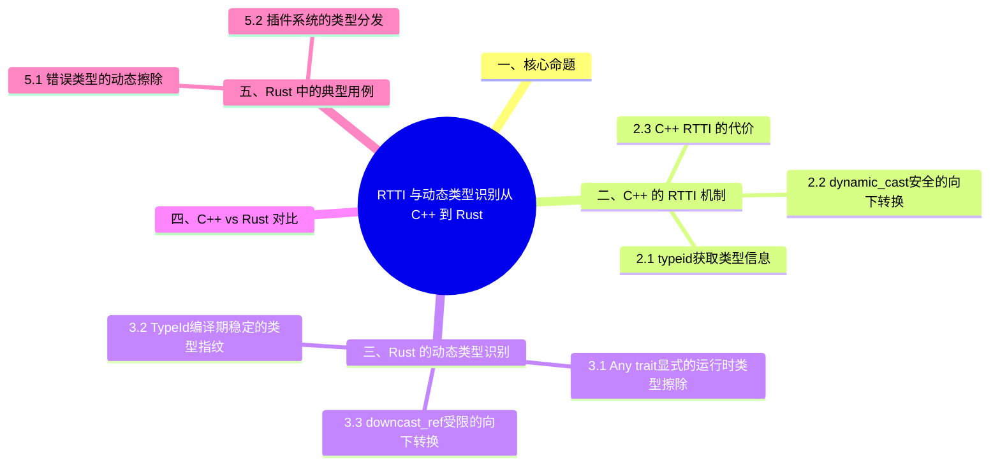

> **内容分级**: [参考级]
>
# RTTI 与动态类型识别：从 C++ 到 Rust
>
> **EN**: RTTI and Dynamic Type Identification
> **Summary**: Comparison of runtime type identification mechanisms between C++ (`typeid`, `dynamic_cast`) and Rust (`Any` trait, `TypeId`, `downcast_ref`).
> **Rust 版本**: 1.97.0+ (Edition 2024)
>
> **受众**: [进阶]
> **权威来源**: 本文件为 `concept/` 权威页。
> **层级分工声明**: 本文件虽位于 L2（`02_intermediate/`），但属**跨语言对比专题**（C++ ↔ Rust），保留在 L2 是因为其内容服务于对应 L2 概念（类型/宏（Macro）/错误处理/构造/可见性）的就近对照学习；L5 对比分析层索引与反链见 [`05_comparative/README.md`](../../05_comparative/README.md) §“L2 跨语言对比专题登记”。
> **层级**: L2 进阶概念
> **A/S/P 标记**: S+A
> **双维定位**: C×Ana
> **前置概念**: [Type Erasure](../../03_advanced/06_low_level_patterns/03_type_erasure.md) · [Type System](../../01_foundation/02_type_system/01_type_system.md) · [Generics](../01_generics/01_generics.md)
> **后置概念**: [Error Handling Deep Dive](../03_error_handling/02_error_handling_deep_dive.md) · [Advanced Traits](../00_traits/04_advanced_traits.md)
> **主要来源**: · [Pierce — Types and Programming Languages](https://www.cis.upenn.edu/~bcpierce/tapl/) · [System F](https://en.wikipedia.org/wiki/System_F) · [Itanium C++ ABI](https://itanium-cxx-abi.github.io/cxx-abi/abi.html) · [Rust Reference — Trait Objects](https://doc.rust-lang.org/reference/types/trait-object.html) · [Jung et al. — RustBelt: Securing the Foundations of Rust](https://plv.mpi-sws.org/rustbelt/popl18/)
>
> [TRPL Ch 17 — OOP Features of Rust](https://doc.rust-lang.org/book/ch17-02-trait-objects.html) ·
> [Rust std::any](https://doc.rust-lang.org/std/any/index.html) ·
> [Rust Reference — TypeId](https://doc.rust-lang.org/std/any/struct.TypeId.html) ·
> [quinedot — The `dyn Any` Guide](https://quinedot.github.io/rust-learning/dyn-any.html) ·
> [Rust How-to Book — Dynamic Typing](https://rust-how-to.org/patterns/dynamic-typing.html) ·
> [C++ Reference — typeid](https://en.cppreference.com/w/cpp/language/typeid) ·
> [C++ Reference — dynamic_cast](https://en.cppreference.com/w/cpp/language/dynamic_cast) ·
> [Brown CRP — RTTI and dynamic_cast](https://cel.cs.brown.edu/crp/idioms/rtti.html)
>
---

> **Bloom 层级**: L2-L5

---

## 📑 目录

- [RTTI 与动态类型识别：从 C++ 到 Rust](#rtti-与动态类型识别从-c-到-rust)
  - [📑 目录](#-目录)
  - [一、核心命题](#一核心命题)
  - [二、C++ 的 RTTI 机制](#二c-的-rtti-机制)
    - [2.1 `typeid`：获取类型信息](#21-typeid获取类型信息)
    - [2.2 `dynamic_cast`：安全的向下转换](#22-dynamic_cast安全的向下转换)
    - [2.3 C++ RTTI 的代价](#23-c-rtti-的代价)
  - [三、Rust 的动态类型识别](#三rust-的动态类型识别)
    - [3.1 `Any` trait：显式的运行时类型擦除](#31-any-trait显式的运行时类型擦除)
    - [3.2 `TypeId`：编译期稳定的类型指纹](#32-typeid编译期稳定的类型指纹)
    - [3.3 `downcast_ref`：受限的向下转换](#33-downcast_ref受限的向下转换)
  - [四、C++ vs Rust 对比](#四c-vs-rust-对比)
  - [五、Rust 中的典型用例](#五rust-中的典型用例)
    - [5.1 错误类型的动态擦除](#51-错误类型的动态擦除)
    - [5.2 插件系统的类型分发](#52-插件系统的类型分发)
  - [六、形式化视角](#六形式化视角)
  - [七、总结](#七总结)
  - [八、延伸阅读](#八延伸阅读)
  - [📋 关键属性](#-关键属性)
  - [🔗 概念关系](#-概念关系)
  - [国际权威参考 / International Authority References（P2 生态）](#国际权威参考--international-authority-referencesp2-生态)
  - [相关概念](#相关概念)
  - [⚠️ 反例与陷阱：`Any` 要求被转型类型为 `'static`](#️-反例与陷阱any-要求被转型类型为-static)
  - [🧭 思维导图（Mindmap）](#-思维导图mindmap)

---

## 一、核心命题

> **运行时（Runtime）类型识别（RTTI）不是动态类型的专利，而是静态类型系统（Type System）在运行时对类型信息的有限暴露。
> C++ 通过 `typeid` 和 `dynamic_cast` 提供内置 RTTI；Rust 没有内置 RTTI 语法，而是通过 `std::any::Any` trait 和 `std::any::TypeId` 提供显式、受限的运行时（Runtime）类型擦除与向下转换能力。**

---

## 二、C++ 的 RTTI 机制

本节聚焦「C++ 的 RTTI 机制」，覆盖`typeid`：获取类型信息、`dynamic_cast`：安全的向下转换与C++ RTTI 的代价。论述顺序由定义到边界：先明确「C++ 的 RTTI 机制」在「RTTI 与动态类型识别：从 C++ 到 Rust」中的确切含义与适用范围，再给出可核验的例证或数据，最后标注它与相邻主题的分界线。读完后应能用一句话复述「C++ 的 RTTI 机制」的判定标准，并指出它在全页论证链中的位置。

### 2.1 `typeid`：获取类型信息

```cpp
#include <typeinfo>
#include <iostream>

int main() {
    int x = 42;
    const std::type_info& ti = typeid(x);
    std::cout << ti.name() << std::endl; // 实现定义的名称，如 "i"
}
```

`typeid` 对多态类型返回动态类型信息，对非多态类型返回静态类型信息。

### 2.2 `dynamic_cast`：安全的向下转换

```cpp
struct Base { virtual ~Base() = default; };
struct Derived : Base { int value = 42; };

Base* b = new Derived();
Derived* d = dynamic_cast<Derived*>(b);
if (d) {
    std::cout << d->value << std::endl;
}
```

- `dynamic_cast` 需要至少一个虚函数（即多态类型） (Source: [cppreference — dynamic_cast](https://en.cppreference.com/w/cpp/language/dynamic_cast))。
- 转换失败时，指针版本返回 `nullptr`，引用（Reference）版本抛出 `std::bad_cast` (Source: [cppreference — dynamic_cast](https://en.cppreference.com/w/cpp/language/dynamic_cast))。
- 实现依赖于 vtable 中的 RTTI 信息 (Source: [cppreference — typeid](https://en.cppreference.com/w/cpp/language/typeid))。

### 2.3 C++ RTTI 的代价

- **运行时（Runtime）开销**：每个多态类需要在 vtable 中存储 `type_info` 指针。
- **二进制体积**：类型名称字符串会进入二进制。
- **安全风险**：`type_info::name()` 的实现定义名称不可移植。

---

## 三、Rust 的动态类型识别

Rust 的运行时类型识别是**显式 opt-in** 机制，与 C++ RTTI 的「默认开启、全局成本」形成对比。三个构件：

1. **`Any` trait**：所有 `'static` 类型自动实现——`Box<dyn Any>` 是类型擦除的容器，提供 `is::<T>()`/`downcast()` 系列方法。`'static` 约束是关键限制：含非静态引用的类型无法擦除（防止悬垂的类型识别）；
2. **`TypeId`**：类型的编译期唯一指纹（128-bit，跨 crate 稳定于同一编译）——相等比较即类型相等，**无子类型关系**（Rust 无继承，`TypeId` 不做 `dynamic_cast` 式的层次查询）；
3. **`downcast_ref`**：受限的向下转换——只在「擦除前类型 == T」时成功，失败返回 `Option`/`Result`。

设计哲学：RTTI 的成本（类型信息表）只由使用 `Any` 的类型承担；类型识别是工具而非范型——滥用 `Any` 模拟动态类型通常是设计信号（应考虑 enum 或 trait 对象）。

### 3.1 `Any` trait：显式的运行时类型擦除

Rust 通过 `dyn Any` 提供类似 `void*` + RTTI 的能力，但完全受类型系统（Type System）约束 (Source: [Rust std::any — Any](https://doc.rust-lang.org/std/any/trait.Any.html), [quinedot — The `dyn Any` Guide](https://quinedot.github.io/rust-learning/dyn-any.html))：

```rust
use std::any::{Any, TypeId};

fn print_if_string(value: &dyn Any) {
    if let Some(s) = value.downcast_ref::<String>() {
        println!("It's a string: {}", s);
    } else {
        println!("Not a string");
    }
}

fn main() {
    let s = String::from("hello");
    print_if_string(&s);
    print_if_string(&42_i32);
}
```

### 3.2 `TypeId`：编译期稳定的类型指纹

```rust
use std::any::TypeId;

fn main() {
    let id_i32 = TypeId::of::<i32>();
    let id_string = TypeId::of::<String>();
    assert_ne!(id_i32, id_string);
}
```

`TypeId` 是一个不透明的、可比较的值，用于在运行时（Runtime）判断两个类型是否相同 (Source: [Rust Reference — TypeId](https://doc.rust-lang.org/std/any/struct.TypeId.html))。

### 3.3 `downcast_ref`：受限的向下转换

```rust
use std::any::Any;

fn extract_string(value: Box<dyn Any>) -> Option<String> {
    value.downcast::<String>().ok().map(|b| *b)
}
```

- `downcast` 只能转换回原始类型。
- 失败时返回 `Err`，不会 panic（除非使用 `.downcast_ref().unwrap()`）。
- 不需要虚函数表中的 RTTI 信息；类型标识来自单态化（Monomorphization）生成的 `TypeId`。

---

## 四、C++ vs Rust 对比

| 维度 | C++ | Rust |
|:---|:---|:---|
| 核心机制 | `typeid` / `dynamic_cast` | `Any` trait / `TypeId` / `downcast_ref` |
| 语法位置 | 语言内置 | 标准库 trait |
| 多态要求 | 需要虚函数 | 不需要；任何 `'static` 类型都可擦除 |
| 转换失败 | 指针返回 `nullptr`，引用（Reference）抛异常 | 返回 `Option` / `Result` |
| 运行时（Runtime）开销 | vtable 中存储 `type_info` | 单态化（Monomorphization）生成 `TypeId`，按需付费 |
| 类型安全 | 编译期无法保证转换成功 | `downcast_ref` 返回 `Option`，强制处理失败 |
| 跨 crate | 依赖 ABI 兼容的 `type_info` | `TypeId` 在同一编译单元内稳定，跨进程不保证 |

---

## 五、Rust 中的典型用例

`Any` 在 Rust 中有两个公认的合法用例，超出此范围应警惕：

- **错误类型的动态擦除**：`Box<dyn Error + Send + Sync>` 让应用层用统一错误类型，`downcast_ref::<SpecificError>()` 在需要时恢复具体类型（如 `io::Error` 的 `get_ref`/`downcast`）——这是 anyhow/eyre 的底层机制；
- **插件系统的类型分发**：插件注册表以 `TypeId` 为键存储 `Box<dyn Any>`（如 `typemap`/`http::Extensions`），请求方按类型取回——本质是把「类型集合开放」的约束从编译期移到运行期，代价是错误从编译错误变为运行期 `None`。

反模式警示：用 `Any` 实现「函数重载」（按运行时类型分派逻辑）——这在 Rust 中应优先用 `enum`（封闭集合）或泛型（编译期分派）；`Any` 分派只在类型集合**运行时开放**（插件、FFI 边界）时合理。

### 5.1 错误类型的动态擦除

```rust
use std::any::Any;
use std::error::Error;

fn cause_as<'a, T: Error + 'static>(err: &'a (dyn Error + 'static)) -> Option<&'a T> {
    err.downcast_ref::<T>()
}
```

### 5.2 插件系统的类型分发

```rust
use std::any::{Any, TypeId};
use std::collections::HashMap;

struct PluginRegistry {
    plugins: HashMap<TypeId, Box<dyn Any>>,
}

impl PluginRegistry {
    fn register<T: Any>(&mut self, plugin: T) {
        self.plugins.insert(TypeId::of::<T>(), Box::new(plugin));
    }

    fn get<T: Any>(&self) -> Option<&T> {
        self.plugins.get(&TypeId::of::<T>())?.downcast_ref::<T>()
    }
}
```

---

## 六、形式化视角

C++ 的 `dynamic_cast` 基于**子类型关系**的运行时（Runtime）反射：如果对象的动态类型是目标类型的子类型，则转换成功。Rust 的 `Any` 基于**类型相等**的运行时反射：只有当擦除前的类型与目标类型完全相同时，转换才成功。

> **关键洞察**：Rust 不提供子类型向下转换（`dyn Base` → `dyn Derived`），因为这会破坏借用（Borrowing）检查器的静态保证。`Any` 只支持"类型相等"的恢复，而不是"子类型包含"的恢复。

形式化地：

- C++ `dynamic_cast<T>(p)`：运行时检查 `dynamic_type(*p) <: T`。
- Rust `Any::downcast_ref::<T>()`：运行时检查 `erased_type == T`。

其中 `<:` 是子类型关系，`==` 是类型等价关系。

---

## 七、总结

- **L1**：Rust 用 `Any` + `TypeId` + `downcast_ref` 替代 C++ 的 `typeid` / `dynamic_cast`，且更类型安全。
- **L2**：C++ RTTI 依赖多态和 vtable，Rust `Any` 依赖单态化（Monomorphization）类型指纹；二者在子类型 vs 类型相等的语义上不同。
- **L3**：RTTI 是静态类型系统（Type System）向运行时的有限"泄漏"；Rust 通过 trait 对象和生命周期（Lifetimes）约束，将这种泄漏控制在显式、可审计的边界内。

---

## 八、延伸阅读

- [TRPL: Trait Objects](https://doc.rust-lang.org/book/ch17-02-trait-objects.html)
- [Rust std::any documentation](https://doc.rust-lang.org/std/any/index.html)
- [Rust Reference: TypeId](https://doc.rust-lang.org/std/any/struct.TypeId.html)
- [quinedot — The `dyn Any` Guide](https://quinedot.github.io/rust-learning/dyn-any.html)
- [Rust How-to Book — Dynamic Typing](https://rust-how-to.org/patterns/dynamic-typing.html)
- [cppreference: typeid](https://en.cppreference.com/w/cpp/language/typeid)
- [cppreference: dynamic_cast](https://en.cppreference.com/w/cpp/language/dynamic_cast)
- [Brown CRP: RTTI and dynamic_cast](https://cel.cs.brown.edu/crp/idioms/rtti.html)

---

> **权威来源**: [Rust Reference — Trait Objects](https://doc.rust-lang.org/reference/types/trait-object.html), [Rust std::any](https://doc.rust-lang.org/std/any/index.html), [Rust Reference — TypeId](https://doc.rust-lang.org/std/any/struct.TypeId.html), [quinedot — The `dyn Any` Guide](https://quinedot.github.io/rust-learning/dyn-any.html), [cppreference — typeid](https://en.cppreference.com/w/cpp/language/typeid), [cppreference — dynamic_cast](https://en.cppreference.com/w/cpp/language/dynamic_cast)
> **权威来源对齐变更日志**: 2026-07-04 创建，对齐 Rust 1.97.0 (Edition 2024)
> **状态**: ✅ 权威来源对齐完成

---

## 📋 关键属性

| 属性 | 取值 / 判定 | 依据 |
|---|---|---|
| C++ RTTI | `typeid` / `dynamic_cast` 依赖 vtable 类型信息，有运行时开销 | 本文 §二 |
| Rust `Any` | 显式类型擦除：仅 `'static` 类型可擦除 | 本文 §3.1 |
| `TypeId` | 编译期稳定的类型指纹；跨编译版本不保证稳定 | 本文 §3.2 |
| 向下转换 | `downcast_ref` / `downcast_mut` / `downcast` 受限且安全 | 本文 §3.3 |
| 默认成本 | Rust 默认无 RTTI，按需显式引入，零成本原则保持 | 本文 §四 |

## 🔗 概念关系

- **上位（is-a）**：运行时类型识别（RTTI）的跨语言机制对比。
- **下位（实例）**：C++ `typeid`/`dynamic_cast`、Rust `Any`/`TypeId`/`downcast_*`。
- **对偶**：静态分派（泛型单态化）⇄ 动态类型识别（类型擦除 + 运行时下转）。
- **组合**：与 [类型擦除](../../03_advanced/06_low_level_patterns/03_type_erasure.md)、[错误处理深入](../03_error_handling/02_error_handling_deep_dive.md)（错误类型的动态擦除）组合。
- **依赖**：依赖 [类型系统基础](../../01_foundation/02_type_system/01_type_system.md)。

---

## 国际权威参考 / International Authority References（P2 生态）

> 依据 `AGENTS.md` §2「对齐网络国际化权威内容」补充：仅追加已验证可达的权威链接，不改动正文事实。

- **P2 生态/社区**: [docs.rs/downcast-rs — 生态权威 API 文档（`Any`/trait object 向下转型的生态实践）](https://docs.rs/downcast-rs)（2026-07-12 验证 HTTP 200）

---

## 相关概念

- [对应测验](../09_quizzes/30_quiz_cpp_rust_foundations.md) — C/C++ → Rust 工程层基础对比（RTTI、宏、异常安全、构造、move 语义）

---

## ⚠️ 反例与陷阱：`Any` 要求被转型类型为 `'static`

**反例**（rustc 1.97 实测编译失败，无错误码：lifetime may not live long enough））：

```rust,compile_fail
use std::any::Any;
fn f<'a>(x: &'a dyn Any) -> bool {
    x.downcast_ref::<&'a i32>().is_some()
}
fn main() {}
```

`downcast_ref::<T>` 要求 `T: 'static`；含非 `'static` 生命周期的引用类型无法通过约束。Rust 的 RTTI 刻意排除含生命周期的类型，避免运行期类型信息与借用检查脱节。

**修正**：

```rust
use std::any::Any;
fn f(x: &dyn Any) -> bool {
    x.downcast_ref::<i32>().is_some()
}
fn main() {}
```

## 🧭 思维导图（Mindmap）


