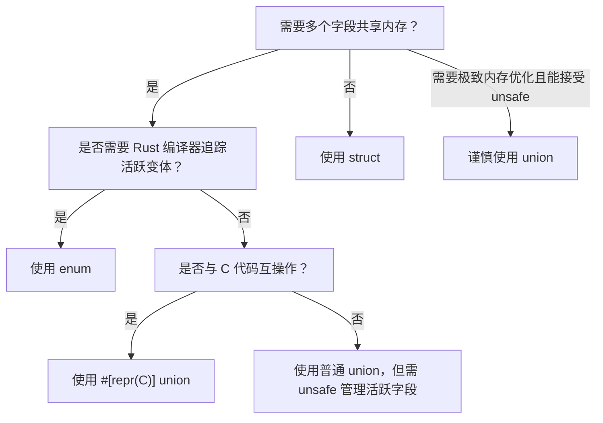

> **内容分级**: [进阶]
> **Rust 版本**: 1.97.0+ (Edition 2024)
> **本节关键术语**: 联合体（Union） · 字段（Field） · 布局（Layout） · Drop 语义 · 内联汇编（Inline Assembly） · C 互操作（FFI） · 未初始化内存（Uninitialized Memory）

# 联合体（Unions）
>
> **EN**: Unions
> **Summary**: A `union` in Rust is a nominal sum type where all fields share the same memory location. It enables C-compatible layouts and memory-efficient representations but requires `unsafe` to read fields, as the compiler cannot track which variant is active.
>
> **受众**: [进阶]
> **层级**: L2 进阶概念
> **Bloom 层级**: L2-L3
> **A/S/P 标记**: **S** — Structure
> **双维定位**: C×App
> **前置概念**: [Type System Basics](../../01_foundation/02_type_system/01_type_system.md) · [Unsafe Rust](../../03_advanced/02_unsafe/01_unsafe.md) · [FFI](../../03_advanced/04_ffi/01_rust_ffi.md)
> **后置概念**: [Interior Mutability](../02_memory_management/02_interior_mutability.md) · [Custom Allocators](../../03_advanced/06_low_level_patterns/01_custom_allocators.md) · [Memory Layout](../../04_formal/05_rustc_internals/08_type_layout.md)
>
> **主要来源**: [The Rust Reference — Unions](https://doc.rust-lang.org/reference/items/unions.html) ·
> [The Rustonomicon — Unions](https://doc.rust-lang.org/nomicon/other-reprs.html) ·
> [Unsafe Code Guidelines — Unions](https://rust-lang.github.io/unsafe-code-guidelines/)
>
> **权威来源**: 本文件为 `concept/` 权威页。

---

> **变更日志**:
>
> - v1.0 (2026-07-04): 初始创建

## 📑 目录

---

- [联合体（Unions）](#联合体unions)
  - [📑 目录](#-目录)
  - [一、权威定义（Definition）](#一权威定义definition)
    - [1.1 形式化定义](#11-形式化定义)
    - [1.2 直觉解释](#12-直觉解释)
  - [二、概念属性矩阵](#二概念属性矩阵)
  - [三、技术细节与示例](#三技术细节与示例)
    - [3.1 基本用法](#31-基本用法)
    - [3.2 C 兼容联合体](#32-c-兼容联合体)
    - [3.3 联合体与枚举的区别](#33-联合体与枚举的区别)
  - [四、示例与反例](#四示例与反例)
    - [4.1 正确示例：与 C 结构体互操作](#41-正确示例与-c-结构体互操作)
    - [4.2 反例：读取非活跃字段](#42-反例读取非活跃字段)
    - [4.3 反例：为非 Copy 字段实现 Copy](#43-反例为非-copy-字段实现-copy)
  - [五、反命题与边界分析](#五反命题与边界分析)
    - [5.1 反命题树](#51-反命题树)
    - [5.2 边界极限](#52-边界极限)
  - [六、边界测试](#六边界测试)
    - [6.1 边界测试：`ManuallyDrop` 与联合体](#61-边界测试manuallydrop-与联合体)
    - [6.2 边界测试：联合体大小](#62-边界测试联合体大小)
  - [七、判断推理与决策树](#七判断推理与决策树)
    - [7.1 何时使用 `union`？](#71-何时使用-union)
    - [7.2 与其他概念的辨析](#72-与其他概念的辨析)
  - [八、逆向推理链（Backward Reasoning）](#八逆向推理链backward-reasoning)
  - [九、来源与延伸阅读](#九来源与延伸阅读)
  - [嵌入式测验（Embedded Quiz）](#嵌入式测验embedded-quiz)
    - [测验 1：联合体 vs 枚举](#测验-1联合体-vs-枚举)
    - [测验 2：联合体的 Drop 语义](#测验-2联合体的-drop-语义)
  - [认知路径](#认知路径)
  - [国际权威参考 / International Authority References（P1 学术 · P2 生态）](#国际权威参考--international-authority-referencesp1-学术--p2-生态)

---

## 一、权威定义（Definition）

> **联合体（Union）** 是一种复合类型，其所有字段共享同一段内存。在任意时刻，联合体实例只能保存其中一个字段的值，但编译器不会自动追踪当前哪个字段是“活跃”的。
>
> [来源: [The Rust Reference — Unions](https://doc.rust-lang.org/reference/items/unions.html)]

### 1.1 形式化定义

```text
union UnionName {
    field1: Type1,
    field2: Type2,
    ...
}
```

- 联合体的内存大小等于其最大字段的大小（含对齐填充）(Source: [The Rust Reference — Type Layout](https://doc.rust-lang.org/reference/type-layout.html))。
- 读取任何字段都需要 `unsafe` 块，因为 Rust 无法保证该字段当前是活跃字段 (Source: [The Rust Reference — Unions](https://doc.rust-lang.org/reference/items/unions.html))。
- 联合体可以实现 `Copy`、 `Drop`、 trait 等，但字段类型必须满足相应约束 (Source: [The Rustonomicon — Unions](https://doc.rust-lang.org/nomicon/other-reprs.html))。

### 1.2 直觉解释

联合体就像一个“可变形状的容器”：你可以把不同的东西放进去，但容器本身只有一份空间。你不能同时看到所有形状；你必须告诉 Rust：“我现在把它当作形状 A 来读。” 这需要你自己保证没有搞错。

> [💡 原创分析](../../00_meta/00_framework/methodology.md)

---

## 二、概念属性矩阵

| 属性 | 说明 | Rust 表达 | 权威来源 |
|:---|:---|:---|:---|
| 内存共享 | 所有字段重叠 | `union U { a: i32, b: f32 }` | Reference |
| 大小 | 最大字段大小（含对齐） | `std::mem::size_of::<U>()` | Reference |
| 读取 | 需要 `unsafe` | `unsafe { u.a }` | Reference |
| 写入 | 安全（改变活跃字段） | `u.a = 1;` | Reference |
| Drop | 默认不 drop 字段；可手动实现 | `impl Drop for U { ... }` | Rustonomicon |
| Copy | 仅当所有字段都是 `Copy` | `#[derive(Copy, Clone)]` | Reference |
| C 兼容 | 布局与 C union 兼容 | `#[repr(C)]` | Reference |

---

## 三、技术细节与示例

本节从基本用法、C 兼容联合体与联合体与枚举的区别切入，剖析「技术细节与示例」的核心内容。

### 3.1 基本用法

```rust
union IntOrFloat {
    i: i32,
    f: f32,
}

fn main() {
    let mut u = IntOrFloat { i: 1 };

    // 安全写入
    u.f = 3.14;

    // 不安全读取
    unsafe {
        println!("as float: {}", u.f);
        // 下面这行是 UB，因为当前活跃字段是 f，不是 i
        // println!("as int: {}", u.i);
    }
}
```

> **关键洞察**: 写入联合体字段是安全的，因为它只是改变活跃字段；读取非活跃字段是 UB（undefined behavior），需要开发者自己保证正确性。
> [来源: [The Rust Reference — Unions](https://doc.rust-lang.org/reference/items/unions.html)]

### 3.2 C 兼容联合体

```rust
#[repr(C)]
union CUnion {
    byte: u8,
    word: u16,
    dword: u32,
}

fn main() {
    let u = CUnion { dword: 0x1234_5678 };
    unsafe {
        println!("byte: 0x{:02x}", u.byte);
    }
}
```

> **关键洞察**: `#[repr(C)]` 保证联合体布局与 C 语言一致，是 FFI 互操作的基础。
> [来源: [The Rust Reference — Unions](https://doc.rust-lang.org/reference/items/unions.html)]

### 3.3 联合体与枚举的区别

| 特性 | `union` | `enum` |
|:---|:---|:---|
| 标签 | 无标签 | 有标签（discriminant） |
| 安全性 | 读取需 unsafe | 模式匹配（Pattern Matching）安全 |
| 内存 | 最大字段大小 | 标签 + 最大变体大小 |
| 用途 | FFI、内存优化 | 代数数据类型、状态机 |
| 编译器追踪 | 不追踪活跃字段 | 追踪当前变体 |

---

## 四、示例与反例

本节围绕「示例与反例」展开，依次讨论正确示例：与 C 结构体互操作、反例：读取非活跃字段与反例：为非 Copy 字段实现 Copy。

### 4.1 正确示例：与 C 结构体互操作

```rust
#[repr(C)]
union Value {
    int: i32,
    float: f32,
}

#[repr(C)]
struct TaggedValue {
    tag: u8,
    value: Value,
}

fn main() {
    let tv = TaggedValue {
        tag: 1,
        value: Value { float: 2.5 },
    };
    unsafe {
        if tv.tag == 1 {
            println!("float: {}", tv.value.float);
        }
    }
}
```

### 4.2 反例：读取非活跃字段

```rust
union IntOrFloat {
    i: i32,
    f: f32,
}

fn main() {
    let mut u = IntOrFloat { i: 42 };
    u.f = 3.14;

    unsafe {
        // UB：i 不是活跃字段
        println!("{}", u.i);
    }
}
```

> **错误诊断**: 代码可以编译，但运行时（Runtime）行为未定义。
> **修正**: 维护一个外部标签（如 C 的 tagged union），或仅读取最后写入的字段。
> [来源: [Unsafe Code Guidelines — Unions](https://rust-lang.github.io/unsafe-code-guidelines/)]

### 4.3 反例：为非 Copy 字段实现 Copy

```rust,compile_fail
union WithString {
    s: String,
    n: i32,
}

impl Copy for WithString {}

fn main() {}
```

> **错误诊断**: `error[E0204]: the trait`Copy` may not be implemented for this type; the type `String` does not implement `Copy``
> **修正**: 只包含 `Copy` 类型的字段，或使用 `ManuallyDrop` 管理非 `Copy` 字段。
> [来源: [The Rust Reference — Unions](https://doc.rust-lang.org/reference/items/unions.html)]

---

## 五、反命题与边界分析

本节从反命题树 与 边界极限 两个层面剖析「反命题与边界分析」。

### 5.1 反命题树

> **反命题 1**: "联合体与枚举相同" ⟹ 不成立。枚举有标签，联合体没有；枚举模式匹配（Pattern Matching）安全，联合体读取需 unsafe。
> **反命题 2**: "联合体可以自动判断活跃字段" ⟹ 不成立。Rust 编译器不追踪联合体的活跃字段，必须由程序员维护。
> **反命题 3**: "联合体字段默认会被 drop" ⟹ 不成立。联合体默认不会自动 drop 字段；需要手动实现 `Drop` 或使用 `ManuallyDrop`。
> **反命题 4**: "联合体总是比枚举更高效" ⟹ 不成立。虽然联合体节省标签空间，但安全性代价高，仅在明确需要时使用。

### 5.2 边界极限

| 边界 | 现状 | 理论极限 | 工程意义 |
|:---|:---|:---|:---|
| 字段类型 | 可包含非 Copy | 需要手动 drop | 使用 `ManuallyDrop<T>` 避免重复 drop |
| 活跃字段追踪 | 无 | 外部标签 | 常见 tagged union 模式 |
| 模式匹配 | 不支持 | 需 unsafe | 不能对 union 使用 `match` |
| 类型安全 | 低 | 与 enum 相同 | 优先使用 enum，除非 FFI 或内存极致优化 |

---

## 六、边界测试

「边界测试」部分包含边界测试：`ManuallyDrop` 与联合体 与 边界测试：联合体大小 两条主线，本节依次说明。

### 6.1 边界测试：`ManuallyDrop` 与联合体

```rust
use std::mem::ManuallyDrop;

union MaybeString {
    s: ManuallyDrop<String>,
    n: i32,
}

fn main() {
    let mut u = MaybeString {
        s: ManuallyDrop::new("hello".to_string()),
    };

    unsafe {
        // 读取字符串后，必须避免再次 drop
        let s = ManuallyDrop::take(&mut u.s);
        println!("{}", s);
    }
    // u 不再被安全使用
}
```

> **关键洞察**: `ManuallyDrop` 允许联合体内包含非 `Copy` 类型而不自动 drop，但开发者必须手动管理生命周期（Lifetimes）。
> [来源: [Rustonomicon — Unions](https://doc.rust-lang.org/nomicon/other-reprs.html)]

### 6.2 边界测试：联合体大小

```rust
union SmallOrLarge {
    a: u8,
    b: u64,
}

fn main() {
    println!("size: {}", std::mem::size_of::<SmallOrLarge>());
    println!("align: {}", std::mem::align_of::<SmallOrLarge>());
}
```

---

## 七、判断推理与决策树

「判断推理与决策树」部分包含何时使用 `union`？ 与 与其他概念的辨析 两条主线，本节依次说明。

### 7.1 何时使用 `union`？



### 7.2 与其他概念的辨析

| 场景 | 推荐选择 | 不推荐 | 理由 |
|:---|:---|:---|:---|
| 代数数据类型 | `enum` | `union` | enum 安全且有标签 |
| C 结构体互操作 | `#[repr(C)] union` | `enum` | C 期望无标签内存布局 |
| 节省标签内存 | `union` + 外部标签 | `enum` | 联合体无 discriminant |
| 安全状态机 | `enum` | `union` | enum 模式匹配 exhaustiveness |

---

## 八、逆向推理链（Backward Reasoning）

> **从编译错误/运行时（Runtime）症状反推定理链**:
>
> ```text
> error[E0133] 读取 union 字段需要 unsafe ⟸ 试图安全读取 union 字段 ⟸ 包裹 unsafe 并确保读取的是活跃字段
> 运行时 UB/数据损坏 ⟸ 读取了非活跃 union 字段 ⟸ 维护外部标签或使用 enum
> error[E0204] 不能为 union 实现 Copy ⟸ 字段包含非 Copy 类型 ⟸ 使用 ManuallyDrop 或移除该字段
> ```
>
> **诊断映射**:
>
> - `error[E0133]: access to union field is unsafe and requires unsafe function or block` → 读取 union 字段必须使用 `unsafe`。
> - 内存泄漏或 double free → union 字段未正确管理 drop；考虑 `ManuallyDrop`。
> - FFI 调用结果异常 → 检查 `#[repr(C)]` 和字段顺序是否与 C 定义一致。

---

## 九、来源与延伸阅读

- [The Rust Reference — Unions](https://doc.rust-lang.org/reference/items/unions.html)
- [The Rustonomicon — Unions](https://doc.rust-lang.org/nomicon/other-reprs.html)
- [Unsafe Code Guidelines — Unions](https://rust-lang.github.io/unsafe-code-guidelines/)
- [The Rust Reference — Type Layout](https://doc.rust-lang.org/reference/type-layout.html)

---

## 嵌入式测验（Embedded Quiz）

「嵌入式测验（Embedded Quiz）」部分包含测验 1：联合体 vs 枚举 与 测验 2：联合体的 Drop 语义 两条主线，本节依次说明。

### 测验 1：联合体 vs 枚举

**题目**: 联合体（`union`）与枚举（`enum`）的主要区别是什么？

A. 联合体可以有方法，枚举不可以
B. 联合体所有字段共享内存，枚举有标签并追踪活跃变体
C. 联合体更安全，枚举需要 unsafe
D. 联合体只能用于 FFI

<details>
<summary>✅ 答案与解析</summary>

**答案**: B

**解析**: 联合体的所有字段共享同一段内存，编译器不追踪哪个字段活跃；枚举有 discriminant，模式匹配时编译器知道当前变体。联合体读取字段需要 unsafe，枚举不需要。

</details>

### 测验 2：联合体的 Drop 语义

**题目**: 默认情况下，包含 `String` 字段的联合体在离开作用域时会自动 drop 该字段吗？

A. 会
B. 不会
C. 只有在 unsafe 块中才会
D. 取决于是否实现 Copy

<details>
<summary>✅ 答案与解析</summary>

**答案**: B

**解析**: 联合体默认不会自动 drop 其字段。若字段需要 drop，应使用 `ManuallyDrop<T>` 并手动管理生命周期（Lifetimes），否则可能导致内存泄漏或重复 drop。

</details>

---

## 认知路径

> **认知路径**: 本节从“多个字段共享同一块内存”的需求出发，建立 union 的概念，区分其与 enum/struct 的本质差异，强调 unsafe 和活跃字段管理，最终形成在 FFI、内存优化等场景中安全使用 union 的能力。
>
> 1. **问题识别**: 需要与 C 互操作或极致压缩内存表示。
> 2. **概念建立**: `union` 让所有字段共享内存，无标签。
> 3. **机制推理**: 写入安全，读取需 unsafe；编译器不追踪活跃字段。
> 4. **边界辨析**: union vs enum vs struct；Copy/Drop 约束；`ManuallyDrop`。
> 5. **迁移应用**: 在 FFI、 tagged union、内存优化中谨慎使用 union。

---

> **权威来源**: [The Rust Reference](https://doc.rust-lang.org/reference/introduction.html), [The Rustonomicon](https://doc.rust-lang.org/nomicon/index.html), [Unsafe Code Guidelines](https://rust-lang.github.io/unsafe-code-guidelines/)
> **权威来源对齐变更日志**: 2026-07-04 创建 来源: Rust 1.97.0 Reference、[Rustonomicon](https://doc.rust-lang.org/nomicon/index.html)、Unsafe Code Guidelines 对齐
> **状态**: ✅ 权威来源对齐完成

---

## 国际权威参考 / International Authority References（P1 学术 · P2 生态）

> 依据 `AGENTS.md` §2「对齐网络国际化权威内容」补充：仅追加已验证可达的权威链接，不改动正文事实。

- **P1 学术/形式化**: [Cardelli & Wegner: On Understanding Types, Data Abstraction, and Polymorphism (ACM Comput. Surv. 1985)](https://dl.acm.org/doi/10.1145/6041.6042)
- **P2 生态/社区**: [Rust 官方博客 — Rust 1.19 发布公告（`union` 类型首次稳定化）](https://blog.rust-lang.org/2017/07/20/Rust-1.19.html)（2026-07-12 验证 HTTP 200）
