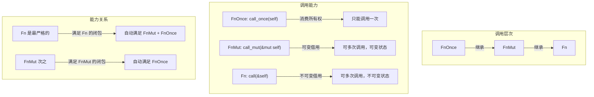
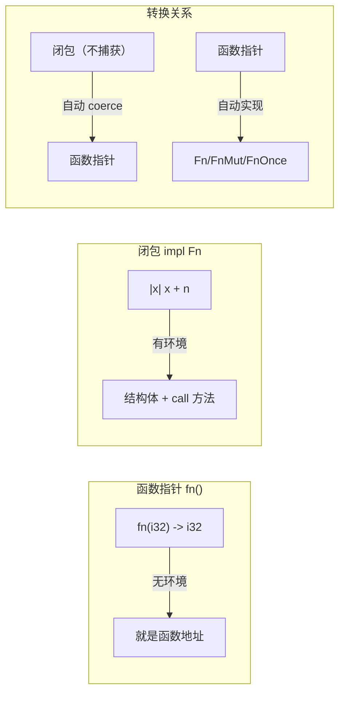
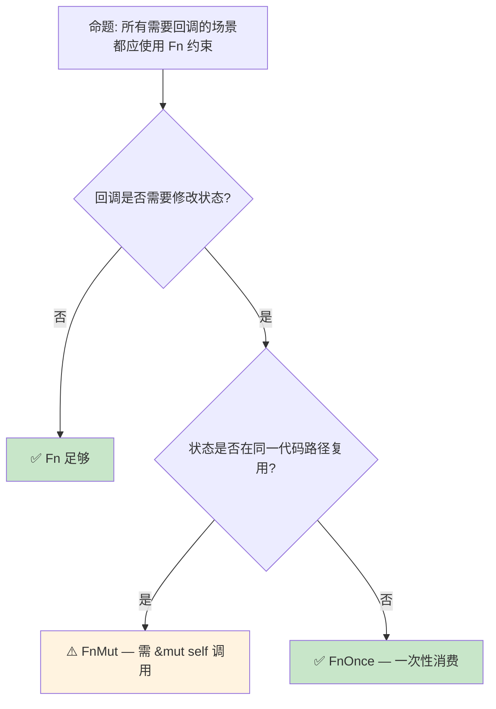

> **内容分级**: [综述级]
> **本节关键术语**: 闭包类型 (Closure Type) · Fn · FnMut · FnOnce · 捕获模式 (Capture Mode) · move 闭包（Closures） — [完整对照表](../../00_meta/01_terminology/terminology_glossary.md)
>
# 闭包类型系统：Fn、FnMut、FnOnce 的捕获语义
>
> **EN**: Closure Types
> **Summary**: Rust closure types, capture modes, `Fn`/`FnMut`/`FnOnce` traits, and lifetime interactions.
> **Rust 版本**: 1.97.0+ (Edition 2024)
> **受众**: [进阶]
> **Bloom 层级**: L2-L3
> **权威来源**: 本文件为 `concept/` 权威页。
> **A/S/P 标记**: **S** — Structure
> **双维定位**: C×Und — 理解 Fn/FnMut/FnOnce 的语义差异
> **定位**: 深入分析 Rust 闭包（Closures）的**类型系统（Type System）**——`Fn`、`FnMut`、`FnOnce` 三者的捕获规则、自动 trait 推导、以及闭包与函数指针的本质区别。
> **前置概念**: [Traits](../00_traits/01_traits.md) ·
> [Ownership](../../01_foundation/01_ownership_borrow_lifetime/01_ownership.md) ·
> [Borrowing](../../01_foundation/01_ownership_borrow_lifetime/02_borrowing.md)
> **后置概念**: [Async](../../03_advanced/01_async/02_async.md) ·
> [Generics](../01_generics/02_generics.md)

---

> **来源**: [Rust Reference — Closure Types](https://doc.rust-lang.org/reference/types/closure.html) · · [RustBelt — POPL 2018](https://plv.mpi-sws.org/rustbelt/popl18/) · [O'Hearn — Separation Logic and Shared Mutable Data](https://doi.org/10.1017/S0960129501001003) · [Brown University — Concepts in Rust Programming](https://cel.cs.brown.edu/crp/) · [Brown Interactive Rust Book](https://rust-book.cs.brown.edu/) · [Itanium C++ ABI](https://itanium-cxx-abi.github.io/cxx-abi/abi.html)
> [TRPL Ch13 — Closures](https://doc.rust-lang.org/book/ch13-01-closures.html) ·
> [Rustonomicon — Functions & Closures](https://doc.rust-lang.org/nomicon/hrtb.html) ·
> [RFC 1558 — Closures](https://github.com/rust-lang/rfcs/pull/1558)

## 📑 目录

- [闭包类型系统：Fn、FnMut、FnOnce 的捕获语义](#闭包类型系统fnfnmutfnonce-的捕获语义)
  - [📑 目录](#-目录)
  - [一、核心概念](#一核心概念)
    - [1.1 闭包的本质：匿名结构体](#11-闭包的本质匿名结构体)
    - [1.2 三种闭包 Trait](#12-三种闭包-trait)
    - [1.3 捕获方式：引用 vs 移动](#13-捕获方式引用-vs-移动)
  - [二、技术细节](#二技术细节)
    - [2.1 编译器自动推导规则](#21-编译器自动推导规则)
    - [2.2 闭包与函数指针](#22-闭包与函数指针)
    - [2.3 move 关键字的作用](#23-move-关键字的作用)
  - [三、使用模式](#三使用模式)
  - [四、反命题与边界分析](#四反命题与边界分析)
    - [4.1 反命题树](#41-反命题树)
    - [4.2 边界极限](#42-边界极限)
  - [五、常见陷阱](#五常见陷阱)
  - [六、来源与延伸阅读](#六来源与延伸阅读)
  - [判定表：闭包 Trait 约束与捕获判定](#判定表闭包-trait-约束与捕获判定)
  - [相关概念](#相关概念)
  - [逆向推理链（Backward Reasoning）](#逆向推理链backward-reasoning)
  - [权威来源索引](#权威来源索引)
  - [十、边界测试：闭包类型的编译错误](#十边界测试闭包类型的编译错误)
    - [10.1 边界测试：闭包类型推断与 `fn` 指针的不兼容（编译错误）](#101-边界测试闭包类型推断与-fn-指针的不兼容编译错误)
    - [10.2 边界测试：`dyn Fn` 与泛型闭包的性能差异（逻辑错误）](#102-边界测试dyn-fn-与泛型闭包的性能差异逻辑错误)
    - [10.3 边界测试：`Fn` trait 的自动实现与 `move` 闭包（编译错误）](#103-边界测试fn-trait-的自动实现与-move-闭包编译错误)
    - [10.4 边界测试：闭包递归的类型推断失败（编译错误）](#104-边界测试闭包递归的类型推断失败编译错误)
    - [10.5 边界测试：闭包在 `match` 臂中的类型推断（编译错误）](#105-边界测试闭包在-match-臂中的类型推断编译错误)
    - [10.6 边界测试：生命周期参数的不匹配返回](#106-边界测试生命周期参数的不匹配返回)
  - [实践](#实践)
  - [嵌入式测验（Embedded Quiz）](#嵌入式测验embedded-quiz)
    - [测验 1：Fn/FnMut/FnOnce 的选择（理解层）](#测验-1fnfnmutfnonce-的选择理解层)
    - [测验 2：`move` 关键字的作用（应用层）](#测验-2move-关键字的作用应用层)
    - [测验 3：闭包与函数指针（应用层）](#测验-3闭包与函数指针应用层)
    - [测验 4：闭包捕获模式推导（分析层）](#测验-4闭包捕获模式推导分析层)
    - [测验 5：闭包作为函数返回值（评价层）](#测验-5闭包作为函数返回值评价层)
  - [认知路径](#认知路径)
    - [核心推理链](#核心推理链)
    - [反命题与边界](#反命题与边界)
  - [补充：来自 `crates/c03_control_fn` 闭包参考的速查要点](#补充来自-cratesc03_control_fn-闭包参考的速查要点)
    - [闭包语法形式](#闭包语法形式)
    - [捕获规则与 Trait 实现](#捕获规则与-trait-实现)
    - [`move` 关键字](#move-关键字)
    - [闭包生命周期注意点](#闭包生命周期注意点)
  - [国际权威参考 / International Authority References（P1 学术 · P2 生态）](#国际权威参考--international-authority-referencesp1-学术--p2-生态)

---

## 一、核心概念
>
>

### 1.1 闭包的本质：匿名结构体
>

Rust 的闭包不是函数，而是**编译器自动生成的匿名结构体（Struct）** (Source: [Rust Reference — Closure Types](https://doc.rust-lang.org/reference/types/closure.html))：

```rust,ignore
// 概念示例：编译器如何展开闭包
let x = 5;
let closure = |y| x + y;

// 编译器展开为类似:
struct __Closure_1<'a> {
    x: &'a i32,  // 捕获的环境变量
}

impl<'a> Fn<(i32,)> for __Closure_1<'a> {
    type Output = i32;
    fn call(&self, args: (i32,)) -> i32 {
        *self.x + args.0
    }
}
```

> **核心洞察**: 闭包的"魔法"在于编译器自动推断**捕获哪些变量**、**以什么方式捕获**（引用（Reference）/移动）、以及**实现哪个 Trait**（Fn/FnMut/FnOnce）。
> [来源: [Rust Reference — Closure Types](https://doc.rust-lang.org/reference/types/closure.html)]

---

### 1.2 三种闭包 Trait
>



> **认知功能**: 此图展示三种闭包 Trait 的**继承关系和能力层级**——Fn 最严格（只读），FnMut 次之（可修改），FnOnce 最宽松（可消费）。
> [来源: [TRPL](https://doc.rust-lang.org/book/ch13-01-closures.html)]
> **使用建议**: 泛型（Generics）约束优先使用最严格的 Trait（Fn → FnMut → FnOnce），以获得最大的调用灵活性。
> **关键洞察**: `Fn: FnMut: FnOnce` 形成**子类型关系**——如果一个闭包是 `Fn`，它自动也是 `FnMut` 和 `FnOnce`。反之不成立。
> [来源: [TRPL Ch13 — Closures](https://doc.rust-lang.org/book/ch13-01-closures.html)]

---

### 1.3 捕获方式：引用 vs 移动
>

```text
闭包捕获三种方式:

  不可变借用 (&T)
  ├── 闭包只读取环境变量
  ├── 实现 Fn trait
  └── 允许多个闭包同时捕获同一变量

  可变借用 (&mut T)
  ├── 闭包修改环境变量
  ├── 实现 FnMut trait（如果调用需要 &mut self）
  └── 同一时间只有一个闭包可变捕获

  移动 (T)
  ├── 闭包获取环境变量的所有权
  ├── 实现 FnOnce trait（如果之后无法再次调用）
  └── 变量在闭包创建后不可用（除非实现 Copy）

自动推导规则:
  - 闭包体只读变量 → &T 捕获 → Fn
  - 闭包体修改变量 → &mut T 捕获 → FnMut
  - 闭包体移动变量（如 drop）→ T 捕获 → FnOnce
```

> **推导原则**: 编译器选择**最宽松**的捕获方式——优先不可变借用（Immutable Borrow），其次可变借用，最后移动。
> [来源: [Rust Reference — Closure Capture Modes](https://doc.rust-lang.org/reference/types/closure.html#capture-modes)]

---

## 二、技术细节

「技术细节」涉及编译器自动推导规则、闭包与函数指针与move 关键字的作用，本节逐一说明其要点。

### 2.1 编译器自动推导规则
>

```rust
let mut s = String::from("hello");
let mut n = 0;

// 推导 1: 只读 → &T 捕获 → Fn
let f1 = || println!("{}", s);  // s: &String
// f1 可多次调用: f1(); f1();

// 推导 2: 修改 → &mut T 捕获 → FnMut
let f2 = || { n += 1; };
// f2 需 &mut 调用: f2(); f2();  // 实际是 FnMut

// 推导 3: 移动 → T 捕获 → FnOnce
let f3 = || drop(s);  // s 被移动到闭包内
// f3(); // ✅ 第一次调用
// f3(); // ❌ 编译错误：值已被移动
```

> **技术要点**: 闭包的 Trait 实现是**自动推导**的，不是显式声明的。编译器分析闭包体对捕获变量的使用方式，决定实现哪个 Trait (Source: [Rust Reference — Closure Types](https://doc.rust-lang.org/reference/types/closure.html))。

---

### 2.2 闭包与函数指针
>



> **认知功能**: 此图对比函数指针与闭包的**本质区别**——函数指针无环境，闭包有环境（捕获的变量）。
> **使用建议**: 不需要环境时用函数指针（更轻量）；需要环境时用闭包。不捕获的闭包可自动转换为函数指针。
> **关键洞察**: `fn(i32) -> i32` 实现了 `Fn(i32) -> i32`，因此任何接受闭包的地方都可传入函数指针。
> [来源: [Rust Reference — Function Pointer Types](https://doc.rust-lang.org/reference/types/function-pointer.html)]

---

### 2.3 move 关键字的作用
>

```rust
let s = String::from("hello");

// 默认: 编译器选择 &s（不可变借用（Immutable Borrow））
let f1 = || println!("{}", s);
println!("{}", s);  // ✅ s 仍可用

// move: 强制按值捕获（T，非 &T）
let f2 = move || println!("{}", s);
// println!("{}", s);  // ❌ s 已被移动到闭包

// move 的用途:
// 1. 延长生命周期——将栈变量所有权移入闭包
let data = vec![1, 2, 3];
std::thread::spawn(move || {
    println!("{:?}", data);  // data 所有权移到线程
});

// 2. 强制复制（Copy 类型）
let n = 5;
let f3 = move || n + 1;  // n 被复制（i32: Copy）
println!("{}", n);  // ✅ n 仍可用（因为 Copy）
```

> **move 语义**: `move` 关键字**强制**闭包按值捕获所有变量，而非让编译器自动推导。对于 `Copy` 类型，按值捕获就是复制；对于非 `Copy` 类型，按值捕获就是移动。
> [来源: [TRPL — move Closures](https://doc.rust-lang.org/book/ch13-01-closures.html#moving-captured-values-out-of-closures-and-the-move-keyword)]

---

## 三、使用模式

```text
模式 1: 回调注册（Fn 约束）
  fn register_callback<F>(f: F)
  where
      F: Fn(i32) + 'static,
  {
      // 存储并稍后调用
  }
  // 使用: register_callback(|x| println!("{}", x));

模式 2: 迭代器适配（FnMut 约束）
  let mut count = 0;
  let result: Vec<_> = items
      .into_iter()
      .inspect(|_| count += 1)  // inspect 接受 FnMut
      .collect();

模式 3: 一次性消费者（FnOnce 约束）
  let name = String::from("Alice");
  let greeting = move || format!("Hello, {}!", name);
  let msg = greeting();  // name 被消费
  // greeting(); // 无法再次调用

模式 4: 闭包作为返回类型（impl Trait）
  fn make_adder(x: i32) -> impl Fn(i32) -> i32 {
      move |y| x + y
  }
  let add5 = make_adder(5);
  assert_eq!(add5(3), 8);
```

> **最佳实践**: 泛型（Generics）约束优先用 `Fn`（最灵活），只在需要修改状态时用 `FnMut`，只在需要消费所有权（Ownership）时用 `FnOnce`。
> [来源: [Rust API Guidelines — Closure Types](https://rust-lang.github.io/api-guidelines/)]

---

## 四、反命题与边界分析

本节从反命题树 与 边界极限 两个层面剖析「反命题与边界分析」。

### 4.1 反命题树
>



> **认知功能**: 此决策树帮助选择闭包 Trait 约束。核心判断标准是**状态修改需求**和**复用性**。
> **使用建议**: 优先 `Fn`，需要时升级到 `FnMut`，极少情况需要 `FnOnce`。
> **关键洞察**: Trait 约束的选择是**API 契约设计**——约束越严格，调用者越灵活；约束越宽松，实现者越自由。
> [💡 原创分析](../../00_meta/00_framework/methodology.md)

---

### 4.2 边界极限
>

```text
边界 1: 闭包类型的匿名性
├── 闭包类型是匿名的，无法直接写出类型名
├── 需用 impl Fn/FnMut/FnOnce 或 Box<dyn Fn> 传递
├── fn(i32) -> i32 是函数指针，不是闭包类型
└── 每个闭包即使签名相同，也是不同的类型

边界 2: 生命周期捕获
├── 闭包捕获的引用必须比闭包本身活得长
├── 'static 闭包不能捕获栈引用
└── 解决方案: move + 'static（拥有所有权）或正确标注生命周期

边界 3: 递归闭包
├── 闭包不能直接递归调用自身（类型递归）
├── 解决方案: Y 组合子或固定点组合子
└── 实际中很少需要，通常用函数替代

边界 4: 与 async 的交互
├── async 块本质上是特殊闭包
├── async || {} 是异步闭包（Rust 1.85.0+ stable）
└── 闭包 + async 的组合带来额外的 Pin 约束
```

> **边界要点**: 闭包的匿名性和生命周期（Lifetimes）捕获是日常使用中的主要限制。理解这些边界有助于设计更灵活的 API。

---

## 五、常见陷阱

```text
陷阱 1: 生命周期过短
  ❌ let f = {
         let s = String::from("hello");
         || println!("{}", s)
     };  // s 被 drop，闭包捕获悬垂引用

  ✅ let s = String::from("hello");
     let f = move || println!("{}", s);  // 所有权移入闭包

陷阱 2: 错误选择 FnOnce vs FnMut
  ❌ fn call_twice(f: impl FnOnce()) { f(); f(); }
     // FnOnce 只能调用一次！

  ✅ fn call_twice(f: impl FnMut()) { f(); f(); }
     // 或: fn call_twice(f: impl Fn()) { f(); f(); }

陷阱 3: 忘记 move 导致生命周期问题
  ❌ let handles: Vec<_> = (0..10).map(|i| {
         std::thread::spawn(|| println!("{}", i))
     }).collect();
     // i 的引用可能比线程活得短

  ✅ let handles: Vec<_> = (0..10).map(|i| {
         std::thread::spawn(move || println!("{}", i))
     }).collect();
     // i 被复制（i32: Copy）到线程
```

> **陷阱总结**: 闭包的大多数问题源于**生命周期（Lifetimes）**和**所有权（Ownership）**——这正是 Rust 的核心关注领域。`move` 关键字和正确的 Trait 约束是解决之道。
> [来源: [Rust Common Mistakes — Closures](https://doc.rust-lang.org/book/ch13-01-closures.html)]

---

## 六、来源与延伸阅读
>

| 来源 | 可信度 | 说明 |
|:---|:---:|:---|
| [Rust Reference — Closure Types](https://doc.rust-lang.org/reference/types/closure.html) | ✅ 一级 | 官方语言参考 |
| [TRPL Ch13 — Closures](https://doc.rust-lang.org/book/ch13-01-closures.html) | ✅ 一级 | 闭包入门指南 |
| [RFC 1558](https://github.com/rust-lang/rfcs/pull/1558) | ✅ 一级 | 闭包捕获规则 RFC |
| [Rustonomicon — HRTB](https://doc.rust-lang.org/nomicon/hrtb.html) | ✅ 一级 | 高阶 Trait Bound |
| [Rust API Guidelines](https://rust-lang.github.io/api-guidelines/) | ✅ 一级 | API 设计最佳实践 |

---

## 判定表：闭包 Trait 约束与捕获判定

| 场景/条件 | 判定结论 | 依据（定理/规则） | 反例或失效条件 |
|:---|:---|:---|:---|
| 回调只读捕获、可多次调用 | `Fn` 约束 | §4.1 反命题树 TRUE | 闭包修改捕获状态 ⟹ 不满足 `Fn` |
| 回调需修改捕获状态 | `FnMut`（调用需 `&mut`） | §4.1 反命题树 ALT | 跨线程共享 ⟹ 需 `Send` + 同步保护 |
| 回调消费捕获、只调用一次 | `FnOnce` | §4.1 反命题树 TRUE2 | 多次调用 ⟹ 编译错误 |
| 闭包需逃离定义作用域 | `move` 闭包取得捕获所有权 | 捕获规则（RFC 1558） | 借用捕获 ⟹ 生命周期不够长（E0373） |
| 借用即可满足需求 | 默认按借用捕获 | 捕获规则 | 闭包比被借值活得久 ⟹ 编译拒绝 |
| API 接受回调的默认约束 | 优先 `Fn`（对调用者最灵活） | 最佳实践 | 过度放宽到 `FnOnce` ⟹ 实现者受限 |
| 回调参数生命周期需对调用方泛化 | HRTB `for<'a>` | Rustonomicon — HRTB | 省略 HRTB ⟹ 生命周期推断失败 |

## 相关概念

- [Traits](../00_traits/01_traits.md) — Trait 系统与接口抽象
- [Ownership](../../01_foundation/01_ownership_borrow_lifetime/01_ownership.md) — 所有权模型
- [Borrowing](../../01_foundation/01_ownership_borrow_lifetime/02_borrowing.md) — 借用（Borrowing）与生命周期（Lifetimes）
- [Async](../../03_advanced/01_async/02_async.md) — 异步编程（async 块是特殊闭包）
- [Generics](../01_generics/02_generics.md) — 泛型与参数多态

---

> **权威来源**: [Rust Reference — Closure Types](https://doc.rust-lang.org/reference/types/closure.html), [The Rust Programming Language](https://doc.rust-lang.org/book/ch13-01-closures.html), [Rustonomicon](https://doc.rust-lang.org/nomicon/index.html), [RFC 1558 — Closures](https://github.com/rust-lang/rfcs/pull/1558)
>
> **权威来源对齐变更日志**: 2026-05-21 创建，对齐 Rust 1.97.0+ (Edition 2024)

**文档版本**: 1.0
**最后更新**: 2026-05-21
**状态**: ✅ 概念文件创建完成

---

## 逆向推理链（Backward Reasoning）

> **从编译错误反推**：
>
> ```text
> 闭包捕获安全 ⟸ 生命周期（Lifetimes）推断
> ```
>
## 权威来源索引

>
>
>
>

---

---

---

> **补充来源**

## 十、边界测试：闭包类型的编译错误

本节围绕「边界测试：闭包类型的编译错误」展开，依次讨论边界测试：闭包类型推断与 `fn` 指针的不兼容（编译错误）、边界测试：`dyn Fn` 与泛型闭包的性能差异（逻辑错误）、边界测试：`Fn` trait 的自动实现与 `move` 闭包（编译…、边界测试：闭包递归的类型推断失败（编译错误）等6个方面。

### 10.1 边界测试：闭包类型推断与 `fn` 指针的不兼容（编译错误）

```rust,compile_fail
fn takes_fn(f: fn(i32) -> i32) -> i32 {
    f(42)
}

fn main() {
    let multiplier = 2;
    let closure = |x| x * multiplier; // 捕获环境变量
    // ❌ 编译错误: expected fn pointer, found closure
    // 闭包捕获环境后不是 fn 指针，而是匿名结构体
    takes_fn(closure);
}

// 正确: 不捕获环境的闭包可强制转为 fn 指针
fn fixed() {
    let closure = |x: i32| x * 2; // ✅ 不捕获环境
    takes_fn(closure); // ✅ 强制转换: closure → fn pointer
}
```

> **修正**: Rust 的闭包是匿名结构体（Struct），实现 `Fn`/`FnMut`/`FnOnce` trait。只有**不捕获环境**的闭包可以强制转换为函数指针（`fn`）。捕获环境变量的闭包有唯一的匿名类型，不能当作 `fn` 使用。这类似于 C++ 的 lambda——捕获变量的 lambda 不能转换为函数指针，无捕获的可以。[来源: [Rust Reference](https://doc.rust-lang.org/reference/introduction.html)]

### 10.2 边界测试：`dyn Fn` 与泛型闭包的性能差异（逻辑错误）

```rust
fn call_dynamic(f: &dyn Fn(i32) -> i32) -> i32 {
    f(42) // 动态分发（vtable 查找）
}

fn call_generic<F: Fn(i32) -> i32>(f: F) -> i32 {
    f(42) // 静态单态化（内联）
}

fn main() {
    let f = |x| x + 1;
    // ⚠️ 逻辑错误: 不必要的动态分发
    let r1 = call_dynamic(&f); // 有运行时开销
    let r2 = call_generic(f);  // 零开销
    println!("{} {}", r1, r2);
}
```

> **修正**: `dyn Fn` 使用动态分发（vtable），有间接调用开销。泛型（Generics） `F: Fn` 通过单态化（Monomorphization）生成直接调用，无运行时（Runtime）开销。在性能关键路径上，优先使用泛型而非 trait object。这与 C++ 的模板 vs 虚函数对比一致——Rust 的零成本抽象（Zero-Cost Abstraction）要求显式选择静态或动态分发。[来源: [The Rust Programming Language](https://doc.rust-lang.org/book/ch13-01-closures.html)]

### 10.3 边界测试：`Fn` trait 的自动实现与 `move` 闭包（编译错误）

```rust,compile_fail
fn call_fn(f: impl Fn()) {
    f();
}

fn main() {
    let s = String::from("hello");
    let closure = || {
        let _t = s; // 在闭包内部移动 s
    };
    // ❌ 编译错误: `|| { let _t = s; }` 实现 `FnOnce`，不是 `Fn`
    call_fn(closure);
}
```

> **修正**:
> 闭包根据捕获变量的使用方式自动实现 `Fn`、`FnMut`、`FnOnce`：只读引用（Reference）捕获 → `Fn`（可多次调用）；
> 可变引用（Mutable Reference）捕获 → `FnMut`（可多次调用，需 `&mut`）；
> 值捕获/移动 → `FnOnce`（只能调用一次，因为值被消耗）。
> `let _t = s` 在闭包体内移动 `s`，因此闭包只能调用一次（`FnOnce`）。
> 若需要 `Fn` bound，闭包不能消耗捕获变量——应使用 `let _t = &s` 或 `let _t = s.clone()`。
> 这与 JavaScript 的闭包（总是引用（Reference）捕获，无所有权（Ownership）概念）或 C++ 的 lambda（值捕获可复制，除非 `std::move`）不同——Rust 的闭包类型系统（Type System）自动推断最严格的 trait 实现，约束调用方式。
> [来源: [The Rust Programming Language](https://doc.rust-lang.org/book/ch13-01-closures.html)] ·
> [来源: [Rust Standard Library](https://doc.rust-lang.org/std/ops/trait.Fn.html)]

### 10.4 边界测试：闭包递归的类型推断失败（编译错误）

```rust,compile_fail
fn main() {
    // ❌ 编译错误: 递归闭包的类型无法推断
    let fib = |n: i32| -> i32 {
        if n <= 1 { n } else { fib(n - 1) + fib(n - 2) }
    };
    println!("{}", fib(10));
}
```

> **修正**: Rust 的闭包类型推断（Type Inference）是单向的——编译器需要知道闭包的完整类型才能生成代码，但递归闭包在定义时引用（Reference）自身，形成循环依赖。解决方案：1) 使用 `fn` 函数（有明确类型）；2) 使用 `Box<dyn Fn(i32) -> i32>` 或 `Rc<dyn Fn(i32) -> i32>` 延迟类型解析；3) 使用 Y 组合子或固定点组合子（函数式编程技巧）。
> 这与 Haskell 的递归 let（`let fib n = ... in fib 10`， Hindley-Milner 类型推断（Type Inference）自动处理递归）或 JavaScript（无静态类型，无此问题）不同——Rust 的类型系统（Type System）要求所有类型在编译期解析，递归闭包的自引用（Reference）需要通过间接层（指针、trait 对象）打破循环。
> [来源: [The Rust Programming Language](https://doc.rust-lang.org/book/ch13-01-closures.html)] ·

### 10.5 边界测试：闭包在 `match` 臂中的类型推断（编译错误）

```rust,ignore
fn main() {
    let f = match true {
        true => |x: i32| x + 1,
        false => |x: i32| x * 2,
    };
    // ❌ 编译错误: 每个闭包有唯一类型，即使签名相同
    // match 臂要求统一类型
    println!("{}", f(5));
}
```

> **修正**: Rust 中每个闭包表达式有**唯一的匿名类型**，即使捕获环境和签名完全相同。`match` 要求所有臂返回同一类型，因此两个不同的闭包不能直接作为 match 结果。
> 解决方案：1) 使用函数指针 `fn(i32) -> i32`（仅适用于无捕获闭包）：`match true { true => (|x: i32| x + 1) as fn(i32) -> i32, ... }`；2) 使用 `Box<dyn Fn(i32) -> i32>`（有堆分配）；3) 使用枚举（Enum）包装不同闭包，手动分发。
> 这与 C++ 的 lambda（每个 lambda 有唯一类型，但 `std::function` 可统一）或 JavaScript 的函数（无类型差异）不同——Rust 的闭包类型系统（Type System）在提供零成本抽象（Zero-Cost Abstraction）的同时，增加了类型操作的复杂性。
> [来源: [The Rust Programming Language](https://doc.rust-lang.org/book/ch13-01-closures.html)] · [来源: [Rust Reference — Closure Types](https://doc.rust-lang.org/reference/types/closure.html)]

### 10.6 边界测试：生命周期参数的不匹配返回

```rust,compile_fail
fn longest<'a, 'b>(x: &'a str, y: &'b str) -> &'a str {
    // ❌ 编译错误: 不能返回 y，因为 y 的生命周期 'b 可能短于 'a
    y
}

fn main() {}
```

> **修正**: **生命周期（Lifetimes）标注**：1) `&'a str` 表示引用（Reference）至少存活 `'a`；2) 返回 `'a` 要求数据存活至少 `'a`；3) `y` 的 lifetime `'b` 可能短于 `'a`，返回会导致悬垂引用。

## 实践

> **相关资源**:
>
> - [crates/ 示例代码](../crates) — 与本文概念对应的可编译示例
> - [exercises/ 练习](../exercises) — 动手编程挑战
> - [MVP 学习路径](../../00_meta/04_navigation/learning_mvp_path.md) — 从零到多线程 CLI 的 40 小时路径
>
> **建议**: 阅读完本概念文件后，打开对应 crate 的示例代码，尝试修改并运行。完成至少 1 道相关练习以巩固理解。

## 嵌入式测验（Embedded Quiz）

理解「嵌入式测验（Embedded Quiz）」需要把握测验 1：Fn/FnMut/FnOnce 的选择（理解层）、测验 2：`move` 关键字的作用（应用层）、测验 3：闭包与函数指针（应用层）、测验 4：闭包捕获模式推导（分析层）等5个方面，本节依次展开。

### 测验 1：Fn/FnMut/FnOnce 的选择（理解层）

以下闭包实现了哪些 trait？

```rust
let s = String::from("hello");
let f = || drop(s);
```

- A. `Fn`、`FnMut`、`FnOnce`
- B. 仅 `FnOnce`
- C. 仅 `Fn`

<details>
<summary>✅ 答案</summary>

**B. 仅 `FnOnce`**。

`drop(s)` 消费了 `s` 的所有权（Ownership），因此闭包只能被调用一次。它实现 `FnOnce`，但不实现 `FnMut` 或 `Fn`（后两者要求可多次调用）。

| Trait | 捕获方式 | 调用次数 |
|:---|:---|:---|
| `Fn` | `&T` | 多次 |
| `FnMut` | `&mut T` | 多次 |
| `FnOnce` | `T` | 一次 |

这是 Rust 闭包类型系统（Type System）的核心——编译器根据闭包体内如何使用环境变量自动推导 trait 实现。
</details>

---

### 测验 2：`move` 关键字的作用（应用层）

以下代码能否编译？

```rust,compile_fail
fn make_closure() -> impl Fn() -> i32 {
    let x = 5;
    || x
}
```

- A. 能，因为 `i32` 实现了 `Copy`
- B. 不能，闭包捕获了局部变量的引用（Reference）
- C. 能，因为闭包自动按值捕获

<details>
<summary>✅ 答案</summary>

**B. 不能，闭包捕获了局部变量的引用**。

默认情况下，闭包以最小权限捕获环境变量。此处 `|| x` 只需要读取 `x`，因此闭包会捕获 `&x`。但返回闭包时 `x` 已离开作用域，导致悬垂引用。

修复：使用 `move` 关键字强制按值捕获：

```rust
fn make_closure() -> impl Fn() -> i32 {
    let x = 5;
    move || x  // x 被 copy 进闭包（i32 实现 Copy）
}
```

`move` 常用于返回闭包、spawn 线程等需要延长捕获变量生命周期（Lifetimes）的场景。
</details>

---

### 测验 3：闭包与函数指针（应用层）

以下代码能否编译？

```rust
fn take_fn(f: fn(i32) -> i32) {}

fn main() {
    let closure = |x| x + 1;
    take_fn(closure);
}
```

- A. 能，因为闭包等价于函数指针
- B. 不能，闭包捕获环境，不能转换为 `fn`
- C. 能，只要闭包不捕获环境

<details>
<summary>✅ 答案</summary>

**B. 不能，闭包捕获环境，不能转换为 `fn`**。

`fn(i32) -> i32` 是**函数指针**类型，只能指向不捕获环境的函数。闭包是匿名结构体（Struct），即使不捕获环境，其类型也与 `fn` 不同。

例外：不捕获环境的闭包可以**强制转换**为函数指针：

```rust
let f: fn(i32) -> i32 = |x| x + 1; // ✅
```

但一旦闭包捕获了环境，它就有独一无二的具体类型，无法转换为 `fn`。
</details>

---

### 测验 4：闭包捕获模式推导（分析层）

以下闭包如何捕获 `s`？

```rust
let mut s = String::from("hello");
let f = || {
    s.push_str(" world");
    println!("{}", s);
};
```

- A. `s` 的值被 move 进闭包
- B. `&mut s` — 可变引用（Mutable Reference）捕获
- C. `&s` — 不可变引用（Immutable Reference）捕获

<details>
<summary>✅ 答案</summary>

**B. `&mut s` — 可变引用（Mutable Reference）捕获**。

闭包体内调用了 `s.push_str(...)`（需要 `&mut self`）和 `println!("{}", s)`（需要 `&self`）。编译器选择**最小权限但满足需求**的捕获方式：

- `push_str` 要求可变访问 → 必须 `&mut s`
- `println!` 只需要不可变访问 → `&mut s` 可以降级为 `&s`

因此闭包实现 `FnMut`，需要以 `mut` 调用：`f()`。
</details>

---

### 测验 5：闭包作为函数返回值（评价层）

为什么 `impl Fn() -> i32` 可以返回闭包，但 `Fn() -> i32` 不能直接返回？

- A. `Fn` trait 是 unsized，必须装箱或隐藏具体类型
- B. `Fn` trait 没有实现
- C. 两者都可以直接返回

<details>
<summary>✅ 答案</summary>

**A. `Fn` trait 是 unsized，必须装箱或隐藏具体类型**。

每个闭包都有**不同的具体类型**（由捕获的变量集合决定），因此：

- `impl Fn() -> i32`：隐藏具体类型，编译器知道大小（通过单态化（Monomorphization））
- `Box<dyn Fn() -> i32>`：动态分发，运行时（Runtime）通过 vtable 调用
- `Fn() -> i32` 单独作为返回类型不合法，因为 `dyn Fn` 是 DST（动态大小类型）

这是 Rust 类型系统（Type System）中 `impl Trait` 与 trait object 的核心区别之一。
</details>

---

## 认知路径

> **认知路径**: 从 L0 基础概念出发，经由本节的 **闭包类型系统（Type System）：Fn、FnMut、FnOnce 的捕获语义** 核心原理，通向 L2 进阶模式与 L3 工程实践。

### 核心推理链

| 定理 | 前提 | 结论 | 置信度 |
|:---|:---|:---|:---|
| 闭包类型系统：Fn、FnMut、FnOnce 的捕获语义 基础定义 ⟹ 正确用法 | 理解语法与语义 | 能写出符合惯用法的代码 | 高 |
| 闭包类型系统：Fn、FnMut、FnOnce 的捕获语义 正确用法 ⟹ 常见陷阱 | 忽略边界条件 | 编译错误或运行时（Runtime） bug | 高 |
| 闭包类型系统：Fn、FnMut、FnOnce 的捕获语义 常见陷阱 ⟹ 深度掌握 | 系统学习反模式 | 能进行代码审查与优化 | 高 |

> 环境捕获类型安全 ⟸ Fn/FnMut/FnOnce 选择 ⟸ 借用（Borrowing）检查
> 高阶函数组合 ⟸ 闭包生命周期（Lifetimes）推断 ⟸ HRTB
> **过渡**: 掌握 闭包类型系统：Fn、FnMut、FnOnce 的捕获语义 的基础语法后，下一步需要理解其在类型系统中的位置与与其他概念的交互关系。
> **过渡**: 在实践中应用 闭包类型系统：Fn、FnMut、FnOnce 的捕获语义 时，务必关注边界条件与异常处理，这是从"能编译"到"能生产"的关键跃迁。
> **过渡**: 闭包类型系统：Fn、FnMut、FnOnce 的捕获语义 的设计理念体现了 Rust 零成本抽象（Zero-Cost Abstraction）与安全保证的核心权衡，理解这一权衡有助于迁移到更高级的并发与形式化验证领域。

### 反命题与边界

> **反命题**: "闭包类型系统：Fn、FnMut、FnOnce 的捕获语义 在所有场景下都是最佳选择" —— 错误。需要根据具体上下文权衡性能、可读性与安全性，某些场景下显式替代方案可能更优。

---

## 补充：来自 `crates/c03_control_fn` 闭包参考的速查要点

> 本节由原 `crates/c03_control_fn/docs/tier_03_references/04_closures_reference.md` 合并而来，保留闭包语法与 trait 参考。

### 闭包语法形式

```rust
let add = |a: i32, b: i32| -> i32 { a + b };
let inc = |x| x + 1;           // 类型推断
let print = || println!("hi"); // 无参数
```

### 捕获规则与 Trait 实现

| 闭包体使用环境变量方式 | 编译器实现 trait | 调用限制 |
| :--- | :--- | :--- |
| 仅不可变借用（Immutable Borrow） | `Fn` | 可多次调用 |
| 可变借用（Mutable Borrow） | `FnMut` | 调用需 `&mut` |
| 移动/消费 | `FnOnce` | 只能调用一次 |

### `move` 关键字

```rust
let s = String::from("hello");
let closure = move || println!("{}", s);
// s 被移入闭包，闭包拥有所有权
```

### 闭包生命周期注意点

- 捕获引用的闭包生命周期受限于被捕获变量的生命周期。
- `move` 闭包可通过拥有所有权（Ownership）来脱离原变量作用域。

> 完整捕获推导、类型擦除与边界测试参见本节正文。

---

## 国际权威参考 / International Authority References（P1 学术 · P2 生态）

> 依据 `AGENTS.md` §2「对齐网络国际化权威内容」补充：仅追加已验证可达的权威链接，不改动正文事实。

- **P2 生态/社区**: [docs.rs/enum_dispatch — 生态权威 API 文档](https://docs.rs/enum_dispatch) · [docs.rs/serde — 生态权威 API 文档](https://docs.rs/serde)
