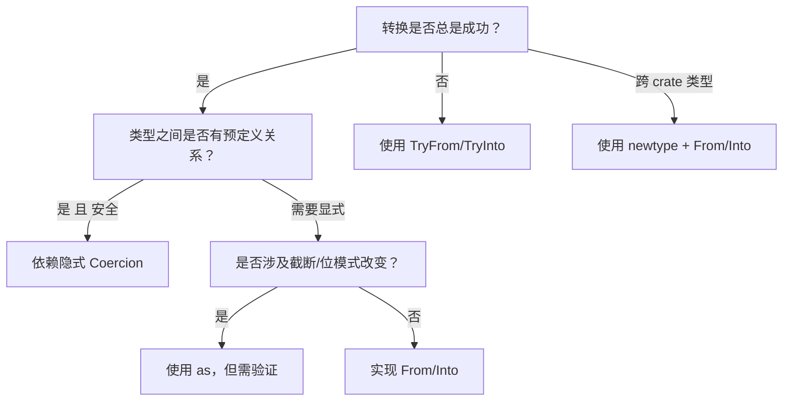

> **内容分级**: [进阶]
> **Rust 版本**: 1.97.0+ (Edition 2024)
> **本节关键术语**: 类型转换（Type Conversion） · 类型强制（Type Coercion） · 类型转换 trait（Conversion Trait） · 孤儿规则（Orphan Rule） · 盲眼实现（Blanket Impl）

# 类型转换（Type Conversions）
>
> **EN**: Type Conversions
> **Summary**: Rust distinguishes between implicit coercions, explicit casts, and trait-based conversions (`From`/`Into`/`TryFrom`/`TryInto`). Understanding their rules, orphan-rule constraints, and safety boundaries is essential for idiomatic error handling and API design.
>
> **受众**: [进阶]
> **层级**: L2 进阶概念
> **Bloom 层级**: L2-L3
> **A/S/P 标记**: **S** — Structure
> **双维定位**: C×App
> **前置概念**: [Type System Basics](../../01_foundation/02_type_system/04_type_system.md) · [Traits](../00_traits/01_traits.md) · [Error Handling](../03_error_handling/04_error_handling.md)
> **后置概念**: [Newtype and Wrapper Types](14_newtype_and_wrapper.md) · [Coercion and Casting](../../01_foundation/02_type_system/14_coercion_and_casting.md)
>
> **主要来源**: [The Rust Reference — Type Conversions](https://doc.rust-lang.org/reference/type-coercions.html) ·
> [The Rust Reference — From and Into](https://doc.rust-lang.org/reference/items/traits.html) ·
> [Rust By Example — Conversion](https://doc.rust-lang.org/rust-by-example/conversion.html) ·
> [The Rust Programming Language — Error Handling](https://doc.rust-lang.org/book/ch09-00-error-handling.html)
>
> **Rust 版本**: 1.97.0+ (Edition 2024)
> **权威来源**: 本文件为 `concept/` 权威页。

> **Rust 1.97.0 变更提示**：
> Rust 1.97.0 起，未约束浮点字面量（`{float}`）的默认回退行为发生变化，详见 [`rust_1_97_stabilized.md`](../../07_future/00_version_tracking/rust_1_97_stabilized.md)。

---

> **Bloom 层级**: L2-L3
> **变更日志**:
>
> - v1.0 (2026-07-04): 初始创建

## 📑 目录

---

> **过渡**: 从 类型转换 的直观描述转向其形式化定义，需要先把日常经验中的模糊直觉转化为可验证的术语与规则。

> **过渡**: 在建立 类型转换 的核心命题之后，下一步是审视这些命题在边界条件下的稳定性——这正是反命题与反例的价值所在。

> **过渡**: 最后，将 类型转换 与相邻概念连接，形成从 L1 到 L7 的纵向认知路径，避免孤立记忆。

---

- [类型转换（Type Conversions）](#类型转换type-conversions)
  - [📑 目录](#-目录)
  - [一、权威定义（Definition）](#一权威定义definition)
    - [1.1 形式化定义](#11-形式化定义)
    - [1.2 直觉解释](#12-直觉解释)
  - [二、概念属性矩阵](#二概念属性矩阵)
  - [三、技术细节与示例](#三技术细节与示例)
    - [3.1 隐式强制（Coercion）](#31-隐式强制coercion)
    - [3.2 显式转换（Cast）](#32-显式转换cast)
    - [3.3 `From` / `Into`](#33-from--into)
    - [3.4 `TryFrom` / `TryInto`](#34-tryfrom--tryinto)
    - [3.5 孤儿规则](#35-孤儿规则)
  - [四、示例与反例](#四示例与反例)
    - [4.1 正确示例：自定义错误类型](#41-正确示例自定义错误类型)
    - [4.2 反例：滥用 `as` 导致截断](#42-反例滥用-as-导致截断)
    - [4.3 反例：违反孤儿规则](#43-反例违反孤儿规则)
  - [五、反命题与边界分析](#五反命题与边界分析)
    - [5.1 反命题树](#51-反命题树)
    - [5.2 边界极限](#52-边界极限)
  - [六、边界测试](#六边界测试)
    - [6.1 边界测试：`TryInto` 溢出](#61-边界测试tryinto-溢出)
    - [6.2 边界测试：强制与转换的区别](#62-边界测试强制与转换的区别)
  - [七、判断推理与决策树](#七判断推理与决策树)
    - [7.1 选择哪种转换方式？](#71-选择哪种转换方式)
    - [7.2 与其他概念的辨析](#72-与其他概念的辨析)
  - [八、逆向推理链（Backward Reasoning）](#八逆向推理链backward-reasoning)
  - [九、来源与延伸阅读](#九来源与延伸阅读)
  - [嵌入式测验（Embedded Quiz）](#嵌入式测验embedded-quiz)
    - [测验 1：转换方式选择](#测验-1转换方式选择)
    - [测验 2：孤儿规则](#测验-2孤儿规则)
  - [认知路径](#认知路径)

---

## 一、权威定义（Definition）

> Rust 中的类型转换分为三类：
>
> 1. **类型强制（Coercion）**：编译器自动执行的隐式转换，如 `&T` 到 `&U`（当 `T: Deref<Target=U>`）。
> 2. **类型转换（Cast）**：使用 `as` 关键字执行的显式转换，可能截断或改变位模式。
> 3. **Trait 转换**：通过 `From`/`Into`、`TryFrom`/`TryInto` 实现的类型安全、可扩展的转换。
>
> [来源: [The Rust Reference — Type Conversions](https://doc.rust-lang.org/reference/type-coercions.html)]

### 1.1 形式化定义

```text
隐式强制: expr: T  ──▶  expr: U   (当 T 可强制为 U)
显式转换: expr as U
Trait 转换:
  U::from(t): T -> U      (当 T: Into<U> 或 U: From<T>)
  u.try_into(): T -> Result<U, E>   (当 T: TryInto<U>)
```

### 1.2 直觉解释

- **Coercion**：编译器“悄悄”帮你做的安全转换，比如把 `&String` 变成 `&str` (Source: [The Rust Reference — Type Coercions](https://doc.rust-lang.org/reference/type-coercions.html))。
- **Cast**：你明确告诉编译器“我要把这个值当作另一种类型”，可能伴随数据丢失 (Source: [The Rust Reference — Cast Expressions](https://doc.rust-lang.org/reference/expressions/operator-expr.html#type-cast-expressions))。
- **Trait 转换**：通过标准 trait 实现可组合、可发现的类型转换，是错误处理（Error Handling）和 API 设计的首选 (Source: [std::convert](https://doc.rust-lang.org/std/convert/index.html))。

> [💡 原创分析](../../00_meta/00_framework/methodology.md)

---

## 二、概念属性矩阵

| 属性 | 说明 | Rust 表达 | 权威来源 |
|:---|:---|:---|:---|
| 隐式强制 | 编译器自动执行 | `let s: &str = &String::from("hi");` | Reference |
| 显式转换 | 使用 `as` | `let x = 255u8 as i8;` | Reference |
| 安全 trait 转换 | `From`/`Into` | `let s = String::from("hi");` | std docs |
| 可失败转换 | `TryFrom`/`TryInto` | `let n: i32 = 300u8.try_into()?;` | std docs |
| 盲眼实现 | 对泛型（Generics）的通用转换 | `impl<T, U> Into<U> for T where U: From<T>` | std docs |
| 孤儿规则 | impl 受 crate 边界限制 | 不能为外部类型实现外部 trait | Reference |

---

## 三、技术细节与示例

### 3.1 隐式强制（Coercion）

```rust
fn print_str(s: &str) {
    println!("{}", s);
}

fn main() {
    let string = String::from("hello");
    print_str(&string); // &String 自动强制为 &str
}
```

> **关键洞察**: 强制转换由 `Deref`、`Unsize`、函数指针转换等规则驱动，无需显式 `as`。
> [来源: [The Rust Reference — Type Coercions](https://doc.rust-lang.org/reference/type-coercions.html)]

### 3.2 显式转换（Cast）

```rust
fn main() {
    let a = 65u8;
    let ch = a as char; // 'A'
    println!("{}", ch);

    let big = 1000i32;
    let small = big as i8; // 截断：1000 - 256*3 = 232
    println!("{}", small);
}
```

> **关键洞察**: `as` 转换可能截断数值或改变位模式，应谨慎使用。
> [来源: [The Rust Reference — Cast Expressions](https://doc.rust-lang.org/reference/expressions/operator-expr.html#type-cast-expressions)]

### 3.3 `From` / `Into`

```rust
// String::from(&str)
let s: String = String::from("hello");

// Into 自动由 From 推导
let s2: String = "world".into();

fn take_string<S: Into<String>>(s: S) {
    let s = s.into();
    println!("{}", s);
}

fn main() {
    take_string("hello");
}
```

> **关键洞察**: 只要实现了 `From<T> for U`，就自动获得 `Into<U> for T`。API 设计时应优先实现 `From`。
> [来源: [std::convert::From](https://doc.rust-lang.org/std/convert/trait.From.html)]

### 3.4 `TryFrom` / `TryInto`

```rust
use std::convert::TryInto;

fn main() {
    let big: i64 = 100000;
    let small: Result<i32, _> = big.try_into();
    match small {
        Ok(n) => println!("converted: {}", n),
        Err(e) => println!("overflow: {}", e),
    }
}
```

> **关键洞察**: 可能失败的转换应使用 `TryFrom`/`TryInto`，将错误嵌入类型系统（Type System）。
> [来源: [std::convert::TryFrom](https://doc.rust-lang.org/std/convert/trait.TryFrom.html)]

### 3.5 孤儿规则

```rust,compile_fail
// 错误：不能为外部类型 i32 实现外部 trait Display
use std::fmt::Display;

impl Display for i32 {
    fn fmt(&self, f: &mut std::fmt::Formatter<'_>) -> std::fmt::Result {
        write!(f, "my int: {}", self)
    }
}

fn main() {}
```

> **错误诊断**: `error[E0117]: only traits defined in the current crate can be implemented for arbitrary types` (Source: [The Rust Reference — Orphan Rules](https://doc.rust-lang.org/reference/items/implementations.html#orphan-rules))
> **修正**: 使用 newtype 包装外部类型：`struct MyInt(i32); impl Display for MyInt { ... }` (Source: [TRPL — Newtype Pattern](https://doc.rust-lang.org/book/ch19-03-advanced-traits.html#using-the-newtype-pattern-to-implement-external-traits-on-external-types))
> [来源: [The Rust Reference — Orphan Rules](https://doc.rust-lang.org/reference/items/implementations.html#orphan-rules)]

---

## 四、示例与反例

### 4.1 正确示例：自定义错误类型

```rust
use std::fmt;

#[derive(Debug)]
struct ParseError {
    message: String,
}

impl fmt::Display for ParseError {
    fn fmt(&self, f: &mut fmt::Formatter<'_>) -> fmt::Result {
        write!(f, "{}", self.message)
    }
}

impl std::error::Error for ParseError {}

impl From<std::num::ParseIntError> for ParseError {
    fn from(err: std::num::ParseIntError) -> Self {
        Self {
            message: format!("parse int failed: {}", err),
        }
    }
}

fn parse_number(s: &str) -> Result<i32, ParseError> {
    Ok(s.parse()?)
}

fn main() {
    println!("{:?}", parse_number("42"));
    println!("{:?}", parse_number("abc"));
}
```

### 4.2 反例：滥用 `as` 导致截断

```rust
fn main() {
    let value: i32 = 300;
    let byte: u8 = value as u8; // 截断为 44
    println!("{}", byte);
}
```

> **错误诊断**: 代码编译通过，但逻辑错误：300 超出了 `u8` 范围。
> **修正**: 使用 `TryInto`：`let byte: u8 = value.try_into()?;`
> [来源: [std::convert::TryInto](https://doc.rust-lang.org/std/convert/trait.TryInto.html)]

### 4.3 反例：违反孤儿规则

```rust,compile_fail
impl From<String> for Vec<u8> {
    fn from(s: String) -> Vec<u8> {
        s.into_bytes()
    }
}

fn main() {}
```

> **错误诊断**: `error[E0117]: only traits defined in the current crate can be implemented for arbitrary types`
> **修正**: 使用 newtype：`struct MyBytes(Vec<u8>); impl From<String> for MyBytes { ... }`
> [来源: [The Rust Reference — Orphan Rules](https://doc.rust-lang.org/reference/items/implementations.html#orphan-rules)]

---

## 五、反命题与边界分析

### 5.1 反命题树

> **反命题 1**: "`as` 转换总是安全的" ⟹ 不成立。`as` 可能截断、改变符号或产生未定义行为（如指针转换）。
> **反命题 2**: "`From`/`Into` 可以转换任何类型" ⟹ 不成立。受孤儿规则限制，不能为外部类型实现外部 trait。
> **反命题 3**: "隐式强制和 `as` 是同一种机制" ⟹ 不成立。强制是隐式、受限的；`as` 是显式、更宽泛的。
> **反命题 4**: "`try_into()` 总是返回 Ok" ⟹ 不成立。`try_into()` 在转换失败时返回 `Err`。

### 5.2 边界极限

| 边界 | 现状 | 理论极限 | 工程意义 |
|:---|:---|:---|:---|
| 数值截断 | `as` 允许 | 理想上应拒绝 | 用 `TryInto` 捕获溢出 |
| 指针转换 | `as` 允许 | unsafe | 指针转换需谨慎 |
| 跨 crate 扩展 | 受孤儿规则限制 | newtype 包装 | 使用 wrapper type |
| 自动派生 | 不能 derive From | 手动实现 | 保持转换语义明确 |

---

## 六、边界测试

### 6.1 边界测试：`TryInto` 溢出

```rust
use std::convert::TryInto;

fn main() {
    let x: i64 = 128;
    let y: Result<i8, _> = x.try_into();
    assert!(y.is_err());
    println!("overflow detected: {:?}", y);
}
```

### 6.2 边界测试：强制与转换的区别

```rust
fn takes_slice(s: &[i32]) {
    println!("len: {}", s.len());
}

fn main() {
    let v = vec![1, 2, 3];
    takes_slice(&v); // 强制：&Vec<i32> -> &[i32]

    // let arr: [i32; 3] = v; // 错误：没有隐式强制
    let arr: [i32; 3] = v.try_into().unwrap(); // TryInto
    println!("{:?}", arr);
}
```

---

## 七、判断推理与决策树

### 7.1 选择哪种转换方式？



### 7.2 与其他概念的辨析

| 场景 | 推荐选择 | 不推荐 | 理由 |
|:---|:---|:---|:---|
| `String` → `&str` | 隐式强制 | `as` | `Deref` 自动处理 |
| `i64` → `i32` | `try_into()` | `as i32` | 避免截断 |
| `&str` → `String` | `String::from` / `.into()` | 手动分配 | 标准 trait 清晰 |
| 自定义错误聚合 | `From<ExternalError> for MyError` | 手动 match | `?` 自动转换 |

---

## 八、逆向推理链（Backward Reasoning）

> **从编译错误/运行时（Runtime）症状反推定理链**:
>
> ```text
> error[E0277] 类型不匹配 ⟸ 缺少 From/Into 实现或强制条件不满足 ⟸ 检查是否需要显式转换或实现 trait
> error[E0117] 孤儿规则 ⟸ 为外部类型实现了外部 trait ⟸ 使用 newtype 包装
> 运行时（Runtime）截断/溢出 ⟸ 使用了 as 而非 TryInto ⟸ 改为 try_into 并处理 Err
> error[E0308] 期望引用（Reference）得到其他类型 ⟸ 缺少 Deref 强制 ⟸ 显式借用（Borrowing）或转换
> ```
>
> **诊断映射**:
>
> - `error[E0277]: the trait bound ... is not satisfied` → 目标类型未实现所需转换 trait。
> - `error[E0117]: only traits defined in the current crate can be implemented for arbitrary types` → 违反孤儿规则。
> - 运行时数值异常 → 可能滥用 `as` 导致截断。

---

## 九、来源与延伸阅读

- [The Rust Reference — Type Conversions](https://doc.rust-lang.org/reference/type-coercions.html)
- [The Rust Reference — Cast Expressions](https://doc.rust-lang.org/reference/expressions/operator-expr.html#type-cast-expressions)
- [std::convert::From](https://doc.rust-lang.org/std/convert/trait.From.html)
- [std::convert::TryFrom](https://doc.rust-lang.org/std/convert/trait.TryFrom.html)
- [Rust By Example — Conversion](https://doc.rust-lang.org/rust-by-example/conversion.html)

---

## 嵌入式测验（Embedded Quiz）

### 测验 1：转换方式选择

**题目**: 你要将 `u64` 转换为 `u32`，但希望转换失败时得到错误而不是静默截断。应该使用？

A. `x as u32`
B. `x.try_into().unwrap()`
C. `u32::from(x)`
D. `x.into()`

<details>
<summary>✅ 答案与解析</summary>

**答案**: B

**解析**: `try_into()` 返回 `Result<u32, TryFromIntError>`，可以在溢出时捕获错误。`as u32` 会静默截断；`u32::from(x)` 和 `x.into()` 要求 `x` 一定能安全转换（`u64` 不实现 `Into<u32>`）。

</details>

### 测验 2：孤儿规则

**题目**: 你不能直接为哪个类型实现 `From<String>`？

A. 你自己定义的 `struct MyString(String)`
B. 标准库类型 `Vec<u8>`
C. 本地枚举（Enum） `enum Output { Bytes(Vec<u8>) }`
D. 本地 newtype `struct Bytes(Vec<u8>)`

<details>
<summary>✅ 答案与解析</summary>

**答案**: B

**解析**: `Vec<u8>` 和 `String` 都是标准库类型，为它们实现 `From<String> for Vec<u8>` 违反孤儿规则。使用 newtype（如 `struct Bytes(Vec<u8>)`）可以解决。

</details>

---

## 认知路径

> **认知路径**: 本节从“在不同类型之间移动数据”的需求出发，区分隐式强制、显式转换和 trait 转换三种机制，强调类型安全与孤儿规则，最终形成在 API 设计中合理选择转换策略的能力。
>
> 1. **问题识别**: 类型之间需要相互转换。
> 2. **概念建立**: Coercion（隐式）、Cast（`as`）、Trait 转换（From/Into/TryFrom）三种机制。
> 3. **机制推理**: 每种机制的适用条件、安全保证和限制。
> 4. **边界辨析**: 截断风险、孤儿规则、跨 crate 扩展。
> 5. **迁移应用**: 在错误处理（Error Handling）、API 设计、FFI 中选择合适的转换方式。

---

> **权威来源**: [The Rust Reference](https://doc.rust-lang.org/reference/introduction.html), [Rust By Example](https://doc.rust-lang.org/rust-by-example/index.html), [std::convert](https://doc.rust-lang.org/std/convert/index.html)
> **权威来源对齐变更日志**: 2026-07-04 创建 [Rust 1.97.0 Reference、std::convert、Rust By Example 对齐](https://doc.rust-lang.org/std/convert/index.html)
> **状态**: ✅ 权威来源对齐完成


---

## 国际权威参考 / International Authority References（P0 官方 · P1 学术 · P2 生态）

> 依据 `AGENTS.md` §2「对齐网络国际化权威内容」补充：仅追加已验证可达的权威链接，不改动正文事实。

- **P1 学术/形式化**: [Cardelli & Wegner: On Understanding Types, Data Abstraction, and Polymorphism (ACM Comput. Surv. 1985)](https://dl.acm.org/doi/10.1145/6041.6042)
