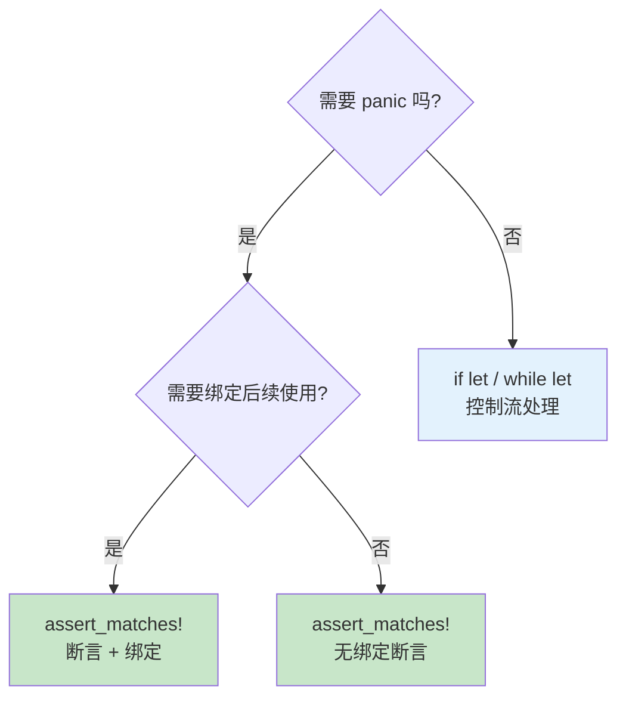
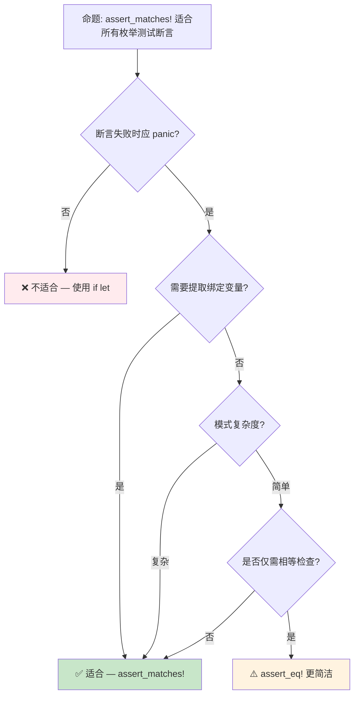

# `assert_matches!`：模式匹配断言的形式化语义

> **Bloom 层级**: 应用 → 分析
> **定位**: 将 Rust 的**模式匹配**能力从"表达式求值"扩展到"测试断言"的工程机制，实现编译期模式检查与运行时断言的统一。
> **前置概念**: [Type System](../01_foundation/04_type_system.md) · [Error Handling](./04_error_handling.md)
> **后置概念**: [Macros](../03_advanced/04_macros.md) · [Version Tracking](../07_future/05_rust_version_tracking.md)

---

> **来源**: [Rust Reference — Patterns](https://doc.rust-lang.org/reference/patterns.html) · [Rust 1.96 Release Notes](https://releases.rs/docs/1.96.0/) · [std::assert_matches](https://doc.rust-lang.org/std/assert_matches/macro.assert_matches.html) · [RFC 2005 — `matches!`](https://github.com/rust-lang/rfcs/pull/2005) · [std::matches](https://doc.rust-lang.org/std/macro.matches.html)

## 📑 目录
> [来源: [Rust Reference](https://doc.rust-lang.org/reference/)]
>
> [来源: [TRPL](https://doc.rust-lang.org/book/)]

- [`assert_matches!`：模式匹配断言的形式化语义](#assert_matches模式匹配断言的形式化语义)
  - [📑 目录](#-目录)
  - [一、核心概念](#一核心概念)
    - [1.1 `matches!`：模式匹配的布尔化](#11-matches模式匹配的布尔化)
    - [1.2 `assert_matches!`：从判断到断言](#12-assert_matches从判断到断言)
    - [1.3 `debug_assert_matches!`：编译期条件断言](#13-debug_assert_matches编译期条件断言)
  - [二、形式化语义](#二形式化语义)
    - [2.1 与 `assert!` / `assert_eq!` 的对比](#21-与-assert--assert_eq-的对比)
    - [2.2 绑定捕获与作用域](#22-绑定捕获与作用域)
  - [三、使用场景与最佳实践](#三使用场景与最佳实践)
    - [3.1 测试中的 Result/Option 断言](#31-测试中的-resultoption-断言)
    - [3.2 复杂枚举变体验证](#32-复杂枚举变体验证)
    - [3.3 与 `if let` 的互补关系](#33-与-if-let-的互补关系)
  - [四、反命题与边界分析](#四反命题与边界分析)
    - [4.1 反命题树](#41-反命题树)
    - [4.2 边界极限](#42-边界极限)
  - [五、来源与延伸阅读](#五来源与延伸阅读)
  - [相关概念文件](#相关概念文件)

---

## 一、核心概念
> [来源: [Rust Reference](https://doc.rust-lang.org/reference/)]
>
> [来源: [Rust Reference](https://doc.rust-lang.org/reference/)]

### 1.1 `matches!`：模式匹配的布尔化

Rust 1.42 引入 `matches!` 宏，将模式匹配从**控制流**转化为**布尔表达式**：

```ignore
let x = Some(42);

// 传统方式：需要 match 控制流
let is_some_forty_two = match x {
    Some(42) => true,
    _ => false,
};

// matches! 方式：直接返回 bool
let is_some_forty_two = matches!(x, Some(42));
```

> **形式化语义**: `matches!(e, p)` ≡ `match e { p => true, _ => false }`
>
> 即 `matches!` 是模式匹配的**布尔投影**（boolean projection），将 `match` 的代数结果 `{true, false}` 显式提取为 `bool` 类型。
> [来源: [RFC 2005](https://github.com/rust-lang/rfcs/pull/2005)]

**支持守卫条件（guard）**:

```rust
let x = Some(42);
assert!(matches!(x, Some(n) if n > 10)); // ✅ 通过
assert!(matches!(x, Some(n) if n > 100)); // ❌ 失败
```

> **关键洞察**: `matches!` 不改变模式匹配的语义，仅改变**返回类型**——从 `()`（控制流）到 `bool`（表达式值）。这是 Rust 宏系统的典型应用：语法糖不改变语义，仅改变语法形式。
> [来源: 💡 原创分析]

---

### 1.2 `assert_matches!`：从判断到断言

Rust 1.96 稳定化 `assert_matches!`，将 `matches!` 的布尔结果**提升为断言契约**：

```ignore
// 需要 Rust 1.96+
use std::assert_matches::assert_matches;

let result: Result<i32, &str> = Ok(42);

// 断言 result 匹配 Ok 变体，并捕获绑定
assert_matches!(result, Ok(n) => {
    assert_eq!(n, 42); // n 在此作用域内可用
});
```

> **语义核心**: `assert_matches!(e, p => block)` 执行以下操作：
>
> 1. 计算表达式 `e`
> 2. 尝试将 `e` 与模式 `p` 匹配
> 3. 若匹配成功：执行 `block`（绑定在 block 作用域内有效）
> 4. 若匹配失败：触发 panic，显示不匹配信息
> [来源: [std::assert_matches](https://doc.rust-lang.org/std/assert_matches/macro.assert_matches.html)]

**与 `assert!(matches!(...))` 的对比**:

```ignore
// 方式 A: assert! + matches!（Rust < 1.96）
assert!(matches!(result, Ok(n) if n > 10));
// 失败时信息: "assertion failed: matches!(result, Ok(n) if n > 10)"
// ❌ 无法使用 n 的绑定

// 方式 B: assert_matches!（Rust 1.96+）
assert_matches!(result, Ok(n) if n > 10 => {
    println!("value = {}", n); // ✅ n 可用
});
// 失败时信息: 显示实际值和期望模式
```

> **关键差异**: `assert_matches!` 在匹配成功时**保留绑定**，允许在断言通过后继续使用模式绑定的变量。这是 `assert!(matches!(...))` 无法实现的——后者在 `matches!` 返回后绑定已丢失。
> [来源: 💡 原创分析]

---

### 1.3 `debug_assert_matches!`：编译期条件断言

与 `assert!` / `debug_assert!` 的关系一致：

```ignore
// release 模式下被消除（零运行时开销）
debug_assert_matches!(config, Config::Debug { verbose: true } => {
    log::set_max_level(log::LevelFilter::Debug);
});
```

| 宏 | debug 模式 | release 模式 | 用例 |
|:---|:---:|:---:|:---|
| `assert_matches!` | ✅ 执行 | ✅ 执行 | 不变量检查、测试 |
| `debug_assert_matches!` | ✅ 执行 | ❌ 消除 | 性能敏感路径的调试断言 |

> **定理**: `debug_assert_matches!` 在 release 模式下不产生任何机器码。
> **证明**: 宏展开为 `if cfg!(debug_assertions) { assert_matches!(...) }`，编译器在 `cfg!(false)` 时消除整个分支。
> [来源: [Rust Reference — debug_assertions](https://doc.rust-lang.org/reference/conditional-compilation.html#debug_assertions)]

---

## 二、形式化语义
> [来源: [Rust Reference](https://doc.rust-lang.org/reference/)]
>
> [来源: [TRPL](https://doc.rust-lang.org/book/)]

### 2.1 与 `assert!` / `assert_eq!` 的对比

```mermaid
graph LR
    subgraph 断言家族["Rust 断言宏家族"]
        A[assert!] -->|泛化| B[assert_eq!]
        A -->|模式匹配扩展| C[assert_matches!]
        B -->|特定类型| D[assert_ne!]
        C -->|调试模式| E[debug_assert_matches!]
    end

    subgraph 语义差异["核心语义差异"]
        F[assert!(expr)] -->|expr: bool| G[panic if false]
        H[assert_eq!(a, b)] -->|a == b| I[panic if unequal]
        J[assert_matches!(e, p)] -->|e ~ p| K[panic if no match<br/>+ bind variables]
    end
```

> **认知功能**: 此图展示 Rust 断言宏的**家族关系**和**语义演进**。`assert_matches!` 填补了"模式匹配断言"的空白，使断言系统从"值相等"扩展到"结构匹配"。
> [来源: [Rust Reference — Patterns]]
> **使用建议**: 在测试枚举类型时，优先选择 `assert_matches!` 而非 `assert_eq!`——前者验证结构形状，后者仅验证相等性。
> **关键洞察**: 断言系统的演进轨迹是**从具体值到抽象模式**：`assert!`（任意布尔）→ `assert_eq!`（部分相等）→ `assert_matches!`（结构模式）。
> [来源: 💡 原创分析]

**形式化对比表**:

| 特性 | `assert!` | `assert_eq!` | `assert_matches!` |
|:---|:---|:---|:---|
| 检查对象 | 任意 `bool` 表达式 | 两个值的 `PartialEq` | 表达式 vs 模式 |
| 失败信息 | 表达式字符串 | 左右值差异 | 实际值 + 期望模式 |
| 绑定捕获 | ❌ 无 | ❌ 无 | ✅ 有 |
| 守卫条件 | ❌ 不支持 | ❌ 不支持 | ✅ `if` guard |
| 适用类型 | 任何类型 | `PartialEq` | 任何可模式匹配类型 |
| 编译期优化 | 无 | 无 | `debug_` 变体可消除 |

---

### 2.2 绑定捕获与作用域

```ignore
enum Message {
    Text(String),
    Number(i32),
    Coord { x: f64, y: f64 },
}

let msg = Message::Coord { x: 1.5, y: 2.5 };

// 绑定捕获：x 和 y 在 => 后的块作用域内可用
assert_matches!(msg, Message::Coord { x, y } => {
    assert!((x - 1.5).abs() < f64::EPSILON);
    assert!((y - 2.5).abs() < f64::EPSILON);
    // x, y 仅在此块内有效
});

// x, y 在此处不可用（编译错误）
// println!("{}", x); // ❌ error: cannot find value `x` in this scope
```

> **形式化规则**: `assert_matches!(e, p => block)` 创建**模式绑定作用域**。
>
> - 设 `p` 中的绑定变量集合为 `Vars(p)`
> - 则 `Vars(p)` 的作用域仅限于 `block`
> - 这与 `if let p = e { block }` 的作用域规则完全一致
> [来源: [Rust Reference — Patterns](https://doc.rust-lang.org/reference/patterns.html)]

---

## 三、使用场景与最佳实践
> [来源: [Rust Reference](https://doc.rust-lang.org/reference/)]
>
> [来源: [TRPL](https://doc.rust-lang.org/book/)]

### 3.1 测试中的 Result/Option 断言

```ignore
#[test]
fn parse_config() {
    let result = parse("port=8080");

    // ✅ 推荐: 验证结构形状 + 提取值
    assert_matches!(result, Ok(Config { port, .. }) => {
        assert_eq!(port, 8080);
    });

    // ❌ 不推荐: 仅验证相等性，丢失结构信息
    assert_eq!(result, Ok(Config { port: 8080, host: "localhost".to_string() }));
}
```

> **最佳实践**: 在测试中，使用 `assert_matches!` 验证**结构形状**（是否为 `Ok`），然后使用 `assert_eq!` 验证**具体值**。分层断言使测试失败信息更精确。
> [来源: 💡 原创分析]

---

### 3.2 复杂枚举变体验证

```ignore
#[derive(Debug)]
enum State {
    Idle,
    Processing { id: u64, progress: f32 },
    Completed(Vec<u8>),
    Error { code: u16, message: String },
}

#[test]
fn state_machine_transition() {
    let state = run_task();

    // 验证特定变体 + 提取字段进行进一步检查
    assert_matches!(state, State::Processing { id, progress } => {
        assert!(id > 0);
        assert!(progress >= 0.0 && progress <= 1.0);
    });
}
```

---

### 3.3 与 `if let` 的互补关系



> **认知功能**: 此决策树帮助开发者在 `if let` 和 `assert_matches!` 之间选择。核心判断标准是"失败是否应导致 panic"。
> [来源: [Rust Reference — Patterns]]
> **使用建议**: 生产代码中的可选处理用 `if let`；测试和不变量检查用 `assert_matches!`。
> **关键洞察**: `assert_matches!` 本质上是 **"panic-if-no-match + if-let"** 的语法糖，将两个操作压缩为单一表达式。
> [来源: 💡 原创分析]

---

## 四、反命题与边界分析
> [来源: [Rust Reference](https://doc.rust-lang.org/reference/)]
>
> [来源: [Rust Reference](https://doc.rust-lang.org/reference/)]

### 4.1 反命题树



> **认知功能**: 此决策树帮助测试编写者在 `assert_matches!`、`assert_eq!` 和 `if let` 之间选择最合适的工具。
> [来源: [Rust Reference — Patterns]]
> **使用建议**: 对简单标量相等检查，使用 `assert_eq!` 更简洁；对结构匹配和绑定提取，使用 `assert_matches!`。
> **关键洞察**: 工具选择的本质是**信息粒度**的权衡——`assert_eq!` 验证值，`assert_matches!` 验证形状 + 提取成分。
> [来源: 💡 原创分析]

---

### 4.2 边界极限

```ignore
// 边界 1: 嵌套模式
let x = Some(Some(42));
assert_matches!(x, Some(Some(n)) => {
    assert_eq!(n, 42); // ✅ 嵌套绑定正常工作
});

// 边界 2: 或模式 (|)
let x = Ok(42);
assert_matches!(x, Ok(n) | Err(n) if n > 0 => {
    // ✅ 或模式支持
});

// 边界 3: .. 忽略剩余字段
let x = Point { x: 1, y: 2, z: 3 };
assert_matches!(x, Point { x, .. } => {
    assert_eq!(x, 1); // ✅ .. 正常工作
});

// 边界 4: 不可反驳模式（编译警告）
let x = 42;
// assert_matches!(x, n => { ... }); // ⚠️ 不可反驳模式，编译器警告
```

> **边界要点**: `assert_matches!` 支持所有标准模式语法（嵌套、或模式、`..`、守卫条件），但**不可反驳模式**（irrefutable patterns）会触发编译器警告——因为断言在此情况下永不为假。
> [来源: [Rust Reference — Patterns](https://doc.rust-lang.org/reference/patterns.html)]

---

## 五、来源与延伸阅读
> [来源: [Rust Reference](https://doc.rust-lang.org/reference/)]

| 来源 | 可信度 | 说明 |
|:---|:---:|:---|
| [Rust 1.96 Release Notes](https://releases.rs/docs/1.96.0/) | ✅ 一级 | 稳定化公告 |
| [std::assert_matches](https://doc.rust-lang.org/std/assert_matches/macro.assert_matches.html) | ✅ 一级 | API 文档 |
| [std::matches](https://doc.rust-lang.org/std/macro.matches.html) | ✅ 一级 | `matches!` 宏文档 |
| [RFC 2005 — `matches!`](https://github.com/rust-lang/rfcs/pull/2005) | ✅ 一级 | 设计动机与语义 |
| [Rust Reference — Patterns](https://doc.rust-lang.org/reference/patterns.html) | ✅ 一级 | 模式匹配权威规范 |

---

## 相关概念文件
> [来源: [Rust Reference](https://doc.rust-lang.org/reference/)]
>
> [来源: [Rust Reference](https://doc.rust-lang.org/reference/)]

- [Type System](../01_foundation/04_type_system.md) — 模式匹配的形式化根基
- [Error Handling](./04_error_handling.md) — Result/Option 测试断言实践
- [Macros](../03_advanced/04_macros.md) — 宏系统的语法糖机制
- [Version Tracking](../07_future/05_rust_version_tracking.md) — Rust 1.96 特性演进

---

> **权威来源**: [Rust Reference](https://doc.rust-lang.org/reference/), [std::assert_matches](https://doc.rust-lang.org/std/assert_matches/), [The Rust Programming Language](https://doc.rust-lang.org/book/)
>
> **权威来源对齐变更日志**: 2026-05-21 创建，对齐 Rust 1.96.0 (Edition 2024)

**文档版本**: 1.0
**对应 Rust 版本**: 1.96.0+ (Edition 2024)
**最后更新**: 2026-05-21
**状态**: ✅ 概念文件创建完成
