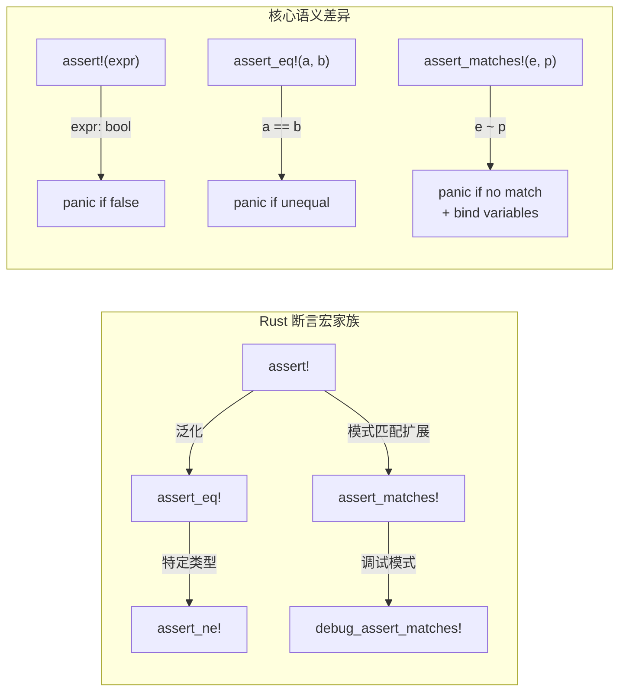
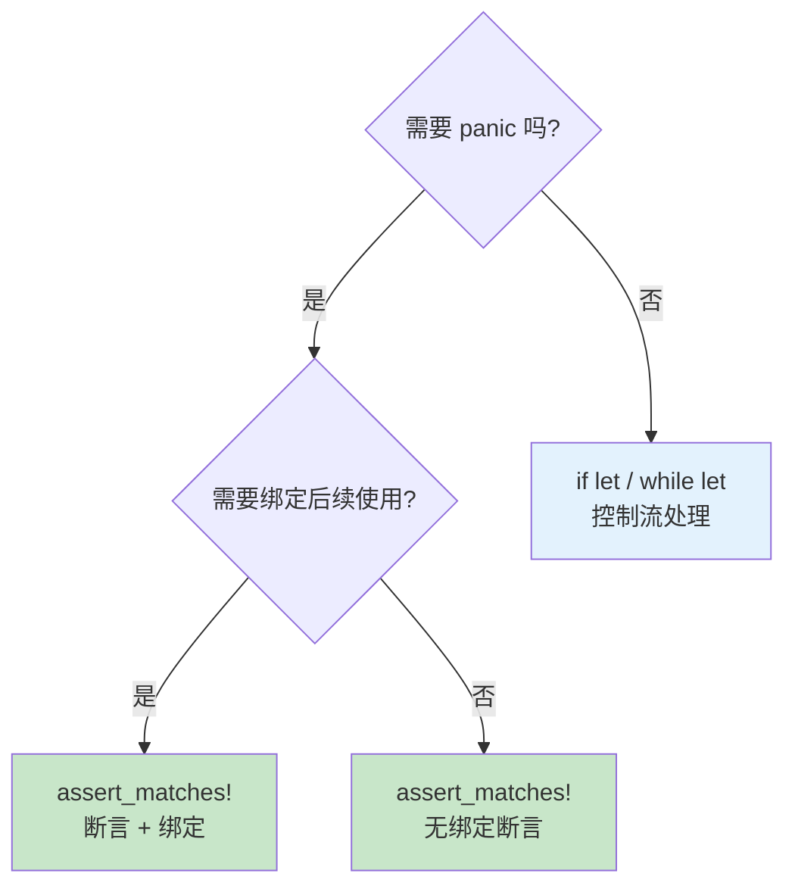
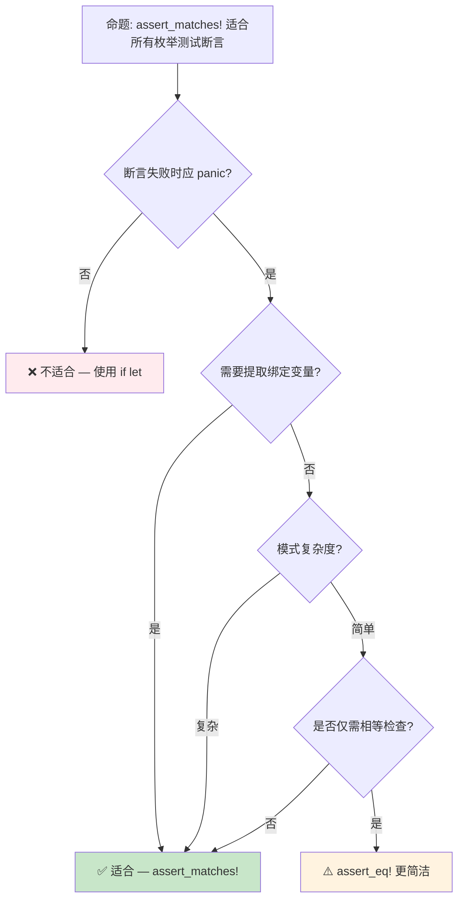

> **内容分级**: [综述级]
> **本节关键术语**: assert_matches! · 模式匹配（Pattern Matching）断言 (Pattern Match Assertion) · debug_assert_matches! · 测试断言 (Test Assertion) — [完整对照表](../00_meta/terminology_glossary.md)
>
# `assert_matches!`：模式匹配断言的形式化语义
>
> **EN**: assert_matches! Macro
> **Summary**: The `assert_matches!` macro for pattern-based assertions on enums and trait objects.
> **受众**: [进阶]
> **Bloom 层级**: 应用 → 分析
> **A/S/P 标记**: **A** — Application
> **双维定位**: F×App — 断言和模式匹配（Pattern Matching）语法应用
> **定位**: 将 Rust 的**模式匹配（Pattern Matching）**能力从"表达式求值"扩展到"测试断言"的工程机制，实现编译期模式检查与运行时（Runtime）断言的统一。
> **前置概念**: [Type System](../01_foundation/04_type_system.md) · [Error Handling](04_error_handling.md)
> **后置概念**: [Macros](../03_advanced/04_macros.md) · [Version Tracking](../07_future/05_rust_version_tracking.md)

---

> **来源**:
> [Rust Reference — Patterns](https://doc.rust-lang.org/reference/patterns.html) ·
> [Rust 1.96 Release Notes](https://blog.rust-lang.org/2026/05/28/Rust-1.96.0/) ·
> [releases.rs 1.96.0](https://releases.rs/docs/1.96.0/) ·
> [std::assert_matches](https://doc.rust-lang.org/std/macro.assert_matches.html) ·
> [RFC 2005 — `matches!`](https://github.com/rust-lang/rfcs/pull/2005) ·
> [std::matches](https://doc.rust-lang.org/std/macro.matches.html)

## 📑 目录

- [`assert_matches!`：模式匹配断言的形式化语义](#assert_matches模式匹配断言的形式化语义)
  - [📑 目录](#-目录)
  - [一、核心概念](#一核心概念)
    - [1.1 `matches!`：模式匹配的布尔化](#11-matches模式匹配的布尔化)
    - [1.2 `assert_matches!`：从判断到断言](#12-assert_matches从判断到断言)
    - [1.3 `debug_assert_matches!`：编译期条件断言](#13-debug_assert_matches编译期条件断言)
  - [二、形式化语义](#二形式化语义)
    - [2.1 与 `assert!` / `assert_eq!` 的对比](#21-与-assert--assert_eq-的对比)
    - [2.2 绑定捕获与作用域](#22-绑定捕获与作用域)
  - [三、使用场景与最佳实践](#三使用场景与最佳实践)
    - [3.1 测试中的 Result/Option 断言](#31-测试中的-resultoption-断言)
    - [3.2 复杂枚举变体验证](#32-复杂枚举变体验证)
    - [3.3 与 `if let` 的互补关系](#33-与-if-let-的互补关系)
  - [四、反命题与边界分析](#四反命题与边界分析)
    - [4.1 反命题树](#41-反命题树)
    - [4.2 边界极限](#42-边界极限)
  - [五、来源与延伸阅读](#五来源与延伸阅读)
    - [编译验证示例](#编译验证示例)
  - [相关概念文件](#相关概念文件)
  - [逆向推理链（Backward Reasoning）](#逆向推理链backward-reasoning)
  - [权威来源索引](#权威来源索引)
  - [十、边界测试：assert\_matches 的编译错误](#十边界测试assert_matches-的编译错误)
    - [10.1 边界测试：`assert_matches!` 在非 Option/Result 上使用（编译错误）](#101-边界测试assert_matches-在非-optionresult-上使用编译错误)
    - [10.2 边界测试：嵌套模式匹配中的绑定冲突（编译错误）](#102-边界测试嵌套模式匹配中的绑定冲突编译错误)
    - [10.3 边界测试：`assert_matches!` 与嵌套模式的绑定（编译错误）](#103-边界测试assert_matches-与嵌套模式的绑定编译错误)
    - [10.4 边界测试：自定义断言失败消息的类型约束（编译错误）](#104-边界测试自定义断言失败消息的类型约束编译错误)
    - [10.4 边界测试：所有权移动后的再次使用](#104-边界测试所有权移动后的再次使用)
  - [嵌入式测验（Embedded Quiz）](#嵌入式测验embedded-quiz)
    - [测验 1：`assert_matches!(value, pattern)` 的主要用途是什么？与 `assert!(matches!(value, pattern))` 相比有什么优势？（理解层）](#测验-1assert_matchesvalue-pattern-的主要用途是什么与-assertmatchesvalue-pattern-相比有什么优势理解层)
    - [测验 2：`assert_matches!` 是否可以在模式中绑定变量？绑定后的变量在测试体中可用吗？（理解层）](#测验-2assert_matches-是否可以在模式中绑定变量绑定后的变量在测试体中可用吗理解层)
    - [测验 3：如果 `assert_matches!` 在你的 stable Rust 版本中不可用，最简单的替代方案是什么？（理解层）](#测验-3如果-assert_matches-在你的-stable-rust-版本中不可用最简单的替代方案是什么理解层)
    - [测验 4：`assert_matches!(x, Some(_))` 与 `assert!(x.is_some())` 在语义上有区别吗？（理解层）](#测验-4assert_matchesx-some_-与-assertxis_some-在语义上有区别吗理解层)
    - [测验 5：`assert_matches!` 对测试枚举变体有什么特别便利之处？（理解层）](#测验-5assert_matches-对测试枚举变体有什么特别便利之处理解层)
  - [实践](#实践)
  - [认知路径](#认知路径)
    - [核心推理链](#核心推理链)
    - [反命题与边界](#反命题与边界)

---

## 一、核心概念
>
>

### 1.1 `matches!`：模式匹配的布尔化
>

Rust 1.42 引入 `matches!` 宏（Macro），将模式匹配从**控制流**转化为**布尔表达式**：

```rust
let x = Some(42);

// 传统方式：需要 match 控制流
let is_some_forty_two = match x {
    Some(42) => true,
    _ => false,
};

// matches! 方式：直接返回 bool
let is_some_forty_two = matches!(x, Some(42));
assert!(is_some_forty_two);
```

> **形式化语义**: `matches!(e, p)` ≡ `match e { p => true, _ => false }`
>
> 即 `matches!` 是模式匹配的**布尔投影**（boolean projection），将 `match` 的代数结果 `{true, false}` 显式提取为 `bool` 类型。
> [来源: [RFC 2005](https://github.com/rust-lang/rfcs/pull/2005)]

**支持守卫条件（guard）**:

```rust
let x = Some(42);
assert!(matches!(x, Some(n) if n > 10)); // ✅ 通过
assert!(matches!(x, Some(n) if n > 100)); // ❌ 失败
```

> **关键洞察**: `matches!` 不改变模式匹配的语义，仅改变**返回类型**——从 `()`（控制流）到 `bool`（表达式值）。这是 Rust 宏（Macro）系统的典型应用：语法糖不改变语义，仅改变语法形式。
> [来源: 💡 原创分析]

---

### 1.2 `assert_matches!`：从判断到断言
>

Rust 1.96.0 稳定化 `assert_matches!`，将 `matches!` 的布尔结果**提升为断言契约**：

```rust
// 需要 Rust 1.96+
use std::assert_matches;

let result: Result<i32, &str> = Ok(42);

// 断言 result 匹配 Ok 变体
assert_matches!(result, Ok(n) if n == 42);

// 支持嵌套模式
let nested: Result<Option<i32>, &str> = Ok(Some(42));
assert_matches!(nested, Ok(Some(n)) if n > 0);
```

> **语义核心**: `assert_matches!(e, p)` 执行以下操作：
>
> 1. 计算表达式 `e`
> 2. 尝试将 `e` 与模式 `p` 匹配
> 3. 若匹配成功：断言通过
> 4. 若匹配失败：触发 panic，显示不匹配信息
> 5. 支持 guard 条件：`assert_matches!(e, p if guard)`
>
> **注意**: 绑定不可导出到宏（Macro）外部。如需提取值并后续使用，请使用 `if let`。
> [来源: [std::assert_matches](https://doc.rust-lang.org/std/macro.assert_matches.html)]

**与 `assert!(matches!(...))` 的对比**:

```rust
use std::assert_matches;

let result: Result<i32, &str> = Ok(42);

// 方式 A: assert! + matches!（Rust < 1.96）
assert!(matches!(result, Ok(n) if n > 10));
// 失败时信息: "assertion failed: matches!(result, Ok(n) if n > 10)"

// 方式 B: assert_matches!（Rust 1.96.0+）
assert_matches!(result, Ok(n) if n > 10);
// 失败时信息: 显示实际值和期望模式，更易于调试
```

> **关键差异**: `assert_matches!` 在匹配成功时**保留绑定**，允许在断言通过后继续使用模式绑定的变量。这是 `assert!(matches!(...))` 无法实现的——后者在 `matches!` 返回后绑定已丢失。

---

### 1.3 `debug_assert_matches!`：编译期条件断言
>

与 `assert!` / `debug_assert!` 的关系一致：

```rust,ignore
use std::assert_matches::debug_assert_matches;

// release 模式下被消除（零运行时开销）
let config = Some(true);
debug_assert_matches!(config, Some(true));
```

> ⚠️ **重要**: `assert_matches!` 和 `debug_assert_matches!`**未加入标准 prelude**。这是因为它们与流行的第三方 crate（如 `assert_matches` crate）存在命名冲突。使用时需显式导入：
>
> ```rust
> use std::assert_matches; // 或 core::assert_matches
> ```
>
> [来源: [Rust 1.96 Release Notes — Assert matching patterns](https://blog.rust-lang.org/2026/05/28/Rust-1.96.0/)]

| 宏（Macro） | debug 模式 | release 模式 | 用例 |
|:---|:---:|:---:|:---|
| `assert_matches!` | ✅ 执行 | ✅ 执行 | 不变量检查、测试 |
| `debug_assert_matches!` | ✅ 执行 | ❌ 消除 | 性能敏感路径的调试断言 |

> **定理**: `debug_assert_matches!` 在 release 模式下不产生任何机器码。
> **证明**: 宏（Macro）展开为 `if cfg!(debug_assertions) { assert_matches!(...) }`，编译器在 `cfg!(false)` 时消除整个分支。
> [来源: [Rust Reference — debug_assertions](https://doc.rust-lang.org/reference/conditional-compilation.html#debug_assertions)]

---

## 二、形式化语义

### 2.1 与 `assert!` / `assert_eq!` 的对比
>



> **认知功能**: 此图展示 Rust 断言宏（Macro）的**家族关系**和**语义演进**。`assert_matches!` 填补了"模式匹配断言"的空白，使断言系统从"值相等"扩展到"结构匹配"。
> [来源: [Rust Reference — Patterns](https://doc.rust-lang.org/reference/patterns.html)]
> **使用建议**: 在测试枚举（Enum）类型时，优先选择 `assert_matches!` 而非 `assert_eq!`——前者验证结构形状，后者仅验证相等性。
> **关键洞察**: 断言系统的演进轨迹是**从具体值到抽象模式**：`assert!`（任意布尔）→ `assert_eq!`（部分相等）→ `assert_matches!`（结构模式）。

**形式化对比表**:

| 特性 | `assert!` | `assert_eq!` | `assert_matches!` |
|:---|:---|:---|:---|
| 检查对象 | 任意 `bool` 表达式 | 两个值的 `PartialEq` | 表达式 vs 模式 |
| 失败信息 | 表达式字符串 | 左右值差异 | 实际值 + 期望模式 |
| 绑定捕获 | ❌ 无 | ❌ 无 | ✅ 有 |
| 守卫条件 | ❌ 不支持 | ❌ 不支持 | ✅ `if` guard |
| 适用类型 | 任何类型 | `PartialEq` | 任何可模式匹配类型 |
| 编译期优化 | 无 | 无 | `debug_` 变体可消除 |

---

### 2.2 绑定捕获与作用域
>

```ignore
enum Message {
    Text(String),
    Number(i32),
    Coord { x: f64, y: f64 },
}

let msg = Message::Coord { x: 1.5, y: 2.5 };

// assert_matches! 绑定不可导出到宏外部
// 如需在断言后使用绑定的值，应使用 if let
assert_matches!(msg, Message::Coord { x: 1.5, y: 2.5 });

// 如需提取值并后续使用：
if let Message::Coord { x, y } = msg {
    assert!((x - 1.5).abs() < f64::EPSILON);
    assert!((y - 2.5).abs() < f64::EPSILON);
}
```

> **形式化规则**: `assert_matches!(e, p)` 进行模式匹配断言，绑定不可导出宏外部。
>
> - 设 `p` 中的绑定变量集合为 `Vars(p)`
> - 则 `Vars(p)` 的作用域仅限于 `block`
> - 这与 `if let p = e { block }` 的作用域规则完全一致
> [来源: [Rust Reference — Patterns](https://doc.rust-lang.org/reference/patterns.html)]

---

## 三、使用场景与最佳实践

### 3.1 测试中的 Result/Option 断言
>

```rust,ignore
use std::assert_matches::assert_matches;

#[derive(Debug, PartialEq)]
struct Config { port: u16, host: String }

fn parse_config() {
    let result: Result<Config, &str> = Ok(Config { port: 8080, host: "localhost".to_string() });

    // ✅ 推荐: 验证结构形状
    assert_matches!(result, Ok(Config { port, .. }) if *port == 8080);

    // 也可结合 if let 提取值做进一步断言
    if let Ok(Config { port, .. }) = result {
        assert_eq!(port, 8080);
    }
}
```

> **最佳实践**: 在测试中，使用 `assert_matches!` 验证**结构形状**（是否为 `Ok`），然后使用 `assert_eq!` 验证**具体值**。分层断言使测试失败信息更精确。

---

### 3.2 复杂枚举变体验证
>

```rust,ignore
use std::assert_matches::assert_matches;

#[derive(Debug)]
enum State {
    Idle,
    Processing { id: u64, progress: f32 },
    Completed(Vec<u8>),
    Error { code: u16, message: String },
}

fn state_machine_transition() {
    let state = State::Processing { id: 42, progress: 0.5 };

    // 验证特定变体
    assert_matches!(state, State::Processing { id, progress } if *id > 0 && *progress <= 1.0);
}
```

---

### 3.3 与 `if let` 的互补关系
>



> **认知功能**: 此决策树帮助开发者在 `if let` 和 `assert_matches!` 之间选择。核心判断标准是"失败是否应导致 panic"。
> **使用建议**: 生产代码中的可选处理用 `if let`；测试和不变量检查用 `assert_matches!`。
> **关键洞察**: `assert_matches!` 本质上是 **"panic-if-no-match + if-let"** 的语法糖，将两个操作压缩为单一表达式。

---

## 四、反命题与边界分析

### 4.1 反命题树



> **认知功能**: 此决策树帮助测试编写者在 `assert_matches!`、`assert_eq!` 和 `if let` 之间选择最合适的工具。
> **使用建议**: 对简单标量相等检查，使用 `assert_eq!` 更简洁；对结构匹配和绑定提取，使用 `assert_matches!`。
> **关键洞察**: 工具选择的本质是**信息粒度**的权衡——`assert_eq!` 验证值，`assert_matches!` 验证形状 + 提取成分。

---

### 4.2 边界极限

```rust,ignore
use std::assert_matches::assert_matches;

// 边界 1: 嵌套模式
let x = Some(Some(42));
assert_matches!(x, Some(Some(n)) if n == 42); // ✅ 嵌套模式正常工作

// 边界 2: 或模式 (|)
let x: Result<i32, i32> = Ok(42);
assert_matches!(x, Ok(n) | Err(n) if n > 0); // ✅ 或模式支持

// 边界 3: .. 忽略剩余字段
#[derive(Debug)]
struct Point { x: i32, y: i32, z: i32 }
let x = Point { x: 1, y: 2, z: 3 };
assert_matches!(x, Point { x: 1, .. }); // ✅ .. 正常工作

// 边界 4: 不可反驳模式（编译警告）
let x = 42;
// assert_matches!(x, n); // ⚠️ 不可反驳模式，编译器可能警告
```

> **边界要点**: `assert_matches!` 支持所有标准模式语法（嵌套、或模式、`..`、守卫条件），但**不可反驳模式**（irrefutable patterns）会触发编译器警告——因为断言在此情况下永不为假。

---

## 五、来源与延伸阅读
>

| 来源 | 可信度 | 说明 |
|:---|:---:|:---|
| [Rust 1.96 Release Notes](https://releases.rs/docs/1.96.0/) | ✅ 一级 | 稳定化公告 |
| [std::assert_matches](https://doc.rust-lang.org/std/macro.assert_matches.html) | ✅ 一级 | API 文档 |
| [std::matches](https://doc.rust-lang.org/std/macro.matches.html) | ✅ 一级 | `matches!` 宏文档 |
| [RFC 2005 — `matches!`](https://github.com/rust-lang/rfcs/pull/2005) | ✅ 一级 | 设计动机与语义 |
| [Rust Reference — Patterns](https://doc.rust-lang.org/reference/patterns.html) | ✅ 一级 | 模式匹配权威规范 |

---

```rust
fn main() {
    let opt = Some(42);
    if let Some(v) = opt {
        println!("{}", v);
    }
}
```

### 编译验证示例

```rust
fn main() {
    let x = Some(42);
    assert!(matches!(x, Some(n) if n > 10));
    assert!(!matches!(x, Some(n) if n > 100));

    let y: Result<i32, &str> = Ok(7);
    assert!(matches!(y, Ok(_)));
}
```

```rust
fn main() {
    let msg = "hello";
    assert!(matches!(msg, "hello"));
    assert!(matches!(msg, "world" | "hello"));
}
```

## 相关概念文件

- [Type System](../01_foundation/04_type_system.md) — 模式匹配的形式化根基
- [Error Handling](04_error_handling.md) — Result/Option 测试断言实践
- [Macros](../03_advanced/04_macros.md) — 宏系统的语法糖机制
- [Version Tracking](../07_future/05_rust_version_tracking.md) — Rust 1.96 特性演进

---

> **权威来源**: [Rust Reference](https://doc.rust-lang.org/reference/), [std::assert_matches](https://doc.rust-lang.org/std/macro.assert_matches.html), [The Rust Programming Language](https://doc.rust-lang.org/book/ch19-00-patterns.html)
> **权威来源对齐变更日志**: 2026-05-21 创建，对齐 Rust 1.96.0 (Edition 2024)

**文档版本**: 1.1
**对应 Rust 版本**: 1.96.0+ (Edition 2024)
**最后更新**: 2026-06-19
**状态**: ✅ 已对齐 Rust 1.96.0 稳定版发布内容

---

## 逆向推理链（Backward Reasoning）

> **从编译错误反推**：
>
> ```text
> 模式匹配穷尽 ⟸ 所有变体被覆盖
> ```
>
## 权威来源索引

>
>
>

---

---

---

> **补充来源**

## 十、边界测试：assert_matches 的编译错误

### 10.1 边界测试：`assert_matches!` 在非 Option/Result 上使用（编译错误）

```rust,compile_fail
// ❌ 编译错误: assert_matches! 未导入
fn main() {
    let result: Result<i32, &str> = Ok(42);
    assert_matches!(result, Ok(_)); // 错误: 找不到宏 assert_matches!
}
```

```rust
// ✅ 正确: 导入后使用
use std::assert_matches;

fn main() {
    let result: Result<i32, &str> = Ok(42);
    assert_matches!(result, Ok(_)); // ✅ 匹配 Ok 变体
}
```

> **修正**: `assert_matches!`（Rust 长期 unstable，于 1.96.0 stable）专门用于测试枚举变体匹配。
> 它不同于 `assert_eq!`——后者要求值实现 `PartialEq`，而 `assert_matches!` 使用模式匹配，不要求 `PartialEq`。
> 在 `assert_matches!` 稳定前，使用 `matches!` 宏或 `if let` 进行测试断言。[来源: [Rust Standard Library](https://doc.rust-lang.org/std/)]

### 10.2 边界测试：嵌套模式匹配中的绑定冲突（编译错误）

```rust,compile_fail
fn main() {
    let opt = Some(Some(5));
    // ❌ 编译错误: identifier `x` is bound more than once in the same pattern
    match opt {
        Some(x) | Some(Some(x)) => println!("{}", x),
        None => println!("none"),
    }
}

// 正确: 避免或模式中的绑定冲突
fn fixed() {
    let opt = Some(Some(5));
    match opt {
        Some(Some(x)) => println!("nested: {}", x),
        Some(None) => println!("inner none"),
        None => println!("none"),
    }
}
```

> **修正**: 在 Rust 模式匹配的 `|`（或模式）中，所有分支必须绑定**相同的变量名和类型**。若一个分支绑定 `x: i32`，另一个分支绑定 `x: Option<i32>`，编译器报错。这是 Rust 模式匹配（Pattern Matching）"穷尽性检查"的一部分——确保每个绑定在所有分支中具有一致性（Coherence）。[来源: [Rust Reference](https://doc.rust-lang.org/reference/)]

### 10.3 边界测试：`assert_matches!` 与嵌套模式的绑定（编译错误）

```rust,ignore
#[test]
fn test_nested_match() {
    let result: Result<Option<i32>, ()> = Ok(Some(42));
    // ⚠️ 设计限制: assert_matches! 是宏，绑定不可导出到宏外部
    // assert_matches!(result, Ok(Some(x)) if x > 0);
    // 如需在断言后使用 x，应改用 if let
}
```

> **修正**: `assert_matches!`（Rust 1.96.0 stable）检查值是否匹配给定模式，但**模式中的绑定**（`x`）在宏外部不可见。
> `assert_matches!(result, Ok(Some(x)))` 中 `x` 只在宏内部有效，测试代码不能后续使用 `x`。
> 若需提取绑定值，使用 `if let`：`if let Ok(Some(x)) = result { assert!(x > 0); } else { panic!("match failed"); }`。
> `assert_matches!` 的优势是简洁和良好的失败消息（打印不匹配的值），劣势是绑定不可导出。
> 这与 `matches!` 宏（返回 `bool`，无绑定）或 `insta` 的 snapshot 测试（结构化匹配）互补。
> `assert_matches!` 的设计体现了 Rust 宏的能力边界：宏生成的代码在词法上封闭，无法将绑定泄露到外部。
> [来源: [Rust Standard Library](https://doc.rust-lang.org/std/macro.assert_matches.html)] ·
> [来源: [The Rust Programming Language](https://doc.rust-lang.org/book/ch19-00-patterns.html)]

### 10.4 边界测试：自定义断言失败消息的类型约束（编译错误）

```rust,compile_fail
fn main() {
    let x = 5;
    // ❌ 编译错误: assert! 的消息参数必须实现 Display
    assert!(x > 10, vec!["failed", "at", "line", "10"]);
    // Vec<&str> 未实现 Display
}
```

> **修正**:
> `assert!`、`assert_eq!`、`assert_ne!` 的自定义消息参数必须实现 `std::fmt::Display` trait。
> `Vec<&str>` 未实现 `Display`，因此不能直接作为消息。
>
> 解决方案：
>
> 1) 使用 `format!("{:?}", vec)`（`Debug` 实现）；
> 2) 使用 `vec.join(", ")` 转为 `String`；
> 3) 使用 `assert!(..., "message", args...)` 的格式化语法。
>
> 这与 C 的 `assert`（只接受布尔，无自定义消息）或 Python 的 `assert`（接受任意表达式作为消息）不同——Rust 的断言消息有类型约束，保证错误输出可读。
> `assert!` 的格式化参数使用与 `println!` 相同的语法，支持 `{}`、`{:?}`、`{:x}` 等格式说明符。
> [来源: [Rust Standard Library](https://doc.rust-lang.org/std/macro.assert.html)] ·
> [来源: [The Rust Programming Language](https://doc.rust-lang.org/book/ch19-00-patterns.html)]

### 10.4 边界测试：所有权移动后的再次使用

```rust,compile_fail
fn main() {
    let s = String::from("hello");
    let s2 = s;
    // ❌ 编译错误: s 已被 move 到 s2
    println!("{}", s);
}
```

> **修正**: **Move 语义**：1) `String` 非 `Copy`，赋值时 move 所有权（Ownership）；2) move 后原变量无效；3) 解决：使用 `.clone()` 或引用（Reference） `&s`。

## 嵌入式测验（Embedded Quiz）

### 测验 1：`assert_matches!(value, pattern)` 的主要用途是什么？与 `assert!(matches!(value, pattern))` 相比有什么优势？（理解层）

**题目**: `assert_matches!(value, pattern)` 的主要用途是什么？与 `assert!(matches!(value, pattern))` 相比有什么优势？

<details>
<summary>✅ 答案与解析</summary>

它断言值匹配给定模式。失败时 `assert_matches!` 通常能显示不匹配值的具体内容，调试信息比 `assert!(matches!(...))` 更丰富。
</details>

---

### 测验 2：`assert_matches!` 是否可以在模式中绑定变量？绑定后的变量在测试体中可用吗？（理解层）

**题目**: `assert_matches!` 是否可以在模式中绑定变量？绑定后的变量在测试体中可用吗？

<details>
<summary>✅ 答案与解析</summary>

可以在模式中绑定变量（如 `assert_matches!(x, Ok(v))` 中的 `v`），绑定变量在 `assert_matches!` 宏展开后的作用域中可用。
</details>

---

### 测验 3：如果 `assert_matches!` 在你的 stable Rust 版本中不可用，最简单的替代方案是什么？（理解层）

**题目**: 如果 `assert_matches!` 在你的 stable Rust 版本中不可用，最简单的替代方案是什么？

<details>
<summary>✅ 答案与解析</summary>

使用 `assert!(matches!(value, pattern))`。`matches!` 宏在 stable Rust 中可用。
</details>

---

### 测验 4：`assert_matches!(x, Some(_))` 与 `assert!(x.is_some())` 在语义上有区别吗？（理解层）

**题目**: `assert_matches!(x, Some(_))` 与 `assert!(x.is_some())` 在语义上有区别吗？

<details>
<summary>✅ 答案与解析</summary>

语义等价，但 `assert_matches!` 更通用，可以匹配任意模式；`is_some()` 仅适用于 `Option`。
</details>

---

### 测验 5：`assert_matches!` 对测试枚举变体有什么特别便利之处？（理解层）

**题目**: `assert_matches!` 对测试枚举变体有什么特别便利之处？

<details>
<summary>✅ 答案与解析</summary>

可以直接写模式匹配枚举的具体变体及其内部结构，避免先 `unwrap` 再 `assert_eq`，更简洁且安全。
</details>

## 实践

> **相关资源**:
>
> - [crates/ 示例代码](../crates) — 与本文概念对应的可编译示例
> - [exercises/ 练习](../exercises) — 动手编程挑战
> - [MVP 学习路径](../00_meta/learning_mvp_path.md) — 从零到多线程 CLI 的 40 小时路径
>
> **建议**: 阅读完本概念文件后，打开对应 crate 的示例代码，尝试修改并运行。完成至少 1 道相关练习以巩固理解。

## 认知路径

> **认知路径**: 从 L0 基础概念出发，经由本节的 **`assert_matches!`：模式匹配断言的形式化语义** 核心原理，通向 L2 进阶模式与 L3 工程实践。

### 核心推理链

| 定理 | 前提 | 结论 | 置信度 |
|:---|:---|:---|:---|
| `assert_matches!`：模式匹配断言的形式化语义 基础定义 ⟹ 正确用法 | 理解语法与语义 | 能写出符合惯用法的代码 | 高 |
| `assert_matches!`：模式匹配断言的形式化语义 正确用法 ⟹ 常见陷阱 | 忽略边界条件 | 编译错误或运行时（Runtime） bug | 高 |
| `assert_matches!`：模式匹配断言的形式化语义 常见陷阱 ⟹ 深度掌握 | 系统学习反模式 | 能进行代码审查与优化 | 高 |

> 测试断言安全 ⟸ assert_matches! 穷尽 ⟸ 模式匹配
> 编译期检查 ⟸ 常量断言 ⟸ const 求值
> **过渡**: 掌握 `assert_matches!`：模式匹配断言的形式化语义 的基础语法后，下一步需要理解其在类型系统（Type System）中的位置与与其他概念的交互关系。
> **过渡**: 在实践中应用 `assert_matches!`：模式匹配断言的形式化语义 时，务必关注边界条件与异常处理，这是从"能编译"到"能生产"的关键跃迁。
> **过渡**: `assert_matches!`：模式匹配断言的形式化语义 的设计理念体现了 Rust 零成本抽象（Zero-Cost Abstraction）与安全保证的核心权衡，理解这一权衡有助于迁移到更高级的并发与形式化验证领域。

### 反命题与边界

> **反命题**: "`assert_matches!`：模式匹配断言的形式化语义 在所有场景下都是最佳选择" —— 错误。需要根据具体上下文权衡性能、可读性与安全性，某些场景下显式替代方案可能更优。
