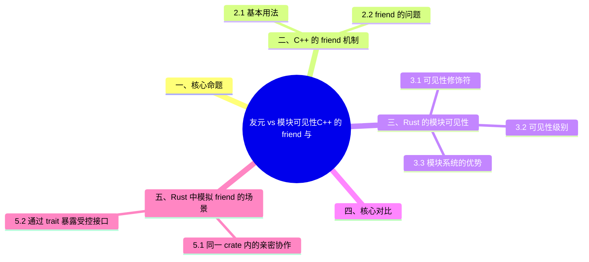

> **内容分级**: [综述级]
>
# 友元 vs 模块可见性：C++ 的 `friend` 与 Rust 的隐私边界
>
> **EN**: Friend vs Module Privacy
> **Summary**: Comparison of C++ `friend` access control and Rust module visibility system.
> **Rust 版本**: 1.97.0+ (Edition 2024)
>
> **受众**: [进阶]
> **权威来源**: 本文件为 `concept/` 权威页。
> **层级分工声明**: 本文件虽位于 L2（`02_intermediate/`），但属**跨语言对比专题**（C++ ↔ Rust），保留在 L2 是因为其内容服务于对应 L2 概念（类型/宏（Macro）/错误处理（Error Handling）/构造/可见性）的就近对照学习；L5 对比分析层索引与反链见 [`05_comparative/README.md`](../../05_comparative/README.md) §“L2 跨语言对比专题登记”。
> **层级**: L2 进阶概念
> **A/S/P 标记**: C+S — Comparison + Structure
> **双维定位**: C×Ana
> **前置概念**: [Module System](01_module_system.md) · [Ownership](../../01_foundation/01_ownership_borrow_lifetime/01_ownership.md) · [Traits](../00_traits/01_traits.md)
> **后置概念**: [C++ Surface Features](../../05_comparative/00_paradigms/03_cpp_rust_surface_features.md) · [API Design Patterns](../../06_ecosystem/03_design_patterns/18_api_design_patterns.md)
> **主要来源**:
> · [RustBelt — POPL 2018](https://plv.mpi-sws.org/rustbelt/popl18/) ·
> [O'Hearn — Separation Logic and Shared Mutable Data](https://doi.org/10.1017/S0960129501001003) ·
> [Brown University — Concepts in Rust Programming](https://cel.cs.brown.edu/crp/) ·
> [Brown Interactive Rust Book](https://rust-book.cs.brown.edu/) ·
> [Itanium C++ ABI](https://itanium-cxx-abi.github.io/cxx-abi/abi.html)
>
> [TRPL Ch 7 — Modules](https://doc.rust-lang.org/book/ch07-00-managing-growing-projects-with-packages-crates-and-modules.html) ·
> [Rust Reference — Visibility and Privacy](https://doc.rust-lang.org/reference/visibility-and-privacy.html) ·
> [Rust by Example — Visibility](https://doc.rust-lang.org/rust-by-example/mod/visibility.html) ·
> [cppreference — Friend](https://en.cppreference.com/w/cpp/language/friend) ·
> [C++ Core Guidelines — C.182: Use anonymous namespaces to limit visibility](https://isocpp.github.io/CppCoreGuidelines/CppCoreGuidelines#Rc-member)
>
---

> **Bloom 层级**: L2-L4

---

## 一、核心命题

> **C++ 用 `friend` 显式破坏封装，把私有成员暴露给指定的外部类或函数；
> Rust 没有 `friend`，而是通过模块（Module）系统的层级可见性精确控制"谁可以看什么"。
> 两种设计体现了不同的封装哲学：C++ 是"默认封闭、显式授权"，Rust 是"默认私有、层级开放"。**

---

## 二、C++ 的 `friend` 机制

C++ `friend` 是访问控制的**例外通道**：`friend class X;`/`friend void f();` 授权特定类或函数访问本类的私有成员。两个关键事实：

1. **friend 是单向、非传递、不被继承的**——A 声明 B 为 friend 不意味着 B 的友元也是 A 的友元；
2. **friend 声明本身不受访问控制约束**——可在类的任何段声明，效果相同。

friend 的问题（2.2）是它破坏了「类是封装单元」的推理模型：friend 关系不体现在接口上，审查封装边界必须全文搜索 friend 声明；且 friend 是「全有或全无」授权——无法只开放部分成员。Rust 没有对应机制并非遗漏：模块（Module）系统把「亲密协作」的粒度从**类**上移到**模块**——同一模块内的项天然互访私有成员，跨模块的受控开放用 `pub(in path)` 精确表达。

### 2.1 基本用法

```cpp
class Wallet {
private:
    int balance_ = 0;

public:
    void deposit(int amount) { balance_ += amount; }

    friend class Auditor; // Auditor 可访问私有成员
};

class Auditor {
public:
    int inspect(const Wallet& w) {
        return w.balance_; // ✅ 合法，因为 Auditor 是 friend
    }
};
```

`friend` 可以授予 (Source: [cppreference — Friend](https://en.cppreference.com/w/cpp/language/friend))：

- 另一个类（`friend class X;`）
- 一个函数（`friend void f();`）
- 一个成员函数（`friend void X::f();`）
- 一个模板函数/类

### 2.2 `friend` 的问题

- **封装破坏**：`friend` 是类对外部代码的显式"开后门"。
- **可维护性差**：类的私有实现细节暴露在 `friend` 声明中，修改实现可能影响所有 friend。
- **测试困难**：测试类常需要成为被测类的 friend，增加耦合。
- **不可传递**：如果 A 是 B 的 friend，B 是 C 的 friend，A 不能自动访问 C 的私有成员。

---

## 三、Rust 的模块可见性

本节聚焦「Rust 的模块可见性」，覆盖可见性修饰符、可见性级别与模块系统的优势。论述顺序由定义到边界：先明确「Rust 的模块可见性」在「友元 vs 模块可见性：C++ 的 `friend` 与 Rust 的隐私边界」中的确切含义与适用范围，再给出可核验的例证或数据，最后标注它与相邻主题的分界线。读完后应能用一句话复述「Rust 的模块可见性」的判定标准，并指出它在全页论证链中的位置。

### 3.1 可见性修饰符

Rust 没有 `friend`，用模块系统控制可见性 (Source: [Rust Reference — Visibility and Privacy](https://doc.rust-lang.org/reference/visibility-and-privacy.html))：

```rust
mod wallet {
    pub struct Wallet { balance: i32 }

    impl Wallet {
        pub fn new() -> Self { Wallet { balance: 0 } }
        pub fn deposit(&mut self, amount: i32) { self.balance += amount; }
        pub(super) fn balance(&self) -> i32 { self.balance }
    }
}

mod audit {
    use super::wallet::Wallet;

    pub struct Auditor;

    impl Auditor {
        pub fn inspect(w: &Wallet) -> i32 {
            w.balance() // ✅ 合法，因为 balance() 对父模块可见
        }
    }
}
```

### 3.2 可见性级别

| 修饰符 | 含义 |
|:---|:---|
| （默认） | 仅当前模块可见 |
| `pub` | 完全公开 |
| `pub(crate)` | 整个 crate 可见 |
| `pub(super)` | 父模块可见 |
| `pub(in path)` | 指定路径模块可见 |
| `pub(self)` | 等价于默认私有 |

(Source: [Rust Reference — Visibility and Privacy](https://doc.rust-lang.org/reference/visibility-and-privacy.html))

### 3.3 模块系统的优势

- **封装保持完整**：没有外部代码能绕过可见性规则访问私有字段。
- **可审计性**：通过 `pub(crate)`、`pub(super)` 等修饰符，可见性在代码中一目了然。
- **测试支持**：测试可以放在同一模块或 `tests/` 目录，使用 `pub(crate)` 访问内部状态。
- **层级化**：可见性随模块树层级自然扩展，不需要显式授权列表。

---

## 四、核心对比

| 维度 | C++ `friend` | Rust 模块可见性 |
|:---|:---|:---|
| 机制 | 授予特定类/函数私有访问权 | 通过模块层级控制可见范围 |
| 封装影响 | 显式破坏封装 | 封装保持完整 |
| 粒度 | 类级别 + 成员级别 | 模块级别 + item 级别 |
| 可传递性 | 不可传递 | 子模块自动继承父模块的可见范围 |
| 可审计性 | 分散的 friend 声明难以追踪 | 模块树 + 可见性修饰符清晰 |
| 测试支持 | 常依赖 friend 或 protected | `pub(crate)` / `#[cfg(test)]` |
| 典型用途 | 运算符重载、单元测试、紧密耦合类 | 库 API 设计、内部模块组织 |

---

## 五、Rust 中模拟 `friend` 的场景

C++ friend 的典型用途在 Rust 中的对应方案，按场景分两类：

- **同一 crate 内的亲密协作**（5.1）：把协作的多个类型放**同一模块**——模块内私有项互相可见，对外保持封装。这是 friend 最主要的用途（如 `std::collections` 中 `HashMap` 与其迭代器（Iterator）的内部协作）；需要跨模块时用 `pub(crate)` 或 `pub(in crate::a::b)` 精确授权到路径；
- **通过 trait 暴露受控接口**（5.2）：需要「只开放部分能力给外部」时，定义 `pub(crate) trait Internal { ... }`——外部无法 `use` 该 trait 即无法调用其方法（trait 方法调用要求 trait 可见），实现「能力级」而非「成员级」的访问控制。

迁移判定：C++ 中 friend 用于「测试访问私有成员」的场景，Rust 对应 `#[cfg(test)] mod tests` 置于同模块（测试即内部代码）；用于「操作符重载访问私有」的场景，Rust 的 trait 实现在同 crate 内天然可访问。

### 5.1 同一 crate 内的亲密协作

```rust
// crate::internal 模块
pub(crate) mod internal {
    pub struct InnerState { pub(crate) value: i32 }
}
```

`pub(crate)` 允许同一 crate 内的所有模块访问，类似"crate 级 friend"。

### 5.2 通过 trait 暴露受控接口

```rust
mod sensor {
    pub struct Sensor { reading: f64 }

    pub trait Calibrate {
        fn raw_reading(&self) -> f64;
    }

    impl Calibrate for Sensor {
        fn raw_reading(&self) -> f64 { self.reading }
    }
}
```

通过 trait 暴露只读访问，比 C++ `friend` 更结构化。

---

## 六、形式化视角

C++ 的封装模型可以形式化为：

```text
access(c, m, x) = private  unless  friend(c, x) ∨ x ∈ c
```

即类 `c` 的成员 `m` 默认对类外 `x` 不可访问，除非 `x` 被声明为 friend。

Rust 的封装模型可以形式化为：

```text
access(item, module) = visible  iff  item 在 module 的可见范围内
```

可见范围由模块树和 `pub(...)` 修饰符共同决定，不需要特例授权。

> **关键洞察**：C++ 的 `friend` 是封装规则的"例外列表"；Rust 的模块可见性是封装规则的"范围定义"。前者需要显式维护授权关系，后者通过结构本身表达边界。

---

## 七、总结

- **L1**：C++ 用 `friend` 开放私有访问；Rust 没有 `friend`，用模块可见性控制访问范围。
- **L2**：Rust 的 `pub(crate)` / `pub(super)` / `pub(in path)` 可以覆盖大部分 C++ `friend` 的使用场景，同时保持封装。
- **L3**：C++ `friend` 是封装规则的例外机制，增加了耦合和审计难度；Rust 模块可见性是封装规则的结构化表达，使边界成为代码组织的一部分。

---

## 八、延伸阅读

- [TRPL: Packages, Crates, and Modules](https://doc.rust-lang.org/book/ch07-00-managing-growing-projects-with-packages-crates-and-modules.html)
- [Rust by Example: Visibility](https://doc.rust-lang.org/rust-by-example/mod/visibility.html)
- [Rust Reference: Visibility and Privacy](https://doc.rust-lang.org/reference/visibility-and-privacy.html)
- [cppreference: Friend](https://en.cppreference.com/w/cpp/language/friend)
- [C++ Core Guidelines: Prefer minimal encapsulation](https://isocpp.github.io/CppCoreGuidelines/CppCoreGuidelines#S-class)

---

> **权威来源**:
> [TRPL — Packages, Crates, and Modules](https://doc.rust-lang.org/book/ch07-00-managing-growing-projects-with-packages-crates-and-modules.html),
> [Rust Reference — Visibility and Privacy](https://doc.rust-lang.org/reference/visibility-and-privacy.html),
> [Rust by Example — Visibility](https://doc.rust-lang.org/rust-by-example/mod/visibility.html),
> [cppreference — Friend](https://en.cppreference.com/w/cpp/language/friend)
> **权威来源对齐变更日志**: 2026-07-04 创建，对齐 Rust 1.97.0 (Edition 2024)
> **状态**: ✅ 权威来源对齐完成

---

## 国际权威参考 / International Authority References（P1 学术 · P2 生态）

> 依据 `AGENTS.md` §2「对齐网络国际化权威内容」补充：仅追加已验证可达的权威链接，不改动正文事实。

- **P2 生态/社区**: [docs.rs/toml — 生态权威 API 文档](https://docs.rs/toml) · [docs.rs/cargo_metadata — 生态权威 API 文档](https://docs.rs/cargo_metadata)

## 📋 关键属性

| 属性 | 取值 / 判定 | 依据 |
|---|---|---|
| 机制对比 | C++ `friend` 例外授权 vs Rust 模块边界无例外 | 语言设计 |
| 粒度 | Rust 以 `pub(in path)` 等细粒度可见性替代 | Reference |
| 检查时机 | Rust 隐私全部编译期检查 | 静态规则 |
| 封装强度 | 模块边界不可被声明突破 | 隐私规则 |
| 模拟方案 | 同模块子模块 / `pub(crate)` 达成近似效果 | 工程模式 |

## 🔗 概念关系

- **上位（is-a）**：[Module System](01_module_system.md) 可见性规则的跨语言对照。
- **下位（实例）**：`pub(crate)` 等模拟场景见本页「Rust 中模拟 friend 的场景」节。
- **对偶**：C++ `friend` 机制本身即对偶对象（本页主线）。
- **组合**：与 [Use Declarations](../../01_foundation/07_modules_and_items/03_use_declarations.md) 的引入端规则组合。
- **依赖**：模块基础见 [Modules and Paths](../../01_foundation/07_modules_and_items/01_modules_and_paths.md)。

---

## ⚠️ 反例与陷阱：跨模块访问私有字段

**反例**（rustc 1.97 实测编译失败：E0616）：

```rust,compile_fail
mod inner {
    pub struct Config { retries: u32 }
    pub fn default_config() -> Config { Config { retries: 3 } }
}
fn main() {
    let c = inner::default_config();
    println!("{}", c.retries);
}
```

Rust 没有 C++ `friend`；`pub struct` 的私有字段对外部模块不可见，可见性边界就是隐私边界。需要受控暴露时用 `pub(crate)` 或访问器。

**修正**：

```rust
mod inner {
    pub struct Config { retries: u32 }
    impl Config { pub fn retries(&self) -> u32 { self.retries } }
    pub fn default_config() -> Config { Config { retries: 3 } }
}
fn main() {
    let c = inner::default_config();
    println!("{}", c.retries());
}
```

## 🧭 思维导图（Mindmap）


