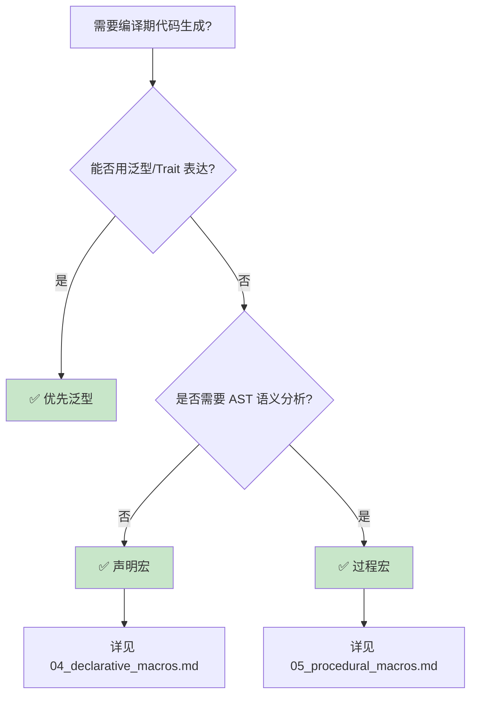
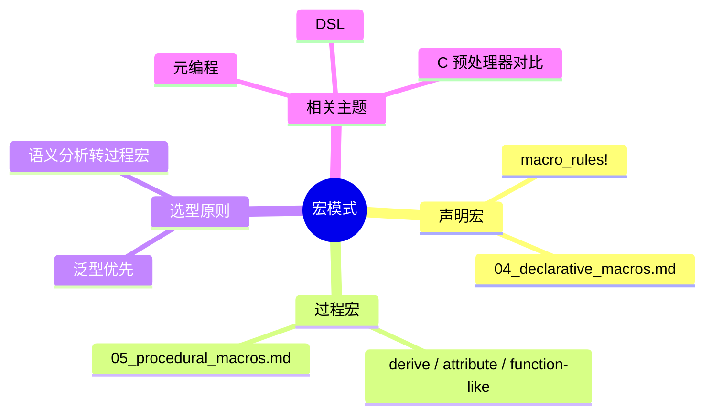

> **内容分级**: [综述级]
> **本节关键术语**: 宏模式 (Macro Pattern) · 声明宏 (Declarative Macro) · 过程宏 (Procedural Macro) — [完整对照表](../../00_meta/01_terminology/01_terminology_glossary.md)
>
# 宏模式：编译期代码生成的工程实践
>
> **EN**: Macro Patterns
> **Summary**: Index/stub for macro engineering patterns; full content moved to declarative and procedural macro canonical pages.
> **Rust 版本**: 1.97.0+ (Edition 2024)
>
> **📎 交叉引用（Reference）**
>
> 本文件为 `concept/` 中宏模式的**索引/重定向 stub**。
>
> **受众**: [进阶]
> **Bloom 层级**: L3
> **权威来源**: 本文件为索引 stub；通用 Rust 宏概念解释请见：
>
> - [`04_declarative_macros.md`](04_declarative_macros.md) — `macro_rules!`、卫生性、重复模式、TT-munching
> - [`05_procedural_macros.md`](05_procedural_macros.md) — derive/attribute/function-like 过程宏、TokenStream、syn/quote
>
> **定位**: 保留宏模式的高级选型视角与交叉引用入口，具体概念推导已迁移到上述两个权威页。
> **前置概念**: [Attributes and Macros](../../01_foundation/09_macros_basics/01_attributes_and_macros.md) · [Traits](../00_traits/01_traits.md)
> **后置概念**: [Metaprogramming](06_metaprogramming.md) · [DSL](02_dsl_and_embedding.md)

---

> **来源**: [Rust Reference — Macros](https://doc.rust-lang.org/reference/macros.html) · [Rust Reference — Macros by Example](https://doc.rust-lang.org/reference/macros-by-example.html) · [Rust Reference — Procedural Macros](https://doc.rust-lang.org/reference/procedural-macros.html) · [TRPL Ch19 — Macros](https://doc.rust-lang.org/book/ch19-06-macros.html) · [The Little Book of Rust Macros](https://veykril.github.io/tlborm/)

## 宏模式选型树

## 相关概念

- [声明宏](04_declarative_macros.md) — `macro_rules!` 权威页
- [过程宏](05_procedural_macros.md) — derive/attribute/function-like 权威页
- [元编程](06_metaprogramming.md) — Rust 编译期代码生成总览
- [DSL 与嵌入式设计](02_dsl_and_embedding.md) — 宏在 DSL 中的应用
- [C 预处理器 vs Rust 宏](07_c_preprocessor_vs_rust_macros.md) — 文本替换 vs 语法树宏

---

## 权威来源索引

> **权威来源**: [Rust Reference — Macros](https://doc.rust-lang.org/reference/macros.html), [Rust Reference — Macros by Example](https://doc.rust-lang.org/reference/macros-by-example.html), [Rust Reference — Procedural Macros](https://doc.rust-lang.org/reference/procedural-macros.html), [TRPL Ch19 — Macros](https://doc.rust-lang.org/book/ch19-06-macros.html)
>
> **权威来源对齐变更日志**: 2026-07-31 拆分为 [`04_declarative_macros.md`](04_declarative_macros.md) 与 [`05_procedural_macros.md`](05_procedural_macros.md)

**文档版本**: 2.0
**最后更新**: 2026-07-31
**状态**: ✅ 已转为索引 stub

---

## 🧭 思维导图（Mindmap）

