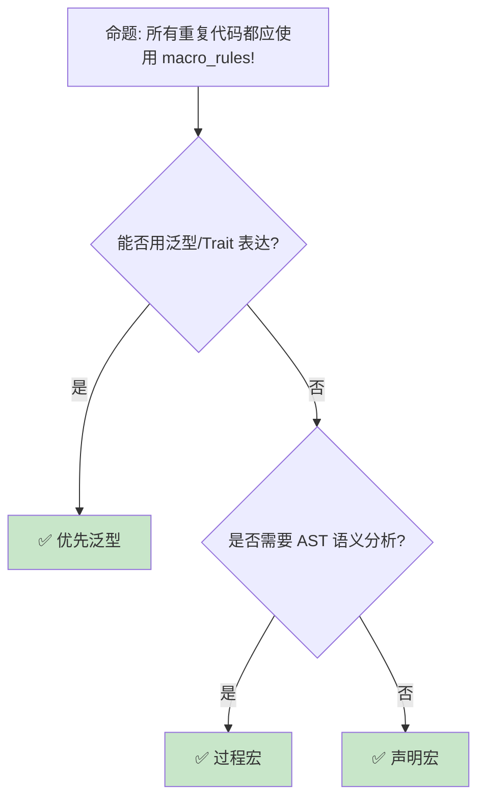

> **内容分级**: [综述级]
> **本节关键术语**: 声明宏 (Declarative Macro) · `macro_rules!` · 卫生宏 (Hygienic Macro) · 片段分类符 (Fragment Specifier) · 重复模式 (Repetition) · TT-munching · `$crate` — [完整对照表](../../00_meta/01_terminology/01_terminology_glossary.md)
>
# 声明宏：`macro_rules!`、卫生性与 TT-munching
>
> **EN**: Declarative Macros
> **Summary**: Declarative macros in Rust: `macro_rules!` syntax, hygiene, fragment specifiers, repetitions, TT-munching, and common pitfalls.
> **Rust 版本**: 1.97.0+ (Edition 2024)
>
> **📎 交叉引用（Reference）**
>
> 本主题为 `concept/` 中 Rust **声明宏**的**唯一权威页**。
>
> **受众**: [进阶]
> **Bloom 层级**: L2-L3
> **权威来源**: 本文件为 `concept/` 权威页。
> **定位**: 系统讲解 `macro_rules!` 的语法、卫生性、重复模式、TT-munching 等高级技术，以及声明宏与过程宏的选型边界。
> **前置概念**: [Attributes and Macros](../../01_foundation/09_macros_basics/01_attributes_and_macros.md) · [Traits](../00_traits/01_traits.md)
> **后置概念**: [Procedural Macros](05_procedural_macros.md) · [DSL](02_dsl_and_embedding.md) · [Metaprogramming](06_metaprogramming.md)

---

> **来源**: [Rust Reference — Macros by Example](https://doc.rust-lang.org/reference/macros-by-example.html) · [Rust Reference — Macros](https://doc.rust-lang.org/reference/macros.html) · [TRPL Ch19 — Macros](https://doc.rust-lang.org/book/ch19-06-macros.html) · [The Little Book of Rust Macros](https://veykril.github.io/tlborm/) · [Rust API Guidelines — Macros](https://rust-lang.github.io/api-guidelines/macros.html)

## 📑 目录

- [声明宏：`macro_rules!`、卫生性与 TT-munching](#声明宏macro_rules卫生性与-tt-munching)
  - [一、核心概念](#一核心概念)
    - [1.1 声明宏的定位](#11-声明宏的定位)
    - [1.2 `macro_rules!` 基本结构](#12-macro_rules-基本结构)
    - [1.3 卫生性（Hygiene）](#13-卫生性hygiene)
    - [1.4 片段分类符](#14-片段分类符)
  - [二、技术细节](#二技术细节)
    - [2.1 重复模式](#21-重复模式)
    - [2.2 递归与 TT-munching](#22-递归与-tt-munching)
    - [2.3 `$crate` 与路径解析](#23-crate-与路径解析)
    - [2.4 可见性与导出](#24-可见性与导出)
  - [三、使用模式](#三使用模式)
  - [四、反命题与边界分析](#四反命题与边界分析)
    - [4.1 反命题树](#41-反命题树)
    - [4.2 边界极限](#42-边界极限)
  - [五、常见陷阱](#五常见陷阱)
  - [六、来源与延伸阅读](#六来源与延伸阅读)
  - [相关概念](#相关概念)
  - [权威来源索引](#权威来源索引)
  - [十、边界测试：声明宏的编译错误](#十边界测试声明宏的编译错误)
    - [10.1 边界测试：`expr` 后接 `+` 的解析歧义（编译错误）](#101-边界测试expr-后接--的解析歧义编译错误)
    - [10.2 边界测试：宏内变量 hygiene 与外部作用域隔离（编译错误）](#102-边界测试宏内变量-hygiene-与外部作用域隔离编译错误)
    - [10.3 边界测试：TT-muncher 模式不匹配（编译错误）](#103-边界测试tt-muncher-模式不匹配编译错误)
    - [10.4 边界测试：递归深度限制（编译错误）](#104-边界测试递归深度限制编译错误)
    - [10.5 边界测试：多次求值陷阱（逻辑错误）](#105-边界测试多次求值陷阱逻辑错误)
  - [嵌入式测验（Embedded Quiz）](#嵌入式测验embedded-quiz)
    - [测验 1：`$x:expr` 与 `$x:tt` 的区别（理解层）](#测验-1xexpr-与-xtt-的区别理解层)
    - [测验 2：声明宏的卫生性解决什么问题（理解层）](#测验-2声明宏的卫生性解决什么问题理解层)
    - [测验 3：`macro_rules!` 能否递归（应用层）](#测验-3macro_rules-能否递归应用层)
  - [实践](#实践)
  - [认知路径](#认知路径)
    - [核心推理链](#核心推理链)
  - [国际权威参考 / International Authority References（P1 学术 · P2 生态）](#国际权威参考--international-authority-referencesp1-学术--p2-生态)
  - [📋 关键属性](#-关键属性)
  - [🔗 概念关系](#-概念关系)
  - [🧭 思维导图（Mindmap）](#-思维导图mindmap)

---

## 一、核心概念

### 1.1 声明宏的定位

声明宏（Declarative Macro）是 Rust 提供的**编译期模式匹配与代码生成**机制，通过 `macro_rules!` 定义。它在编译器的宏展开阶段工作，输入/输出都是 token tree。与 C 预处理器不同，`macro_rules!` 操作的是**结构化 token**，并且默认具有**卫生性**。

```text
适用场景:
├── 批量 trait 实现
├── 重复的代码模板
├── 小型 DSL
├── 测试辅助宏
└── 条件编译封装

不适用场景:
├── 需要分析类型语义
├── 需要生成新标识符拼接
├── 复杂 AST 变换
└── 跨 crate 需要稳定 API 的复杂宏
```

> **核心洞察**: 声明宏的价值在于「用模式匹配消除语法层面的重复」，而非替代类型系统或泛型。
> [来源: [Rust Reference — Macros by Example](https://doc.rust-lang.org/reference/macros-by-example.html)]

---

### 1.2 `macro_rules!` 基本结构

```rust
macro_rules! foo {
    (pattern1) => { expansion1 };
    (pattern2) => { expansion2 };
}
```

匹配按**顺序贪婪**进行：从上到下，第一个成功匹配的 arm 被展开。

```rust
macro_rules! say_hello {
    () => {
        println!("Hello, world!");
    };
}

say_hello!();
```

宏参数通过 `$name:kind` 绑定：

```rust
macro_rules! double {
    ($x:expr) => {
        ($x) * 2
    };
}

let n = double!(3 + 2); // (3 + 2) * 2 = 10
```

> **注意**: 展开式中通常需要给参数加括号，避免优先级问题。
> [来源: [TRPL Ch19 — Macros](https://doc.rust-lang.org/book/ch19-06-macros.html)]

---

### 1.3 卫生性（Hygiene）

卫生性保证宏内部引入的标识符不会与调用方作用域中的标识符意外冲突。

```rust
macro_rules! declare_x {
    () => {
        let x = 42;
    };
}

fn main() {
    declare_x!();
    // println!("{}", x); // ❌ x 在宏外部不可见
}
```

这也意味着宏不能自动访问外部变量——所有依赖必须显式传入。

```rust
macro_rules! use_x {
    ($x:expr) => {
        println!("{}", $x)
    };
}

fn main() {
    let x = 42;
    use_x!(x); // ✅ 显式传递
}
```

> **卫生性洞察**: 卫生宏消除了 C 预处理器类宏的命名污染问题，但也要求宏设计时显式传递依赖。
> [来源: [The Little Book of Rust Macros — Hygiene](https://veykril.github.io/tlborm/)]

---

### 1.4 片段分类符

`macro_rules!` 提供多种片段分类符（fragment specifiers）：

| 分类符 | 匹配内容 | 示例 |
|---|---|---|
| `expr` | 表达式 | `1 + 2`, `foo()` |
| `ty` | 类型 | `i32`, `Vec<T>` |
| `pat` | 模式 | `Some(x)`, `_` |
| `stmt` | 语句 | `let x = 1;` |
| `block` | 代码块 | `{ ... }` |
| `ident` | 标识符 | `foo`, `Bar` |
| `path` | 路径 | `std::vec::Vec` |
| `tt` | 任意 token tree | 最灵活 |
| `meta` | 属性内容 | `#[$meta]` |
| `lifetime` | 生命周期 | `'a` |

```rust
macro_rules! type_alias {
    ($name:ident = $ty:ty) => {
        type $name = $ty;
    };
}

type_alias!(Int = i32);
```

> **选择原则**: 需要语法检查时用 `expr`/`ty`/`pat`；需要最大灵活性或做递归解析时用 `tt`。
> [来源: [Rust Reference — Macro Fragments](https://doc.rust-lang.org/reference/macros-by-example.html#metavariables)]

---

## 二、技术细节

### 2.1 重复模式

`$($x:expr),*` 表示零个或多个由逗号分隔的 `expr`。

```rust
macro_rules! vec_like {
    ($($x:expr),* $(,)?) => {
        {
            let mut v = Vec::new();
            $(
                v.push($x);
            )*
            v
        }
    };
}

let v = vec_like![1, 2, 3,];
```

重复分隔符：
- `,` 逗号分隔
- `;` 分号分隔
- `=>` 箭头分隔
- 无分隔符： `$($x:tt)*`

`$(,)?` 允许可选尾部逗号。

> **技巧**: 使用 `$( ... )*` 内嵌 `$x` 时，外层和内层的重复变量名必须一致。
> [来源: [Rust Reference — Repetitions](https://doc.rust-lang.org/reference/macros-by-example.html#repetitions)]

---

### 2.2 递归与 TT-munching

`macro_rules!` 支持递归调用，常用于处理变长参数或实现编译期算法。

```rust
macro_rules! count_tts {
    () => { 0 };
    ($head:tt $($tail:tt)*) => {
        1 + count_tts!($($tail)*)
    };
}

fn main() {
    let n = count_tts!(1 2 3 4 5);
    assert_eq!(n, 5);
}
```

TT-muncher 是声明宏的高级技巧：每次递归消耗一个或一对 `tt`，直到参数为空。

> **风险**: 递归深度默认限制为 128，可通过 `#![recursion_limit = "256"]` 调整；但过度递归会显著增加编译时间。
> [来源: [The Little Book of Rust Macros — TT Munchers](https://veykril.github.io/tlborm/)]

---

### 2.3 `$crate` 与路径解析

`#[macro_export]` 导出的宏在调用点展开，可能遇到路径解析问题。`$crate` 强制指向定义宏的 crate。

```rust
#[macro_export]
macro_rules! internal_api {
    () => {
        $crate::private_fn();
    };
}

fn private_fn() {}
```

> **最佳实践**: 宏展开中引用本 crate 的项时，始终使用 `$crate` 前缀，避免调用方同名项干扰。
> [来源: [Rust Reference — Hygiene and $crate](https://doc.rust-lang.org/reference/macros-by-example.html#hygiene)]

---

### 2.4 可见性与导出

- `macro_rules!` 默认具有整个 crate 的可见性（在同一 crate 内任意模块可用）。
- `#[macro_export]` 将宏导出到 crate 根，可被外部 crate 使用。
- Rust 2018+ 支持 `#[macro_use]` 与 crate 级 `use` 导入宏。

```rust
// 在 crate 根 re-export
pub use my_macro;
```

---

## 三、使用模式

```text
声明宏选型:

简单代码生成:
  → impl_display!(Type1, Type2)

变长参数处理:
  → vec_like![1, 2, 3]

条件编译封装:
  → platform_specific! { ... }

测试辅助:
  → test_case!(input, expected)

编译期断言:
  → const_assert!(SIZE > 0)

DSL:
  → router! { GET /users => list_users }
  （简单 DSL 可用声明宏，复杂 DSL 建议过程宏）
```

---

## 四、反命题与边界分析

### 4.1 反命题树



---

### 4.2 边界极限

| 边界 | 说明 | 缓解策略 |
|---|---|---|
| 无法分析类型 | `macro_rules!` 不知道 `$x` 的具体类型 | 需要语义分析时转过程宏 |
| 标识符拼接 | 无法真正生成新标识符 | 使用 `paste` crate 或过程宏 |
| 错误信息 | 宏内部错误定位困难 | 使用 `compile_error!` 提供清晰错误 |
| 递归限制 | 默认 128 层 | 提供终止条件，必要时调高限制 |
| IDE 支持 | 宏展开后代码难以跳转 | 保持宏简单，提供文档示例 |

---

## 五、常见陷阱

```text
陷阱 1: 多次求值
  ❌ macro_rules! bad_double {
       ($x:expr) => { $x + $x }
     }
     // bad_double!(expensive()) 调用两次

  ✅ macro_rules! safe_double {
       ($x:expr) => {{
         let val = $x;
         val + val
       }}
     }

陷阱 2: 优先级问题
  ❌ macro_rules! multiply {
       ($a:expr, $b:expr) => { $a * $b }
     }
     // multiply!(1 + 2, 3) → 1 + 2 * 3 = 7

  ✅ macro_rules! multiply {
       ($a:expr, $b:expr) => { ($a) * ($b) }
     }

陷阱 3: 尾部逗号
  ❌ macro_rules! bad_list {
       ($($x:expr),*) => { vec![$($x),*] }
     }
     // bad_list!(1, 2, 3,) 编译错误

  ✅ macro_rules! good_list {
       ($($x:expr),* $(,)?) => { vec![$($x),*] }
     }

陷阱 4: 模式顺序
  ❌ macro_rules! ambiguous {
       ($e:expr) => { ... };
       ($i:ident) => { ... };
     }
     // 通用模式在前会拦截具体模式

  ✅ 将更具体的模式放在前面

陷阱 5: 无限递归
  ❌ macro_rules! infinite {
       () => { infinite!() }
     }

  ✅ 确保递归有终止条件
```

---

## 六、来源与延伸阅读

| 来源 | 可信度 | 说明 |
|:---|:---:|:---|
| [Rust Reference — Macros by Example](https://doc.rust-lang.org/reference/macros-by-example.html) | ✅ P1 | 声明宏权威参考 |
| [Rust Reference — Macros](https://doc.rust-lang.org/reference/macros.html) | ✅ P1 | 宏系统总览 |
| [TRPL Ch19 — Macros](https://doc.rust-lang.org/book/ch19-06-macros.html) | ✅ P1 | 入门教程 |
| [The Little Book of Rust Macros](https://veykril.github.io/tlborm/) | ✅ P2 | 社区权威指南 |
| [Rust API Guidelines — Macros](https://rust-lang.github.io/api-guidelines/macros.html) | ✅ P2 | API 设计建议 |
| [paste crate](https://docs.rs/paste/latest/paste/) | ✅ P2 | 标识符拼接 |

---

## 相关概念

- **前置概念**: [Attributes and Macros](../../01_foundation/09_macros_basics/01_attributes_and_macros.md)
- **互补技术**: [Procedural Macros](05_procedural_macros.md)
- **组合使用**: [DSL](02_dsl_and_embedding.md) · [Metaprogramming](06_metaprogramming.md)
- **对比**: [C Preprocessor vs Rust Macros](07_c_preprocessor_vs_rust_macros.md)

---

## 权威来源索引

> **权威来源**: [Rust Reference — Macros by Example](https://doc.rust-lang.org/reference/macros-by-example.html), [Rust Reference — Macros](https://doc.rust-lang.org/reference/macros.html), [TRPL Ch19 — Macros](https://doc.rust-lang.org/book/ch19-06-macros.html), [The Little Book of Rust Macros](https://veykril.github.io/tlborm/), [Rust API Guidelines — Macros](https://rust-lang.github.io/api-guidelines/macros.html)
>
> **权威来源对齐变更日志**: 2026-07-31 从 `03_macro_patterns.md` 拆分独立为声明宏权威页

**文档版本**: 1.0
**最后更新**: 2026-07-31
**状态**: ✅ 概念文件创建完成

---

## 十、边界测试：声明宏的编译错误

### 10.1 边界测试：`expr` 后接 `+` 的解析歧义（编译错误）

```rust,compile_fail
macro_rules! bad {
    ($e:expr + $rest:tt) => { ... };
}
```

> **修正**: `expr` 片段后只能跟 `=>`、`,`、`;` 等有限分隔符，不能直接跟 `+` 等运算符。需要拆分为多个 `tt` 或在调用处加括号。
> [来源: [Rust Reference — Macros by Example](https://doc.rust-lang.org/reference/macros-by-example.html)]

---

### 10.2 边界测试：宏内变量 hygiene 与外部作用域隔离（编译错误）

```rust,compile_fail
macro_rules! declare_x {
    () => {
        let x = 42;
    };
}

fn main() {
    declare_x!();
    println!("{}", x); // ❌ cannot find value `x`
}
```

> **修正**: Rust 声明宏具有卫生性，宏内部 `let` 绑定的标识符不会泄漏到调用点。若需返回值，应使用表达式。
> [来源: [Rust Reference — Hygiene](https://doc.rust-lang.org/reference/macros-by-example.html#hygiene)]

---

### 10.3 边界测试：TT-muncher 模式不匹配（编译错误）

```rust,compile_fail
macro_rules! count_tts {
    () => { 0 };
    ($odd:tt $($a:tt $b:tt)*) => { 1 + count_tts!($($a)*) };
}

fn main() {
    let n = count_tts!(1 2); // ❌ 偶数个 token 无法匹配
}
```

> **修正**: TT-muncher 的模式必须覆盖所有可能的输入形态。此模式要求奇数个 token，传入偶数个时无匹配 arm。
> [来源: [The Little Book of Rust Macros — TT Munchers](https://veykril.github.io/tlborm/)]

---

### 10.4 边界测试：递归深度限制（编译错误）

```rust,compile_fail
macro_rules! deep {
    () => { deep!() };
}

fn main() {
    deep!(); // ❌ recursion limit reached
}
```

> **修正**: 合法递归必须有终止条件。可使用 `#![recursion_limit = "..."]` 提高限制，但不应依赖此方式。
> [来源: [Rust Reference — Macros by Example](https://doc.rust-lang.org/reference/macros-by-example.html)]

---

### 10.5 边界测试：多次求值陷阱（逻辑错误）

```rust
macro_rules! bad_double {
    ($x:expr) => { $x + $x };
}

fn main() {
    let mut c = 0;
    let expensive = || { c += 1; c };
    let _ = bad_double!(expensive());
    assert_eq!(c, 2); // 闭包被调用了两次！
}
```

> **修正**: 宏参数在展开式中每出现一次就被求值一次。若参数有副作用或成本高，先绑定到局部变量。
> [来源: [The Little Book of Rust Macros — Pitfalls](https://veykril.github.io/tlborm/)]

---

## 嵌入式测验（Embedded Quiz）

### 测验 1：`$x:expr` 与 `$x:tt` 的区别（理解层）

**题目**: `$x:expr` 与 `$x:tt` 在宏匹配中有什么区别？

<details>
<summary>✅ 答案与解析</summary>

`:expr` 匹配完整表达式，会做语法检查，但不能匹配含顶层逗号的参数列表；`:tt` 匹配任意 token tree，最灵活但不做语法检查。
</details>

---

### 测验 2：声明宏的卫生性解决什么问题（理解层）

**题目**: 声明宏的卫生性（hygiene）主要解决什么问题？

<details>
<summary>✅ 答案与解析</summary>

防止宏内部引入的标识符与调用方作用域中的标识符意外冲突，宏内的局部绑定不会污染外部作用域。
</details>

---

### 测验 3：`macro_rules!` 能否递归（应用层）

**题目**: `macro_rules!` 宏可以递归调用自身吗？有什么限制？

<details>
<summary>✅ 答案与解析</summary>

可以递归，但必须有终止条件；Rust 对宏展开深度有默认限制（128 层），可用 `#![recursion_limit = "..."]` 调整。
</details>

---

## 实践

> **相关资源**:
>
> - [crates/c11_macro_system_proc](../../../crates/c11_macro_system_proc) — 宏系统相关可编译示例
> - [exercises/src/macros](../../../exercises/src/macros) — 动手编程挑战
>
> **建议**: 实现一个 `impl_display!` 宏，为多个类型批量实现 `Display` trait，并支持可选尾部逗号。

---

## 认知路径

> **认知路径**: 从 L1 的属性与宏基础出发，经由 `macro_rules!` 的语法与卫生性，通向 L3 的过程宏与 DSL 设计。

### 核心推理链

| 定理 | 前提 | 结论 | 置信度 |
|:---|:---|:---|:---|
| 理解片段分类符 ⟹ 正确匹配输入 | 知道 expr/tt/ident 等差异 | 能写出稳健的宏规则 | 高 |
| 掌握 hygiene ⟹ 避免命名污染 | 理解宏作用域隔离 | 能设计安全的宏 API | 高 |
| 识别声明宏边界 ⟹ 正确选型 | 知道类型分析与标识符拼接限制 | 能在声明宏与过程宏间选择 | 高 |

> 声明宏安全 ⟸ 卫生性
> 复杂代码生成 ⟸ 过程宏

---

## 国际权威参考 / International Authority References（P1 学术 · P2 生态）

| 来源 | 类型 | 链接 | 覆盖主题 |
|---|---|---|---|
| Rust Reference — Macros by Example | P1 | https://doc.rust-lang.org/reference/macros-by-example.html | 语法、片段、重复、卫生性 |
| Rust Reference — Macros | P1 | https://doc.rust-lang.org/reference/macros.html | 宏系统总览 |
| TRPL Ch19 — Macros | P1 | https://doc.rust-lang.org/book/ch19-06-macros.html | 入门与使用模式 |
| The Little Book of Rust Macros | P2 | https://veykril.github.io/tlborm/ | 高级技巧、陷阱 |
| Rust API Guidelines — Macros | P2 | https://rust-lang.github.io/api-guidelines/macros.html | API 设计 |

---

## 📋 关键属性

| 属性 | 取值 / 判定 | 依据 |
|---|---|---|
| 定义方式 | `macro_rules! name { ... }` | 语法 |
| 匹配策略 | 顺序贪婪匹配 | 宏展开规则 |
| 卫生性 | 局部标识符卫生 | Rust 宏系统 |
| 导出 | `#[macro_export]` | crate 可见性 |
| 路径安全 | `$crate` | 跨 crate 调用 |
| 递归限制 | 默认 128 层 | 编译器限制 |

---

## 🔗 概念关系

- **上位概念**: [Metaprogramming](06_metaprogramming.md) — 元编程的声明式分支。
- **互补**: [Procedural Macros](05_procedural_macros.md) — 命令式宏机制。
- **前置**: [Attributes and Macros](../../01_foundation/09_macros_basics/01_attributes_and_macros.md) — 宏基础语法。
- **组合**: [DSL](02_dsl_and_embedding.md) — 声明宏常用于简单 DSL。
- **对比**: [C Preprocessor vs Rust Macros](07_c_preprocessor_vs_rust_macros.md) — 文本替换 vs 卫生宏。

---

## 🧭 思维导图（Mindmap）

```mermaid
mindmap
  root((声明宏 macro_rules!))
    基本结构
      模式 => 展开
      顺序贪婪匹配
    片段分类符
      expr / ty / pat
      tt / ident / block
    重复模式
      $(...),*
      $(...);*
      可选尾部逗号
    卫生性
      局部标识符隔离
      显式传递依赖
    高级技术
      递归宏
      TT-munching
      $crate 路径
    常见陷阱
      多次求值
      优先级
      模式顺序
      递归无终止
    选型边界
      泛型优先
      语义分析转过程宏
```
