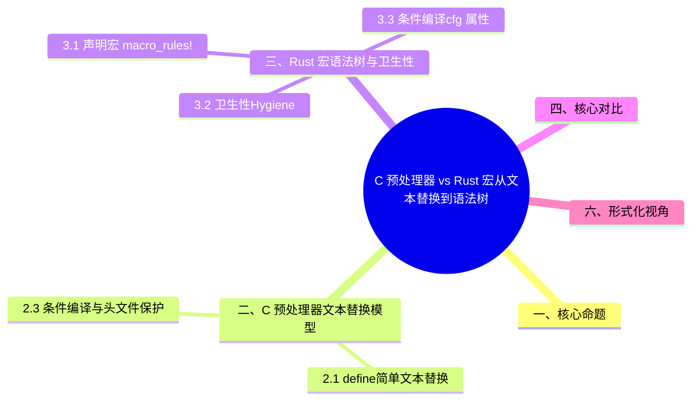

> **内容分级**: [综述级]
>
# C 预处理器 vs Rust 宏：从文本替换到语法树
>
> **EN**: C Preprocessor vs Rust Macros
> **Summary**: Comparison between the C preprocessor (textual substitution) and Rust macros (hygienic syntax-tree metaprogramming), covering conditional compilation, include guards, and macro hygiene.
> **Rust 版本**: 1.97.0+ (Edition 2024)
>
> **受众**: [进阶]
> **权威来源**: 本文件为 `concept/` 权威页。
> **层级分工声明**: 本文件虽位于 L2（`02_intermediate/`），但属**跨语言对比专题**（C++ ↔ Rust），保留在 L2 是因为其内容服务于对应 L2 概念（类型/宏（Macro）/错误处理（Error Handling）/构造/可见性）的就近对照学习；L5 对比分析层索引与反链见 [`05_comparative/README.md`](../../05_comparative/README.md) §“L2 跨语言对比专题登记”。
> **层级**: L2 进阶概念
> **A/S/P 标记**: C+S — Comparison + Structure
> **双维定位**: C×Ana
> **前置概念**: [Macros](../../03_advanced/03_proc_macros/01_macros.md) · [Generics](../01_generics/01_generics.md) · [Traits](../00_traits/01_traits.md)
> **后置概念**: [Proc Macro](../../03_advanced/03_proc_macros/02_proc_macro.md) · [DSL and Embedding](02_dsl_and_embedding.md)
> **主要来源**:
> · [Pierce — Types and Programming Languages](https://www.cis.upenn.edu/~bcpierce/tapl/) ·
> [System F](https://en.wikipedia.org/wiki/System_F) ·
> [Brown University — Concepts in Rust Programming](https://cel.cs.brown.edu/crp/) ·
> [Brown Interactive Rust Book](https://rust-book.cs.brown.edu/) ·
> [Itanium C++ ABI](https://itanium-cxx-abi.github.io/cxx-abi/abi.html) ·
> [Jung et al. — RustBelt: Securing the Foundations of Rust](https://plv.mpi-sws.org/rustbelt/popl18/)
>
> [TRPL Ch 19.5 — Macros](https://doc.rust-lang.org/book/ch19-06-macros.html) ·
> [Rust Reference — macro_rules!](https://doc.rust-lang.org/reference/macros-by-example.html) ·
> [The Little Book of Rust Macros](https://veykril.github.io/tlborm/) ·
> [C Preprocessor (cppreference)](https://en.cppreference.com/w/c/preprocessor) ·
> [Rust Reference — Conditional Compilation](https://doc.rust-lang.org/reference/conditional-compilation.html)
>
---

> **Bloom 层级**: L2-L4

---

## 一、核心命题

> **C 预处理器和 Rust 宏（Macro）都叫"宏"，但本质上是两个时代的产物。
> C 预处理器在文本层面做替换，不感知语法、类型和作用域；
> Rust 宏（Macro）在 token 流 / AST 层面操作，受卫生性（hygiene）约束，展开后仍受类型系统（Type System）检查。**
> (Source: [Rust Reference — Macros by Example](https://doc.rust-lang.org/reference/macros-by-example.html))

---

## 二、C 预处理器：文本替换模型

C 预处理器（CPP）是**编译前的文本替换器**——它在词法分析之前运行，对 C 语法完全无感知。三个核心机制及其代价：

1. **`#define` 文本替换**：`#define MAX(a,b) ((a)>(b)?(a):(b))`——括号防御性是程序员的负担；`MAX(i++, j)` 的双重求值是经典陷阱（宏参数被文本复制，副作用执行多次）；
2. **副作用陷阱的谱系**：除双重求值外，还有运算符优先级（`SQUARE(x) x*x` 缺括号）、变量捕获（宏内临时变量污染调用点）、以及调试困难（错误指向展开后行号）；
3. **条件编译与头文件保护**：`#ifdef`/`#include guard` 是文本级机制——`#pragma once` 前的头文件保护宏命名冲突曾是真 bug 源。

CPP 的根本缺陷：**它不在编译器的语义模型内**——类型检查、作用域、错误定位全部失效。这正是 Rust 宏设计的反面教材：宏必须是编译管线的正式阶段。

### 2.1 `#define`：简单文本替换

```c
#define SQUARE(x) ((x) * (x))

int a = SQUARE(5);      // 展开为 ((5) * (5))
int b = SQUARE(2 + 3);  // 展开为 ((2 + 3) * (2 + 3))
```

由于纯文本替换，必须加括号防止优先级问题。

### 2.2 副作用陷阱

```c
#define MAX(a, b) ((a) > (b) ? (a) : (b))

int x = 5;
int m = MAX(x++, 3); // x++ 可能被求值两次
```

C 宏对求值次数、副作用、作用域一无所知。

### 2.3 条件编译与头文件保护

```c
#ifndef FOO_H
#define FOO_H
// ... declarations ...
#endif
```

条件编译基于符号是否被 `#define`，用于跨平台代码、调试开关、头文件包含保护。

---

## 三、Rust 宏：语法树与卫生性

本节聚焦「Rust 宏：语法树与卫生性」，覆盖声明宏（Declarative Macro） `macro_rules!`、卫生性（Hygiene）与条件编译：`cfg` 属性。论述顺序由定义到边界：先明确「Rust 宏：语法树与卫生性」在「C 预处理器 vs Rust 宏：从文本替换到语法树」中的确切含义与适用范围，再给出可核验的例证或数据，最后标注它与相邻主题的分界线。读完后应能用一句话复述「Rust 宏：语法树与卫生性」的判定标准，并指出它在全页论证链中的位置。

### 3.1 声明宏 `macro_rules!`

```rust
macro_rules! square {
    ($x:expr) => {
        $x * $x
    };
}

let a = square!(5);
let b = square!(2 + 3);
```

`macro_rules!` 匹配 token 模式并生成 token 树，展开后进入 AST 解析和类型检查。

### 3.2 卫生性（Hygiene）

```rust
macro_rules! make_var {
    ($name:ident, $val:expr) => {
        let $name = $val;
    };
}

fn main() {
    make_var!(x, 42);
    println!("{}", x); // ✅ 可以访问
}
```

Rust 宏内部引入的标识符不会与外部冲突，反之亦然。这由 hygiene 系统保证。

### 3.3 条件编译：`cfg` 属性

Rust 的条件编译不是宏，而是编译器内置的属性系统：

```rust
#[cfg(target_os = "linux")]
fn linux_only() {}

#[cfg(feature = "serde")]
impl Serialize for MyType {}
```

对比 C：

| 能力 | C | Rust |
|:---|:---|:---|
| 条件编译 | `#ifdef` / `#ifndef` | `#[cfg(...)]` |
| 头文件保护 | `#ifndef HEADER_H` | 模块（Module）系统天然解决 |
| 平台适配 | `#ifdef _WIN32` | `cfg(target_os = ...)` |
| 功能开关 | `#define FEATURE_X` | Cargo features + `cfg(feature = ...)` |

---

## 四、核心对比

| 维度 | C 预处理器 | Rust 宏 |
|:---|:---|:---|
| 操作对象 | 文本字符串 | Token 流 / AST |
| 类型感知 | 无 | 展开后受类型系统（Type System）检查 |
| 作用域/卫生性 | 无 | 有 hygiene，避免变量捕获 |
| 副作用风险 | 高（多次求值） | 低（参数按表达式传入） |
| 调试难度 | 高（展开后难以阅读） | 中（`cargo expand` 可查看） |
| 条件编译 | `#ifdef` | `#[cfg]` |
| 头文件包含 | `#include` | 模块（Module）系统 + `use` |
| 元编程能力 | 有限 | 声明宏（Declarative Macro） + 过程宏（Procedural Macro）完整覆盖 |

(Source: [Rust Reference — Macros by Example](https://doc.rust-lang.org/reference/macros-by-example.html))

---

## 五、迁移思维

从 C 预处理器迁移到 Rust 宏的思维转换，按场景分三类决策：

- **用 `macro_rules!` 替代 `#define`**（5.1）：重复代码模式、变体众多的相似定义（如为一组类型实现同一 trait）——`macro_rules!` 的片段分类符与卫生性消除了 CPP 的全部经典陷阱；
- **什么时候不需要宏**（5.2）：CPP 中 `#define` 的多数用途在 Rust 中有更好的非宏替代——常量用 `const`（有类型、有作用域）、条件编译用 `#[cfg]`（语法级而非文本级）、内联函数用 `#[inline]` 泛型（Generics）（类型检查保留）；
- **什么时候用过程宏（Procedural Macro）**（5.3）：需要解析语法结构（derive）、需要生成基于输入分析的大量代码、需要外部数据（读文件/环境）参与生成——这些超出 `macro_rules!` 的模式匹配（Pattern Matching）能力。

迁移判定顺序：能 `const`/`fn`/`generics` 不宏，能 `macro_rules!` 不过程宏（Procedural Macro）——每升一级，可调试性与可维护性降一档。

### 5.1 什么时候用 `macro_rules!` 替代 `#define`

- 需要重复代码模式 → `macro_rules!`
- 需要表达式级别的抽象 → `macro_rules!` + `expr` fragment
- 需要类型安全 → `macro_rules!` 生成代码后仍受类型检查

### 5.2 什么时候不需要宏

Rust 的泛型、trait、const generics 可以替代很多 C 宏使用场景：

```rust
// 替代 C 的泛型宏
fn max<T: Ord>(a: T, b: T) -> T {
    if a > b { a } else { b }
}
```

### 5.3 什么时候用过程宏

- `#[derive(...)]` 自动生成 trait 实现
- 自定义属性宏修改函数/结构体（Struct）
- 编译期 DSL 解析

详见 [Proc Macro](../../03_advanced/03_proc_macros/02_proc_macro.md)。

---

## 六、形式化视角

C 预处理器的语义可以形式化为**文本重写系统**：

```text
#define M(x) E
M(t)  ⟶  E[x/t]
```

Rust `macro_rules!` 的语义可以形式化为**hygienic 树重写系统**：

```text
macro_rules! M($x:expr) => { E };
M!(t)  ⟶  E[x := α(t)]
```

其中 `α(t)` 表示对 `t` 中绑定标识符进行 α-重命名，以保持 hygiene。

---

## 七、总结

- **L1**：C 预处理器做文本替换；Rust 宏在语法树层面操作，更安全。
- **L2**：Rust 用 `macro_rules!`、过程宏（Procedural Macro）和 `#[cfg]` 分别替代 C 的 `#define`、模板代码生成和 `#ifdef`。
- **L3**：Rust 宏的 hygiene 和类型检查使其成为一种"受限但安全"的元编程工具，而 C 预处理器是一种无约束的文本预处理。

---

## 相关概念

- [对应测验](../08_quizzes/30_quiz_cpp_rust_foundations.md) — C/C++ → Rust 工程层基础对比（RTTI、宏、异常安全、构造、move 语义）
- [Attributes and Macros](../../01_foundation/09_macros_basics/01_attributes_and_macros.md) — 属性与宏的基础入门，本文对比分析的 Rust 侧前提

---

## 八、延伸阅读

- [TRPL: Macros](https://doc.rust-lang.org/book/ch19-06-macros.html)
- [Rust Reference: Macros by Example](https://doc.rust-lang.org/reference/macros-by-example.html)
- [The Little Book of Rust Macros](https://veykril.github.io/tlborm/)
- [Rust Reference: Conditional Compilation](https://doc.rust-lang.org/reference/conditional-compilation.html)
- [cppreference: C preprocessor](https://en.cppreference.com/w/c/preprocessor)
- [rustify.rs: Glossary — Macro hygiene](https://rustify.rs/glossary)

---

> **权威来源**:
> [Rust Reference — Macros by Example](https://doc.rust-lang.org/reference/macros-by-example.html),
> [Rust Reference — Conditional Compilation](https://doc.rust-lang.org/reference/conditional-compilation.html),
> [TRPL — Macros](https://doc.rust-lang.org/book/ch19-06-macros.html),
> [The Little Book of Rust Macros](https://veykril.github.io/tlborm/),
> [cppreference — C preprocessor](https://en.cppreference.com/w/c/preprocessor)
>
> **权威来源对齐变更日志**: 2026-07-10 添加权威来源对齐

---

## 国际权威参考 / International Authority References（P1 学术 · P2 生态）

> 依据 `AGENTS.md` §2「对齐网络国际化权威内容」补充：仅追加已验证可达的权威链接，不改动正文事实。

- **P2 生态/社区**: [docs.rs/proc-macro2 — 生态权威 API 文档](https://docs.rs/proc-macro2) · [docs.rs/pin-project — 生态权威 API 文档](https://docs.rs/pin-project)

---

## ⚠️ 反例与陷阱：宏卫生：宏内 let 不外泄

**反例**（rustc 1.97 实测编译失败：E0425）：

```rust,compile_fail
macro_rules! define_x { () => { let x = 1; }; }
fn main() {
    define_x!();
    println!("{x}");
}
```

C 预处理器是文本替换，宏内 `#define x 1` 直接污染调用处；Rust `macro_rules!` 默认卫生，宏内引入的标识符在调用处不可见。

**修正**：

```rust
macro_rules! define_x { ($name:ident) => { let $name = 1; println!("{}", $name); }; }
fn main() {
    define_x!(x);
}
```

## 🧭 思维导图（Mindmap）


