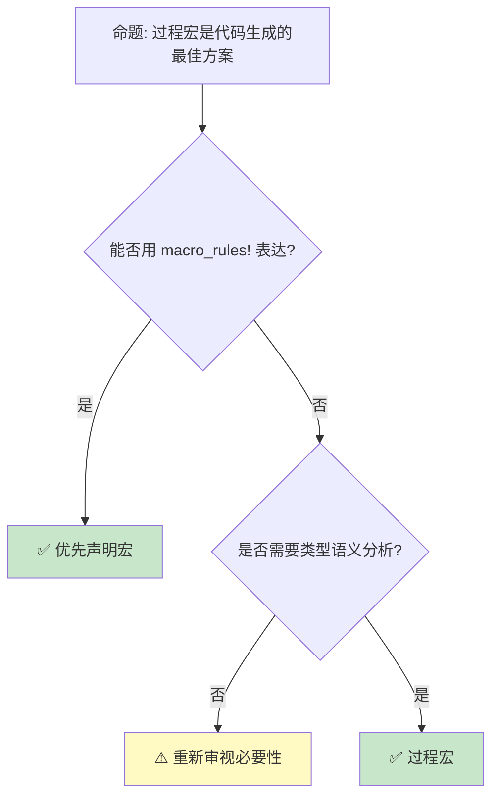
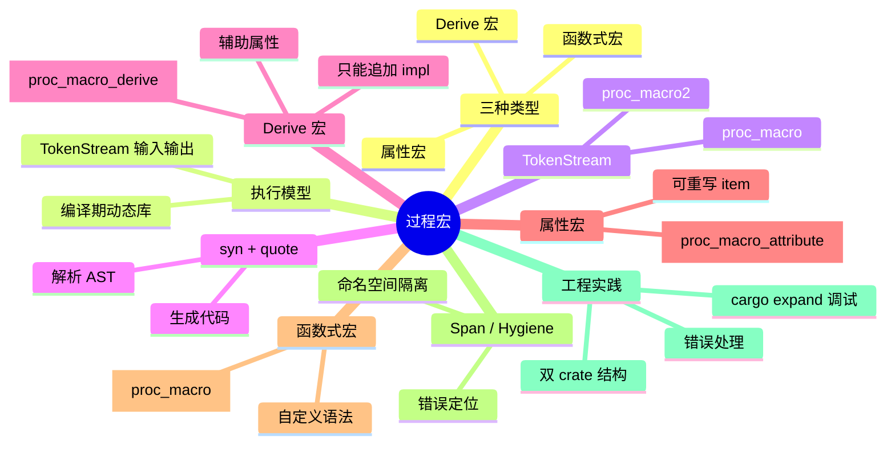

> **内容分级**: [专家级]
> **本节关键术语**: 过程宏 (Procedural Macro) · Derive 宏 · 属性宏 (Attribute Macro) · 函数式宏 (Function-like Macro) · TokenStream · Span · 卫生性 (Hygiene) · syn · quote — [完整对照表](../../00_meta/01_terminology/01_terminology_glossary.md)
>
# 过程宏：derive、attribute、function-like 与 TokenStream 操作
>
> **EN**: Procedural Macros
> **Summary**: Procedural macros in Rust: derive, attribute, and function-like macros, `TokenStream` manipulation, syn/quote workflow, and span hygiene.
> **Rust 版本**: 1.97.0+ (Edition 2024)
>
> **📎 交叉引用（Reference）**
>
> 本主题为 `concept/` 中 Rust **过程宏**的**唯一权威页**。
>
> **受众**: [专家]
> **Bloom 层级**: L3-L4
> **权威来源**: 本文件为 `concept/` 权威页。
> **定位**: 系统讲解过程宏的三种类型、编译期执行模型、`TokenStream` 操作、`syn`/`quote` 工作流，以及 span/hygiene 的工程实践。
> **前置概念**: [Attributes and Macros](../../01_foundation/09_macros_basics/01_attributes_and_macros.md) · [Declarative Macros](04_declarative_macros.md) · [Traits](../00_traits/01_traits.md)
> **后置概念**: [Builder Pattern](../../06_ecosystem/03_design_patterns/01_patterns.md) · [Serde Patterns](../00_traits/03_serde_patterns.md)

---

> **来源**: [Rust Reference — Procedural Macros](https://doc.rust-lang.org/reference/procedural-macros.html) · [TRPL Ch19 — Macros](https://doc.rust-lang.org/book/ch19-06-macros.html) · [proc-macro2 crate](https://docs.rs/proc-macro2/latest/proc_macro2/) · [syn crate](https://docs.rs/syn/latest/syn/) · [quote crate](https://docs.rs/quote/latest/quote/) · [RFC 1566 — Proc Macro](https://github.com/rust-lang/rfcs/pull/1566)

## 📑 目录

- [过程宏：derive、attribute、function-like 与 TokenStream 操作](#过程宏deriveattributefunction-like-与-tokenstream-操作)
  - [📑 目录](#-目录)
  - [一、核心概念](#一核心概念)
    - [1.1 过程宏的本质](#11-过程宏的本质)
    - [1.2 三种过程宏](#12-三种过程宏)
    - [1.3 编译期执行模型](#13-编译期执行模型)
  - [二、技术细节](#二技术细节)
    - [2.1 TokenStream 操作](#21-tokenstream-操作)
    - [2.2 syn + quote 工作流](#22-syn--quote-工作流)
    - [2.3 Derive 宏](#23-derive-宏)
    - [2.4 属性宏](#24-属性宏)
    - [2.5 函数式宏](#25-函数式宏)
    - [2.6 Span 与卫生性](#26-span-与卫生性)
  - [三、使用模式](#三使用模式)
  - [四、反命题与边界分析](#四反命题与边界分析)
    - [4.1 反命题树](#41-反命题树)
    - [4.2 边界极限](#42-边界极限)
  - [五、常见陷阱](#五常见陷阱)
  - [六、来源与延伸阅读](#六来源与延伸阅读)
  - [相关概念](#相关概念)
  - [权威来源索引](#权威来源索引)
  - [十、边界测试：过程宏的编译错误](#十边界测试过程宏的编译错误)
    - [10.1 边界测试：过程宏 crate 导出普通 API（编译错误）](#101-边界测试过程宏-crate-导出普通-api编译错误)
    - [10.2 边界测试：Derive 宏修改被标注项（编译错误）](#102-边界测试derive-宏修改被标注项编译错误)
    - [10.3 边界测试：Span 丢失导致错误定位模糊（调试困难）](#103-边界测试span-丢失导致错误定位模糊调试困难)
    - [10.4 边界测试：属性宏参数解析失败（编译错误）](#104-边界测试属性宏参数解析失败编译错误)
  - [嵌入式测验（Embedded Quiz）](#嵌入式测验embedded-quiz)
    - [测验 1：过程宏的类型（理解层）](#测验-1过程宏的类型理解层)
    - [测验 2：过程宏的执行时机（应用层）](#测验-2过程宏的执行时机应用层)
    - [测验 3：syn + quote 工作流（应用层）](#测验-3syn--quote-工作流应用层)
    - [测验 4：Span 与卫生性（分析层）](#测验-4span-与卫生性分析层)
  - [实践](#实践)
  - [认知路径](#认知路径)
    - [核心推理链](#核心推理链)
  - [国际权威参考 / International Authority References（P1 学术 · P2 生态）](#国际权威参考--international-authority-referencesp1-学术--p2-生态)
  - [📋 关键属性](#-关键属性)
  - [🔗 概念关系](#-概念关系)
  - [🧭 思维导图（Mindmap）](#-思维导图mindmap)
  - [国际化权威来源补充（International Authority Sources）](#国际化权威来源补充international-authority-sources)

---

## 一、核心概念

过程宏是 Rust 在编译期执行的元编程机制，与声明宏的模式匹配不同，它以命令式方式操作 `TokenStream`，因而能够进行更复杂的语法解析和代码生成。理解过程宏的本质、三种形态及其执行模型，是区分 derive、attribute、function-like 宏适用场景的前提，也是后续学习 `syn`/`quote` 工作流的基础。

### 1.1 过程宏的本质

过程宏（Procedural Macro）是「编译期执行的 Rust 函数，输入输出都是 `TokenStream`」。与 `macro_rules!` 的模式匹配不同，过程宏是**命令式**的：可以任意解析、检查、变换 token，配合 `syn` 能操作完整 AST。

```text
本质特征:
├── 在独立 crate 中定义（proc-macro = true）
├── 被 rustc 作为动态库加载执行
├── 输入: TokenStream（调用点源码）
├── 输出: TokenStream（展开后的代码）
├── 可访问类型结构信息（通过 syn 解析）
└── 不可访问运行时值
```

> **核心洞察**: 过程宏扩展了 Rust 的语法边界，代价是独立 crate 的工程复杂度与更长的编译时间。
> [来源: [Rust Reference — Procedural Macros](https://doc.rust-lang.org/reference/procedural-macros.html)]

---

### 1.2 三种过程宏

| 类型 | 属性 | 调用形式 | 典型用途 |
|---|---|---|---|
| Derive 宏 | `#[proc_macro_derive(Name)]` | `#[derive(Name)]` | 为 struct/enum 自动生成 impl |
| 属性宏 | `#[proc_macro_attribute]` | `#[name(args)]` | 修饰并可能重写 item |
| 函数式宏 | `#[proc_macro]` | `name!(...)` | 自定义语法扩展 |

```rust,ignore
// Derive 宏示例: #[derive(Hello)]；需在 proc-macro crate 中编译，此处仅展示形状
#[proc_macro_derive(Hello)]
pub fn hello_derive(input: TokenStream) -> TokenStream {
    let ast = syn::parse(input).unwrap();
    impl_hello(&ast)
}

// 属性宏示例: #[route("GET", "/")]
#[proc_macro_attribute]
pub fn route(args: TokenStream, input: TokenStream) -> TokenStream { todo!() }

// 函数式宏示例: sql!("SELECT ...")
#[proc_macro]
pub fn sql(input: TokenStream) -> TokenStream { todo!() }
```

> **能力对比**: Derive 宏最受限（只能追加 impl），属性宏最灵活（可重写整个 item），函数式宏最接近 `macro_rules!` 的调用形式。
> [来源: [Rust Reference — Procedural Macros](https://doc.rust-lang.org/reference/procedural-macros.html)]

---

### 1.3 编译期执行模型

过程宏在编译期的展开阶段执行：

1. rustc 编译过程宏 crate 为动态库
2. 解析调用点代码时，rustc 加载并调用对应过程宏函数
3. 过程宏返回的 `TokenStream` 被重新解析并融入 AST
4. 过程宏 panic 会转换为编译错误

```text
关键推论:
├── 过程宏不能访问文件系统之外的状态（理想情况下）
├── 过程宏的依赖增加的是编译时编译时间
├── 输出 token 的错误位置依赖 span 保留
└── 宏 crate 只能导出宏，不能导出普通 API
```

> **工程影响**: 过程宏 crate 通常与 API crate 分离（`serde` + `serde_derive`），避免强制所有用户依赖 syn/quote。
> [来源: [RFC 1566 — Proc Macro](https://github.com/rust-lang/rfcs/pull/1566)]

---

## 二、技术细节

过程宏的开发围绕 `TokenStream` 的解析与生成展开。本节从原始 token 操作入手，逐步介绍 `syn`/`quote` 工作流、三种过程宏的具体实现方式，以及 `Span` 与卫生性如何保证错误定位准确和命名空间隔离。掌握这些技术细节，才能把过程宏从「能跑」提升到「可维护、用户友好」。

### 2.1 TokenStream 操作

`TokenStream` 是 token 的序列，可直接遍历或拼接：

```rust
use proc_macro::TokenStream;

#[proc_macro]
pub fn identity(input: TokenStream) -> TokenStream {
    input
}
```

实际开发中通常使用 `proc_macro2::TokenStream`，它可在非宏环境中测试。

```rust
use proc_macro2::TokenStream;
use quote::quote;

let tokens: TokenStream = quote! {
    fn generated() -> i32 { 42 }
};
```

> **最佳实践**: 使用 `proc-macro2` + `quote` 组合，支持单元测试和更稳定的 API。
> [来源: [proc-macro2 crate](https://docs.rs/proc-macro2/latest/proc_macro2/)]

---

### 2.2 syn + quote 工作流

标准工作流：

1. `syn::parse(input)` 将 `TokenStream` 解析为 AST（`DeriveInput`/`ItemFn`/...）
2. 遍历 AST，提取需要的信息
3. 使用 `quote!` 生成新的 `TokenStream`
4. 返回生成的 token

```rust
use proc_macro::TokenStream;
use quote::quote;
use syn::{parse_macro_input, DeriveInput};

#[proc_macro_derive(Hello)]
pub fn hello_derive(input: TokenStream) -> TokenStream {
    let input = parse_macro_input!(input as DeriveInput);
    let name = input.ident;

    let expanded = quote! {
        impl Hello for #name {
            fn hello(&self) {
                println!("Hello from {}", stringify!(#name));
            }
        }
    };

    TokenStream::from(expanded)
}
```

> **工作流洞察**: `syn` 负责「理解 Rust 语法」，`quote` 负责「生成 Rust 代码」——两者配合覆盖了绝大多数过程宏开发场景。
> [来源: [syn crate](https://docs.rs/syn/latest/syn/)] · [quote crate](https://docs.rs/quote/latest/quote/)]

---

### 2.3 Derive 宏

Derive 宏为被标注类型生成附加 impl，**不能修改原类型定义**。

```rust,ignore
// 使用方
#[derive(Hello)]
struct Foo;

// 生成的代码大致为:
impl Hello for Foo {
    fn hello(&self) { ... }
}
```

Derive 辅助属性（helper attributes）：

```rust,ignore
#[derive(Builder)]
#[builder(setter(into))]
struct Config { ... }
```

辅助属性需要在 derive 宏注册时声明：

```rust,ignore
#[proc_macro_derive(Builder, attributes(builder))]
pub fn builder_derive(input: TokenStream) -> TokenStream { ... }
```

> **限制**: Derive 宏只能基于被标注类型的结构生成代码，无法获知其他类型的实现细节。
> [来源: [Rust Reference — Derive Macros](https://doc.rust-lang.org/reference/procedural-macros.html#derive-macros)]

---

### 2.4 属性宏

属性宏接收两个 `TokenStream`：**属性参数**和**被标注项**。它可以完全重写被标注项。

```rust,ignore
// 需在 proc-macro crate 中编译；此处仅展示 syn/quote 的使用形状
use proc_macro::TokenStream;
use quote::quote;
use syn::{parse_macro_input, ItemFn};

#[proc_macro_attribute]
pub fn trace(attr: TokenStream, item: TokenStream) -> TokenStream {
    let func = parse_macro_input!(item as ItemFn);
    let name = &func.sig.ident;
    let body = &func.block;

    quote! {
        #func

        // 或重写函数体:
        fn #name() {
            println!("entering {}", stringify!(#name));
            #body
        }
    }.into()
}
```

> **典型代表**: `tokio::main`、`#[instrument]`、`#[test]` 都是属性宏。
> [来源: [Rust Reference — Attribute Macros](https://doc.rust-lang.org/reference/procedural-macros.html#attribute-macros)]

---

### 2.5 函数式宏

函数式宏看起来像 `macro_rules!` 调用，但由过程宏实现。

```rust,ignore
// 宏定义需在 proc-macro crate，宏使用在普通 crate；此处仅展示形状
#[proc_macro]
pub fn make_answer(input: TokenStream) -> TokenStream {
    if !input.is_empty() {
        return syn::Error::new_spanned(
            input,
            "make_answer! takes no arguments"
        ).to_compile_error().into();
    }

    quote! { 42 }.into()
}

// 使用:
let x = make_answer!();
```

> **适用场景**: 需要 `macro_rules!` 无法处理的复杂语法，或需要基于输入做语义分析。
> [来源: [Rust Reference — Function-like Macros](https://doc.rust-lang.org/reference/procedural-macros.html#function-like-procedural-macros)]

---

### 2.6 Span 与卫生性

`Span` 关联 token 与其在源码中的位置，决定错误信息指向哪里。

```rust
use proc_macro2::Span;
use quote::quote;

let bad = syn::Error::new(Span::call_site(), "message");
```

- `Span::call_site()`: 指向宏调用位置
- `Span::mixed_site()`:  hygiene 与调用点混合
- 保留输入 token 的 span: 使用 `quote_spanned!`

```rust,ignore
use quote::quote_spanned;

// field 来自 syn 解析的输入
quote_spanned! { field.span()=>
    compile_error!("this field is not supported");
}
```

> **卫生性工程**: 过程宏生成的标识符默认具有 call-site hygiene，不会意外捕获调用点变量。需要让调用点变量可见时，应通过参数显式传入。
> [来源: [Rust Reference — Hygiene](https://doc.rust-lang.org/reference/procedural-macros.html#hygiene)]

---

## 三、使用模式

```text
选型决策:

是否需要派生 trait?
├── 是 → Derive 宏
└── 否 → 是否需要重写被标注项？
    ├── 是 → 属性宏
    └── 否 → 函数式宏 / macro_rules!

是否复杂到需要 AST 语义分析？
├── 否 → 优先 macro_rules!
└── 是 → 过程宏 + syn/quote

是否需要跨 crate 稳定使用？
├── 是 → API crate + 独立的 proc-macro crate
└── 否 → 单 crate 过程宏
```

---

## 四、反命题与边界分析

过程宏虽然功能强大，但会引入额外的编译时间、工程复杂度和调试成本。本节通过反命题树明确「何时不该用过程宏」，并总结其能力边界，包括编译时间开销、错误定位难度、无法修改外部 crate 的项，以及对 `syn` 等依赖的稳定性依赖。理解这些边界有助于在声明宏、过程宏与泛型之间做出合理选择。

### 4.1 反命题树



---

### 4.2 边界极限

| 边界 | 说明 | 缓解策略 |
|---|---|---|
| 编译时间 | syn/quote 增加编译时依赖 | 分离 API crate，按需依赖 |
| 错误定位 | 生成代码错误可能指向展开后位置 | 保留输入 span，使用 `quote_spanned!` |
| 调试困难 | 无法单步进入宏 | 使用 `cargo expand` 查看展开结果 |
| 能力限制 | 不能修改其他 crate 的项 | 使用 wrapper 模式或 newtype |
| 稳定性 | 依赖 syn 的 AST 结构 | 锁定 syn 大版本，关注 breaking change |

---

## 五、常见陷阱

```text
陷阱 1: 在 proc-macro crate 中导出普通 API
  ❌ proc-macro crate 只能导出宏

  ✅ 采用双 crate 结构: my_derive + my_derive_impl 或 my_crate + my_crate_macros

陷阱 2: 丢失 span 导致错误信息无用
  ❌ syn::Error::new(Span::call_site(), "bad field")

  ✅ syn::Error::new_spanned(field, "bad field")

陷阱 3: Derive 宏试图修改原类型
  ❌ Derive 宏只能追加 impl，不能改变 struct/enum 定义

  ✅ 需要修改定义时使用属性宏

陷阱 4: 忽略 hygiene 导致意外捕获
  ❌ 生成 let x = ...; 认为调用点可以访问 x

  ✅ 需要调用点访问的标识符通过参数传入，或显式使用 call_site span 并文档说明

陷阱 5: 不处理错误输入
  ❌ unwrap / panic 在过程宏中导致糟糕的错误信息

  ✅ 返回 syn::Error::to_compile_error()
```

---

## 六、来源与延伸阅读

| 来源 | 可信度 | 说明 |
|:---|:---:|:---|
| [Rust Reference — Procedural Macros](https://doc.rust-lang.org/reference/procedural-macros.html) | ✅ P1 | 权威参考 |
| [TRPL Ch19 — Macros](https://doc.rust-lang.org/book/ch19-06-macros.html) | ✅ P1 | 入门 |
| [syn crate](https://docs.rs/syn/latest/syn/) | ✅ P2 | AST 解析 |
| [quote crate](https://docs.rs/quote/latest/quote/) | ✅ P2 | 代码生成 |
| [proc-macro2 crate](https://docs.rs/proc-macro2/latest/proc_macro2/) | ✅ P2 | 可测试的 TokenStream |
| [proc-macro-workshop](https://github.com/dtolnay/proc-macro-workshop) | ✅ P2 | 实践教程 |
| [RFC 1566 — Proc Macro](https://github.com/rust-lang/rfcs/pull/1566) | ✅ P1 | 设计 RFC |

---

## 相关概念

- **前置概念**: [Attributes and Macros](../../01_foundation/09_macros_basics/01_attributes_and_macros.md) · [Declarative Macros](04_declarative_macros.md)
- **应用**: [Serde Patterns](../00_traits/03_serde_patterns.md) · [Builder Pattern](../../06_ecosystem/03_design_patterns/01_patterns.md)
- **对比**: [Declarative Macros](04_declarative_macros.md) · [C Preprocessor vs Rust Macros](07_c_preprocessor_vs_rust_macros.md)

---

## 权威来源索引

> **权威来源**: [Rust Reference — Procedural Macros](https://doc.rust-lang.org/reference/procedural-macros.html), [TRPL Ch19 — Macros](https://doc.rust-lang.org/book/ch19-06-macros.html), [syn crate](https://docs.rs/syn/latest/syn/), [quote crate](https://docs.rs/quote/latest/quote/), [proc-macro2 crate](https://docs.rs/proc-macro2/latest/proc_macro2/), [RFC 1566 — Proc Macro](https://github.com/rust-lang/rfcs/pull/1566)
>
> **权威来源对齐变更日志**: 2026-07-31 从 `03_macro_patterns.md` 拆分独立为过程宏权威页

**文档版本**: 1.0
**最后更新**: 2026-07-31
**状态**: ✅ 概念文件创建完成

---

## 十、边界测试：过程宏的编译错误

过程宏的边界测试聚焦于编译器对 proc-macro crate 的特殊约束，以及展开后行为的常见误区。这些约束包括：proc-macro crate 不能导出普通 API、derive 宏不能修改被标注项、span 丢失会削弱错误定位、属性宏参数必须自行解析。通过观察这些失败场景，可以建立对过程宏能力边界的直观认识。

### 10.1 边界测试：过程宏 crate 导出普通 API（编译错误）

```rust,ignore
// 在 proc-macro = true 的 crate 中:
pub fn helper() {} // ❌ 过程宏 crate 不能导出普通项
```

> **修正**: 过程宏 crate 只能导出过程宏。普通 API 应放在独立的非 proc-macro crate 中。
> [来源: [Rust Reference — Procedural Macros](https://doc.rust-lang.org/reference/procedural-macros.html)]

---

### 10.2 边界测试：Derive 宏修改被标注项（编译错误）

```rust,ignore
#[proc_macro_derive(Modify)]
pub fn modify(input: TokenStream) -> TokenStream {
    // Derive 宏只能返回 impl，不能返回修改后的 struct/enum
    input // ❌ 这样做不会替换原类型定义
}
```

> **修正**: Derive 宏的输出被解析为附加到原类型周围的 item。需要修改被标注项时，应使用属性宏。
> [来源: [Rust Reference — Derive Macros](https://doc.rust-lang.org/reference/procedural-macros.html#derive-macros)]

---

### 10.3 边界测试：Span 丢失导致错误定位模糊（调试困难）

```rust,ignore
#[proc_macro_derive(Bad)]
pub fn bad_derive(input: TokenStream) -> TokenStream {
    let err = syn::Error::new(Span::call_site(), "always fails");
    err.to_compile_error().into()
}
```

> **修正**: 使用 `syn::Error::new_spanned(input, "...")` 或 `quote_spanned!` 将错误指向具体的输入 token，提升诊断精度。
> [来源: [syn crate — Error](https://docs.rs/syn/latest/syn/struct.Error.html)]

---

### 10.4 边界测试：属性宏参数解析失败（编译错误）

```rust,ignore
#[my_attr(foo = )] // ❌ 属性参数不是合法表达式/元属性
struct Item;
```

> **修正**: 属性宏应明确文档化支持的参数格式，并在解析失败时返回 `syn::Error`。常见做法是使用 `syn::AttributeArgs` 或自定义 `Parse` 实现。
> [来源: [Rust Reference — Attribute Macros](https://doc.rust-lang.org/reference/procedural-macros.html#attribute-macros)]

---

## 嵌入式测验（Embedded Quiz）

本节测验覆盖过程宏的四个核心维度：类型区分、执行时机、`syn`/`quote` 工作流，以及 span 与卫生性。作答时应注意过程宏在编译期执行、只能看到 token 不能访问运行时值这一根本限制，并理解为什么保留输入 span 对用户体验至关重要。

### 测验 1：过程宏的类型（理解层）

**题目**: Rust 过程宏分为哪三类？它们分别用于什么场景？

<details>
<summary>✅ 答案与解析</summary>

- Derive 宏：为 struct/enum 派生 trait 实现
- 属性宏：修饰并可能重写 item
- 函数式宏：像 `macro_rules!` 一样调用，可处理复杂语法

</details>

---

### 测验 2：过程宏的执行时机（应用层）

**题目**: 过程宏在编译期的哪个阶段执行？它能访问运行时的值吗？

<details>
<summary>✅ 答案与解析</summary>

过程宏在编译期的宏展开阶段执行，被 rustc 加载为动态库。它只能看到源码 token，不能访问运行时值。
</details>

---

### 测验 3：syn + quote 工作流（应用层）

**题目**: `syn` 和 `quote` 在过程宏开发中分别承担什么职责？

<details>
<summary>✅ 答案与解析</summary>

`syn` 负责将 `TokenStream` 解析为 AST 并遍历；`quote` 负责根据模板生成新的 `TokenStream`。
</details>

---

### 测验 4：Span 与卫生性（分析层）

**题目**: 为什么过程宏中保留输入 token 的 span 很重要？

<details>
<summary>✅ 答案与解析</summary>

保留 span 能让编译错误指向用户源码中的具体位置，而不是宏调用点或生成代码内部，显著提升诊断质量。同时 span 也参与 hygiene，避免生成标识符意外捕获调用点变量。
</details>

---

## 实践

> **相关资源**:
>
> - [crates/c11_macro_system_proc](../../../crates/c11_macro_system_proc) — 过程宏相关可编译示例
> - [proc-macro-workshop](https://github.com/dtolnay/proc-macro-workshop) — 官方实践教程
>
> **建议**: 实现一个 Derive 宏 `#[derive(CountFields)]`，为任意 struct 生成 `fn field_count() -> usize`。

---

## 认知路径

> **认知路径**: 从 L2 的声明宏出发，经由过程宏的三种类型与 TokenStream 操作，通向 L4 的生产级宏开发与调试。

### 核心推理链

| 定理 | 前提 | 结论 | 置信度 |
|:---|:---|:---|:---|
| 理解三种过程宏 ⟹ 正确选型 | 知道 derive/attribute/function-like 的差异 | 能为场景选择合适宏类型 | 高 |
| 掌握 syn/quote ⟹ 实现复杂宏 | 会解析和生成 TokenStream | 能开发自定义 derive/attribute | 高 |
| 重视 span/hygiene ⟹ 高质量宏 | 理解错误定位与命名空间隔离 | 能写出用户友好的宏 | 高 |

> 复杂代码生成 ⟸ 过程宏
> 宏用户体验 ⟸ span 保留 + 清晰错误

---

## 国际权威参考 / International Authority References（P1 学术 · P2 生态）

| 来源 | 类型 | 链接 | 覆盖主题 |
|---|---|---|---|
| Rust Reference — Procedural Macros | P1 | <https://doc.rust-lang.org/reference/procedural-macros.html> | 三种过程宏、执行模型 |
| TRPL Ch19 — Macros | P1 | <https://doc.rust-lang.org/book/ch19-06-macros.html> | 入门与对比 |
| syn crate | P2 | <https://docs.rs/syn/latest/syn/> | AST 解析 |
| quote crate | P2 | <https://docs.rs/quote/latest/quote/> | 代码生成 |
| proc-macro2 crate | P2 | <https://docs.rs/proc-macro2/latest/proc_macro2/> | 可测试 TokenStream |
| proc-macro-workshop | P2 | <https://github.com/dtolnay/proc-macro-workshop> | 实践教程 |
| RFC 1566 — Proc Macro | P1 | <https://github.com/rust-lang/rfcs/pull/1566> | 设计背景 |

---

## 📋 关键属性

| 属性 | 取值 / 判定 | 依据 |
|---|---|---|
| 定义位置 | `proc-macro = true` 的 crate | Cargo 配置 |
| 输入/输出 | `TokenStream` | 过程宏 API |
| 三种类型 | derive / attribute / function-like | 标准库 |
| 解析工具 | syn | 生态事实标准 |
| 生成工具 | quote | 生态事实标准 |
| 错误处理 | `syn::Error::to_compile_error()` | 最佳实践 |
| 卫生性 | span-based hygiene | 编译器实现 |

---

## 🔗 概念关系

- **上位概念**: [Metaprogramming](06_metaprogramming.md) — 元编程的命令式分支。
- **互补**: [Declarative Macros](04_declarative_macros.md) — 声明式宏机制。
- **前置**: [Attributes and Macros](../../01_foundation/09_macros_basics/01_attributes_and_macros.md) — 宏基础。
- **应用**: [Serde Patterns](../00_traits/03_serde_patterns.md) · [Builder Pattern](../../06_ecosystem/03_design_patterns/01_patterns.md) — 过程宏的典型消费者。

---

## 🧭 思维导图（Mindmap）



## 国际化权威来源补充（International Authority Sources）

- <https://dl.acm.org/doi/10.1145/319838.319859>
- <https://doc.rust-lang.org/reference/introduction.html>
