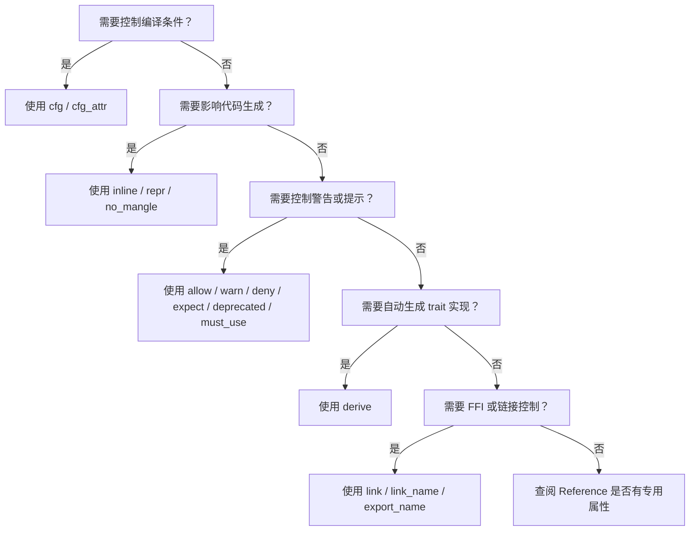

> **内容分级**: [进阶]
> **Rust 版本**: 1.97.0+ (Edition 2024)
> **本节关键术语**: 属性（Attribute） · 内部属性（Inner Attribute） · 外部属性（Outer Attribute） · 过程宏（Procedural Macro） · 条件编译（Conditional Compilation） · 代码生成（Code Generation）

# 属性分类详解（Attributes by Category）
>
> **EN**: Attributes by Category
> **Summary**: Rust attributes are metadata annotations that influence compilation, code generation, diagnostics, linking, and tooling. This page categorizes attributes by purpose and maps them to their authoritative sources in The Rust Reference.
>
> **受众**: [进阶]
> **层级**: L2 进阶概念
> **Bloom 层级**: L2-L3
> **A/S/P 标记**: **S** — Structure
> **双维定位**: C×App
> **前置概念**: [Attributes and Declarative Macros](../../01_foundation/09_macros_basics/01_attributes_and_macros.md) · [Modules and Paths](../../01_foundation/07_modules_and_items/01_modules_and_paths.md)
> **后置概念**: [Procedural Macros](../../03_advanced/03_proc_macros/02_proc_macro.md) · [Conditional Compilation](../../03_advanced/03_proc_macros/11_conditional_compilation.md) · [Inline Assembly](../../03_advanced/05_inline_assembly/01_inline_assembly.md)
>
> **主要来源**: [The Rust Reference — Attributes](https://doc.rust-lang.org/reference/attributes.html) ·
> [The Rust Reference — Attribute Catalog](https://doc.rust-lang.org/reference/attributes.html#built-in-attributes-index) ·
> [The Rust Programming Language — Annotations](https://doc.rust-lang.org/book/appendix-03-derivable-traits.html)
>
> **权威来源**: 本文件为 `concept/` 权威页。

---

> **变更日志**:
>
> - v1.0 (2026-07-04): 初始创建

## 📑 目录

---

- [属性分类详解（Attributes by Category）](#属性分类详解attributes-by-category)
  - [📑 目录](#-目录)
  - [一、权威定义（Definition）](#一权威定义definition)
    - [1.1 形式化定义](#11-形式化定义)
    - [1.2 直觉解释](#12-直觉解释)
  - [二、概念属性矩阵](#二概念属性矩阵)
  - [三、技术细节与示例](#三技术细节与示例)
    - [3.1 代码生成属性](#31-代码生成属性)
    - [3.2 条件编译属性](#32-条件编译属性)
    - [3.3 诊断属性](#33-诊断属性)
    - [3.4 类型系统属性](#34-类型系统属性)
    - [3.5 测试与文档属性](#35-测试与文档属性)
  - [四、示例与反例](#四示例与反例)
    - [4.1 正确示例：组合使用属性](#41-正确示例组合使用属性)
    - [4.2 反例：属性位置错误](#42-反例属性位置错误)
    - [4.3 反例：条件编译条件拼写错误](#43-反例条件编译条件拼写错误)
  - [五、反命题与边界分析](#五反命题与边界分析)
    - [5.1 反命题树](#51-反命题树)
    - [5.2 边界极限](#52-边界极限)
  - [六、边界测试](#六边界测试)
    - [6.1 边界测试：内部属性](#61-边界测试内部属性)
    - [6.2 边界测试：cfg\_attr](#62-边界测试cfg_attr)
  - [七、判断推理与决策树](#七判断推理与决策树)
    - [7.1 选择哪个属性？](#71-选择哪个属性)
    - [7.2 与其他概念的辨析](#72-与其他概念的辨析)
  - [八、逆向推理链（Backward Reasoning）](#八逆向推理链backward-reasoning)
  - [九、来源与延伸阅读](#九来源与延伸阅读)
  - [嵌入式测验（Embedded Quiz）](#嵌入式测验embedded-quiz)
    - [测验 1：属性位置](#测验-1属性位置)
    - [测验 2：条件编译](#测验-2条件编译)
  - [认知路径](#认知路径)
  - [国际权威参考 / International Authority References（P1 学术 · P2 生态）](#国际权威参考--international-authority-referencesp1-学术--p2-生态)

---

## 一、权威定义（Definition）

> **属性（Attribute）** 是 Rust 中附加到项（items）、表达式、语句或其他语言构造上的元数据，以 `#[...]`（外部属性）或 `#![...]`（内部属性）形式出现。属性可以影响编译行为、代码生成、诊断输出、链接、测试、文档生成等。
>
> [来源: [The Rust Reference — Attributes](https://doc.rust-lang.org/reference/attributes.html)]

### 1.1 形式化定义

```text
外部属性: #[attr(args)]   // 作用于紧随其后的项
内部属性: #![attr(args)]  // 作用于包含它的 crate/模块/项
```

- 属性可以是无参的（`#[derive(Debug)]`）或带参数的（`#[cfg(target_os = "linux")]`）。
- 内部属性通常出现在文件顶部或模块（Module）开头，影响整个范围。

### 1.2 直觉解释

属性就像给编译器贴的“便签”：告诉它“对这个函数特殊处理”“在这个平台才编译”“为这个东西自动生成代码”。它们不改变运行时（Runtime）语义（大部分情况下），但深刻影响编译期和工具链行为。

> [💡 原创分析](../../00_meta/00_framework/methodology.md)

---

## 二、概念属性矩阵

| 类别 | 作用 | 典型属性 | 权威来源 |
|:---|:---|:---|:---|
| 代码生成 | 控制编译输出 | `inline`, `cold`, `no_mangle`, `repr` | Reference |
| 条件编译 | 按平台/特性选择编译 | `cfg`, `cfg_attr` | Reference |
| 诊断 | 控制警告/错误/提示 | `allow`, `warn`, `deny`, `expect`, `deprecated` | Reference |
| 类型系统 | 影响类型推导与 trait | `derive`, `non_exhaustive`, `must_use` | Reference |
| 测试与文档 | 标记测试、示例、文档 | `test`, `cfg(test)`, `doc`, `rustfmt::skip` | Reference |
| 链接与 ABI | 控制符号、链接、调用约定 | `link`, `link_name`, `export_name`, `no_link` | Reference |
| 宏与元编程 | 过程宏（Procedural Macro）入口 | `proc_macro`, `proc_macro_derive`, `proc_macro_attribute` | Reference |
| 资源限制 | 栈大小、递归深度 | `recursion_limit`, `type_length_limit` | Reference |

---

## 三、技术细节与示例

本节按功能类别系统梳理 Rust 的内建属性，每类给出作用目标与典型用途：

- **条件编译**：`#[cfg(...)]`/`#[cfg_attr(...)]`——求值早于名称解析，被裁掉的代码不做类型检查；
- **派生**：`#[derive(...)]`——内建 derive 是编译器特判，第三方 derive 走过程宏管线；
- **代码生成与优化**：`#[inline]`/`#[cold]`/`#[no_mangle]`/`#[export_name]`——向编译器/链接器传递提示或契约；
- **诊断控制**：`#[allow/warn/deny/forbid(lint)]`——`forbid` 不可被内层覆盖，是团队 lint 基线的强制手段；
- **测试与文档**：`#[test]`/`#[ignore]`/`#[doc = "..."]`（`///` 的展开形式）。

使用准则：属性是编译器指令而非注释——新增属性前先确认其作用目标合法（项/语句/表达式/crate），`cfg` 类属性还要确认特性名拼写（`unexpected_cfgs` lint 可校验）。

### 3.1 代码生成属性

```rust
#[inline(always)]
fn hot_path(x: i32) -> i32 {
    x * 2
}

#[repr(C)]
struct Point {
    x: f64,
    y: f64,
}

#[unsafe(no_mangle)] // Edition 2024：unsafe 属性需显式标注
pub extern "C" fn c_api() {}

fn main() {
    println!("{}", hot_path(21));
}
```

> **关键洞察**: `#[inline]` 建议内联；`#[repr(C)]` 保证 C 兼容布局；`#[no_mangle]` 保留符号名供 FFI 使用。
> (Source: [The Rust Reference — Code Generation Attributes](https://doc.rust-lang.org/reference/attributes/codegen.html))
> [来源: [The Rust Reference — Code Generation Attributes](https://doc.rust-lang.org/reference/attributes/codegen.html)]

### 3.2 条件编译属性

```rust
#[cfg(target_os = "linux")]
fn linux_only() {
    println!("running on Linux");
}

#[cfg(not(target_os = "linux"))]
fn linux_only() {
    println!("not Linux");
}

#[cfg(feature = "serde")]
impl serde::Serialize for MyStruct {
    // ...
}

struct MyStruct;

fn main() {
    linux_only();
}
```

> **关键洞察**: `cfg` 是 Rust 条件编译的核心机制，支持平台、特性、编译器版本等多种条件。
> (Source: [The Rust Reference — Conditional Compilation](https://doc.rust-lang.org/reference/conditional-compilation.html))
> [来源: [The Rust Reference — Conditional Compilation](https://doc.rust-lang.org/reference/conditional-compilation.html)]

### 3.3 诊断属性

```rust
#[allow(dead_code)]
fn unused() {}

#[deprecated(since = "2.0.0", note = "use new_api instead")]
fn old_api() {}

#[must_use = "this result should not be ignored"]
fn important() -> i32 { 42 }

fn main() {
    old_api();
    important(); // 警告：未使用 must_use 返回值
}
```

> **关键洞察**: `allow`/`warn`/`deny`/`expect` 控制 lint 级别；`deprecated` 标记过时 API；`must_use` 强制调用者处理返回值。
> (Source: [The Rust Reference — Diagnostic Attributes](https://doc.rust-lang.org/reference/attributes/diagnostics.html))
> [来源: [The Rust Reference — Diagnostic Attributes](https://doc.rust-lang.org/reference/attributes/diagnostics.html)]

### 3.4 类型系统属性

```rust
#[derive(Debug, Clone, PartialEq)]
struct User {
    name: String,
    age: u32,
}

#[non_exhaustive]
pub enum Status {
    Ok,
    Err,
}

fn main() {
    let u = User { name: "Alice".into(), age: 30 };
    println!("{:?}", u);
}
```

> **关键洞察**: `derive` 自动生成 trait 实现；`non_exhaustive` 防止外部 crate 穷举枚举（Enum）变体。
> (Source: [The Rust Reference — Type System Attributes](https://doc.rust-lang.org/reference/attributes/type_system.html))
> [来源: [The Rust Reference — Type System Attributes](https://doc.rust-lang.org/reference/attributes/type_system.html)]

### 3.5 测试与文档属性

```rust,ignore
// doctest 语法示意（`my_crate::add` 需实际 crate 上下文）
/// Returns the sum of two integers.
///
/// # Examples
/// ```
/// let result = my_crate::add(2, 3);
/// assert_eq!(result, 5);
/// ```
pub fn add(a: i32, b: i32) -> i32 {
    a + b
}

#[cfg(test)]
mod tests {
    use super::*;

    #[test]
    fn test_add() {
        assert_eq!(add(2, 3), 5);
    }
}
```

> **关键洞察**: `#[test]` 标记测试函数；`#[cfg(test)]` 只在测试编译时包含模块（Module）；文档注释中的代码块会被 `cargo test --doc` 执行。
> (Source: [The Rust Reference — Testing](https://doc.rust-lang.org/reference/attributes/testing.html))
> [来源: [The Rust Reference — Testing](https://doc.rust-lang.org/reference/attributes/testing.html)]

---

## 四、示例与反例

本节用三组对照说明「属性分类详解（Attributes by Category）」：正确示例：组合使用属性、反例：属性位置错误与反例：条件编译条件拼写错误。每组先给正确示例并标注其成立的类型系统依据，再给反例并标注编译器诊断（E0xxx）或运行时后果，最后给出修正方案。判读标准：正确示例应能通过 rustc 1.97 编译且无 clippy 警告，反例的失败点必须可定位到具体规则。

### 4.1 正确示例：组合使用属性

```rust
#[derive(Debug)]
#[repr(C)]
#[non_exhaustive]
pub struct Config {
    pub name: String,
    pub value: i32,
}

impl Config {
    #[must_use]
    pub fn build() -> Self {
        Self { name: "default".into(), value: 0 }
    }
}
```

### 4.2 反例：属性位置错误

```rust,compile_fail
fn main() {
    #[inline]
    let x = 42; // 错误：inline 不能用于 let 语句
    println!("{}", x);
}
```

> **错误诊断**: `error[E0518]: attribute should be applied to function or closure`
> **修正**: `#[inline]` 只能用于函数、方法或闭包（Closures）。
> [来源: [The Rust Reference — Code Generation Attributes](https://doc.rust-lang.org/reference/attributes/codegen.html)]

### 4.3 反例：条件编译条件拼写错误

```rust
#[cfg(target_os = "linuxx")]
fn linux_only() {}

fn main() {}
```

> **错误诊断**: 代码编译通过，但 `linux_only` 永远不会被包含（`target_os = "linuxx"` 不存在）。
> **修正**: 使用 `#[cfg(target_os = "linux")]`。
> [来源: [The Rust Reference — Conditional Compilation](https://doc.rust-lang.org/reference/conditional-compilation.html)]

---

## 五、反命题与边界分析

本节检验属性使用的两条常见误判：

- **反命题 1：「`#[inline(always)]` 总能提升性能」** —— 错误。强制内联增大代码体积、恶化 I-cache 与分支预测，且剥夺编译器的成本模型决策权。判定准则：先用 `#[inline]`（提示）或什么都不标（跨 crate 时泛型自动可内联），只有 profile 证明调用开销是瓶颈且内联后确实更快才用 `always`。
- **反命题 2：「`#[allow(dead_code)]` 无害」** —— 有累积代价：它掩盖「代码已无人使用」的信号，让重构遗留物永久留存。正确做法按场景选：临时开发用 `#[allow]`、公开 API 预留用 `#[doc(hidden)]` 或注释说明、确认无用直接删除（版本控制可找回）。

边界极限小节量化：属性作用域（外层属性 vs 内层 `#![]`）、`cfg_attr` 的条件展开顺序、以及自定义 lint 属性的注册机制（工具属性 `#[my_tool::attr]`）。

### 5.1 反命题树

> **反命题 1**: "属性只影响运行时（Runtime）行为" ⟹ 不成立。属性主要影响编译期、代码生成、诊断和链接。
> **反命题 2": "所有属性都可以用于任何项" ⟹ 不成立。例如 `#[inline]` 只能用于函数，`#[repr]` 只能用于类型定义。
>**反命题 3": "`#[allow]` 会禁用所有警告" ⟹ 不成立。`#[allow]` 只影响指定 lint，且可被 `#[deny]` 覆盖。
> **反命题 4": "`#[derive]` 可以为任何 trait 自动生成实现" ⟹ 不成立。只有部分标准 trait 支持 derive。

### 5.2 边界极限

| 边界 | 现状 | 理论极限 | 工程意义 |
|:---|:---|:---|:---|
| 自定义属性 | 过程宏（Procedural Macro）支持 | 任意元数据 | 扩展编译器行为需谨慎 |
| 条件表达 | `cfg` 表达式 | 任意布尔组合 | 避免过度复杂的 cfg |
| 属性作用域 | 项级/模块级 | crate 级 | 内部属性 `#![...]` 影响整个范围 |
| 文档属性 | `doc` 控制渲染 | 丰富文档结构 | 用于 rustdoc 生成 |

---

## 六、边界测试

本节把「属性分类详解（Attributes by Category）」的规则推到编译器与运行时的边界上逐一实测：边界测试：内部属性 与 边界测试：cfg_attr。每个用例标注预期结果（编译错误 / 运行时 panic / 逻辑错误），并用 rustc 1.97 验证：能复现的给出诊断信息与触发条件，不能复现的说明原因。这些用例共同回答一个问题——规则在极限处是否仍然成立，以及违反时编译器能否兜底。

### 6.1 边界测试：内部属性

```rust
#![allow(unused_variables)]

fn main() {
    let x = 42; // 不会触发 unused_variables 警告
    println!("no warning");
}
```

### 6.2 边界测试：cfg_attr

```rust
#[cfg_attr(feature = "serde", derive(serde::Serialize))]
struct Data {
    value: i32,
}

fn main() {
    let _ = Data { value: 1 };
}
```

> **关键洞察**: `cfg_attr` 在条件满足时应用另一个属性，常用于特性门控 derive。
> (Source: [The Rust Reference — Conditional Compilation](https://doc.rust-lang.org/reference/conditional-compilation.html))
> [来源: [The Rust Reference — cfg_attr](https://doc.rust-lang.org/reference/conditional-compilation.html#the-cfg_attr-attribute)]

---

## 七、判断推理与决策树

「判断推理与决策树」部分包含选择哪个属性？ 与 与其他概念的辨析 两条主线，本节依次说明。

### 7.1 选择哪个属性？



### 7.2 与其他概念的辨析

| 场景 | 推荐选择 | 不推荐 | 理由 |
|:---|:---|:---|:---|
| 只在测试时编译 | `#[cfg(test)]` | 手动条件编译 | 标准机制 |
| 标记废弃 API | `#[deprecated(...)]` | 文档注释 alone | 编译器会产生警告 |
| 强制处理 Result | `#[must_use]` | 无 | 防止忽略重要结果 |
| 跨平台函数 | `#[cfg(target_os = ...)]` | 运行时 if 判断 | 零成本抽象（Zero-Cost Abstraction） |

---

## 八、逆向推理链（Backward Reasoning）

> **从编译错误/运行时症状反推定理链**:
>
> ```text
> error[E0518] 属性应用于错误项 ⟸ 属性位置不当 ⟸ 检查属性适用的项类型
> 代码在特定平台消失/出现 ⟸ cfg 条件不匹配 ⟸ 检查 target_os / feature 名称
> 编译器未按预期优化 ⟸ inline/repr 属性缺失或冲突 ⟸ 确认属性作用于热路径
> trait 未实现 ⟸ derive 条件未满足或拼写错误 ⟸ 检查字段类型是否支持 derive
> ```
>
> **诊断映射**:
>
> - `error[E0518]: attribute should be applied to ...` → 属性用在了不支持的项上。
> - 平台相关代码未编译 → 检查 `cfg` 条件是否与目标平台匹配。
> - `#[must_use]` 警告 → 函数返回值未被使用。

---

## 九、来源与延伸阅读

- [The Rust Reference — Attributes](https://doc.rust-lang.org/reference/attributes.html)
- [The Rust Reference — Built-in Attributes Index](https://doc.rust-lang.org/reference/attributes.html#built-in-attributes-index)
- [The Rust Reference — Conditional Compilation](https://doc.rust-lang.org/reference/conditional-compilation.html)
- [The Rust Reference — Code Generation Attributes](https://doc.rust-lang.org/reference/attributes/codegen.html)
- [The Rust Reference — Diagnostic Attributes](https://doc.rust-lang.org/reference/attributes/diagnostics.html)

---

## 嵌入式测验（Embedded Quiz）

本节测验覆盖属性系统的三个核心判别点：

- **理解层**：`#[cfg]` 与 `if cfg!()` 的区别——前者编译期裁剪（被裁代码不检查），后者运行期分支（两分支都必须类型正确）；
- **应用层**：lint 级别的选择——`allow`/`warn`/`deny`/`forbid` 的覆盖优先级与团队基线配置（crate 根 `#![]` 内层属性语法）；
- **分析层**：`cfg_attr` 的展开逻辑——`#[cfg_attr(feature = "x", derive(Serialize))]` 的双重条件求值与 feature 组合爆炸问题。

作答建议：测验 1 是最常见的生产事故根源（`cfg` 裁掉的代码路径腐烂数月无人发现），作答前先想一个自己项目中的实例。

### 测验 1：属性位置

**题目**: 哪个属性可以用于 `let` 语句？

A. `#[inline]`
B. `#[derive(Debug)]`
C. `#[allow(unused_variables)]`
D. `#[repr(C)]`

<details>
<summary>✅ 答案与解析</summary>

**答案**: C

**解析**: `#[allow(unused_variables)]` 可以应用于语句或代码块。`#[inline]` 用于函数，`#[derive]` 用于类型定义，`#[repr(C)]` 用于类型布局。

</details>

### 测验 2：条件编译

**题目**: 以下哪个 `cfg` 条件用于只在启用 `serde` 特性时编译代码？

A. `#[cfg(target_os = "serde")]`
B. `#[cfg(feature = "serde")]`
C. `#[cfg(serde)]`
D. `#[serde]`

<details>
<summary>✅ 答案与解析</summary>

**答案**: B

**解析**: Cargo 特性通过 `feature = "name"` 形式在 `cfg` 中检查。`target_os` 用于操作系统，`#[serde]` 不是有效属性。

</details>

---

## 认知路径

> **认知路径**: 本节从“给编译器附加元数据”的需求出发，将属性按用途分类，建立代码生成、条件编译、诊断、类型系统、测试文档、链接等维度，最终形成根据场景快速查找和正确使用属性的能力。
>
> 1. **问题识别**: 需要控制编译行为、生成代码、管理警告或标记测试。
> 2. **概念建立**: 属性是编译期元数据，分内部/外部两种形式。
> 3. **机制推理**: 不同类别属性影响编译的不同阶段和方面。
> 4. **边界辨析**: 属性的适用项、作用域、lint 覆盖规则。
> 5. **迁移应用**: 在跨平台、FFI、API 设计、测试组织中使用合适属性。

---

> **权威来源**: [The Rust Reference — Attributes](https://doc.rust-lang.org/reference/attributes.html), [The Rust Reference — Built-in Attributes Index](https://doc.rust-lang.org/reference/attributes.html#built-in-attributes-index), [The Rust Reference — Conditional Compilation](https://doc.rust-lang.org/reference/conditional-compilation.html), [The Rust Programming Language — Derivable Traits](https://doc.rust-lang.org/book/appendix-03-derivable-traits.html)
> **权威来源对齐变更日志**: 2026-07-04 创建 [Rust 1.97.0 Reference 属性章节对齐](https://doc.rust-lang.org/reference/attributes.html)
> **状态**: ✅ 权威来源对齐完成

---

## 国际权威参考 / International Authority References（P1 学术 · P2 生态）

> 依据 `AGENTS.md` §2「对齐网络国际化权威内容」补充：仅追加已验证可达的权威链接，不改动正文事实。

- **P2 生态/社区**: [docs.rs/proc-macro2 — 生态权威 API 文档](https://docs.rs/proc-macro2) · [docs.rs/pin-project — 生态权威 API 文档](https://docs.rs/pin-project)
- **P1 学术/形式化**: [Kohlbecker et al.: Hygienic Macro Expansion (LFP 1986, 卫生宏奠基)](https://dl.acm.org/doi/10.1145/319838.319859)
