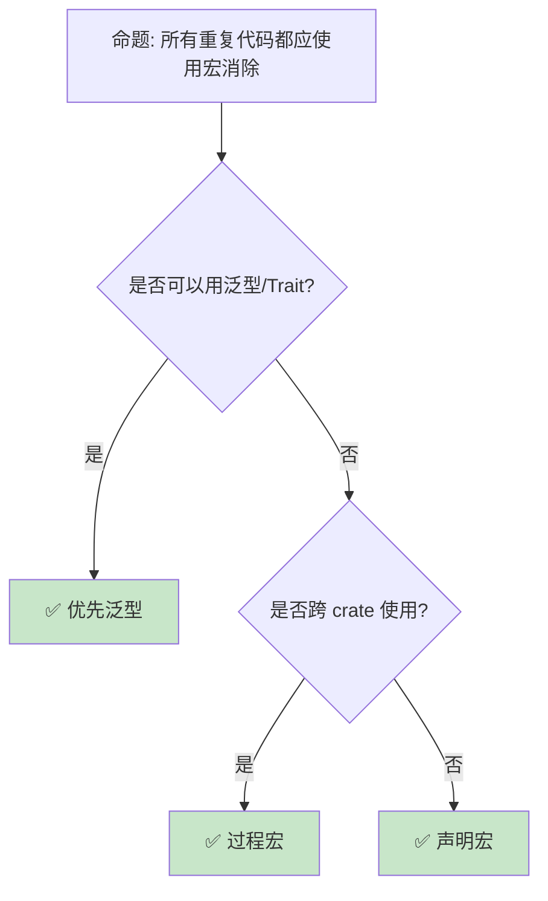

> **内容分级**: [综述级]
> **本节关键术语**: 宏模式 (Macro Pattern) · 声明宏 (Declarative Macro) · macro_rules! · 卫生宏 (Hygienic Macro) · 重复模式 — [完整对照表](../../00_meta/01_terminology/terminology_glossary.md)
>
# 宏模式：编译期代码生成的工程实践
>
> **EN**: Macros
> **Summary**: Macros — Macro engineering patterns: DRY code generation, API design, and compile-time computation without harming readability.
>
> **📎 交叉引用（Reference）**
>
> 本主题在 knowledge 中有系统化的知识索引：宏（Macro）模式
>
> **受众**: [进阶]
> **Bloom 层级**: L3-L4
> **权威来源**: 本文件为 `concept/` 权威页。
> **定位**: 深入分析 Rust **宏（Macro）的工程模式**——从 DRY 代码生成、API 设计到编译期计算，揭示如何在不牺牲可读性的前提下利用宏提升代码复用和类型安全。
> **前置概念**: [Attributes and Macros](../../01_foundation/09_macros_basics/12_attributes_and_macros.md) · [Traits](../00_traits/01_traits.md)
> **后置概念**: [Proc Macros](../../03_advanced/03_proc_macros/07_proc_macro.md) · [DSL](13_dsl_and_embedding.md)

---

> **来源**: [The Little Book of Rust Macros](https://veykril.github.io/tlborm/) · · [Kohlbecker et al. — Hygienic Macro Expansion](https://doi.org/10.1145/41625.41632) · [Flatt — Binding as Sets of Scopes](https://doi.org/10.1145/2814304.2814305) · [Brown University — Concepts in Rust Programming](https://cel.cs.brown.edu/crp/) · [Oxide: The Essence of Rust](https://arxiv.org/abs/1903.00982) · [Unicode UAX #31 — Identifier and Pattern Syntax](https://www.unicode.org/reports/tr31/)
> [Rust Reference — Macros](https://doc.rust-lang.org/reference/macros.html) ·
> [Rust API Guidelines — Macros](https://rust-lang.github.io/api-guidelines//macros.html) ·
> [serde_derive](https://docs.rs/serde_derive/latest/serde_derive/) ·
> [Wikipedia — Code Generation](https://en.wikipedia.org/wiki/Code_generation_(compiler))

## 📑 目录

- [宏模式：编译期代码生成的工程实践](#宏模式编译期代码生成的工程实践)
  - [📑 目录](#-目录)
  - [一、核心概念](#一核心概念)
    - [1.1 宏的工程价值](#11-宏的工程价值)
    - [1.2 声明宏 vs 过程宏](#12-声明宏-vs-过程宏)
    - [1.3 宏的卫生性工程](#13-宏的卫生性工程)
  - [二、技术细节](#二技术细节)
    - [2.1 DRY 代码生成](#21-dry-代码生成)
    - [2.2 条件编译模式](#22-条件编译模式)
    - [2.3 编译期计算](#23-编译期计算)
  - [三、宏模式矩阵](#三宏模式矩阵)
  - [四、反命题与边界分析](#四反命题与边界分析)
    - [4.1 反命题树](#41-反命题树)
    - [4.2 边界极限](#42-边界极限)
  - [五、常见陷阱](#五常见陷阱)
  - [六、来源与延伸阅读](#六来源与延伸阅读)
  - [相关概念](#相关概念)
  - [逆向推理链（Backward Reasoning）](#逆向推理链backward-reasoning)
  - [权威来源索引](#权威来源索引)
  - [十、边界测试：宏模式的编译错误](#十边界测试宏模式的编译错误)
    - [10.1 边界测试：`macro_rules!` 的优先级与贪婪匹配（编译错误）](#101-边界测试macro_rules-的优先级与贪婪匹配编译错误)
    - [10.2 边界测试：宏中的 hygiene 与变量捕获（编译错误）](#102-边界测试宏中的-hygiene-与变量捕获编译错误)
    - [10.3 边界测试：`tt` muncher 的 token 消耗（编译错误）](#103-边界测试tt-muncher-的-token-消耗编译错误)
    - [10.4 边界测试：宏生成的 `unsafe` 块边界（编译错误）](#104-边界测试宏生成的-unsafe-块边界编译错误)
    - [10.2 边界测试：宏递归深度限制（编译错误）](#102-边界测试宏递归深度限制编译错误)
    - [10.4 边界测试：宏中的 `tt` 与 `expr` 的匹配差异（编译错误）](#104-边界测试宏中的-tt-与-expr-的匹配差异编译错误)
  - [嵌入式测验（Embedded Quiz）](#嵌入式测验embedded-quiz)
    - [测验 1：`macro_rules!` 中的 `$x:expr` 与 `$x:tt` 有什么区别？（理解层）](#测验-1macro_rules-中的-xexpr-与-xtt-有什么区别理解层)
    - [测验 2：声明宏的"卫生性"（hygiene）主要解决什么问题？（理解层）](#测验-2声明宏的卫生性hygiene主要解决什么问题理解层)
    - [测验 3：`macro_rules!` 宏可以递归调用自身吗？有什么限制？（理解层）](#测验-3macro_rules-宏可以递归调用自身吗有什么限制理解层)
    - [测验 4：过程宏（proc macro）分为哪三类？它们分别用于什么场景？（理解层）](#测验-4过程宏proc-macro分为哪三类它们分别用于什么场景理解层)
    - [测验 5：`macro_rules!` 与过程宏的主要区别是什么？（理解层）](#测验-5macro_rules-与过程宏的主要区别是什么理解层)
  - [实践](#实践)
  - [认知路径](#认知路径)
    - [核心推理链](#核心推理链)
    - [反命题与边界](#反命题与边界)

---

## 一、核心概念
>
>

### 1.1 宏的工程价值
>

```text
宏解决的核心问题:

  代码重复 (DRY):
  ├── 为多个类型实现相同 Trait
  ├── 重复的模式匹配分支
  ├── 样板代码（getter/setter）
  └── 宏一次性生成，一处修改

  API 人体工学:
  ├── vec![1, 2, 3] 比 Vec::new() + push
  ├── println!("{}", x) 的类型安全格式化
  ├── assert_eq!(a, b) 的失败信息
  └── 编译期验证的 DSL

  零成本抽象:
  ├── 宏在编译期展开
  ├── 无运行时开销
  ├── 比函数调用更灵活（控制流、模式）
  └── 但编译时间可能增加

  与泛型的对比:
  ┌─────────────────┬─────────────────┬─────────────────┐
  │ 场景            │ 泛型            │ 宏              │
  ├─────────────────┼─────────────────┼─────────────────┤
  │ 类型参数化      │ ✅ 完美         │ ❌ 过度        │
  │ 语法扩展        │ ❌ 不可能       │ ✅ 完美        │
  │ 错误信息        │ ✅ 清晰         │ ⚠️ 可能混乱  │
  │ 编译时间        │ ✅ 快           │ ⚠️ 可能慢    │
  │ IDE 支持        │ ✅ 好           │ ⚠️ 有限      │
  │ 跨 crate        │ ✅ 原生支持     │ ⚠️ 需导出    │
  └─────────────────┴─────────────────┴─────────────────┘
```

> **认知功能**: 宏的**核心价值**是"编译期编程"——它扩展了语言的表达能力，同时保持零运行时（Runtime）成本。
> (Source: [Rust Reference — Macros](https://doc.rust-lang.org/reference/macros.html))
> [来源: [Rust API Guidelines — Macros](https://rust-lang.github.io/api-guidelines//macros.html)]

---

### 1.2 声明宏 vs 过程宏
>

```text
宏类型对比:

  macro_rules! (声明宏):
  ├── 基于模式匹配
  ├── 操作 token 树
  ├── 相对简单
  ├── 编译较快
  ├── 使用 #[macro_export]
  └── 例: vec!, println!, assert!

  过程宏 (Proc Macro):
  ├── 自定义 derive: #[derive(MyTrait)]
  ├── 属性宏: #[my_attr]
  ├── 函数式宏: my_macro!(...)
  ├── 操作完整 AST
  ├── 需要独立 crate
  ├── 编译较慢
  └── 例: serde::Serialize, tokio::main

  选择指南:
  ├── 简单代码生成 → macro_rules!
  ├── 复杂 AST 转换 → 过程宏
  ├── 自定义 derive → 过程宏
  ├── 需要分析类型结构 → 过程宏
  └── 快速开发内部工具 → macro_rules!
```

> **宏类型洞察**: **声明宏（Declarative Macro）**适合快速代码生成，**过程宏（Procedural Macro）**适合深度 AST 转换——两者是互补工具。
> [来源: [TRPL — Macros](https://doc.rust-lang.org/book/ch19-06-macros.html)]

---

### 1.3 宏的卫生性工程
>

```text
卫生性（Hygiene）的工程影响:

  优点:
  ├── 宏不会意外捕获外部变量
  ├── 外部变量不会被宏内部覆盖
  ├── 每个宏调用独立的命名空间
  └── 消除一类微妙的 bug

  挑战:
  ├── 宏不能自动访问外部作用域
  ├── 需要显式传递所有需要的标识符
  ├── 某些模式需要额外工作
  └── 理解成本

  应对策略:
  ├── 设计宏接受显式参数
  ├── 使用 $crate 引用当前 crate 的项
  ├── 提供清晰的文档说明
  └── 避免依赖外部变量名的宏

  $crate 示例:
  #[macro_export]
  macro_rules! my_macro {
      () => {
          $crate::internal_function();
      };
  }
  // 即使外部 crate 重定义了 internal_function
  // 宏仍指向正确的符号
```

> **卫生性洞察**: 卫生宏是 Rust **比 C 预处理器安全的关键**——但这也意味着宏设计需要**显式传递依赖**。
> [来源: [The Little Book of Rust Macros — Hygiene](https://veykril.github.io/tlborm/)]

---

## 二、技术细节

### 2.1 DRY 代码生成
>

```rust
// 为多个类型实现相同 Trait

macro_rules! impl_display {
    ($($t:ty),* $(,)?) => {
        $(
            impl std::fmt::Display for $t {
                fn fmt(&self, f: &mut std::fmt::Formatter<'_>) -> std::fmt::Result {
                    write!(f, "{}", self.0)
                }
            }
        )*
    };
}

// 使用:
struct Meters(f64);
struct Seconds(f64);
struct Kilograms(f64);

impl_display!(Meters, Seconds, Kilograms);

// 更复杂的例子: 枚举访问器生成
macro_rules! define_enum_with_display {
    (
        $(#[$meta:meta])*
        $vis:vis enum $name:ident {
            $($variant:ident),* $(,)?
        }
    ) => {
        $(#[$meta])*
        $vis enum $name {
            $($variant),*
        }

        impl std::fmt::Display for $name {
            fn fmt(&self, f: &mut std::fmt::Formatter<'_>) -> std::fmt::Result {
                match self {
                    $(Self::$variant => write!(f, stringify!($variant)),)*
                }
            }
        }
    };
}

define_enum_with_display! {
    #[derive(Debug, Clone)]
    pub enum Status {
        Active,
        Inactive,
        Pending,
    }
}

// Status::Active.to_string() == "Active"
```

> **DRY 洞察**: 宏的**批量 Trait 实现**是大型项目中减少样板代码的标准技术——尤其适用于 Newtype 和枚举（Enum）。
> [来源: [Rust Patterns — Macros](https://rust-unofficial.github.io/patterns/))]

---

### 2.2 条件编译模式
>

```rust
// cfg 与宏结合的条件编译

// 平台特定实现
macro_rules! platform_specific {
    () => {
        #[cfg(target_os = "linux")]
        fn init() { /* Linux 初始化 */ }

        #[cfg(target_os = "windows")]
        fn init() { /* Windows 初始化 */ }

        #[cfg(target_os = "macos")]
        fn init() { /* macOS 初始化 */ }
    };
}

// 特性门控代码
macro_rules! feature_gate {
    ($feature:literal, $code:item) => {
        #[cfg(feature = $feature)]
        $code
    };
}

feature_gate!("async", pub async fn fetch() {});

// 编译期配置检查
macro_rules! compile_assert {
    ($condition:expr, $msg:literal) => {
        const _: () = assert!($condition, $msg);
    };
}

compile_assert!(std::mem::size_of::<usize>() == 8, "需要 64 位平台");

// 编译期日志级别
macro_rules! log {
    (debug, $($arg:tt)*) => {
        #[cfg(debug_assertions)]
        eprintln!("[DEBUG] {}", format!($($arg)*));
    };
    (error, $($arg:tt)*) => {
        eprintln!("[ERROR] {}", format!($($arg)*));
    };
}
```

> **条件编译洞察**: `cfg` + 宏的组合使**平台/特性适配**可以优雅地封装，避免散落的 #[cfg] 污染代码。
> [来源: [Rust Reference — Conditional Compilation](https://doc.rust-lang.org/reference/conditional-compilation.html)]

---

### 2.3 编译期计算
>

```rust
// 编译期计算的宏技巧

// 计算参数个数
macro_rules! count_args {
    () => { 0 };
    ($head:tt $($tail:tt)*) => { 1 + count_args!($($tail)*) };
}

// 编译期字符串拼接
macro_rules! concat_idents {
    ($a:ident, $b:ident) => {
        // 过程宏更适合此场景
        // 声明宏无法真正生成新标识符
    };
}

// 编译期数组初始化
macro_rules! array_init {
    ($len:expr, $value:expr) => {{
        let mut arr = [$value; $len];
        arr
    }};
}

// 类型列表操作（元编程）
macro_rules! type_list {
    // 定义类型列表
    ($($ty:ty),* $(,)?) => { ($($ty),*) };
}

// 编译期断言（const assert）
macro_rules! const_assert {
    ($condition:expr) => {
        const _: [(); 1] = [(); $condition as usize];
        // 如果 condition 为 false，数组大小为 0，但初始化 1 个元素 → 编译错误
    };
}

const_assert!(4 == 4);  // OK
// const_assert!(4 == 5);  // 编译错误！

// const fn 的替代（Rust 1.46+）
const fn const_max(a: usize, b: usize) -> usize {
    if a > b { a } else { b }
}

const SIZE: usize = const_max(10, 20);
```

> **编译期洞察**: Rust 的 **const fn** 和 **const generics** 正在替代许多宏的使用场景——当类型系统（Type System）足够表达时，优先使用类型系统。
> [来源: [Rust Reference — Const Eval](https://doc.rust-lang.org/reference/const_eval.html)]

---

## 三、宏模式矩阵

```text
场景 → 宏类型 → 示例

批量 Trait 实现:
  → macro_rules!
  → impl_display!(Type1, Type2, Type3)

API DSL:
  → macro_rules! 或 proc_macro
  → router! { GET /users => list_users }

条件编译封装:
  → macro_rules! + cfg
  → platform_specific! { ... }

测试辅助:
  → macro_rules!
  → test_case!(input, expected)

序列化派生:
  → proc_macro (derive)
  → #[derive(Serialize, Deserialize)]

Builder 生成:
  → proc_macro (derive)
  → #[derive(Builder)]

编译期验证:
  → const_assert! 或 static_assertions crate
  → const_assert!(SIZE > 0)
```

> **模式矩阵**: 宏的**选择逻辑**是：简单模式匹配（Pattern Matching）用 `macro_rules!`，复杂 AST 操作用 `proc_macro`，能用类型系统（Type System）解决的不用宏。
> (Source: [Rust Reference — Macros](https://doc.rust-lang.org/reference/macros.html))

---

## 四、反命题与边界分析

### 4.1 反命题树
>



> **认知功能**: **泛型（Generics） > 宏（Macro）**——当类型系统（Type System）可以表达时，优先使用泛型（更好的错误信息、IDE 支持、编译速度）。
> (Source: [Rust Reference — Macros](https://doc.rust-lang.org/reference/macros.html))
> [来源: [Rust Style Guide](https://github.com/rust-lang/rust/tree/master/src/doc/style-guide)]

---

### 4.2 边界极限
>

```text
边界 1: 编译时间
├── 复杂宏增加编译时间
├── 递归宏可能触发展开限制
├── 每个宏调用独立展开
└── 缓解: 限制复杂度，使用 const fn 替代

边界 2: 错误信息
├── 宏内部的错误可能难以定位
├── 类型不匹配显示展开后的代码
├── 用户看到的是宏调用而非展开代码
└── 缓解: 使用 compile_error! 提供清晰错误

边界 3: 调试困难
├── 调试器看到的是展开后的代码
├── 宏调用栈信息丢失
├── 无法单步进入宏
└── 缓解: cargo expand 查看展开结果

边界 4: 文档生成
├── rustdoc 对宏的文档支持有限
├── 宏展开的示例难以生成
├── 内部实现细节可能暴露
└── 缓解: 仔细编写文档注释

边界 5: 过程宏的限制
├── 需要独立 crate
├── 编译更慢
├── 错误处理更复杂
└── 但能力更强大
```

> **边界要点**: 宏的边界主要与**编译时间**、**错误信息**、**调试**、**文档**和**复杂度**相关。
> (Source: [The Little Book of Rust Macros](https://veykril.github.io/tlborm/))
> [来源: [Rust Reference — Macros](https://doc.rust-lang.org/reference/macros.html)]

---

## 五、常见陷阱

```text
陷阱 1: 宏参数多次求值
  ❌ macro_rules! bad_double {
       ($x:expr) => { $x + $x }
     }
     // bad_double!(expensive()) 调用两次

  ✅ macro_rules! safe_double {
       ($x:expr) => {{
         let val = $x;
         val + val
       }}
     }

陷阱 2: 宏与优先级问题
  ❌ macro_rules! multiply {
       ($a:expr, $b:expr) => { $a * $b }
     }
     // multiply!(1 + 2, 3) → 1 + 2 * 3 = 7！

  ✅ macro_rules! multiply {
       ($a:expr, $b:expr) => { ($a) * ($b) }
     }

陷阱 3: 尾部逗号处理
  ❌ macro_rules! bad_list {
       ($($x:expr),*) => { vec![$($x),*] }
     }
     // bad_list!(1, 2, 3,) 编译错误

  ✅ macro_rules! good_list {
       ($($x:expr),* $(,)?) => { vec![$($x),*] }
     }

陷阱 4: 标识符拼接限制
  ❌ macro_rules! make_fn {
       ($name:ident) => { fn $name_fn() {} }
     }
     // 声明宏无法拼接标识符

  ✅ 使用过程宏
     // 或使用 paste crate

陷阱 5: 递归无限展开
  ❌ macro_rules! infinite {
       () => { infinite!() }
     }
     // 编译错误：递归限制

  ✅ 确保递归有终止条件
     // 提供基础情况
```

> **陷阱总结**: 宏的陷阱主要与**多次求值**、**优先级**、**逗号处理**、**标识符拼接**和**递归**相关。
> (Source: [The Little Book of Rust Macros](https://veykril.github.io/tlborm/))
> [来源: [The Little Book of Rust Macros — Pitfalls](https://veykril.github.io/tlborm/)]

---

## 六、来源与延伸阅读
>

| 来源 | 可信度 | 说明 |
|:---|:---:|:---|
| [TLBORM](https://veykril.github.io/tlborm/) | ✅ 一级 | 宏权威指南 |
| [Rust Reference — Macros](https://doc.rust-lang.org/reference/macros.html) | ✅ 一级 | 参考 |
| [Rust API Guidelines — Macros](https://rust-lang.github.io/api-guidelines//macros.html) | ✅ 一级 | API 设计 |
| [proc-macro-workshop](https://github.com/dtolnay/proc-macro-workshop) | ✅ 一级 | 学习资源 |
| [paste crate](https://docs.rs/paste/latest/paste/) | ✅ 一级 | 标识符拼接 |

---

## 相关概念
- **上层概念**: [Attributes and Macros](../../01_foundation/09_macros_basics/12_attributes_and_macros.md) · [Traits](../00_traits/01_traits.md)
- **下层概念**: [Proc Macros](../../03_advanced/03_proc_macros/07_proc_macro.md) · [DSL](13_dsl_and_embedding.md)


- [Attributes and Macros](../../01_foundation/09_macros_basics/12_attributes_and_macros.md) — 属性与宏基础
- [Proc Macros](../../03_advanced/03_proc_macros/07_proc_macro.md) — 过程宏（Procedural Macro）
- [DSL](13_dsl_and_embedding.md) — DSL 模式
- [Traits](../00_traits/01_traits.md) — Trait 系统

---

> **权威来源**: [Rust Reference — Macros](https://doc.rust-lang.org/reference/macros.html), [Rust Reference — Macros by Example](https://doc.rust-lang.org/reference/macros-by-example.html), [TRPL — Macros](https://doc.rust-lang.org/book/ch19-06-macros.html), [The Little Book of Rust Macros](https://veykril.github.io/tlborm/), [Rust API Guidelines — Macros](https://rust-lang.github.io/api-guidelines/macros.html)
>
> **权威来源对齐变更日志**: 2026-05-22 创建 [Authority Source Sprint Batch 10](../../00_meta/02_sources/international_authority_index.md)

**文档版本**: 1.0
**Rust 版本**: 1.97.0+ (Edition 2024)
**最后更新**: 2026-05-22
**状态**: ✅ 概念文件创建完成

---

## 逆向推理链（Backward Reasoning）

> **从编译错误反推**：
>
> ```text
> 17 Macro Patterns 正确性 ⟸ 类型系统（Type System）约束满足
> ```
>
## 权威来源索引

>
>
>
>
>
>

---

> **补充来源**

## 十、边界测试：宏模式的编译错误

### 10.1 边界测试：`macro_rules!` 的优先级与贪婪匹配（编译错误）

```rust,ignore
macro_rules! ambiguous {
    ($e:expr) => { println!("expr: {}", $e) };
    ($i:ident) => { println!("ident: {}", $i) };
}

fn main() {
    let x = 5;
    // ❌ 编译错误: macro expansion errors (根据实现可能匹配第一个分支)
    // macro_rules 按顺序匹配，第一个匹配的分支被使用
    // $e:expr 匹配 x，因此永远不会匹配 $i:ident
    ambiguous!(x); // 实际匹配 expr 分支
}

// 正确: 更具体的模式放在前面
macro_rules! ordered {
    ($i:ident) => { println!("ident: {}", $i) };
    ($e:expr) => { println!("expr: {}", $e) };
}
```

> **修正**: `macro_rules!` 采用**顺序贪婪匹配**——从上到下尝试每个分支，第一个成功匹配的分支被展开。更通用的模式（如 `$e:expr`）若排在前面，会阻止后面更具体的模式（如 `$i:ident`）被匹配。这与正则表达式的贪婪匹配类似，但宏的匹配是结构化的（基于 token tree）。设计宏时必须将最具体的模式放在前面，通用模式放在后面。[来源: [Rust Reference](https://doc.rust-lang.org/reference/introduction.html)]

### 10.2 边界测试：宏中的 hygiene 与变量捕获（编译错误）

```rust,compile_fail
macro_rules! declare_x {
    () => {
        let x = 42;
    };
}

fn main() {
    declare_x!();
    // ❌ 编译错误: cannot find value `x` in this scope
    // macro_rules! 默认具有 hygiene，宏内部定义的变量不在外部可见
    println!("{}", x);
}

// 正确: 将值作为表达式返回
macro_rules! get_x {
    () => { 42 };
}

fn fixed() {
    let x = get_x!();
    println!("{}", x); // ✅ x 在宏外部定义
}
```

> **修正**: Rust 的宏系统具有**卫生性**（hygiene）——宏内部定义的标识符不会与外部作用域冲突。`let x = 42;` 在宏内部定义的 `x` 只在宏展开后的代码块内可见，外部无法访问。这与 C 的宏（文本替换，无卫生性）形成鲜明对比。 hygiene 通过给宏生成的标识符附加唯一上下文标记实现，确保宏不会意外污染调用者的命名空间。若需从宏返回值，应使用表达式（`42`）而非绑定语句（`let x = 42`）。[来源: [Rust Reference](https://doc.rust-lang.org/reference/introduction.html)]

### 10.3 边界测试：`tt` muncher 的 token 消耗（编译错误）

```rust,ignore
macro_rules! count_tts {
    () => { 0 };
    ($odd:tt $($a:tt $b:tt)*) => { 1 + count_tts!($($a)*) };
}

fn main() {
    // ❌ 编译错误: token 模式不匹配导致递归异常
    // count_tts!(1 2 3) — 3 个 token，但模式假设成对
    let n = count_tts!(1 2);
    println!("{}", n);
}
```

> **修正**: `tt` muncher 是 Rust 声明宏（Declarative Macro）的高级技巧：递归地消耗 token tree（`tt`），每次处理一个或一对 token。模式的精确性至关重要：`($odd:tt $($a:tt $b:tt)*)` 要求奇数个 token（1 + 2*n），偶数个 token 时无匹配 arm。`tt` muncher 的复杂性：1) token 边界（`1 + 2` 是 3 个 tt 还是 5 个？）；2) 递归深度限制；3) 模式优先级（第一个匹配的 arm 被使用）。这是 Rust 宏系统的"暗艺术"——强大但难以调试。现代替代：过程宏（Procedural Macro）（`proc_macro`）提供完整的 token 解析能力，更易维护。这与 Lisp 的宏（同样基于 S-expression 的递归处理）或 C 的预处理器（无递归，纯文本替换）不同——Rust 的 `tt` muncher 在声明宏的有限表达能力中实现了过程宏的部分功能。[来源: [The Little Book of Rust Macros](https://danielkeep.github.io/tlborm/book/)] · [来源: [Rust Reference — Macros](https://doc.rust-lang.org/reference/macros.html)]

### 10.4 边界测试：宏生成的 `unsafe` 块边界（编译错误）

```rust,ignore
macro_rules! unsafe_op {
    ($op:expr) => {
        unsafe { $op }
    };
}

fn main() {
    let ptr = &mut 5 as *mut i32;
    // ❌ 编译错误: unsafe_op! 生成的 unsafe 块封装了 $op，
    // 但调用者仍需 unsafe 块调用宏？
    // unsafe_op!(*ptr = 10); // 若宏展开为 unsafe { *ptr = 10 }，
    // 调用在 safe 代码中，但 unsafe 块在宏内部
    // 实际上: 宏生成的 unsafe 块在调用处，因此不需要外部 unsafe
    // 但以下错误:
    let x = unsafe_op!(*ptr);
    println!("{}", x);
}
```

> **修正**: 宏生成的 `unsafe` 块的可见性取决于宏设计。`unsafe_op!` 在展开代码中创建 `unsafe` 块，因此调用者不需要额外的 `unsafe`——这**隐藏了 unsafe 边界**，是危险的做法。Rust 社区的最佳实践：unsafe 操作应在调用点可见，即 `unsafe { unsafe_op!(...) }`，让代码审查者一眼看到 unsafe。`std` 中的某些宏（如 `vec!`）内部使用 unsafe，但经过了严格审计。自定义宏应避免隐藏 unsafe，或使用 `unsafe` 关键字要求调用者显式标记。这与 C 的宏（常隐藏 `*` 解引用（Reference）、指针运算等 unsafe 操作）或 C++ 的模板（unsafe 在模板内部，调用点不可见）不同——Rust 的 unsafe 块是语法层面的，宏展开后仍保留，可通过源码映射追踪。来源: [The Rust Programming Language](https://doc.rust-lang.org/book/title-page.html) · 来源: [Rustonomicon](https://doc.rust-lang.org/nomicon/index.html)

### 10.2 边界测试：宏递归深度限制（编译错误）

```rust,compile_fail
macro_rules! deep {
    () => { deep!() };
}

fn main() {
    // ❌ 编译错误: recursion limit reached while expanding `deep!`
    deep!();
}
```

> **修正**: Rust 宏的**递归展开**有默认限制（128 层），防止无限递归导致编译器栈溢出。`deep!() => deep!()` 是直接递归，立即触发限制。合法递归需有**终止条件**：`deep!(0) => {}`，`deep!($n:expr) => { deep!($n - 1) }`。宏递归用于：1) 重复模式生成（`vec![1, 2, 3]`）；2) 编译期元编程（计数、类型列表遍历）；3) 代码生成（结构体（Struct）字段访问器）。`#![recursion_limit = "256"]` 可提高限制，但过度递归增加编译时间。这与 C 的宏（无递归限制，可能无限展开）或 Scheme 的 hygienic macro（尾递归优化，理论上无限）不同——Rust 的宏递归限制是编译期的安全阀。[来源: [Rust Reference — Macros](https://doc.rust-lang.org/reference/macros-by-example.html)] · [来源: [The Little Book of Rust Macros](https://danielkeep.github.io/tlborm/book/)]

### 10.4 边界测试：宏中的 `tt` 与 `expr` 的匹配差异（编译错误）

```rust,ignore
macro_rules! bad_match {
    ($e:expr) => { $e + 1 };
}

fn main() {
    // ❌ 编译错误: expr 不能匹配包含逗号的表达式（如函数调用参数）
    // bad_match!(foo(1, 2)); // 宏解析器将逗号视为分隔符

    // tt（token tree）可以匹配任何括号对:
    // macro_rules! good_match { ($e:tt) => { $e }; }
    // good_match!(foo(1, 2)); // ✅

    let x = bad_match!(5);
    println!("{}", x);
}
```

> **修正**: `macro_rules!` 的**片段分类器**（fragment specifiers）：1) `expr` — 匹配完整表达式（不含顶层逗号）；2) `tt` — 匹配 token tree（任何括号对的内容，最灵活）；3) `stmt` — 匹配语句；4) `pat` — 匹配模式；5) `ty` — 匹配类型。`expr` 的限制：不能匹配 `foo(1, 2)`（逗号被视为宏参数分隔符），需用 `tt` 或嵌套宏。复杂宏设计：1) 内部宏（`macro_rules! internal { ... }`）处理递归；2) `tt` 作为通用匹配器，再进一步解析；3) 过程宏（Procedural Macro）（`proc_macro`）替代 `macro_rules!` 处理复杂语法。这与 C 的宏（无分类器，纯文本替换，逗号无特殊含义）或 Scheme 的宏（语法对象，结构化匹配）不同——Rust 的 `macro_rules!` 在灵活性和类型安全之间取得平衡。[来源: [The Little Book of Rust Macros](https://danielkeep.github.io/tlborm/book/)] · [来源: [Rust Reference — Macros](https://doc.rust-lang.org/reference/macros-by-example.html)]

## 嵌入式测验（Embedded Quiz）

### 测验 1：`macro_rules!` 中的 `$x:expr` 与 `$x:tt` 有什么区别？（理解层）

**题目**: `macro_rules!` 中的 `$x:expr` 与 `$x:tt` 有什么区别？

<details>
<summary>✅ 答案与解析</summary>

`:expr` 匹配完整表达式，但不能匹配含顶层逗号的参数列表；`:tt` 匹配任意 token tree，最灵活但不做语法检查。
</details>

---

### 测验 2：声明宏的"卫生性"（hygiene）主要解决什么问题？（理解层）

**题目**: 声明宏（Declarative Macro）的"卫生性"（hygiene）主要解决什么问题？

<details>
<summary>✅ 答案与解析</summary>

防止宏内部引入的标识符与调用方作用域中的标识符意外冲突，宏内的局部变量不会污染外部。
</details>

---

### 测验 3：`macro_rules!` 宏可以递归调用自身吗？有什么限制？（理解层）

**题目**: `macro_rules!` 宏可以递归调用自身吗？有什么限制？

<details>
<summary>✅ 答案与解析</summary>

可以递归，但 Rust 对宏展开深度有递归限制（默认约 128），可用 `#![recursion_limit = "..."]` 调整。
</details>

---

### 测验 4：过程宏（proc macro）分为哪三类？它们分别用于什么场景？（理解层）

**题目**: 过程宏（proc macro）分为哪三类？它们分别用于什么场景？

<details>
<summary>✅ 答案与解析</summary>

derive 宏（Macro）（为 struct/enum 派生 trait）、属性宏（修饰 item，可改变其内容）、函数式宏（像 `macro_rules!` 一样调用，但更强大）。
</details>

---

### 测验 5：`macro_rules!` 与过程宏的主要区别是什么？（理解层）

**题目**: `macro_rules!` 与过程宏（Procedural Macro）的主要区别是什么？

<details>
<summary>✅ 答案与解析</summary>

`macro_rules!` 基于模式匹配（Pattern Matching）和代码模板，在编译早期展开；过程宏是外部 crate 中运行的 Rust 函数，可操作 TokenStream，功能更强大但更复杂。
</details>

## 实践

> **相关资源**:
>
> - [crates/ 示例代码](../crates) — 与本文概念对应的可编译示例
> - [exercises/ 练习](../exercises) — 动手编程挑战
> - [MVP 学习路径](../../00_meta/04_navigation/learning_mvp_path.md) — 从零到多线程 CLI 的 40 小时路径
>
> **建议**: 阅读完本概念文件后，打开对应 crate 的示例代码，尝试修改并运行。完成至少 1 道相关练习以巩固理解。

## 认知路径

> **认知路径**: 从 L0 基础概念出发，经由本节的 **宏模式：编译期代码生成的工程实践** 核心原理，通向 L2 进阶模式与 L3 工程实践。

### 核心推理链

| 定理 | 前提 | 结论 | 置信度 |
|:---|:---|:---|:---|
| 宏模式：编译期代码生成的工程实践 基础定义 ⟹ 正确用法 | 理解语法与语义 | 能写出符合惯用法的代码 | 高 |
| 宏模式：编译期代码生成的工程实践 正确用法 ⟹ 常见陷阱 | 忽略边界条件 | 编译错误或运行时（Runtime） bug | 高 |
| 宏模式：编译期代码生成的工程实践 常见陷阱 ⟹ 深度掌握 | 系统学习反模式 | 能进行代码审查与优化 | 高 |

> 元编程安全 ⟸ 编译期代码生成 ⟸ 宏卫生性
> 条件编译正确 ⟸ cfg 属性求值 ⟸ 平台抽象
> **过渡**: 掌握 宏模式：编译期代码生成的工程实践 的基础语法后，下一步需要理解其在类型系统（Type System）中的位置与与其他概念的交互关系。
> **过渡**: 在实践中应用 宏模式：编译期代码生成的工程实践 时，务必关注边界条件与异常处理，这是从"能编译"到"能生产"的关键跃迁。
> **过渡**: 宏模式：编译期代码生成的工程实践 的设计理念体现了 Rust 零成本抽象（Zero-Cost Abstraction）与安全保证的核心权衡，理解这一权衡有助于迁移到更高级的并发与形式化验证领域。

### 反命题与边界

> **反命题**: "宏模式：编译期代码生成的工程实践 在所有场景下都是最佳选择" —— 错误。需要根据具体上下文权衡性能、可读性与安全性，某些场景下显式替代方案可能更优。
