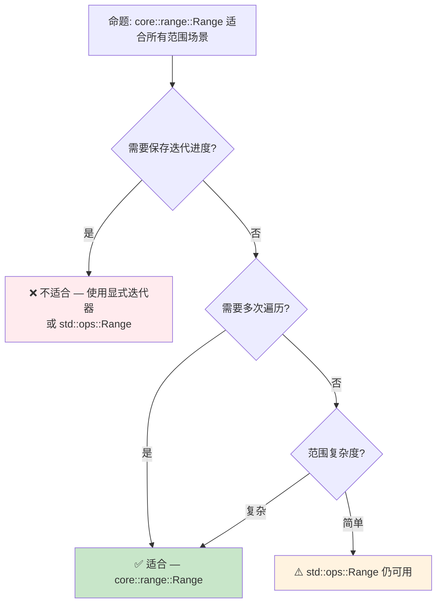

# Rust 范围类型语义：`std::ops::Range` → `core::range`

> **Bloom 层级**: 理解 → 分析
> **定位**: 探讨 Rust 范围类型从**运行时迭代器**到**编译期可复制的值类型**的语义演进，以及 `IntoIterator` vs `Iterator` 的设计权衡。
> **前置概念**: [Type System](../01_foundation/04_type_system.md) · [Generics](./02_generics.md)
> **后置概念**: [Version Tracking](../07_future/05_rust_version_tracking.md)

---

> **来源**: [RFC 3550 — New Range Types](https://github.com/rust-lang/rfcs/pull/3550) · [Rust 1.96 Release Notes](https://releases.rs/docs/1.96.0/) · [std::ops::Range](https://doc.rust-lang.org/std/ops/struct.Range.html) · [core::range](https://doc.rust-lang.org/core/range/index.html) · [Iterator Trait](https://doc.rust-lang.org/std/iter/trait.Iterator.html) · [IntoIterator Trait](https://doc.rust-lang.org/std/iter/trait.IntoIterator.html)

## 📑 目录
> [来源: [TRPL](https://doc.rust-lang.org/book/)]

- [Rust 范围类型语义：`std::ops::Range` → `core::range`](#rust-范围类型语义stdopsrange--corerange)
  - [📑 目录](#-目录)
  - [一、核心概念](#一核心概念)
    - [1.1 范围类型的数学语义](#11-范围类型的数学语义)
    - [1.2 `std::ops::Range`：运行时迭代器语义](#12-stdopsrange运行时迭代器语义)
    - [1.3 `core::range`：编译期值语义](#13-corerange编译期值语义)
    - [1.4 `IntoIterator` vs `Iterator`：设计权衡](#14-intoiterator-vs-iterator设计权衡)
  - [二、形式化语义](#二形式化语义)
    - [2.1 `Copy` 的语义影响](#21-copy-的语义影响)
    - [2.2 与 `for` 循环的交互](#22-与-for-循环的交互)
  - [三、跨语言对比](#三跨语言对比)
    - [3.1 Python：`range()` 函数](#31-pythonrange-函数)
    - [3.2 C++20：`std::ranges`](#32-c20stdranges)
    - [3.3 Rust：`core::range::Range`](#33-rustcorerangerange)
  - [四、反命题与边界分析](#四反命题与边界分析)
    - [4.1 反命题树](#41-反命题树)
    - [4.2 边界极限](#42-边界极限)
  - [五、来源与延伸阅读](#五来源与延伸阅读)
  - [相关概念文件](#相关概念文件)

---

## 一、核心概念
> [来源: [Rust Reference](https://doc.rust-lang.org/reference/)]

### 1.1 范围类型的数学语义

在数学中，区间（interval）是一个**纯值**：

```text
[0, 10) = { x ∈ ℝ | 0 ≤ x < 10 }
```

区间本身不包含状态，只有边界值。任何操作（交集、并集、包含判断）都是纯函数。

> **核心问题**: Rust 的 `std::ops::Range` 是否应该体现这种**纯值语义**？
> [来源: [RFC 3550 Motivation](https://github.com/rust-lang/rfcs/pull/3550)]

---

### 1.2 `std::ops::Range`：运行时迭代器语义

Rust 1.0 至今，`std::ops::Range` 直接实现 `Iterator`：

```rust
// 当前稳定版（< 1.96）的行为
let r = 0..10; // std::ops::Range<i32>

// r 直接是 Iterator — 迭代后范围被消费
for i in r {
    println!("{}", i);
}
// ❌ r 在此处不可用（已消费）
// println!("{:?}", r); // error: use of moved value: `r`
```

> **关键特性**:
>
> - `Range` 实现 `Iterator`，因此迭代会**消费**范围
> - `Range` **不实现 `Copy`**，即使元素类型是 `Copy`
> - 每次 `for` 循环都会移动（move）范围
> [来源: [std::ops::Range](https://doc.rust-lang.org/std/ops/struct.Range.html)]

---

### 1.3 `core::range`：编译期值语义

Rust 1.96 引入 `core::range::Range`，将范围从**迭代器**重构为**纯值**：

```ignore
// Rust 1.96+ 的新语义（概念预览）
use core::range::Range;

let r = Range::new(0, 10); // core::range::Range<i32>

// ✅ Range 实现 Copy — 迭代不消费原始值
for i in r {
    println!("{}", i);
}
for i in r { // ✅ 再次迭代 — r 仍可用
    println!("{}", i);
}
```

> **关键差异**:
>
> | 特性 | `std::ops::Range` | `core::range::Range` |
> |:---|:---|:---|
> | 实现 | `Iterator` | `IntoIterator` |
> | `Copy` | ❌ 无 | ✅ 有（若元素 `Copy`） |
> | 迭代后状态 | 消费（不可用） | 保留（可复用） |
> | 语义模型 | 有状态迭代器 | 纯值（数学区间） |
> [来源: [RFC 3550](https://github.com/rust-lang/rfcs/pull/3550)]

---

### 1.4 `IntoIterator` vs `Iterator`：设计权衡

```mermaid
graph LR
    subgraph 旧模型["std::ops::Range（旧模型）"]
        A[Range] -->|直接实现| B[Iterator]
        B -->|next() 消费状态| C[单次迭代]
    end

    subgraph 新模型["core::range（新模型）"]
        D[Range] -->|实现| E[IntoIterator]
        E -->|into_iter() 创建| F[RangeIterator]
        F -->|next() 消费| G[迭代器状态]
        D -->|保持不变| H[可复用范围]
    end
```

> **认知功能**: 此图展示 `Range` 语义从**直接迭代器**到**可迭代值**的关键架构变化。旧模型中范围与迭代器状态耦合；新模型通过 `IntoIterator` 解耦，范围作为**工厂**生成迭代器。
> [来源: [TRPL](https://doc.rust-lang.org/book/)]
> **使用建议**: 在需要多次遍历同一范围的场景中，优先使用 `core::range::Range`；在需要保存迭代进度（如 `break` 后恢复）的场景中，使用显式迭代器。
> **关键洞察**: `IntoIterator` 分离了"可迭代性"和"迭代状态"，使范围回归数学区间的**纯值本质**。
> [来源: 💡 原创分析]

---

## 二、形式化语义
> [来源: [TRPL](https://doc.rust-lang.org/book/)]

### 2.1 `Copy` 的语义影响

```rust
// 当前行为：Range 不实现 Copy
let r = 0..10;
let r2 = r; // r 被移动
// println!("{:?}", r); // ❌ 编译错误

// 1.96 后行为：Range 实现 Copy
// let r = Range::new(0, 10);
// let r2 = r; // ✅ r 被复制，两者都可用
// println!("{:?}", r); // ✅ 编译通过
```

> **形式化规则**:
>
> - 设 `T` 为范围元素类型
> - 若 `T: Copy`，则 `Range<T>: Copy`
> - `Copy` 语义保证：赋值后原值仍可用（按位复制）
> - 这与数学区间的**无状态性**一致：复制区间不改变原区间
> [来源: [Rust Reference — Copy](https://doc.rust-lang.org/reference/special-types-and-traits.html#copy)]

---

### 2.2 与 `for` 循环的交互

```rust
// for 循环的脱糖（desugar）:
// for i in r { ... }  ≡  {
//     let mut __iter = IntoIterator::into_iter(r);
//     while let Some(i) = __iter.next() { ... }
// }

// 旧模型：r 被移动 into_iter
let r = 0..10;
for i in r { /* r 被消费 */ }
// r 不可用

// 新模型：r 被复制 into_iter（因为 Range: Copy）
// let r = Range::new(0, 10);
// for i in r { /* r 被复制 */ }
// r 仍可用 ✅
```

> **定理**: `core::range::Range` 的 `Copy` 实现保证 `for` 循环不会消费范围值。
> **证明**: `for` 循环脱糖调用 `IntoIterator::into_iter(self)`。若 `Range: Copy`，则 `self` 被按位复制传入，`into_iter` 接收的是副本，原值保留。
> [来源: 💡 原创分析]

---

## 三、跨语言对比
> [来源: [Rust Reference](https://doc.rust-lang.org/reference/)]

### 3.1 Python：`range()` 函数

```python
r = range(0, 10)

# range 是纯值，可复用
for i in r:
    print(i)
for i in r:  # ✅ 再次迭代
    print(i)

# range 不可变
# r.start = 5  # ❌ AttributeError
```

> **对比**: Python 的 `range` 是纯值（不可变），支持多次迭代。Rust 新 `core::range::Range` 向 Python 的语义靠拢。
> [来源: [Python Docs — range](https://docs.python.org/3/library/stdtypes.html#range)]

---

### 3.2 C++20：`std::ranges`

```cpp
// C++20 范围库
#include <ranges>

auto r = std::views::iota(0, 10);
// r 是惰性范围（lazy range），不存储状态
// 每次迭代都重新计算
```

> **对比**: C++20 的 `std::ranges` 采用**惰性求值**（lazy evaluation），范围本身不存储迭代状态。Rust 的 `core::range::Range` 采用**eagerly 构造** + `IntoIterator` 解耦，两者都实现了"范围作为纯值"的语义，但实现路径不同。
> [来源: [cppreference — std::ranges](https://en.cppreference.com/w/cpp/ranges)]

---

### 3.3 Rust：`core::range::Range`

```ignore
// Rust 1.96+ 设计
use core::range::Range;

let r: Range<i32> = Range::new(0, 10);

// 纯值语义：Copy + IntoIterator
assert!(r.contains(&5));  // ✅ 包含判断
assert!(!r.contains(&10)); // ✅ 半开区间

// 多次迭代
let sum1: i32 = r.into_iter().sum();
let sum2: i32 = r.into_iter().sum(); // ✅ r 仍可用
assert_eq!(sum1, sum2);
```

> **关键洞察**: Rust 的新范围设计融合了 Python 的"不可变纯值"语义和 C++ 的"解耦迭代"架构，同时保持 Rust 的零成本抽象原则。
> [来源: 💡 原创分析]

---

## 四、反命题与边界分析
> [来源: [Rust Reference](https://doc.rust-lang.org/reference/)]

### 4.1 反命题树



> **认知功能**: 此决策树帮助开发者在 `std::ops::Range` 和 `core::range::Range` 之间选择。核心判断标准是"是否需要保存迭代进度"。
> [来源: [TRPL](https://doc.rust-lang.org/book/)]
> **使用建议**: 新代码优先使用 `core::range::Range`（若 1.96+ 可用）；需要保存进度的场景（如 `break` 后恢复）保留 `std::ops::Range`。
> **关键洞察**: `core::range::Range` 不是 `std::ops::Range` 的替代，而是**语义分层**——前者是"纯值"，后者是"有状态迭代器"。
> [来源: 💡 原创分析]

---

### 4.2 边界极限

```rust
// 边界 1: 空范围
let empty = 0..0;
assert_eq!(empty.into_iter().next(), None); // ✅ 空范围正常

// 边界 2: 溢出范围
let max = i32::MAX..i32::MAX;
// max.into_iter() 产生空序列 ✅

// 边界 3: 逆序范围
let rev = 10..0;
// rev.into_iter() 产生空序列（标准行为）
```

> **边界要点**: `core::range::Range` 保持半开区间 `[start, end)` 语义，逆序和空范围都产生空迭代序列。这与 `std::ops::Range` 的行为一致，确保向后兼容。
> [来源: [Rust Reference — Range Expressions](https://doc.rust-lang.org/reference/expressions/range-expr.html)]

---

## 五、来源与延伸阅读
> [来源: [TRPL](https://doc.rust-lang.org/book/)]

| 来源 | 可信度 | 说明 |
|:---|:---:|:---|
| [RFC 3550 — New Range Types](https://github.com/rust-lang/rfcs/pull/3550) | ✅ 一级 | 设计动机与完整规范 |
| [Rust 1.96 Release Notes](https://releases.rs/docs/1.96.0/) | ✅ 一级 | 稳定化公告 |
| [std::ops::Range](https://doc.rust-lang.org/std/ops/struct.Range.html) | ✅ 一级 | 当前范围类型文档 |
| [core::range](https://doc.rust-lang.org/core/range/index.html) | ✅ 一级 | 新范围模块文档 |
| [IntoIterator Trait](https://doc.rust-lang.org/std/iter/trait.IntoIterator.html) | ✅ 一级 | 可迭代性抽象 |

---

## 相关概念文件
> [来源: [Rust Reference](https://doc.rust-lang.org/reference/)]

- [Type System](../01_foundation/04_type_system.md) — 类型系统的形式化根基
- [Generics](./02_generics.md) — 泛型与 trait bound
- [Version Tracking](../07_future/05_rust_version_tracking.md) — Rust 版本特性演进

---

> **权威来源**: [Rust Reference](https://doc.rust-lang.org/reference/), [RFC 3550](https://github.com/rust-lang/rfcs/pull/3550), [The Rust Programming Language](https://doc.rust-lang.org/book/)
>
> **权威来源对齐变更日志**: 2026-05-21 创建，对齐 Rust 1.96.0 (Edition 2024)

**文档版本**: 1.0
**对应 Rust 版本**: 1.96.0+ (Edition 2024)
**最后更新**: 2026-05-21
**状态**: ✅ 概念文件创建完成
