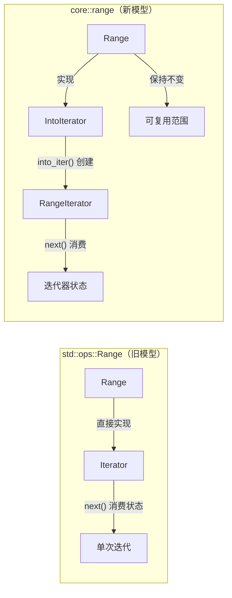
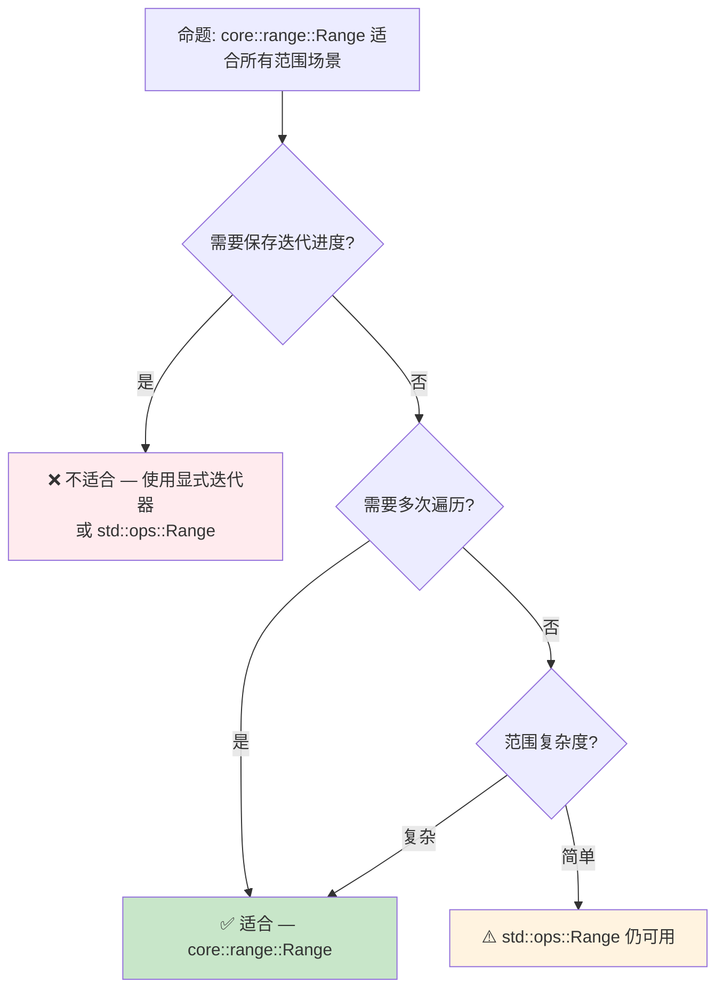

> **内容分级**: [综述级]

> **本节关键术语**: 范围类型 (Range Type) · core::range · std::ops::Range · 区间运算 · 迭代器范围 (Range Iterator) — [完整对照表](../00_meta/terminology_glossary.md)
>
# Rust 范围类型语义：`std::ops::Range` → `core::range`
> **EN**: Rust 范围类型语义：`std::ops::Range` → `core::range` (Chinese)
> **Summary**: - [Rust 范围types语义：`std::ops::Range` → `core::range`](#rust-范围types语义stdopsrange--corerange) - [📑 目录](#-目录) - [一、核心概念](#一核心概念) - [1.1 范围types的数学语义](#11-范围types的数学语义) - [1.2 `std::ops::Range`：运行时迭代器语义](#12-stdopsrange运行时迭代器语义) - [1.3 `core::range`：编译期值语义](#13-corerange编译期值语义) - [1.4 `IntoIterator` vs `Iterator`：设
>
> **受众**: [进阶]
> **Bloom 层级**: 理解 → 分析
> **定位**: 探讨 Rust 范围类型从**运行时迭代器**到**编译期可复制的值类型**的语义演进，以及 `IntoIterator` vs `Iterator` 的设计权衡。
> **前置概念**: [Type System](../01_foundation/04_type_system.md) · [Generics](./02_generics.md)
> **后置概念**: [Version Tracking](../07_future/05_rust_version_tracking.md)

---

> **来源**: [RFC 3550 — New Range Types](https://github.com/rust-lang/rfcs/pull/3550) ·
> [Rust 1.96 Release Notes](https://releases.rs/docs/1.96.0/) ·
> [std::ops::Range](https://doc.rust-lang.org/std/ops/struct.Range.html) ·
> [core::range](https://doc.rust-lang.org/core/range/index.html) ·
> [Iterator Trait](https://doc.rust-lang.org/std/iter/trait.Iterator.html) ·
> [IntoIterator Trait](https://doc.rust-lang.org/std/iter/trait.IntoIterator.html)

## 📑 目录

- [Rust 范围类型语义：`std::ops::Range` → `core::range`](#rust-范围类型语义stdopsrange--corerange)
  - [📑 目录](#-目录)
  - [一、核心概念](#一核心概念)
    - [1.1 范围类型的数学语义](#11-范围类型的数学语义)
    - [1.2 `std::ops::Range`：运行时迭代器语义](#12-stdopsrange运行时迭代器语义)
    - [1.3 `core::range`：编译期值语义](#13-corerange编译期值语义)
    - [1.4 `IntoIterator` vs `Iterator`：设计权衡](#14-intoiterator-vs-iterator设计权衡)
  - [二、形式化语义](#二形式化语义)
    - [2.1 `Copy` 的语义影响](#21-copy-的语义影响)
    - [2.2 与 `for` 循环的交互](#22-与-for-循环的交互)
  - [三、跨语言对比](#三跨语言对比)
    - [3.1 Python：`range()` 函数](#31-pythonrange-函数)
    - [3.2 C++20：`std::ranges`](#32-c20stdranges)
    - [3.3 Rust：`core::range::Range`](#33-rustcorerangerange)
  - [四、反命题与边界分析](#四反命题与边界分析)
    - [4.1 反命题树](#41-反命题树)
    - [4.2 边界极限](#42-边界极限)
  - [五、来源与延伸阅读](#五来源与延伸阅读)
  - [相关概念文件](#相关概念文件)
  - [逆向推理链（Backward Reasoning）](#逆向推理链backward-reasoning)
  - [权威来源索引](#权威来源索引)
  - [十、边界测试：范围类型的编译错误](#十边界测试范围类型的编译错误)
    - [10.1 边界测试：范围模式在非 match 中使用（编译错误）](#101-边界测试范围模式在非-match-中使用编译错误)
    - [10.2 边界测试：`Range` 与 `RangeInclusive` 的类型不匹配（编译错误）](#102-边界测试range-与-rangeinclusive-的类型不匹配编译错误)
    - [10.3 边界测试：`RangeInclusive` 的 `Copy` 缺失（编译错误）](#103-边界测试rangeinclusive-的-copy-缺失编译错误)
    - [10.4 边界测试：`Iterator::size_hint` 与无限范围（逻辑错误）](#104-边界测试iteratorsize_hint-与无限范围逻辑错误)
    - [10.3 边界测试：范围模式的穷尽性检查（编译错误）](#103-边界测试范围模式的穷尽性检查编译错误)
    - [10.5 边界测试：不可变借用与可变借用的冲突](#105-边界测试不可变借用与可变借用的冲突)
  - [实践](#实践)
  - [认知路径](#认知路径)
    - [核心推理链](#核心推理链)
    - [反命题与边界](#反命题与边界)

---

## 一、核心概念

### 1.1 范围类型的数学语义

在数学中，区间（interval）是一个**纯值**：

```text
[0, 10) = { x ∈ ℝ | 0 ≤ x < 10 }
```

区间本身不包含状态，只有边界值。任何操作（交集、并集、包含判断）都是纯函数。

> **核心问题**: Rust 的 `std::ops::Range` 是否应该体现这种**纯值语义**？
> [来源: [RFC 3550 Motivation](https://github.com/rust-lang/rfcs/pull/3550)]

---

### 1.2 `std::ops::Range`：运行时迭代器语义

Rust 1.0 至今，`std::ops::Range` 直接实现 `Iterator`：

```rust
// 当前稳定版（< 1.96）的行为
let r = 0..10; // std::ops::Range<i32>

// r 直接是 Iterator — 迭代后范围被消费
for i in r {
    println!("{}", i);
}
// ❌ r 在此处不可用（已消费）
// println!("{:?}", r); // error: use of moved value: `r`
```

> **关键特性**:
>
> - `Range` 实现 `Iterator`，因此迭代会**消费**范围
> - `Range` **不实现 `Copy`**，即使元素类型是 `Copy`
> - 每次 `for` 循环都会移动（move）范围
> [来源: [std::ops::Range](https://doc.rust-lang.org/std/ops/struct.Range.html)]

---

### 1.3 `core::range`：编译期值语义
>

Rust 1.96.0 引入 `core::range::Range`，将范围从**迭代器**重构为**纯值**：

```rust
// Rust 1.96+ 的新语义
use core::range::Range;

let r = Range { start: 0, end: 10 }; // core::range::Range<i32>

// ✅ Range 实现 Copy — 迭代不消费原始值
let v1: Vec<i32> = r.into_iter().collect();
assert_eq!(v1, vec![0, 1, 2, 3, 4, 5, 6, 7, 8, 9]);

let v2: Vec<i32> = r.into_iter().collect(); // ✅ 再次迭代 — r 仍可用
assert_eq!(v2, vec![0, 1, 2, 3, 4, 5, 6, 7, 8, 9]);
```

> **关键差异**:
>
> | 特性 | `std::ops::Range` | `core::range::Range` |
> |:---|:---|:---|
> | 实现 | `Iterator` | `IntoIterator` |
> | `Copy` | ❌ 无 | ✅ 有（若元素 `Copy`） |
> | 迭代后状态 | 消费（不可用） | 保留（可复用） |
> | 语义模型 | 有状态迭代器 | 纯值（数学区间） |
> [来源: [RFC 3550](https://github.com/rust-lang/rfcs/pull/3550)]

---

### 1.4 `IntoIterator` vs `Iterator`：设计权衡
>



> **认知功能**: 此图展示 `Range` 语义从**直接迭代器**到**可迭代值**的关键架构变化。旧模型中范围与迭代器状态耦合；新模型通过 `IntoIterator` 解耦，范围作为**工厂**生成迭代器。
> [来源: [TRPL](https://doc.rust-lang.org/book/)]
> **使用建议**: 在需要多次遍历同一范围的场景中，优先使用 `core::range::Range`；在需要保存迭代进度（如 `break` 后恢复）的场景中，使用显式迭代器。
> **关键洞察**: `IntoIterator` 分离了"可迭代性"和"迭代状态"，使范围回归数学区间的**纯值本质**。
> [来源: 💡 原创分析]

---

## 二、形式化语义

### 2.1 `Copy` 的语义影响
>

```rust
// 当前行为：Range 不实现 Copy
let r = 0..10;
let r2 = r; // r 被移动
// println!("{:?}", r); // ❌ 编译错误

// 1.96 后行为：Range 实现 Copy
// let r = Range { start: 0, end: 10 };
// let r2 = r; // ✅ r 被复制，两者都可用
// println!("{:?}", r); // ✅ 编译通过
```

> **形式化规则**:
>
> - 设 `T` 为范围元素类型
> - 若 `T: Copy`，则 `Range<T>: Copy`
> - `Copy` 语义保证：赋值后原值仍可用（按位复制）
> - 这与数学区间的**无状态性**一致：复制区间不改变原区间
> [来源: [Rust Reference — Copy](https://doc.rust-lang.org/reference/special-types-and-traits.html#copy)]

---

### 2.2 与 `for` 循环的交互
>

```rust
// for 循环的脱糖（desugar）:
// for i in r { ... }  ≡  {
//     let mut __iter = IntoIterator::into_iter(r);
//     while let Some(i) = __iter.next() { ... }
// }

// 旧模型：r 被移动 into_iter
let r = 0..10;
for i in r { /* r 被消费 */ }
// r 不可用

// 新模型：r 被复制 into_iter（因为 Range: Copy）
// let r = Range { start: 0, end: 10 };
// for i in r { /* r 被复制 */ }
// r 仍可用 ✅
```

> **定理**: `core::range::Range` 的 `Copy` 实现保证 `for` 循环不会消费范围值。
> **证明**: `for` 循环脱糖调用 `IntoIterator::into_iter(self)`。若 `Range: Copy`，则 `self` 被按位复制传入，`into_iter` 接收的是副本，原值保留。

---

## 三、跨语言对比

### 3.1 Python：`range()` 函数
>

```python
r = range(0, 10)

# range 是纯值，可复用
for i in r:
    print(i)
for i in r:  # ✅ 再次迭代
    print(i)

# range 不可变
# r.start = 5  # ❌ AttributeError
```

> **对比**: Python 的 `range` 是纯值（不可变），支持多次迭代。Rust 新 `core::range::Range` 向 Python 的语义靠拢。
> [来源: [Python Docs — range](https://docs.python.org/3/library/stdtypes.html#range)]

---

### 3.2 C++20：`std::ranges`
>

```cpp
// C++20 范围库
#include <ranges>

auto r = std::views::iota(0, 10);
// r 是惰性范围（lazy range），不存储状态
// 每次迭代都重新计算
```

> **对比**: C++20 的 `std::ranges` 采用**惰性求值**（lazy evaluation），范围本身不存储迭代状态。Rust 的 `core::range::Range` 采用**eagerly 构造** + `IntoIterator` 解耦，两者都实现了"范围作为纯值"的语义，但实现路径不同。
> [来源: [cppreference — std::ranges](https://en.cppreference.com/w/cpp/ranges)]

---

### 3.3 Rust：`core::range::Range`

```rust
// Rust 1.96+ 设计
use core::range::Range;

let r: Range<i32> = Range { start: 0, end: 10 };

// 纯值语义：Copy + IntoIterator
assert!(r.into_iter().any(|x| x == 5));  // ✅ 包含判断
assert!(!r.into_iter().any(|x| x == 10)); // ✅ 半开区间

// 多次迭代
let sum1: i32 = r.into_iter().sum();
let sum2: i32 = r.into_iter().sum(); // ✅ r 仍可用
assert_eq!(sum1, sum2);
```

> **关键洞察**: Rust 的新范围设计融合了 Python 的"不可变纯值"语义和 C++ 的"解耦迭代"架构，同时保持 Rust 的零成本抽象原则。

---

## 四、反命题与边界分析

### 4.1 反命题树



> **认知功能**: 此决策树帮助开发者在 `std::ops::Range` 和 `core::range::Range` 之间选择。核心判断标准是"是否需要保存迭代进度"。
> **使用建议**: 新代码优先使用 `core::range::Range`（若 1.96.0+ 可用）；需要保存进度的场景（如 `break` 后恢复）保留 `std::ops::Range`。
> **关键洞察**: `core::range::Range` 不是 `std::ops::Range` 的替代，而是**语义分层**——前者是"纯值"，后者是"有状态迭代器"。

---

### 4.2 边界极限

```rust
// 边界 1: 空范围
let empty = 0..0;
assert_eq!(empty.into_iter().next(), None); // ✅ 空范围正常

// 边界 2: 溢出范围
let max = i32::MAX..i32::MAX;
// max.into_iter() 产生空序列 ✅

// 边界 3: 逆序范围
let rev = 10..0;
// rev.into_iter() 产生空序列（标准行为）
```

> **边界要点**: `core::range::Range` 保持半开区间 `[start, end)` 语义，逆序和空范围都产生空迭代序列。这与 `std::ops::Range` 的行为一致，确保向后兼容。
> [来源: [Rust Reference — Range Expressions](https://doc.rust-lang.org/reference/expressions/range-expr.html)]

---

## 五、来源与延伸阅读

| 来源 | 可信度 | 说明 |
|:---|:---:|:---|
| [RFC 3550 — New Range Types](https://github.com/rust-lang/rfcs/pull/3550) | ✅ 一级 | 设计动机与完整规范 |
| [Rust 1.96 Release Notes](https://releases.rs/docs/1.96.0/) | ✅ 一级 | 稳定化公告 |
| [std::ops::Range](https://doc.rust-lang.org/std/ops/struct.Range.html) | ✅ 一级 | 当前范围类型文档 |
| [core::range](https://doc.rust-lang.org/core/range/index.html) | ✅ 一级 | 新范围模块文档 |
| [IntoIterator Trait](https://doc.rust-lang.org/std/iter/trait.IntoIterator.html) | ✅ 一级 | 可迭代性抽象 |

---

## 相关概念文件

- [Type System](../01_foundation/04_type_system.md) — 类型系统的形式化根基
- [Generics](./02_generics.md) — 泛型与 trait bound
- [Version Tracking](../07_future/05_rust_version_tracking.md) — Rust 版本特性演进

---

> **权威来源**: [Rust Reference](https://doc.rust-lang.org/reference/), [RFC 3550](https://github.com/rust-lang/rfcs/pull/3550), [The Rust Programming Language](https://doc.rust-lang.org/book/)
> **权威来源对齐变更日志**: 2026-05-21 创建，对齐 Rust 1.96.0 (Edition 2024)

**文档版本**: 1.0
**对应 Rust 版本**: 1.96.0+ (Edition 2024)
**最后更新**: 2026-05-21
**状态**: ✅ 概念文件创建完成

---

## 逆向推理链（Backward Reasoning）

> **从编译错误反推**：
>
> ```text
> 范围安全 ⟸ 边界检查
> ```
>
## 权威来源索引

>
>
>
>

---

---

---

> **补充来源**

## 十、边界测试：范围类型的编译错误

### 10.1 边界测试：范围模式在非 match 中使用（编译错误）

```rust,ignore
fn main() {
    let x = 5;
    // ❌ 编译错误: range patterns are not allowed outside of patterns
    // 范围模式只能在 match / if let 中使用
    if 1..=10 = x {
        println!("in range");
    }
}

// 正确: 使用 contains 方法
fn fixed() {
    let x = 5;
    if (1..=10).contains(&x) { // ✅ RangeInclusive::contains
        println!("in range");
    }
}
```

> **修正**: Rust 的范围语法 `a..b`、`a..=b` 有两种用法：作为表达式（创建 `Range` 类型）和作为模式（在 `match` 中匹配）。作为表达式时，它表示一个迭代器或范围对象；作为模式时，它表示值范围匹配。不能在普通表达式位置使用模式语法。`contains` 方法是检查值是否在范围内的标准方式。[来源: [Rust Reference](https://doc.rust-lang.org/reference/)]

### 10.2 边界测试：`Range` 与 `RangeInclusive` 的类型不匹配（编译错误）

```rust,compile_fail
fn take_range(r: std::ops::Range<i32>) {
    println!("{}..{}", r.start, r.end);
}

fn main() {
    let r = 1..=10; // RangeInclusive<i32>
    // ❌ 编译错误: expected struct `Range`, found struct `RangeInclusive`
    take_range(r); // 类型不匹配
}

// 正确: 使用泛型接受任意范围
fn take_range_generic<R>(r: R)
where
    R: std::ops::RangeBounds<i32>,
{
    match r.start_bound() {
        std::ops::Bound::Included(&n) => println!("start: {}", n),
        std::ops::Bound::Excluded(&n) => println!("start after: {}", n),
        std::ops::Bound::Unbounded => println!("unbounded"),
    }
}
```

> **修正**:
> `Range`（`a..b`，半开区间）、`RangeInclusive`（`a..=b`，闭区间）、`RangeFrom`（`a..`）、`RangeTo`（`..b`）是**不同的类型**。
> 函数参数需明确指定接受哪种范围，或使用 `RangeBounds` trait 泛化。
> 这体现了 Rust"显式优于隐式"的设计哲学——范围语义在类型层面区分，避免 C++ 中 `for (int i = a; i <= b; i++)` 与 `i < b` 的歧义。
> [来源: [Rust Standard Library](https://doc.rust-lang.org/std/)]

### 10.3 边界测试：`RangeInclusive` 的 `Copy` 缺失（编译错误）

```rust,compile_fail
fn main() {
    let range = 1..=5;
    let r1 = range;
    let r2 = range;
    // ❌ 编译错误: RangeInclusive 未实现 Copy，只能移动
    // Range (1..5) 实现了 Copy，但 RangeInclusive (1..=5) 没有
    for i in r1 { print!("{}", i); }
    for i in r2 { print!("{}", i); }
}
```

> **修正**:
> `Range<T>`（半开区间 `start..end`）实现了 `Copy`（若 `T: Copy`），但 `RangeInclusive<T>`（闭区间 `start..=end`）没有。
> 原因是 `RangeInclusive` 需要追踪是否已迭代到 `end`（一个布尔标志 `is_empty: Option<bool>`），使其大小和语义不适合按位复制。
> 这导致不一致：`1..5` 可复制，`1..=5` 不可复制。
> 解决方案：
>
> 1) 使用引用 `&range` 迭代；
> 2) 显式 `clone()`；
> 3) 使用 `Range` 替代（若语义允许）。
> 这与 Rust 的"一致性"设计目标冲突——范围类型的 `Copy` 实现不一致是历史遗留，可能在未来版本中修正。
>
> 开发者的应对：记住 `..=` 的范围需要 `clone` 或引用才能复用。
> [来源: [Rust Standard Library](https://doc.rust-lang.org/std/ops/struct.RangeInclusive.html)] ·
> [来源: [The Rust Programming Language](https://doc.rust-lang.org/book/)]

### 10.4 边界测试：`Iterator::size_hint` 与无限范围（逻辑错误）

```rust,ignore
fn main() {
    let range = 0..;
    // ⚠️ 逻辑注意: size_hint 返回 (usize::MAX, None)
    // 某些代码假设 size_hint 精确，导致预分配过大内存
    let (low, high) = range.size_hint();
    println!("low={}, high={:?}", low, high); // low=184467..., high=None

    // 危险: collect 到 Vec 可能尝试分配极大内存
    // let v: Vec<_> = range.take(10).collect(); // ✅ take 限制
}
```

> **修正**:
> `Iterator::size_hint` 返回 `(usize, Option<usize>)`——长度的下界和上界。
> 无限范围 `0..` 的 `size_hint` 返回 `(usize::MAX, None)`，表示"至少 usize::MAX 个元素，可能无限"。
> 某些代码（如 `Iterator::fold` 的优化、`Vec::with_capacity`）依赖 `size_hint` 预分配内存，对无限范围可能分配失败（OOM）。
> 安全模式：
>
> 1) 在 `collect` 前使用 `.take(n)` 限制；
> 2) 不依赖 `size_hint` 的精确性；
> 3) 对可能无限的迭代器使用 `try_fold` 并检查内存分配。
> 这与 Python 的 `range`（有限，不支持无限）或 Haskell 的 `[0..]`（惰性无限列表）不同——Rust 的迭代器是惰性的，但 `collect` 等操作是严格的（立即消耗），需要显式限制。
> [来源: [Rust Standard Library](https://doc.rust-lang.org/std/iter/trait.Iterator.html)] ·
> [来源: [The Rust Programming Language](https://doc.rust-lang.org/book/ch13-02-iterators.html)]

### 10.3 边界测试：范围模式的穷尽性检查（编译错误）

```rust,compile_fail
fn main() {
    let x = 5;
    match x {
        1..=10 => println!("small"),
        11..=20 => println!("medium"),
        // ❌ 编译错误: non-exhaustive patterns（遗漏了 x = 0 和 x > 20）
    }
}
```

> **修正**:
> Rust 的 `match` 要求**穷尽**（exhaustive）——覆盖所有可能的值。
> 范围模式 `a..=b` 只覆盖闭区间，不覆盖区间外的值。
> 整数类型（`i32`、`u8` 等）的范围是完整的，任何遗漏都会导致编译错误。
> 修复：添加 `_ =>` 通配分支或补全范围。范围类型（`Range`、`RangeInclusive`）作为值时，不能直接用于 `match`（非枚举类型），需用 `if let` 或解构。
> 这与 Haskell 的 guard（不强制穷尽）或 Scala 的 `match`（非穷尽时警告）不同——Rust 的穷尽检查是编译错误，不可忽略。
> [来源: [Rust Reference — Patterns](https://doc.rust-lang.org/reference/patterns.html)] ·
> [来源: [The Rust Programming Language](https://doc.rust-lang.org/book/ch18-03-pattern-syntax.html)]

### 10.5 边界测试：不可变借用与可变借用的冲突

```rust,compile_fail
fn main() {
    let mut v = vec![1, 2, 3];
    let r = &v;
    // ❌ 编译错误: 已存在不可变借用时不能可变借用
    v.push(4);
    println!("{:?}", r);
}
```

> **修正**: **借用规则**：1) 任意数量的 `&T` 或一个 `&mut T`；2) 不能同时存在；3) NLL 使借用仅在**使用点**检查，非作用域结束。

## 实践

> **相关资源**:
>
> - [crates/ 示例代码](../crates/) — 与本文概念对应的可编译示例
> - [exercises/ 练习](../exercises/) — 动手编程挑战
> - [MVP 学习路径](../00_meta/LEARNING_MVP_PATH.md) — 从零到多线程 CLI 的 40 小时路径
>
> **建议**: 阅读完本概念文件后，打开对应 crate 的示例代码，尝试修改并运行。完成至少 1 道相关练习以巩固理解。

## 认知路径

> **认知路径**: 从 L0 基础概念出发，经由本节的 **Rust 范围类型语义：`std::ops::Range` → `core::range`** 核心原理，通向 L2 进阶模式与 L3 工程实践。

### 核心推理链

| 定理 | 前提 | 结论 | 置信度 |
| :--- | :--- | :--- | :--- |
| Rust 范围类型语义：`std::ops::Range` → `core::range` 基础定义 ⟹ 正确用法 | 理解语法与语义 | 能写出符合惯用法的代码 | 高 |
| Rust 范围类型语义：`std::ops::Range` → `core::range` 正确用法 ⟹ 常见陷阱 | 忽略边界条件 | 编译错误或运行时 bug | 高 |
| Rust 范围类型语义：`std::ops::Range` → `core::range` 常见陷阱 ⟹ 深度掌握 | 系统学习反模式 | 能进行代码审查与优化 | 高 |

> 区间操作安全 ⟸ RangeInclusive 边界 ⟸ 迭代器协议
> 切片索引正确 ⟸ Range 范围检查 ⟸ 借用规则
> **过渡**: 掌握 Rust 范围类型语义：`std::ops::Range` → `core::range` 的基础语法后，下一步需要理解其在类型系统中的位置与与其他概念的交互关系。
> **过渡**: 在实践中应用 Rust 范围类型语义：`std::ops::Range` → `core::range` 时，务必关注边界条件与异常处理，这是从"能编译"到"能生产"的关键跃迁。
> **过渡**: Rust 范围类型语义：`std::ops::Range` → `core::range` 的设计理念体现了 Rust 零成本抽象与安全保证的核心权衡，理解这一权衡有助于迁移到更高级的并发与形式化验证领域。

### 反命题与边界

> **反命题**: "Rust 范围类型语义：`std::ops::Range` → `core::range` 在所有场景下都是最佳选择" —— 错误。需要根据具体上下文权衡性能、可读性与安全性，某些场景下显式替代方案可能更优。
