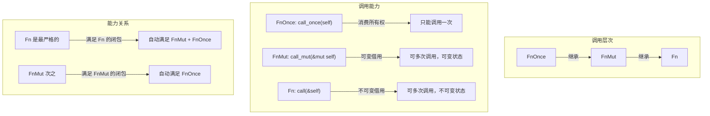
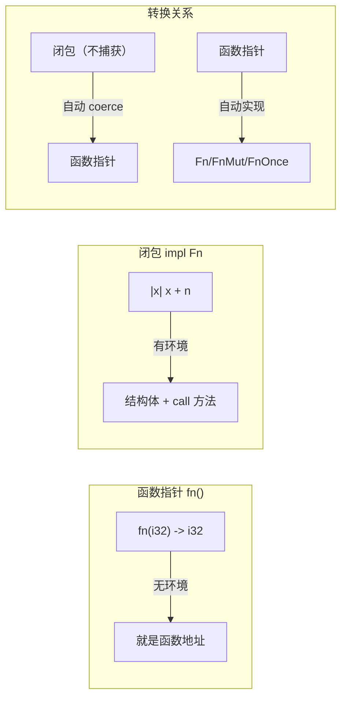
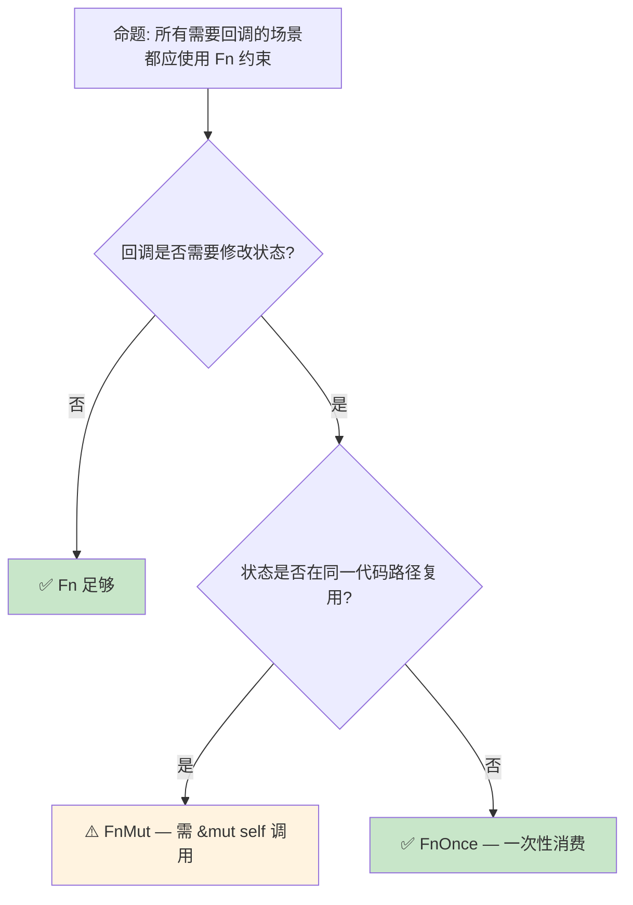

# 闭包类型系统：Fn、FnMut、FnOnce 的捕获语义

> **Bloom 层级**: 理解 → 应用
> **定位**: 深入分析 Rust 闭包的**类型系统**——`Fn`、`FnMut`、`FnOnce` 三者的捕获规则、自动 trait 推导、以及闭包与函数指针的本质区别。
> **前置概念**: [Traits](./01_traits.md) · [Ownership](../01_foundation/01_ownership.md) · [Borrowing](../01_foundation/02_borrowing.md)
> **后置概念**: [Async](../03_advanced/02_async.md) · [Generics](./02_generics.md)

---

> **来源**: [Rust Reference — Closure Types](https://doc.rust-lang.org/reference/types/closure.html) ·
> [TRPL Ch13 — Closures](https://doc.rust-lang.org/book/ch13-01-closures.html) ·
> [Rustonomicon — Functions & Closures](https://doc.rust-lang.org/nomicon/hrtb.html) ·
> [RFC 1558 — Closures](https://github.com/rust-lang/rfcs/pull/1558)

## 📑 目录
> [来源: [TRPL](https://doc.rust-lang.org/book/)]

- [闭包类型系统：Fn、FnMut、FnOnce 的捕获语义](#闭包类型系统fnfnmutfnonce-的捕获语义)
  - [📑 目录](#-目录)
  - [一、核心概念](#一核心概念)
    - [1.1 闭包的本质：匿名结构体](#11-闭包的本质匿名结构体)
    - [1.2 三种闭包 Trait](#12-三种闭包-trait)
    - [1.3 捕获方式：引用 vs 移动](#13-捕获方式引用-vs-移动)
  - [二、技术细节](#二技术细节)
    - [2.1 编译器自动推导规则](#21-编译器自动推导规则)
    - [2.2 闭包与函数指针](#22-闭包与函数指针)
    - [2.3 move 关键字的作用](#23-move-关键字的作用)
  - [三、使用模式](#三使用模式)
  - [四、反命题与边界分析](#四反命题与边界分析)
    - [4.1 反命题树](#41-反命题树)
    - [4.2 边界极限](#42-边界极限)
  - [五、常见陷阱](#五常见陷阱)
  - [六、来源与延伸阅读](#六来源与延伸阅读)
  - [相关概念文件](#相关概念文件)

---

## 一、核心概念
> [来源: [Rust Reference](https://doc.rust-lang.org/reference/)]

### 1.1 闭包的本质：匿名结构体

Rust 的闭包不是函数，而是**编译器自动生成的匿名结构体**：

```rust,ignore
// 概念示例：编译器如何展开闭包
let x = 5;
let closure = |y| x + y;

// 编译器展开为类似:
struct __Closure_1<'a> {
    x: &'a i32,  // 捕获的环境变量
}

impl<'a> Fn<(i32,)> for __Closure_1<'a> {
    type Output = i32;
    fn call(&self, args: (i32,)) -> i32 {
        *self.x + args.0
    }
}
```

> **核心洞察**: 闭包的"魔法"在于编译器自动推断**捕获哪些变量**、**以什么方式捕获**（引用/移动）、以及**实现哪个 Trait**（Fn/FnMut/FnOnce）。
> [来源: [Rust Reference — Closure Types](https://doc.rust-lang.org/reference/types/closure.html)]

---

### 1.2 三种闭包 Trait



> **认知功能**: 此图展示三种闭包 Trait 的**继承关系和能力层级**——Fn 最严格（只读），FnMut 次之（可修改），FnOnce 最宽松（可消费）。
> [来源: [TRPL](https://doc.rust-lang.org/book/)]
> **使用建议**: 泛型约束优先使用最严格的 Trait（Fn → FnMut → FnOnce），以获得最大的调用灵活性。
> **关键洞察**: `Fn: FnMut: FnOnce` 形成**子类型关系**——如果一个闭包是 `Fn`，它自动也是 `FnMut` 和 `FnOnce`。反之不成立。
> [来源: [TRPL Ch13 — Closures](https://doc.rust-lang.org/book/ch13-01-closures.html)]

---

### 1.3 捕获方式：引用 vs 移动

```text
闭包捕获三种方式:

  不可变借用 (&T)
  ├── 闭包只读取环境变量
  ├── 实现 Fn trait
  └── 允许多个闭包同时捕获同一变量

  可变借用 (&mut T)
  ├── 闭包修改环境变量
  ├── 实现 FnMut trait（如果调用需要 &mut self）
  └── 同一时间只有一个闭包可变捕获

  移动 (T)
  ├── 闭包获取环境变量的所有权
  ├── 实现 FnOnce trait（如果之后无法再次调用）
  └── 变量在闭包创建后不可用（除非实现 Copy）

自动推导规则:
  - 闭包体只读变量 → &T 捕获 → Fn
  - 闭包体修改变量 → &mut T 捕获 → FnMut
  - 闭包体移动变量（如 drop）→ T 捕获 → FnOnce
```

> **推导原则**: 编译器选择**最宽松**的捕获方式——优先不可变借用，其次可变借用，最后移动。
> [来源: [Rust Reference — Closure Capture Modes](https://doc.rust-lang.org/reference/types/closure.html#capture-modes)]

---

## 二、技术细节
> [来源: [TRPL](https://doc.rust-lang.org/book/)]

### 2.1 编译器自动推导规则

```rust
let mut s = String::from("hello");
let mut n = 0;

// 推导 1: 只读 → &T 捕获 → Fn
let f1 = || println!("{}", s);  // s: &String
// f1 可多次调用: f1(); f1();

// 推导 2: 修改 → &mut T 捕获 → FnMut
let f2 = || { n += 1; };
// f2 需 &mut 调用: f2(); f2();  // 实际是 FnMut

// 推导 3: 移动 → T 捕获 → FnOnce
let f3 = || drop(s);  // s 被移动到闭包内
// f3(); // ✅ 第一次调用
// f3(); // ❌ 编译错误：值已被移动
```

> **技术要点**: 闭包的 Trait 实现是**自动推导**的，不是显式声明的。编译器分析闭包体对捕获变量的使用方式，决定实现哪个 Trait。
> [来源: [Rust Reference — Closure Types](https://doc.rust-lang.org/reference/types/closure.html)]

---

### 2.2 闭包与函数指针



> **认知功能**: 此图对比函数指针与闭包的**本质区别**——函数指针无环境，闭包有环境（捕获的变量）。
> [来源: [TRPL](https://doc.rust-lang.org/book/)]
> **使用建议**: 不需要环境时用函数指针（更轻量）；需要环境时用闭包。不捕获的闭包可自动转换为函数指针。
> **关键洞察**: `fn(i32) -> i32` 实现了 `Fn(i32) -> i32`，因此任何接受闭包的地方都可传入函数指针。
> [来源: [Rust Reference — Function Pointer Types](https://doc.rust-lang.org/reference/types/function-pointer.html)]

---

### 2.3 move 关键字的作用

```rust
let s = String::from("hello");

// 默认: 编译器选择 &s（不可变借用）
let f1 = || println!("{}", s);
println!("{}", s);  // ✅ s 仍可用

// move: 强制按值捕获（T，非 &T）
let f2 = move || println!("{}", s);
// println!("{}", s);  // ❌ s 已被移动到闭包

// move 的用途:
// 1. 延长生命周期——将栈变量所有权移入闭包
let data = vec![1, 2, 3];
std::thread::spawn(move || {
    println!("{:?}", data);  // data 所有权移到线程
});

// 2. 强制复制（Copy 类型）
let n = 5;
let f3 = move || n + 1;  // n 被复制（i32: Copy）
println!("{}", n);  // ✅ n 仍可用（因为 Copy）
```

> **move 语义**: `move` 关键字**强制**闭包按值捕获所有变量，而非让编译器自动推导。对于 `Copy` 类型，按值捕获就是复制；对于非 `Copy` 类型，按值捕获就是移动。
> [来源: [TRPL — move Closures](https://doc.rust-lang.org/book/ch13-01-closures.html#moving-captured-values-out-of-closures-and-the-move-keyword)]

---

## 三、使用模式
> [来源: [Rust Reference](https://doc.rust-lang.org/reference/)]

```text
模式 1: 回调注册（Fn 约束）
  fn register_callback<F>(f: F)
  where
      F: Fn(i32) + 'static,
  {
      // 存储并稍后调用
  }
  // 使用: register_callback(|x| println!("{}", x));

模式 2: 迭代器适配（FnMut 约束）
  let mut count = 0;
  let result: Vec<_> = items
      .into_iter()
      .inspect(|_| count += 1)  // inspect 接受 FnMut
      .collect();

模式 3: 一次性消费者（FnOnce 约束）
  let name = String::from("Alice");
  let greeting = move || format!("Hello, {}!", name);
  let msg = greeting();  // name 被消费
  // greeting(); // 无法再次调用

模式 4: 闭包作为返回类型（impl Trait）
  fn make_adder(x: i32) -> impl Fn(i32) -> i32 {
      move |y| x + y
  }
  let add5 = make_adder(5);
  assert_eq!(add5(3), 8);
```

> **最佳实践**: 泛型约束优先用 `Fn`（最灵活），只在需要修改状态时用 `FnMut`，只在需要消费所有权时用 `FnOnce`。
> [来源: [Rust API Guidelines — Closure Types](https://rust-lang.github.io/api-guidelines/)]

---

## 四、反命题与边界分析
> [来源: [Rust Reference](https://doc.rust-lang.org/reference/)]

### 4.1 反命题树



> **认知功能**: 此决策树帮助选择闭包 Trait 约束。核心判断标准是**状态修改需求**和**复用性**。
> [来源: [TRPL](https://doc.rust-lang.org/book/)]
> **使用建议**: 优先 `Fn`，需要时升级到 `FnMut`，极少情况需要 `FnOnce`。
> **关键洞察**: Trait 约束的选择是**API 契约设计**——约束越严格，调用者越灵活；约束越宽松，实现者越自由。
> [来源: 💡 原创分析]

---

### 4.2 边界极限

```text
边界 1: 闭包类型的匿名性
├── 闭包类型是匿名的，无法直接写出类型名
├── 需用 impl Fn/FnMut/FnOnce 或 Box<dyn Fn> 传递
├── fn(i32) -> i32 是函数指针，不是闭包类型
└── 每个闭包即使签名相同，也是不同的类型

边界 2: 生命周期捕获
├── 闭包捕获的引用必须比闭包本身活得长
├── 'static 闭包不能捕获栈引用
└── 解决方案: move + 'static（拥有所有权）或正确标注生命周期

边界 3: 递归闭包
├── 闭包不能直接递归调用自身（类型递归）
├── 解决方案: Y 组合子或固定点组合子
└── 实际中很少需要，通常用函数替代

边界 4: 与 async 的交互
├── async 块本质上是特殊闭包
├── async || {} 是异步闭包（nightly）
└── 闭包 + async 的组合带来额外的 Pin 约束
```

> **边界要点**: 闭包的匿名性和生命周期捕获是日常使用中的主要限制。理解这些边界有助于设计更灵活的 API。
> [来源: [Rust Reference — Closure Types](https://doc.rust-lang.org/reference/types/closure.html)]

---

## 五、常见陷阱
> [来源: [TRPL](https://doc.rust-lang.org/book/)]

```text
陷阱 1: 生命周期过短
  ❌ let f = {
         let s = String::from("hello");
         || println!("{}", s)
     };  // s 被 drop，闭包捕获悬垂引用

  ✅ let s = String::from("hello");
     let f = move || println!("{}", s);  // 所有权移入闭包

陷阱 2: 错误选择 FnOnce vs FnMut
  ❌ fn call_twice(f: impl FnOnce()) { f(); f(); }
     // FnOnce 只能调用一次！

  ✅ fn call_twice(f: impl FnMut()) { f(); f(); }
     // 或: fn call_twice(f: impl Fn()) { f(); f(); }

陷阱 3: 忘记 move 导致生命周期问题
  ❌ let handles: Vec<_> = (0..10).map(|i| {
         std::thread::spawn(|| println!("{}", i))
     }).collect();
     // i 的引用可能比线程活得短

  ✅ let handles: Vec<_> = (0..10).map(|i| {
         std::thread::spawn(move || println!("{}", i))
     }).collect();
     // i 被复制（i32: Copy）到线程
```

> **陷阱总结**: 闭包的大多数问题源于**生命周期**和**所有权**——这正是 Rust 的核心关注领域。`move` 关键字和正确的 Trait 约束是解决之道。
> [来源: [Rust Common Mistakes — Closures](https://doc.rust-lang.org/book/ch13-01-closures.html)]

---

## 六、来源与延伸阅读

| 来源 | 可信度 | 说明 |
|:---|:---:|:---|
| [Rust Reference — Closure Types](https://doc.rust-lang.org/reference/types/closure.html) | ✅ 一级 | 官方语言参考 |
| [TRPL Ch13 — Closures](https://doc.rust-lang.org/book/ch13-01-closures.html) | ✅ 一级 | 闭包入门指南 |
| [RFC 1558](https://github.com/rust-lang/rfcs/pull/1558) | ✅ 一级 | 闭包捕获规则 RFC |
| [Rustonomicon — HRTB](https://doc.rust-lang.org/nomicon/hrtb.html) | ✅ 一级 | 高阶 Trait Bound |
| [Rust API Guidelines](https://rust-lang.github.io/api-guidelines/) | ✅ 一级 | API 设计最佳实践 |

---

## 相关概念文件
> [来源: [Rust Reference](https://doc.rust-lang.org/reference/)]

- [Traits](./01_traits.md) — Trait 系统与接口抽象
- [Ownership](../01_foundation/01_ownership.md) — 所有权模型
- [Borrowing](../01_foundation/02_borrowing.md) — 借用与生命周期
- [Async](../03_advanced/02_async.md) — 异步编程（async 块是特殊闭包）
- [Generics](./02_generics.md) — 泛型与参数多态

---

> **权威来源**: [Rust Reference](https://doc.rust-lang.org/reference/), [The Rust Programming Language](https://doc.rust-lang.org/book/), [Rustonomicon](https://doc.rust-lang.org/nomicon/)
>
> **权威来源对齐变更日志**: 2026-05-21 创建，对齐 Rust 1.95.0+ (Edition 2024)

**文档版本**: 1.0
**对应 Rust 版本**: 1.95.0+ (Edition 2024)
**最后更新**: 2026-05-21
**状态**: ✅ 概念文件创建完成
