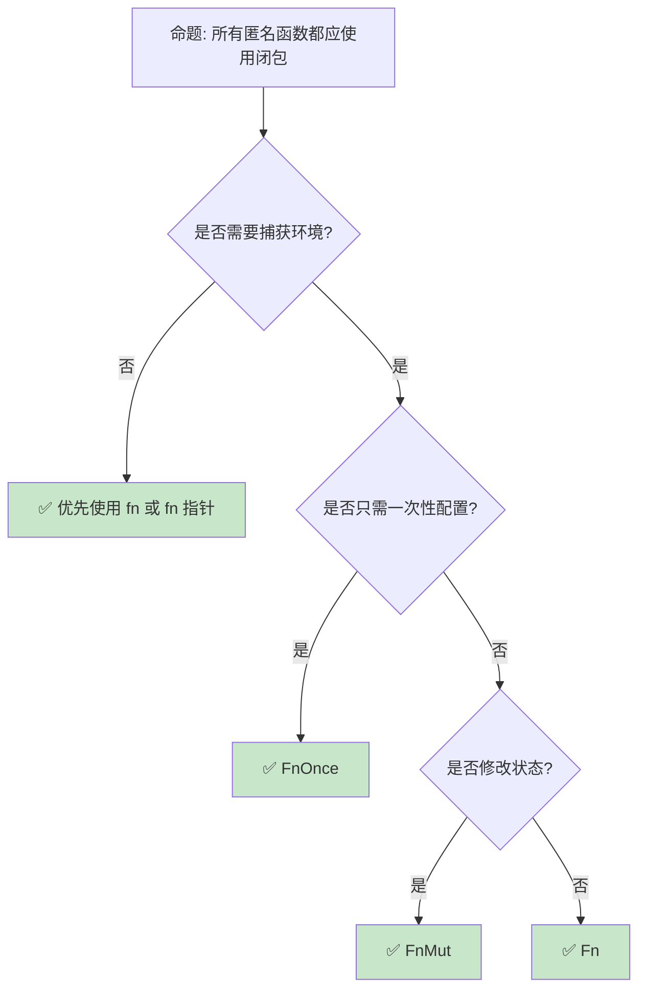
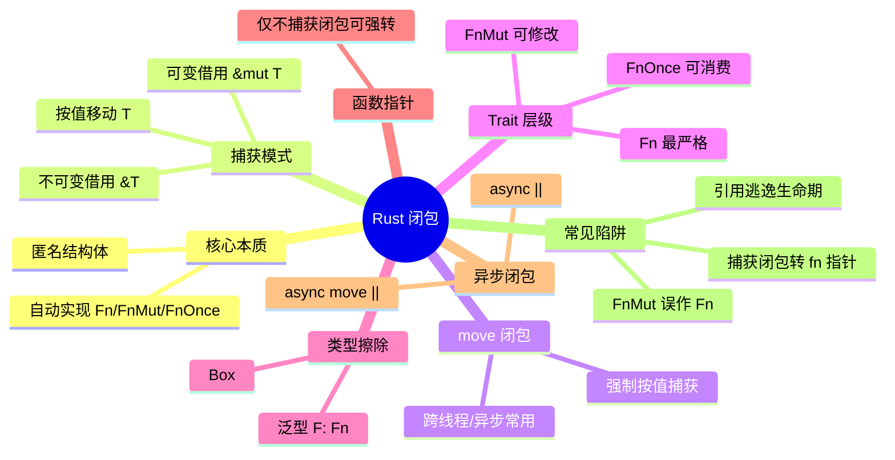

> **内容分级**: [综述级]
> **本节关键术语**: 闭包 (Closure) · 捕获 (Capture) · `move` 闭包 · `Fn` · `FnMut` · `FnOnce` · 函数指针 (Function Pointer) · 异步闭包 (Async Closure) — [完整对照表](../../00_meta/01_terminology/01_terminology_glossary.md)
>
# Rust 闭包：捕获语义、Trait 层级与工程实践
>
> **EN**: Closures
> **Summary**: Rust closures: capture modes, the `Fn`/`FnMut`/`FnOnce` trait family, `move` closures, coercion rules, async closures (1.85+), and common pitfalls.
> **Rust 版本**: 1.97.0+ (Edition 2024)
>
> **📎 交叉引用（Reference）**
>
> 本主题为 `concept/` 中 Rust 闭包的**唯一权威页**。
>
> **受众**: [进阶]
> **Bloom 层级**: L2-L3
> **权威来源**: 本文件为 `concept/` 权威页。
> **定位**: 系统阐述 Rust 闭包的语法、捕获机制、`Fn`/`FnMut`/`FnOnce` 语义层级、`move` 闭包、函数指针强制转换、异步闭包与典型反模式，覆盖从基础使用到工程决策的完整链条。
> **前置概念**: [Ownership](../../01_foundation/01_ownership_borrow_lifetime/01_ownership.md) · [Borrowing](../../01_foundation/01_ownership_borrow_lifetime/02_borrowing.md) · [Traits](../00_traits/01_traits.md)
> **后置概念**: [Iterator Patterns](01_iterator_patterns.md) · [Async Closures](../../03_advanced/01_async/07_async_closures.md) · [Advanced Traits](../00_traits/04_advanced_traits.md)

---

> **来源**: [Rust Reference — Closure Types](https://doc.rust-lang.org/reference/types/closure.html) · [Rust Reference — Closure Expressions](https://doc.rust-lang.org/reference/expressions/closure-expr.html) · [TRPL Ch13 — Closures](https://doc.rust-lang.org/book/ch13-01-closures.html) · [Rust By Example — Closures](https://doc.rust-lang.org/rust-by-example/fn/closures.html) · [RFC 1558 — Closures](https://github.com/rust-lang/rfcs/pull/1558) · [RFC 3668 — Async Closures](https://github.com/rust-lang/rfcs/pull/3668) · [The Rustonomicon — Functions & Closures](https://doc.rust-lang.org/nomicon/hrtb.html)

## 📑 目录

- [Rust 闭包：捕获语义、Trait 层级与工程实践](#rust-闭包捕获语义trait-层级与工程实践)
  - [📑 目录](#-目录)
  - [一、核心概念](#一核心概念)
    - [1.1 闭包的本质：匿名结构体 + 调用约定](#11-闭包的本质匿名结构体--调用约定)
    - [1.2 捕获方式：不可变引用、可变引用与移动](#12-捕获方式不可变引用可变引用与移动)
    - [1.3 `Fn` / `FnMut` / `FnOnce` 的能力层级](#13-fn--fnmut--fnonce-的能力层级)
    - [1.4 `move` 闭包：强制按值捕获](#14-move-闭包强制按值捕获)
  - [二、技术细节](#二技术细节)
    - [2.1 编译器如何推断捕获模式](#21-编译器如何推断捕获模式)
    - [2.2 闭包作为唯一的匿名类型](#22-闭包作为唯一的匿名类型)
    - [2.3 环境捕获与 Drop 顺序](#23-环境捕获与-drop-顺序)
    - [2.4 强制转换为函数指针](#24-强制转换为函数指针)
    - [2.5 异步闭包（Rust 1.85+）](#25-异步闭包rust-185)
  - [三、使用模式](#三使用模式)
  - [四、反命题与边界分析](#四反命题与边界分析)
    - [4.1 反命题树](#41-反命题树)
    - [4.2 边界极限](#42-边界极限)
  - [五、常见陷阱](#五常见陷阱)
  - [六、来源与延伸阅读](#六来源与延伸阅读)
  - [判定表：闭包 Trait 约束与捕获判定](#判定表闭包-trait-约束与捕获判定)
  - [相关概念](#相关概念)
  - [权威来源索引](#权威来源索引)
  - [十、边界测试：闭包的编译错误](#十边界测试闭包的编译错误)
    - [10.1 边界测试：在需要 `Fn` 的上下文中使用 `FnMut`（编译错误）](#101-边界测试在需要-fn-的上下文中使用-fnmut编译错误)
    - [10.2 边界测试：`FnOnce` 闭包被多次调用（编译错误）](#102-边界测试fnonce-闭包被多次调用编译错误)
    - [10.3 边界测试：捕获引用逃逸闭包生命期（编译错误）](#103-边界测试捕获引用逃逸闭包生命期编译错误)
    - [10.4 边界测试：误将捕获闭包转换为函数指针（编译错误）](#104-边界测试误将捕获闭包转换为函数指针编译错误)
    - [10.5 边界测试：`move` 闭包与 `Copy` 类型的陷阱（逻辑错误）](#105-边界测试move-闭包与-copy-类型的陷阱逻辑错误)
    - [10.6 边界测试：异步闭包与 `async move` 的捕获差异（编译错误）](#106-边界测试异步闭包与-async-move-的捕获差异编译错误)
  - [嵌入式测验（Embedded Quiz）](#嵌入式测验embedded-quiz)
    - [测验 1：`Fn`/`FnMut`/`FnOnce` 的选择（理解层）](#测验-1fnfnmutfnonce-的选择理解层)
    - [测验 2：`move` 关键字的作用（应用层）](#测验-2move-关键字的作用应用层)
    - [测验 3：闭包与函数指针（应用层）](#测验-3闭包与函数指针应用层)
    - [测验 4：捕获模式推导（分析层）](#测验-4捕获模式推导分析层)
  - [实践](#实践)
  - [认知路径](#认知路径)
    - [核心推理链](#核心推理链)
  - [国际权威参考 / International Authority References（P1 学术 · P2 生态）](#国际权威参考--international-authority-referencesp1-学术--p2-生态)
  - [📋 关键属性](#-关键属性)
  - [🔗 概念关系](#-概念关系)
  - [版本兼容性 / Version Compatibility](#版本兼容性--version-compatibility)
  - [🧭 思维导图（Mindmap）](#-思维导图mindmap)
  - [国际化权威来源补充（International Authority Sources）](#国际化权威来源补充international-authority-sources)
  - [国际化权威来源补充（International Authority Sources）](#国际化权威来源补充international-authority-sources-1)

---

## 一、核心概念

Rust 闭包（closure）是**带有环境的匿名函数**。它与普通函数 `fn` 的核心差异在于：闭包可以捕获（capture）其定义作用域中的变量，并在调用时使用这些变量。编译器将闭包实现为一个匿名结构体，并自动为其选择捕获方式与可调用的 trait。

### 1.1 闭包的本质：匿名结构体 + 调用约定

每个闭包表达式都会生成一个**唯一的、匿名的结构体类型**，其字段由被捕获的变量组成。该结构体实现 `Fn`、`FnMut`、`FnOnce` 中的一个或多个 trait，调用闭包即调用这些 trait 的 `call` 族方法。

```rust
let x = 5;
let add_x = |y| x + y;

// 概念上展开为：
// struct __Closure<'a> { x: &'a i32 }
// impl<'a> Fn<(i32,)> for __Closure<'a> { ... }

assert_eq!(add_x(3), 8);
```

> **核心洞察**: 闭包不是函数指针，而是编译器生成的**环境 + 调用协议**的组合体。两个语法相同的闭包（如 `|x| x + 1` 写两次）仍然拥有不同的匿名类型。
> [来源: [Rust Reference — Closure Types](https://doc.rust-lang.org/reference/types/closure.html)]

---

### 1.2 捕获方式：不可变引用、可变引用与移动

闭包对环境的访问由编译器按「最小权限」原则推导：

| 使用方式 | 捕获形式 | 实现的 trait | 调用约束 |
|---|---|---|---|
| 只读访问 | `&T` | `Fn` | `call(&self)`，可多次调用 |
| 修改捕获 | `&mut T` | `FnMut` | `call_mut(&mut self)`，需可变访问 |
| 消费/移动捕获 | `T` | `FnOnce` | `call_once(self)`，只能调用一次 |

```rust
// 注意：三种捕获模式不能在同一作用域内同时存在，以下分开展示
{
    let s = String::from("hello");
    let read = || println!("{}", s); // 捕获 &s → Fn
    read();
    read();
}
{
    let mut n = 0;
    let mut write = || { n += 1; }; // 捕获 &mut n → FnMut
    write();
    write();
}
{
    let s = String::from("hello");
    let consume = || drop(s); // 捕获 s (move) → FnOnce
    consume();
    // consume(); // ❌ 已消费
}
```

> **推导原则**: 编译器优先选择不可变借用；若闭包体需要修改，则升级为可变借用；若需要将捕获移出闭包体（如 `drop`），则升级为按值移动。
> [来源: [TRPL Ch13 — Closures](https://doc.rust-lang.org/book/ch13-01-closures.html)]

---

### 1.3 `Fn` / `FnMut` / `FnOnce` 的能力层级

三个 trait 构成**能力继承链**：

```text
Fn     ⊂ FnMut  ⊂ FnOnce

Fn       : call(&self)      → 只读，可共享调用
FnMut    : call_mut(&mut self) → 可修改内部状态
FnOnce   : call_once(self)   → 可消费环境，仅一次
```

```rust
fn call_fn<F>(f: F) where F: Fn() { f(); }
fn call_fnmut<F>(mut f: F) where F: FnMut() { f(); }
fn call_fnonce<F>(f: F) where F: FnOnce() { f(); }

{
    let s = String::from("hi");
    let ro = || println!("{}", s); // Fn
    call_fn(ro);
}
{
    let mut s = String::from("hi");
    let mut rw = || { let _ = &mut s; }; // FnMut
    call_fnmut(rw);
}
{
    let s = String::from("hi");
    let once = || drop(s); // FnOnce
    call_fnonce(once);
}
```

> **设计建议**: 函数参数约束应优先使用最严格的 trait（能用 `Fn` 不用 `FnMut`，能用 `FnMut` 不用 `FnOnce`），这样调用方最灵活。
> [来源: [Rust Reference — Closure Traits](https://doc.rust-lang.org/reference/types/closure.html#call-traits)]

---

### 1.4 `move` 闭包：强制按值捕获

`move` 前缀强制闭包**按值获取所有捕获变量**的所有权，而非默认的借用推断。

```rust
let s = String::from("data");
let f = move || println!("{}", s);

f();
// println!("{}", s); // ❌ s 已 move 进闭包
```

`move` 的典型用途：

- 跨线程传递闭包（要求 `'static`）
- 将非 `'static` 的局部变量生命周期延长至闭包本身
- 在异步任务或迭代器适配器中转移所有权

> **重要区分**: `move` 改变的是**捕获的语义**（借 → 移），不直接决定实现哪个 trait；trait 仍由闭包体如何使用捕获来决定。如果捕获类型实现 `Copy`，即使 `move` 也不会消耗外部变量。
> [来源: [TRPL Ch13 — Capturing References or Moving Ownership](https://doc.rust-lang.org/book/ch13-01-closures.html#capturing-references-or-moving-ownership)]

---

## 二、技术细节

在掌握了闭包的捕获语义与 `Fn`/`FnMut`/`FnOnce` 层级之后，本节将进一步深入编译器实现层面的关键细节：Rust 2021 如何按最小权限独立推断每个被捕获变量、闭包为什么是不可比较与不可命名的匿名类型、环境 Drop 顺序如何影响资源管理、不捕获闭包如何零成本强转为函数指针，以及异步闭包如何在普通闭包之上叠加 `async` 块的语义。这些细节不仅是面试与源码阅读中的高频考点，也直接决定了 API 设计时能否在零成本抽象、类型安全和可组合性之间做出正确权衡。

### 2.1 编译器如何推断捕获模式

Rust 2021 Edition 引入了**精确捕获（precise capture）**规则：闭包按**每个被捕获变量**独立决定捕获方式，而不是整个环境统一处理。

```rust
let a = String::from("a");
let mut b = String::from("b");

let f = || {
    println!("{}", a);   // a 以 &a 被捕获
    b.push('!');          // b 以 &mut b 被捕获
};

// 在 Rust 2021 下，a 只被不可变借用，b 被可变借用
// 闭包实现 FnMut，不会错误地把 a 也按 &mut 捕获
```

推断优先级：

1. 若变量在闭包体中只被读取 → `&T`（`Fn`）
2. 若需要修改 → `&mut T`（`FnMut`）
3. 若需要将变量移出闭包体 → `T`（`FnOnce`）

> **版本差异**: Rust 2018 及之前对捕获的处理更粗糙，可能导致不必要的 `FnMut` 推导。Rust 2021 的精确捕获显著减少了这类问题。
> [来源: [Rust Reference — Closure Capture Modes](https://doc.rust-lang.org/reference/types/closure.html#capture-modes)]

---

### 2.2 闭包作为唯一的匿名类型

两个闭包即使签名完全相同，类型也不同：

```rust
let f1 = |x: i32| x + 1;
let f2 = |x: i32| x + 1;

// let same: bool = f1 == f2; // ❌ 类型不同，无法比较

fn takes_fn<F: Fn(i32) -> i32>(_f: F) {}
takes_fn(f1);
takes_fn(f2);
```

若需要存储或传递异构闭包，使用 trait 对象：

```rust
let closures: Vec<Box<dyn Fn(i32) -> i32>> = vec![
    Box::new(|x| x + 1),
    Box::new(|x| x * 2),
];
```

> **性能提示**: 泛型 `F: Fn()` 保持闭包的具体类型，允许单态化内联；`Box<dyn Fn()>` 引入一次间接调用，但提供类型擦除能力。
> [来源: [Rust Reference — Closure Types](https://doc.rust-lang.org/reference/types/closure.html)]

---

### 2.3 环境捕获与 Drop 顺序

闭包环境在闭包被 drop 时按字段声明顺序逆序 drop（与结构体一致）。若闭包实现 `FnOnce` 并在调用时被消费，其环境也会在调用时被 drop。

```rust
struct LoudDrop(&'static str);
impl Drop for LoudDrop {
    fn drop(&mut self) { println!("drop {}", self.0); }
}

let a = LoudDrop("a");
let b = LoudDrop("b");
let f = move || {
    let _ = &a;
    let _ = &b;
};
// f 被 drop 时：先 b 后 a
```

> **注意**: `move` 闭包本身拥有捕获的环境；当闭包离开作用域或被 `call_once` 消费时，环境随之 drop。
> [来源: [Rust Reference — Destructor Order](https://doc.rust-lang.org/reference/destructors.html)]

---

### 2.4 强制转换为函数指针

**只有不捕获环境**的闭包才能强制转换为 `fn` 指针：

```rust
let f: fn(i32) -> i32 = |x| x + 1;
assert_eq!(f(5), 6);

let n = 1;
let g = |x: i32| x + n;
// let p: fn(i32) -> i32 = g; // ❌ 捕获了 n，无法转换
```

这一强制转换是零成本的：不捕获的闭包在表示上与函数指针兼容。

> **边界**: 捕获环境的闭包无法转换为 `fn` 指针，因为函数指针没有存储环境的空间。
> [来源: [Rust Reference — Closure to Function Pointer Coercion](https://doc.rust-lang.org/reference/types/closure.html#closure-to-function-pointer-coercion)]

---

### 2.5 异步闭包（Rust 1.85+）

Rust 1.85 稳定了异步闭包，语法为 `async || { ... }` 或 `async move || { ... }`。异步闭包返回一个 `Future`，其捕获规则在普通闭包捕获之上叠加 async 块规则。

```rust
// Rust 1.85+
#[tokio::main]
async fn main() -> Result<(), reqwest::Error> {
    let client = reqwest::Client::new();
    let fetch = async move |url: &str| -> Result<String, reqwest::Error> {
        client.get(url).send().await?.text().await
    };

    // 调用异步闭包产生 Future
    let html = fetch("https://example.com").await?;
    println!("{}", html);
    Ok(())
}
```

异步闭包与普通 `async move` 块的关键差异：

- `async ||` 可在调用时传入参数，每次调用产生新的 `Future`
- 捕获发生在闭包**创建时**，`.await` 发生在调用后的 `Future` 执行时
- 跨任务传递时通常需要 `async move ||` 以满足 `'static`

> **前置阅读**: 完整异步闭包语义见 [Async Closures](../../03_advanced/01_async/07_async_closures.md)。
> [来源: [RFC 3668 — Async Closures](https://github.com/rust-lang/rfcs/pull/3668)]

---

## 三、使用模式

```text
闭包选型决策树:

是否需要捕获环境？
├── 否 → 使用普通 fn 或 |x| ...（可强转 fn 指针）
└── 是 → 闭包体如何使用捕获？
    ├── 只读 → Fn
    ├── 修改 → FnMut
    └── 消费/移动 → FnOnce

是否需要跨线程/异步任务？
├── 是 → 使用 move 闭包，确保捕获满足 'static
└── 否 → 让编译器自动推断捕获方式

是否需要类型擦除？
├── 是 → Box<dyn Fn()> / &dyn Fn()
└── 否 → 泛型 F: Fn()（零成本内联）
```

典型模式示例：

```rust
use std::fs::File;

fn main() -> std::io::Result<()> {
    // 模式 1：迭代器适配器（Fn）
    let v = vec![1, 2, 3];
    let doubled: Vec<_> = v.iter().map(|x| x * 2).collect();

    // 模式 2：累加器（FnMut）
    let mut sum = 0;
    v.iter().for_each(|x| sum += x);

    // 模式 3：资源释放（FnOnce）
    let resource = File::open("data.txt")?;
    let _cleanup = move || drop(resource);

    // 模式 4：回调注册（dyn Fn）
    struct App {
        on_click: Box<dyn Fn()>,
    }
    let _ = App { on_click: Box::new(|| ()) };

    let _ = doubled;
    let _ = sum;
    Ok(())
}
```

---

## 四、反命题与边界分析

理解闭包不能只停留在“能跑通”，还要知道哪些看似合理的命题在 Rust 类型系统中并不成立。本节通过反命题树和边界极限表格，把“所有匿名函数都应使用闭包”“捕获引用可以随闭包返回”“`move` 一定改变 trait”等常见直觉形式化地推翻，并给出对应的类型系统解释与工程缓解策略。

### 4.1 反命题树



---

### 4.2 边界极限

| 边界 | 说明 | 缓解策略 |
|---|---|---|
| 类型唯一性 | 每个闭包都是不同的匿名类型 | 需要统一类型时使用 `dyn Fn` 或泛型 |
| 生命周期 | 捕获引用不能比闭包活得更久 | 使用 `move` 将所有权移入闭包 |
| `FnOnce` 只能调用一次 | 传给 `FnOnce` 后原闭包被消费 | 需要多次调用时约束为 `Fn`/`FnMut` |
| 递归闭包 | 闭包无法直接自引用 | 使用 `Rc<RefCell<F>>` 或函数组合子 |
| 编译体积 | 大量不同闭包类型导致单态化膨胀 | 必要时用 `dyn Fn` 类型擦除 |

---

## 五、常见陷阱

```text
陷阱 1: 在需要 Fn 的地方使用 FnMut
  ❌ fn takes_fn(f: impl Fn()) { f(); }
     let mut n = 0;
     takes_fn(|| n += 1); // 需要 &mut self

  ✅ fn takes_fnmut(f: impl FnMut()) { f(); }

陷阱 2: 误以为 move 改变 trait
  ❌ let s = String::new();
     let f = move || println!("{}", s); // 仍是 Fn，因为只读
     // f 被调用多次是合法的

  ✅ trait 由闭包体决定，move 只决定捕获方式

陷阱 3: 捕获引用逃逸闭包生命期
  ❌ fn make_closure() -> impl Fn() {
       let s = String::from("local");
       || println!("{}", s) // s 在返回前被 drop
     }

  ✅ fn make_closure() -> impl Fn() {
       let s = String::from("local");
       move || println!("{}", s)
     }

陷阱 4: 把捕获闭包传给需要 fn 指针的 API
  ❌ let n = 1;
     let f: fn(i32) -> i32 = |x| x + n; // 捕获了 n

  ✅ 不捕获的闭包才能强转 fn 指针

陷阱 5: 闭包在 match 臂中类型不一致
  ❌ let f = match cond {
       true => |x| x + 1,
       false => |x| x * 2,
     }; // 两个 arm 的闭包类型不同

  ✅ let f: Box<dyn Fn(i32) -> i32> = match cond { ... };
```

---

## 六、来源与延伸阅读

| 来源 | 可信度 | 说明 |
|:---|:---:|:---|
| [Rust Reference — Closure Types](https://doc.rust-lang.org/reference/types/closure.html) | ✅ P1 | 闭包类型与捕获规则权威定义 |
| [Rust Reference — Closure Expressions](https://doc.rust-lang.org/reference/expressions/closure-expr.html) | ✅ P1 | 闭包表达式语法 |
| [TRPL Ch13 — Closures](https://doc.rust-lang.org/book/ch13-01-closures.html) | ✅ P1 | 入门与使用模式 |
| [Rust By Example — Closures](https://doc.rust-lang.org/rust-by-example/fn/closures.html) | ✅ P2 | 交互式示例 |
| [RFC 1558 — Closures](https://github.com/rust-lang/rfcs/pull/1558) | ✅ P1 | 闭包 trait 设计 |
| [RFC 3668 — Async Closures](https://github.com/rust-lang/rfcs/pull/3668) | ✅ P1 | 异步闭包 RFC |
| [Rustonomicon — Functions & Closures](https://doc.rust-lang.org/nomicon/hrtb.html) | ✅ P2 | 高级生命周期与闭包 |

---

## 判定表：闭包 Trait 约束与捕获判定

| 闭包体使用捕获 | 捕获方式 | 实现 trait | 可传 `Fn` | 可传 `FnMut` | 可传 `FnOnce` |
|---|---|---|---|---|---|
| 只读 | `&T` | `Fn` | ✅ | ✅ | ✅ |
| 修改 | `&mut T` | `FnMut` | ❌ | ✅ | ✅ |
| 消费/移动 | `T` | `FnOnce` | ❌ | ❌ | ✅ |

---

## 相关概念

- **上位概念**: [Functions](../../01_foundation/07_modules_and_items/02_functions.md) · [Traits](../00_traits/01_traits.md)
- **前置概念**: [Ownership](../../01_foundation/01_ownership_borrow_lifetime/01_ownership.md) · [Borrowing](../../01_foundation/01_ownership_borrow_lifetime/02_borrowing.md)
- **后置概念**: [Iterator Patterns](01_iterator_patterns.md) · [Async Closures](../../03_advanced/01_async/07_async_closures.md) · [Advanced Traits](../00_traits/04_advanced_traits.md)

---

## 权威来源索引

> **权威来源**: [Rust Reference — Closure Types](https://doc.rust-lang.org/reference/types/closure.html), [Rust Reference — Closure Expressions](https://doc.rust-lang.org/reference/expressions/closure-expr.html), [TRPL Ch13 — Closures](https://doc.rust-lang.org/book/ch13-01-closures.html), [Rust By Example — Closures](https://doc.rust-lang.org/rust-by-example/fn/closures.html), [RFC 1558 — Closures](https://github.com/rust-lang/rfcs/pull/1558), [RFC 3668 — Async Closures](https://github.com/rust-lang/rfcs/pull/3668)
>
> **权威来源对齐变更日志**: 2026-07-31 创建 [Wave B — L1/L2 Core Gaps]

**文档版本**: 1.0
**最后更新**: 2026-07-31
**状态**: ✅ 概念文件创建完成

---

## 十、边界测试：闭包的编译错误

光知道规则不足以避免犯错；本节把闭包在实际代码中最容易触发编译错误的场景抽取成边界测试。每个示例都对应一个具体的类型系统冲突——从 `FnMut` 误用、到 `FnOnce` 多次调用、到引用逃逸生命期、再到闭包强转函数指针失败——通过编译期失败来反向巩固对捕获语义与 trait 约束的理解。

### 10.1 边界测试：在需要 `Fn` 的上下文中使用 `FnMut`（编译错误）

```rust,compile_fail
fn takes_fn(f: impl Fn()) {
    f();
}

fn main() {
    let mut n = 0;
    takes_fn(|| n += 1); // ❌ closure is `FnMut` because it mutates `n`
}
```

> **修正**: 需要修改变量的闭包是 `FnMut`。将约束改为 `impl FnMut()`，并在调用时提供可变访问。
> [来源: [Rust Reference — Closure Traits](https://doc.rust-lang.org/reference/types/closure.html#call-traits)]

---

### 10.2 边界测试：`FnOnce` 闭包被多次调用（编译错误）

```rust,compile_fail
fn call_twice(f: impl FnOnce()) {
    f();
    f(); // ❌ value used after move
}

fn main() {
    let s = String::from("x");
    call_twice(|| drop(s));
}
```

> **修正**: `FnOnce` 闭包在第一次调用时已被消费。若需多次调用，应让闭包只读或可变捕获，而不是消费捕获。
> [来源: [TRPL Ch13 — Moving Captured Values Out](https://doc.rust-lang.org/book/ch13-01-closures.html#moving-captured-values-out-of-the-closure-and-the-fn-traits)]

---

### 10.3 边界测试：捕获引用逃逸闭包生命期（编译错误）

```rust,compile_fail
fn make_closure() -> impl Fn() {
    let s = String::from("local");
    || println!("{}", s) // ❌ s dropped while borrowed
}
```

> **修正**: 默认捕获借用的闭包无法返回，因为被引用变量会在函数返回时 drop。使用 `move || ...` 将所有权移入闭包。
> [来源: [TRPL Ch13 — Moving Captured Values Out](https://doc.rust-lang.org/book/ch13-01-closures.html#moving-captured-values-out-of-the-closure-and-the-fn-traits)]

---

### 10.4 边界测试：误将捕获闭包转换为函数指针（编译错误）

```rust,compile_fail
fn main() {
    let n = 1;
    let f: fn(i32) -> i32 = |x| x + n; // ❌ expected fn pointer, found closure
}
```

> **修正**: 函数指针没有环境存储空间。不捕获的闭包才能隐式强转为 `fn` 指针；否则使用 `Box<dyn Fn(i32) -> i32>` 或泛型。
> [来源: [Rust Reference — Closure to Function Pointer Coercion](https://doc.rust-lang.org/reference/types/closure.html#closure-to-function-pointer-coercion)]

---

### 10.5 边界测试：`move` 闭包与 `Copy` 类型的陷阱（逻辑错误）

```rust
fn main() {
    let n = 42;
    let f = move || n; // n 是 Copy，move 实际发生的是按值复制
    println!("{}", n); // ✅ 仍然可用
    println!("{}", f());
}
```

> **注意**: `move` 对 `Copy` 类型不会产生「外部变量不可用」的效果，因为按值捕获 `Copy` 类型会复制而非移动。若需要确保所有权转移，应对非 `Copy` 类型使用 `move`。
> [来源: [TRPL Ch13 — Moving Captured Values Out](https://doc.rust-lang.org/book/ch13-01-closures.html#moving-captured-values-out-of-the-closure-and-the-fn-traits)]

---

### 10.6 边界测试：异步闭包与 `async move` 的捕获差异（编译错误）

```rust,compile_fail
// 需要 Rust 1.85+
async fn example() {
    let s = String::from("async");
    let f = async || s; // 移动 s 进闭包
    let _ = f().await;
    println!("{}", s); // ❌ s 已在闭包调用时被移动
}
```

> **修正**: 异步闭包默认按借用捕获。跨 await 或跨任务传递时，通常需要 `async move ||` 将所有权移入闭包。
> [来源: [RFC 3668 — Async Closures](https://github.com/rust-lang/rfcs/pull/3668)]

---

## 嵌入式测验（Embedded Quiz）

以下嵌入式测验覆盖本概念文件的四个核心判定点：trait 选择、`move` 语义、函数指针转换以及捕获模式推导。建议在完成阅读后先独立思考，再展开答案，以检验是否已将捕获规则与 trait 层级内化为可迁移的推理能力。

### 测验 1：`Fn`/`FnMut`/`FnOnce` 的选择（理解层）

**题目**: 闭包体只读取环境变量时应实现哪个 trait？修改环境变量呢？将环境变量 move 出闭包体呢？

<details>
<summary>✅ 答案与解析</summary>

只读 → `Fn`；修改 → `FnMut`；消费/移动 → `FnOnce`。能力关系为 `Fn ⊂ FnMut ⊂ FnOnce`。
</details>

---

### 测验 2：`move` 关键字的作用（应用层）

**题目**: `move || println!("{}", s)` 中的 `move` 会改变闭包实现的 trait 吗？它改变的是什么？

<details>
<summary>✅ 答案与解析</summary>

`move` 不改变实现的 trait；trait 由闭包体如何使用 `s` 决定。`move` 改变的是捕获方式——强制按值捕获所有用到的变量，常用于跨线程或返回闭包时满足 `'static`。
</details>

---

### 测验 3：闭包与函数指针（应用层）

**题目**: 什么样的闭包可以强制转换为 `fn` 指针？捕获了环境变量的闭包可以吗？

<details>
<summary>✅ 答案与解析</summary>

只有不捕获任何环境的闭包才能隐式转换为 `fn` 指针。捕获了环境变量的闭包无法转换，因为函数指针没有存储环境的空间。
</details>

---

### 测验 4：捕获模式推导（分析层）

**题目**: 以下闭包分别实现什么 trait？

```rust
let mut v = vec![1, 2, 3];
let f1 = || v.len();
let f2 = || v.push(4);
let f3 = || drop(v);
```

<details>
<summary>✅ 答案与解析</summary>

`f1` 只读 → `Fn`；`f2` 修改 → `FnMut`；`f3` 消费 `v` → `FnOnce`。注意三者不能同时存在，因为会违反借用规则。
</details>

---

## 实践

> **相关资源**:
>
> - [crates/c03_control_fn](../../../crates/c03_control_fn) — 与闭包相关的可编译示例
> - [exercises/src/closures](../../../exercises/src) — 动手编程挑战
> - [MVP 学习路径](../../00_meta/04_navigation/08_learning_mvp_path.md) — 从零到多线程 CLI 的 40 小时路径
>
> **建议**: 阅读完本概念文件后，尝试实现一个自定义 `filter_map` 适配器，分别使用 `Fn`、`FnMut`、`FnOnce` 三种约束。

---

## 认知路径

> **认知路径**: 从 L1 的函数与所有权出发，经由本节的闭包捕获与 trait 层级，通向 L3 的异步闭包与高级 trait 模式。

### 核心推理链

| 定理 | 前提 | 结论 | 置信度 |
|:---|:---|:---|:---|
| 理解捕获模式 ⟹ 正确选择 trait | 知道环境如何使用 | 能写出正确的泛型约束 | 高 |
| 掌握 `move` 语义 ⟹ 避免生命周期错误 | 知道借用与所有权转移的区别 | 能安全返回或跨线程传递闭包 | 高 |
| 区分 `fn` 指针与闭包 ⟹ 正确设计 API | 知道类型擦除与内联的权衡 | 能在泛型与 `dyn` 之间做选择 | 高 |

> 闭包正确性 ⟸ 捕获模式推断 ⟸ 借用检查
> 跨上下文传递 ⟸ `move` 语义 ⟸ `'static` 约束

---

## 国际权威参考 / International Authority References（P1 学术 · P2 生态）

| 来源 | 类型 | 链接 | 覆盖主题 |
|---|---|---|---|
| Rust Reference — Closure Types | P1 官方参考 | <https://doc.rust-lang.org/reference/types/closure.html> | 类型、捕获、trait |
| Rust Reference — Closure Expressions | P1 官方参考 | <https://doc.rust-lang.org/reference/expressions/closure-expr.html> | 语法、move、async closures |
| TRPL Ch13 — Closures | P1 官方教程 | <https://doc.rust-lang.org/book/ch13-01-closures.html> | 使用模式、捕获、Fn/FnMut/FnOnce |
| Rust By Example — Closures | P2 官方示例 | <https://doc.rust-lang.org/rust-by-example/fn/closures.html> | 交互式示例 |
| RFC 1558 — Closures | P1 设计文档 | <https://github.com/rust-lang/rfcs/pull/1558> | `Fn`/`FnMut`/`FnOnce` 设计 |
| RFC 3668 — Async Closures | P1 设计文档 | <https://github.com/rust-lang/rfcs/pull/3668> | 异步闭包 |
| Rustonomicon — Functions & Closures | P2 高级资料 | <https://doc.rust-lang.org/nomicon/hrtb.html> | 生命周期、高阶 trait bound |
| Rust Reference — Destructors | P1 官方参考 | <https://doc.rust-lang.org/reference/destructors.html> | 闭包环境 Drop 顺序与析构规则 |
| Landin, P. J. “The Mechanical Evaluation of Expressions.” *The Computer Journal*, 1964. | P1 学术 | <https://doi.org/10.1093/comjnl/6.4.308> | 闭包概念起源（SECD 机 + 环境捕获） |
| Plotkin, G. D. “Call-by-Name, Call-by-Value and the λ-Calculus.” *Theoretical Computer Science*, 1975. | P1 学术 | <https://doi.org/10.1016/0304-3975(75)90017-1> | λ-演算与调用约定，Rust `Fn` 层级语义基础 |
| Jung, R. et al. “RustBelt: Securing the Foundations of the Rust Programming Language.” *POPL 2018*. | P1 学术 | <https://plv.mpi-sws.org/rustbelt/> | Rust 高阶函数与闭包的形式化安全基础 |

---

## 📋 关键属性

| 属性 | 取值 / 判定 | 依据 |
|---|---|---|
| 类型 | 每个闭包都是唯一的匿名结构体 | 编译器实现 |
| 捕获 | `&T` / `&mut T` / `T`，按最小权限推导 | Rust 2021 precise capture |
| 调用 trait | `Fn` ⊂ `FnMut` ⊂ `FnOnce` | 标准库定义 |
| `move` 语义 | 强制按值捕获 | 表达式前缀 |
| fn 指针强转 | 仅不捕获的闭包 | 引用类型强制转换规则 |
| 异步闭包 | Rust 1.85+ | RFC 3668 |

---

## 🔗 概念关系

- **上位（is-a）**: [Functions](../../01_foundation/07_modules_and_items/02_functions.md) — 函数的可调用抽象。
- **实现基础**: [Traits](../00_traits/01_traits.md) — `Fn`/`FnMut`/`FnOnce` 是标准库 trait。
- **依赖**: [Ownership](../../01_foundation/01_ownership_borrow_lifetime/01_ownership.md) · [Borrowing](../../01_foundation/01_ownership_borrow_lifetime/02_borrowing.md) — 捕获规则直接依赖所有权系统。
- **组合**: [Iterator Patterns](01_iterator_patterns.md) — 迭代器适配器大量使用闭包传递转换逻辑。
- **深化**: [Async Closures](../../03_advanced/01_async/07_async_closures.md) — 异步闭包是普通闭包与 async 的交叉。
- **旧权威页重定向**: 本页合并并替代 [`02_intermediate/04_types_and_conversions/02_closure_types.md`](../04_types_and_conversions/02_closure_types.md) 成为闭包唯一权威页。

---

## 版本兼容性 / Version Compatibility

> 本节汇总与本概念相关的 Rust 稳定版本变更。完整列表见对应版本跟踪页。

- **[Rust 1.98](../../07_future/00_version_tracking/rust_1_98_stabilized.md)**
  - Named `Fn` trait parameters（RFC #3955）：允许在 `Fn`/`FnMut`/`FnOnce` 及 `AsyncFn*` 的泛型参数列表中为参数命名，名称不参与类型等价判定与 ABI，仅用于文档与 IDE 提示

---

## 🧭 思维导图（Mindmap）



## 国际化权威来源补充（International Authority Sources）

- <https://dl.acm.org/doi/10.1145/237721.237791>
- <https://doc.rust-lang.org/reference/introduction.html>

## 国际化权威来源补充（International Authority Sources）

- <https://rust-unofficial.github.io/patterns/>
- <https://blog.rust-lang.org/>
