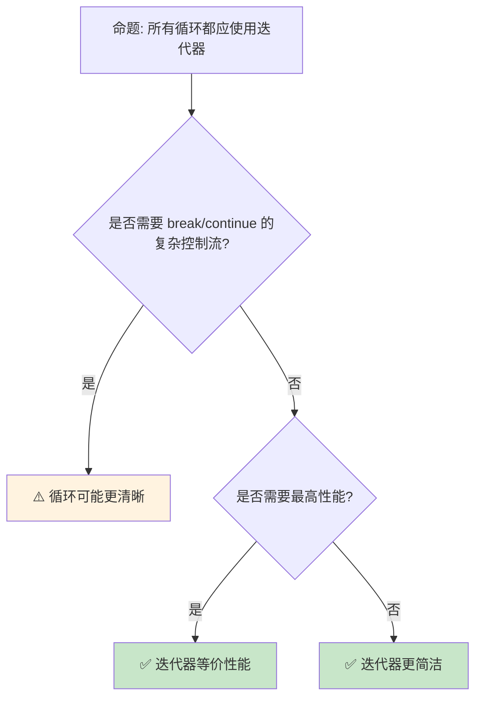

> **内容分级**: [综述级]
> **本节关键术语**: 迭代器模式 (Iterator Pattern) · 适配器 (Adapter) · 消费者 (Consumer) · 惰性求值 (Lazy Evaluation) · 自定义迭代器 — [完整对照表](../../00_meta/01_terminology/terminology_glossary.md)
>
# Rust 迭代器模式
>
> **EN**: Iterators
> **Summary**: Iterators. Core Rust concept covering practical applications, mechanism analysis, in-depth analysis, performance optimization.
>
> **📎 交叉引用（Reference）**
>
> 本主题在 knowledge 中有系统化的知识索引：迭代器（Iterator）
>
> **受众**: [进阶]
> **Bloom 层级**: 应用 → 分析
> **定位**: 深入探讨 Rust 迭代器（Iterator）模式——从适配器链到自定义迭代器，分析惰性求值、性能特征和最佳实践。
> **前置概念**: [Type System](../../01_foundation/02_type_system/04_type_system.md) · [Generics](../01_generics/02_generics.md) · [Closures](../../01_foundation/00_start/15_closure_basics.md)
> **后置概念**: [Concurrency](../../03_advanced/00_concurrency/01_concurrency.md) · [Performance](../../06_ecosystem/10_performance/15_performance_optimization.md)

---

> **来源**: [TRPL — Iterators](https://doc.rust-lang.org/book/ch13-02-iterators.html) · · [Peyton Jones — The Implementation of Functional Programming Languages](https://www.microsoft.com/en-us/research/publication/the-implementation-of-functional-programming-languages/) · [Brown University — Concepts in Rust Programming](https://cel.cs.brown.edu/crp/) · [Oxide: The Essence of Rust](https://arxiv.org/abs/1903.00982) · [Itanium C++ ABI](https://itanium-cxx-abi.github.io/cxx-abi/abi.html)
> [Rust Reference — Iterators](https://doc.rust-lang.org/std/iter/trait.Iterator.html) ·
> [Rust Iterator Cheat Sheet](https://doc.rust-lang.org/std/iter/index.html) ·
> [RFC 0235 — IntoIterator](https://rust-lang.github.io/rfcs//0235-collections-conventions.html) ·
> [Wikipedia — Iterator Pattern](https://en.wikipedia.org/wiki/Iterator_pattern)

## 📑 目录

- [Rust 迭代器模式](#rust-迭代器模式)
  - [📑 目录](#-目录)
  - [一、核心概念](#一核心概念)
    - [1.1 Iterator Trait](#11-iterator-trait)
    - [1.2 适配器链](#12-适配器链)
    - [1.3 惰性求值](#13-惰性求值)
    - [1.4 消费者与适配器](#14-消费者与适配器)
  - [二、常用模式](#二常用模式)
    - [2.1 map-filter-collect](#21-map-filter-collect)
    - [2.2 fold 与归约](#22-fold-与归约)
    - [2.3 zip 与并行迭代](#23-zip-与并行迭代)
    - [2.4 IntoIterator 与 for 循环](#24-intoiterator-与-for-循环)
    - [2.5 迭代器模式矩阵](#25-迭代器模式矩阵)
  - [三、自定义迭代器](#三自定义迭代器)
  - [四、性能权衡](#四性能权衡)
  - [五、反命题与边界分析](#五反命题与边界分析)
  - [六、常见陷阱](#六常见陷阱)
  - [七、来源与延伸阅读](#七来源与延伸阅读)
  - [相关概念文件](#相关概念文件)
  - [逆向推理链（Backward Reasoning）](#逆向推理链backward-reasoning)
  - [权威来源索引](#权威来源索引)
  - [十、边界测试：迭代器模式的编译错误](#十边界测试迭代器模式的编译错误)
    - [10.1 边界测试：`Iterator::collect` 的目标类型歧义（编译错误）](#101-边界测试iteratorcollect-的目标类型歧义编译错误)
    - [10.2 边界测试：迭代器适配器的惰性求值陷阱（逻辑错误）](#102-边界测试迭代器适配器的惰性求值陷阱逻辑错误)
    - [10.3 边界测试：`Iterator::zip` 的长度不一致（逻辑错误）](#103-边界测试iteratorzip-的长度不一致逻辑错误)
    - [10.4 边界测试：消耗型适配器与双重迭代（编译错误）](#104-边界测试消耗型适配器与双重迭代编译错误)
    - [10.5 边界测试：`flat_map` 与嵌套迭代器的所有权（编译错误）](#105-边界测试flat_map-与嵌套迭代器的所有权编译错误)
    - [10.6 边界测试：`Iterator::fold` 的初始值类型不匹配（编译错误）](#106-边界测试iteratorfold-的初始值类型不匹配编译错误)
    - [10.7 边界测试：`Iterator::fuse` 后的重复消费（逻辑错误）](#107-边界测试iteratorfuse-后的重复消费逻辑错误)
  - [十二、边界测试：迭代器模式的编译错误（续）](#十二边界测试迭代器模式的编译错误续)
    - [12.1 边界测试：`skip_while` 与 `take_while` 的互斥性（逻辑错误）](#121-边界测试skip_while-与-take_while-的互斥性逻辑错误)
    - [12.2 边界测试：`cycle` 与无限迭代器（运行时死循环）](#122-边界测试cycle-与无限迭代器运行时死循环)
    - [12.3 边界测试：`enumerate` 与索引类型（逻辑错误）](#123-边界测试enumerate-与索引类型逻辑错误)
    - [12.4 边界测试：`partition` 与所有权分割（编译错误）](#124-边界测试partition-与所有权分割编译错误)
    - [12.5 边界测试：`ChunksExact` 的剩余元素处理（逻辑错误）](#125-边界测试chunksexact-的剩余元素处理逻辑错误)
    - [12.6 边界测试：const fn 中的非编译期操作](#126-边界测试const-fn-中的非编译期操作)
  - [嵌入式测验（Embedded Quiz）](#嵌入式测验embedded-quiz)
    - [测验 1：`Iterator::map` 和 `Iterator::filter` 返回的是新迭代器还是立即执行计算？（理解层）](#测验-1iteratormap-和-iteratorfilter-返回的是新迭代器还是立即执行计算理解层)
    - [测验 2：`iter.next()` 返回 `Option<Self::Item>`。`None` 表示什么？（理解层）](#测验-2iternext-返回-optionselfitemnone-表示什么理解层)
    - [测验 3：`Iterator::fold` 与 `Iterator::reduce` 的主要区别是什么？（理解层）](#测验-3iteratorfold-与-iteratorreduce-的主要区别是什么理解层)
    - [测验 4：如何实现自定义迭代器？至少需要实现哪个方法？（理解层）](#测验-4如何实现自定义迭代器至少需要实现哪个方法理解层)
    - [测验 5：`iter.take(n)` 和 `iter.skip(n)` 分别对迭代器做什么？（理解层）](#测验-5itertaken-和-iterskipn-分别对迭代器做什么理解层)
    - [测验 6：`Iterator::fuse()` 的作用是什么？在什么场景下需要使用它？（理解层）](#测验-6iteratorfuse-的作用是什么在什么场景下需要使用它理解层)
    - [测验 7：`peekable()` 迭代器与标准迭代器的主要区别是什么？（理解层）](#测验-7peekable-迭代器与标准迭代器的主要区别是什么理解层)
    - [测验 8：`iter.cycle()` 对迭代器有什么要求？如果原始迭代器为空会发生什么？（理解层）](#测验-8itercycle-对迭代器有什么要求如果原始迭代器为空会发生什么理解层)
    - [测验 9：`flat_map` 与 `map` 后接 `flatten` 有什么区别？（理解层）](#测验-9flat_map-与-map-后接-flatten-有什么区别理解层)
    - [测验 10：`by_ref()` 在迭代器链中的作用是什么？（理解层）](#测验-10by_ref-在迭代器链中的作用是什么理解层)
  - [实践](#实践)
  - [认知路径](#认知路径)
    - [核心推理链](#核心推理链)
    - [反命题与边界](#反命题与边界)

---

## 一、核心概念

### 1.1 Iterator Trait
>

```text
Iterator Trait:

  定义: Rust 中所有迭代器实现的核心 trait
  ├── next() 方法返回 Option<Self::Item>
  ├── 消费者 (Consumer) 触发实际计算
  └── 适配器 (Adapter) 返回新的迭代器

  代码示例:

  let v = vec![1, 2, 3];
  let mut iter = v.iter();

  assert_eq!(iter.next(), Some(&1));
  assert_eq!(iter.next(), Some(&2));
  assert_eq!(iter.next(), Some(&3));
  assert_eq!(iter.next(), None);

  关键特征:
  ├── 零成本抽象
  ├── 组合优于继承
  └── 类型安全
```

```rust,ignore
// Iterator trait 的核心定义

pub trait Iterator {
    type Item;  // 关联类型: 迭代产生的元素类型

    fn next(&mut self) -> Option<Self::Item>;

    // 大量默认方法（适配器和消费者）
    fn map<B, F>(self, f: F) -> Map<Self, F>
    where F: FnMut(Self::Item) -> B;

    fn filter<P>(self, predicate: P) -> Filter<Self, P>
    where P: FnMut(&Self::Item) -> bool;

    fn fold<B, F>(self, init: B, f: F) -> B
    where F: FnMut(B, Self::Item) -> B;

    fn collect<B: FromIterator<Self::Item>>(self) -> B;

    // ... 超过 70 个方法
}

// 关键设计决策:
// ├── 关联类型 Item（而非泛型参数）
// │   └── 一个迭代器只能产生一种类型
// ├── &mut self（迭代器是状态机）
// │   └── 调用 next 改变迭代器状态
// └── 默认方法基于 next 实现
//     └── 只需实现 next 即可获得全部功能
```

> **认知功能**: **Iterator trait 是 Rust 零成本抽象（Zero-Cost Abstraction）的核心体现**——丰富的适配器方法在编译期内联展开，不产生运行时（Runtime）开销。
> [来源: [TRPL — Iterators](https://doc.rust-lang.org/book/ch13-02-iterators.html)] · [来源: [std::iter::Iterator](https://doc.rust-lang.org/std/iter/trait.Iterator.html)]

---

### 1.2 适配器链
>

```text
适配器链:

  映射适配器:
  ├── map: 转换每个元素
  ├── filter: 筛选元素
  ├── enumerate: 添加索引
  ├── take: 取前 N 个
  └── skip: 跳过前 N 个

  代码示例:

  let result: Vec<i32> = (0..100)
      .filter(|x| x % 2 == 0)   // 偶数
      .map(|x| x * x)            // 平方
      .take(5)                   // 取前5个
      .collect();                // 收集为 Vec

  // result: [0, 4, 16, 36, 64]

  链式组合:
  ┌─────────────────┬─────────────────┬─────────────────┐
  │ 适配器          │ 输入            │ 输出            │
  ├─────────────────┼─────────────────┼─────────────────┤
  │ map             │ Iterator<T>     │ Iterator<U>     │
  │ filter          │ Iterator<T>     │ Iterator<T>     │
  │ enumerate       │ Iterator<T>     │ Iterator<(i,T)> │
  │ take            │ Iterator<T>     │ Iterator<T>     │
  │ flat_map        │ Iterator<T>     │ Iterator<U>     │
  └─────────────────┴─────────────────┴─────────────────┘
> [来源: [TRPL — Iterators](https://doc.rust-lang.org/book/ch13-00-functional-features.html)]
```

> **认知功能**: **适配器链让数据转换声明式且可组合**——每个适配器只做一件事，组合起来完成复杂转换。
> [来源: [Rust Iterator Cheat Sheet](https://doc.rust-lang.org/std/iter/index.html)]

---

### 1.3 惰性求值
>

```text
惰性求值:

  原理: 适配器链不会立即执行，直到遇到消费者
  ├── 适配器: 返回新迭代器（无计算）
  ├── 消费者: collect, sum, fold, for_each 等触发计算
  └── 编译器优化: 整个链内联为单个循环

  代码示例:

  // 惰性：没有实际计算发生
  let iter = (0..1_000_000)
      .map(|x| x * 2)
      .filter(|x| x > 100);

  // 消费者触发计算
  let sum: i32 = iter.sum();

  性能对比:
  ┌─────────────────┬─────────────────┬─────────────────┐
  │ 方式            │ 内存分配        │ 性能            │
  ├─────────────────┼─────────────────┼─────────────────┤
  │ 适配器链        │ 无（通常）      │ 最优（内联）    │
  │ 显式循环        │ 无              │ 接近            │
  │ 中间 Vec        │ 多次分配        │ 较差            │
  └─────────────────┴─────────────────┴─────────────────┘
```

```rust
// 迭代器的惰性计算

let result: Vec<i32> = vec![1, 2, 3, 4, 5]
    .into_iter()
    .filter(|x| x % 2 == 0)   // 不立即执行！
    .map(|x| x * 2)            // 不立即执行！
    .take(2)                   // 不立即执行！
    .collect();                // 这里才执行！

// 执行过程（按需拉取）:
// 1. collect 请求第一个元素
// 2. take 传递给 map
// 3. map 传递给 filter
// 4. filter 遍历源数据直到找到偶数
// 5. map 变换，take 计数
// 6. 重复直到 take 满足（2个元素）

// 对比立即计算:
// 其他语言:
// filtered = data.filter(x => x % 2 == 0)  // 立即创建新数组
// mapped = filtered.map(x => x * 2)        // 再创建新数组
// result = mapped.take(2)                  // 再创建新数组
// // 三次遍历，三次分配

// Rust:
// 零次中间分配，单次遍历，提前终止

// 内存效率:
// ├── 无中间集合
// ├── 流式处理
// └── 适合大数据集
```

> **认知功能**: **惰性求值让迭代器链既高效又可读**——没有中间分配，编译器优化为单一循环。
> [来源: [Rust Performance Book](https://nnethercote.github.io/perf-book/)] · [来源: [TRPL — Iterator Performance](https://doc.rust-lang.org/book/ch13-04-performance.html)]

---

### 1.4 消费者与适配器
>

```text
迭代器方法分类:

  适配器（惰性，返回新迭代器）:
  ├── map: 变换每个元素
  ├── filter: 过滤元素
  ├── take/take_while: 限制数量
  ├── skip/skip_while: 跳过元素
  ├── enumerate: 添加索引
  ├── zip: 合并两个迭代器
  ├── chain: 连接两个迭代器
  ├── flat_map: 映射并展平
  ├── inspect: 副作用检查
  └── fuse: 将 None 后的迭代器固定为空

  消费者（立即执行，返回值）:
  ├── collect: 收集到集合
  ├── fold/reduce: 累积计算
  ├── sum/product: 数值求和/积
  ├── count: 计数
  ├── any/all: 存在/全称量词
  ├── find/position: 查找
  ├── max/min: 最值
  ├── for_each: 副作用遍历
  └── nth/last: 取特定元素

  关键规则:
  ├── 适配器是惰性的：必须跟随消费者才执行
  ├── 多个适配器组合为单一计算链
  └── 消费者触发实际计算
```

> **消费者洞察**: **适配器-消费者分离**是函数式编程的核心模式——Rust 通过类型系统（Type System）在编译期保证这种分离的正确性。
> [来源: [std::iter — Adapters](https://doc.rust-lang.org/std/iter/index.html#adapters)]

---

## 二、常用模式

### 2.1 map-filter-collect
>

```text
map-filter-collect:

  最常用模式: 转换 → 筛选 → 收集
  ├── map: 数据转换
  ├── filter: 条件筛选
  └── collect: 结果收集

  代码示例:

  let names = vec!["Alice", "Bob", "Charlie", "Dave"];
  let long_names: Vec<String> = names
      .into_iter()
      .filter(|name| name.len() > 3)
      .map(|name| name.to_uppercase())
      .collect();

  // long_names: ["ALICE", "CHARLIE", "DAVE"]
```

> **认知功能**: **map-filter-collect 是 Rust 迭代器的经典模式**——声明式数据处理。

---

### 2.2 fold 与归约
>

```text
fold 与归约:

  fold: 带初始值的累积
  reduce: 无初始值（第一个元素作为初始）

  代码示例:

  let nums = vec![1, 2, 3, 4, 5];

  // fold: 带初始值
  let sum = nums.iter().fold(0, |acc, x| acc + x);
  // sum: 15

  // reduce: 无初始值
  let max = nums.iter().reduce(|a, b| if a > b { a } else { b });
  // max: Some(&5)

  适用场景:
  ├── fold: 需要自定义初始值
  ├── reduce: 元素类型与结果类型相同
  └── sum/product: 数值专用快捷方式
```

> **认知功能**: **fold 是迭代器的通用归约操作**——任何累积计算都可以用 fold 表达。
> [来源: [std::iter::Iterator::fold](https://doc.rust-lang.org/std/iter/trait.Iterator.html#method.fold)]

---

### 2.3 zip 与并行迭代
>

```text
zip: 并行迭代多个序列

  代码示例:

  let names = vec!["Alice", "Bob"];
  let scores = vec![95, 87];

  let combined: Vec<String> = names
      .iter()
      .zip(scores.iter())
      .map(|(name, score)| format!("{}: {}", name, score))
      .collect();

  // combined: ["Alice: 95", "Bob: 87"]

  变体:
  ├── zip: 最短序列决定长度
  ├── zip_longest: 用 Option 填充
  └── enumerate: zip with 0..n
```

> **认知功能**: **zip 让并行迭代多个序列变得简单**——无需手动管理索引。
> [来源: [std::iter::Iterator::zip](https://doc.rust-lang.org/std/iter/trait.Iterator.html#method.zip)]

---

### 2.4 IntoIterator 与 for 循环
>

```rust,ignore
// IntoIterator: 使任何类型可 for 循环

pub trait IntoIterator {
    type Item;
    type IntoIter: Iterator<Item = Self::Item>;
    fn into_iter(self) -> Self::IntoIter;
}

// 实现 IntoIterator:
impl IntoIterator for MyCollection {
    type Item = i32;
    type IntoIter = std::vec::IntoIter<i32>;

    fn into_iter(self) -> Self::IntoIter {
        self.data.into_iter()
    }
}

// for 循环的脱糖:
for item in collection {
    println!("{}", item);
}

// 等价于:
{
    let mut iter = IntoIterator::into_iter(collection);
    while let Some(item) = iter.next() {
        println!("{}", item);
    }
}

// 三种迭代方式:
let v = vec![1, 2, 3];

// 1. into_iter: 消耗集合（获取所有权）
for x in v { /* x 是 i32 */ }
// v 之后不可用

// 2. iter: 借用集合（&T）
for x in &v { /* x 是 &i32 */ }
// v 仍可用

// 3. iter_mut: 可变借用（&mut T）
for x in &mut v { /* x 是 &mut i32 */ }
// v 仍可用，但被可变借用
```

> **IntoIterator 洞察**: `for` 循环是**语法糖**，背后使用 `IntoIterator`——这统一了数组、向量、哈希表等所有集合的遍历方式。
> [来源: [RFC 0235 — IntoIterator](https://rust-lang.github.io/rfcs//0235-collections-conventions.html)]

---

### 2.5 迭代器模式矩阵
>

```text
场景 → 迭代器方法 → 说明

数据转换:
  → map + collect
  → 惰性变换，最后收集
  → data.iter().map(|x| x * 2).collect::<Vec<_>>()

条件过滤:
  → filter + 消费者
  → 只处理符合条件的元素
  → data.iter().filter(|x| x > &0).sum()

分页/分批:
  → chunks / windows
  → 处理固定大小的批次
  → data.chunks(10).for_each(process_batch)

查找:
  → find / position / any
  → 提前终止的搜索
  → data.iter().find(|x| x.name == "target")

分组:
  → group_by（itertools）
  → 按条件分组
  → data.into_iter().group_by(|x| x.category)

展平:
  → flat_map
  → 处理嵌套结构
  → matrix.iter().flat_map(|row| row.iter()).sum()
```

> **模式矩阵**: Rust 迭代器的**丰富方法集**覆盖了 90% 的数据处理需求——函数式风格的代码更简洁且通常更快。
> [来源: [itertools crate](https://docs.rs/itertools/latest/itertools/)]

---

## 三、自定义迭代器
>

```text
自定义迭代器:

  实现 Iterator trait:

  struct Counter {
      count: u32,
  }

  impl Iterator for Counter {
      type Item = u32;

      fn next(&mut self) -> Option<Self::Item> {
          if self.count < 5 {
              self.count += 1;
              Some(self.count)
          } else {
              None
          }
      }
  }

  // 使用
  let counter = Counter { count: 0 };
  let sum: u32 = counter.sum();
  // sum: 15 (1+2+3+4+5)

  优势:
  ├── 复用标准库适配器
  ├── 类型安全
  └── 零成本抽象
```

```rust
// 自定义迭代器: Fibonacci 序列

struct Fibonacci {
    curr: u64,
    next: u64,
}

impl Fibonacci {
    fn new() -> Self {
        Fibonacci { curr: 0, next: 1 }
    }
}

impl Iterator for Fibonacci {
    type Item = u64;

    fn next(&mut self) -> Option<Self::Item> {
        let new_next = self.curr.checked_add(self.next)?;
        let new_curr = std::mem::replace(&mut self.next, new_next);
        Some(std::mem::replace(&mut self.curr, new_curr))
    }
}

// 使用:
let fib: Vec<u64> = Fibonacci::new()
    .take(10)
    .collect();
// [0, 1, 1, 2, 3, 5, 8, 13, 21, 34]

// 自定义适配器: 窗口迭代器
struct Windows<I> {
    iter: I,
    window_size: usize,
}

impl<I: Iterator> Iterator for Windows<I>
where I::Item: Clone
{
    type Item = Vec<I::Item>;

    fn next(&mut self) -> Option<Self::Item> {
        // 实现滑动窗口逻辑
        todo!()
    }
}
```

> **认知功能**: **自定义迭代器让任何序列类型都能享受标准库适配器链**。
> [来源: [TRPL — Implementing Iterator](https://doc.rust-lang.org/book/ch13-02-iterators.html)] · [来源: [Rust By Example — Iterators](https://doc.rust-lang.org/rust-by-example/trait/iter.html)]

---

## 四、性能权衡

```text
性能对比:

  ┌─────────────────┬─────────────────┬─────────────────┬─────────────────┐
  │ 方式            │ 可读性          │ 性能            │ 灵活性          │
  ├─────────────────┼─────────────────┼─────────────────┼─────────────────┤
  │ for 循环        │ 中              │ 最优            │ 低              │
  │ 适配器链        │ 高              │ 最优            │ 高              │
  │ 递归            │ 中              │ 差（无 TCO）    │ 中              │
  │ 索引访问        │ 低              │ 中              │ 低              │
  └─────────────────┴─────────────────┴─────────────────┴─────────────────┘

  性能洞察:
  ├── 适配器链编译为与手写循环相同的机器码
  ├── iter() 比 into_iter() 快（不移动所有权）
  ├── 用 iter_mut() 原地修改
  └── 避免 collect() 除非需要中间结果
```

```text
编译器对迭代器的优化:

  零成本抽象验证:
  ├── 迭代器链编译后与手写循环等价
  ├── LLVM 可以内联所有适配器
  └── 实际性能等同于 C 循环

  优化技术:
  ├── 循环展开（Loop Unrolling）
  ├── 向量化（SIMD）
  ├── 边界检查消除
  ├── 常量传播
  └── 死代码消除

  性能对比示例:
  // 迭代器版本
  let sum: i32 = data.iter().sum();

  // 手写循环版本
  let mut sum = 0;
  for &x in &data { sum += x; }

  // 编译后两者等价！

  何时迭代器更快:
  ├── 链式操作减少内存访问
  ├── 编译器更好的优化机会
  └── 更清晰的边界条件

  何时循环可能更快:
  ├── 极其简单的单次遍历
  ├── 需要手动 SIMD
  └── 某些边界情况下编译器不优化
```

> **性能洞察**: **迭代器适配器链与手写循环性能相同**——编译器会内联整个链，实际机器码与手写 C 循环逐指令等价。
> [来源: [Iterator Performance](https://doc.rust-lang.org/book/ch13-04-performance.html)]

---

## 五、反命题与边界分析

```text
反命题:

  命题: "应该始终用适配器链替代 for 循环"

  反命题树:
  ├── 需要提前退出 (break)? → for 循环更适合
  ├── 需要复杂状态管理? → for 循环更清晰
  ├── 需要嵌套循环? → 考虑 flat_map 或 for
  └── 性能关键且简单? → for 循环可读性更好

  边界: 适配器链在简单数据转换时最优，复杂控制流用 for 循环
```



```text
边界 1: 编译时间
├── 复杂迭代器链增加编译时间
├── 类型推断在链中传播
├── 深层嵌套泛型类型
└── 缓解: 用 collect 断链或类型标注

边界 2: 错误信息
├── 复杂迭代器链的错误信息难以阅读
├── 类型不匹配在链末端报告
├── 可能显示数十层嵌套类型
└── 缓解: 分步构建，中间类型标注

边界 3: 递归限制
├── 迭代器链深度受递归限制
├── 某些递归适配器可能栈溢出
├── 默认值: 128
└── 缓解: 增加递归限制或改写逻辑

边界 4: 特殊化需求
├── 迭代器不适用于所有算法
├── 某些图算法需要自定义遍历
├── 并行算法需要 rayon 等特殊库
└── 缓解: 使用 rayon::iter::ParallelIterator

边界 5: 异步迭代
├── 标准 Iterator 不支持异步
├── 需要 async 块或 Stream trait
├── Stream 的 API 与 Iterator 类似但不同
└── 缓解: futures::stream::Stream
```

> **认知功能**: **适配器链和 for 循环各有适用场景**——简单转换用链，复杂控制用循环。迭代器的边界主要与编译时间、错误信息、递归限制、特殊算法和异步（Async）相关。
> [来源: [Rust Style Guide](https://doc.rust-lang.org/nightly/style-guide/)] · [来源: [async-iter RFC](https://rust-lang.github.io/rfcs//2996-async-iterator.html)]

---

## 六、常见陷阱

```text
陷阱 1: 多次消费迭代器
  ❌ iter 被消费后再次使用
     let iter = v.iter();
     let a: Vec<_> = iter.collect();
     let b: Vec<_> = iter.collect(); // 编译错误！

  ✅ 使用 clone 或重新创建
     let a: Vec<_> = v.iter().collect();
     let b: Vec<_> = v.iter().collect();

陷阱 2: 在闭包中修改外部状态
  ❌ 闭包捕获可变引用导致复杂借用
     let mut sum = 0;
     v.iter().for_each(|x| sum += x); // 可以但非惯用

  ✅ 使用 fold
     let sum = v.iter().fold(0, |acc, x| acc + x);

陷阱 3: 不必要的 collect
  ❌ 中间 collect 增加分配
     let a: Vec<_> = v.iter().map(...).collect();
     let b: Vec<_> = a.iter().filter(...).collect();

  ✅ 直接链式调用
     let b: Vec<_> = v.iter().map(...).filter(...).collect();

陷阱 4: 忽略 Option/Result 迭代器
  ❌ 手动处理 Option 迭代
     let values: Vec<i32> = options.iter().filter_map(|x| *x).collect();

  ✅ 使用 filter_map 或 flatten
     let values: Vec<i32> = options.into_iter().flatten().collect();

陷阱 5: 忘记 collect
  ❌ let doubled = data.iter().map(|x| x * 2);
     // doubled 是 Map，不是 Vec！

  ✅ let doubled: Vec<i32> = data.iter().map(|x| x * 2).collect();

陷阱 6: 在迭代中修改集合
  ❌ for x in &mut vec { vec.push(*x); }
     // 编译错误（或运行时 panic）

  ✅ 先收集再扩展，或使用 retain
     // let to_add: Vec<_> = vec.iter().cloned().collect();
     // vec.extend(to_add);

陷阱 7: 过度使用 iter() vs into_iter()
  ❌ data.iter().cloned().collect::<Vec<_>>()
     // 不必要的复制

  ✅ data.into_iter().collect::<Vec<_>>()
     // 直接转移所有权

陷阱 8: 链过长导致类型爆炸
  ❌ 10+ 个适配器链
     // 编译时间剧增，错误信息难读

  ✅ 中间 collect 断链
     // 或提取为命名变量

陷阱 9: 忽略大小优化
  ❌ 大结构体的 into_iter 消耗内存
     // 转移所有权需要移动数据

  ✅ 对大数据使用 iter()（借用）
     // 或 Box/ Arc 避免复制
```

> **陷阱总结**: 迭代器的陷阱主要与**多次消费**、**外部状态**、**不必要 collect**、**Option 处理**、**collect 遗忘**、**修改集合**、**所有权（Ownership）选择**、**链长度**和**内存优化**相关。
> [来源: [Common Rust Iterator Mistakes](https://users.rust-lang.org/t/iterator-mistakes/)]

---

## 七、来源与延伸阅读

| 来源 | 可信度 | 说明 |
|:---|:---:|:---|
| [TRPL — Iterators](https://doc.rust-lang.org/book/ch13-02-iterators.html) | ✅ 一级 | 官方书 |
| [Rust Reference — Iterator](https://doc.rust-lang.org/std/iter/trait.Iterator.html) | ✅ 一级 | 标准库 |
| [Rust Iterator Cheat Sheet](https://doc.rust-lang.org/std/iter/index.html) | ✅ 一级 | 官方速查 |
| [Rust Performance Book](https://nnethercote.github.io/perf-book/) | ✅ 二级 | 性能 |
| [itertools crate](https://docs.rs/itertools/latest/itertools/) | ✅ 一级 | 扩展迭代器 |
| [RFC 0235 — IntoIterator](https://rust-lang.github.io/rfcs//0235-collections-conventions.html) | ✅ 一级 | IntoIterator |
| [Iterator Performance](https://doc.rust-lang.org/book/ch13-04-performance.html) | ✅ 一级 | 性能分析 |
| [Wikipedia — Iterator Pattern](https://en.wikipedia.org/wiki/Iterator_pattern) | ✅ 三级 | 通用概念 |

---

```rust
fn main() {
    let v = vec![1, 2, 3, 4, 5];
    let sum: i32 = v.iter().map(|x| x * 2).filter(|x| *x > 4).sum();
    println!("{}", sum); // 24
}
```

```rust
fn main() {
    let a = vec![1, 2, 3];
    let b = vec![4, 5, 6];
    let sum: i32 = a.iter().zip(b.iter()).map(|(x, y)| x + y).sum();
    println!("{}", sum); // 21
}
```

## 相关概念文件

- [Type System](../../01_foundation/02_type_system/04_type_system.md) — 类型系统（Type System）
- [Generics](../01_generics/02_generics.md) — 泛型（Generics）
- [Closures](../../01_foundation/00_start/15_closure_basics.md) — 闭包（Closures）
- [Trait](../00_traits/01_traits.md) — Trait 系统
- [Zero Cost](../../01_foundation/00_start/06_zero_cost_abstractions.md) — 零成本抽象（Zero-Cost Abstraction）
- [Async](../../03_advanced/01_async/02_async.md) — 异步（Async）编程
- [Concurrency](../../03_advanced/00_concurrency/01_concurrency.md) — 并发
- [Performance](../../06_ecosystem/10_performance/15_performance_optimization.md) — 性能优化

---

> **权威来源**: [Rust Reference](https://doc.rust-lang.org/reference/introduction.html)
>
> **权威来源对齐变更日志**: 2026-05-22 创建 [Authority Source Sprint Batch 13](../../00_meta/02_sources/international_authority_index.md)

**文档版本**: 1.0
**对应 Rust 版本**: 1.96.1+ (Edition 2024)
**最后更新**: 2026-05-22
**状态**: ✅ 概念文件创建完成

---

## 逆向推理链（Backward Reasoning）

> **从编译错误反推**：
>
> ```text
> 迭代器安全 ⟹ 惰性求值 + 消费语义
> ```
>
## 权威来源索引

>
>
>
>

---

## 十、边界测试：迭代器模式的编译错误

### 10.1 边界测试：`Iterator::collect` 的目标类型歧义（编译错误）

```rust,compile_fail
fn main() {
    let iter = vec![1, 2, 3].into_iter();
    // ❌ 编译错误: type annotations needed
    // collect() 可返回 Vec、HashSet、LinkedList 等多种类型
    let collected = iter.collect();
}

// 正确: 显式标注类型或使用 turbofish
fn fixed() {
    let collected: Vec<i32> = vec![1, 2, 3].into_iter().collect();
    // 或
    let collected2 = vec![1, 2, 3].into_iter().collect::<Vec<i32>>();
}
```

> **修正**: `collect()` 是 Rust 中最常见的类型推断（Type Inference）失败点之一。它返回 `FromIterator` trait 的实现类型，编译器无法从空上下文推断具体集合类型。turbofish 语法 `::<Type>` 允许在方法链中指定类型参数，避免引入中间变量。这是 Rust 类型系统（Type System）的"显式优于隐式"原则在迭代器 API 中的体现。[来源: [Rust Standard Library](https://doc.rust-lang.org/std/index.html)]

### 10.2 边界测试：迭代器适配器的惰性求值陷阱（逻辑错误）

```rust
fn main() {
    let v = vec![1, 2, 3];
    let iter = v.iter().map(|x| {
        println!("processing {}", x);
        x * 2
    });
    // ⚠️ 逻辑错误: map 是惰性的，上述代码不会打印任何内容！
    // 必须调用消耗型方法（collect、sum、for_each）才能触发求值
    println!("map created");
    let result: Vec<_> = iter.collect(); // 此时才求值
    println!("{:?}", result);
}

// 正确: 立即使用 for_each 进行求值
fn fixed() {
    let v = vec![1, 2, 3];
    v.iter().for_each(|x| {
        println!("processing {}", x);
    }); // ✅ 立即求值
}
```

> **修正**: Rust 的迭代器适配器（`map`、`filter`、`take` 等）是**惰性**的——它们返回新的迭代器，不立即执行。这类似于 Haskell 的 lazy list 或 Python 的 generator，但 Rust 的惰性是"零成本"的：适配器链在编译期展开为状态机，通过 `next()` 逐个消费。忘记最终消费（如只创建 `map` 而不 `collect`）是常见错误，clippy 会警告 `must_use` 的迭代器结果。[来源: [The Rust Programming Language](https://doc.rust-lang.org/book/ch13-00-functional-features.html)]

### 10.3 边界测试：`Iterator::zip` 的长度不一致（逻辑错误）

```rust,ignore
fn main() {
    let keys = vec!["a", "b", "c"];
    let values = vec![1, 2];

    // ⚠️ 逻辑错误: zip 在任一迭代器结束时停止
    let map: std::collections::HashMap<_, _> = keys.iter()
        .zip(values.iter())
        .map(|(k, v)| (*k, *v))
        .collect();

    println!("{:?}", map); // {"a": 1, "b": 2} — c 被静默忽略!
}
```

> **修正**: `Iterator::zip` 在任一输入迭代器返回 `None` 时结束，不检查长度是否相等。长度不匹配时，较长迭代器的剩余元素被静默丢弃——这是常见的逻辑错误源。检测方法：1) 先比较长度 `assert_eq!(keys.len(), values.len())`；2) 使用 `keys.iter().zip(values.iter().chain(std::iter::repeat(&0)))` 填充缺失值；3) 使用 `itertools::zip_eq`（panic 若长度不等）。这与 Python 的 `zip`（同样静默截断，`zip_longest` 填充）或 Haskell 的 `zip`（同样截断）行为相同。Rust 的标准库不提供 `zip_eq`，但 `itertools` crate 补充了此类便利功能。编译期无法检查迭代器长度（某些迭代器是无限的或动态的），因此这是运行时（Runtime）检查的领域。[来源: [Rust Standard Library](https://doc.rust-lang.org/std/iter/trait.Iterator.html)] · [来源: [itertools Documentation](https://docs.rs/itertools/)]

### 10.4 边界测试：消耗型适配器与双重迭代（编译错误）

```rust,ignore
fn main() {
    let data = vec![1, 2, 3];
    let doubled: Vec<_> = data.iter().map(|x| x * 2).collect();

    // ❌ 编译错误: `data` 在 collect 后被移动（若 data 是迭代器）
    // 对于 Vec，iter() 借用它，data 仍可用
    // 但若:
    let iter = data.into_iter();
    let v1: Vec<_> = iter.collect();
    // let v2: Vec<_> = iter.collect(); // iter 已消耗
}
```

> **修正**: 迭代器是**一次性**的——`collect`、`fold`、`for_each` 等消耗型方法获取迭代器所有权（Ownership），调用后迭代器失效。这与 C++ 的 `std::istream_iterator`（同样一次性）或 Java 的 `Iterator`（同样 `hasNext`/`next` 消耗）类似。Rust 的所有权系统显式追踪迭代器的消耗：调用 `into_iter()` 转移 `Vec` 所有权到迭代器，`collect` 转移迭代器所有权到 `Vec`。若需多次遍历，应 `clone` 底层集合（`data.clone().into_iter()`），或使用非消耗型迭代（`data.iter()` 借用（Borrowing））。`Iterator` trait 的 `by_ref()` 方法可借出迭代器引用（Reference），允许部分消耗后继续使用——高级但有用。来源: [The Rust Programming Language](https://doc.rust-lang.org/book/title-page.html) · 来源: [Rust Standard Library]

### 10.5 边界测试：`flat_map` 与嵌套迭代器的所有权（编译错误）

```rust,ignore
fn main() {
    let data = vec![vec![1, 2], vec![3, 4]];
    let iter = data.into_iter();
    // ❌ 编译错误: `into_iter` 消耗 data，后续不能使用 data
    let flat: Vec<_> = iter.flat_map(|v| v.into_iter()).collect();
    // println!("{:?}", data); // data 已被消耗
}

// 正确: 使用 iter() 借用
fn fixed() {
    let data = vec![vec![1, 2], vec![3, 4]];
    let flat: Vec<_> = data.iter().flat_map(|v| v.iter()).cloned().collect();
    println!("{:?}", flat);  // [1, 2, 3, 4]
    println!("{:?}", data);  // ✅ data 仍可用
}
```

> **修正**: `flat_map` 将嵌套迭代器扁平化为单层迭代器，但所有权（Ownership）规则仍然适用。若外层使用 `into_iter()`（消耗），内层也必须使用 `into_iter()`（消耗子集合），导致所有数据被转移。若需保留原数据，外层使用 `iter()`，内层使用 `iter()` + `cloned()`（复制元素）。`flat_map` 的签名 `FnMut(Self::Item) -> impl Iterator` 要求返回的迭代器与 `self` 的生命周期（Lifetimes）一致，增加了嵌套借用（Borrowing）时的复杂性。[来源: [Rust Standard Library](https://doc.rust-lang.org/std/index.html)]

### 10.6 边界测试：`Iterator::fold` 的初始值类型不匹配（编译错误）

```rust,compile_fail
fn main() {
    let nums = vec![1, 2, 3];
    // ❌ 编译错误: fold 的初始值类型与闭包返回类型不匹配
    let sum: String = nums.iter().fold(0, |acc, x| acc + x);
    // 初始值 0 是 i32，但期望 String
}
```

> **修正**: `Iterator::fold` 的签名：`fn fold<B, F>(self, init: B, f: F) -> B`，其中 `B` 是累加器类型，`F: FnMut(B, Self::Item) -> B`。编译器从初始值 `init` 推断 `B`，上述代码中 `0` 推断 `B = i32`，但注解 `let sum: String` 要求 `B = String`，类型冲突。正确写法：`nums.iter().fold(String::new(), |mut acc, x| { acc.push_str(&x.to_string()); acc })`。`fold` 是 Rust 迭代器的通用归约操作，类型安全但需确保初始值、闭包（Closures）参数、闭包返回类型一致。这与 Haskell 的 `foldl`（同样类型严格）或 JavaScript 的 `Array.prototype.reduce`（动态类型，无此检查）不同——Rust 的 `fold` 在编译期验证类型一致性（Coherence）。[来源: [Rust Standard Library](https://doc.rust-lang.org/std/iter/trait.Iterator.html)] · [来源: [The Rust Programming Language](https://doc.rust-lang.org/book/ch13-02-iterators.html)]

### 10.7 边界测试：`Iterator::fuse` 后的重复消费（逻辑错误）

```rust,ignore
fn main() {
    let mut iter = vec![1, 2, 3].into_iter().fuse();
    let v1: Vec<_> = iter.by_ref().collect();
    let v2: Vec<_> = iter.collect(); // fuse 保证空，但逻辑上可能误以为还有数据
    println!("{:?} {:?}", v1, v2); // [1,2,3] []
}
```

> **修正**: `Iterator::fuse` 在底层迭代器返回 `None` 后，后续 `next()` 始终返回 `None`。这在 `select!` 循环中防止对已完成的 future 重复 poll。但 `fuse` 不改变"迭代器是一次性的"本质：`collect` 消耗迭代器，`v2` 为空因为 `v1` 已消耗所有元素。`fuse` 不是"重置"迭代器（Iterator）——没有方法可重置已消耗的迭代器（除非重新创建）。这与 Python 的 `iter()`（同样一次性）或 C++ 的 `std::istream_iterator`（同样一次性）相同——迭代器的单次消费是通用设计。`fuse` 仅保证完成后的行为安全，不允许多次遍历。[来源: [Rust Standard Library](https://doc.rust-lang.org/std/iter/trait.Iterator.html)] · [来源: [The Rust Programming Language](https://doc.rust-lang.org/book/ch13-02-iterators.html)]

---

## 十二、边界测试：迭代器模式的编译错误（续）

### 12.1 边界测试：`skip_while` 与 `take_while` 的互斥性（逻辑错误）

```rust
fn main() {
    let data = vec![1, 2, 3, 4, 5];
    // ⚠️ 逻辑错误: skip_while 和 take_while 组合可能产生意外结果
    let result: Vec<_> = data.iter()
        .skip_while(|&&x| x < 3) // 跳过 < 3
        .take_while(|&&x| x < 5) // 取 < 5
        .collect();
    println!("{:?}", result); // [3, 4]
}

// 正确: 使用 filter 进行更精确的控制
fn fixed() {
    let data = vec![1, 2, 3, 4, 5];
    let result: Vec<_> = data.iter()
        .filter(|&&x| x >= 3 && x < 5)
        .collect();
    println!("{:?}", result); // [3, 4]
}
```

> **修正**: `skip_while` 和 `take_while` 是状态ful 的迭代器适配器——它们根据谓词的结果改变内部状态，一旦条件改变就永远改变。`skip_while(|x| x < 3)` 在遇到第一个 ≥ 3 的元素后停止跳过，后续元素无论大小都会被产出。这与 `filter` 不同——`filter` 对每个元素独立应用谓词。混淆两者是常见错误，尤其是在处理有序/无序数据时。[来源: [Rust Standard Library](https://doc.rust-lang.org/std/index.html)]

### 12.2 边界测试：`cycle` 与无限迭代器（运行时死循环）

```rust
fn main() {
    let data = vec![1, 2, 3];
    // ⚠️ 运行时死循环: cycle 产生无限迭代器
    // let sum: i32 = data.iter().cycle().sum(); // 永不终止！

    // 正确: 使用 take 限制迭代次数
    let sum: i32 = data.iter().cycle().take(10).sum(); // ✅ 取前 10 个
    println!("{}", sum); // 1+2+3+1+2+3+1+2+3+1 = 19
}
```

> **修正**: `cycle()` 将有限迭代器变为无限迭代器，重复循环原序列。若在 `cycle()` 后调用 `sum()`、`collect()` 或 `for_each()` 而不限制数量，将导致无限循环。这与 Python 的 `itertools.cycle` 行为相同。Rust 的 `cycle` 要求底层迭代器实现 `Clone`（因为要重复消费），编译器在类型层面验证此约束。[来源: [Rust Standard Library](https://doc.rust-lang.org/std/index.html)]

### 12.3 边界测试：`enumerate` 与索引类型（逻辑错误）

```rust
fn main() {
    let data = vec![10, 20, 30];
    // ⚠️ 逻辑错误: enumerate 返回 usize，可能与预期类型不匹配
    for (idx, val) in data.iter().enumerate() {
        println!("idx={}, val={}", idx, val);
        // idx 是 usize，若需要 i32 需显式转换
        // let i: i32 = idx; // 编译错误
    }
}

// 正确: 显式转换索引
fn fixed() {
    let data = vec![10, 20, 30];
    for (idx, val) in data.iter().enumerate() {
        let i = idx as i32; // ✅ 显式转换
        println!("i={}, val={}", i, val);
    }
}
```

> **修正**: `Iterator::enumerate` 返回 `(usize, Item)`，索引始终是 `usize`。在需要其他整数类型（如 `i32`、`u8`）的上下文中，必须显式转换。Rust 禁止隐式整数转换，即使是缩小范围（`usize` → `u8`）也需要 `as` 关键字。这消除了 C 中常见的整数截断 bug，但增加了显式转换的代码量。`enumerate` 的索引从 0 开始，不受迭代器跳过元素的影响（如 `skip(5).enumerate()` 的索引仍从 0 开始，而非 5）。[来源: [Rust Standard Library](https://doc.rust-lang.org/std/index.html)]

### 12.4 边界测试：`partition` 与所有权分割（编译错误）

```rust,ignore
fn main() {
    let data = vec![String::from("a"), String::from("b")];
    // ❌ 编译错误: `partition` 消耗迭代器，但以下代码试图保留原数据
    let (evens, odds): (Vec<_>, Vec<_>) = data.into_iter()
        .partition(|s| s.len() % 2 == 0);
    // println!("{:?}", data); // data 已被消耗
}

// 正确: 使用 iter() 借用，但 partition 需要 into_iter()
fn fixed() {
    let data = vec!["a", "bb", "ccc"];
    let (short, long): (Vec<_>, Vec<_>) = data.into_iter()
        .partition(|s| s.len() <= 2); // ✅ &str 是 Copy
    println!("short={:?} long={:?}", short, long);
}
```

> **修正**: `partition` 将迭代器元素分为两个集合，要求迭代器是 `IntoIterator`（消耗型）。对于非 `Copy` 类型（如 `String`），`partition` 会 move 所有元素，原集合不可用。若需保留原数据，必须先 `clone` 或使用 `iter()` + `cloned()` + `partition`。这体现了 Rust 所有权（Ownership）系统的严格性——数据不能同时存在于原位置和多个新位置，除非显式复制。[来源: [Rust Standard Library](https://doc.rust-lang.org/std/index.html)]

### 12.5 边界测试：`ChunksExact` 的剩余元素处理（逻辑错误）

```rust,ignore
fn main() {
    let v = vec![1, 2, 3, 4, 5];
    let mut chunks = v.chunks_exact(2);
    for chunk in &mut chunks {
        println!("{:?}", chunk); // [1,2] [3,4]
    }
    // ⚠️ 逻辑错误: 易忘记处理剩余元素
    // let remainder = chunks.remainder(); // [5]
    // println!("remaining: {:?}", remainder);
}
```

> **修正**: `chunks_exact(n)` 返回大小严格为 `n` 的块，可能剩余少于 `n` 的元素。迭代 `ChunksExact` 后，需调用 `remainder()` 获取剩余元素——遗漏是常见 bug。替代方法：`chunks(n)` 返回大小至多为 `n` 的块（最后块可能更小），无需单独处理剩余。选择取决于场景：1) 需要固定大小块（如 SIMD 处理）→ `chunks_exact` + `remainder`；2) 可接受变长块 → `chunks`。这与 Python 的 `iterools.grouper`（填充或截断）或 NumPy 的 `array_split`（自动处理剩余）类似——Rust 提供两种语义，让开发者根据需求选择。[来源: [Rust Standard Library](https://doc.rust-lang.org/std/primitive.slice.html)] · [来源: [The Rust Programming Language](https://doc.rust-lang.org/book/ch13-00-functional-features.html)]

### 12.6 边界测试：const fn 中的非编译期操作

```rust,compile_fail
const fn foo(x: i32) -> i32 {
    // ❌ 编译错误: Vec::new() 不是 const fn（在旧版本中）
    let v = Vec::new();
    x
}

fn main() {}
```

> **修正**: **Const fn**：1) 函数体必须是编译期可计算的；2) `Vec::new()` 在某些 Rust 版本中不是 `const fn`；3) 编译期限制逐步放宽（`const_mut_refs`、`const_vec_string` 等）。

---

## 嵌入式测验（Embedded Quiz）

### 测验 1：`Iterator::map` 和 `Iterator::filter` 返回的是新迭代器还是立即执行计算？（理解层）

**题目**: `Iterator::map` 和 `Iterator::filter` 返回的是新迭代器还是立即执行计算？

<details>
<summary>✅ 答案与解析</summary>

都返回新迭代器（惰性求值）。实际计算在调用消耗性方法（如 `collect`、`for_each`、`fold`）时才发生。
</details>

---

### 测验 2：`iter.next()` 返回 `Option<Self::Item>`。`None` 表示什么？（理解层）

**题目**: `iter.next()` 返回 `Option<Self::Item>`。`None` 表示什么？

<details>
<summary>✅ 答案与解析</summary>

`None` 表示迭代已结束，没有更多元素。`Some(item)` 返回下一个元素。
</details>

---

### 测验 3：`Iterator::fold` 与 `Iterator::reduce` 的主要区别是什么？（理解层）

**题目**: `Iterator::fold` 与 `Iterator::reduce` 的主要区别是什么？

<details>
<summary>✅ 答案与解析</summary>

`fold` 接受初始累加器值，适用于空迭代器。`reduce` 用第一个元素作为初始值，空迭代器返回 `None`。
</details>

---

### 测验 4：如何实现自定义迭代器？至少需要实现哪个方法？（理解层）

**题目**: 如何实现自定义迭代器？至少需要实现哪个方法？

<details>
<summary>✅ 答案与解析</summary>

需要为类型实现 `Iterator` trait，至少实现 `fn next(&mut self) -> Option<Self::Item>`。其他方法（`map`、`filter` 等）有默认实现。
</details>

---

### 测验 5：`iter.take(n)` 和 `iter.skip(n)` 分别对迭代器做什么？（理解层）

**题目**: `iter.take(n)` 和 `iter.skip(n)` 分别对迭代器做什么？

<details>
<summary>✅ 答案与解析</summary>

`take(n)` 限制最多消费 n 个元素后返回 `None`。`skip(n)` 丢弃前 n 个元素，从第 n+1 个开始消费。两者都返回新迭代器，惰性执行。
</details>

---

### 测验 6：`Iterator::fuse()` 的作用是什么？在什么场景下需要使用它？（理解层）

**题目**: `Iterator::fuse()` 的作用是什么？在什么场景下需要使用它？

<details>
<summary>✅ 答案与解析</summary>

`fuse()` 将迭代器包装为一旦返回 `None` 后永远返回 `None` 的迭代器。用于需要保证迭代器在结束后不再"复活"的场景，如与 `select!` 或其他状态机组合时。
</details>

---

### 测验 7：`peekable()` 迭代器与标准迭代器的主要区别是什么？（理解层）

**题目**: `peekable()` 迭代器与标准迭代器的主要区别是什么？

<details>
<summary>✅ 答案与解析</summary>

`Peekable` 允许通过 `.peek()` 查看下一个元素而不消费它。标准 `next()` 消费元素。适用于需要预读一个元素做决策的场景（如词法分析器）。
</details>

---

### 测验 8：`iter.cycle()` 对迭代器有什么要求？如果原始迭代器为空会发生什么？（理解层）

**题目**: `iter.cycle()` 对迭代器有什么要求？如果原始迭代器为空会发生什么？

<details>
<summary>✅ 答案与解析</summary>

要求迭代器元素实现 `Clone`，因为 `cycle` 需要缓存所有元素。若原始迭代器为空，`cycle` 也立即返回 `None`。
</details>

---

### 测验 9：`flat_map` 与 `map` 后接 `flatten` 有什么区别？（理解层）

**题目**: `flat_map` 与 `map` 后接 `flatten` 有什么区别？

<details>
<summary>✅ 答案与解析</summary>

语义等价，`flat_map(f)` = `map(f).flatten()`。`flat_map` 更高效，因为避免了中间嵌套迭代器的创建，直接返回展平后的迭代器。
</details>

---

### 测验 10：`by_ref()` 在迭代器链中的作用是什么？（理解层）

**题目**: `by_ref()` 在迭代器链中的作用是什么？

<details>
<summary>✅ 答案与解析</summary>

`by_ref()` 借用（Borrowing）迭代器，允许在部分消费后继续在外部使用原迭代器。没有 `by_ref()` 的话，适配器会消耗迭代器所有权，无法再次使用。
</details>

---

## 实践

> **相关资源**:
>
> - [crates/ 示例代码](../crates) — 与本文概念对应的可编译示例
> - [exercises/ 练习](../exercises) — 动手编程挑战
> - [MVP 学习路径](../../00_meta/04_navigation/learning_mvp_path.md) — 从零到多线程 CLI 的 40 小时路径
>
> **建议**: 阅读完本概念文件后，打开对应 crate 的示例代码，尝试修改并运行。完成至少 1 道相关练习以巩固理解。

## 认知路径

> **认知路径**: 从 L0 基础概念出发，经由本节的 **Rust 迭代器模式** 核心原理，通向 L2 进阶模式与 L3 工程实践。

### 核心推理链

| 定理 | 前提 | 结论 | 置信度 |
|:---|:---|:---|:---|
| Rust 迭代器模式 基础定义 ⟹ 正确用法 | 理解语法与语义 | 能写出符合惯用法的代码 | 高 |
| Rust 迭代器模式 正确用法 ⟹ 常见陷阱 | 忽略边界条件 | 编译错误或运行时（Runtime） bug | 高 |
| Rust 迭代器模式 常见陷阱 ⟹ 深度掌握 | 系统学习反模式 | 能进行代码审查与优化 | 高 |

> 惰性求值安全 ⟸ Iterator 状态机 ⟸ 借用（Borrowing）检查
> 适配器组合正确 ⟸ map/filter 生命周期（Lifetimes） ⟸ 闭包（Closures）捕获
> **过渡**: 掌握 Rust 迭代器模式 的基础语法后，下一步需要理解其在类型系统（Type System）中的位置与与其他概念的交互关系。
> **过渡**: 在实践中应用 Rust 迭代器模式 时，务必关注边界条件与异常处理，这是从"能编译"到"能生产"的关键跃迁。
> **过渡**: Rust 迭代器模式 的设计理念体现了 Rust 零成本抽象（Zero-Cost Abstraction）与安全保证的核心权衡，理解这一权衡有助于迁移到更高级的并发与形式化验证领域。

### 反命题与边界

> **反命题**: "Rust 迭代器模式 在所有场景下都是最佳选择" —— 错误。需要根据具体上下文权衡性能、可读性与安全性，某些场景下显式替代方案可能更优。
