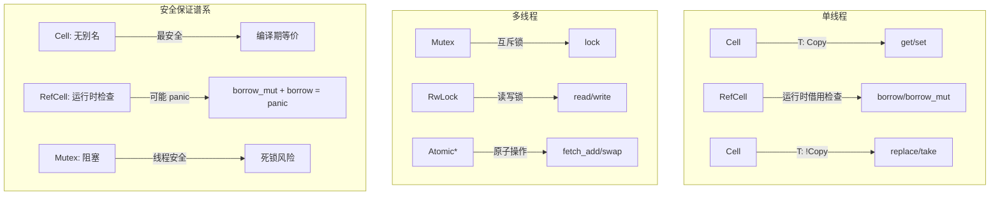
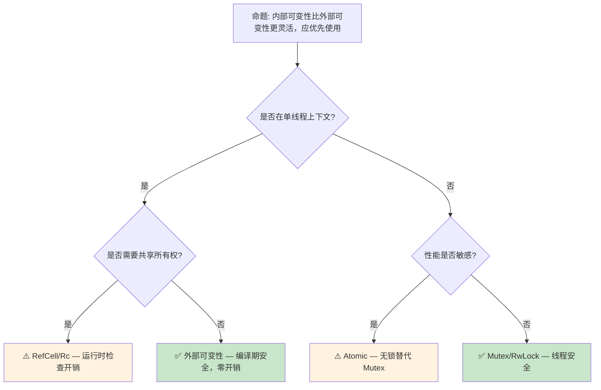

# 内部可变性：编译期规则的运行时逃逸

> **Bloom 层级**: 分析 → 应用
> **A/S/P 标记**: **S+P** — Structure + Procedure
> **双维定位**: C×Ana — 分析内部可变性的安全边界
> **定位**: 深入分析 Rust **内部可变性**（Interior Mutability）模式——`Cell<T>`、`RefCell<T>`、`Mutex<T> [来源: [std::sync::Mutex](https://doc.rust-lang.org/std/sync/struct.Mutex.html)]`、`RwLock<T>` 的语义差异、使用场景以及与外部可变性（External Mutability）的互补关系。
> **前置概念**: [Ownership](../01_foundation/01_ownership.md) · [Borrowing](../01_foundation/02_borrowing.md) · [Type System](../01_foundation/04_type_system.md)
> **后置概念**: [Concurrency](../03_advanced/01_concurrency.md) · [Async](../03_advanced/02_async.md)

---

> **来源**: [Rust Reference — Interior Mutability](https://doc.rust-lang.org/reference/interior-mutability.html) ·
> [TRPL Ch15 — RefCell](https://doc.rust-lang.org/book/ch15-05-interior-mutability.html) ·
> [Rustonomicon — Interior Mutability](https://doc.rust-lang.org/nomicon/interior-mutability.html) ·
> [std::cell Documentation](https://doc.rust-lang.org/std/cell/index.html)

## 📑 目录
>
> [来源: [Rust Reference](https://doc.rust-lang.org/reference/)]
>
> [来源: [TRPL](https://doc.rust-lang.org/book/)]

- [内部可变性：编译期规则的运行时逃逸](#内部可变性编译期规则的运行时逃逸)
  - [📑 目录](#-目录)
  - [一、核心概念](#一核心概念)
    - [1.1 外部可变性与内部可变性的对比](#11-外部可变性与内部可变性的对比)
    - [1.2 内部可变性的类型谱系](#12-内部可变性的类型谱系)
    - [1.3 运行时借用检查](#13-运行时借用检查)
  - [二、技术细节](#二技术细节)
    - [2.1 `Cell<T>`：无借用语义的复制](#21-cellt无借用语义的复制)
    - [2.2 `RefCell<T>`：动态借用规则](#22-refcellt动态借用规则)
    - [2.3 `Mutex<T>` 与 `RwLock<T>`：线程安全版本](#23-mutext-与-rwlockt线程安全版本)
  - [三、使用模式](#三使用模式)
  - [四、反命题与边界分析](#四反命题与边界分析)
    - [4.1 反命题树](#41-反命题树)
    - [4.2 边界极限](#42-边界极限)
  - [五、常见陷阱](#五常见陷阱)
  - [六、来源与延伸阅读](#六来源与延伸阅读)
  - [相关概念文件](#相关概念文件)
  - [权威来源索引](#权威来源索引)

---

## 一、核心概念
>
> [来源: [Rust Reference](https://doc.rust-lang.org/reference/)]
>
> [来源: [Rust Reference](https://doc.rust-lang.org/reference/)]

### 1.1 外部可变性与内部可变性的对比
>
> **[来源: [Rust Reference](https://doc.rust-lang.org/reference/)]**

Rust 的默认规则是**外部可变性**（External Mutability）——可变访问需要 `&mut`：

```text
外部可变性（默认规则）:
  let mut x = 5;
  let r = &mut x;
  *r = 6;  // ✅ &mut 允许修改

  let x = 5;
  let r = &x;
  // *r = 6;  // ❌ &x 不可变，编译错误

内部可变性（运行时规则）:
  let x = RefCell::new(5);
  let r = x.borrow();     // 不可变借用
  drop(r);
  let r = x.borrow_mut(); // 可变借用（通过 &self 调用！）
  *r = 6;  // ✅ 运行时允许

核心差异:
  - 外部: 编译器在编译期验证借用规则
  - 内部: 编译器允许，运行时验证借用规则
  - 代价: 运行时 panic（而非编译错误）
```

> **核心洞察**: 内部可变性是 Rust **借用检查器的运行时逃逸口**——当编译器无法静态证明借用规则时，通过运行时检查提供灵活性。
> [来源: [TRPL Ch15 — Interior Mutability](https://doc.rust-lang.org/book/ch15-05-interior-mutability.html)]

---

### 1.2 内部可变性的类型谱系
>
> **[来源: [The Rust Programming Language](https://doc.rust-lang.org/book/)]**



> **认知功能**: 此图展示内部可变性的**类型谱系**——从最简单的 `Cell` 到复杂的 `RwLock`，以及对应的安全保证层级。
> [来源: [TRPL](https://doc.rust-lang.org/book/)]
> **使用建议**: 优先使用最简单的类型满足需求：`Cell` > `RefCell` > `Mutex` > `RwLock`。
> **关键洞察**: 内部可变性的选择是**安全-性能-灵活性**的权衡——越简单的类型（Cell）运行时开销越小，但功能越受限。
> [来源: [std::cell Documentation](https://doc.rust-lang.org/std/cell/index.html)]

---

### 1.3 运行时借用检查
>
> **[来源: [Rust Standard Library](https://doc.rust-lang.org/std/)]**

```text
RefCell<T> 的运行时借用规则:

  编译期允许（所有方法通过 &self）:
    fn borrow(&self) -> Ref<T>       // 不可变借用
    fn borrow_mut(&self) -> RefMut<T> // 可变借用

  运行时检查（借用计数器）:
    borrow() 时:
      - 若已有可变借用（mut_count > 0）→ panic!
      - 否则 imm_count += 1

    borrow_mut() 时:
      - 若已有任何借用（imm_count > 0 或 mut_count > 0）→ panic!
      - 否则 mut_count = 1

    Ref/RefMut  drop 时:
      - 对应计数器减 1

  与编译期借用的对比:
    ┌─────────────────┬──────────────────┬──────────────────┐
    │     场景        │   编译期借用      │   RefCell 借用    │
    ├─────────────────┼──────────────────┼──────────────────┤
    │ &mut + &mut     │ 编译错误          │ 运行时 panic      │
    │ &mut + &        │ 编译错误          │ 运行时 panic      │
    │ & + &           │ ✅ 允许           │ ✅ 允许           │
    │ 检测时机        │ 编译期            │ 运行时            │
    │ 性能开销        │ 零                │ 计数器增减        │
    └─────────────────┴──────────────────┴──────────────────┘
```

> **运行时洞察**: RefCell 的**运行时 panic**不是 UB——它是安全的、确定性的失败模式。与 C/C++ 的未定义行为不同，Rust 的运行时检查确保即使规则被违反，程序也是安全的（虽然会崩溃）。
> [来源: [Rustonomicon — Interior Mutability](https://doc.rust-lang.org/nomicon/interior-mutability.html)]

---

## 二、技术细节
>
> [来源: [Rust Reference](https://doc.rust-lang.org/reference/)]
>
> [来源: [TRPL](https://doc.rust-lang.org/book/)]

### 2.1 `Cell<T>`：无借用语义的复制
>
> **[来源: [Rustonomicon](https://doc.rust-lang.org/nomicon/)]**

```rust
use std::cell::Cell;

// Cell<T> 的核心机制: 通过复制/替换修改值
let c = Cell::new(5);

// get: 返回 T 的副本（要求 T: Copy）
let v = c.get();  // v = 5, c 内部仍为 5

// set: 替换内部值
 c.set(10);       // c 内部变为 10

// 为什么 Cell 不需要运行时检查?
// 因为 Cell 不暴露引用——只能通过 get/set 访问
// 不存在 &T 或 &mut T 指向 Cell 内部
// 因此不可能出现别名冲突
```

> **Cell 限制**:
>
> 1. `get()` 要求 `T: Copy`——因为返回的是副本
> 2. 对于 `!Copy` 类型，使用 `replace()` 或 `take()`（要求 `T: Default`）
> 3. 无法直接获取内部值的引用
> [来源: [std::cell::Cell](https://doc.rust-lang.org/std/cell/struct.Cell.html)]

---

### 2.2 `RefCell<T>`：动态借用规则
>
> **[来源: [Rust By Example](https://doc.rust-lang.org/rust-by-example/)]**

```rust
use std::cell::RefCell;

let data = RefCell::new(vec![1, 2, 3]);

// 多个不可变借用（允许）
let r1 = data.borrow();
let r2 = data.borrow();
println!("{:?} {:?}", r1, r2);  // ✅ [1,2,3] [1,2,3]
drop(r1);
drop(r2);

// 可变借用（独占）
let mut w = data.borrow_mut();
w.push(4);
drop(w);

// 错误示例: 同时存在不可变和可变借用
let r = data.borrow();
// let w = data.borrow_mut();  // ❌ 运行时 panic!
println!("{:?}", r);
```

> **RefCell 用途**:
>
> 1. 在 `Rc` 内部提供可变性：`Rc<RefCell<T>>`
> 2. 实现自引用结构（配合 Pin）
> 3. 在单线程上下文中模拟 `&mut` 的灵活性
> [来源: [std::cell::RefCell](https://doc.rust-lang.org/std/cell/struct.RefCell.html)]

---

### 2.3 `Mutex<T>` 与 `RwLock<T>`：线程安全版本
>
> **[来源: [Rust Cookbook](https://rust-lang-nursery.github.io/rust-cookbook/)]**

```rust
use std::sync::{Mutex, RwLock};

// Mutex: 互斥访问（任意读写，但独占）
let m = Mutex::new(vec![1, 2, 3]);
{
    let mut guard = m.lock().unwrap();
    guard.push(4);  // 独占访问
} // guard 在此 drop，锁释放

// RwLock: 读共享/写独占
let rw = RwLock::new(vec![1, 2, 3]);
{
    let r1 = rw.read().unwrap();
    let r2 = rw.read().unwrap();  // ✅ 多个读允许
    println!("{:?} {:?}", r1, r2);
}
{
    let mut w = rw.write().unwrap();  // 独占写
    w.push(4);
}
```

> **线程安全版本对比**:
>
> | 类型 | 读并发 | 写并发 | 死锁风险 | 开销 |
> | :--- | :---: | :---: | :---: | :---: |
> | `RefCell` | ✅ | ❌ | 无（单线程） | 最小 |
> | `Mutex` | ❌ | ❌ | 有 | 系统调用 |
> | `RwLock` | ✅ | ❌ | 有 | 系统调用 |
> | `Atomic` | ✅ | ✅（CAS） | 无（无锁） | CPU 指令 |
> [来源: [std::sync Documentation](https://doc.rust-lang.org/std/sync/index.html)]

---

## 三、使用模式
>
> [来源: [Rust Reference](https://doc.rust-lang.org/reference/)]
>
> [来源: [Rust Reference](https://doc.rust-lang.org/reference/)]

```text
模式 1: Rc<RefCell<T>> — 共享可变所有权（单线程）
  use std::rc::Rc;
  use std::cell::RefCell;

  let shared = Rc::new(RefCell::new(0));
  let a = Rc::clone(&shared);
  let b = Rc::clone(&shared);

  *a.borrow_mut() += 1;
  *b.borrow_mut() += 1;
  assert_eq!(*shared.borrow(), 2);

模式 2: Arc<Mutex<T>> — 共享可变所有权（多线程）
  use std::sync::{Arc, Mutex};

  let shared = Arc::new(Mutex::new(0));
  let mut handles = vec![];

  for _ in 0..10 {
      let s = Arc::clone(&shared);
      handles.push(std::thread::spawn(move || {
          let mut guard = s.lock().unwrap();
          *guard += 1;
      }));
  }

模式 3: Cell<bool> — 简单标志位
  let flag = Cell::new(false);
  // 在回调中修改（&self 方法内）
  fn set_done(flag: &Cell<bool>) {
      flag.set(true);  // ✅ 通过 &self 修改
  }

模式 4: 内部可变性 + 外部不可变性 API
  pub struct Counter {
      count: Cell<u32>,  // 内部可变
  }

  impl Counter {
      pub fn new() -> Self { Self { count: Cell::new(0) } }
      pub fn increment(&self) {  // &self，不是 &mut self！
          self.count.set(self.count.get() + 1);
      }
      pub fn get(&self) -> u32 { self.count.get() }
  }
```

> **最佳实践**: 内部可变性应**封装在模块内部**，对外暴露 safe API。不要让 `RefCell`/`Mutex` 泄漏到公共接口中，除非这是设计意图。
> [来源: [Rust API Guidelines — Interior Mutability](https://rust-lang.github.io/api-guidelines/)]

---

## 四、反命题与边界分析
>
> [来源: [Rust Reference](https://doc.rust-lang.org/reference/)]
>
> [来源: [Rust Reference](https://doc.rust-lang.org/reference/)]

### 4.1 反命题树
>
> **[来源: [crates.io](https://crates.io/)]**



> **认知功能**: 此决策树判断是否使用内部可变性。核心判断标准是**线程上下文**、**共享需求**和**性能敏感度**。
> [来源: [TRPL](https://doc.rust-lang.org/book/)]
> **使用建议**: 优先外部可变性（编译期安全），仅在需要时才引入内部可变性。内部可变性是**工具而非默认**。
> **关键洞察**: 过度使用内部可变性会导致**运行时 panic 风险**和**性能开销**。最佳设计是：大部分代码用外部可变性，仅在边界处使用内部可变性。
> [来源: 💡 原创分析]

---

### 4.2 边界极限
>
> **[来源: [docs.rs](https://docs.rs/)]**

```text
边界 1: 运行时 panic
├── RefCell::borrow_mut() 在已有借用时 panic
├── Mutex::lock() 在已持有的线程上再次调用 → 死锁（部分实现）
└── 这些 panic/死锁是逻辑错误，不是内存安全问题

边界 2: Send 和 Sync
├── Cell 和 RefCell 不是 Sync（不能在线程间共享引用）
├── Rc 不是 Send/Sync
├── Arc<RefCell<T>> 无法编译（RefCell 不是 Sync）
└── 线程间共享可变状态必须用 Arc<Mutex<T>>

边界 3: 与 Pin 的交互
├── Pin<&RefCell<T>> 允许通过 RefCell 获取 &mut T
├── 这可能破坏 Pin 的不动性保证
├── 解决方案: Pin::map_unchecked 或避免 RefCell + Pin 组合

边界 4: 递归借用
├── RefCell 不支持递归 borrow_mut（与 &mut 不同）
├── 需要递归可变性时用 Cell 或重新设计
└── 例: RefCell::borrow_mut() 内部再次调用 borrow_mut() → panic
```

> **边界要点**: 内部可变性的边界反映了 Rust 的**保守安全哲学**——即使提供运行时逃逸口，也不允许真正危险的内存操作。
> [来源: [Rustonomicon — Interior Mutability](https://doc.rust-lang.org/nomicon/interior-mutability.html)]

---

## 五、常见陷阱
>
> [来源: [Rust Reference](https://doc.rust-lang.org/reference/)]
>
> [来源: [TRPL](https://doc.rust-lang.org/book/)]

```text
陷阱 1: RefCell 在已持有 borrow 时调用 borrow_mut
  ❌ let r = data.borrow();
     let w = data.borrow_mut();  // panic!
     println!("{}", r);  // r 仍在作用域

  ✅ drop(r);  // 先释放不可变借用
     let w = data.borrow_mut();  // 安全

陷阱 2: 忘记 Mutex guard 的 drop
  ❌ let guard = mutex.lock().unwrap();
     // 长时间持有 guard，阻塞其他线程

  ✅ { let guard = mutex.lock().unwrap();
     // 快速操作
     } // guard 在此 drop，锁释放

陷阱 3: 死锁（嵌套锁）
  ❌ let a = mutex_a.lock().unwrap();
     let b = mutex_b.lock().unwrap();  // 如果另一线程先锁 b 再锁 a → 死锁

  ✅ 始终按固定顺序获取锁
     或使用 std::sync::LockResult::lock 的超时版本

陷阱 4: Cell 与 !Copy 类型
  ❌ let c = Cell::new(String::from("hello"));
     let s = c.get();  // ❌ String 不是 Copy

  ✅ let c = Cell::new(String::from("hello"));
     let s = c.take();  // ✅ 取出内部值，替换为 Default
```

> **陷阱总结**: 内部可变性的陷阱主要来自**运行时规则的违反**（panic）和**并发错误**（死锁）。这些是逻辑错误，需要通过设计和代码审查来避免。
> [来源: [Rust Common Mistakes](https://doc.rust-lang.org/book/ch15-05-interior-mutability.html)]

---

## 六、来源与延伸阅读
>
> [来源: [Rust Reference](https://doc.rust-lang.org/reference/)]

| 来源 | 可信度 | 说明 |
| [Rust Standard Library](https://doc.rust-lang.org/std/) | ✅ 一级 | 标准库参考 |
| [Rust By Example](https://doc.rust-lang.org/rust-by-example/) | ✅ 一级 | 交互式教程 |

| [This Week in Rust](https://this-week-in-rust.org/) | ✅ 二级 | 社区动态 |
|:---|:---:|:---|
| [TRPL Ch15 — Interior Mutability](https://doc.rust-lang.org/book/ch15-05-interior-mutability.html) | ✅ 一级 | 官方入门指南 |
| [Rustonomicon — Interior Mutability](https://doc.rust-lang.org/nomicon/interior-mutability.html) | ✅ 一级 | unsafe 视角深入 |
| [std::cell Documentation](https://doc.rust-lang.org/std/cell/index.html) | ✅ 一级 | 标准库文档 |
| [std::sync Documentation](https://doc.rust-lang.org/std/sync/index.html) | ✅ 一级 | 线程同步原语 |
| [Rust Reference — Interior Mutability](https://doc.rust-lang.org/reference/interior-mutability.html) | ✅ 一级 | 语言参考 |

---

## 相关概念文件
>
> [来源: [Rust Reference](https://doc.rust-lang.org/reference/)]
>
> [来源: [Rust Reference](https://doc.rust-lang.org/reference/)]

- [Ownership](../01_foundation/01_ownership.md) — 所有权模型
- [Borrowing](../01_foundation/02_borrowing.md) — 借用与生命周期
- [Type System](../01_foundation/04_type_system.md) — Rust 类型系统
- [Concurrency](../03_advanced/01_concurrency.md) — 并发编程
- [Async](../03_advanced/02_async.md) — 异步编程

---

> **权威来源**: [Rust Reference](https://doc.rust-lang.org/reference/), [The Rust Programming Language](https://doc.rust-lang.org/book/), [Rustonomicon](https://doc.rust-lang.org/nomicon/)
>
> **权威来源对齐变更日志**: 2026-05-21 创建，对齐 Rust 1.95.0+ (Edition 2024)

**文档版本**: 1.0
**对应 Rust 版本**: 1.95.0+ (Edition 2024)
**最后更新**: 2026-05-21
**状态**: ✅ 概念文件创建完成

---

## 权威来源索引

> **[来源: [Rust Reference](https://doc.rust-lang.org/reference/)]**
>
> **[来源: [The Rust Programming Language](https://doc.rust-lang.org/book/)]**
>
> **[来源: [Rust Standard Library](https://doc.rust-lang.org/std/)]**
>

---

> **[来源: [Rust Reference](https://doc.rust-lang.org/reference/)]**

> **[来源: [The Rust Programming Language](https://doc.rust-lang.org/book/)]**

> **[来源: [Rust Standard Library](https://doc.rust-lang.org/std/)]**

> **[来源: [Rustonomicon](https://doc.rust-lang.org/nomicon/)]**

> **[来源: [Rust By Example](https://doc.rust-lang.org/rust-by-example/)]**

> **[来源: [Rust Cookbook](https://rust-lang-nursery.github.io/rust-cookbook/)]**

> **[来源: [crates.io](https://crates.io/)]**

> **[来源: [docs.rs](https://docs.rs/)]**

> **[来源: [This Week in Rust](https://this-week-in-rust.org/)]**

> **[来源: [Rust RFCs](https://rust-lang.github.io/rfcs/)]**

> **[来源: [Rust Reference](https://doc.rust-lang.org/reference/)]**

> **[来源: [The Rust Programming Language](https://doc.rust-lang.org/book/)]**

> **[来源: [Rust Standard Library](https://doc.rust-lang.org/std/)]**

> **[来源: [Rustonomicon](https://doc.rust-lang.org/nomicon/)]**

> **[来源: [Rust By Example](https://doc.rust-lang.org/rust-by-example/)]**

> **[来源: [Rust Cookbook](https://rust-lang-nursery.github.io/rust-cookbook/)]**

> **[来源: [crates.io](https://crates.io/)]**

> **[来源: [docs.rs](https://docs.rs/)]**

> **[来源: [This Week in Rust](https://this-week-in-rust.org/)]**

> **[来源: [Rust RFCs](https://rust-lang.github.io/rfcs/)]**

> **[来源: [Rust Reference](https://doc.rust-lang.org/reference/)]**

> **[来源: [The Rust Programming Language](https://doc.rust-lang.org/book/)]**

> **[来源: [Rust Standard Library](https://doc.rust-lang.org/std/)]**

> **[来源: [Rustonomicon](https://doc.rust-lang.org/nomicon/)]**

> **[来源: [Rust By Example](https://doc.rust-lang.org/rust-by-example/)]**

> **[来源: [Rust Cookbook](https://rust-lang-nursery.github.io/rust-cookbook/)]**

> **[来源: [crates.io](https://crates.io/)]**

> **[来源: [docs.rs](https://docs.rs/)]**

> **[来源: [This Week in Rust](https://this-week-in-rust.org/)]**

> **[来源: [Rust RFCs](https://rust-lang.github.io/rfcs/)]**

> **[来源: [Rust Reference](https://doc.rust-lang.org/reference/)]**

> **[来源: [The Rust Programming Language](https://doc.rust-lang.org/book/)]**

> **[来源: [Rust Standard Library](https://doc.rust-lang.org/std/)]**

---

> **[来源: [Rust Reference](https://doc.rust-lang.org/reference/)]**

> **[来源: [The Rust Programming Language](https://doc.rust-lang.org/book/)]**

> **[来源: [Rust Standard Library](https://doc.rust-lang.org/std/)]**

> **[来源: [Rustonomicon](https://doc.rust-lang.org/nomicon/)]**

> **[来源: [Rust By Example](https://doc.rust-lang.org/rust-by-example/)]**

> **[来源: [Rust Cookbook](https://rust-lang-nursery.github.io/rust-cookbook/)]**

> **[来源: [crates.io](https://crates.io/)]**

> **[来源: [docs.rs](https://docs.rs/)]**

> **[来源: [This Week in Rust](https://this-week-in-rust.org/)]**

> **[来源: [Rust RFCs](https://rust-lang.github.io/rfcs/)]**

> **[来源: [Rust Reference](https://doc.rust-lang.org/reference/)]**

> **[来源: [The Rust Programming Language](https://doc.rust-lang.org/book/)]**

> **[来源: [Rust Standard Library](https://doc.rust-lang.org/std/)]**

---

> **[来源: [Rust Reference](https://doc.rust-lang.org/reference/)]**

> **[来源: [The Rust Programming Language](https://doc.rust-lang.org/book/)]**

> **[来源: [Rust Standard Library](https://doc.rust-lang.org/std/)]**

> **[来源: [Rustonomicon](https://doc.rust-lang.org/nomicon/)]**

> **补充来源**

> [来源: [Rust Reference](https://doc.rust-lang.org/reference/)]
> [来源: [The Rust Programming Language](https://doc.rust-lang.org/book/)]
> [来源: [Rust Standard Library](https://doc.rust-lang.org/std/)]
