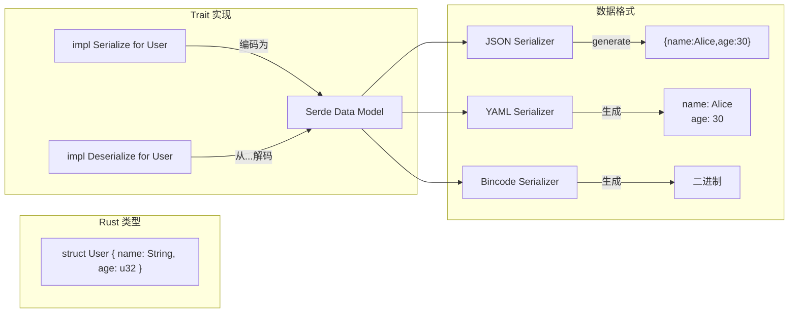
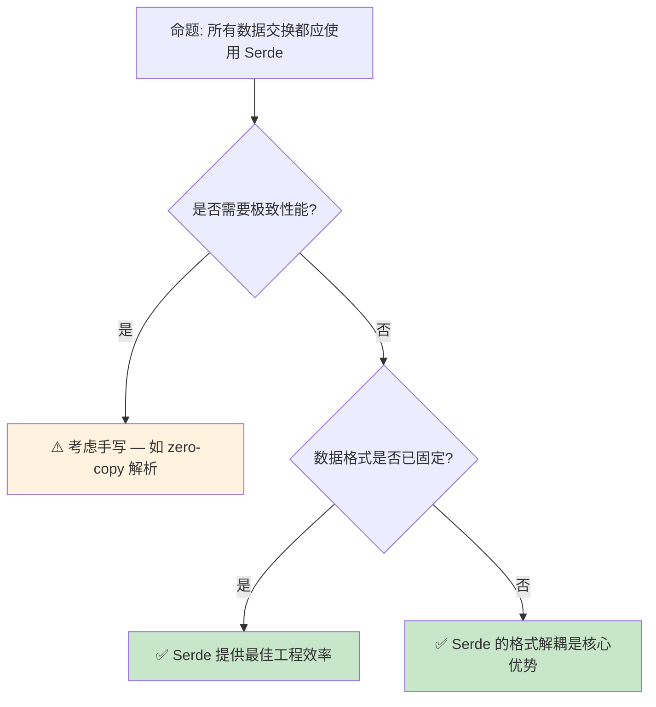

> **内容分级**: [综述级]

> **本节关键术语**: 序列化 (Serialization) · 反序列化 (Deserialization) · serde · Serialize · Deserialize · 自定义反序列化 — [完整对照表](../00_meta/terminology_glossary.md)
>
# Serde 序列化模式：Rust 的类型驱动数据转换
>
> **EN**: Serde Patterns
> **Summary**: Serde Patterns: intermediate Rust mechanisms, patterns, and practical examples.
> **受众**: [进阶]
> **Bloom 层级**: 应用 → 分析
> **A/S/P 标记**: **A+S** — Application + Structure
> **双维定位**: C×App — 应用 Serde 序列化设计模式
> **定位**: 深入分析 **Serde** —— Rust 生态中主导的序列化/反序列化框架，探讨 `Serialize [来源: [serde::Serialize](https://docs.rs/serde/latest/serde/trait.Serialize.html)]`/`Deserialize` derive 宏（Macro）、自定义序列化逻辑、以及类型系统如何保障数据转换的安全性。
> **前置概念**: [Traits](./01_traits.md) · [Macros](../03_advanced/04_macros.md) · [Generics](./02_generics.md)
> **后置概念**: [Core Crates](../06_ecosystem/03_core_crates.md) · [Application Domains](../06_ecosystem/04_application_domains.md)

---

> **来源**: [Serde Documentation](https://serde.rs/) ·
> [Serde Book](https://serde.rs/impl-serialize.html) ·
> [Rust Reference — Derive](https://doc.rust-lang.org/reference/procedural-macros.html#derive-macros) ·
> [RFC 1681 — Macros 1.1](https://github.com/rust-lang/rfcs/pull/1681)

## 📑 目录

- [Serde 序列化模式：Rust 的类型驱动数据转换](#serde-序列化模式rust-的类型驱动数据转换)
  - [📑 目录](#-目录)
  - [一、核心概念](#一核心概念)
    - [1.1 Serde 的设计哲学](#11-serde-的设计哲学)
    - [1.2 Serialize 与 Deserialize Trait](#12-serialize-与-deserialize-trait)
    - [1.3 数据格式解耦](#13-数据格式解耦)
  - [二、技术细节](#二技术细节)
    - [2.1 Derive 宏的展开逻辑](#21-derive-宏的展开逻辑)
    - [2.2 自定义序列化行为](#22-自定义序列化行为)
    - [2.3 Visitor 模式与反序列化](#23-visitor-模式与反序列化)
  - [三、使用模式](#三使用模式)
  - [四、反命题与边界分析](#四反命题与边界分析)
    - [4.1 反命题树](#41-反命题树)
    - [4.2 边界极限](#42-边界极限)
  - [五、常见陷阱](#五常见陷阱)
  - [六、来源与延伸阅读](#六来源与延伸阅读)
  - [相关概念文件](#相关概念文件)
  - [逆向推理链（Backward Reasoning）](#逆向推理链backward-reasoning)
  - [权威来源索引](#权威来源索引)
  - [十、边界测试：Serde 模式的编译错误](#十边界测试serde-模式的编译错误)
    - [10.1 边界测试：反序列化时字段缺失（运行时错误）](#101-边界测试反序列化时字段缺失运行时错误)
    - [10.2 边界测试：`#[serde(flatten)]` 与重复字段（编译错误 / 运行时错误）](#102-边界测试serdeflatten-与重复字段编译错误--运行时错误)
    - [10.3 边界测试：反序列化的 `deny_unknown_fields`（运行时错误）](#103-边界测试反序列化的-deny_unknown_fields运行时错误)
    - [10.4 边界测试：枚举的 `untagged` 反序列化歧义（运行时错误）](#104-边界测试枚举的-untagged-反序列化歧义运行时错误)
    - [10.5 边界测试：`serde` 的 `skip_serializing_if` 与 `Option` 的交互（逻辑错误）](#105-边界测试serde-的-skip_serializing_if-与-option-的交互逻辑错误)
    - [10.3 边界测试：serde 的私有字段与反序列化失败（运行时错误）](#103-边界测试serde-的私有字段与反序列化失败运行时错误)
    - [10.4 边界测试：`serde` 的枚举标签与外部标签冲突（运行时反序列化失败）](#104-边界测试serde-的枚举标签与外部标签冲突运行时反序列化失败)
  - [嵌入式测验（Embedded Quiz）](#嵌入式测验embedded-quiz)
    - [测验 1：如何让 Serde 在序列化时将 Rust 字段名 `user_name` 映射为 JSON 中的 `userName`？（理解层）](#测验-1如何让-serde-在序列化时将-rust-字段名-user_name-映射为-json-中的-username理解层)
    - [测验 2：枚举的 `#[serde(tag = "type")]` 属性会产生怎样的 JSON 结构？（理解层）](#测验-2枚举的-serdetag--type-属性会产生怎样的-json-结构理解层)
    - [测验 3：`#[serde(untagged)]` 的序列化/反序列化行为有什么风险和适用场景？（理解层）](#测验-3serdeuntagged-的序列化反序列化行为有什么风险和适用场景理解层)
    - [测验 4：如果希望字段在 JSON 中缺失时使用默认值，应该如何配置？（理解层）](#测验-4如果希望字段在-json-中缺失时使用默认值应该如何配置理解层)
    - [测验 5：`serde_json::to_string` 和 `serde_json::to_string_pretty` 输出有什么区别？（理解层）](#测验-5serde_jsonto_string-和-serde_jsonto_string_pretty-输出有什么区别理解层)
  - [实践](#实践)
  - [认知路径](#认知路径)
    - [核心推理链](#核心推理链)
    - [反命题与边界](#反命题与边界)

---

## 一、核心概念
>
>

### 1.1 Serde 的设计哲学
>

Serde 是 Rust 生态中**数据序列化**的事实标准框架，其核心设计是**类型驱动的数据转换**：

```text
Serde 的核心抽象:

  数据模型（Serde Data Model）:
  ├── 基本类型: bool, i8-i128, u8-u128, f32, f64, char, string, bytes
  ├── 复合类型: option, unit, newtype struct, seq, map
  ├── 枚举变体: unit, newtype, tuple, struct
  └── 结构体: 命名字段的映射

  分离关注点:
  ├── serde crate: 定义 Trait 和数据模型
  ├── serde_derive: 提供 #[derive(Serialize, Deserialize)]
  └── 格式 crate: 实现 Serializer/Deserializer（json, yaml, toml, bincode...）

  零成本抽象:
  ├── derive 宏在编译期展开
  ├── 序列化代码与手写等效
  └── 无运行时反射开销
```

> **设计洞察**: Serde 的**数据模型**是通用抽象层——任何 Rust 类型都可以映射到 Serde 数据模型，任何数据格式都可以从 Serde 数据模型读写。这种解耦使新格式支持只需实现 Serializer/Deserializer。
> [来源: [Serde Documentation](https://serde.rs/data-model.html)]

---

### 1.2 Serialize 与 Deserialize Trait
>



> **认知功能**: 此图展示 Serde 的**三层架构**——Rust 类型 ↔ Serde 数据模型 ↔ 具体格式。
> [来源: [Serde Docs]]
> **使用建议**: 绝大多数场景使用 `#[derive(Serialize, Deserialize)]`；仅在需要自定义行为时手动实现 Trait。
> **关键洞察**: `Serialize`/`Deserialize` 是**编译期**的契约——一旦类型实现了这些 Trait，任何支持 Serde 的格式都可以与之交互。
> [来源: [Serde Book](https://serde.rs/impl-serialize.html)]

---

### 1.3 数据格式解耦
>

```text
Serde 支持的格式生态:

  文本格式:
  ├── serde_json: JSON（最常用）
  ├── serde_yaml: YAML
  ├── toml: TOML（Cargo 配置格式）
  ├── quick-xml: XML
  └── serde_urlencoded: URL 编码

  二进制格式:
  ├── bincode: 紧凑二进制
  ├── postcard: 无栈嵌入式友好
  ├── serde_cbor: CBOR（RFC 7049）
  ├── rmp-serde: MessagePack
  └── capnp: Cap'n Proto

  数据库/网络:
  ├── diesel: SQL ORM（使用 serde 兼容类型）
  ├── redis: Redis 序列化
  └── grpc: Protocol Buffers

  统一接口:
  ├── 所有格式共享相同的 Serialize/Deserialize Trait
  └── 切换格式只需更改 Serializer/Deserializer
```

> **格式解耦价值**: 业务逻辑与数据格式**完全解耦**——今天用 JSON，明天切换为二进制，只需改一行代码（`serde_json::to_string` → `bincode::serialize`）。
> [来源: [Serde Ecosystem](https://serde.rs/#data-formats)]

---

## 二、技术细节

### 2.1 Derive 宏的展开逻辑
>

```rust,ignore
use serde::{Serialize, Deserialize};

#[derive(Serialize, Deserialize)]
struct User {
    name: String,
    age: u32,
}

// serde_derive 展开为类似:
impl Serialize for User {
    fn serialize<S>(&self, serializer: S) -> Result<S::Ok, S::Error>
    where
        S: Serializer,
    {
        let mut state = serializer.serialize_struct("User", 2)?;
        state.serialize_field("name", &self.name)?;
        state.serialize_field("age", &self.age)?;
        state.end()
    }
}

impl Deserialize for User {
    fn deserialize<D>(deserializer: D) -> Result<Self, D::Error>
    where
        D: Deserializer,
    {
        struct UserVisitor;

        impl<'de> Visitor<'de> for UserVisitor {
            type Value = User;

            fn expecting(&self, formatter: &mut fmt::Formatter) -> fmt::Result {
                formatter.write_str("struct User")
            }

            fn visit_map<V>(self, mut map: V) -> Result<User, V::Error>
            where
                V: MapAccess<'de>,
            {
                let mut name = None;
                let mut age = None;
                while let Some(key) = map.next_key::<String>()? {
                    match key.as_str() {
                        "name" => name = Some(map.next_value()?),
                        "age" => age = Some(map.next_value()?),
                        _ => { let _: IgnoredAny = map.next_value()?; }
                    }
                }
                let name = name.ok_or_else(|| de::Error::missing_field("name"))?;
                let age = age.ok_or_else(|| de::Error::missing_field("age"))?;
                Ok(User { name, age })
            }
        }

        deserializer.deserialize_struct("User", &["name", "age"], UserVisitor)
    }
}
```

> **展开要点**: Derive 宏生成的是**手写的 Trait 实现的机械版本**。编译器内联后，序列化代码与手写实现等效——零运行时开销。
> [来源: [Serde Book — Derive](https://serde.rs/derive.html)]

---

### 2.2 自定义序列化行为
>

```rust,ignore
use serde::{Serialize, Deserialize, Serializer, Deserializer};
use serde::de::{self, Visitor};
use std::fmt;

#[derive(Debug)]
struct PhoneNumber(String);

impl Serialize for PhoneNumber {
    fn serialize<S>(&self, serializer: S) -> Result<S::Ok, S::Error>
    where
        S: Serializer,
    {
        // 序列化为字符串: "+1-555-0123"
        serializer.serialize_str(&self.0)
    }
}

impl<'de> Deserialize<'de> for PhoneNumber {
    fn deserialize<D>(deserializer: D) -> Result<Self, D::Error>
    where
        D: Deserializer<'de>,
    {
        struct PhoneVisitor;

        impl<'de> Visitor<'de> for PhoneVisitor {
            type Value = PhoneNumber;

            fn expecting(&self, formatter: &mut fmt::Formatter) -> fmt::Result {
                formatter.write_str("a phone number string like '+1-555-0123'")
            }

            fn visit_str<E>(self, value: &str) -> Result<PhoneNumber, E>
            where
                E: de::Error,
            {
                // 验证格式
                if value.starts_with('+') && value.contains('-') {
                    Ok(PhoneNumber(value.to_string()))
                } else {
                    Err(de::Error::invalid_value(
                        de::Unexpected::Str(value),
                        &"phone number format",
                    ))
                }
            }
        }

        deserializer.deserialize_str(PhoneVisitor)
    }
}
```

> **自定义场景**: 当需要**验证**（反序列化时检查格式）、**转换**（如将枚举序列化为字符串）或**隐藏**（不序列化某些字段）时使用自定义实现。
> [来源: [Serde Book — Custom Serialization](https://serde.rs/custom-serialization.html)]

---

### 2.3 Visitor 模式与反序列化
>

```text
Visitor 模式的核心作用:

  反序列化的挑战:
  ├── 不知道输入数据的类型（JSON 无类型）
  ├── 需要处理多种可能的输入格式
  └── 需要优雅的错误报告

  Visitor 解决方案:
  ├── Deserializer 读取输入数据
  ├── 根据数据类型调用 Visitor 的对应方法
  │   ├── visit_bool, visit_i64, visit_str（标量）
  │   ├── visit_seq（数组）
  │   ├── visit_map（对象）
  │   └── visit_enum（枚举）
  └── Visitor 将数据构建为目标类型

  错误处理:
  ├── Visitor::expecting 提供人类可读的错误消息
  ├── 类型不匹配时自动报告
  └── 缺失字段自动检测
```

> **Visitor 洞察**: Visitor 模式将**数据解析**（Deserializer 负责）与**对象构建**（Visitor 负责）分离，使两者可以独立演化和组合。
> [source: [Serde Book — Visitor](https://serde.rs/impl-deserializer.html)]

---

## 三、使用模式

```text
模式 1: 基本 derive
  #[derive(Serialize, Deserialize)]
  struct Config {
      port: u16,
      host: String,
  }

  let config: Config = serde_json::from_str(json)?;
  let json = serde_json::to_string(&config)?;

模式 2: 字段属性自定义
  #[derive(Serialize, Deserialize)]
  struct User {
      #[serde(rename = "userName")]  // JSON 字段名不同
      username: String,

      #[serde(default)]  // 缺失时使用 Default
      age: u32,

      #[serde(skip_serializing_if = "Option::is_none")]
      email: Option<String>,

      #[serde(flatten)]  // 将嵌套结构平铺
      extra: HashMap<String, serde_json::Value>,
  }

模式 3: 枚举的多种表示
  #[derive(Serialize, Deserialize)]
  #[serde(tag = "type", content = "data")]  // 外标签 + 内容
  enum Message {
      Text(String),
      Number(u64),
  }
  // JSON: {"type": "Text", "data": "hello"}

  #[derive(Serialize, Deserialize)]
  #[serde(untagged)]  // 无标签，根据内容推断
  enum Value {
      String(String),
      Number(f64),
  }

模式 4: 泛型支持
  #[derive(Serialize, Deserialize)]
  struct Response<T> {
      status: u16,
      data: T,
  }

  let resp: Response<User> = serde_json::from_str(json)?;
```

> **最佳实践**: 优先使用 derive + 属性满足需求；只在复杂验证/转换场景手写 Trait 实现。
> [来源: [Serde Attributes](https://serde.rs/attributes.html)]

---

## 四、反命题与边界分析

### 4.1 反命题树
>



> **认知功能**: 此决策树评估是否使用 Serde。核心判断标准是**性能需求**和**格式灵活性需求**。
> **使用建议**: 绝大多数场景使用 Serde；仅在极致性能（如网络协议栈、零拷贝解析器）或特殊二进制格式时考虑手写。
> **关键洞察**: Serde 的**真正价值**不是序列化本身，而是**类型系统与数据格式的桥梁**——编译期保证类型安全，运行时处理任意格式。
> [来源: 💡 原创分析]

---

### 4.2 边界极限
>

```text
边界 1: 编译时间
├── derive 宏增加编译时间（生成大量代码）
├── 大型项目可能有数百个 derive
├── 解决方案: 增量编译、 Cranelift 后端（Debug）
└── 这是零运行时成本的编译期代价

边界 2: 递归类型
├── 自引用结构体的序列化需要特殊处理
├── 循环引用（图结构）默认不支持
├── 解决方案: 手动实现、使用索引、或 Rc/Arc + 自定义逻辑

边界 3: 动态类型
├── Serde 面向静态类型系统
├── 动态类型场景（如 JSON schema 未知）需要 serde_json::Value
├── 类型安全与灵活性在此处有张力

边界 4: no_std 支持
├── serde 支持 no_std（使用 alloc）
├── 但许多格式 crate 需要 std
├── 嵌入式场景需选择支持 no_std 的格式（如 postcard）
```

> **边界要点**: Serde 的边界主要与**编译时间**和**动态类型**相关——它是静态类型系统的最佳搭档，但在高度动态的场景中灵活性受限。
> [source: [Serde Limitations](https://serde.rs/)]

---

## 五、常见陷阱

```text
陷阱 1: 枚举表示不匹配
  ❌ #[derive(Deserialize)]
     enum Status { Active, Inactive }
     // 默认: {"Active": null}（外标签）
     // 输入: "Active"（字符串）→ 反序列化失败

  ✅ #[derive(Deserialize)]
     #[serde(rename_all = "lowercase")]
     enum Status { Active, Inactive }
     // 或使用 #[serde(untagged)] 根据上下文

陷阱 2: 缺失字段与 Default
  ❌ #[derive(Deserialize)]
     struct Config { timeout: u64 }
     // 输入 {} → 错误: missing field `timeout`

  ✅ #[derive(Deserialize)]
     struct Config {
         #[serde(default = "default_timeout")]
         timeout: u64,
     }
     fn default_timeout() -> u64 { 30 }

陷阱 3: 浮点精度
  ❌ let v: f64 = serde_json::from_str("0.1").unwrap();
     // JSON 的 0.1 在二进制浮点中不精确
     // 反序列化后 v != 0.1（严格相等）

  ✅ 避免严格相等比较浮点
     或使用自定义 Decimal 类型

陷阱 4: 大文件的内存问题
  ❌ let data: Vec<Item> = serde_json::from_str(&huge_json)?;
     // 整个文件加载到内存

  ✅ 使用流式解析（serde_json::StreamDeserializer）
     或分块读取
```

> **陷阱总结**: Serde 的错误大多源于**数据模型不匹配**（JSON 结构与 Rust 结构不对应）或**性能假设**（大文件、高频序列化）。
> [来源: [Serde Common Issues](https://serde.rs/help.html)]

---

## 六、来源与延伸阅读
>

| 来源 | 可信度 | 说明 |
| [Rust Standard Library](https://doc.rust-lang.org/std/) | ✅ 一级 | 标准库参考 |
| [Rust By Example](https://doc.rust-lang.org/rust-by-example/) | ✅ 一级 | 交互式教程 |

| [This Week in Rust](https://this-week-in-rust.org/) | ✅ 二级 | 社区动态 |
|:---|:---:|:---|
| [Serde Documentation](https://serde.rs/) | ✅ 一级 | 官方网站 |
| [Serde Book](https://serde.rs/impl-serialize.html) | ✅ 一级 | 实现指南 |
| [serde_json Documentation](https://docs.rs/serde_json/latest/serde_json/) | ✅ 一级 | JSON 格式支持 |
| [RFC 1681 — Macros 1.1](https://github.com/rust-lang/rfcs/pull/1681) | ✅ 一级 | derive 宏设计 |
| [Rust Reference — Derive](https://doc.rust-lang.org/reference/procedural-macros.html#derive-macros) | ✅ 一级 | 语言参考 |

---

## 相关概念文件

- [Traits](./01_traits.md) — Trait 系统与 derive
- [Macros](../03_advanced/04_macros.md) — 过程宏机制
- [Generics](./02_generics.md) — 泛型与参数多态
- [Core Crates](../06_ecosystem/03_core_crates.md) — 核心 crate 生态
- [Application Domains](../06_ecosystem/04_application_domains.md) — 应用领域分析

---

> **权威来源**: [Rust Reference](https://doc.rust-lang.org/reference/), [The Rust Programming Language](https://doc.rust-lang.org/book/title-page.html), [Rustonomicon](https://doc.rust-lang.org/nomicon/)
>
> **权威来源对齐变更日志**: 2026-05-21 创建，对齐 Rust 1.96.0+ (Edition 2024)

**文档版本**: 1.0
**对应 Rust 版本**: 1.96.0+ (Edition 2024)
**最后更新**: 2026-05-21
**状态**: ✅ 概念文件创建完成

---

## 逆向推理链（Backward Reasoning）

> **从编译错误反推**：
>
> ```text
> 序列化正确 ⟸ Trait 实现完备
> ```
>
## 权威来源索引

>
>
>
>
>

---

---

---

> **补充来源**

## 十、边界测试：Serde 模式的编译错误

### 10.1 边界测试：反序列化时字段缺失（运行时错误）

```rust
use serde::Deserialize;

#[derive(Deserialize, Debug)]
struct User {
    name: String,
    age: u32,
}

fn main() {
    let json = r#"{"name": "Alice"}"#; // 缺少 age 字段
    // ⚠️ 运行时错误: missing field `age`
    // let user: User = serde_json::from_str(json).unwrap(); // panic!

    // 正确: 使用 Option 或默认值
    let result = serde_json::from_str::<User>(json);
    match result {
        Ok(u) => println!("{:?}", u),
        Err(e) => println!("deserialize error: {}", e), // ✅ 安全处理
    }
}
```

> **修正**:
> Serde 的 `Deserialize` derive 默认要求所有字段存在。
> 缺失字段会导致反序列化错误（`Err`）。
> 使用 `Option<T>` 或 `#[serde(default)]` 可使字段可选。
> Serde 的编译期生成代码在运行期检查字段存在性——这与 Protobuf 的 schema 演化（向后兼容字段标记）不同，Rust/Serde 的反序列化严格遵循结构体定义，不自动填充默认值。
> [来源: [Serde Documentation](https://serde.rs/)]

### 10.2 边界测试：`#[serde(flatten)]` 与重复字段（编译错误 / 运行时错误）

```rust,compile_fail
use serde::Deserialize;

#[derive(Deserialize, Debug)]
struct Outer {
    id: u32,
    #[serde(flatten)]
    inner: Inner,
}

#[derive(Deserialize, Debug)]
struct Inner {
    id: String, // ❌ 与 Outer.id 同名但不同类型
}

fn main() {
    let json = r#"{"id": 42}"#;
    // 运行时错误: Serde 无法确定 id 属于 Outer 还是 Inner
    // let outer: Outer = serde_json::from_str(json).unwrap();
}

// 正确: 避免字段名冲突
#[derive(Deserialize, Debug)]
struct OuterFixed {
    outer_id: u32,
    #[serde(flatten)]
    inner: InnerFixed,
}

#[derive(Deserialize, Debug)]
struct InnerFixed {
    inner_id: String, // ✅ 无冲突
}
```

> **修正**:
> `#[serde(flatten)]` 将嵌套结构体的字段展开到父结构体级别。
> 若嵌套结构体与父结构体有同名字段，Serde 的反序列化逻辑会产生歧义——它尝试按顺序匹配字段，可能导致类型不匹配或数据错位。
> 这是 Serde 的一个已知限制：flatten 不支持字段重名，且对枚举类型的 flatten 支持有限（需 `#[serde(untagged)]` 配合）。
> [来源: [Serde Documentation](https://serde.rs/)]

### 10.3 边界测试：反序列化的 `deny_unknown_fields`（运行时错误）

```rust,compile_fail
use serde::Deserialize;

#[derive(Deserialize)]
#[serde(deny_unknown_fields)]
struct Config {
    host: String,
    port: u16,
}

fn main() {
    let json = r#"{"host":"localhost","port":8080,"extra":"value"}"#;
    // ❌ 运行时错误: `deny_unknown_fields` 拒绝未知字段
    let cfg: Config = serde_json::from_str(json).unwrap();
    println!("{}:{}", cfg.host, cfg.port);
}
```

> **修正**:
> `#[serde(deny_unknown_fields)]` 在反序列化时检查输入中是否包含 struct 未定义的字段。
> 若存在未知字段，返回 `Err`（`unknown field \`extra\`, expected \`host\` or \`port\``）。
> 这是 API 版本兼容性设计的工具：strict 模式（拒绝未知）防止客户端发送未来版本的字段导致误解；
> lenient 模式（默认，忽略未知）允许向前兼容。Rust 的 serde 生态通过属性宏控制这些行为，编译期生成对应的反序列化代码。
> 这与 Go 的`json.Unmarshal`（默认忽略未知字段，`DisallowUnknownFields` 选项开启严格模式）或 Python 的 `dataclasses`（无内置未知字段检查）类似，
> 但 Rust 的配置在编译期固定，无运行时开销。
> [来源: [Serde Documentation](https://serde.rs/container-attrs.html)] ·
> [来源: [The Rust Programming Language](https://doc.rust-lang.org/book/title-page.html)]

### 10.4 边界测试：枚举的 `untagged` 反序列化歧义（运行时错误）

```rust,compile_fail
use serde::Deserialize;

#[derive(Deserialize)]
#[serde(untagged)]
enum Message {
    Text(String),
    Number(i32),
}

fn main() {
    // ❌ 运行时歧义: "42" 可匹配 Text 或 Number?
    // untagged 按声明顺序尝试，先匹配 Text
    let msg: Message = serde_json::from_str("\"42\"").unwrap();
    // msg 实际是 Message::Text("42")，不是 Number(42)
}
```

> **修正**:
> `#[serde(untagged)]` 使枚举在序列化时不包含变体标签（如 `{"Text":"hello"}` → `"hello"`），反序列化时按声明顺序尝试每个变体，第一个成功的被选中。
> 这引入**顺序敏感性**：`Text(String)` 在 `Number(i32)` 之前，因此 `"42"` 被解析为 `Text` 而非 `Number`。
> 若顺序颠倒，结果相反。这是 untagged 枚举的设计限制——无标签时无法从值本身推断变体类型。
> 安全模式：
>
> 1) 使用 tagged 枚举（Enum）（默认，明确标签）；
> 2) 严格排序变体（最具体的在前）；
> 3) 使用 `#[serde(try_from = "...")]` 自定义解析逻辑。
> 这与 JSON Schema 的 `oneOf`（类似问题，按顺序验证）或 Protocol Buffers（有明确类型标签，无此问题）类似。
> [来源: [Serde Documentation](https://serde.rs/enum-representations.html)] ·
> [来源: [JSON Schema Validation](https://json-schema.org/)]

### 10.5 边界测试：`serde` 的 `skip_serializing_if` 与 `Option` 的交互（逻辑错误）

```rust,compile_fail
use serde::{Serialize, Deserialize};

#[derive(Serialize, Deserialize)]
struct Config {
    #[serde(skip_serializing_if = "Option::is_none")]
    timeout: Option<u32>,
}

fn main() {
    let cfg = Config { timeout: None };
    let json = serde_json::to_string(&cfg).unwrap();
    // json: "{}" — timeout 字段被跳过

    let restored: Config = serde_json::from_str(&json).unwrap();
    // ⚠️ 逻辑错误: 若业务逻辑区分 "未设置" 和 "显式设置为 None"
    // skip_serializing_if 使两者无法区分
    assert!(restored.timeout.is_none());
}
```

> **修正**:
> `skip_serializing_if` 在条件满足时省略字段，反序列化时缺失字段使用默认值（`Option::None`）。
> 这导致**信息丢失**：无法区分"显式设置 None"和"未提供该字段"。
> 解决方案：
>
> 1) 使用 tri-state 枚举：`enum MaybeTimeout { NotSet, Infinite, Seconds(u32) }`；
> 2) 不使用 `skip_serializing_if`，始终序列化 `null`；
> 3) 使用 `#[serde(default)]` + 自定义默认值。
> 这与 GraphQL 的 nullable vs optional（同样区分）或 Protocol Buffers 的 `has_field()`（可区分未设置和默认值）类似——序列化格式的表达能力影响 API 设计。
> Rust 的类型系统可帮助建模这些状态（`Option<Option<T>>` 或自定义 enum）。
> [来源: [Serde Documentation](https://serde.rs/field-attrs.html)] ·
> [来源: [The Rust Programming Language](https://doc.rust-lang.org/book/title-page.html)]

### 10.3 边界测试：serde 的私有字段与反序列化失败（运行时错误）

```rust,compile_fail
use serde::{Deserialize, Serialize};

#[derive(Serialize, Deserialize)]
struct Config {
    pub name: String,
    api_key: String, // 私有字段
}

fn main() {
    let json = r#"{"name": "app", "api_key": "secret123"}"#;
    // ❌ 运行时反序列化失败: serde 默认需要所有字段（包括私有）
    // 若 JSON 缺少 api_key 或字段名不匹配
    let config: Config = serde_json::from_str(json).unwrap();
    println!("{}", config.name);
}
```

> **修正**: serde 的**字段可见性**不影响反序列化：私有字段同样需要匹配。
> 控制反序列化行为：
>
> 1) `#[serde(default)]` — 字段缺失时使用 `Default::default()`；
> 2) `#[serde(skip)]` — 完全跳过字段（不序列化也不反序列化）；
> 3) `#[serde(rename = "apiKey")]` — 字段名映射；
> 4) `#[serde(flatten)]` — 嵌套结构扁平化。
> serde 的 derive 宏生成 `Serialize`/`Deserialize` 实现，支持自定义（手动实现 trait）。
> 安全注意：`Deserialize` 是 unsafe 的潜在来源——恶意输入可能触发 panic 或资源耗尽（深嵌套 JSON 导致栈溢出）。
> 使用 `serde_json::from_str` 时限制输入大小。这与 Python 的 `dataclasses` 或 Go 的 `json` 标签（类似字段控制）相同——serde 是 Rust 生态中最强大的序列化框架。
> [来源: [serde Documentation](https://serde.rs/)] · [来源: [serde_json](https://docs.rs/serde_json/)]

### 10.4 边界测试：`serde` 的枚举标签与外部标签冲突（运行时反序列化失败）

```rust,compile_fail
use serde::{Deserialize, Serialize};

#[derive(Serialize, Deserialize)]
#[serde(tag = "type")]
enum Message {
    Text { content: String },
    Image { url: String },
}

fn main() {
    let json = r#"{"type": "Text", "content": "hello"}"#;
    let msg: Message = serde_json::from_str(json).unwrap();
    println!("{:?}", msg);

    // ❌ 运行时失败: 若 JSON 缺少 "type" 字段或类型名拼写错误
    let bad_json = r#"{"content": "hello"}"#;
    // let msg: Message = serde_json::from_str(bad_json).unwrap();
}
```

> **修正**:
> serde 的**枚举表示**策略：
>
> 1) **外部标签**（默认）：`{"Text": {"content": "hello"}}`；
> 2) **内部标签**（`#[serde(tag = "type")]`）：`{"type": "Text", "content": "hello"}`；
> 3) **邻接标签**（`#[serde(tag = "t", content = "c")]`）：`{"t": "Text", "c": {"content": "hello"}}`；
> 4) **无标签**（`#[serde(untagged)]`）：按顺序尝试每个变体。
>
> 内部标签的风险：
>
> 1) 字段名冲突（`type` 是 Rust 关键字，但 serde 处理正确）；
> 2) 类型名拼写错误 → 反序列化失败；
> 3) 未知类型 → 默认报错（可用 `#[serde(other)]` 捕获）。
>
> 这与 JSON Schema 的 `oneOf` / `discriminator` 或 Protocol Buffers 的 `oneof` 类似——serde 提供灵活的枚举序列化策略，但需前后端约定一致。
> [来源: [serde](https://serde.rs/enum-representations.html)] ·
> [来源: [serde_json](https://docs.rs/serde_json/)]
> **权威来源**: [Rust Reference](https://doc.rust-lang.org/reference/) ·
> [The Rust Programming Language](https://doc.rust-lang.org/book/title-page.html) ·
> [Rust Standard Library](https://doc.rust-lang.org/std/) ·
> [Rustonomicon](https://doc.rust-lang.org/nomicon/)
> **对应 Rust 版本**: 1.96.0+ (Edition 2024)

## 嵌入式测验（Embedded Quiz）

### 测验 1：如何让 Serde 在序列化时将 Rust 字段名 `user_name` 映射为 JSON 中的 `userName`？（理解层）

**题目**: 如何让 Serde 在序列化时将 Rust 字段名 `user_name` 映射为 JSON 中的 `userName`？

<details>
<summary>✅ 答案与解析</summary>

使用 `#[serde(rename = "userName")]` 属性标注字段。
</details>

---

### 测验 2：枚举的 `#[serde(tag = "type")]` 属性会产生怎样的 JSON 结构？（理解层）

**题目**: 枚举的 `#[serde(tag = "type")]` 属性会产生怎样的 JSON 结构？

<details>
<summary>✅ 答案与解析</summary>

产生内部标签结构，如 `Message::Text { content }` 序列化为 `{"type":"Text","content":"..."}`。
</details>

---

### 测验 3：`#[serde(untagged)]` 的序列化/反序列化行为有什么风险和适用场景？（理解层）

**题目**: `#[serde(untagged)]` 的序列化/反序列化行为有什么风险和适用场景？

<details>
<summary>✅ 答案与解析</summary>

无标签表示按变体顺序依次尝试匹配。风险是顺序敏感、可能错误匹配；适用场景是与没有类型标签的弱类型 JSON 交互。
</details>

---

### 测验 4：如果希望字段在 JSON 中缺失时使用默认值，应该如何配置？（理解层）

**题目**: 如果希望字段在 JSON 中缺失时使用默认值，应该如何配置？

<details>
<summary>✅ 答案与解析</summary>

使用 `#[serde(default)]`。若需要具体默认值，可用 `#[serde(default = "path")]` 或 `#[default = ...]` 配合 Default trait。
</details>

---

### 测验 5：`serde_json::to_string` 和 `serde_json::to_string_pretty` 输出有什么区别？（理解层）

**题目**: `serde_json::to_string` 和 `serde_json::to_string_pretty` 输出有什么区别？

<details>
<summary>✅ 答案与解析</summary>

`to_string` 输出紧凑 JSON（无多余空白），`to_string_pretty` 输出格式化后的易读 JSON。
</details>

## 实践

> **相关资源**:
>
> - [crates/ 示例代码](../crates/) — 与本文概念对应的可编译示例
> - [exercises/ 练习](../exercises/) — 动手编程挑战
> - [MVP 学习路径](../00_meta/LEARNING_MVP_PATH.md) — 从零到多线程 CLI 的 40 小时路径
>
> **建议**: 阅读完本概念文件后，打开对应 crate 的示例代码，尝试修改并运行。完成至少 1 道相关练习以巩固理解。

## 认知路径

> **认知路径**: 从 L0 基础概念出发，经由本节的 **Serde 序列化模式：Rust 的类型驱动数据转换** 核心原理，通向 L2 进阶模式与 L3 工程实践。

### 核心推理链

| 定理 | 前提 | 结论 | 置信度 |
|:---|:---|:---|:---|
| Serde 序列化模式：Rust 的类型驱动数据转换 基础定义 ⟹ 正确用法 | 理解语法与语义 | 能写出符合惯用法的代码 | 高 |
| Serde 序列化模式：Rust 的类型驱动数据转换 正确用法 ⟹ 常见陷阱 | 忽略边界条件 | 编译错误或运行时 bug | 高 |
| Serde 序列化模式：Rust 的类型驱动数据转换 常见陷阱 ⟹ 深度掌握 | 系统学习反模式 | 能进行代码审查与优化 | 高 |

> 序列化安全 ⟸ derive(Serialize) 完备 ⟸ 泛型约束
> 反序列化健壮 ⟸ Deserialize 生命周期（Lifetimes） ⟸ Visitor 模式
> **过渡**: 掌握 Serde 序列化模式：Rust 的类型驱动数据转换 的基础语法后，下一步需要理解其在类型系统中的位置与与其他概念的交互关系。

> **过渡**: 在实践中应用 Serde 序列化模式：Rust 的类型驱动数据转换 时，务必关注边界条件与异常处理，这是从"能编译"到"能生产"的关键跃迁。

> **过渡**: Serde 序列化模式：Rust 的类型驱动数据转换 的设计理念体现了 Rust 零成本抽象与安全保证的核心权衡，理解这一权衡有助于迁移到更高级的并发与形式化验证领域。

### 反命题与边界

> **反命题**: "Serde 序列化模式：Rust 的类型驱动数据转换 在所有场景下都是最佳选择" —— 错误。需要根据具体上下文权衡性能、可读性与安全性，某些场景下显式替代方案可能更优。
