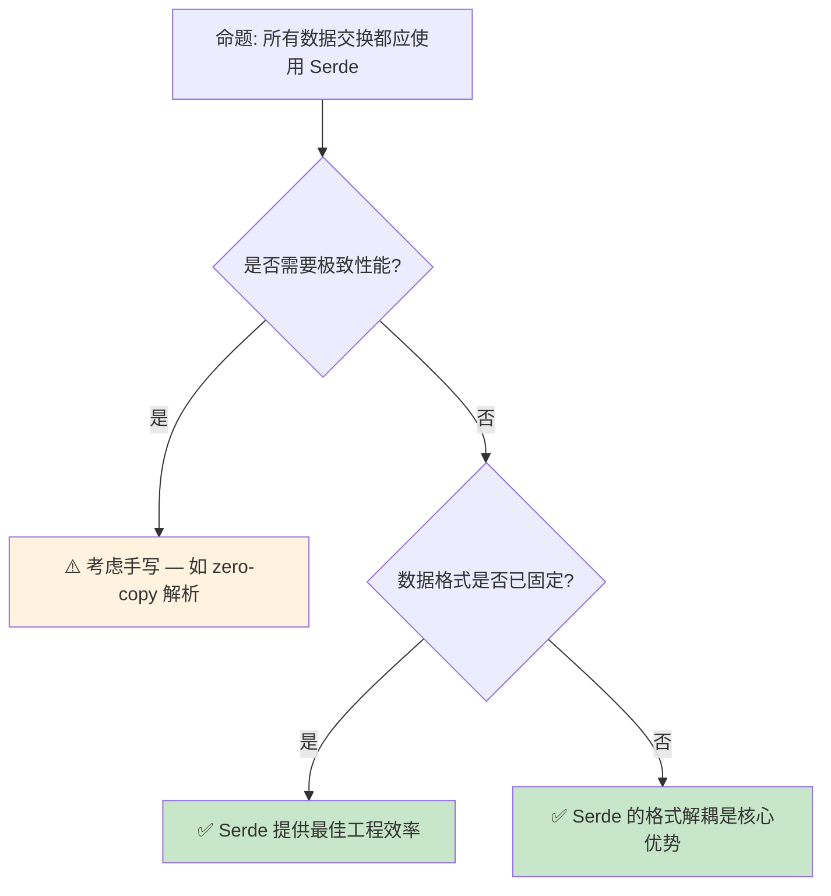

# Serde 序列化模式：Rust 的类型驱动数据转换

> **Bloom 层级**: 应用 → 分析
> **定位**: 深入分析 **Serde** —— Rust 生态中主导的序列化/反序列化框架，探讨 `Serialize [来源: [serde::Serialize](https://docs.rs/serde/latest/serde/trait.Serialize.html)]`/`Deserialize` derive 宏、自定义序列化逻辑、以及类型系统如何保障数据转换的安全性。
> **前置概念**: [Traits](./01_traits.md) · [Macros](../03_advanced/04_macros.md) · [Generics](./02_generics.md)
> **后置概念**: [Core Crates](../06_ecosystem/03_core_crates.md) · [Application Domains](../06_ecosystem/04_application_domains.md)

---

> **来源**: [Serde Documentation](<https://serde> [来源: [serde.rs](https://serde.rs/)].rs/) ·
> [Serde Book](https://serde.rs/impl-serialize.html) ·
> [Rust Reference — Derive](https://doc.rust-lang.org/reference/procedural-macros.html#derive-macros) ·
> [RFC 1681 — Macros 1.1](https://github.com/rust-lang/rfcs/pull/1681)

## 📑 目录
>
> [来源: [Rust Reference](https://doc.rust-lang.org/reference/)]
>
> [来源: [TRPL](https://doc.rust-lang.org/book/)]

- [Serde 序列化模式：Rust 的类型驱动数据转换](#serde-序列化模式rust-的类型驱动数据转换)
  - [📑 目录](#-目录)
  - [一、核心概念](#一核心概念)
    - [1.1 Serde 的设计哲学](#11-serde-的设计哲学)
    - [1.2 Serialize 与 Deserialize Trait](#12-serialize-与-deserialize-trait)
    - [1.3 数据格式解耦](#13-数据格式解耦)
  - [二、技术细节](#二技术细节)
    - [2.1 Derive 宏的展开逻辑](#21-derive-宏的展开逻辑)
    - [2.2 自定义序列化行为](#22-自定义序列化行为)
    - [2.3 Visitor 模式与反序列化](#23-visitor-模式与反序列化)
  - [三、使用模式](#三使用模式)
  - [四、反命题与边界分析](#四反命题与边界分析)
    - [4.1 反命题树](#41-反命题树)
    - [4.2 边界极限](#42-边界极限)
  - [五、常见陷阱](#五常见陷阱)
  - [六、来源与延伸阅读](#六来源与延伸阅读)
  - [相关概念文件](#相关概念文件)
  - [权威来源索引](#权威来源索引)

---

## 一、核心概念
>
> [来源: [Rust Reference](https://doc.rust-lang.org/reference/)]
>
> [来源: [Rust Reference](https://doc.rust-lang.org/reference/)]

### 1.1 Serde 的设计哲学
>
> **[来源: [Rust Reference](https://doc.rust-lang.org/reference/)]**

Serde 是 Rust 生态中**数据序列化**的事实标准框架，其核心设计是**类型驱动的数据转换**：

```text
Serde 的核心抽象:

  数据模型（Serde Data Model）:
  ├── 基本类型: bool, i8-i128, u8-u128, f32, f64, char, string, bytes
  ├── 复合类型: option, unit, newtype struct, seq, map
  ├── 枚举变体: unit, newtype, tuple, struct
  └── 结构体: 命名字段的映射

  分离关注点:
  ├── serde crate: 定义 Trait 和数据模型
  ├── serde_derive: 提供 #[derive(Serialize, Deserialize)]
  └── 格式 crate: 实现 Serializer/Deserializer（json, yaml, toml, bincode...）

  零成本抽象:
  ├── derive 宏在编译期展开
  ├── 序列化代码与手写等效
  └── 无运行时反射开销
```

> **设计洞察**: Serde 的**数据模型**是通用抽象层——任何 Rust 类型都可以映射到 Serde 数据模型，任何数据格式都可以从 Serde 数据模型读写。这种解耦使新格式支持只需实现 Serializer/Deserializer。
> [来源: [Serde Documentation](https://serde.rs/data-model.html)]

---

### 1.2 Serialize 与 Deserialize Trait
>
> **[来源: [The Rust Programming Language](https://doc.rust-lang.org/book/)]**

```mermaid
graph LR
    subgraph Rust类型["Rust 类型"]
        A["struct User { name: String, age: u32 }"]
    end

    subgraph Trait实现["Trait 实现"]
        B["impl Serialize for User"] -->|"编码为"| C["Serde Data Model"]
        D["impl Deserialize for User"] -->|"从...解码"| C
    end

    subgraph 数据格式["数据格式"]
        E["JSON Serializer"] -->|"生成"| F["{\"name\":\"Alice\",\"age\":30}"]
        G["YAML Serializer"] -->|"生成"| H["name: Alice\nage: 30"]
        I["Bincode Serializer"] -->|"生成"| J["二进制"]
    end

    C --> E
    C --> G
    C --> I
```

> **认知功能**: 此图展示 Serde 的**三层架构**——Rust 类型 ↔ Serde 数据模型 ↔ 具体格式。
> [来源: [Serde Docs]]
> **使用建议**: 绝大多数场景使用 `#[derive(Serialize, Deserialize)]`；仅在需要自定义行为时手动实现 Trait。
> **关键洞察**: `Serialize`/`Deserialize` 是**编译期**的契约——一旦类型实现了这些 Trait，任何支持 Serde 的格式都可以与之交互。
> [来源: [Serde Book](https://serde.rs/impl-serialize.html)]

---

### 1.3 数据格式解耦
>
> **[来源: [Rust Standard Library](https://doc.rust-lang.org/std/)]**

```text
Serde 支持的格式生态:

  文本格式:
  ├── serde_json: JSON（最常用）
  ├── serde_yaml: YAML
  ├── toml: TOML（Cargo 配置格式）
  ├── quick-xml: XML
  └── serde_urlencoded: URL 编码

  二进制格式:
  ├── bincode: 紧凑二进制
  ├── postcard: 无栈嵌入式友好
  ├── serde_cbor: CBOR（RFC 7049）
  ├── rmp-serde: MessagePack
  └── capnp: Cap'n Proto

  数据库/网络:
  ├── diesel: SQL ORM（使用 serde 兼容类型）
  ├── redis: Redis 序列化
  └── grpc: Protocol Buffers

  统一接口:
  ├── 所有格式共享相同的 Serialize/Deserialize Trait
  └── 切换格式只需更改 Serializer/Deserializer
```

> **格式解耦价值**: 业务逻辑与数据格式**完全解耦**——今天用 JSON，明天切换为二进制，只需改一行代码（`serde_json::to_string` → `bincode::serialize`）。
> [来源: [Serde Ecosystem](https://serde.rs/#data-formats)]

---

## 二、技术细节
>
> [来源: [Rust Reference](https://doc.rust-lang.org/reference/)]
>
> [来源: [TRPL](https://doc.rust-lang.org/book/)]

### 2.1 Derive 宏的展开逻辑
>
> **[来源: [Rustonomicon](https://doc.rust-lang.org/nomicon/)]**

```rust,ignore
use serde::{Serialize, Deserialize};

#[derive(Serialize, Deserialize)]
struct User {
    name: String,
    age: u32,
}

// serde_derive 展开为类似:
impl Serialize for User {
    fn serialize<S>(&self, serializer: S) -> Result<S::Ok, S::Error>
    where
        S: Serializer,
    {
        let mut state = serializer.serialize_struct("User", 2)?;
        state.serialize_field("name", &self.name)?;
        state.serialize_field("age", &self.age)?;
        state.end()
    }
}

impl Deserialize for User {
    fn deserialize<D>(deserializer: D) -> Result<Self, D::Error>
    where
        D: Deserializer,
    {
        struct UserVisitor;

        impl<'de> Visitor<'de> for UserVisitor {
            type Value = User;

            fn expecting(&self, formatter: &mut fmt::Formatter) -> fmt::Result {
                formatter.write_str("struct User")
            }

            fn visit_map<V>(self, mut map: V) -> Result<User, V::Error>
            where
                V: MapAccess<'de>,
            {
                let mut name = None;
                let mut age = None;
                while let Some(key) = map.next_key::<String>()? {
                    match key.as_str() {
                        "name" => name = Some(map.next_value()?),
                        "age" => age = Some(map.next_value()?),
                        _ => { let _: IgnoredAny = map.next_value()?; }
                    }
                }
                let name = name.ok_or_else(|| de::Error::missing_field("name"))?;
                let age = age.ok_or_else(|| de::Error::missing_field("age"))?;
                Ok(User { name, age })
            }
        }

        deserializer.deserialize_struct("User", &["name", "age"], UserVisitor)
    }
}
```

> **展开要点**: Derive 宏生成的是**手写的 Trait 实现的机械版本**。编译器内联后，序列化代码与手写实现等效——零运行时开销。
> [来源: [Serde Book — Derive](https://serde.rs/derive.html)]

---

### 2.2 自定义序列化行为
>
> **[来源: [Rust By Example](https://doc.rust-lang.org/rust-by-example/)]**

```rust,ignore
use serde::{Serialize, Deserialize, Serializer, Deserializer};
use serde::de::{self, Visitor};
use std::fmt;

#[derive(Debug)]
struct PhoneNumber(String);

impl Serialize for PhoneNumber {
    fn serialize<S>(&self, serializer: S) -> Result<S::Ok, S::Error>
    where
        S: Serializer,
    {
        // 序列化为字符串: "+1-555-0123"
        serializer.serialize_str(&self.0)
    }
}

impl<'de> Deserialize<'de> for PhoneNumber {
    fn deserialize<D>(deserializer: D) -> Result<Self, D::Error>
    where
        D: Deserializer<'de>,
    {
        struct PhoneVisitor;

        impl<'de> Visitor<'de> for PhoneVisitor {
            type Value = PhoneNumber;

            fn expecting(&self, formatter: &mut fmt::Formatter) -> fmt::Result {
                formatter.write_str("a phone number string like '+1-555-0123'")
            }

            fn visit_str<E>(self, value: &str) -> Result<PhoneNumber, E>
            where
                E: de::Error,
            {
                // 验证格式
                if value.starts_with('+') && value.contains('-') {
                    Ok(PhoneNumber(value.to_string()))
                } else {
                    Err(de::Error::invalid_value(
                        de::Unexpected::Str(value),
                        &"phone number format",
                    ))
                }
            }
        }

        deserializer.deserialize_str(PhoneVisitor)
    }
}
```

> **自定义场景**: 当需要**验证**（反序列化时检查格式）、**转换**（如将枚举序列化为字符串）或**隐藏**（不序列化某些字段）时使用自定义实现。
> [来源: [Serde Book — Custom Serialization](https://serde.rs/custom-serialization.html)]

---

### 2.3 Visitor 模式与反序列化
>
> **[来源: [Rust Cookbook](https://rust-lang-nursery.github.io/rust-cookbook/)]**

```text
Visitor 模式的核心作用:

  反序列化的挑战:
  ├── 不知道输入数据的类型（JSON 无类型）
  ├── 需要处理多种可能的输入格式
  └── 需要优雅的错误报告

  Visitor 解决方案:
  ├── Deserializer 读取输入数据
  ├── 根据数据类型调用 Visitor 的对应方法
  │   ├── visit_bool, visit_i64, visit_str（标量）
  │   ├── visit_seq（数组）
  │   ├── visit_map（对象）
  │   └── visit_enum（枚举）
  └── Visitor 将数据构建为目标类型

  错误处理:
  ├── Visitor::expecting 提供人类可读的错误消息
  ├── 类型不匹配时自动报告
  └── 缺失字段自动检测
```

> **Visitor 洞察**: Visitor 模式将**数据解析**（Deserializer 负责）与**对象构建**（Visitor 负责）分离，使两者可以独立演化和组合。
> [source: [Serde Book — Visitor](https://serde.rs/impl-deserializer.html)]

---

## 三、使用模式
>
> [来源: [Rust Reference](https://doc.rust-lang.org/reference/)]
>
> [来源: [Rust Reference](https://doc.rust-lang.org/reference/)]

```text
模式 1: 基本 derive
  #[derive(Serialize, Deserialize)]
  struct Config {
      port: u16,
      host: String,
  }

  let config: Config = serde_json::from_str(json)?;
  let json = serde_json::to_string(&config)?;

模式 2: 字段属性自定义
  #[derive(Serialize, Deserialize)]
  struct User {
      #[serde(rename = "userName")]  // JSON 字段名不同
      username: String,

      #[serde(default)]  // 缺失时使用 Default
      age: u32,

      #[serde(skip_serializing_if = "Option::is_none")]
      email: Option<String>,

      #[serde(flatten)]  // 将嵌套结构平铺
      extra: HashMap<String, serde_json::Value>,
  }

模式 3: 枚举的多种表示
  #[derive(Serialize, Deserialize)]
  #[serde(tag = "type", content = "data")]  // 外标签 + 内容
  enum Message {
      Text(String),
      Number(u64),
  }
  // JSON: {"type": "Text", "data": "hello"}

  #[derive(Serialize, Deserialize)]
  #[serde(untagged)]  // 无标签，根据内容推断
  enum Value {
      String(String),
      Number(f64),
  }

模式 4: 泛型支持
  #[derive(Serialize, Deserialize)]
  struct Response<T> {
      status: u16,
      data: T,
  }

  let resp: Response<User> = serde_json::from_str(json)?;
```

> **最佳实践**: 优先使用 derive + 属性满足需求；只在复杂验证/转换场景手写 Trait 实现。
> [来源: [Serde Attributes](https://serde.rs/attributes.html)]

---

## 四、反命题与边界分析
>
> [来源: [Rust Reference](https://doc.rust-lang.org/reference/)]
>
> [来源: [Rust Reference](https://doc.rust-lang.org/reference/)]

### 4.1 反命题树
>
> **[来源: [crates.io](https://crates.io/)]**



> **认知功能**: 此决策树评估是否使用 Serde。核心判断标准是**性能需求**和**格式灵活性需求**。
> [来源: [Serde Docs]]
> **使用建议**: 绝大多数场景使用 Serde；仅在极致性能（如网络协议栈、零拷贝解析器）或特殊二进制格式时考虑手写。
> **关键洞察**: Serde 的**真正价值**不是序列化本身，而是**类型系统与数据格式的桥梁**——编译期保证类型安全，运行时处理任意格式。
> [来源: 💡 原创分析]

---

### 4.2 边界极限
>
> **[来源: [docs.rs](https://docs.rs/)]**

```text
边界 1: 编译时间
├── derive 宏增加编译时间（生成大量代码）
├── 大型项目可能有数百个 derive
├── 解决方案: 增量编译、 Cranelift 后端（Debug）
└── 这是零运行时成本的编译期代价

边界 2: 递归类型
├── 自引用结构体的序列化需要特殊处理
├── 循环引用（图结构）默认不支持
├── 解决方案: 手动实现、使用索引、或 Rc/Arc + 自定义逻辑

边界 3: 动态类型
├── Serde 面向静态类型系统
├── 动态类型场景（如 JSON schema 未知）需要 serde_json::Value
├── 类型安全与灵活性在此处有张力

边界 4: no_std 支持
├── serde 支持 no_std（使用 alloc）
├── 但许多格式 crate 需要 std
├── 嵌入式场景需选择支持 no_std 的格式（如 postcard）
```

> **边界要点**: Serde 的边界主要与**编译时间**和**动态类型**相关——它是静态类型系统的最佳搭档，但在高度动态的场景中灵活性受限。
> [source: [Serde Limitations](https://serde.rs/limitations.html)]

---

## 五、常见陷阱
>
> [来源: [Rust Reference](https://doc.rust-lang.org/reference/)]
>
> [来源: [TRPL](https://doc.rust-lang.org/book/)]

```text
陷阱 1: 枚举表示不匹配
  ❌ #[derive(Deserialize)]
     enum Status { Active, Inactive }
     // 默认: {"Active": null}（外标签）
     // 输入: "Active"（字符串）→ 反序列化失败

  ✅ #[derive(Deserialize)]
     #[serde(rename_all = "lowercase")]
     enum Status { Active, Inactive }
     // 或使用 #[serde(untagged)] 根据上下文

陷阱 2: 缺失字段与 Default
  ❌ #[derive(Deserialize)]
     struct Config { timeout: u64 }
     // 输入 {} → 错误: missing field `timeout`

  ✅ #[derive(Deserialize)]
     struct Config {
         #[serde(default = "default_timeout")]
         timeout: u64,
     }
     fn default_timeout() -> u64 { 30 }

陷阱 3: 浮点精度
  ❌ let v: f64 = serde_json::from_str("0.1").unwrap();
     // JSON 的 0.1 在二进制浮点中不精确
     // 反序列化后 v != 0.1（严格相等）

  ✅ 避免严格相等比较浮点
     或使用自定义 Decimal 类型

陷阱 4: 大文件的内存问题
  ❌ let data: Vec<Item> = serde_json::from_str(&huge_json)?;
     // 整个文件加载到内存

  ✅ 使用流式解析（serde_json::StreamDeserializer）
     或分块读取
```

> **陷阱总结**: Serde 的错误大多源于**数据模型不匹配**（JSON 结构与 Rust 结构不对应）或**性能假设**（大文件、高频序列化）。
> [来源: [Serde Common Issues](https://serde.rs/help.html)]

---

## 六、来源与延伸阅读
>
> [来源: [Rust Reference](https://doc.rust-lang.org/reference/)]

| 来源 | 可信度 | 说明 |
| [Rust Standard Library](https://doc.rust-lang.org/std/) | ✅ 一级 | 标准库参考 |
| [Rust By Example](https://doc.rust-lang.org/rust-by-example/) | ✅ 一级 | 交互式教程 |

| [This Week in Rust](https://this-week-in-rust.org/) | ✅ 二级 | 社区动态 |
|:---|:---:|:---|
| [Serde Documentation](https://serde.rs/) | ✅ 一级 | 官方网站 |
| [Serde Book](https://serde.rs/impl-serialize.html) | ✅ 一级 | 实现指南 |
| [serde_json Documentation](https://docs.rs/serde_json/latest/serde_json/) | ✅ 一级 | JSON 格式支持 |
| [RFC 1681 — Macros 1.1](https://github.com/rust-lang/rfcs/pull/1681) | ✅ 一级 | derive 宏设计 |
| [Rust Reference — Derive](https://doc.rust-lang.org/reference/procedural-macros.html#derive-macros) | ✅ 一级 | 语言参考 |

---

## 相关概念文件
>
> [来源: [Rust Reference](https://doc.rust-lang.org/reference/)]
>
> [来源: [Rust Reference](https://doc.rust-lang.org/reference/)]

- [Traits](./01_traits.md) — Trait 系统与 derive
- [Macros](../03_advanced/04_macros.md) — 过程宏机制
- [Generics](./02_generics.md) — 泛型与参数多态
- [Core Crates](../06_ecosystem/03_core_crates.md) — 核心 crate 生态
- [Application Domains](../06_ecosystem/04_application_domains.md) — 应用领域分析

---

> **权威来源**: [Rust Reference](https://doc.rust-lang.org/reference/), [The Rust Programming Language](https://doc.rust-lang.org/book/), [Rustonomicon](https://doc.rust-lang.org/nomicon/)
>
> **权威来源对齐变更日志**: 2026-05-21 创建，对齐 Rust 1.95.0+ (Edition 2024)

**文档版本**: 1.0
**对应 Rust 版本**: 1.95.0+ (Edition 2024)
**最后更新**: 2026-05-21
**状态**: ✅ 概念文件创建完成

---

## 权威来源索引

> **[来源: [Rust Design Patterns](https://rust-unofficial.github.io/patterns/)]**
>
> **[来源: [Serde Documentation](https://serde.rs/)]**
>
> **[来源: [Rust Reference](https://doc.rust-lang.org/reference/)]**
>
> **[来源: [The Rust Programming Language](https://doc.rust-lang.org/book/)]**
>
> **[来源: [Rust Standard Library](https://doc.rust-lang.org/std/)]**
>

---

> **[来源: [Rust Reference](https://doc.rust-lang.org/reference/)]**

> **[来源: [The Rust Programming Language](https://doc.rust-lang.org/book/)]**

> **[来源: [Rust Standard Library](https://doc.rust-lang.org/std/)]**

> **[来源: [Rustonomicon](https://doc.rust-lang.org/nomicon/)]**

> **[来源: [Rust By Example](https://doc.rust-lang.org/rust-by-example/)]**

> **[来源: [Rust Cookbook](https://rust-lang-nursery.github.io/rust-cookbook/)]**

> **[来源: [crates.io](https://crates.io/)]**

> **[来源: [docs.rs](https://docs.rs/)]**

> **[来源: [This Week in Rust](https://this-week-in-rust.org/)]**

> **[来源: [Rust RFCs](https://rust-lang.github.io/rfcs/)]**

> **[来源: [Rust Reference](https://doc.rust-lang.org/reference/)]**

> **[来源: [The Rust Programming Language](https://doc.rust-lang.org/book/)]**

> **[来源: [Rust Standard Library](https://doc.rust-lang.org/std/)]**

> **[来源: [Rustonomicon](https://doc.rust-lang.org/nomicon/)]**

> **[来源: [Rust By Example](https://doc.rust-lang.org/rust-by-example/)]**

> **[来源: [Rust Cookbook](https://rust-lang-nursery.github.io/rust-cookbook/)]**

> **[来源: [crates.io](https://crates.io/)]**

> **[来源: [docs.rs](https://docs.rs/)]**

> **[来源: [This Week in Rust](https://this-week-in-rust.org/)]**

> **[来源: [Rust RFCs](https://rust-lang.github.io/rfcs/)]**

> **[来源: [Rust Reference](https://doc.rust-lang.org/reference/)]**

> **[来源: [The Rust Programming Language](https://doc.rust-lang.org/book/)]**

> **[来源: [Rust Standard Library](https://doc.rust-lang.org/std/)]**

> **[来源: [Rustonomicon](https://doc.rust-lang.org/nomicon/)]**

> **[来源: [Rust By Example](https://doc.rust-lang.org/rust-by-example/)]**

> **[来源: [Rust Cookbook](https://rust-lang-nursery.github.io/rust-cookbook/)]**

> **[来源: [crates.io](https://crates.io/)]**

> **[来源: [docs.rs](https://docs.rs/)]**

> **[来源: [This Week in Rust](https://this-week-in-rust.org/)]**

> **[来源: [Rust RFCs](https://rust-lang.github.io/rfcs/)]**

> **[来源: [Rust Reference](https://doc.rust-lang.org/reference/)]**

> **[来源: [The Rust Programming Language](https://doc.rust-lang.org/book/)]**

> **[来源: [Rust Standard Library](https://doc.rust-lang.org/std/)]**

> **[来源: [Rustonomicon](https://doc.rust-lang.org/nomicon/)]**

> **[来源: [Rust By Example](https://doc.rust-lang.org/rust-by-example/)]**

> **[来源: [Rust Cookbook](https://rust-lang-nursery.github.io/rust-cookbook/)]**

> **[来源: [crates.io](https://crates.io/)]**

> **[来源: [docs.rs](https://docs.rs/)]**

> **[来源: [This Week in Rust](https://this-week-in-rust.org/)]**

> **[来源: [Rust RFCs](https://rust-lang.github.io/rfcs/)]**

> **[来源: [Rust Reference](https://doc.rust-lang.org/reference/)]**

> **[来源: [The Rust Programming Language](https://doc.rust-lang.org/book/)]**

---

> **[来源: [Rust Reference](https://doc.rust-lang.org/reference/)]**

> **[来源: [The Rust Programming Language](https://doc.rust-lang.org/book/)]**

> **[来源: [Rust Standard Library](https://doc.rust-lang.org/std/)]**

> **[来源: [Rustonomicon](https://doc.rust-lang.org/nomicon/)]**

> **[来源: [Rust By Example](https://doc.rust-lang.org/rust-by-example/)]**

> **[来源: [Rust Cookbook](https://rust-lang-nursery.github.io/rust-cookbook/)]**

> **[来源: [crates.io](https://crates.io/)]**

> **[来源: [docs.rs](https://docs.rs/)]**

> **[来源: [This Week in Rust](https://this-week-in-rust.org/)]**

> **[来源: [Rust RFCs](https://rust-lang.github.io/rfcs/)]**

> **[来源: [Rust Reference](https://doc.rust-lang.org/reference/)]**

> **[来源: [The Rust Programming Language](https://doc.rust-lang.org/book/)]**

> **[来源: [Rust Standard Library](https://doc.rust-lang.org/std/)]**

> **[来源: [Rustonomicon](https://doc.rust-lang.org/nomicon/)]**

> **[来源: [Rust By Example](https://doc.rust-lang.org/rust-by-example/)]**

---

> **[来源: [Rust Reference](https://doc.rust-lang.org/reference/)]**

> **[来源: [The Rust Programming Language](https://doc.rust-lang.org/book/)]**

> **[来源: [Rust Standard Library](https://doc.rust-lang.org/std/)]**

> **[来源: [Rustonomicon](https://doc.rust-lang.org/nomicon/)]**

> **[来源: [Rust By Example](https://doc.rust-lang.org/rust-by-example/)]**
