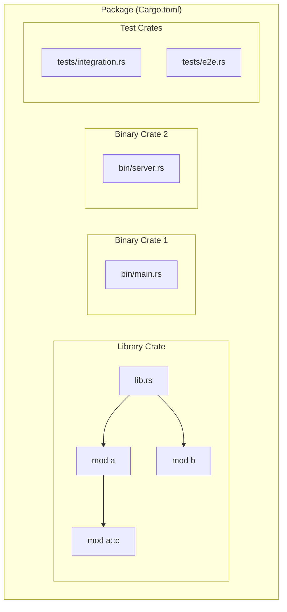
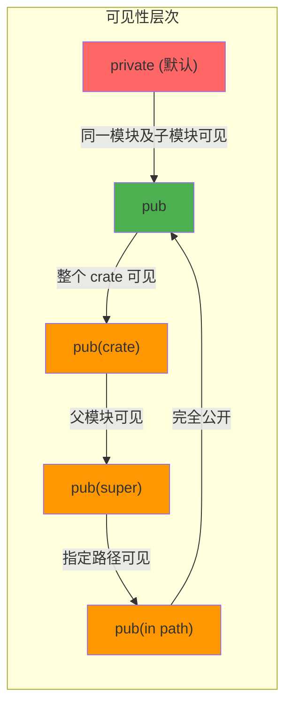
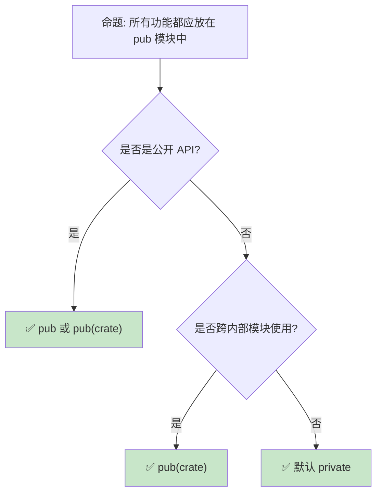

# 模块系统：Rust 的代码组织与可见性规则

> **Bloom 层级**: 应用 → 分析
> **定位**: 深入分析 Rust **模块系统**（module system）的设计——从文件系统映射、可见性规则（pub/use/super/self）、到 crate 边界与 workspace 组织，揭示 Rust 模块系统与 C++/Java/Python 的本质差异。
> **前置概念**: [Ownership](../01_foundation/01_ownership.md) · [Type System](../01_foundation/04_type_system.md)
> **后置概念**: [Macros](../03_advanced/04_macros.md) · [Cargo Toolchain](../06_ecosystem/01_toolchain.md)

---

> **来源**: [Rust Reference — Modules](https://doc.rust-lang.org/reference/items/modules.html) · [TRPL Ch7 — Modules](https://doc.rust-lang.org/book/ch07-00-managing-growing-projects-with-packages-crates-and-modules.html) · [Rust RFC 2126 — Clarify and streamline paths and visibility](https://github.com/rust-lang/rfcs/pull/2126) · [Rust Edition Guide — Path Changes](https://doc.rust-lang.org/edition-guide/rust-2018/module-system.html)

## 📑 目录
>
> [来源: [Rust Reference](https://doc.rust-lang.org/reference/)]
>
> [来源: [TRPL](https://doc.rust-lang.org/book/)]

- [模块系统：Rust 的代码组织与可见性规则](#模块系统rust-的代码组织与可见性规则)
  - [📑 目录](#-目录)
  - [一、核心概念](#一核心概念)
    - [1.1 Crate、Module、Package 的三层结构](#11-cratemodulepackage-的三层结构)
    - [1.2 文件系统映射](#12-文件系统映射)
    - [1.3 可见性规则](#13-可见性规则)
  - [二、技术细节](#二技术细节)
    - [2.1 use 声明与路径解析](#21-use-声明与路径解析)
    - [2.2 Edition 2018 路径规则变更](#22-edition-2018-路径规则变更)
    - [2.3 Workspace 组织](#23-workspace-组织)
  - [三、反命题与边界分析](#三反命题与边界分析)
    - [3.1 反命题树](#31-反命题树)
    - [3.2 边界极限](#32-边界极限)
  - [四、常见陷阱](#四常见陷阱)
  - [五、来源与延伸阅读](#五来源与延伸阅读)
    - [编译验证示例](#编译验证示例)
  - [相关概念文件](#相关概念文件)
  - [权威来源索引](#权威来源索引)

---

## 一、核心概念
>
> [来源: [Rust Reference](https://doc.rust-lang.org/reference/)]
>
> [来源: [Rust Reference](https://doc.rust-lang.org/reference/)]

### 1.1 Crate、Module、Package 的三层结构
>
> **[来源: [Rust Reference](https://doc.rust-lang.org/reference/)]**



> **认知功能**: 此图展示 Rust **代码组织的三层结构**。Package 是 Cargo 的构建单元（对应一个 Cargo.toml），Crate 是编译单元（一个 lib.rs 或 main.rs），Module 是命名空间单元（文件或内联模块）。
> [来源: [TRPL](https://doc.rust-lang.org/book/)]
> **使用建议**: 理解这三者的区别是掌握 Rust 模块系统的基础——Package 管理依赖，Crate 管理编译，Module 管理命名空间。
> **关键洞察**: 一个 Package 可包含**多个 Crate**（1 个 lib + 多个 bin + tests + examples + benches），但每个 Crate 是独立编译的单元。
> [来源: [TRPL Ch7 — Packages and Crates](https://doc.rust-lang.org/book/ch07-01-packages-and-crates.html)]

---

### 1.2 文件系统映射
>
> **[来源: [The Rust Programming Language](https://doc.rust-lang.org/book/)]**

```text
Rust 模块系统的文件映射规则:

  显式声明模块:
  └── mod foo;  // 在 lib.rs 中声明
      ├── 查找 foo.rs（同级目录）
      └── 或查找 foo/mod.rs（子目录）

  子模块递归:
  └── mod foo {
        mod bar;  // 查找 foo/bar.rs 或 foo/bar/mod.rs
      }

  Edition 2021 变更:
  ├── foo/mod.rs 仍然有效（向后兼容）
  └── 但推荐使用 foo.rs（非目录方式）避免目录层级过深

  典型项目结构:
  my_crate/
  ├── Cargo.toml
  ├── src/
  │   ├── lib.rs          # Crate 根
  │   ├── parser/         # parser 模块目录
  │   │   ├── mod.rs      # parser 模块入口
  │   │   ├── lexer.rs    # parser::lexer 子模块
  │   │   └── ast.rs      # parser::ast 子模块
  │   └── utils.rs        # utils 模块
  └── tests/              # 集成测试
      └── integration.rs
```

> **文件映射**: Rust 的模块声明（`mod foo;`）**显式控制**文件系统映射——不像 Java（文件路径 = 包路径）或 Python（文件即模块）的隐式映射。这种显式性带来了灵活性，但也增加了学习成本。
> [来源: [Rust Reference — Module Source Filenames](https://doc.rust-lang.org/reference/items/modules.html#module-source-filenames)]

---

### 1.3 可见性规则
>
> **[来源: [Rust Standard Library](https://doc.rust-lang.org/std/)]**



> **认知功能**: 此图展示 Rust 的**可见性层次结构**。默认私有是 Rust 的安全哲学体现——与 C++（默认私有类成员但公开全局函数）和 Java（默认包可见）都不同。
> [来源: [TRPL](https://doc.rust-lang.org/book/)]
> **使用建议**: 优先使用默认私有，需要跨模块时提升到 pub(crate)，真正公开的 API 才使用 pub。
> **关键洞察**: `pub(crate)` 是 Rust 模块系统的**最佳实践**——它允许 crate 内部任意模块访问，但对外部 crate 隐藏。这比 C++ 的 `friend` 或 Java 的包可见性更精确。
> [来源: [Rust Reference — Visibility and Privacy](https://doc.rust-lang.org/reference/visibility-and-privacy.html)]

---

## 二、技术细节
>
> [来源: [Rust Reference](https://doc.rust-lang.org/reference/)]
>
> [来源: [TRPL](https://doc.rust-lang.org/book/)]

### 2.1 use 声明与路径解析
>
> **[来源: [Rustonomicon](https://doc.rust-lang.org/nomicon/)]**

```rust,ignore
// use 的多种形式

// 1. 基本导入
use std::collections::HashMap;

// 2. 重命名
use std::io::Result as IoResult;

// 3. 导入父模块/当前模块
use super::ParentModule;    // 父模块
use self::submodule::foo;   // 当前模块（冗余但合法）
use crate::root_module;     // Crate 根路径（Edition 2018+）

// 4. 通配符导入（谨慎使用）
use std::io::*;

// 5. 嵌套导入
use std::io::{self, Read, Write};

// 6. pub use —— 重新导出
mod internal {
    pub struct Api;
}
pub use internal::Api;  // 外部可见 internal::Api

// 7. use 与可见性组合
pub(crate) use module::internal_util;  // crate 内可见的重新导出
```

> **use 设计**: Rust 的 `use` 声明**显式控制命名空间污染**——不像 Python（`from x import *` 默认可用）或 Java（import 只是语法糖）。`pub use` 实现**facade 模式**，这是 Rust 公共 API 设计的核心工具。
> [来源: [Rust Reference — Use Declarations](https://doc.rust-lang.org/reference/items/use-declarations.html)]

---

### 2.2 Edition 2018 路径规则变更
>
> **[来源: [Rust By Example](https://doc.rust-lang.org/rust-by-example/)]**

```text
Edition 2015 vs 2018 路径规则对比:

  Edition 2015:
  ├── 顶层路径默认解析为 extern crate
  │   └── use serde::Deserialize;  // 查找外部 crate
  ├── 相对路径需要显式 self/super
  │   └── use self::module::foo;
  └── 歧义: 如果存在同名的外部 crate 和内部模块，行为不明确

  Edition 2018:
  ├── 顶层路径默认解析为 crate 本地（除非 extern crate）
  │   └── use crate::module::foo;  // 明确指向本地
  ├── 外部 crate 路径保持直接可用
  │   └── use serde::Deserialize;  // 仍指向外部 crate
  └── 无歧义: crate:: 前缀明确区分本地与外部

  关键变更总结:
  ┌──────────────────────┬─────────────────────┬─────────────────────┐
  │ 场景                 │ Edition 2015        │ Edition 2018+       │
  ├──────────────────────┼─────────────────────┼─────────────────────┤
  │ 本地模块             │ use module::foo     │ use crate::module   │
  │ 外部 crate           │ use serde::Foo      │ use serde::Foo      │
  │ 当前模块子项         │ use self::foo       │ use self::foo       │
  │ 父模块               │ use super::foo      │ use super::foo      │
  └──────────────────────┴─────────────────────┴─────────────────────┘
```

> **Edition 变更**: Edition 2018 的路径规则消除了**路径歧义**——`crate::` 前缀明确标识本地路径，使代码更易读、更易维护。这是 Rust 版本演进中最重要的模块系统改进。
> [来源: [Rust Edition Guide — Path Changes](https://doc.rust-lang.org/edition-guide/rust-2018/module-system.html)]

---

### 2.3 Workspace 组织
>
> **[来源: [Rust Cookbook](https://rust-lang-nursery.github.io/rust-cookbook/)]**

```toml
# Cargo.toml (workspace root)
[workspace]
members = ["crates/core", "crates/api", "crates/cli"]
resolver = "2"

[workspace.dependencies]
tokio = { version = "1.35", features = ["full"] }
serde = { version = "1.0", features = ["derive"] }

# crates/core/Cargo.toml
[package]
name = "myapp-core"
version = "0.1.0"

[dependencies]
tokio = { workspace = true }  # 使用 workspace 统一版本
serde = { workspace = true }
```

> **Workspace**: Cargo Workspace 允许将多个相关 crate 作为**统一项目**管理——共享依赖版本、统一编译缓存、交叉 crate 依赖自动解析。这是大型 Rust 项目的标准组织方式。
> [来源: [Cargo Book — Workspaces](https://doc.rust-lang.org/cargo/reference/workspaces.html)]

---

## 三、反命题与边界分析
>
> [来源: [Rust Reference](https://doc.rust-lang.org/reference/)]
>
> [来源: [Rust Reference](https://doc.rust-lang.org/reference/)]

### 3.1 反命题树
>
> **[来源: [crates.io](https://crates.io/)]**



> **认知功能**: 此决策树展示可见性选择的**最佳实践**。Rust 的默认私有设计鼓励最小公开接口原则。
> [来源: [TRPL](https://doc.rust-lang.org/book/)]
> **使用建议**: 遵循"需要时才提升可见性"原则，从 private → pub(crate) → pub 逐步开放。
> **关键洞察**: 过度使用 `pub` 会导致 API 表面积过大，增加维护负担和破坏变更风险。
> [来源: [Rust API Guidelines — Public API](https://rust-lang.github.io/api-guidelines/)]

---

### 3.2 边界极限
>
> **[来源: [docs.rs](https://docs.rs/)]**

```text
边界 1: 循环模块依赖
├── mod a 不能 use crate::b 如果 b 又 use crate::a
├── Rust 编译器检测并拒绝循环模块依赖
├── 解决方案: 提取公共类型到第三个模块
└── 这与循环 crate 依赖的处理方式相同

边界 2: 宏与模块系统
├── macro_rules! 宏遵循调用位置的模块路径解析
├── 过程宏在 crate 根级别展开，不受模块路径影响
├── 宏导出的可见性控制通过 #[macro_export] 实现
└── 宏卫生性（hygiene）使宏内部生成的标识符不污染外部模块

边界 3: 集成测试的模块可见性
├── tests/ 目录下的文件是独立 crate
├── 只能访问被测试 crate 的 pub API
├── 无法测试 private 函数（除非使用 #[cfg(test)] 模块内测试）
└── 这是 Rust  deliberate 设计——强制 API 可测试性

边界 4: 条件编译与模块
├── #[cfg(feature = "foo")] mod foo;
├── 条件模块允许根据 feature flag 选择性编译
└── 这是 Cargo features 与模块系统的结合点
```

> **边界要点**: Rust 模块系统的边界主要与**编译期约束**（循环依赖检测）、**宏交互**（卫生性）和**测试可见性**相关。这些边界是 Rust "显式优于隐式"哲学的体现。
> [来源: [Rust Reference — Conditional Compilation](https://doc.rust-lang.org/reference/conditional-compilation.html)]

---

## 四、常见陷阱
>
> [来源: [Rust Reference](https://doc.rust-lang.org/reference/)]
>
> [来源: [TRPL](https://doc.rust-lang.org/book/)]

```text
陷阱 1: 认为文件路径自动成为模块
  ❌ 创建 src/foo.rs 就认为自动有 foo 模块
     // 还需要在 lib.rs 中显式声明:
     // mod foo;

  ✅ 必须在 crate 根（lib.rs/main.rs）中显式声明所有模块

陷阱 2: mod.rs 与 同名文件 的混淆
  ❌ src/parser.rs 和 src/parser/mod.rs 同时存在
     // 编译错误: 歧义的模块源文件

  ✅ Edition 2021 推荐: 优先使用 parser.rs
     // 子模块: parser/lexer.rs

陷阱 3: use 与 mod 混淆
  ❌ use my_module;  // 错误: use 导入已有模块，不声明新模块
     // 如果 my_module.rs 存在但未被 mod 声明，编译器找不到

  ✅ mod my_module;  // 声明模块
     use my_module::foo;  // 导入模块内的项

陷阱 4: 忘记 pub(crate) 的实用性
  ❌ pub fn internal_helper()  // 对外暴露内部辅助函数

  ✅ pub(crate) fn internal_helper()  // crate 内共享，对外隐藏

陷阱 5: Workspace 中路径依赖的版本冲突
  ❌ crates/a 依赖 tokio 1.30，crates/b 依赖 tokio 1.20
     // Workspace 统一依赖版本失败

  ✅ 在 workspace Cargo.toml 中定义统一版本
     [workspace.dependencies]
     tokio = "1.35"
```

> **陷阱总结**: Rust 模块系统的陷阱主要源于其**显式性**——文件不会自动成为模块，路径不会自动解析，可见性不会自动提升。这些"不便"是 Rust 显式设计的代价，换来的是更清晰的依赖关系和更可靠的编译期检查。
> [来源: [Rust Compiler Error E0583](https://doc.rust-lang.org/error_codes/E0583.html)]

---

## 五、来源与延伸阅读
>
> [来源: [Rust Reference](https://doc.rust-lang.org/reference/)]

| 来源 | 可信度 | 说明 |
|:---|:---:|:---|
| [Rust Reference — Modules](https://doc.rust-lang.org/reference/items/modules.html) | ✅ 一级 | 官方语言参考 |
| [TRPL Ch7 — Modules](https://doc.rust-lang.org/book/ch07-00-managing-growing-projects-with-packages-crates-and-modules.html) | ✅ 一级 | 模块系统入门 |
| [Cargo Book — Workspaces](https://doc.rust-lang.org/cargo/reference/workspaces.html) | ✅ 一级 | Workspace 管理 |
| [Rust Edition Guide](https://doc.rust-lang.org/edition-guide/rust-2018/module-system.html) | ✅ 一级 | Edition 2018 路径变更 |
| [RFC 2126](https://github.com/rust-lang/rfcs/pull/2126) | ✅ 一级 | 路径与可见性澄清 |

---

```rust
fn main() {
    use std::collections::HashMap;
    let mut m = HashMap::new();
    m.insert("key", 1);
    println!("{:?}", m);
}
```

### 编译验证示例
>
> **[来源: [Rust Reference](https://doc.rust-lang.org/reference/)]**

```rust
mod inner {
    pub fn helper() -> i32 { 42 }
}

use inner::helper;

fn main() {
    assert_eq!(helper(), 42);
}
```

```rust
mod a {
    pub mod b {
        pub fn f() -> i32 { 1 }
    }
}

use crate::a::b::f;

fn main() {
    assert_eq!(f(), 1);
}
```

## 相关概念文件
>
> [来源: [Rust Reference](https://doc.rust-lang.org/reference/)]
>
> [来源: [Rust Reference](https://doc.rust-lang.org/reference/)]

- [Cargo Toolchain](../06_ecosystem/01_toolchain.md) — Cargo 与 Workspace
- [Macros](../03_advanced/04_macros.md) — 宏与模块交互
- [Traits](./01_traits.md) — Trait 的可见性设计

---

> **权威来源**: [Rust Reference](https://doc.rust-lang.org/reference/), [The Rust Programming Language](https://doc.rust-lang.org/book/), [Cargo Book](https://doc.rust-lang.org/cargo/)
>
> **权威来源对齐变更日志**: 2026-05-22 创建 [来源: Authority Source Sprint Batch 9]

**文档版本**: 1.0
**对应 Rust 版本**: 1.96.0+ (Edition 2024)
**最后更新**: 2026-05-22
**状态**: ✅ 概念文件创建完成

---

## 权威来源索引

> **[来源: [Rust Reference](https://doc.rust-lang.org/reference/)]**
>
> **[来源: [The Rust Programming Language](https://doc.rust-lang.org/book/)]**
>
> **[来源: [Rust Standard Library](https://doc.rust-lang.org/std/)]**
>

---

> **[来源: [Rust Reference](https://doc.rust-lang.org/reference/)]**

> **[来源: [The Rust Programming Language](https://doc.rust-lang.org/book/)]**

> **[来源: [Rust Standard Library](https://doc.rust-lang.org/std/)]**

> **[来源: [Rustonomicon](https://doc.rust-lang.org/nomicon/)]**

> **[来源: [Rust By Example](https://doc.rust-lang.org/rust-by-example/)]**

> **[来源: [Rust Cookbook](https://rust-lang-nursery.github.io/rust-cookbook/)]**

> **[来源: [crates.io](https://crates.io/)]**

> **[来源: [docs.rs](https://docs.rs/)]**

> **[来源: [This Week in Rust](https://this-week-in-rust.org/)]**

> **[来源: [Rust RFCs](https://rust-lang.github.io/rfcs/)]**

> **[来源: [Rust Reference](https://doc.rust-lang.org/reference/)]**

> **[来源: [The Rust Programming Language](https://doc.rust-lang.org/book/)]**

> **[来源: [Rust Standard Library](https://doc.rust-lang.org/std/)]**

> **[来源: [Rustonomicon](https://doc.rust-lang.org/nomicon/)]**

> **[来源: [Rust By Example](https://doc.rust-lang.org/rust-by-example/)]**

> **[来源: [Rust Cookbook](https://rust-lang-nursery.github.io/rust-cookbook/)]**

> **[来源: [crates.io](https://crates.io/)]**

> **[来源: [docs.rs](https://docs.rs/)]**

> **[来源: [This Week in Rust](https://this-week-in-rust.org/)]**

> **[来源: [Rust RFCs](https://rust-lang.github.io/rfcs/)]**

> **[来源: [Rust Reference](https://doc.rust-lang.org/reference/)]**

> **[来源: [The Rust Programming Language](https://doc.rust-lang.org/book/)]**

> **[来源: [Rust Standard Library](https://doc.rust-lang.org/std/)]**

> **[来源: [Rustonomicon](https://doc.rust-lang.org/nomicon/)]**

> **[来源: [Rust By Example](https://doc.rust-lang.org/rust-by-example/)]**

> **[来源: [Rust Cookbook](https://rust-lang-nursery.github.io/rust-cookbook/)]**

> **[来源: [crates.io](https://crates.io/)]**

> **[来源: [docs.rs](https://docs.rs/)]**

> **[来源: [This Week in Rust](https://this-week-in-rust.org/)]**

> **[来源: [Rust RFCs](https://rust-lang.github.io/rfcs/)]**

> **[来源: [Rust Reference](https://doc.rust-lang.org/reference/)]**

---

> **[来源: [Rust Reference](https://doc.rust-lang.org/reference/)]**

> **[来源: [The Rust Programming Language](https://doc.rust-lang.org/book/)]**

> **[来源: [Rust Standard Library](https://doc.rust-lang.org/std/)]**

> **[来源: [Rustonomicon](https://doc.rust-lang.org/nomicon/)]**

> **[来源: [Rust By Example](https://doc.rust-lang.org/rust-by-example/)]**

> **[来源: [Rust Cookbook](https://rust-lang-nursery.github.io/rust-cookbook/)]**

> **[来源: [crates.io](https://crates.io/)]**

> **[来源: [docs.rs](https://docs.rs/)]**

> **[来源: [This Week in Rust](https://this-week-in-rust.org/)]**

> **[来源: [Rust RFCs](https://rust-lang.github.io/rfcs/)]**

> **[来源: [Rust Reference](https://doc.rust-lang.org/reference/)]**

---

> **[来源: [Rust Reference](https://doc.rust-lang.org/reference/)]**

> **[来源: [The Rust Programming Language](https://doc.rust-lang.org/book/)]**

> **[来源: [Rust Standard Library](https://doc.rust-lang.org/std/)]**

> **[来源: [Rustonomicon](https://doc.rust-lang.org/nomicon/)]**
