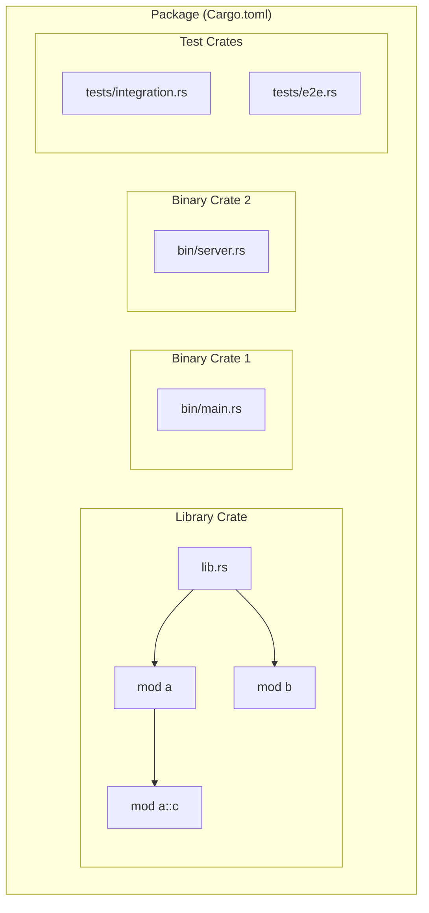
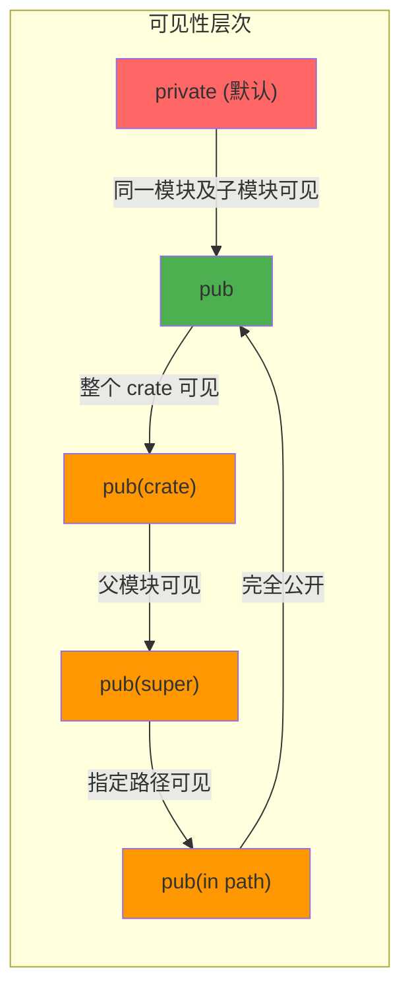
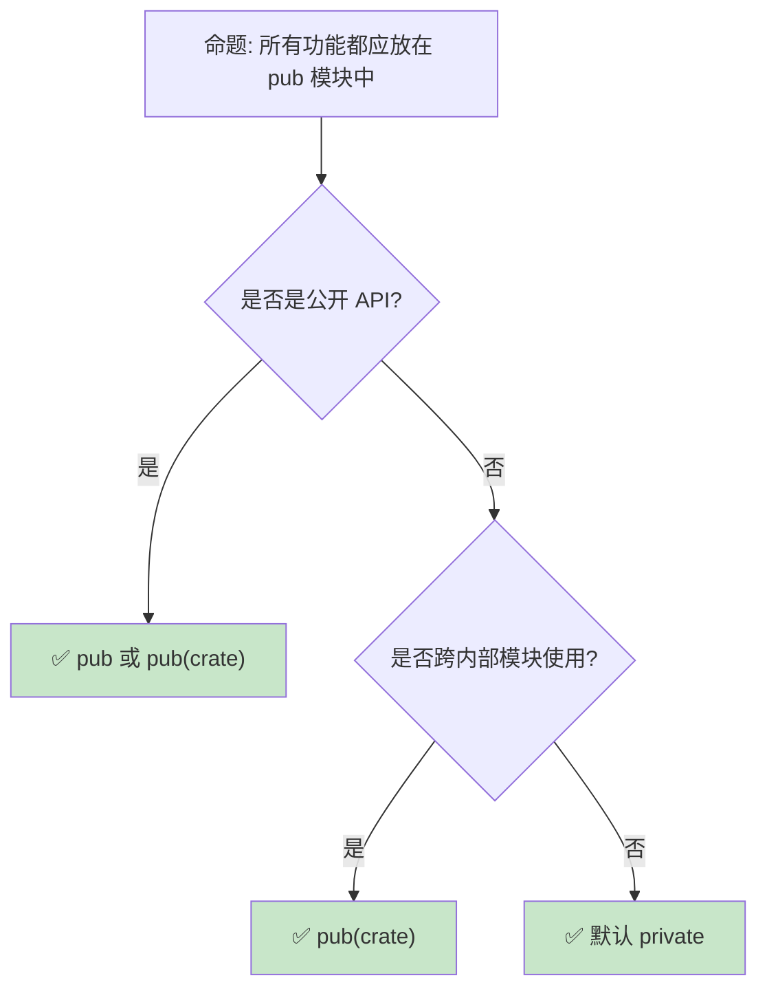

> **内容分级**:
>
> [综述级]
> **本节关键术语**: 模块系统 (Module System) · 工作空间 (Workspace) · 包 (Package) · Crate · 可见性 (Visibility) — [完整对照表](../00_meta/terminology_glossary.md)
>
# 模块系统：Rust 的代码组织与可见性规则
>
> **EN**: Modules
> **Summary**: Modules. Core Rust concept covering mechanism analysis, in-depth analysis.
> **受众**: [进阶]
> **Bloom 层级**: 应用 → 分析
> **定位**: 深入分析 Rust **模块系统**（module system）的设计——从文件系统映射、可见性规则（pub/use/super/self）、到 crate 边界与 workspace 组织，揭示 Rust 模块系统与 C++/Java/Python 的本质差异。
> **前置概念**: [Ownership](../01_foundation/01_ownership.md) · [Type System](../01_foundation/04_type_system.md)
> **后置概念**: [Macros](../03_advanced/04_macros.md) · [Cargo Toolchain](../06_ecosystem/01_toolchain.md)

---

> **来源**:
> [Rust Reference — Modules](https://doc.rust-lang.org/reference/items/modules.html) ·
> [TRPL Ch7 — Modules](https://doc.rust-lang.org/book/ch07-00-managing-growing-projects-with-packages-crates-and-modules.html) ·
> [Rust [RFC 2126](https://rust-lang.github.io/rfcs//2126-path-clarity.html) — Clarify and streamline paths and visibility](<https://github.com/rust-lang/rfcs/pull/2126>) ·
> [Rust Edition Guide — Path Changes](https://doc.rust-lang.org/edition-guide/rust-2018/path-changes.html)

## 📑 目录

- [模块系统：Rust 的代码组织与可见性规则](#模块系统rust-的代码组织与可见性规则)
  - [📑 目录](#-目录)
  - [一、核心概念](#一核心概念)
    - [1.1 Crate、Module、Package 的三层结构](#11-cratemodulepackage-的三层结构)
    - [1.2 文件系统映射](#12-文件系统映射)
    - [1.3 可见性规则](#13-可见性规则)
  - [二、技术细节](#二技术细节)
    - [2.1 use 声明与路径解析](#21-use-声明与路径解析)
    - [2.2 Edition 2018 路径规则变更](#22-edition-2018-路径规则变更)
    - [2.3 Workspace 组织](#23-workspace-组织)
  - [三、反命题与边界分析](#三反命题与边界分析)
    - [3.1 反命题树](#31-反命题树)
    - [3.2 边界极限](#32-边界极限)
  - [四、常见陷阱](#四常见陷阱)
  - [五、来源与延伸阅读](#五来源与延伸阅读)
    - [编译验证示例](#编译验证示例)
  - [相关概念文件](#相关概念文件)
  - [逆向推理链（Backward Reasoning）](#逆向推理链backward-reasoning)
  - [权威来源索引](#权威来源索引)
  - [十、边界测试：模块系统的编译错误](#十边界测试模块系统的编译错误)
    - [10.1 边界测试：`pub(crate)` 与 `pub(super)` 的可见性层级（编译错误）](#101-边界测试pubcrate-与-pubsuper-的可见性层级编译错误)
    - [10.2 边界测试：模块文件与目录的命名冲突（编译错误）](#102-边界测试模块文件与目录的命名冲突编译错误)
    - [10.3 边界测试：`use self::` 与 `use crate::` 的路径解析（编译错误）](#103-边界测试use-self-与-use-crate-的路径解析编译错误)
    - [10.4 边界测试：路径重导出（re-export）的循环（编译错误）](#104-边界测试路径重导出re-export的循环编译错误)
    - [10.3 边界测试：`pub(crate)` 与 `pub(super)` 的可见性嵌套（编译错误）](#103-边界测试pubcrate-与-pubsuper-的可见性嵌套编译错误)
    - [10.4 边界测试：workspace 成员的循环依赖（编译错误）](#104-边界测试workspace-成员的循环依赖编译错误)
  - [实践](#实践)
  - [认知路径](#认知路径)
    - [核心推理链](#核心推理链)
    - [反命题与边界](#反命题与边界)
  - [嵌入式测验（Embedded Quiz）](#嵌入式测验embedded-quiz)
    - [测验 1：`mod` 声明（理解层）](#测验-1mod-声明理解层)
    - [测验 2：`pub` 可见性（应用层）](#测验-2pub-可见性应用层)
    - [测验 3：`use` 与路径（应用层）](#测验-3use-与路径应用层)
    - [测验 4：`pub(crate)` 与 `pub(super)`（分析层）](#测验-4pubcrate-与-pubsuper分析层)
    - [测验 5：模块与文件分离（应用层）](#测验-5模块与文件分离应用层)

---

## 一、核心概念
>
>

### 1.1 Crate、Module、Package 的三层结构
>



> **认知功能**: 此图展示 Rust **代码组织的三层结构**。
> Package 是 Cargo 的构建单元（对应一个 Cargo.toml），Crate 是编译单元（一个 lib.rs 或 main.rs），Module 是命名空间单元（文件或内联模块）。
> [来源: [TRPL](https://doc.rust-lang.org/book/)]
> **使用建议**: 理解这三者的区别是掌握 Rust 模块系统的基础——Package 管理依赖，Crate 管理编译，Module 管理命名空间。
> **关键洞察**: 一个 Package 可包含**多个 Crate**（1 个 lib + 多个 bin + tests + examples + benches），但每个 Crate 是独立编译的单元。
> [来源: [TRPL Ch7 — Packages and Crates](https://doc.rust-lang.org/book/ch07-01-packages-and-crates.html)]

---

### 1.2 文件系统映射
>

```text
Rust 模块系统的文件映射规则:

  显式声明模块:
  └── mod foo;  // 在 lib.rs 中声明
      ├── 查找 foo.rs（同级目录）
      └── 或查找 foo/mod.rs（子目录）

  子模块递归:
  └── mod foo {
        mod bar;  // 查找 foo/bar.rs 或 foo/bar/mod.rs
      }

  Edition 2021 变更:
  ├── foo/mod.rs 仍然有效（向后兼容）
  └── 但推荐使用 foo.rs（非目录方式）避免目录层级过深

  典型项目结构:
  my_crate/
  ├── Cargo.toml
  ├── src/
  │   ├── lib.rs          # Crate 根
  │   ├── parser/         # parser 模块目录
  │   │   ├── mod.rs      # parser 模块入口
  │   │   ├── lexer.rs    # parser::lexer 子模块
  │   │   └── ast.rs      # parser::ast 子模块
  │   └── utils.rs        # utils 模块
  └── tests/              # 集成测试
      └── integration.rs
```

> **文件映射**: Rust 的模块声明（`mod foo;`）**显式控制**文件系统映射——不像 Java（文件路径 = 包路径）或 Python（文件即模块）的隐式映射。这种显式性带来了灵活性，但也增加了学习成本。
> [来源: [Rust Reference — Module Source Filenames](https://doc.rust-lang.org/reference/items/modules.html#module-source-filenames)]

---

### 1.3 可见性规则
>



> **认知功能**: 此图展示 Rust 的**可见性层次结构**。默认私有是 Rust 的安全哲学体现——与 C++（默认私有类成员但公开全局函数）和 Java（默认包可见）都不同。
> **使用建议**: 优先使用默认私有，需要跨模块时提升到 pub(crate)，真正公开的 API 才使用 pub。
> **关键洞察**: `pub(crate)` 是 Rust 模块系统的**最佳实践**——它允许 crate 内部任意模块访问，但对外部 crate 隐藏。这比 C++ 的 `friend` 或 Java 的包可见性更精确。
> [来源: [Rust Reference — Visibility and Privacy](https://doc.rust-lang.org/reference/visibility-and-privacy.html)]

---

## 二、技术细节

### 2.1 use 声明与路径解析
>

```rust,ignore
// use 的多种形式

// 1. 基本导入
use std::collections::HashMap;

// 2. 重命名
use std::io::Result as IoResult;

// 3. 导入父模块/当前模块
use super::ParentModule;    // 父模块
use self::submodule::foo;   // 当前模块（冗余但合法）
use crate::root_module;     // Crate 根路径（Edition 2018+）

// 4. 通配符导入（谨慎使用）
use std::io::*;

// 5. 嵌套导入
use std::io::{self, Read, Write};

// 6. pub use —— 重新导出
mod internal {
    pub struct Api;
}
pub use internal::Api;  // 外部可见 internal::Api

// 7. use 与可见性组合
pub(crate) use module::internal_util;  // crate 内可见的重新导出
```

> **use 设计**: Rust 的 `use` 声明**显式控制命名空间污染**——不像 Python（`from x import *` 默认可用）或 Java（import 只是语法糖）。`pub use` 实现**facade 模式**，这是 Rust 公共 API 设计的核心工具。
> [来源: [Rust Reference — Use Declarations](https://doc.rust-lang.org/reference/items/use-declarations.html)]

---

### 2.2 Edition 2018 路径规则变更
>

```text
Edition 2015 vs 2018 路径规则对比:

  Edition 2015:
  ├── 顶层路径默认解析为 extern crate
  │   └── use serde::Deserialize;  // 查找外部 crate
  ├── 相对路径需要显式 self/super
  │   └── use self::module::foo;
  └── 歧义: 如果存在同名的外部 crate 和内部模块，行为不明确

  Edition 2018:
  ├── 顶层路径默认解析为 crate 本地（除非 extern crate）
  │   └── use crate::module::foo;  // 明确指向本地
  ├── 外部 crate 路径保持直接可用
  │   └── use serde::Deserialize;  // 仍指向外部 crate
  └── 无歧义: crate:: 前缀明确区分本地与外部

  关键变更总结:
  ┌──────────────────────┬─────────────────────┬─────────────────────┐
  │ 场景                 │ Edition 2015        │ Edition 2018+       │
  ├──────────────────────┼─────────────────────┼─────────────────────┤
  │ 本地模块             │ use module::foo     │ use crate::module   │
  │ 外部 crate           │ use serde::Foo      │ use serde::Foo      │
  │ 当前模块子项         │ use self::foo       │ use self::foo       │
  │ 父模块               │ use super::foo      │ use super::foo      │
  └──────────────────────┴─────────────────────┴─────────────────────┘
```

> **Edition 变更**: Edition 2018 的路径规则消除了**路径歧义**——`crate::` 前缀明确标识本地路径，使代码更易读、更易维护。这是 Rust 版本演进中最重要的模块系统改进。
> [来源: [Rust Edition Guide — Path Changes](https://doc.rust-lang.org/edition-guide/rust-2018/path-changes.html)]

---

### 2.3 Workspace 组织
>

```toml
# Cargo.toml (workspace root)
[workspace]
members = ["crates/core", "crates/api", "crates/cli"]
resolver = "2"

[workspace.dependencies]
tokio = { version = "1.35", features = ["full"] }
serde = { version = "1.0", features = ["derive"] }

# crates/core/Cargo.toml
[package]
name = "myapp-core"
version = "0.1.0"

[dependencies]
tokio = { workspace = true }  # 使用 workspace 统一版本
serde = { workspace = true }
```

> **Workspace**: Cargo Workspace 允许将多个相关 crate 作为**统一项目**管理——共享依赖版本、统一编译缓存、交叉 crate 依赖自动解析。这是大型 Rust 项目的标准组织方式。
> [来源: [Cargo Book — Workspaces](https://doc.rust-lang.org/cargo/reference/workspaces.html)]

---

## 三、反命题与边界分析

### 3.1 反命题树
>



> **认知功能**: 此决策树展示可见性选择的**最佳实践**。Rust 的默认私有设计鼓励最小公开接口原则。
> **使用建议**: 遵循"需要时才提升可见性"原则，从 private → pub(crate) → pub 逐步开放。
> **关键洞察**: 过度使用 `pub` 会导致 API 表面积过大，增加维护负担和破坏变更风险。
> [来源: [Rust API Guidelines — Public API](https://rust-lang.github.io/api-guidelines/)]

---

### 3.2 边界极限
>

```text
边界 1: 循环模块依赖
├── mod a 不能 use crate::b 如果 b 又 use crate::a
├── Rust 编译器检测并拒绝循环模块依赖
├── 解决方案: 提取公共类型到第三个模块
└── 这与循环 crate 依赖的处理方式相同

边界 2: 宏与模块系统
├── macro_rules! 宏遵循调用位置的模块路径解析
├── 过程宏在 crate 根级别展开，不受模块路径影响
├── 宏导出的可见性控制通过 #[macro_export] 实现
└── 宏卫生性（hygiene）使宏内部生成的标识符不污染外部模块

边界 3: 集成测试的模块可见性
├── tests/ 目录下的文件是独立 crate
├── 只能访问被测试 crate 的 pub API
├── 无法测试 private 函数（除非使用 #[cfg(test)] 模块内测试）
└── 这是 Rust  deliberate 设计——强制 API 可测试性

边界 4: 条件编译与模块
├── #[cfg(feature = "foo")] mod foo;
├── 条件模块允许根据 feature flag 选择性编译
└── 这是 Cargo features 与模块系统的结合点
```

> **边界要点**: Rust 模块系统的边界主要与**编译期约束**（循环依赖检测）、**宏交互**（卫生性）和**测试可见性**相关。这些边界是 Rust "显式优于隐式"哲学的体现。
> [来源: [Rust Reference — Conditional Compilation](https://doc.rust-lang.org/reference/conditional-compilation.html)]

---

## 四、常见陷阱

```text
陷阱 1: 认为文件路径自动成为模块
  ❌ 创建 src/foo.rs 就认为自动有 foo 模块
     // 还需要在 lib.rs 中显式声明:
     // mod foo;

  ✅ 必须在 crate 根（lib.rs/main.rs）中显式声明所有模块

陷阱 2: mod.rs 与 同名文件 的混淆
  ❌ src/parser.rs 和 src/parser/mod.rs 同时存在
     // 编译错误: 歧义的模块源文件

  ✅ Edition 2021 推荐: 优先使用 parser.rs
     // 子模块: parser/lexer.rs

陷阱 3: use 与 mod 混淆
  ❌ use my_module;  // 错误: use 导入已有模块，不声明新模块
     // 如果 my_module.rs 存在但未被 mod 声明，编译器找不到

  ✅ mod my_module;  // 声明模块
     use my_module::foo;  // 导入模块内的项

陷阱 4: 忘记 pub(crate) 的实用性
  ❌ pub fn internal_helper()  // 对外暴露内部辅助函数

  ✅ pub(crate) fn internal_helper()  // crate 内共享，对外隐藏

陷阱 5: Workspace 中路径依赖的版本冲突
  ❌ crates/a 依赖 tokio 1.30，crates/b 依赖 tokio 1.20
     // Workspace 统一依赖版本失败

  ✅ 在 workspace Cargo.toml 中定义统一版本
     [workspace.dependencies]
     tokio = "1.35"
```

> **陷阱总结**: Rust 模块系统的陷阱主要源于其**显式性**——文件不会自动成为模块，路径不会自动解析，可见性不会自动提升。这些"不便"是 Rust 显式设计的代价，换来的是更清晰的依赖关系和更可靠的编译期检查。
> [来源: [Rust Compiler Error E0583](https://doc.rust-lang.org/error_codes/E0583.html)]

---

## 五、来源与延伸阅读
>

| 来源 | 可信度 | 说明 |
|:---|:---:|:---|
| [Rust Reference — Modules](https://doc.rust-lang.org/reference/items/modules.html) | ✅ 一级 | 官方语言参考 |
| [TRPL Ch7 — Modules](https://doc.rust-lang.org/book/ch07-00-managing-growing-projects-with-packages-crates-and-modules.html) | ✅ 一级 | 模块系统入门 |
| [Cargo Book — Workspaces](https://doc.rust-lang.org/cargo/reference/workspaces.html) | ✅ 一级 | Workspace 管理 |
| [Rust Edition Guide](https://doc.rust-lang.org/edition-guide/rust-2018/path-changes.html) | ✅ 一级 | Edition 2018 路径变更 |
| [RFC 2126](https://github.com/rust-lang/rfcs/pull/2126) | ✅ 一级 | 路径与可见性澄清 |

---

```rust
fn main() {
    use std::collections::HashMap;
    let mut m = HashMap::new();
    m.insert("key", 1);
    println!("{:?}", m);
}
```

### 编译验证示例

```rust
mod inner {
    pub fn helper() -> i32 { 42 }
}

use inner::helper;

fn main() {
    assert_eq!(helper(), 42);
}
```

```rust
mod a {
    pub mod b {
        pub fn f() -> i32 { 1 }
    }
}

use crate::a::b::f;

fn main() {
    assert_eq!(f(), 1);
}
```

## 相关概念文件

- [Cargo Toolchain](../06_ecosystem/01_toolchain.md) — Cargo 与 Workspace
- [Macros](../03_advanced/04_macros.md) — 宏与模块交互
- [Traits](./01_traits.md) — Trait 的可见性设计

---

> **权威来源**: [Rust Reference](https://doc.rust-lang.org/reference/), [The Rust Programming Language](https://doc.rust-lang.org/book/), [Cargo Book](https://doc.rust-lang.org/cargo/)
>
> **权威来源对齐变更日志**: 2026-05-22 创建 [来源: Authority Source Sprint Batch 9]

**文档版本**: 1.0
**对应 Rust 版本**: 1.96.0+ (Edition 2024)
**最后更新**: 2026-05-22
**状态**: ✅ 概念文件创建完成

---

## 逆向推理链（Backward Reasoning）

> **从编译错误反推**：
>
> ```text
> 模块可见性 ⟸ pub/private 路径解析
> ```
>
## 权威来源索引

> **补充来源**

## 十、边界测试：模块系统的编译错误

### 10.1 边界测试：`pub(crate)` 与 `pub(super)` 的可见性层级（编译错误）

```rust,compile_fail
mod outer {
    mod inner {
        pub(crate) struct CrateVisible; // crate 内可见
    }

    fn test() {
        // ❌ 编译错误: `CrateVisible` 在 inner 中是 pub(crate)，
        // 但以下代码在 outer 中，应该可以访问...
        // 实际上 pub(crate) 确实可以在 outer 访问
        // 以下为真正的可见性错误:
        pub(super) struct SuperVisible; // super = outer
    }

    fn test2() {
        let _ = SuperVisible; // 错误: SuperVisible 在 test 函数内定义
    }
}
```

> **修正**:
> `pub(crate)` 限制可见性为当前 crate，`pub(super)` 限制为父模块。
> Rust 的可见性修饰符精确控制项的暴露范围：`pub`（完全公开）、`pub(crate)`（crate 内）、`pub(super)`（父模块）、`pub(in path)`（指定路径）。
> 这与 Java 的 `package-private` 或 C# 的 `internal` 类似，但 Rust 提供更细粒度的控制。
> 模块项默认私有，必须显式提升可见性。
> [来源: [Rust Reference](https://doc.rust-lang.org/reference/)]

### 10.2 边界测试：模块文件与目录的命名冲突（编译错误）

```rust,compile_fail
// src/foo.rs 和 src/foo/ 同时存在时
// ❌ 编译错误: file not found for module `foo`
// Rust 模块系统对 foo 的解析有歧义:
// - src/foo.rs （文件模块）
// - src/foo/mod.rs （目录模块）
// - src/foo.rs + src/foo/*.rs （2018 Edition 后不再支持混合）

// 正确: 使用目录模块（Rust 2018+ 推荐）
// src/
//   foo/
//     mod.rs
//     bar.rs

// 或: 使用内联模块
mod foo {
    pub mod bar;
}
```

> **修正**:
> Rust 2018 Edition 后，模块文件组织有两种方式："经典"（`foo/mod.rs` + `foo/bar.rs`）和"扁平"（`foo.rs` + `foo/bar.rs`）。
> 同一模块不能同时使用两种组织方式（如 `foo.rs` 和 `foo/mod.rs` 同时存在）。
> 2018 Edition 引入的扁平结构减少了 `mod.rs` 的嵌套，但要求目录和文件命名严格对应。
> 这是 Rust 模块系统的文件-模块同构原则——模块树直接映射到文件系统树。
> [来源: [Rust Reference](https://doc.rust-lang.org/reference/)]

### 10.3 边界测试：`use self::` 与 `use crate::` 的路径解析（编译错误）

```rust,ignore
mod inner {
    pub fn func() {}
}

mod sibling {
    pub fn func() {}
}

fn main() {
    use self::inner::func;
    func();

    // ❌ 编译错误: self 指当前模块，不能访问 sibling
    // use self::sibling::func;

    // 正确: 使用 super 或 crate
    use crate::sibling::func as sibling_func;
    sibling_func();
}
```

> **修正**:
> `self` 关键字在 `use` 语句中指**当前模块**，`super` 指父模块，`crate` 指 crate 根。
> `self::sibling` 在当前模块无 `sibling` 子模块时编译错误。
> 路径解析规则：
>
> 1) 相对路径以 `self::`、`super::` 或 `crate::` 开头；
> 2) 绝对路径以 crate 名或 `::crate_name` 开头；
> 3) 2018 Edition 后，裸路径（`inner::func`）默认解析为相对路径。
> 这与 Python 的相对 import（`.` 当前包，`..` 父包）或 JavaScript 的 `./` 和 `../` 类似——Rust 的模块路径显式区分绝对和相对，防止意外解析到外部依赖的同名模块。
> [来源: [The Rust Programming Language](https://doc.rust-lang.org/book/ch07-03-paths-for-referring-to-an-item-in-the-module-tree.html)] ·
> [来源: [Rust Reference — Paths](https://doc.rust-lang.org/reference/paths.html)]

### 10.4 边界测试：路径重导出（re-export）的循环（编译错误）

```rust,compile_fail
// lib.rs
pub mod a {
    pub use crate::b::B;
}

pub mod b {
    pub use crate::a::A;
}

// ❌ 编译错误: 若 A 和 B 互相重导出，且未实际定义
// 循环 use 本身允许，但 item 不存在时失败
```

> **修正**:
> `pub use` 重导出是组织 API 表面的重要工具：将内部模块的项暴露到 crate 根或公共模块。
> 但重导出不创建新项，只是别名——目标项必须存在。循环 `pub use`（A 重导出 B，B 重导出 A）在项存在时合法（只是双向别名），但若项不存在（如上述代码中 `A` 和 `B` 未定义），编译错误。
> 这与 C++ 的 `using`（类似别名）或 JavaScript 的 `export { x } from './y'`（ES6 re-export）类似——重导出是模块系统的组织工具，不改变项的可见性或所有权。
> Rust 的 `pub use` 常用于 `prelude` 模式：在 crate 根集中暴露所有公开类型，简化用户的使用路径。
> [来源: [The Rust Programming Language](https://doc.rust-lang.org/book/ch07-04-bringing-paths-into-scope-with-the-use-keyword.html)] ·
> [来源: [Rust Reference — Use Declarations](https://doc.rust-lang.org/reference/items/use-declarations.html)]

### 10.3 边界测试：`pub(crate)` 与 `pub(super)` 的可见性嵌套（编译错误）

```rust,compile_fail
mod outer {
    pub mod inner {
        pub(super) fn secret() { println!("secret"); }
    }

    pub fn use_secret() {
        inner::secret(); // ✅ super = outer，可以访问
    }
}

fn main() {
    // ❌ 编译错误: secret 只在 outer 模块内可见
    outer::inner::secret();
}
```

> **修正**:
> Rust 的**可见性修饰符**：
>
> 1) `pub` — 完全公开（crate 外部可见）；
> 2) `pub(crate)` — 当前 crate 内可见；
> 3) `pub(super)` — 父模块可见；
> 4) `pub(self)` — 当前模块可见（等同于私有）；
> 5) `pub(in path::to::module)` — 指定路径模块可见。
> `pub(super)` 在嵌套模块链中特别有用：限制 helper 函数只在父模块及其子模块中使用。
> 这与 Java 的 `protected`（包内 + 子类）或 C# 的 `internal`（程序集内）不同——Rust 的可见性是基于模块树的精确控制，无继承概念。
> [来源: [The Rust Programming Language](https://doc.rust-lang.org/book/ch07-02-defining-modules-to-control-scope-and-privacy.html)] ·
> [来源: [Rust Reference — Visibility and Privacy](https://doc.rust-lang.org/reference/visibility-and-privacy.html)]

### 10.4 边界测试：workspace 成员的循环依赖（编译错误）

```rust,ignore
// Workspace:
// crate-a/Cargo.toml: [dependencies] crate-b = { path = "../crate-b" }
// crate-b/Cargo.toml: [dependencies] crate-a = { path = "../crate-a" }

// ❌ 编译错误: Cargo 禁止 workspace 成员之间的循环依赖

fn main() {}
```

> **修正**:
> Cargo **禁止循环依赖**：若 crate A 依赖 B，B 不能直接或间接依赖 A。
> 循环依赖的设计问题：
>
> 1) 两个 crate 紧密耦合，应合并为一个；
> 2) 公共部分提取到第三个 crate；
> 3) 使用 trait 打破循环（A 定义 trait，B 实现，C 使用）。
>
> Cargo 的依赖解析：
>
> 1) 构建有向无环图（DAG）；
> 2) 检测循环 → 编译错误；
> 3) 同一 crate 的多个版本可在依赖图中共存（不同版本视为不同 crate）。
>
> 工作区（workspace）共享 `Cargo.lock` 和 `target/` 目录，但每个成员独立编译。
> 这与 Java 的 Maven（同样禁止循环依赖）或 Python 的导入（运行时循环导入可能工作，但可能导致意外行为）不同——Rust 在编译期严格排除循环依赖。
> [来源: [The Cargo Book](https://doc.rust-lang.org/cargo/reference/workspaces.html)] ·
> [来源: [Rust Reference — Crates](https://doc.rust-lang.org/reference/items/extern-crates.html)]

## 实践

> **对应 Crate**: [`c09_design_pattern`](../crates/c09_design_pattern/) · [`c11_macro_system`](../crates/c11_macro_system/)
>
> **建议**: 阅读完本概念文件后，打开对应 crate 的示例代码，尝试修改并运行。

## 认知路径

> **认知路径**: 从 L0 基础概念出发，经由本节的 **模块系统：Rust 的代码组织与可见性规则** 核心原理，通向 L2 进阶模式与 L3 工程实践。

### 核心推理链

| 定理 | 前提 | 结论 | 置信度 |
|:---|:---|:---|:---|
| 模块系统：Rust 的代码组织与可见性规则 基础定义 ⟹ 正确用法 | 理解语法与语义 | 能写出符合惯用法的代码 | 高 |
| 模块系统：Rust 的代码组织与可见性规则 正确用法 ⟹ 常见陷阱 | 忽略边界条件 | 编译错误或运行时 bug | 高 |
| 模块系统：Rust 的代码组织与可见性规则 常见陷阱 ⟹ 深度掌握 | 系统学习反模式 | 能进行代码审查与优化 | 高 |

> crate 接口稳定 ⟸ pub(restricted) 分层 ⟸ 可见性系统
> 依赖管理正确 ⟸ workspace 隔离 ⟸ 版本解析
> **过渡**: 掌握 模块系统：Rust 的代码组织与可见性规则 的基础语法后，下一步需要理解其在类型系统中的位置与与其他概念的交互关系。

> **过渡**: 在实践中应用 模块系统：Rust 的代码组织与可见性规则 时，务必关注边界条件与异常处理，这是从"能编译"到"能生产"的关键跃迁。

> **过渡**: 模块系统：Rust 的代码组织与可见性规则 的设计理念体现了 Rust 零成本抽象与安全保证的核心权衡，理解这一权衡有助于迁移到更高级的并发与形式化验证领域。

### 反命题与边界

> **反命题**: "模块系统：Rust 的代码组织与可见性规则 在所有场景下都是最佳选择" —— 错误。需要根据具体上下文权衡性能、可读性与安全性，某些场景下显式替代方案可能更优。

---

## 嵌入式测验（Embedded Quiz）

### 测验 1：`mod` 声明（理解层）

以下项目结构中，`src/main.rs` 如何正确引用 `src/utils/math.rs`？

```text
src/
├── main.rs
└── utils/
    └── math.rs
```

- A. `use math::add;`
- B. `mod utils::math;`
- C. `mod utils;` 并在 `utils.rs` 或 `utils/mod.rs` 中声明 `mod math;`

<details>
<summary>✅ 答案</summary>

**C. `mod utils;` 并在 `utils.rs` 或 `utils/mod.rs` 中声明 `mod math;`**。

Rust 的模块系统基于文件系统：

- `mod utils;` 告诉编译器查找 `utils.rs` 或 `utils/mod.rs`
- 在 `utils/mod.rs` 中声明 `mod math;`，编译器查找 `utils/math.rs`

`mod` 声明是**告诉编译器去加载文件**，不是路径引用。
</details>

---

### 测验 2：`pub` 可见性（应用层）

以下代码中，`secret` 能否从其他 crate 访问？

```rust
pub mod api {
    pub fn public_fn() {}
    fn secret() {}
}
```

<details>
<summary>✅ 答案</summary>

**不能**。

`secret` 没有 `pub` 修饰，是私有的。虽然它位于 `pub mod api` 中，但自身不可见。

要从外部访问，需要：

```rust
pub mod api {
    pub fn public_fn() {}
    pub fn secret() {}  // 添加 pub
}
```

Rust 的可见性规则：**默认私有，显式公开**。父模块的 `pub` 不会递归传递给子项。
</details>

---

### 测验 3：`use` 与路径（应用层）

以下代码的输出是什么？

```rust
mod inner {
    pub const VALUE: i32 = 42;
}

fn main() {
    use inner::VALUE;
    println!("{}", VALUE);
}
```

<details>
<summary>✅ 答案</summary>

**输出 `42`**。

`use inner::VALUE;` 将 `inner::VALUE` 引入当前作用域，可直接使用 `VALUE`。

等效写法：

```rust,ignore
println!("{}", inner::VALUE);  // 完整路径
```

</details>

---

### 测验 4：`pub(crate)` 与 `pub(super)`（分析层）

以下哪种可见性允许同一 crate 的其他模块访问，但不允许外部 crate 访问？

- A. `pub`
- B. `pub(crate)`
- C. `pub(super)`
- D. `pub(self)`

<details>
<summary>✅ 答案</summary>

**B. `pub(crate)`**。

| 可见性 | 范围 |
|:---|:---|
| `pub` | 任何位置（外部 crate 也可）|
| `pub(crate)` | 当前 crate 内任意位置 |
| `pub(super)` | 父模块及其子模块 |
| `pub(self)` | 仅当前模块（等价于私有）|

`pub(crate)` 是组织大型 crate 内部 API 的常用工具——模块间可共享，但不暴露为公共 API。
</details>

---

### 测验 5：模块与文件分离（应用层）

以下项目结构中，`src/lib.rs` 的内容应该是什么？

```text
mylib/
├── Cargo.toml
└── src/
    ├── lib.rs
    ├── parser.rs
    └── evaluator.rs
```

<details>
<summary>✅ 答案</summary>

```rust,ignore
// src/lib.rs
pub mod parser;
pub mod evaluator;
```

`lib.rs` 是 crate 的根模块。`mod parser;` 告诉编译器加载 `src/parser.rs` 作为 `parser` 模块，`mod evaluator;` 同理。

`pub` 修饰使得这两个模块对外部可见。若省略 `pub`，则模块仅在 crate 内部可用。
</details>
