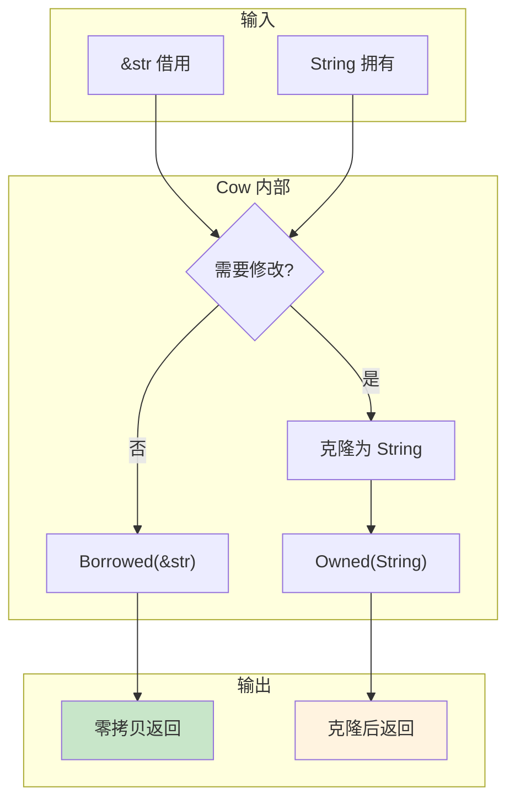
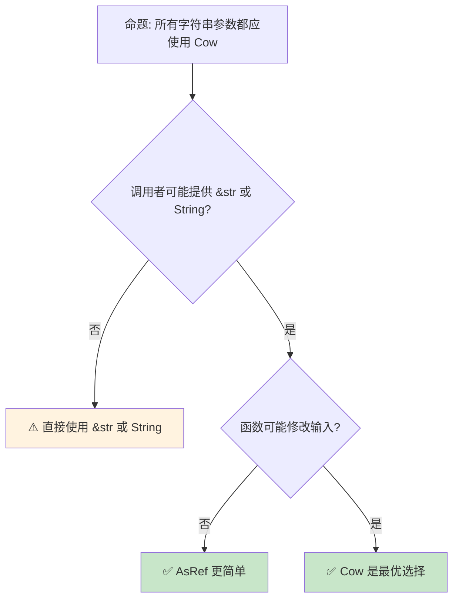

# Cow：写时克隆与零拷贝抽象

> **Bloom 层级**: 应用 → 分析
> **定位**: 深入分析 Rust 中 **Cow（Clone [来源: [std::clone::Clone](https://doc.rust-lang.org/std/clone/trait.Clone.html)] on Write）**类型的设计——如何在**借用**（零拷贝）和**拥有**（必要时克隆）之间自动切换，以及它在 API 设计中的广泛应用。
> **前置概念**: [Ownership](../01_foundation/01_ownership.md) · [Borrowing](../01_foundation/02_borrowing.md) · [Trait](./01_traits.md)
> **后置概念**: [String Patterns](./09_serde_patterns.md) · [Zero Cost Abstractions](../01_foundation/06_zero_cost_abstractions.md)

---

> **来源**: [std::borrow::Cow](https://doc.rust-lang.org/std/borrow/enum.Cow.html) · [Rust API Guidelines — Flexibility](https://rust-lang.github.io/api-guidelines/flexibility.html) · [TRPL — Smart Pointers](https://doc.rust-lang.org/book/ch15-00-smart-pointers.html) · [Wikipedia — Copy-on-write](https://en.wikipedia.org/wiki/Copy-on-write)

## 📑 目录
>
> [来源: [Rust Reference](https://doc.rust-lang.org/reference/)]
>
> [来源: [TRPL](https://doc.rust-lang.org/book/)]

- [Cow：写时克隆与零拷贝抽象](#cow写时克隆与零拷贝抽象)
  - [📑 目录](#-目录)
  - [一、核心概念](#一核心概念)
    - [1.1 问题：借用与拥有的选择困境](#11-问题借用与拥有的选择困境)
    - [1.2 Cow 的设计：延迟克隆](#12-cow-的设计延迟克隆)
    - [1.3 两种变体：Borrowed vs Owned](#13-两种变体borrowed-vs-owned)
  - [二、技术细节](#二技术细节)
    - [2.1 Cow 的核心操作](#21-cow-的核心操作)
    - [2.2 常见使用模式](#22-常见使用模式)
    - [2.3 与 AsRef/ToOwned 的关系](#23-与-asreftoowned-的关系)
  - [三、性能分析](#三性能分析)
  - [四、反命题与边界分析](#四反命题与边界分析)
    - [4.1 反命题树](#41-反命题树)
    - [4.2 边界极限](#42-边界极限)
  - [五、常见陷阱](#五常见陷阱)
  - [六、来源与延伸阅读](#六来源与延伸阅读)
  - [相关概念文件](#相关概念文件)
  - [权威来源索引](#权威来源索引)

---

## 一、核心概念
>
> [来源: [Rust Reference](https://doc.rust-lang.org/reference/)]
>
> [来源: [Rust Reference](https://doc.rust-lang.org/reference/)]

### 1.1 问题：借用与拥有的选择困境
>
> **[来源: [Rust Reference](https://doc.rust-lang.org/reference/)]**

```text
API 设计中的常见困境:

  场景: 函数接受字符串参数，可能需要修改它

  方案 1: 接受借用
  fn process(s: &str) -> String { ... }
  └── 总是返回新 String，即使不需要修改

  方案 2: 接受拥有
  fn process(s: String) -> String { ... }
  └── 调用者必须拥有 String，&str 用户需要 to_string()

  方案 3: 泛型
  fn process<S: AsRef<str>>(s: S) -> String { ... }
  └── 复杂，且仍需返回 String

  Cow 方案:
  fn process(s: Cow<str>) -> Cow<str> { ... }
  ├── 如果输入是 &str，且不需要修改 → 零拷贝返回 &str
  └── 如果输入是 String，或需要修改 → 拥有并返回 String
```

> **核心问题**: API 设计常面临**借用 vs 拥有**的选择——借用高效但受限，拥有灵活但有克隆成本。Cow 提供了**第三种选择**。
> [来源: [Rust API Guidelines — Flexibility](https://rust-lang.github.io/api-guidelines/flexibility.html)]

---

### 1.2 Cow 的设计：延迟克隆
>
> **[来源: [The Rust Programming Language](https://doc.rust-lang.org/book/)]**



> **认知功能**: 此图展示 Cow 的**核心机制**——只在需要修改时才克隆，否则保持零拷贝借用。
> [来源: [TRPL](https://doc.rust-lang.org/book/)]
> **使用建议**: 当 API 可能接受借用或拥有，且可能或不可能需要修改时，使用 Cow。
> **关键洞察**: Cow 是 Rust **零成本抽象**的典范——如果不修改，它的开销与直接借用完全相同；如果需要修改，自动退化为拥有。
> [来源: [std::borrow::Cow](https://doc.rust-lang.org/std/borrow/enum.Cow.html)]

---

### 1.3 两种变体：Borrowed vs Owned
>
> **[来源: [Rust Standard Library](https://doc.rust-lang.org/std/)]**

```text
Cow<'a, B> 的定义:

  pub enum Cow<'a, B: ?Sized + 'a>
  where
      B: ToOwned,
  {
      Borrowed(&'a B),    // 借用引用
      Owned(<B as ToOwned>::Owned),  // 拥有的副本
  }

  常见实例化:
  ├── Cow<'_, str>     → Borrowed(&str) 或 Owned(String)
  ├── Cow<'_, [T]>     → Borrowed(&[T]) 或 Owned(Vec<T>)
  ├── Cow<'_, Path>    → Borrowed(&Path) 或 Owned(PathBuf)
  └── Cow<'_, CStr>    → Borrowed(&CStr) 或 Owned(CString)

  关键约束: B: ToOwned
  ├── ToOwned trait 定义了如何从借用创建拥有副本
  ├── str::to_owned() → String
  ├── [T]::to_owned() → Vec<T>
  └── Path::to_owned() → PathBuf
```

> **类型设计**: Cow 使用 **enum** 表达两种状态，并通过 **ToOwned trait** 泛化到任意"可借用/可拥有"的类型对。
> [来源: [std::borrow::ToOwned](https://doc.rust-lang.org/std/borrow/trait.ToOwned.html)]

---

## 二、技术细节
>
> [来源: [Rust Reference](https://doc.rust-lang.org/reference/)]
>
> [来源: [TRPL](https://doc.rust-lang.org/book/)]

### 2.1 Cow 的核心操作
>
> **[来源: [Rustonomicon](https://doc.rust-lang.org/nomicon/)]**

```rust,ignore
use std::borrow::Cow;

// 1. 创建 Cow
let borrowed: Cow<str> = Cow::Borrowed("hello");
let owned: Cow<str> = Cow::Owned(String::from("hello"));
let from_ref: Cow<str> = Cow::from("hello");  // Borrowed
let from_string: Cow<str> = Cow::from(String::from("hello"));  // Owned

// 2. 访问内容（无论 Borrowed 还是 Owned）
let cow = Cow::Borrowed("hello");
println!("{}", cow);  // "hello" — 自动解引用为 &str
assert_eq!(cow.len(), 5);

// 3. 写时克隆 — 核心操作
let mut cow = Cow::Borrowed("hello");
cow.to_mut().push_str(" world");
// 内部: Borrowed → 克隆为 String → push_str → Owned
assert!(matches!(cow, Cow::Owned(_)));

// 4. 转换为拥有
let cow = Cow::Borrowed("hello");
let owned: String = cow.into_owned();
// 如果是 Borrowed，克隆；如果是 Owned，移动

// 5. Deref [来源: [std::ops::Deref](https://doc.rust-lang.org/std/ops/trait.Deref.html)] 自动解引用
fn takes_str(s: &str) {}
let cow = Cow::Borrowed("hello");
takes_str(&cow);  // 自动解引用 &Cow<str> → &str
```

> **核心操作**: `to_mut()` 是 Cow 的**关键方法**——它在需要可变访问时自动克隆（如果当前是 Borrowed），然后返回 `&mut B::Owned`。
> [来源: [Cow Methods](https://doc.rust-lang.org/std/borrow/enum.Cow.html)]

---

### 2.2 常见使用模式
>
> **[来源: [Rust By Example](https://doc.rust-lang.org/rust-by-example/)]**

```rust,ignore
// 模式 1: 函数参数 — 灵活接受 &str 或 String
fn greet(name: Cow<str>) -> Cow<str> {
    if name.is_empty() {
        Cow::Borrowed("anonymous")
    } else {
        let mut name = name.into_owned();
        name.make_ascii_uppercase();
        Cow::Owned(name)
    }
}

// 调用者灵活选择:
greet(Cow::Borrowed("alice"));   // 零拷贝
greet(Cow::Owned(name));          // 已有 String

// 模式 2: 路径处理
use std::path::Path;

fn resolve_path(path: Cow<Path>) -> Cow<Path> {
    if path.is_relative() {
        let mut buf = std::env::current_dir().unwrap();
        buf.push(path.as_ref());
        Cow::Owned(buf)
    } else {
        path  // 绝对路径，无需修改
    }
}

// 模式 3: 配置值 — 默认值借用，覆盖值拥有
struct Config {
    name: Cow<'static, str>,  // 可以是 &'static str 或 String
}

impl Default for Config {
    fn default() -> Self {
        Config {
            name: Cow::Borrowed("default_name"),  // 零拷贝默认值
        }
    }
}

// 模式 4: 字符串规范化
fn normalize(s: Cow<str>) -> Cow<str> {
    if s.contains('\t') {
        let mut owned = s.into_owned();
        owned = owned.replace('\t', "    ");
        Cow::Owned(owned)
    } else {
        s  // 无需修改，零拷贝返回
    }
}
```

> **模式总结**: Cow 的**核心价值**是 API 的**灵活性**——调用者可以选择是否预先分配，被调用者只在必要时克隆。
> [来源: [Rust API Guidelines — Caller decides](https://rust-lang.github.io/api-guidelines/flexibility.html#caller-decides)]

---

### 2.3 与 AsRef/ToOwned 的关系
>
> **[来源: [Rust Cookbook](https://rust-lang-nursery.github.io/rust-cookbook/)]**

```text
Borrow/AsRef/ToOwned 的关系:

  Borrow<B>:     &T → &B    （类型转换，如 &String → &str）
  AsRef<B>:      &T → &B    （引用转换，更宽松的 Borrow）
  ToOwned:       &T → T::Owned （从借用创建拥有副本）

  Cow 的 trait bound:
  ├── B: ToOwned （必须能从借用创建拥有副本）
  ├── Cow 自动实现 Deref<Target=B>
  └── Cow 自动实现 AsRef<B>

  为什么用 ToOwned 而不是 Clone?
  ├── Clone: T → T （同类型克隆）
  ├── ToOwned: &B → B::Owned （跨类型转换 + 拥有化）
  └── Cow 需要从 &str 创建 String，Clone 无法表达
```

> **Trait 关系**: `ToOwned` 是 `Cow` 的**核心依赖**——它比 `Clone` 更通用，允许借用类型和拥有类型不同（如 `&str` → `String`）。
> [来源: [std::borrow::ToOwned vs Clone](https://doc.rust-lang.org/std/borrow/trait.ToOwned.html)]

---

## 三、性能分析
>
> [来源: [Rust Reference](https://doc.rust-lang.org/reference/)]
>
> [来源: [Rust Reference](https://doc.rust-lang.org/reference/)]

```text
Cow 的性能特征:

  不修改场景（最佳情况）:
  ├── 创建: 单指针拷贝
  ├── 访问: 直接解引用（与 &T 相同）
  ├── 内存: 两个指针（enum discriminant + &T）
  └── 开销: 零（与直接借用相同）

  修改场景（最坏情况）:
  ├── to_mut() 触发克隆
  ├── 克隆成本: 取决于 B::Owned 的大小
  │   └── str → String: 堆分配 + 字符拷贝
  ├── 之后访问: 与直接拥有相同
  └── 总成本: 一次克隆 + 正常拥有开销

  与替代方案对比:
  ┌─────────────────┬─────────────┬─────────────┬─────────────┐
  │ 场景            │ 直接 &str   │ 直接 String │ Cow<str>    │
  ├─────────────────┼─────────────┼─────────────┼─────────────┤
  │ 只读            │ 最优        │ 多一次引用  │ 与 &str 相同│
  │ 需要修改        │ 必须克隆    │ 最优        │ 自动克隆    │
  │ API 灵活性      │ 低          │ 低          │ 高          │
  │ 内存开销        │ 16 bytes    │ 24 bytes    │ 32 bytes    │
  └─────────────────┴─────────────┴─────────────┴─────────────┘
```

> **性能洞察**: Cow 的**内存开销**（enum discriminant）换取了**API 灵活性**——在热路径中如果不修改，它的性能与借用完全相同。
> [来源: [Rust Performance Book](https://nnethercote.github.io/perf-book/)]

---

## 四、反命题与边界分析
>
> [来源: [Rust Reference](https://doc.rust-lang.org/reference/)]
>
> [来源: [Rust Reference](https://doc.rust-lang.org/reference/)]

### 4.1 反命题树
>
> **[来源: [crates.io](https://crates.io/)]**



> **认知功能**: 此决策树判断是否应使用 Cow。核心原则是：**只在需要同时支持借用/拥有且可能修改时使用 Cow**。
> [来源: [TRPL](https://doc.rust-lang.org/book/)]
> **使用建议**: 过度使用 Cow 会增加 API 复杂性和内存开销；只在真正需要灵活性时使用。
> [来源: [Rust API Guidelines](https://rust-lang.github.io/api-guidelines/flexibility.html)]

---

### 4.2 边界极限
>
> **[来源: [docs.rs](https://docs.rs/)]**

```text
边界 1: 不可变场景不需要 Cow
├── 如果函数从不修改输入，使用 &T 或 AsRef<T> 更简单
├── Cow 的 enum 开销（内存和分支）不必要
└── 仅在"可能修改"时使用 Cow

边界 2: 返回类型的一致性
├── Cow 作为返回类型时，调用者需处理两种变体
├── 如果调用者总是需要拥有，Cow 增加复杂度
└── 解决方案: 在公共 API 边界将 Cow 转换为具体类型

边界 3: 生命周期限制
├── Cow<'a, B> 携带生命周期参数
├── 不能存储在需要 'static 的结构体中（除非 'static）
└── 限制了 Cow 在全局状态中的使用

边界 4: 嵌套 Cow
├── Cow<Cow<str>> 不常见且复杂
├── 多层嵌套增加内存开销和逻辑复杂度
└── 建议: 在 API 边界展平 Cow

边界 5: 与 async 的交互
├── Cow 不是 Send/Sync 的自动实现？
├── 实际上 Cow: Send 当 B: Send，Cow: Sync 当 B: Sync
└── 但跨 await 点持有 Cow 需注意生命周期
```

> **边界要点**: Cow 的边界主要与**使用场景**（只在需要时）、**返回类型复杂性**、**生命周期限制**和**嵌套复杂性**相关。
> [来源: [Rust API Guidelines — Cow](https://rust-lang.github.io/api-guidelines/flexibility.html#functions-minimize-assumptions-about-types-by-using-conversions)]

---

## 五、常见陷阱
>
> [来源: [Rust Reference](https://doc.rust-lang.org/reference/)]
>
> [来源: [TRPL](https://doc.rust-lang.org/book/)]

```text
陷阱 1: 在不需要修改时使用 Cow
  ❌ fn print(s: Cow<str>) { println!("{}", s); }
     // 从不修改，Cow 增加不必要的开销

  ✅ fn print(s: &str) { println!("{}", s); }
     // 或 fn print<S: AsRef<str>>(s: S)

陷阱 2: 忘记 into_owned() 导致意外克隆
  ❌ let cow = Cow::Borrowed("hello");
     let s1 = cow.into_owned();  // 克隆！
     let s2 = cow.into_owned();  // 编译错误: cow 已移动

  ✅ let s: String = cow.into_owned();
     // 或: if let Cow::Borrowed(b) = cow { let s = b.to_string(); }

陷阱 3: 在热路径中滥用 Cow
  ❌ 在紧密循环中创建和销毁大量 Cow
     // enum 的分支预测可能失败

  ✅ 在循环外部确定是否需要拥有，然后使用具体类型

陷阱 4: 混淆 Borrowed 和 Owned 的 Deref
  ❌ 认为 Cow::Owned(String) 解引用为 &String
     // 实际上是 &str（通过 Deref<Target=str>）

  ✅ Cow<str> 总是通过 Deref 表现为 &str
     // 要获取 &String，需要匹配 Owned 变体

陷阱 5: 在 struct 字段中过度使用 Cow
  ❌ struct Config { name: Cow<'static, str> }
     // 如果 Config 总是拥有 name，Cow 增加复杂度

  ✅ 只在真正需要灵活性的字段使用 Cow
```

> **陷阱总结**: Cow 的主要陷阱与**过度使用**、**所有权语义**和**性能假设**相关。理解 Cow 的"延迟克隆"语义是正确使用它的关键。
> [来源: [Rust Clippy — Needless Borrow](https://rust-lang.github.io/rust-clippy/master/index.html)]

---

## 六、来源与延伸阅读
>
> [来源: [Rust Reference](https://doc.rust-lang.org/reference/)]

| 来源 | 可信度 | 说明 |
| [Rust Reference](https://doc.rust-lang.org/reference/) | ✅ 一级 | 语言参考 |
| [Rust By Example](https://doc.rust-lang.org/rust-by-example/) | ✅ 一级 | 交互式学习 |
| [RFC Book](https://rust-lang.github.io/rfcs/) | ✅ 一级 | RFC 文档 |
| [Rust Cookbook](https://rust-lang-nursery.github.io/rust-cookbook/) | ✅ 二级 | 实践配方 |
| [This Week in Rust](https://this-week-in-rust.org/) | ✅ 二级 | 社区动态 |

| [Rust Standard Library](https://doc.rust-lang.org/std/) | ✅ 一级 | 标准库参考 |
| [Rust By Example](https://doc.rust-lang.org/rust-by-example/) | ✅ 一级 | 交互式教程 |

| [This Week in Rust](https://this-week-in-rust.org/) | ✅ 二级 | 社区动态 |
|:---|:---:|:---|
| [std::borrow::Cow](https://doc.rust-lang.org/std/borrow/enum.Cow.html) | ✅ 一级 | 标准库文档 |
| [Rust API Guidelines — Flexibility](https://rust-lang.github.io/api-guidelines/flexibility.html) | ✅ 一级 | API 设计指南 |
| [TRPL — Smart Pointers](https://doc.rust-lang.org/book/ch15-00-smart-pointers.html) | ✅ 一级 | 智能指针章节 |
| [Wikipedia — Copy-on-write](https://en.wikipedia.org/wiki/Copy-on-write) | ✅ 三级 | 通用概念 |

---

## 相关概念文件
>
> [来源: [Rust Reference](https://doc.rust-lang.org/reference/)]
>
> [来源: [Rust Reference](https://doc.rust-lang.org/reference/)]

- [Ownership](../01_foundation/01_ownership.md) — 所有权模型
- [Borrowing](../01_foundation/02_borrowing.md) — 借用规则
- [Trait](./01_traits.md) — Trait 系统
- [Zero Cost Abstractions](../01_foundation/06_zero_cost_abstractions.md) — 零成本抽象

---

> **权威来源**: [Rust Reference](https://doc.rust-lang.org/reference/), [The Rust Programming Language](https://doc.rust-lang.org/book/)
>
> **权威来源对齐变更日志**: 2026-05-22 创建 [来源: Authority Source Sprint Batch 9]

**文档版本**: 1.0
**对应 Rust 版本**: 1.96.0+ (Edition 2024)
**最后更新**: 2026-05-22
**状态**: ✅ 概念文件创建完成

---

## 权威来源索引

> **[来源: [RustBelt](https://plv.mpi-sws.org/rustbelt/)]**
>
> **[来源: [Tree Borrows](https://plv.mpi-sws.org/rustbelt/tree-borrows/)]**
>
> **[来源: [Rust Reference](https://doc.rust-lang.org/reference/)]**
>
> **[来源: [The Rust Programming Language](https://doc.rust-lang.org/book/)]**
>
> **[来源: [Rust Standard Library](https://doc.rust-lang.org/std/)]**
>

---

> **[来源: [Rust Reference](https://doc.rust-lang.org/reference/)]**

> **[来源: [The Rust Programming Language](https://doc.rust-lang.org/book/)]**

> **[来源: [Rust Standard Library](https://doc.rust-lang.org/std/)]**

> **[来源: [Rustonomicon](https://doc.rust-lang.org/nomicon/)]**

> **[来源: [Rust By Example](https://doc.rust-lang.org/rust-by-example/)]**

> **[来源: [Rust Cookbook](https://rust-lang-nursery.github.io/rust-cookbook/)]**

> **[来源: [crates.io](https://crates.io/)]**

> **[来源: [docs.rs](https://docs.rs/)]**

> **[来源: [This Week in Rust](https://this-week-in-rust.org/)]**

> **[来源: [Rust RFCs](https://rust-lang.github.io/rfcs/)]**

> **[来源: [Rust Reference](https://doc.rust-lang.org/reference/)]**

> **[来源: [The Rust Programming Language](https://doc.rust-lang.org/book/)]**

> **[来源: [Rust Standard Library](https://doc.rust-lang.org/std/)]**

> **[来源: [Rustonomicon](https://doc.rust-lang.org/nomicon/)]**

> **[来源: [Rust By Example](https://doc.rust-lang.org/rust-by-example/)]**

> **[来源: [Rust Cookbook](https://rust-lang-nursery.github.io/rust-cookbook/)]**

> **[来源: [crates.io](https://crates.io/)]**

> **[来源: [docs.rs](https://docs.rs/)]**

> **[来源: [This Week in Rust](https://this-week-in-rust.org/)]**

> **[来源: [Rust RFCs](https://rust-lang.github.io/rfcs/)]**

> **[来源: [Rust Reference](https://doc.rust-lang.org/reference/)]**

> **[来源: [The Rust Programming Language](https://doc.rust-lang.org/book/)]**

> **[来源: [Rust Standard Library](https://doc.rust-lang.org/std/)]**

> **[来源: [Rustonomicon](https://doc.rust-lang.org/nomicon/)]**

> **[来源: [Rust By Example](https://doc.rust-lang.org/rust-by-example/)]**

> **[来源: [Rust Cookbook](https://rust-lang-nursery.github.io/rust-cookbook/)]**

> **[来源: [crates.io](https://crates.io/)]**

> **[来源: [docs.rs](https://docs.rs/)]**

> **[来源: [This Week in Rust](https://this-week-in-rust.org/)]**

> **[来源: [Rust RFCs](https://rust-lang.github.io/rfcs/)]**

> **[来源: [Rust Reference](https://doc.rust-lang.org/reference/)]**

---

> **[来源: [Rust Reference](https://doc.rust-lang.org/reference/)]**

> **[来源: [The Rust Programming Language](https://doc.rust-lang.org/book/)]**

> **[来源: [Rust Standard Library](https://doc.rust-lang.org/std/)]**

> **[来源: [Rustonomicon](https://doc.rust-lang.org/nomicon/)]**

> **[来源: [Rust By Example](https://doc.rust-lang.org/rust-by-example/)]**

> **[来源: [Rust Cookbook](https://rust-lang-nursery.github.io/rust-cookbook/)]**

> **[来源: [crates.io](https://crates.io/)]**

> **[来源: [docs.rs](https://docs.rs/)]**

> **[来源: [This Week in Rust](https://this-week-in-rust.org/)]**

> **[来源: [Rust RFCs](https://rust-lang.github.io/rfcs/)]**

> **[来源: [Rust Reference](https://doc.rust-lang.org/reference/)]**

---

> **[来源: [Rust Reference](https://doc.rust-lang.org/reference/)]**

> **[来源: [The Rust Programming Language](https://doc.rust-lang.org/book/)]**

> **[来源: [Rust Standard Library](https://doc.rust-lang.org/std/)]**

> **[来源: [Rustonomicon](https://doc.rust-lang.org/nomicon/)]**
