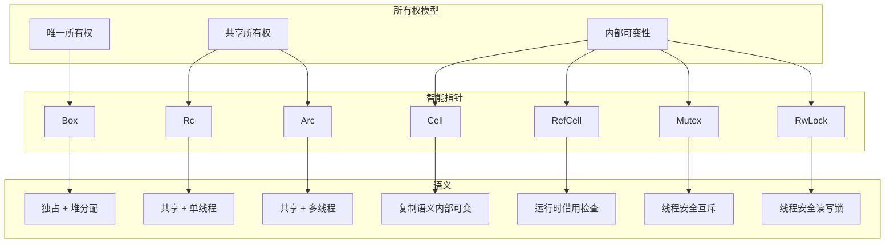
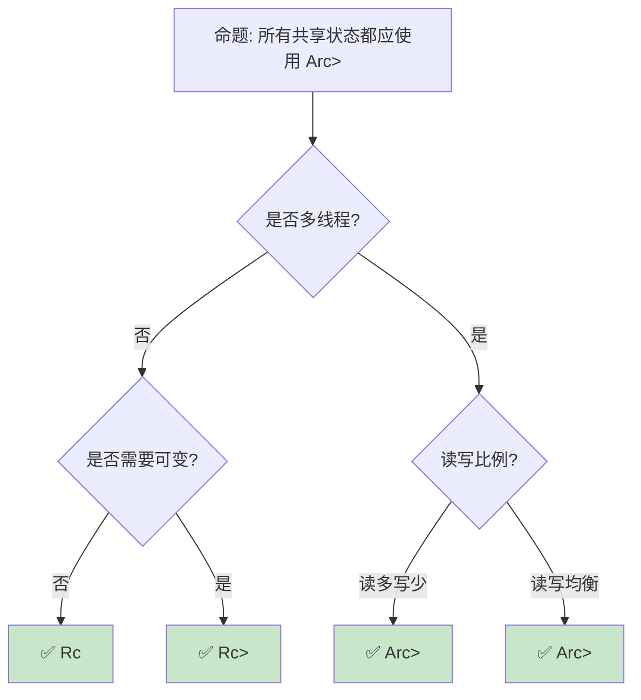

> **内容分级**: [综述级]

> **本节关键术语**: 智能指针 (Smart Pointer) · Box · Rc · Arc · RefCell · 自定义智能指针 — [完整对照表](../00_meta/terminology_glossary.md)
>
# 智能指针：堆内存管理与共享语义
>
> **EN**: Smart Pointers
> **Summary**: Smart Pointers. Core Rust concept covering mechanism analysis, design patterns, ownership and borrowing.
> **📎 交叉引用**
>
> 本主题在 knowledge 中有系统化的知识索引：[智能指针](../../knowledge/02_intermediate/04_smart_pointers.md)
> **受众**: [进阶]
> **Bloom 层级**: 应用 → 分析
> **A/S/P 标记**: **S+P** — Structure + Procedure
> **双维定位**: C×Eva — 评价不同智能指针的适用场景
> **定位**: 系统分析 Rust **智能指针**的设计——Box（独占堆分配）、Rc/Arc（引用计数共享）、RefCell/Cell（内部可变性）、以及它们的组合使用模式，揭示每种指针类型的所有权语义和适用场景。
> **前置概念**: [Ownership](../01_foundation/01_ownership.md) · [Borrowing](../01_foundation/02_borrowing.md) · [Memory Management](./03_memory_management.md)
> **后置概念**: [Pin](../03_advanced/06_pin_unpin.md) · [Cow](./11_cow_and_borrowed.md)

---

> **来源**:
> [std::boxed::Box](https://doc.rust-lang.org/std/boxed/struct.Box.html) ·
> [std::rc::Rc](https://doc.rust-lang.org/std/rc/struct.Rc.html) ·
> [std::sync::Arc](https://doc.rust-lang.org/std/sync/struct.Arc.html) ·
> [std::cell::RefCell](https://doc.rust-lang.org/std/cell/struct.RefCell.html) ·
> [TRPL Ch15 — Smart Pointers](https://doc.rust-lang.org/book/ch15-00-smart-pointers.html) ·
> [Rustonomicon — Interior Mutability](https://doc.rust-lang.org/nomicon/interior-mutability.html)

## 📑 目录

- [智能指针：堆内存管理与共享语义](#智能指针堆内存管理与共享语义)
  - [📑 目录](#-目录)
  - [一、核心概念](#一核心概念)
    - [1.1 智能指针谱系](#11-智能指针谱系)
    - [1.2 Box：独占堆分配](#12-box独占堆分配)
    - [1.3 Rc 与 Arc：引用计数共享](#13-rc-与-arc引用计数共享)
  - [二、技术细节](#二技术细节)
    - [2.1 RefCell 与 Cell：内部可变性](#21-refcell-与-cell内部可变性)
    - [2.2 智能指针的组合模式](#22-智能指针的组合模式)
    - [2.3 性能特征对比](#23-性能特征对比)
  - [三、选型决策矩阵](#三选型决策矩阵)
  - [四、反命题与边界分析](#四反命题与边界分析)
    - [4.1 反命题树](#41-反命题树)
    - [4.2 边界极限](#42-边界极限)
  - [五、常见陷阱](#五常见陷阱)
    - [编译错误示例](#编译错误示例)
    - [4.4 边界测试：`Rc` 循环引用导致内存泄漏（逻辑错误）](#44-边界测试rc-循环引用导致内存泄漏逻辑错误)
    - [4.5 边界测试：`Box::leak` 后尝试回收（编译错误）](#45-边界测试boxleak-后尝试回收编译错误)
  - [六、来源与延伸阅读](#六来源与延伸阅读)
  - [相关概念文件](#相关概念文件)
  - [逆向推理链（Backward Reasoning）](#逆向推理链backward-reasoning)
  - [权威来源索引](#权威来源索引)
    - [10.3 边界测试：`Pin<&mut Self>` 在 trait 方法中的约束（编译错误）](#103-边界测试pinmut-self-在-trait-方法中的约束编译错误)
    - [10.4 边界测试：`Arc<RefCell<T>>` 的线程安全幻觉（编译错误）](#104-边界测试arcrefcellt-的线程安全幻觉编译错误)
  - [实践](#实践)
  - [参考来源](#参考来源)
  - [嵌入式测验（Embedded Quiz）](#嵌入式测验embedded-quiz)
    - [测验 1：Box 的用途（理解层）](#测验-1box-的用途理解层)
    - [测验 2：Rc vs Arc（应用层）](#测验-2rc-vs-arc应用层)
    - [测验 3：Weak 指针的作用（应用层）](#测验-3weak-指针的作用应用层)
    - [测验 4：Deref 与智能指针（分析层）](#测验-4deref-与智能指针分析层)
    - [测验 5：Drop 顺序（分析层）](#测验-5drop-顺序分析层)
  - [认知路径](#认知路径)
    - [核心推理链](#核心推理链)
    - [反命题与边界](#反命题与边界)

---

## 一、核心概念

### 1.1 智能指针谱系



> **认知功能**: 此图展示 Rust 智能指针的**三维分类**——所有权（唯一/共享）、线程安全（单线程/多线程）、可变性（外部/内部）。每种智能指针对应特定的语义组合。
> [来源: [TRPL](https://doc.rust-lang.org/book/)]
> **使用建议**: 根据"是否需要共享"和"是否需要线程安全"两个维度快速定位合适的智能指针。
> **关键洞察**: Rust 的智能指针不是 C++ 的"自动释放指针"——它们是**所有权的显式表达**，每种类型都对应一种特定的所有权语义。
> [来源: [TRPL Ch15 — Smart Pointers](https://doc.rust-lang.org/book/ch15-00-smart-pointers.html)]

---

### 1.2 Box：独占堆分配
>

```text
Box<T> 的设计:

  语义: T 在堆上分配，Box 拥有唯一的所有权
  大小: 一个指针（usize）
  开销: 一次堆分配

  使用场景:
  ├── 递归类型（如链表、树）
  │   └── enum List { Cons(i32, Box<List>), Nil }
  ├── 大对象转移所有权时避免拷贝
  ├── trait object（dyn Trait）
  │   └── Box<dyn Trait> = 拥有 dyn Trait 的堆分配
  └── 与 FFI 交互（C 返回的指针）

  与 C++ unique_ptr 的对比:
  ┌─────────────────┬─────────────────┬─────────────────┐
  │ 特性            │ Box<T>          │ unique_ptr<T>   │
  ├─────────────────┼─────────────────┼─────────────────┤
  │ 所有权          │ 唯一            │ 唯一            │
  │ 可否为空        │ 否（必须初始化） │ 可以（nullptr）  │
  │ 释放            │ 自动（Drop）     │ 自动            │
  │ 自定义分配器    │ nightly (Allocator API) │ 支持         │
  │ 大小            │ 1 指针          │ 1-2 指针        │
  └─────────────────┴─────────────────┴─────────────────┘
```

> **Box 洞察**: Box 是 Rust 中最简单的智能指针——它只做一件事：在堆上分配并管理内存。它的设计哲学是**最小化**——没有可选的空值，没有自定义删除器（stable），只有一个指针的开销。
> [来源: [std::boxed::Box](https://doc.rust-lang.org/std/boxed/struct.Box.html)]

---

### 1.3 Rc 与 Arc：引用计数共享
>

```rust,ignore
use std::rc::Rc;
use std::sync::Arc;

// Rc: 单线程引用计数
let data = Rc::new(vec![1, 2, 3]);
let data2 = Rc::clone(&data);  // 引用计数 +1
// data 和 data2 共享同一 Vec
// Rc::strong_count(&data) == 2

// Arc: 多线程引用计数（原子操作）
let data = Arc::new(vec![1, 2, 3]);
let data2 = Arc::clone(&data);  // 原子引用计数 +1
// 可安全跨线程共享

// Rc/Arc 的限制:
// - 只提供不可变访问（默认）
// - 要修改内容，需要配合 RefCell/Mutex
// - 循环引用会导致内存泄漏（需 Weak 打破）

// Weak: 不增加引用计数的弱引用
let weak = Rc::downgrade(&data);
// weak.upgrade() → Option<Rc<T>>
// 用于打破循环引用（如父子树结构）
```

> **Rc/Arc 洞察**: `Rc::clone` 不是深拷贝——它只是增加引用计数。这与 Rust 的**显式性**哲学一致：看起来像 clone 的操作实际上是廉价的，但语法上明确表达了"共享"。
> [来源: [std::rc::Rc](https://doc.rust-lang.org/std/rc/struct.Rc.html)] · [来源: [std::sync::Arc](https://doc.rust-lang.org/std/sync/struct.Arc.html)]

---

## 二、技术细节

### 2.1 RefCell 与 Cell：内部可变性
>

```text
内部可变性的核心思想:

  编译期借用检查无法处理的场景:
  ├── 运行时才能确定的可变借用
  ├── 单线程内共享可变状态
  └── 需要绕过编译器的静态检查

  Cell<T>（T: Copy）:
  ├── 通过值拷贝实现内部可变
  ├── get() → 拷贝出值
  ├── set() → 写入新值（拷贝）
  └── 无运行时借用检查开销

  RefCell<T>:
  ├── 运行时借用检查（借用规则在运行时执行）
  ├── borrow() → &T（运行时检查，可能 panic）
  ├── borrow_mut() → &mut T（运行时检查，可能 panic）
  └── try_borrow() / try_borrow_mut() → Result（不 panic）

  与 Mutex/RwLock 的关系:
  ┌─────────────┬─────────────┬─────────────┬─────────────┐
  │ 特性        │ Cell<T>     │ RefCell<T>  │ Mutex<T>    │
  ├─────────────┼─────────────┼─────────────┼─────────────┤
  │ 线程安全    │ 否          │ 否          │ 是          │
  │ 检查时机    │ 无          │ 运行时      │ 运行时      │
  │ 失败行为    │ N/A         │ panic       │ 阻塞/死锁   │
  │ 适用类型    │ Copy        │ 任意        │ 任意        │
  │ 开销        │ 最低        │ 低          │ 高（系统调用│
  └─────────────┴─────────────┴─────────────┴─────────────┘
```

> **内部可变性洞察**: Cell/RefCell 是 Rust **借用规则的逃逸舱口**——当编译器无法证明借用安全时，将检查推迟到运行时。这是**性能 vs 安全**的权衡。
> [来源: [Rustonomicon — Interior Mutability](https://doc.rust-lang.org/nomicon/interior-mutability.html)]

---

### 2.2 智能指针的组合模式
>

```rust,ignore
// 模式 1: Rc<RefCell<T>> — 单线程共享可变
use std::rc::Rc;
use std::cell::RefCell;

let shared = Rc::new(RefCell::new(5));
*shared.borrow_mut() += 1;  // 通过 Rc 共享，通过 RefCell 修改

// 模式 2: Arc<Mutex<T>> — 多线程共享可变
use std::sync::{Arc, Mutex};

let shared = Arc::new(Mutex::new(5));
*shared.lock().unwrap() += 1;  // 线程安全地修改

// 模式 3: Arc<RwLock<T>> — 多线程读多写少
use std::sync::{Arc, RwLock};

let shared = Arc::new(RwLock::new(vec![1, 2, 3]));
{
    let read = shared.read().unwrap();
    println!("{:?}", *read);  // 多个读者并发
}
{
    let mut write = shared.write().unwrap();
    write.push(4);  // 独占写者
}

// 模式 4: Box<RefCell<T>> — 堆分配 + 内部可变
let boxed = Box::new(RefCell::new(vec![1, 2, 3]));
boxed.borrow_mut().push(4);

// 模式 5: Weak 打破循环引用
use std::rc::{Rc, Weak};

struct Node {
    value: i32,
    parent: Weak<Node>,      // 弱引用，不增加计数
    children: Vec<Rc<Node>>, // 强引用
}
```

> **组合模式**: Rust 的智能指针通过**组合**表达复杂的所有权语义——`Rc<RefCell<T>>` = 共享 + 可变，`Arc<Mutex<T>>` = 跨线程共享 + 互斥可变。
> [来源: [TRPL — RefCell](https://doc.rust-lang.org/book/ch15-05-interior-mutability.html)]

---

### 2.3 性能特征对比
>

```text
性能特征汇总:

  分配开销:
  ├── Box<T>: 1 次堆分配
  ├── Rc<T>: 1 次堆分配（数据 + 2×usize 计数器）
  ├── Arc<T>: 1 次堆分配（数据 + 2×AtomicUsize 计数器）
  ├── RefCell<T>: 内联（在包裹的指针内）
  └── Mutex<T>: 内联（OS 互斥量，通常 40+ bytes）

  访问开销:
  ├── Box<T>: 1 次解引用（与 &T 相同）
  ├── Rc<T>: 1 次解引用
  ├── Arc<T>: 1 次解引用 + 原子操作（clone/drop）
  ├── Cell<T>: 值拷贝（Copy 类型）
  ├── RefCell<T>: 运行时借用检查（usize 计数器）
  ├── Mutex<T>: OS 锁操作（数十到数百纳秒）
  └── RwLock<T>: OS 读写锁（比 Mutex 轻量，但仍有系统调用）

  内存布局:
  ├── Box<T>: [ptr] → [T on heap]
  ├── Rc<T>: [ptr] → [strong: usize, weak: usize, T on heap]
  ├── Arc<T>: [ptr] → [strong: AtomicUsize, weak: AtomicUsize, T on heap]
  └── RefCell<T>: [borrow: isize, T]
```

> **性能洞察**: 智能指针的选择是**开销与能力**的权衡——从 Box（最低开销，最少能力）到 `Arc<Mutex<T>>`（最高开销，最多能力）。
> [来源: [Rust Performance Book](https://nnethercote.github.io/perf-book/)]

---

## 三、选型决策矩阵

```text
场景 → 推荐智能指针 → 关键理由

独占堆分配:
  → Box<T>
  → 最小开销，唯一所有权

单线程共享只读:
  → Rc<T>
  → 引用计数，无原子开销

多线程共享只读:
  → Arc<T>
  → 原子引用计数，Send + Sync

单线程共享可变:
  → Rc<RefCell<T>>
  → 共享 + 运行时借用检查

多线程共享可变:
  → Arc<Mutex<T>> 或 Arc<RwLock<T>>
  → 线程安全 + 互斥访问

需要可能为空的共享指针:
  → Rc<Option<T>> 或 Weak<T>
  → Rc 本身不可空，需配合 Option 或 Weak

缓存行优化（高频读写）:
  → crossbeam::atomic::AtomicCell（如果可用）
  → 或 parking_lot::Mutex（更轻量）
```

> **选型原则**: 从**最少能力**开始——先用 Box，不够再加 Rc/Arc，需要可变再加 RefCell/Mutex。
> [来源: [Rust API Guidelines](https://rust-lang.github.io/api-guidelines/flexibility.html)]

---

## 四、反命题与边界分析

### 4.1 反命题树
>



> **认知功能**: 此决策树帮助选择合适的智能指针组合。核心原则是：**单线程优先于多线程，读共享优先于写互斥**。
> [来源: [Rust Performance Book — Concurrency](https://nnethercote.github.io/perf-book/concurrency.html)]

---

### 4.2 边界极限
>

```text
边界 1: Rc/Arc 的循环引用
├── Rc 强引用循环导致内存泄漏
├── 解决方案: 使用 Weak 打破循环
├── 但 Weak 增加了 API 复杂度
└── 如果可能，重新设计为树结构（父 Weak，子 Strong）

边界 2: RefCell 的运行时 panic
├── borrow_mut() 在已有借用时 panic
├── 不是线程安全的 panic（单线程内也会 panic）
├── 无法完全静态预防
└── 缓解: 使用 try_borrow_mut() 并处理错误

边界 3: Mutex 的死锁
├── 多 Mutex 的获取顺序可能导致死锁
├── Rust 编译器无法检测运行时死锁
├── 与 C++/Java 的 Mutex 有相同风险
└── 缓解: 锁顺序规范、lock ordering 静态分析

边界 4: Arc 的原子操作开销
├── Arc::clone 需要原子递增
├── 在单线程中不需要，但 Arc 无法知道
├── 高频 clone/drop 可能成为瓶颈
└── 缓解: 在单线程中使用 Rc，仅在跨线程边界转为 Arc

边界 5: Send/Sync 的自动推导
├── Rc<T>: !Send, !Sync（即使 T: Send + Sync）
├── RefCell<T>: !Sync（即使 T: Sync）
├── 这些限制是 deliberate 设计，不能 unsafe 绕过
└── 需要 Send/Sync 时，使用 Arc/Mutex 替代
```

> **边界要点**: 智能指针的边界主要与**循环引用**、**运行时 panic**、**死锁**、**原子开销**和**Send/Sync 限制**相关。
> [来源: [Rustonomicon — Send and Sync](https://doc.rust-lang.org/nomicon/send-and-sync.html)]

---

## 五、常见陷阱
>

```text
陷阱 1: 混淆 clone 的语义
  ❌ let data2 = data.clone();  // data 是 Rc<Vec<i32>>
     // 看起来像深拷贝，实际是引用计数 +1

  ✅ Rc::clone(&data) 语义明确
     // 但 Vec::clone 语义不同（深拷贝）
     // 需根据具体类型理解 clone 行为

陷阱 2: RefCell 的借用冲突
  ❌ let refcell = RefCell::new(vec![1, 2, 3]);
     let borrow1 = refcell.borrow();
     let borrow2 = refcell.borrow_mut();  // panic!
     // 不可变借用和可变借用共存

  ✅ 确保借用不重叠
     // 或使用 try_borrow_mut() 安全处理

陷阱 3: Arc<RefCell<T>> 的线程安全幻觉
  ❌ let shared = Arc::new(RefCell::new(5));
     // RefCell 不是 Sync，Arc<RefCell<T>> 不可跨线程

  ✅ Arc<Mutex<T>> 或 Arc<RwLock<T>>
     // 真正线程安全的内部可变性

陷阱 4: Mutex 守卫的生命周期
  ❌ let data = shared.lock().unwrap();
     drop(data);  // 显式释放锁
     // 更好的做法: 使用作用域

  ✅ {
       let data = shared.lock().unwrap();
       // 使用 data
     }  // 锁在这里自动释放

陷阱 5: 过度使用智能指针
  ❌ 对所有字段使用 Rc<RefCell<T>>
     // 放弃了 Rust 的编译期安全保证

  ✅ 优先使用普通引用和所有权转移
     // 智能指针是"逃生舱"，不是默认选择
```

> **陷阱总结**: 智能指针的陷阱主要与**语义混淆**、**借用冲突**、**线程安全误解**和**过度使用**相关。理解每种指针的所有权语义是避免陷阱的关键。
> [来源: [Rust Clippy — Rc clone](https://rust-lang.github.io/rust-clippy/master/index.html)]

### 编译错误示例

```rust,compile_fail
use std::rc::Rc;
use std::thread;

fn rc_not_send() {
    let data = Rc::new(42);
    // ❌ 编译错误: `Rc<i32>` 未实现 `Send`
    // Rc 使用非原子引用计数，不能安全跨线程转移所有权
    thread::spawn(move || {
        println!("{}", *data);
    });
}
```

> **修正**: 需要跨线程共享时使用 `Arc<T>` 替代 `Rc<T>`。

```rust,ignore
use std::pin::Pin;

struct SelfReferential {
    data: String,
    ptr: *const String, // 指向 data 的指针
}

fn pin_unpin_misuse() {
    let mut x = SelfReferential {
        data: String::from("hello"),
        ptr: std::ptr::null(),
    };
    // ❌ 编译错误: `SelfReferential` 未实现 `Unpin`
    // 若类型包含自引用，Pin::new 要求类型实现 Unpin
    let pinned = Pin::new(&mut x);
}
```

> **修正**: 对可能自引用的类型使用 `Pin::new_unchecked`（unsafe）或通过 `Box::pin` 固定到堆上。

```rust,ignore
use std::pin::Pin;

fn pin_mut_after_pin() {
    let mut x = String::from("hello");
    let pinned = Pin::new(&mut x);
    // ❌ 编译错误: 无法获取已固定引用的可变引用
    // Pin<&mut T> 阻止了获取 &mut T 的能力（除非 T: Unpin）
    let r = &mut x;
}
```

> **修正**: `Pin<&mut T>` 的设计目的是防止自引用类型在移动后失效。一旦值被 Pin 固定，除非 `T: Unpin`，否则无法获取可变引用。

### 4.4 边界测试：`Rc` 循环引用导致内存泄漏（逻辑错误）

```rust
use std::rc::Rc;
use std::cell::RefCell;

struct Node {
    next: RefCell<Option<Rc<Node>>>,
}

fn main() {
    let a = Rc::new(Node { next: RefCell::new(None) });
    let b = Rc::new(Node { next: RefCell::new(Some(Rc::clone(&a))) });
    // ⚠️ 逻辑错误: 循环引用导致内存泄漏
    *a.next.borrow_mut() = Some(Rc::clone(&b)); // a ↔ b 互相引用
    // Rc 引用计数永远不会归零，Node 永远不会被释放
}

// 正确: 使用 Weak 打破循环
use std::rc::Weak;

struct NodeFixed {
    next: RefCell<Option<Weak<NodeFixed>>>,
}

fn fixed() {
    let a = Rc::new(NodeFixed { next: RefCell::new(None) });
    let b = Rc::new(NodeFixed { next: RefCell::new(Some(Rc::downgrade(&a))) });
    *a.next.borrow_mut() = Some(Rc::downgrade(&b)); // ✅ Weak 不增加强引用计数
}
```

> **修正**: `Rc` 的强引用循环会导致内存泄漏（引用计数永不为零）。使用 `Weak<T>`（弱引用）打破循环——弱引用不阻止对象被释放。这是 Rust 显式内存管理的代价：编译器不检测循环引用，需开发者自行设计。[来源: [The Rust Programming Language](https://doc.rust-lang.org/book/)]

### 4.5 边界测试：`Box::leak` 后尝试回收（编译错误）

```rust,compile_fail
fn main() {
    let b = Box::new(42);
    let r: &'static i32 = Box::leak(b); // 泄漏 Box，获得 'static 引用
    // ❌ 编译错误: value used here after move
    println!("{}", b); // b 已被 leak 消耗
}

// 正确: leak 后只能通过返回的引用访问
fn fixed() {
    let r: &'static i32 = Box::leak(Box::new(42));
    println!("{}", r); // ✅ 通过 'static 引用访问
}
```

> **修正**: `Box::leak` 消耗 `Box` 的所有权并返回 `&'static T`。`Box` 本身不再可用。此操作将堆内存转为静态引用，内存永远不会被释放（除非程序结束）。仅在确实需要 `'static` 生命周期时使用。[来源: [Rust Standard Library](https://doc.rust-lang.org/std/)]

---

## 六、来源与延伸阅读

| 来源 | 可信度 | 说明 |
|:---|:---:|:---|
| [std::boxed::Box](https://doc.rust-lang.org/std/boxed/struct.Box.html) | ✅ 一级 | 标准库文档 |
| [std::rc::Rc](https://doc.rust-lang.org/std/rc/struct.Rc.html) | ✅ 一级 | 标准库文档 |
| [std::sync::Arc](https://doc.rust-lang.org/std/sync/struct.Arc.html) | ✅ 一级 | 标准库文档 |
| [TRPL Ch15 — Smart Pointers](https://doc.rust-lang.org/book/ch15-00-smart-pointers.html) | ✅ 一级 | 智能指针章节 |
| [Rustonomicon — Interior Mutability](https://doc.rust-lang.org/nomicon/interior-mutability.html) | ✅ 一级 | 内部可变性深入 |
| [Rust Performance Book](https://nnethercote.github.io/perf-book/) | ✅ 二级 | 性能优化指南 |

---

## 相关概念文件

- [Ownership](../01_foundation/01_ownership.md) — 所有权模型
- [Borrowing](../01_foundation/02_borrowing.md) — 借用规则
- [Memory Management](./03_memory_management.md) — 内存管理
- [Pin](../03_advanced/06_pin_unpin.md) — Pin 不动性
- [Cow](./11_cow_and_borrowed.md) — 写时克隆

---

> **权威来源**: [Rust Reference](https://doc.rust-lang.org/reference/), [The Rust Programming Language](https://doc.rust-lang.org/book/), [Rustonomicon](https://doc.rust-lang.org/nomicon/)
>
> **权威来源对齐变更日志**: 2026-05-22 创建 [来源: Authority Source Sprint Batch 9]

**文档版本**: 1.0
**对应 Rust 版本**: 1.96.0+ (Edition 2024)
**最后更新**: 2026-05-22
**状态**: ✅ 概念文件创建完成

---

## 逆向推理链（Backward Reasoning）

> **从编译错误反推**：
>
> ```text
> 智能指针安全 ⟸ Drop + Deref 协变
> ```
>
## 权威来源索引

>
>
>

---

---

---

### 10.3 边界测试：`Pin<&mut Self>` 在 trait 方法中的约束（编译错误）

```rust,ignore
use std::pin::Pin;

struct SelfReferential {
    data: String,
    ptr: *const String,
}

impl SelfReferential {
    fn new(data: String) -> Self {
        Self { data, ptr: std::ptr::null() }
    }

    // ❌ 编译错误: 不能用 &mut self 获取指向自身的指针
    fn init(&mut self) {
        self.ptr = &self.data;
    }
}

fn main() {
    let mut s = SelfReferential::new(String::from("hello"));
    s.init();
}
```

> **修正**: 自引用结构（self-referential struct）是 Rust 的**硬问题**：`&mut self` 允许移动 `self`（若 `Self: !Unpin`），但 `self.ptr` 指向 `self.data` 的地址，移动后 `ptr` 成为悬垂指针。`Pin` 是解决自引用的关键：`Pin<&mut Self>` 保证 `self` 在内存中不可移动（`!Unpin`），允许安全创建自引用。但 `Pin` 的 API 严格：`Pin::new_unchecked` 要求调用者保证对象永不被移动；`Box::pin` 是安全创建 `Pin<Box<T>>` 的标准方式。自引用是 async/await、生成器、Futures 的核心机制。这与 C++ 的 `this` 指针（无 Pin 约束，移动后自引用 UB）或 Swift 的引用类型（堆分配不移动）不同——Rust 通过 `Pin` 类型系统显式标记不可移动对象。[来源: [Rust Standard Library](https://doc.rust-lang.org/std/pin/struct.Pin.html)] · [来源: [The Rust Programming Language](https://doc.rust-lang.org/book/ch15-04-rc.html)]

### 10.4 边界测试：`Arc<RefCell<T>>` 的线程安全幻觉（编译错误）

```rust,compile_fail
use std::cell::RefCell;
use std::sync::Arc;
use std::thread;

fn main() {
    let data = Arc::new(RefCell::new(0));
    let d1 = Arc::clone(&data);
    let d2 = Arc::clone(&data);

    // ❌ 编译错误: RefCell 未实现 Sync，不能跨线程共享
    thread::spawn(move || {
        *d1.borrow_mut() += 1;
    });

    thread::spawn(move || {
        *d2.borrow_mut() += 1;
    });
}
```

> **修正**: `Arc<T>` 实现 `Send` + `Sync` 当且仅当 `T: Send + Sync`。`RefCell<T>` 不实现 `Sync`（单线程运行时借用检查），所以 `Arc<RefCell<T>>` 不能跨线程。线程安全的内部可变性：1) `Arc<Mutex<T>>` — 互斥锁；2) `Arc<RwLock<T>>` — 读写锁；3) `Arc<AtomicUsize>` — 无锁原子操作。`RefCell` 的设计：单线程场景下零开销（无原子操作），但线程间共享导致编译错误。这与 C++ 的 `std::shared_ptr<std::mutex>`（可跨线程，但需手动锁管理）或 Java 的 `AtomicInteger`（线程安全，但无 RefCell 的借用语义）不同——Rust 的类型系统通过 `Send`/`Sync` 在编译期排除不安全的线程共享。[来源: [The Rust Programming Language](https://doc.rust-lang.org/book/ch16-04-extensible-concurrency-sync-and-send.html)] · [来源: [Rust Standard Library](https://doc.rust-lang.org/std/cell/struct.RefCell.html)]

## 实践

> **相关资源**:
>
> - [crates/ 示例代码](../crates/) — 与本文概念对应的可编译示例
> - [exercises/ 练习](../exercises/) — 动手编程挑战
> - [MVP 学习路径](../00_meta/LEARNING_MVP_PATH.md) — 从零到多线程 CLI 的 40 小时路径
>
> **建议**: 阅读完本概念文件后，打开对应 crate 的示例代码，尝试修改并运行。完成至少 1 道相关练习以巩固理解。

## 参考来源

> [来源: [std::boxed::Box](https://doc.rust-lang.org/std/boxed/struct.Box.html)]

> [来源: [std::rc::Rc](https://doc.rust-lang.org/std/rc/struct.Rc.html)]

> [来源: [std::sync::Arc](https://doc.rust-lang.org/std/sync/struct.Arc.html)]

> [来源: [Rustonomicon — Rc and Arc](https://doc.rust-lang.org/nomicon/rc-mostly.html)]

> **权威来源**: [Rust Reference](https://doc.rust-lang.org/reference/) · [The Rust Programming Language](https://doc.rust-lang.org/book/) · [Rust Standard Library](https://doc.rust-lang.org/std/) · [Rustonomicon](https://doc.rust-lang.org/nomicon/)
> **对应 Rust 版本**: 1.96.0+ (Edition 2024)

## 嵌入式测验（Embedded Quiz）

### 测验 1：Box<T> 的用途（理解层）

`Box<T>` 最主要的作用是什么？

- A. 引用计数，允许多个所有者
- B. 在堆上分配数据，使类型大小确定（如递归枚举）
- C. 提供运行时借用检查

<details>
<summary>✅ 答案</summary>

**B. 在堆上分配数据，使类型大小确定（如递归枚举）**。

`Box<T>` 是最简单的智能指针：

- 在堆上分配 `T`，栈上只保留指针
- 实现 `Deref` 和 `Drop`，使用体验接近普通引用
- 使递归类型（如链表、树节点）的大小在编译期确定

`Box` 是**唯一所有权**，不同于 `Rc`（共享所有权）或 `RefCell`（运行时借用检查）。
</details>

---

### 测验 2：Rc vs Arc（应用层）

以下场景应该选择 `Rc<T>` 还是 `Arc<T>`？

```rust
// 场景 A: 单线程图遍历，节点间共享子节点
// 场景 B: 多线程共享配置数据
```

- A. A-Arc, B-Rc
- B. A-Rc, B-Arc
- C. 两者都用 Arc

<details>
<summary>✅ 答案</summary>

**B. A-Rc, B-Arc**。

| 类型 | 线程安全 | 开销 | 场景 |
|:---|:---|:---|:---|
| `Rc<T>` | ❌ 单线程 | 较低（非原子计数） | 单线程数据结构 |
| `Arc<T>` | ✅ 多线程 | 较高（原子计数） | 跨线程共享 |

`Arc` 使用原子操作维护引用计数，因此是 `Send + Sync`（当 `T` 满足条件时）。单线程场景优先使用 `Rc` 以获得更好性能。
</details>

---

### 测验 3：Weak 指针的作用（应用层）

`Weak<T>` 在 `Rc<T>`/`Arc<T>` 中解决什么问题？

- A. 提供不可变共享访问
- B. 打破循环引用，避免内存泄漏
- C. 提供可变借用能力

<details>
<summary>✅ 答案</summary>

**B. 打破循环引用，避免内存泄漏**。

`Rc`/`Arc` 的强引用计数归零时才释放内存。若两个对象互相强引用（A→B, B→A），计数永远不会归零，导致内存泄漏。

`Weak<T>` 是**不增加强引用计数**的弱引用：

- `Rc::downgrade(&rc)` 创建 `Weak<T>`
- `weak.upgrade()` 返回 `Option<Rc<T>>`（若原对象已被释放则返回 `None`）
- 常用于父节点引用子节点，子节点弱引用父节点

</details>

---

### 测验 4：Deref 与智能指针（分析层）

智能指针为什么能实现 `*box_value` 这样的解引用语法？

- A. 编译器对智能指针有特殊处理
- B. 实现了 `Deref` trait，`*` 运算符自动调用 `deref()`
- C. `Box` 内置了解引用操作

<details>
<summary>✅ 答案</summary>

**B. 实现了 `Deref` trait，`*` 运算符自动调用 `deref()`**。

`Deref` trait 定义：

```rust
trait Deref {
    type Target: ?Sized;
    fn deref(&self) -> &Self::Target;
}
```

`*box_value` 会被编译器展开为 `*(box_value.deref())`。这是 Rust 中"自定义解引用"的通用机制，不仅限于 `Box`，也适用于 `Rc`、`Arc`、`Vec` 等。
</details>

---

### 测验 5：Drop 顺序（分析层）

以下代码的输出顺序是什么？

```rust
struct LoudDrop(&'static str);
impl Drop for LoudDrop {
    fn drop(&mut self) { println!("Drop: {}", self.0); }
}

fn main() {
    let a = LoudDrop("a");
    let b = Rc::new(LoudDrop("b"));
    let c = b.clone();
    drop(c);
}
```

- A. `Drop: c` → `Drop: b` → `Drop: a`
- B. `Drop: a` → `Drop: b`
- C. `Drop: a` → （无其他输出）

<details>
<summary>✅ 答案</summary>

答案取决于具体实现。`drop(c)` 减少 `b` 的引用计数，但由于 `b` 仍持有强引用，不会立即释放。`a` 在函数结束时按 LIFO 顺序 drop。

因此输出是：**`Drop: a`**（仅一个）。若将 `b` 也 `drop`，则 `LoudDrop("b")` 才会释放。

这考察 `Rc` 的引用计数语义：`drop` 智能指针只是减计数，不是立即销毁内部值。
</details>

---

## 认知路径

> **认知路径**: 从 L0 基础概念出发，经由本节的 **智能指针：堆内存管理与共享语义** 核心原理，通向 L2 进阶模式与 L3 工程实践。

### 核心推理链

| 定理 | 前提 | 结论 | 置信度 |
|:---|:---|:---|:---|
| 智能指针：堆内存管理与共享语义 基础定义 ⟹ 正确用法 | 理解语法与语义 | 能写出符合惯用法的代码 | 高 |
| 智能指针：堆内存管理与共享语义 正确用法 ⟹ 常见陷阱 | 忽略边界条件 | 编译错误或运行时 bug | 高 |
| 智能指针：堆内存管理与共享语义 常见陷阱 ⟹ 深度掌握 | 系统学习反模式 | 能进行代码审查与优化 | 高 |

> 自动内存管理 ⟸ Drop 顺序正确 ⟸ Deref 解引用
> 循环引用避免 ⟸ Weak 指针降级 ⟸ Rc/Arc 内部计数
> **过渡**: 掌握 智能指针：堆内存管理与共享语义 的基础语法后，下一步需要理解其在类型系统中的位置与与其他概念的交互关系。

> **过渡**: 在实践中应用 智能指针：堆内存管理与共享语义 时，务必关注边界条件与异常处理，这是从"能编译"到"能生产"的关键跃迁。

> **过渡**: 智能指针：堆内存管理与共享语义 的设计理念体现了 Rust 零成本抽象与安全保证的核心权衡，理解这一权衡有助于迁移到更高级的并发与形式化验证领域。

### 反命题与边界

> **反命题**: "智能指针：堆内存管理与共享语义 在所有场景下都是最佳选择" —— 错误。需要根据具体上下文权衡性能、可读性与安全性，某些场景下显式替代方案可能更优。
