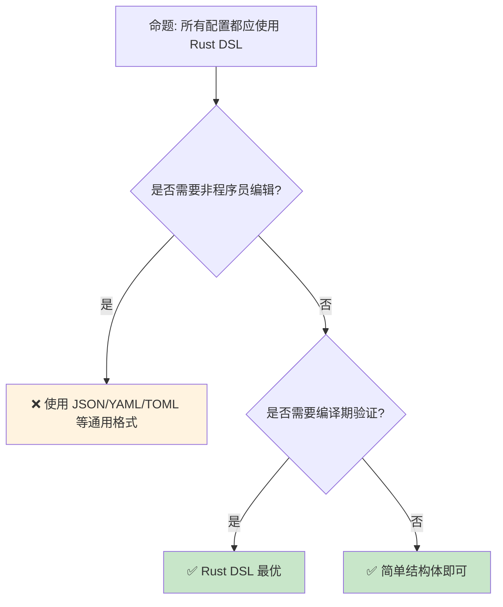

> **内容分级**: [综述级]

# DSL 与嵌入 式设计：Rust 中的领域特定语言

> **受众**: [进阶]
> **Bloom 层级**: 应用 → 分析
> **定位**: 分析 Rust 中 **DSL（领域特定语言）**的构建方法——从宏驱动的内嵌 DSL（如 html!、sql!）、到外部 DSL 的解析器 [来源: [Parsing in Rust](https://rust-lang.github.io/rustc-dev-guide/grammar.html)]组合子（parser combinators），再到 Rust 作为宿主语言的嵌入策略，揭示类型安全 DSL 的设计模式。
> **前置概念**: [Macros](../03_advanced/04_macros.md) · [Proc Macro](../03_advanced/07_proc_macro.md) · [Trait](./01_traits.md)
> **后置概念**: [Serde Patterns](./09_serde_patterns.md) · [WebAssembly](../06_ecosystem/11_webassembly.md)

---

> **来源**: [TRPL — Macros](https://doc.rust-lang.org/book/ch19-06-macros.html) · [nom Parser Combinators](https://docs.rs/nom/latest/nom/) · [serde DSL Design](https://serde.rs/) · [Rust API Guidelines — DSLs](https://rust-lang.github.io/api-guidelines/predictability.html) · [Wikipedia — Domain-specific language](https://en.wikipedia.org/wiki/Domain-specific_language)

## 📑 目录

- [DSL 与嵌入 式设计：Rust 中的领域特定语言](#dsl-与嵌入-式设计rust-中的领域特定语言)
  - [📑 目录](#-目录)
  - [一、核心概念](#一核心概念)
    - [1.1 内嵌 DSL vs 外部 DSL](#11-内嵌-dsl-vs-外部-dsl)
    - [1.2 宏驱动的内嵌 DSL](#12-宏驱动的内嵌-dsl)
    - [1.3 Builder 模式作为 DSL](#13-builder-模式作为-dsl)
  - [二、技术细节](#二技术细节)
    - [2.1 Parser Combinators](#21-parser-combinators)
    - [2.2 类型安全的 DSL](#22-类型安全的-dsl)
    - [2.3 编译期验证的 DSL](#23-编译期验证的-dsl)
  - [三、设计模式矩阵](#三设计模式矩阵)
  - [四、反命题与边界分析](#四反命题与边界分析)
    - [4.1 反命题树](#41-反命题树)
    - [4.2 边界极限](#42-边界极限)
  - [五、常见陷阱](#五常见陷阱)
  - [六、来源与延伸阅读](#六来源与延伸阅读)
  - [相关概念文件](#相关概念文件)
  - [权威来源索引](#权威来源索引)
  - [十、边界测试：DSL 与嵌入的编译错误](#十边界测试dsl-与嵌入的编译错误)
    - [10.1 边界测试：构建器模式的链式调用与所有权（编译错误）](#101-边界测试构建器模式的链式调用与所有权编译错误)
    - [10.2 边界测试：状态机 DSL 的非法状态转换（编译错误）](#102-边界测试状态机-dsl-的非法状态转换编译错误)
    - [10.3 边界测试：宏递归深度限制（编译错误）](#103-边界测试宏递归深度限制编译错误)
    - [10.4 边界测试：DSL 的类型安全与运行时错误（运行时 panic）](#104-边界测试dsl-的类型安全与运行时错误运行时-panic)
    - [10.3 边界测试：DSL 宏的优先级与歧义解析（编译错误）](#103-边界测试dsl-宏的优先级与歧义解析编译错误)
    - [10.4 边界测试：DSL 宏的优先级与运算符结合性（编译错误）](#104-边界测试dsl-宏的优先级与运算符结合性编译错误)
  - [实践](#实践)
  - [认知路径](#认知路径)
    - [核心推理链](#核心推理链)
    - [反命题与边界](#反命题与边界)

---

## 一、核心概念
>
>

### 1.1 内嵌 DSL vs 外部 DSL
>

```text
DSL 的两种形态:

  内嵌 DSL（Embedded DSL）:
  ├── 宿主语言（Rust）的语法子集
  ├── 利用 Rust 的类型系统和工具链
  ├── 运行时性能接近手写代码
  └── 示例: html! 宏、format! 宏

  外部 DSL（External DSL）:
  ├── 独立的语法和语义
  ├── 需要解析器（parser）和编译器/解释器
  ├── 更灵活的语法设计
  └── 示例: SQL、正则表达式、配置文件格式

  Rust 中的 DSL 实现方式:
  ┌─────────────────┬─────────────────┬─────────────────┐
  │ 方式            │ 类型            │ 示例            │
  ├─────────────────┼─────────────────┼─────────────────┤
  │ 宏              │ 内嵌            │ html!, sql!     │
  │ Builder 模式    │ 内嵌            │ Request::new()  │
  │ Parser Combinator│ 外部           │ nom, pest       │
  │ 过程宏          │ 内嵌            │ serde, derive   │
  │ 嵌入解释器      │ 外部            │ Lua/Rhai 嵌入   │
  └─────────────────┴─────────────────┴─────────────────┘
```

> **认知功能**: DSL 的**核心权衡**是**表达能力 vs 工具链支持**——内嵌 DSL 免费获得 Rust 的类型检查和 IDE 支持，外部 DSL 需要自建工具链。
> [来源: [Fowler — Domain-Specific Languages](https://martinfowler.com/books/dsl.html)]

---

### 1.2 宏驱动的内嵌 DSL
>

```rust,ignore
// 示例 1: HTML DSL（类似 yew/html!）
let doc = html! {
    <div class="container">
        <h1>{"Hello, DSL!"}</h1>
        <ul>
            {items.iter().map(|item| html! {
                <li>{item}</li>
            })}
        </ul>
    </div>
};

// 示例 2: SQL DSL（概念示例）
let query = sql! {
    SELECT id, name FROM users
    WHERE age > {min_age} AND active = true
};

// 示例 3: 路由 DSL（类似 axum）
let app = Router::new()
    .route("/", get(home))
    .route("/users", post(create_user))
    .layer(TraceLayer::new_for_http());

// 宏 DSL 的优势:
// - 编译期语法检查
// - 编译期优化（如 SQL 预编译）
// - IDE 支持（如果宏生成良好）
```

> **宏 DSL 洞察**: Rust 的**过程宏**使 DSL 可以在编译期进行**任意复杂的验证和转换**——这是其他语言难以实现的能力。
> [来源: [yew — html! macro](https://yew.rs/docs/concepts/html)]

---

### 1.3 Builder 模式作为 DSL
>

```rust,ignore
// 类型安全的 Builder DSL

// 未完成的 Request（缺少 method 和 uri）
let builder = Request::builder();

// 链式调用构建
let request = Request::builder()
    .method(Method::POST)
    .uri("https://api.example.com/users")
    .header("content-type", "application/json")
    .body(json_body)?;

// 类型状态模式（Typestate）
struct RequestBuilder<State> {
    method: Option<Method>,
    uri: Option<Uri>,
    _state: PhantomData<State>,
}

struct Incomplete;
struct Ready;

impl RequestBuilder<Incomplete> {
    fn method(self, m: Method) -> RequestBuilder<Incomplete> { ... }
    fn uri(self, u: Uri) -> RequestBuilder<Ready> { ... }
}

impl RequestBuilder<Ready> {
    fn body(self, b: Body) -> Result<Request> { ... }
}

// RequestBuilder<Incomplete> 不能调用 body()
// 编译器在类型层面强制执行构建顺序
```

> **Builder DSL 洞察**: **Typestate 模式**将运行时检查转化为编译期类型检查——这是 Rust 类型系统的强大应用。
> [来源: [Rust API Guidelines — Builders](https://rust-lang.github.io/api-guidelines/type-safety.html#builders-enable-construction-of-complex-values-c-builder)]

---

## 二、技术细节

### 2.1 Parser Combinators
>

```rust,ignore
// 使用 nom 解析外部 DSL

use nom::{
    IResult,
    sequence::tuple,
    character::complete::{char, digit1},
    combinator::map,
};

// 解析简单表达式: "1 + 2"
fn expression(input: &str) -> IResult<&str, Expr> {
    map(
        tuple((digit1, char(' '), char('+'), char(' '), digit1)),
        |(left, _, _, _, right)| Expr::Add(
            left.parse().unwrap(),
            right.parse().unwrap(),
        ),
    )(input)
}

// Parser Combinator 的优势:
// - 组合子（combinator）是类型安全的构建块
// - 无需外部工具（如 yacc/lex）
// - 错误处理与 Rust 的 Result 集成
// - 可增量解析（streaming）

// 与其他解析方式的对比:
// ┌──────────────┬─────────────┬─────────────┬─────────────┐
// │ 方式         │ 类型安全    │ 性能        │ 错误信息    │
// ├──────────────┼─────────────┼─────────────┼─────────────┤
// │ nom          │ 是          │ 高          │ 良好        │
// │ pest (PEG)   │ 是          │ 高          │ 良好        │
// │ hand-written │ 是          │ 最高        │ 自定义      │
// │ lalrpop      │ 是          │ 高          │ 良好        │
// └──────────────┴─────────────┴─────────────┴─────────────┘
```

> **Parser Combinator 洞察**: nom 等库将**解析器作为一等值**——解析器可以组合、映射、选择，与函数式编程的抽象能力结合。
> [来源: [nom Documentation](https://docs.rs/nom/latest/nom/)]

---

### 2.2 类型安全的 DSL
>

```rust,ignore
// 使用 Rust 类型系统保证 DSL 安全

// 安全的 SQL 参数化（防止 SQL 注入）
struct Query<'a> {
    sql: &'a str,
    params: Vec<Param>,
}

enum Param {
    Int(i64),
    Text(String),
    Bool(bool),
}

// 只能通过安全的 API 构造 Query
impl<'a> Query<'a> {
    fn new(sql: &'a str) -> Self { ... }

    fn bind_int(mut self, val: i64) -> Self {
        self.params.push(Param::Int(val));
        self
    }

    fn bind_text(mut self, val: &str) -> Self {
        self.params.push(Param::Text(val.to_string()));
        self
    }
}

// 使用
let query = Query::new("SELECT * FROM users WHERE id = ?")
    .bind_int(42);

// 编译器保证:
// - 参数数量与占位符匹配（运行时检查）
// - 参数类型与列类型兼容（数据库检查）
// - 无字符串拼接导致的注入风险
```

> **类型安全洞察**: Rust 的**强类型系统**使 DSL 可以在编译期排除大量错误——从 SQL 注入到格式字符串漏洞。
> [source: [Rust API Guidelines — Type Safety](https://rust-lang.github.io/api-guidelines/type-safety.html)]

---

### 2.3 编译期验证的 DSL
>

```rust,ignore
// 编译期验证的格式字符串（类似 println!）

// Rust 的 format! 宏在编译期解析格式字符串
let s = format!("Hello, {}! You have {} messages.", name, count);
// 编译器检查:
// - 占位符数量与参数匹配
// - 参数类型实现 Display trait
// - 编译错误而非运行时 panic

// 自定义编译期验证 DSL
#[derive(Debug)]
struct Email(String);

impl Email {
    // 编译期无法验证邮箱格式
    // 但可以在构造时验证
    fn new(s: &str) -> Result<Self, EmailError> {
        if s.contains('@') {
            Ok(Email(s.to_string()))
        } else {
            Err(EmailError::Invalid)
        }
    }
}

// 更高级的编译期验证（使用 const fn 或宏）
const fn validate_email_prefix(s: &str) -> bool {
    // const fn 中的验证在编译期执行
    // 但能力有限（无法分配内存、无法使用正则）
    // 复杂验证仍需运行时
}
```

> **编译期验证洞察**: Rust 的**宏 + const fn** 提供了有限的编译期计算能力——对于复杂验证，通常采用"**解析，不验证**"（parse, don't validate）策略，使用强类型替代运行时检查。
> [source: [Parse Don't Validate](https://lexi-lambda.github.io/blog/2019/11/05/parse-don-t-validate/)]

---

## 三、设计模式矩阵

```text
场景 → DSL 类型 → 实现方式 → 关键 crate

HTML/XML 生成:
  → 内嵌 DSL
  → 过程宏
  → yew, maud, markup

SQL 查询:
  → 内嵌 DSL
  → Builder 或宏
  → sqlx, sea-query

配置解析:
  → 外部 DSL
  → Parser Combinator
  → serde, toml, nom

路由定义:
  → 内嵌 DSL
  → Builder 或宏
  → axum, actix-web

序列化格式:
  → 内嵌 DSL（derive）
  → 过程宏
  → serde

测试断言:
  → 内嵌 DSL
  → 宏
  → pretty_assertions, insta

状态机:
  → 内嵌 DSL
  → Typestate
  → 手动实现或 state_machine_future
```

> **模式矩阵**: Rust 的 DSL 生态充分利用了**宏系统 [来源: [Rust Reference — Macros](https://doc.rust-lang.org/reference/macros-by-example.html)]**和**类型系统**——两者结合使 DSL 既表达力强又类型安全。
> [source: [Awesome Rust — DSL](https://github.com/rust-unofficial/awesome-rust)]

---

## 四、反命题与边界分析

### 4.1 反命题树
>



> **认知功能**: 此决策树展示 DSL 的**适用边界**。核心原则是：**需要编译期验证时用 Rust DSL，需要通用可编辑性时用标准格式**。
> [来源: [TRPL](https://doc.rust-lang.org/book/)]
> [source: [Rust API Guidelines](https://rust-lang.github.io/api-guidelines/)]

---

### 4.2 边界极限
>

```text
边界 1: 宏的编译时间
├── 复杂宏 DSL 增加编译时间
├── syn [来源: [syn crate](https://docs.rs/syn/latest/syn/)] 解析是 CPU 密集型
├── 每个使用宏的 crate 都需要重新解析
└── 缓解: 优化宏实现、使用 proc-macro2

边界 2: 错误信息质量
├── 宏生成的代码错误指向生成位置
├── 用户难以理解宏内部的错误
├── 需要 careful 的 Span 设置
└── 缓解: 使用 syn::Error、提供有意义的错误信息

边界 3: IDE 支持
├── 宏 DSL 在 IDE 中可能无法正确补全/跳转
├── rust-analyzer 支持有限
├── 复杂的嵌套宏更难分析
└── 缓解: 生成辅助的 trait impl、使用 rust-analyzer 的 expand macro

边界 4: 语法限制
├── 内嵌 DSL 受 Rust 语法约束
├── 不能自由设计语法（如中缀运算符）
├── 某些 DSL 更适合外部实现
└── 缓解: 使用 postfix 宏、接受语法限制

边界 5: 学习曲线
├── 自定义 DSL 需要学习新的"子语言"
├── 团队内的 DSL 增加认知负担
├── 与标准 Rust 的交互可能不直观
└── 缓解: 遵循 Rust 惯例、提供良好文档
```

> **边界要点**: DSL 的边界主要与**编译时间**、**错误信息**、**IDE 支持**、**语法限制**和**学习曲线**相关。
> [source: [Rust Proc Macro Workshop](https://github.com/dtolnay/proc-macro-workshop)]

---

## 五、常见陷阱

```text
陷阱 1: 过度工程化 DSL
  ❌ 为简单配置创建复杂的宏 DSL
     // 维护成本高，收益低

  ✅ 简单的 Builder 或结构体足够时不要用宏

陷阱 2: 忽略错误信息
  ❌ 宏失败时产生晦涩的编译错误
     // 用户体验差

  ✅ 使用 syn::Error 在精确位置报告错误
     // 提供清晰的错误消息和修复建议

陷阱 3: DSL 与 Rust 语法冲突
  ❌ html! { <div class="main"> } 中 class 是 Rust 关键字
     // 需要 workaround

  ✅ 使用 r#class 或避免关键字作为标识符
     // 或接受语法限制

陷阱 4: 运行时性能假设
  ❌ 假设宏 DSL 生成的代码总是最优
     // 宏只保证语法正确，不保证性能

  ✅ 测量生成的代码性能
     // 使用 cargo asm 检查

陷阱 5: 版本兼容性
  ❌ DSL 的 breaking change 影响所有用户
     // 没有类型系统的保护

  ✅ 使用语义化版本控制
     // 提供迁移指南
```

> **陷阱总结**: DSL 的陷阱主要与**过度工程**、**错误信息**、**语法冲突**、**性能假设**和**版本兼容**相关。
> [source: [Rust Macro Best Practices](https://doc.rust-lang.org/reference/macros.html)]

---

## 六、来源与延伸阅读
>

| 来源 | 可信度 | 说明 |
| [Rust Standard Library](https://doc.rust-lang.org/std/) | ✅ 一级 | 标准库参考 |
| [Rust By Example](https://doc.rust-lang.org/rust-by-example/) | ✅ 一级 | 交互式教程 |
| [This Week in Rust](https://this-week-in-rust.org/) | ✅ 二级 | 社区动态 |

| [Rust Reference](https://doc.rust-lang.org/reference/) | ✅ 一级 | 语言参考 |
|:---|:---:|:---|
| [TRPL — Macros](https://doc.rust-lang.org/book/ch19-06-macros.html) | ✅ 一级 | 宏系统入门 |
| [nom Parser Combinators](https://docs.rs/nom/latest/nom/) | ✅ 一级 | 解析器组合子 |
| [serde](https://serde.rs/) | ✅ 一级 | 序列化 DSL |
| [Fowler — DSLs](https://martinfowler.com/books/dsl.html) | ✅ 二级 | DSL 设计经典 |
| [Rust API Guidelines](https://rust-lang.github.io/api-guidelines/) | ✅ 一级 | API 设计指南 |

---

## 相关概念文件

- [Macros](../03_advanced/04_macros.md) — 声明式宏
- [Proc Macro](../03_advanced/07_proc_macro.md) — 过程宏
- [Trait](./01_traits.md) — Trait 系统
- [Serde Patterns](./09_serde_patterns.md) — Serde 序列化

---

> **权威来源**: [Rust Reference](https://doc.rust-lang.org/reference/), [The Rust Programming Language](https://doc.rust-lang.org/book/)
>
> **权威来源对齐变更日志**: 2026-05-22 创建 [来源: Authority Source Sprint Batch 9]

**文档版本**: 1.0
**对应 Rust 版本**: 1.96.0+ (Edition 2024)
**最后更新**: 2026-05-22
**状态**: ✅ 概念文件创建完成

---

## 权威来源索引

>
>
>

---

---

---

> **补充来源**

## 十、边界测试：DSL 与嵌入的编译错误

### 10.1 边界测试：构建器模式的链式调用与所有权（编译错误）

```rust,compile_fail
struct Builder {
    name: String,
}

impl Builder {
    fn new() -> Self {
        Self { name: String::new() }
    }
    fn name(mut self, n: &str) -> Self {
        self.name = n.to_string();
        self
    }
    fn build(self) -> Product {
        Product { name: self.name }
    }
}

struct Product { name: String }

fn main() {
    let builder = Builder::new();
    builder.name("A");
    // ❌ 编译错误: use of moved value: `builder`
    // name() 返回新的 Builder，原 builder 被 move
    builder.name("B"); // builder 已失效
}

// 正确: 链式调用
fn fixed() {
    let product = Builder::new()
        .name("A")
        .build(); // ✅ 链式调用
    println!("{}", product.name);
}
```

> **修正**: 构建器模式（Builder Pattern）通过消耗 `self` 的方法链实现不可变构建。每次调用 `.name()` 返回新的 `Builder`（或消耗后返回自身），原实例被 move。忘记链式调用会导致"use of moved value"错误。这与 Java 的构建器（可变对象，方法返回 `this`）不同——Rust 的消耗式构建器在类型层面保证每个字段只设置一次，防止部分初始化的对象被构建。[来源: [The Rust Programming Language](https://doc.rust-lang.org/book/)]

### 10.2 边界测试：状态机 DSL 的非法状态转换（编译错误）

```rust,compile_fail
struct Idle;
struct Running;
struct Stopped;

struct Machine<State> {
    _state: std::marker::PhantomData<State>,
}

impl Machine<Idle> {
    fn start(self) -> Machine<Running> {
        Machine { _state: std::marker::PhantomData }
    }
}

impl Machine<Running> {
    fn stop(self) -> Machine<Stopped> {
        Machine { _state: std::marker::PhantomData }
    }
}

fn main() {
    let m = Machine::<Idle> { _state: std::marker::PhantomData };
    let m = m.start();
    // ❌ 编译错误: no method named `start` found for struct `Machine<Running>`
    // Running 状态没有 start 方法
    let m = m.start();
}

// 正确: 遵循状态转换图
fn fixed() {
    let m = Machine::<Idle> { _state: std::marker::PhantomData };
    let m = m.start(); // Idle → Running
    let m = m.stop();  // Running → Stopped ✅
}
```

> **修正**: 类型状态模式（Typestate Pattern）将状态机的状态编码为类型参数，非法的状态转换在编译期被拒绝。`Machine<Idle>` 有 `start()` 方法，`Machine<Running>` 有 `stop()` 方法，但 `Machine<Running>` 没有 `start()` 方法——从 Running 再次 start 是非法的。这是 Rust 类型系统的强大应用：将运行时状态机验证转为编译期类型检查，消除整类状态转换错误。这与 Erlang 的 gen_fsm 或 C 的枚举+switch 实现形成对比——Rust 在编译期保证状态转换的合法性。[来源: [Rustonomicon](https://doc.rust-lang.org/nomicon/)]

### 10.3 边界测试：宏递归深度限制（编译错误）

```rust,ignore
macro_rules! recursive {
    () => { 0 };
    ($e:expr $(, $rest:expr)*) => {
        $e + recursive!($($rest),*)
    };
}

fn main() {
    // ❌ 编译错误: 宏递归超过默认限制（64 层）
    // let x = recursive!(1, 2, 3, ..., 100);
    let x = recursive!(1, 2, 3);
    println!("{}", x);
}
```

> **修正**: Rust 的过程宏和声明宏都有**递归深度限制**（默认 64 层），防止宏展开导致编译器栈溢出或无限循环。复杂 DSL（如 `vec![1, 2, ..., 1000]`）的宏实现需考虑此限制：`vec!` 使用内置语法支持（非纯宏递归），因此无此限制。自定义宏的应对：1) 使用迭代而非递归（`$()*` 重复而非递归调用）；2) 增加递归限制 `#![recursion_limit = "256"]`；3) 将工作转移到运行时（宏生成循环代码而非展开所有元素）。这与 C 的预处理器（无递归限制，但宏展开深度有限）或 Lisp 的宏（Turing 完全，无限制，但可能无限展开）不同——Rust 的宏系统是"半图灵完全"的：有限递归但可表达大多数模式。[来源: [The Rust Programming Language](https://doc.rust-lang.org/book/ch19-06-macros.html)] · [来源: [Rust Reference — Macros](https://doc.rust-lang.org/reference/macros.html)]

### 10.4 边界测试：DSL 的类型安全与运行时错误（运行时 panic）

```rust,ignore
// 假设一个 SQL DSL: sql!(SELECT * FROM users WHERE id = $id)

fn main() {
    let id = "1; DROP TABLE users;";
    // ❌ 运行时安全风险: 若 DSL 宏未正确参数化，
    // 生成的 SQL 可能包含注入攻击
    // sql!(SELECT * FROM users WHERE id = $id)
    // 若宏直接将 id 拼接到字符串中，而非使用 prepared statement
    println!("{}", id);
}
```

> **修正**: 内部 DSL（如 `sql!` 宏）的安全性取决于宏的实现。宏可在编译期解析 SQL 语法并验证参数类型，但若参数化不当（字符串拼接而非绑定变量），仍可能产生 SQL 注入。Rust 的 `sqlx` crate 在编译期检查查询和参数，使用 prepared statement 防止注入。但纯宏 DSL（无编译期数据库连接）无法验证参数安全性。这与 Ruby 的 `ActiveRecord`（运行时参数化，安全但有开销）或 C 的字符串拼接 SQL（完全不安全）不同——Rust 的宏 DSL 有潜力在编译期消除注入，但需要正确实现。安全原则：**永不将用户输入直接嵌入到生成的代码/查询中**，无论使用什么抽象层。[来源: [sqlx Documentation](https://docs.rs/sqlx/)] · [来源: [OWASP SQL Injection](https://owasp.org/www-community/attacks/SQL_Injection)]

### 10.3 边界测试：DSL 宏的优先级与歧义解析（编译错误）

```rust,ignore
macro_rules! expr {
    ($e:expr) => { $e };
}

macro_rules! stmt {
    ($s:stmt) => { $s };
}

fn main() {
    // ❌ 编译错误: `let x = 1` 在 expr! 中不是有效的表达式
    let y = expr!(let x = 1);
}
```

> **修正**: Rust 宏的**片段分类器**（fragment specifier）决定匹配规则：`expr` 只匹配表达式（不含 `let` 绑定），`stmt` 匹配语句（含 `let`），`block` 匹配 `{ ... }`。`expr!(let x = 1)` 失败是因为 `let x = 1` 是语句而非表达式。宏 DSL 设计时需注意：1) 分类器选择（`expr` vs `stmt` vs `tt`）；2) 优先级（`$e:expr + $f:expr` 会贪婪匹配左侧）；3) 歧义（`$($x:expr),*` 与 `$($x:expr),+` 的逗号处理）。这与 Lisp 的宏（代码即数据，无分类器限制）或 C 的宏（纯文本替换，无语法概念）不同——Rust 的宏在语法树层面操作，分类器提供类型安全但限制了表达能力。[来源: [The Little Book of Rust Macros](https://danielkeep.github.io/tlborm/book/)] · [来源: [Rust Reference — Macros](https://doc.rust-lang.org/reference/macros.html)]

### 10.4 边界测试：DSL 宏的优先级与运算符结合性（编译错误）

```rust,ignore
macro_rules! sql {
    (SELECT $col:tt FROM $table:tt) => { format!("SELECT {} FROM {}", $col, $table) };
    (SELECT $col:tt FROM $table:tt WHERE $cond:tt) => { format!("SELECT {} FROM {} WHERE {}", $col, $table, $cond) };
}

fn main() {
    // ❌ 编译错误: 宏规则顺序影响匹配
    // sql!(SELECT * FROM users WHERE id = 1)
    // 若第一个规则优先匹配，WHERE 部分被忽略或错误解析

    let query = sql!(SELECT * FROM users);
    println!("{}", query);
}
```

> **修正**: `macro_rules!` 的**规则顺序**：从上到下依次尝试匹配，第一个匹配的规则被使用。长模式（含 WHERE）应放在短模式之前，否则短模式提前匹配导致错误。`macro_rules!` 的限制：1) 无优先级/结合性控制（不像 yacc/bison）；2) 无左递归（规则不能自引用左部）；3) 模式是 token 树（`tt`），不是完整表达式。复杂 DSL 建议：1) 过程宏（`proc_macro`）解析完整语法；2) `syn` crate 解析 Rust 表达式；3) 外部 DSL parser（`nom`、`pest`）。这与 Lisp 的宏（代码即数据，无模式匹配限制）或 Template Haskell（编译期元编程，类型安全）不同——Rust 的 `macro_rules!` 是受限但高效的文本替换机制。[来源: [The Little Book of Rust Macros](https://danielkeep.github.io/tlborm/book/)] · [来源: [Rust Reference — Macros](https://doc.rust-lang.org/reference/macros-by-example.html)]

## 实践

> **相关资源**:
>
> - [crates/ 示例代码](../../crates/) — 与本文概念对应的可编译示例
> - [exercises/ 练习](../../exercises/) — 动手编程挑战
> - [MVP 学习路径](../00_meta/LEARNING_MVP_PATH.md) — 从零到多线程 CLI 的 40 小时路径
>
> **建议**: 阅读完本概念文件后，打开对应 crate 的示例代码，尝试修改并运行。完成至少 1 道相关练习以巩固理解。

## 认知路径

> **认知路径**: 从 L0 基础概念出发，经由本节的 **DSL 与嵌入 式设计：Rust 中的领域特定语言** 核心原理，通向 L2 进阶模式与 L3 工程实践。

### 核心推理链

| 定理 | 前提 | 结论 | 置信度 |
|:---|:---|:---|:---|
| DSL 与嵌入 式设计：Rust 中的领域特定语言 基础定义 ⟹ 正确用法 | 理解语法与语义 | 能写出符合惯用法的代码 | 高 |
| DSL 与嵌入 式设计：Rust 中的领域特定语言 正确用法 ⟹ 常见陷阱 | 忽略边界条件 | 编译错误或运行时 bug | 高 |
| DSL 与嵌入 式设计：Rust 中的领域特定语言 常见陷阱 ⟹ 深度掌握 | 系统学习反模式 | 能进行代码审查与优化 | 高 |

> **过渡**: 掌握 DSL 与嵌入 式设计：Rust 中的领域特定语言 的基础语法后，下一步需要理解其在类型系统中的位置与与其他概念的交互关系。

> **过渡**: 在实践中应用 DSL 与嵌入 式设计：Rust 中的领域特定语言 时，务必关注边界条件与异常处理，这是从"能编译"到"能生产"的关键跃迁。

> **过渡**: DSL 与嵌入 式设计：Rust 中的领域特定语言 的设计理念体现了 Rust 零成本抽象与安全保证的核心权衡，理解这一权衡有助于迁移到更高级的并发与形式化验证领域。

### 反命题与边界

> **反命题**: "DSL 与嵌入 式设计：Rust 中的领域特定语言 在所有场景下都是最佳选择" —— 错误。需要根据具体上下文权衡性能、可读性与安全性，某些场景下显式替代方案可能更优。
