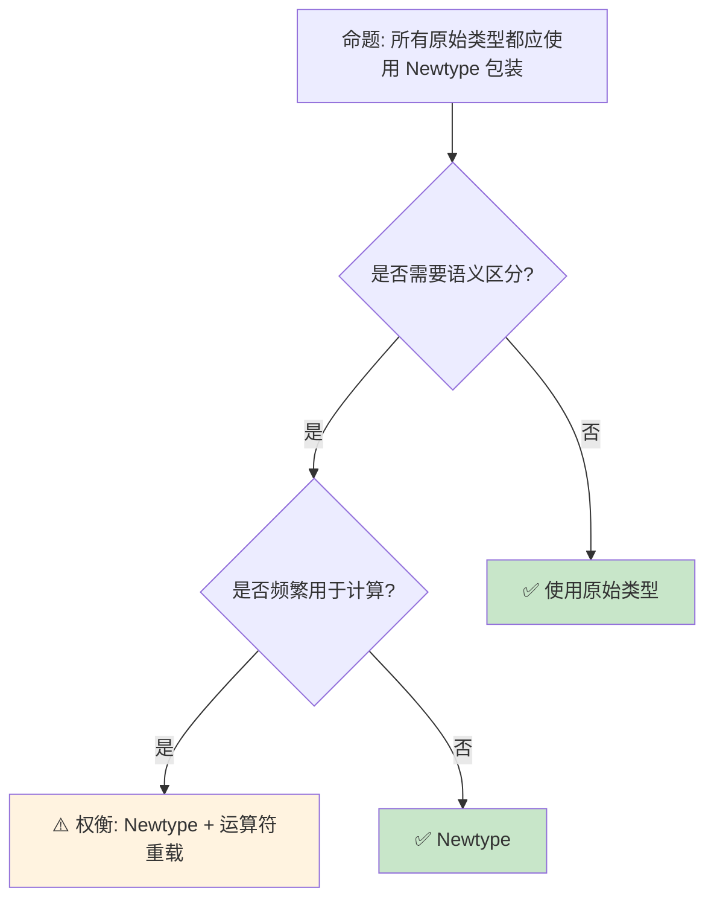

# Newtype [来源: [Rust API Guidelines](https://rust-lang.github.io/api-guidelines/type-safety.html#c-newtype)] 与包装器模式：类型安全的零成本抽象

> **Bloom 层级**: 应用 → 分析
> **定位**: 深入分析 Rust 中 **Newtype 模式**和**包装器类型**的设计——如何通过单字段元组结构体创建语义上不同的类型，实现编译期单位检查、API 封装和安全边界，同时保持零运行时开销。
> **前置概念**: [Type System](../01_foundation/04_type_system.md) · [Trait](./01_traits.md) · [Generics](./02_generics.md)
> **后置概念**: [Typestate](../06_ecosystem/02_patterns.md) · [Smart Pointers](./12_smart_pointers.md)

---

> **来源**: [Rust API Guidelines — Newtypes](https://rust-lang.github.io/api-guidelines/type-safety.html#c-newtype) · [TRPL — Newtype Pattern](https://doc.rust-lang.org/book/ch19-03-advanced-traits.html#using-the-newtype-pattern-to-implement-external-traits-on-external-types) · [Wikipedia — Newtype](https://en.wikipedia.org/wiki/Newtype) · [Rust Reference — Tuple Structs](https://doc.rust-lang.org/reference/items/structs.html) · [Rust Patterns — Newtype](https://rust-unofficial.github.io/patterns/patterns/behavioural/newtype.html)

## 📑 目录
> [来源: [Rust Reference](https://doc.rust-lang.org/reference/)]
>
> [来源: [TRPL](https://doc.rust-lang.org/book/)]

- [Newtype \[来源: Rust API Guidelines\] 与包装器模式：类型安全的零成本抽象](#newtype-来源-rust-api-guidelines-与包装器模式类型安全的零成本抽象)
  - [📑 目录](#-目录)
  - [一、核心概念](#一核心概念)
    - [1.1 Newtype 模式的本质](#11-newtype-模式的本质)
    - [1.2 单位类型与物理量](#12-单位类型与物理量)
    - [1.3 与类型别名（type alias）的区别](#13-与类型别名type-alias的区别)
  - [二、技术细节](#二技术细节)
    - [2.1 Deref 与自动解引用](#21-deref-与自动解引用)
    - [2.2 孤儿规则与 Newtype](#22-孤儿规则与-newtype)
    - [2.3 包装器类型谱系](#23-包装器类型谱系)
  - [三、设计模式矩阵](#三设计模式矩阵)
  - [四、反命题与边界分析](#四反命题与边界分析)
    - [4.1 反命题树](#41-反命题树)
    - [4.2 边界极限](#42-边界极限)
  - [五、常见陷阱](#五常见陷阱)
  - [六、来源与延伸阅读](#六来源与延伸阅读)
  - [相关概念文件](#相关概念文件)

---

## 一、核心概念
> [来源: [Rust Reference](https://doc.rust-lang.org/reference/)]
>
> [来源: [Rust Reference](https://doc.rust-lang.org/reference/)]

### 1.1 Newtype 模式的本质

```rust,ignore
// Newtype: 单字段元组结构体
struct Meters(f64);
struct Seconds(f64);

// 语义上不同的类型，不能互换
let distance = Meters(100.0);
let time = Seconds(10.0);

// ❌ 编译错误: 不能混合
// let speed = distance.0 / time.0;  // 可以（访问内部值）
// let wrong: Meters = time;  // 编译错误！

// 需要显式转换
fn calculate_speed(distance: Meters, time: Seconds) -> f64 {
    distance.0 / time.0  // 返回原始 f64（或另一个 Newtype）
}

// 可以添加方法和 Trait 实现
impl Meters {
    fn to_kilometers(&self) -> f64 {
        self.0 / 1000.0
    }
}

impl std::ops::Add for Meters {
    type Output = Self;
    fn add(self, other: Self) -> Self {
        Meters(self.0 + other.0)
    }
}
```

> **认知功能**: Newtype 是 Rust **类型系统的轻量级扩展**——它不增加运行时开销（单字段结构体与内部类型完全相同的大小），但提供了编译期的语义区分。
> [来源: [Rust API Guidelines]]
> **关键洞察**: Newtype 是**零成本抽象**的典范——编译后 `Meters(f64)` 与 `f64` 的机器表示完全相同。
> [来源: [Rust API Guidelines — Newtypes](https://rust-lang.github.io/api-guidelines/type-safety.html#c-newtype)]

---

### 1.2 单位类型与物理量

```text
物理量 Newtype 的价值:

  经典错误（无单位检查）:
  fn calculate_force(mass: f64, acceleration: f64) -> f64 {
      mass * acceleration
  }
  // 调用者可能传入质量和速度，编译器无法发现

  使用 Newtype:
  struct Kilograms(f64);
  struct MetersPerSecondSquared(f64);
  struct Newtons(f64);

  fn calculate_force(mass: Kilograms, accel: MetersPerSecondSquared) -> Newtons {
      Newtons(mass.0 * accel.0)
  }

  // 错误调用会被编译器阻止:
  // let speed = MetersPerSecond(10.0);
  // calculate_force(mass, speed);  // 编译错误！

  更完整的单位系统（如 uom crate）:
  ├── 类型级单位运算: Meter / Second = MeterPerSecond
  ├── 编译期单位检查
  └── 运行时零开销
```

> **单位洞察**: Newtype 将**维度分析**从物理学的纸笔计算提升为**编译期类型检查**——单位错误在编译期被发现。
> [来源: [uom crate](https://docs.rs/uom/latest/uom/)]

---

### 1.3 与类型别名（type alias）的区别

```rust,ignore
// 类型别名: 只是语法糖
type MetersAlias = f64;
type SecondsAlias = f64;

let a: MetersAlias = 100.0;
let b: SecondsAlias = 10.0;
let c = a + b;  // ✅ 编译通过！类型别名无区分

// Newtype: 真正不同的类型
struct MetersNewtype(f64);
struct SecondsNewtype(f64);

let a = MetersNewtype(100.0);
let b = SecondsNewtype(10.0);
// let c = a + b;  // ❌ 编译错误！

// 对比:
┌─────────────────┬─────────────────┬─────────────────┐
│ 特性            │ type alias      │ Newtype         │
├─────────────────┼─────────────────┼─────────────────┤
│ 类型区分        │ 否              │ 是              │
│ Trait 实现      │ 继承原类型      │ 需手动实现      │
│ 方法添加        │ 否              │ 是              │
│ 运行时开销      │ 零              │ 零              │
│ 使用场景        │ 简化复杂类型    │ 语义区分        │
└─────────────────┴─────────────────┴─────────────────┘
```

> **区别洞察**: 类型别名是**语法简化**（如 `type Result<T> = std::result::Result<T, MyError>`），Newtype 是**语义强化**（如 `struct UserId(u64)`）。
> [来源: [Rust Reference — Type Aliases](https://doc.rust-lang.org/reference/items/type-aliases.html)]

---

## 二、技术细节
> [来源: [Rust Reference](https://doc.rust-lang.org/reference/)]
>
> [来源: [TRPL](https://doc.rust-lang.org/book/)]

### 2.1 Deref 与自动解引用

```rust,ignore
use std::ops::Deref;

// 使用 Deref 减少 Newtype 的样板代码
struct WrappedVec<T>(Vec<T>);

impl<T> Deref for WrappedVec<T> {
    type Target = Vec<T>;
    fn deref(&self) -> &Self::Target {
        &self.0
    }
}

// 现在 WrappedVec 可以像 Vec 一样使用
let w = WrappedVec(vec![1, 2, 3]);
println!("{}", w.len());      // Deref 到 &Vec
println!("{:?}", w.get(0));   // 使用 Vec 的方法

// 但 Deref 的陷阱:
// - 过度使用 Deref 隐藏了 Newtype 的语义
// - 调用者可能意识不到这是包装器类型
// - 建议: 只在新类型是"透明包装"时使用 Deref

// 更好的做法: 显式暴露需要的方法
struct Users(Vec<User>);

impl Users {
    fn len(&self) -> usize { self.0.len() }
    fn get(&self, index: usize) -> Option<&User> { self.0.get(index) }
    // 不暴露 push/remove 等可能破坏不变性的方法
}
```

> **Deref 洞察**: `Deref` 是**双刃剑**——它简化了 Newtype 的使用，但过度使用会削弱 Newtype 的语义保护。
> [来源: [std::ops::Deref](https://doc.rust-lang.org/std/ops/trait.Deref.html)]

---

### 2.2 孤儿规则与 Newtype

```rust,ignore
// 孤儿规则: 不能为外部类型实现外部 Trait

// ❌ 错误: 为外部类型实现外部 Trait
// impl serde::Serialize for std::io::Error { ... }

// ✅ Newtype 绕过孤儿规则
#[derive(Serialize)]
struct SerializableError(std::io::Error);

// 现在可以为 Newtype 实现任何 Trait
impl SerializableError {
    fn new(e: std::io::Error) -> Self { Self(e) }
    fn inner(&self) -> &std::io::Error { &self.0 }
}

// 这是 Newtype 的核心用例之一:
// - 为不能修改的第三方类型添加 Trait 实现
// - 为不能修改的第三方 Trait 添加类型支持
// - 这是 "Newtype 模式" 在 TRPL 中的主要介绍场景
```

> **孤儿规则洞察**: Newtype 是 Rust **孤儿规则**的**标准解法**——当需要为外部类型实现外部 Trait 时，创建一个包装器类型。
> [来源: [TRPL — Newtype Pattern](https://doc.rust-lang.org/book/ch19-03-advanced-traits.html#using-the-newtype-pattern-to-implement-external-traits-on-external-types)]

---

### 2.3 包装器类型谱系

```text
Rust 中的包装器类型:

  语义包装器:
  ├── UserId(u64)          // 防止混淆不同 ID 类型
  ├── EmailAddress(String) // 保证格式验证
  └── NonEmptyVec<T>(Vec<T>) // 运行时不变性

  能力包装器:
  ├── Box<T>       // 堆分配
  ├── Rc<T>        // 共享所有权
  ├── Arc<T>       // 线程安全共享
  ├── RefCell<T>   // 内部可变性
  ├── Cell<T>      // 复制语义内部可变
  ├── Mutex<T>     // 线程安全互斥
  ├── Option<T>    // 可空类型
  └── Result<T, E> // 错误处理

  转换包装器:
  ├── Cow<'a, T>   // 借用或拥有
  ├── Pin<P>       // 不动性保证
  └── ManuallyDrop<T> // 控制 Drop

  标记包装器:
  ├── PhantomData [来源: [std::marker::PhantomData](https://doc.rust-lang.org/std/marker/struct.PhantomData.html)]<T> // 标记类型关系
  └── UnsafeCell<T>  // 内部可变性的核心
```

> **谱系洞察**: Rust 的**整个类型系统**建立在**组合包装器**的基础上——每个包装器添加一种"能力"或"约束"，通过类型组合表达复杂语义。
> [来源: [Rust API Guidelines — Type Safety](https://rust-lang.github.io/api-guidelines/type-safety.html)]

---

## 三、设计模式矩阵
> [来源: [Rust Reference](https://doc.rust-lang.org/reference/)]
>
> [来源: [Rust Reference](https://doc.rust-lang.org/reference/)]

```text
场景 → 模式 → 实现方式

防止 ID 混淆:
  → struct UserId(u64);
  → struct OrderId(u64);
  → 编译器阻止混用

保证验证过的数据:
  → struct Email(String);
  → 构造时验证格式
  → 无法构造未验证的 Email

添加外部 Trait 实现:
  → Newtype 绕过孤儿规则
  → #[derive(Serialize)]
  → 为 io::Error 添加 JSON 序列化

限制 API 表面:
  → 只暴露部分方法
  → 不实现 Deref
  → 保持语义边界

运行时不变性:
  → struct NonEmpty<T>(Vec<T>);
  → 构造时检查 len > 0
  → 所有方法保持非空

零成本抽象:
  → Newtype 编译后与内部类型相同
  → 无运行时开销
  → 完全优化掉
```

> **模式矩阵**: Newtype 是 Rust **类型驱动设计**的基础工具——它使"让非法状态不可表示"的设计哲学在编译期得以实现。
> [source: [Parse Don't Validate](https://lexi-lambda.github.io/blog/2019/11/05/parse-don-t-validate/)]

---

## 四、反命题与边界分析
> [来源: [Rust Reference](https://doc.rust-lang.org/reference/)]
>
> [来源: [Rust Reference](https://doc.rust-lang.org/reference/)]

### 4.1 反命题树



> **认知功能**: Newtype 的**核心判断**是"是否需要语义区分"。频繁计算的数值类型（如循环计数器）通常不需要 Newtype。
> [来源: [Rust API Guidelines]]
> [source: [Rust API Guidelines](https://rust-lang.github.io/api-guidelines/type-safety.html#c-newtype)]

---

### 4.2 边界极限

```text
边界 1: 运算符重载的样板代码
├── Newtype 需要手动实现算术运算符
├── impl Add, Sub, Mul, Div... 繁琐
├── 可以使用 derive_more 等 crate 减少样板
└── 但增加了编译依赖

边界 2: 与泛型代码的交互
├── Vec<Meters> 不能直接与 Vec<f64> 互操作
├── 需要映射转换
├── 某些泛型算法对新类型不友好
└── 缓解: 实现 From/Into、Deref

边界 3: FFI 边界
├── Newtype 在 FFI 中需要解包为原始类型
├── C 代码不理解 Rust 的结构体包装
├── 需要显式转换
└── 缓解: #[repr(transparent)]

边界 4: 序列化/反序列化
├── serde 默认将 Newtype 序列化为对象 {"0": value}
├── 需要 #[serde(transparent)] 扁平化
├── 增加了配置复杂度
└── 但这是明确的、可发现的

边界 5: 调试和错误信息
├── Newtype 在错误信息中显示为结构体
├── 可能比原始类型更难读
├── 需要实现 Display 改善输出
└── 缓解: #[derive(Display)] 或手动实现
```

> **边界要点**: Newtype 的边界主要与**运算符重载样板**、**泛型互操作**、**FFI**、**序列化**和**调试体验**相关。
> [source: [Rust API Guidelines — Transparency](https://rust-lang.github.io/api-guidelines/type-safety.html#c-transparent)]

---

## 五、常见陷阱
> [来源: [Rust Reference](https://doc.rust-lang.org/reference/)]
>
> [来源: [TRPL](https://doc.rust-lang.org/book/)]

```text
陷阱 1: 过度使用 Deref
  ❌ impl Deref for Email { type Target = str; }
     // 调用者可以直接使用字符串方法
     // 可能绕过验证（如改变内容）

  ✅ 只暴露安全的方法
     // 不实现 Deref，手动实现需要的方法

陷阱 2: 忘记 #[repr(transparent)]
  ❌ struct UserId(u64);
     // FFI 中可能与 u64 有不同的 ABI

  ✅ #[repr(transparent)]
     struct UserId(u64);
     // 保证与 u64 完全相同的 ABI

陷阱 3: Newtype 中包含多个字段
  ❌ struct Point { x: f64, y: f64 }
     // 这不是 Newtype，是正常结构体

  ✅ Newtype 严格是单字段元组结构体
     // struct X(T); 而非 struct X { field: T }

陷阱 4: 混淆构造和验证
  ❌ struct Email(String);  // 无验证构造
     impl Email { fn new(s: &str) -> Self { Self(s.to_string()) } }
     // 可以构造非法邮箱

  ✅ fn new(s: &str) -> Result<Self, EmailError> {
       if is_valid(s) { Ok(Self(s.to_string())) } else { Err(...) }
     }

陷阱 5: 忽略 Clone/Copy 的语义
  ❌ #[derive(Clone, Copy)] struct Token(u64);
     // Token 可能被意外复制而非移动

  ✅ 根据语义选择 Clone/Copy
     // 唯一标识符通常只 Clone，不 Copy
```

> **陷阱总结**: Newtype 的陷阱主要与**Deref 滥用**、**FFI ABI**、**验证缺失**和**Clone/Copy 语义**相关。
> [source: [Rust Reference — repr(transparent)](https://doc.rust-lang.org/reference/type-layout.html#the-transparent-representation)]

---

## 六、来源与延伸阅读
> [来源: [Rust Reference](https://doc.rust-lang.org/reference/)]

| 来源 | 可信度 | 说明 |
| [Rust Reference](https://doc.rust-lang.org/reference/) | ✅ 一级 | 语言参考 |
| [Rust By Example](https://doc.rust-lang.org/rust-by-example/) | ✅ 一级 | 交互式学习 |
| [RFC Book](https://rust-lang.github.io/rfcs/) | ✅ 一级 | RFC 文档 |
| [Rust Cookbook](https://rust-lang-nursery.github.io/rust-cookbook/) | ✅ 二级 | 实践配方 |
| [This Week in Rust](https://this-week-in-rust.org/) | ✅ 二级 | 社区动态 |

| [Rust Standard Library](https://doc.rust-lang.org/std/) | ✅ 一级 | 标准库参考 |
| [Rust By Example](https://doc.rust-lang.org/rust-by-example/) | ✅ 一级 | 交互式教程 |
| [This Week in Rust](https://this-week-in-rust.org/) | ✅ 二级 | 社区动态 |

| [Rust Reference](https://doc.rust-lang.org/reference/) | ✅ 一级 | 语言参考 |
|:---|:---:|:---|
| [Rust API Guidelines — Newtypes](https://rust-lang.github.io/api-guidelines/type-safety.html#c-newtype) | ✅ 一级 | 官方指南 |
| [TRPL — Newtype Pattern](https://doc.rust-lang.org/book/ch19-03-advanced-traits.html) | ✅ 一级 | 模式介绍 |
| [Rust Patterns — Newtype](https://rust-unofficial.github.io/patterns/patterns/behavioural/newtype.html) | ✅ 二级 | 模式库 |
| [uom crate](https://docs.rs/uom/latest/uom/) | ✅ 一级 | 单位类型库 |
| [derive_more](https://docs.rs/derive_more/latest/derive_more/) | ✅ 一级 | 减少 Newtype 样板 |

---

## 相关概念文件
> [来源: [Rust Reference](https://doc.rust-lang.org/reference/)]
>
> [来源: [Rust Reference](https://doc.rust-lang.org/reference/)]

- [Type System](../01_foundation/04_type_system.md) — 类型系统
- [Trait](./01_traits.md) — Trait 系统
- [Generics](./02_generics.md) — 泛型系统
- [Patterns](../06_ecosystem/02_patterns.md) — 设计模式

---

> **权威来源**: [Rust Reference](https://doc.rust-lang.org/reference/), [The Rust Programming Language](https://doc.rust-lang.org/book/)
>
> **权威来源对齐变更日志**: 2026-05-22 创建 [来源: Authority Source Sprint Batch 9]

**文档版本**: 1.0
**对应 Rust 版本**: 1.96.0+ (Edition 2024)
**最后更新**: 2026-05-22
**状态**: ✅ 概念文件创建完成
