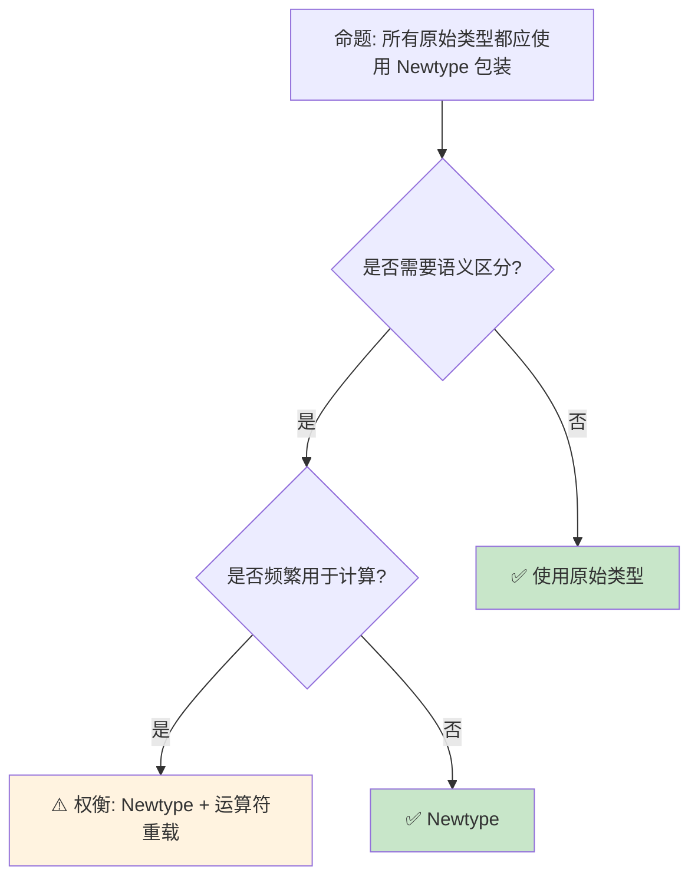

> **内容分级**: [综述级]

> **本节关键术语**: 新类型模式 (Newtype Pattern) · 包装类型 (Wrapper Type) · 类型安全 (Type Safety) · 零成本抽象 · Deref — [完整对照表](../00_meta/terminology_glossary.md)
>
# Newtype 与包装器模式：类型安全的零成本抽象
>
> **受众**: [进阶]
>
> **Bloom 层级**: 应用 → 分析
> **定位**: 深入分析 Rust 中 **Newtype 模式**和**包装器类型**的设计——如何通过单字段元组结构体创建语义上不同的类型，实现编译期单位检查、API 封装和安全边界，同时保持零运行时开销。
> **前置概念**: [Type System](../01_foundation/04_type_system.md) · [Trait](./01_traits.md) · [Generics](./02_generics.md)
> **后置概念**: [Typestate](../06_ecosystem/02_patterns.md) · [Smart Pointers](./12_smart_pointers.md)

---

> **来源**: [Rust API Guidelines — Newtypes](https://rust-lang.github.io/api-guidelines/type-safety.html#c-newtype) · [TRPL — Newtype Pattern](https://doc.rust-lang.org/book/ch19-03-advanced-traits.html#using-the-newtype-pattern-to-implement-external-traits-on-external-types) · [Wikipedia — Newtype](https://en.wikipedia.org/wiki/Newtype) · [Rust Reference — Tuple Structs](https://doc.rust-lang.org/reference/items/structs.html) · [Rust Patterns — Newtype](https://rust-unofficial.github.io/patterns/patterns/behavioural/newtype.html)

## 📑 目录

- [Newtype 与包装器模式：类型安全的零成本抽象](#newtype-与包装器模式类型安全的零成本抽象)
  - [📑 目录](#-目录)
  - [一、核心概念](#一核心概念)
    - [1.1 Newtype 模式的本质](#11-newtype-模式的本质)
    - [1.2 单位类型与物理量](#12-单位类型与物理量)
    - [1.3 与类型别名（type alias）的区别](#13-与类型别名type-alias的区别)
  - [二、技术细节](#二技术细节)
    - [2.1 Deref 与自动解引用](#21-deref-与自动解引用)
    - [2.2 孤儿规则与 Newtype](#22-孤儿规则与-newtype)
    - [2.3 包装器类型谱系](#23-包装器类型谱系)
  - [三、设计模式矩阵](#三设计模式矩阵)
  - [四、反命题与边界分析](#四反命题与边界分析)
    - [4.1 反命题树](#41-反命题树)
    - [4.2 边界极限](#42-边界极限)
  - [五、常见陷阱](#五常见陷阱)
  - [六、来源与延伸阅读](#六来源与延伸阅读)
  - [相关概念文件](#相关概念文件)
  - [权威来源索引](#权威来源索引)
  - [十、边界测试：Newtype 与包装器的编译错误](#十边界测试newtype-与包装器的编译错误)
    - [10.1 边界测试：Newtype 不继承原类型的 trait（编译错误）](#101-边界测试newtype-不继承原类型的-trait编译错误)
    - [10.2 边界测试：PhantomData 的协变/逆变误用（编译错误 / 运行时 UB）](#102-边界测试phantomdata-的协变逆变误用编译错误--运行时-ub)
    - [10.3 边界测试：newtype 的 derive 限制（编译错误）](#103-边界测试newtype-的-derive-限制编译错误)
    - [10.4 边界测试：`Deref` 滥用导致的隐式转换陷阱（编译错误/逻辑错误）](#104-边界测试deref-滥用导致的隐式转换陷阱编译错误逻辑错误)
    - [10.5 边界测试：newtype 的 `Deref` 过度使用导致的方法名冲突（编译错误/逻辑错误）](#105-边界测试newtype-的-deref-过度使用导致的方法名冲突编译错误逻辑错误)
    - [10.4 边界测试：newtype 与 `Deref` 的方法解析冲突（编译错误/设计反模式）](#104-边界测试newtype-与-deref-的方法解析冲突编译错误设计反模式)
  - [实践](#实践)
  - [参考来源](#参考来源)
  - [认知路径](#认知路径)
    - [核心推理链](#核心推理链)
    - [反命题与边界](#反命题与边界)

---

## 一、核心概念
>
>

### 1.1 Newtype 模式的本质
>

```rust
// Newtype: 单字段元组结构体
struct Meters(f64);
struct Seconds(f64);

// 语义上不同的类型，不能互换
let distance = Meters(100.0);
let time = Seconds(10.0);

// ❌ 编译错误: 不能混合
// let speed = distance.0 / time.0;  // 可以（访问内部值）
// let wrong: Meters = time;  // 编译错误！

// 需要显式转换
fn calculate_speed(distance: Meters, time: Seconds) -> f64 {
    distance.0 / time.0  // 返回原始 f64（或另一个 Newtype）
}

// 可以添加方法和 Trait 实现
impl Meters {
    fn to_kilometers(&self) -> f64 {
        self.0 / 1000.0
    }
}

impl std::ops::Add for Meters {
    type Output = Self;
    fn add(self, other: Self) -> Self {
        Meters(self.0 + other.0)
    }
}
```

> **认知功能**: Newtype 是 Rust **类型系统的轻量级扩展**——它不增加运行时开销（单字段结构体与内部类型完全相同的大小），但提供了编译期的语义区分。
> [来源: [Rust API Guidelines]]
> **关键洞察**: Newtype 是**零成本抽象**的典范——编译后 `Meters(f64)` 与 `f64` 的机器表示完全相同。
> [来源: [Rust API Guidelines — Newtypes](https://rust-lang.github.io/api-guidelines/type-safety.html#c-newtype)]

---

### 1.2 单位类型与物理量
>

```text
物理量 Newtype 的价值:

  经典错误（无单位检查）:
  fn calculate_force(mass: f64, acceleration: f64) -> f64 {
      mass * acceleration
  }
  // 调用者可能传入质量和速度，编译器无法发现

  使用 Newtype:
  struct Kilograms(f64);
  struct MetersPerSecondSquared(f64);
  struct Newtons(f64);

  fn calculate_force(mass: Kilograms, accel: MetersPerSecondSquared) -> Newtons {
      Newtons(mass.0 * accel.0)
  }

  // 错误调用会被编译器阻止:
  // let speed = MetersPerSecond(10.0);
  // calculate_force(mass, speed);  // 编译错误！

  更完整的单位系统（如 uom crate）:
  ├── 类型级单位运算: Meter / Second = MeterPerSecond
  ├── 编译期单位检查
  └── 运行时零开销
```

> **单位洞察**: Newtype 将**维度分析**从物理学的纸笔计算提升为**编译期类型检查**——单位错误在编译期被发现。
> [来源: [uom crate](https://docs.rs/uom/latest/uom/)]

---

### 1.3 与类型别名（type alias）的区别
>

```rust,ignore
// 类型别名: 只是语法糖
type MetersAlias = f64;
type SecondsAlias = f64;

let a: MetersAlias = 100.0;
let b: SecondsAlias = 10.0;
let c = a + b;  // ✅ 编译通过！类型别名无区分

// Newtype: 真正不同的类型
struct MetersNewtype(f64);
struct SecondsNewtype(f64);

let a = MetersNewtype(100.0);
let b = SecondsNewtype(10.0);
// let c = a + b;  // ❌ 编译错误！

// 对比:
┌─────────────────┬─────────────────┬─────────────────┐
│ 特性            │ type alias      │ Newtype         │
├─────────────────┼─────────────────┼─────────────────┤
│ 类型区分        │ 否              │ 是              │
│ Trait 实现      │ 继承原类型      │ 需手动实现      │
│ 方法添加        │ 否              │ 是              │
│ 运行时开销      │ 零              │ 零              │
│ 使用场景        │ 简化复杂类型    │ 语义区分        │
└─────────────────┴─────────────────┴─────────────────┘
```

> **区别洞察**: 类型别名是**语法简化**（如 `type Result<T> = std::result::Result<T, MyError>`），Newtype 是**语义强化**（如 `struct UserId(u64)`）。
> [来源: [Rust Reference — Type Aliases](https://doc.rust-lang.org/reference/items/type-aliases.html)]

---

## 二、技术细节

### 2.1 Deref 与自动解引用
>

```rust,ignore
use std::ops::Deref;

// 使用 Deref 减少 Newtype 的样板代码
struct WrappedVec<T>(Vec<T>);

impl<T> Deref for WrappedVec<T> {
    type Target = Vec<T>;
    fn deref(&self) -> &Self::Target {
        &self.0
    }
}

// 现在 WrappedVec 可以像 Vec 一样使用
let w = WrappedVec(vec![1, 2, 3]);
println!("{}", w.len());      // Deref 到 &Vec
println!("{:?}", w.get(0));   // 使用 Vec 的方法

// 但 Deref 的陷阱:
// - 过度使用 Deref 隐藏了 Newtype 的语义
// - 调用者可能意识不到这是包装器类型
// - 建议: 只在新类型是"透明包装"时使用 Deref

// 更好的做法: 显式暴露需要的方法
struct Users(Vec<User>);

impl Users {
    fn len(&self) -> usize { self.0.len() }
    fn get(&self, index: usize) -> Option<&User> { self.0.get(index) }
    // 不暴露 push/remove 等可能破坏不变性的方法
}
```

> **Deref 洞察**: `Deref` 是**双刃剑**——它简化了 Newtype 的使用，但过度使用会削弱 Newtype 的语义保护。
> [来源: [std::ops::Deref](https://doc.rust-lang.org/std/ops/trait.Deref.html)]

---

### 2.2 孤儿规则与 Newtype
>

```rust,ignore
// 孤儿规则: 不能为外部类型实现外部 Trait

// ❌ 错误: 为外部类型实现外部 Trait
// impl serde::Serialize for std::io::Error { ... }

// ✅ Newtype 绕过孤儿规则
#[derive(Serialize)]
struct SerializableError(std::io::Error);

// 现在可以为 Newtype 实现任何 Trait
impl SerializableError {
    fn new(e: std::io::Error) -> Self { Self(e) }
    fn inner(&self) -> &std::io::Error { &self.0 }
}

// 这是 Newtype 的核心用例之一:
// - 为不能修改的第三方类型添加 Trait 实现
// - 为不能修改的第三方 Trait 添加类型支持
// - 这是 "Newtype 模式" 在 TRPL 中的主要介绍场景
```

> **孤儿规则洞察**: Newtype 是 Rust **孤儿规则**的**标准解法**——当需要为外部类型实现外部 Trait 时，创建一个包装器类型。
> [来源: [TRPL — Newtype Pattern](https://doc.rust-lang.org/book/ch19-03-advanced-traits.html#using-the-newtype-pattern-to-implement-external-traits-on-external-types)]

---

### 2.3 包装器类型谱系
>

```text
Rust 中的包装器类型:

  语义包装器:
  ├── UserId(u64)          // 防止混淆不同 ID 类型
  ├── EmailAddress(String) // 保证格式验证
  └── NonEmptyVec<T>(Vec<T>) // 运行时不变性

  能力包装器:
  ├── Box<T>       // 堆分配
  ├── Rc<T>        // 共享所有权
  ├── Arc<T>       // 线程安全共享
  ├── RefCell<T>   // 内部可变性
  ├── Cell<T>      // 复制语义内部可变
  ├── Mutex<T>     // 线程安全互斥
  ├── Option<T>    // 可空类型
  └── Result<T, E> // 错误处理

  转换包装器:
  ├── Cow<'a, T>   // 借用或拥有
  ├── Pin<P>       // 不动性保证
  └── ManuallyDrop<T> // 控制 Drop

  标记包装器:
  ├── PhantomData [来源: [std::marker::PhantomData](https://doc.rust-lang.org/std/marker/struct.PhantomData.html)]<T> // 标记类型关系
  └── UnsafeCell<T>  // 内部可变性的核心
```

> **谱系洞察**: Rust 的**整个类型系统**建立在**组合包装器**的基础上——每个包装器添加一种"能力"或"约束"，通过类型组合表达复杂语义。
> [来源: [Rust API Guidelines — Type Safety](https://rust-lang.github.io/api-guidelines/type-safety.html)]

---

## 三、设计模式矩阵

```text
场景 → 模式 → 实现方式

防止 ID 混淆:
  → struct UserId(u64);
  → struct OrderId(u64);
  → 编译器阻止混用

保证验证过的数据:
  → struct Email(String);
  → 构造时验证格式
  → 无法构造未验证的 Email

添加外部 Trait 实现:
  → Newtype 绕过孤儿规则
  → #[derive(Serialize)]
  → 为 io::Error 添加 JSON 序列化

限制 API 表面:
  → 只暴露部分方法
  → 不实现 Deref
  → 保持语义边界

运行时不变性:
  → struct NonEmpty<T>(Vec<T>);
  → 构造时检查 len > 0
  → 所有方法保持非空

零成本抽象:
  → Newtype 编译后与内部类型相同
  → 无运行时开销
  → 完全优化掉
```

> **模式矩阵**: Newtype 是 Rust **类型驱动设计**的基础工具——它使"让非法状态不可表示"的设计哲学在编译期得以实现。
> [source: [Parse Don't Validate](https://lexi-lambda.github.io/blog/2019/11/05/parse-don-t-validate/)]

---

## 四、反命题与边界分析

### 4.1 反命题树
>



> **认知功能**: Newtype 的**核心判断**是"是否需要语义区分"。频繁计算的数值类型（如循环计数器）通常不需要 Newtype。
> [source: [Rust API Guidelines](https://rust-lang.github.io/api-guidelines/type-safety.html#c-newtype)]

---

### 4.2 边界极限
>

```text
边界 1: 运算符重载的样板代码
├── Newtype 需要手动实现算术运算符
├── impl Add, Sub, Mul, Div... 繁琐
├── 可以使用 derive_more 等 crate 减少样板
└── 但增加了编译依赖

边界 2: 与泛型代码的交互
├── Vec<Meters> 不能直接与 Vec<f64> 互操作
├── 需要映射转换
├── 某些泛型算法对新类型不友好
└── 缓解: 实现 From/Into、Deref

边界 3: FFI 边界
├── Newtype 在 FFI 中需要解包为原始类型
├── C 代码不理解 Rust 的结构体包装
├── 需要显式转换
└── 缓解: #[repr(transparent)]

边界 4: 序列化/反序列化
├── serde 默认将 Newtype 序列化为对象 {"0": value}
├── 需要 #[serde(transparent)] 扁平化
├── 增加了配置复杂度
└── 但这是明确的、可发现的

边界 5: 调试和错误信息
├── Newtype 在错误信息中显示为结构体
├── 可能比原始类型更难读
├── 需要实现 Display 改善输出
└── 缓解: #[derive(Display)] 或手动实现
```

> **边界要点**: Newtype 的边界主要与**运算符重载样板**、**泛型互操作**、**FFI**、**序列化**和**调试体验**相关。
> [source: [Rust API Guidelines — Transparency](https://rust-lang.github.io/api-guidelines/type-safety.html#c-transparent)]

---

## 五、常见陷阱

```text
陷阱 1: 过度使用 Deref
  ❌ impl Deref for Email { type Target = str; }
     // 调用者可以直接使用字符串方法
     // 可能绕过验证（如改变内容）

  ✅ 只暴露安全的方法
     // 不实现 Deref，手动实现需要的方法

陷阱 2: 忘记 #[repr(transparent)]
  ❌ struct UserId(u64);
     // FFI 中可能与 u64 有不同的 ABI

  ✅ #[repr(transparent)]
     struct UserId(u64);
     // 保证与 u64 完全相同的 ABI

陷阱 3: Newtype 中包含多个字段
  ❌ struct Point { x: f64, y: f64 }
     // 这不是 Newtype，是正常结构体

  ✅ Newtype 严格是单字段元组结构体
     // struct X(T); 而非 struct X { field: T }

陷阱 4: 混淆构造和验证
  ❌ struct Email(String);  // 无验证构造
     impl Email { fn new(s: &str) -> Self { Self(s.to_string()) } }
     // 可以构造非法邮箱

  ✅ fn new(s: &str) -> Result<Self, EmailError> {
       if is_valid(s) { Ok(Self(s.to_string())) } else { Err(...) }
     }

陷阱 5: 忽略 Clone/Copy 的语义
  ❌ #[derive(Clone, Copy)] struct Token(u64);
     // Token 可能被意外复制而非移动

  ✅ 根据语义选择 Clone/Copy
     // 唯一标识符通常只 Clone，不 Copy
```

> **陷阱总结**: Newtype 的陷阱主要与**Deref 滥用**、**FFI ABI**、**验证缺失**和**Clone/Copy 语义**相关。
> [source: [Rust Reference — repr(transparent)](https://doc.rust-lang.org/reference/type-layout.html#the-transparent-representation)]

---

## 六、来源与延伸阅读
>

| 来源 | 可信度 | 说明 |
| [Rust Reference](https://doc.rust-lang.org/reference/) | ✅ 一级 | 语言参考 |
| [Rust By Example](https://doc.rust-lang.org/rust-by-example/) | ✅ 一级 | 交互式学习 |
| [RFC Book](https://rust-lang.github.io/rfcs/) | ✅ 一级 | RFC 文档 |
| [Rust Cookbook](https://rust-lang-nursery.github.io/rust-cookbook/) | ✅ 二级 | 实践配方 |
| [This Week in Rust](https://this-week-in-rust.org/) | ✅ 二级 | 社区动态 |

| [Rust Standard Library](https://doc.rust-lang.org/std/) | ✅ 一级 | 标准库参考 |
| [Rust By Example](https://doc.rust-lang.org/rust-by-example/) | ✅ 一级 | 交互式教程 |
| [This Week in Rust](https://this-week-in-rust.org/) | ✅ 二级 | 社区动态 |

| [Rust Reference](https://doc.rust-lang.org/reference/) | ✅ 一级 | 语言参考 |
|:---|:---:|:---|
| [Rust API Guidelines — Newtypes](https://rust-lang.github.io/api-guidelines/type-safety.html#c-newtype) | ✅ 一级 | 官方指南 |
| [TRPL — Newtype Pattern](https://doc.rust-lang.org/book/ch19-03-advanced-traits.html) | ✅ 一级 | 模式介绍 |
| [Rust Patterns — Newtype](https://rust-unofficial.github.io/patterns/patterns/behavioural/newtype.html) | ✅ 二级 | 模式库 |
| [uom crate](https://docs.rs/uom/latest/uom/) | ✅ 一级 | 单位类型库 |
| [derive_more](https://docs.rs/derive_more/latest/derive_more/) | ✅ 一级 | 减少 Newtype 样板 |

---

## 相关概念文件

- [Type System](../01_foundation/04_type_system.md) — 类型系统
- [Trait](./01_traits.md) — Trait 系统
- [Generics](./02_generics.md) — 泛型系统
- [Patterns](../06_ecosystem/02_patterns.md) — 设计模式

---

> **权威来源**: [Rust Reference](https://doc.rust-lang.org/reference/), [The Rust Programming Language](https://doc.rust-lang.org/book/)
>
> **权威来源对齐变更日志**: 2026-05-22 创建 [来源: Authority Source Sprint Batch 9]

**文档版本**: 1.0
**对应 Rust 版本**: 1.96.0+ (Edition 2024)
**最后更新**: 2026-05-22
**状态**: ✅ 概念文件创建完成

---

## 权威来源索引

>
>
>
>

---

> **补充来源**

## 十、边界测试：Newtype 与包装器的编译错误

### 10.1 边界测试：Newtype 不继承原类型的 trait（编译错误）

```rust,ignore
struct Meters(u32);

fn add_distance(a: Meters, b: Meters) -> Meters {
    // ❌ 编译错误: cannot add `Meters` to `Meters`
    // Newtype 不自动实现原类型的 trait
    Meters(a.0 + b.0) // 必须手动解包
}

fn main() {
    let d1 = Meters(100);
    let d2 = Meters(200);
    let _ = add_distance(d1, d2);
}

// 正确: 为 Newtype 实现所需 trait
use std::ops::Add;

impl Add for Meters {
    type Output = Self;
    fn add(self, other: Self) -> Self {
        Meters(self.0 + other.0)
    }
}
```

> **修正**: Newtype 模式（`struct Wrapper(T)`）创建全新的类型，**不继承**原类型的任何 trait 实现。这是 Newtype 的核心特征——类型隔离。如需使用原类型的操作，必须手动实现（或使用 `derive_more` crate 委托）。这与 C++ 的 `typedef` 或 `using`（类型别名）完全不同——Rust 的 Newtype 是强类型抽象，编译器将 `Meters` 和 `u32` 视为完全不同的类型。[来源: [The Rust Programming Language](https://doc.rust-lang.org/book/)]

### 10.2 边界测试：PhantomData 的协变/逆变误用（编译错误 / 运行时 UB）

```rust,ignore,use std::marker::PhantomData;

struct Container<T> {
    ptr: *const u8,
    _marker: PhantomData<T>,
}

fn main() {
    let c: Container<&'static str> = Container {
        ptr: std::ptr::null(),
        _marker: PhantomData,
    };
    // ⚠️ 逻辑错误: PhantomData<&'static str> 使 Container 对 'static 协变
    // 若将 Container<&'static str> 转为 Container<&'a str>（'a 更短），可能不安全
    let _short: Container<&str> = c; // 类型转换，但语义可能错误
}

// 正确: 使用 PhantomData<*const T> 使类型不变
struct InvariantContainer<T> {
    ptr: *const u8,
    _marker: PhantomData<*const T>, // ✅ *const T 使 T 不变（invariant）
}
```

> **修正**: `PhantomData<T>` 不仅标记类型参数的使用，还影响类型的**变异性**（variance）。`PhantomData<&'a T>` 使类型对 `'a` 协变，`PhantomData<&'a mut T>` 使类型对 `'a` 逆变，`PhantomData<*const T>` 使类型对 `T` 不变。错误选择变异性可能导致生命周期绕过——将短生命周期值通过类型转换赋给期望长生命周期的上下文，产生悬垂引用。这是 Rust 高级类型系统的微妙之处，也是 unsafe 代码审查的重点。[来源: [Rustonomicon](https://doc.rust-lang.org/nomicon/)]

### 10.3 边界测试：newtype 的 derive 限制（编译错误）

```rust,ignore
struct Meters(u32);
struct Seconds(u32);

fn main() {
    let m = Meters(100);
    let s = Seconds(60);
    // ❌ 编译错误: newtype 不自动继承底层类型的 trait 实现
    let total = m.0 + s.0; // 需要手动访问内部字段
    // 不能: m + s（即使 Meters 和 Seconds 都包装 u32）
}
```

> **修正**: newtype 模式（`struct Meters(u32)`）创建新类型，不自动继承底层类型的 trait 实现。需要手动实现 `Add`、`Display`、`From` 等 trait，或使用 `derive_more` crate 减少样板。这是 newtype 的代价：类型安全（防止 `Meters` + `Seconds` 的语义错误）需要显式实现操作。若需要完全继承底层类型的行为，使用类型别名（`type Meters = u32`）——但类型别名不创建新类型，无 newtype 的安全保护。Rust 的 orphan rule 也限制 newtype 的 trait 实现：不能为外部类型实现外部 trait（`impl Add for Meters` 中 `Meters` 是本地类型，合法；但 `impl Add for u32` 非法）。这与 Haskell 的 `newtype`（自动派生底层类型的 typeclass 实例，通过 `GeneralizedNewtypeDeriving`）或 Scala 的 value class（类似 newtype，有性能优化）不同——Rust 更保守，要求显式实现。[来源: [The Rust Programming Language](https://doc.rust-lang.org/book/ch19-03-advanced-traits.html)] · [来源: [Rust API Guidelines](https://rust-lang.github.io/api-guidelines/)]

### 10.4 边界测试：`Deref` 滥用导致的隐式转换陷阱（编译错误/逻辑错误）

```rust,ignore
use std::ops::Deref;

struct Wrapper(String);

impl Deref for Wrapper {
    type Target = String;
    fn deref(&self) -> &String { &self.0 }
}

fn takes_str(s: &str) {
    println!("{}", s);
}

fn main() {
    let w = Wrapper(String::from("hello"));
    takes_str(&w); // ✅ Deref 强制转换: &Wrapper → &String → &str

    // ❌ 逻辑错误: Deref 使 Wrapper 表现得像 String，但语义不同
    // 开发者可能忘记 Wrapper 和 String 是不同的类型
    let s: String = w.clone(); // 克隆的是 String，不是 Wrapper
}
```

> **修正**: `Deref` 强制转换是 Rust 的"便捷特性"：`&Wrapper` 可自动转为 `&String`（若 `Wrapper: Deref<Target=String>`），再转为 `&str`（若 `String: Deref<Target=str>`）。但过度使用 `Deref` 创建"隐式接口"——`Wrapper` 似乎拥有 `String` 的所有方法，但实际上只转发引用操作。修改操作（`push_str`、`clear`）需要 `DerefMut`，构造需要 `From`/`Into`。API 设计建议：只为智能指针类型（`Box`、`Rc`、`Arc` 的自定义版本）实现 `Deref`，不为领域类型（`Meters`、`Username`）实现——领域类型应显式定义方法，避免隐式行为带来的困惑。[来源: [The Rust Programming Language](https://doc.rust-lang.org/book/ch15-02-deref.html)] · [来源: [Rust API Guidelines](https://rust-lang.github.io/api-guidelines/predictability.html)]

### 10.5 边界测试：newtype 的 `Deref` 过度使用导致的方法名冲突（编译错误/逻辑错误）

```rust,ignore
use std::ops::Deref;

struct Username(String);

impl Deref for Username {
    type Target = String;
    fn deref(&self) -> &String { &self.0 }
}

fn main() {
    let u = Username(String::from("alice"));
    // ❌ 逻辑错误: Deref 使 Username 拥有 String 的所有方法
    // 但某些方法可能语义不当
    let _ = u.to_uppercase(); // 返回 String，不是 Username
    let _ = u.len(); // 是 String 的长度，语义正确
    let _ = u.clone(); // 返回 String，不是 Username!
}
```

> **修正**: `Deref` 强制转换使 newtype 获得内部类型的所有方法，但**返回类型**仍是内部类型。`u.clone()` 返回 `String` 而非 `Username`，因为 `clone` 的签名在 `String` 中定义，返回 `Self`（`String`）。若需要 `Username::clone()` 返回 `Username`，必须手动 `impl Clone for Username`。这是 `Deref` 委托的局限：它转发方法调用，但不改变方法签名。这与 C# 的 `implicit operator`（类似转换，但同样不改变返回类型）或 Scala 的 `implicit class`（扩展方法，不继承方法）类似——newtype 模式要求显式实现所需 trait，不能仅依赖 `Deref`。[来源: [The Rust Programming Language](https://doc.rust-lang.org/book/ch15-02-deref.html)] · [来源: [Rust API Guidelines](https://rust-lang.github.io/api-guidelines/predictability.html)]

### 10.4 边界测试：newtype 与 `Deref` 的方法解析冲突（编译错误/设计反模式）

```rust,ignore
use std::ops::Deref;

struct Meters(u32);

impl Deref for Meters {
    type Target = u32;
    fn deref(&self) -> &u32 { &self.0 }
}

impl Meters {
    fn value(&self) -> u32 { self.0 }
}

fn main() {
    let m = Meters(100);
    // ❌ 方法解析冲突: Meters::value 与 u32 的方法可能混淆
    println!("{}", m.value());
    println!("{}", m.saturating_add(50)); // u32 的方法，通过 Deref
}
```

> **修正**: newtype 模式（`struct Meters(u32)`）创建语义不同的类型，但 `Deref` 自动解引用使 newtype 像底层类型一样行为。这导致**方法解析困惑**：`m.saturating_add(50)` 调用 `u32::saturating_add`，而非 `Meters` 的方法（若存在）。设计原则：newtype 用于**类型安全**（防止混淆 Meters 和 Seconds），但 `Deref` 削弱了这一优势。替代方案：1) 不显式实现 `Deref`，只提供必要方法；2) 使用 `From`/`Into` 显式转换；3) 使用 `as_ref()` / `into_inner()` 访问内部值。这与 Haskell 的 `newtype`（无运行时开销，无 Deref 等价物，需显式解包）或 Ada 的派生类型（类似 newtype，无隐式转换）相同——Rust 的 newtype 最纯粹的形式是不实现 `Deref`，完全通过显式 API 交互。[来源: [Newtype Pattern](https://rust-unofficial.github.io/patterns/patterns/behavioural/newtype.html)] · [来源: [Rust API Guidelines](https://rust-lang.github.io/api-guidelines/)]

## 实践

> **相关资源**:
>
> - [crates/ 示例代码](../../crates/) — 与本文概念对应的可编译示例
> - [exercises/ 练习](../../exercises/) — 动手编程挑战
> - [MVP 学习路径](../00_meta/LEARNING_MVP_PATH.md) — 从零到多线程 CLI 的 40 小时路径
>
> **建议**: 阅读完本概念文件后，打开对应 crate 的示例代码，尝试修改并运行。完成至少 1 道相关练习以巩固理解。

## 参考来源

> [来源: [Rust Reference — Newtype Idiom](https://doc.rust-lang.org/reference/types/struct.html)]

> [来源: [RFC 0738 — Variadic](https://rust-lang.github.io/rfcs/0738-variance.html)]

> [来源: [Rust API Guidelines — Newtypes](https://rust-lang.github.io/api-guidelines/)]

## 认知路径

> **认知路径**: 从 L0 基础概念出发，经由本节的 **Newtype 与包装器模式：类型安全的零成本抽象** 核心原理，通向 L2 进阶模式与 L3 工程实践。

### 核心推理链

| 定理 | 前提 | 结论 | 置信度 |
|:---|:---|:---|:---|
| Newtype 与包装器模式：类型安全的零成本抽象 基础定义 ⟹ 正确用法 | 理解语法与语义 | 能写出符合惯用法的代码 | 高 |
| Newtype 与包装器模式：类型安全的零成本抽象 正确用法 ⟹ 常见陷阱 | 忽略边界条件 | 编译错误或运行时 bug | 高 |
| Newtype 与包装器模式：类型安全的零成本抽象 常见陷阱 ⟹ 深度掌握 | 系统学习反模式 | 能进行代码审查与优化 | 高 |

> **过渡**: 掌握 Newtype 与包装器模式：类型安全的零成本抽象 的基础语法后，下一步需要理解其在类型系统中的位置与与其他概念的交互关系。

> **过渡**: 在实践中应用 Newtype 与包装器模式：类型安全的零成本抽象 时，务必关注边界条件与异常处理，这是从"能编译"到"能生产"的关键跃迁。

> **过渡**: Newtype 与包装器模式：类型安全的零成本抽象 的设计理念体现了 Rust 零成本抽象与安全保证的核心权衡，理解这一权衡有助于迁移到更高级的并发与形式化验证领域。

### 反命题与边界

> **反命题**: "Newtype 与包装器模式：类型安全的零成本抽象 在所有场景下都是最佳选择" —— 错误。需要根据具体上下文权衡性能、可读性与安全性，某些场景下显式替代方案可能更优。
