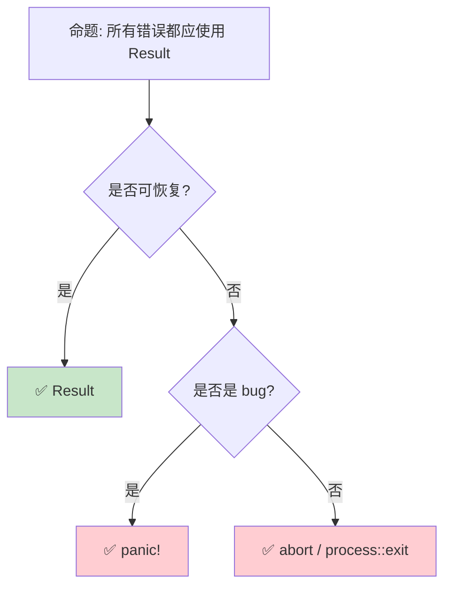

> **内容分级**: [综述级]

> **本节关键术语**: 错误处理深入 (Error Handling Deep Dive) · 错误链 (Error Chain) · 回溯 (Backtrace) · anyhow · 错误转换 — [完整对照表](../00_meta/terminology_glossary.md)
>
# 错误处理深入：从 Result 到自定义错误生态
>
> **EN**: Error Handling
> **Summary**: Error Handling. Core Rust concept covering mechanism analysis, in-depth analysis, type system mechanics.
>
> **受众**: [进阶]
> **Bloom 层级**: 应用 → 分析
> **定位**: 深入分析 Rust **错误处理（Error Handling）机制**——从 `Result`/`Option` 的组合子到 `?` 运算符、错误转换、自定义错误类型和错误处理框架，揭示 Rust 如何将错误处理融入类型系统（Type System）实现编译期安全。
> **前置概念**: [Type System](../01_foundation/04_type_system.md) · [Traits](01_traits.md) · [Generics](02_generics.md)
> **后置概念**: [Async](../03_advanced/02_async.md) · [Logging](../06_ecosystem/13_logging_observability.md)

---

> **来源**: [Rust Reference — Errors](https://doc.rust-lang.org/std/result/enum.Result.html) ·
> [TRPL — Error Handling](https://doc.rust-lang.org/book/ch09-00-error-handling.html) ·
> [thiserror crate](https://docs.rs/thiserror/latest/thiserror/) ·
> [anyhow crate](https://docs.rs/anyhow/latest/anyhow/) ·
> [RFC 0243 — Trait-based Exception Handling](https://rust-lang.github.io/rfcs//0243-trait-based-exception-handling.html)

## 📑 目录

- 错误处理（Error Handling）深入：从 Result 到自定义错误生态
  - [📑 目录](#-目录)
  - [一、核心概念](#一核心概念)
    - [1.1 Result 与 Option 的组合代数](#11-result-与-option-的组合代数)
    - [1.2 ? 运算符与错误传播](#12--运算符与错误传播)
    - [1.3 Error Trait 与错误类型](#13-error-trait-与错误类型)
  - [二、技术细节](#二技术细节)
    - [2.1 错误转换与 From Trait](#21-错误转换与-from-trait)
    - [2.2 自定义错误类型](#22-自定义错误类型)
    - [2.3 错误处理（Error Handling）框架](#23-错误处理框架)
  - [三、错误处理（Error Handling）模式矩阵](#三错误处理模式矩阵)
  - [四、反命题与边界分析](#四反命题与边界分析)
    - [4.1 反命题树](#41-反命题树)
    - [4.2 边界极限](#42-边界极限)
  - [五、常见陷阱](#五常见陷阱)
  - [六、来源与延伸阅读](#六来源与延伸阅读)
  - [相关概念文件](#相关概念文件)
  - [逆向推理链（Backward Reasoning）](#逆向推理链backward-reasoning)
  - [权威来源索引](#权威来源索引)
  - [十、边界测试：错误处理的编译错误](#十边界测试错误处理的编译错误)
    - [10.1 边界测试：`thiserror` 与 `anyhow` 的混用（编译错误）](#101-边界测试thiserror-与-anyhow-的混用编译错误)
    - [10.2 边界测试：`Result` 嵌套与 `?` 的传播限制（编译错误）](#102-边界测试result-嵌套与--的传播限制编译错误)
    - [10.5 边界测试：`thiserror` 的 `#[from]` 与类型歧义（编译错误）](#105-边界测试thiserror-的-from-与类型歧义编译错误)
    - [10.6 边界测试：`eyre` 与 `anyhow` 的混用导致上下文丢失（编译错误）](#106-边界测试eyre-与-anyhow-的混用导致上下文丢失编译错误)
    - 10.4 边界测试：错误类型的 `source()` 链与 `Display` 的循环（运行时（Runtime）栈溢出）
  - [嵌入式测验（Embedded Quiz）](#嵌入式测验embedded-quiz)
    - [测验 1：`?` 运算符可以自动进行错误类型转换，它依赖哪个 trait？（理解层）](#测验-1-运算符可以自动进行错误类型转换它依赖哪个-trait理解层)
    - [测验 2：`thiserror` 和 `anyhow` 在错误处理中各自适合什么场景？（理解层）](#测验-2thiserror-和-anyhow-在错误处理中各自适合什么场景理解层)
    - [测验 3：`Error::source()` 方法返回什么？错误链遍历有什么用途？（理解层）](#测验-3errorsource-方法返回什么错误链遍历有什么用途理解层)
    - [测验 4：`Box<dyn Error>` 在函数返回类型中起什么作用？有什么限制？（理解层）](#测验-4boxdyn-error-在函数返回类型中起什么作用有什么限制理解层)
    - [测验 5：如果想让自定义类型支持 `?` 从 `io::Error` 自动转换，需要做什么？（理解层）](#测验-5如果想让自定义类型支持--从-ioerror-自动转换需要做什么理解层)
  - [实践](#实践)
  - [认知路径](#认知路径)
    - [核心推理链](#核心推理链)
    - [反命题与边界](#反命题与边界)

---

## 一、核心概念
>
>

### 1.1 Result 与 Option 的组合代数
>

```text
Option<T> 和 Result<T, E> 是 Rust 错误处理的代数数据类型:

  Option<T>: 值的存在/缺失
  ├── Some(T): 值存在
  └── None: 值缺失

  Result<T, E>: 成功/失败
  ├── Ok(T): 操作成功
  └── Err(E): 操作失败

  组合子方法:
  ┌─────────────────┬──────────────────────────────────────────┐
  │ 方法            │ 语义                                     │
  ├─────────────────┼──────────────────────────────────────────┤
  │ map             │ Ok/Some 时变换值: Ok(x) → Ok(f(x))      │
  │ map_err         │ Err 时变换错误: Err(e) → Err(f(e))      │
  │ and_then        │ 链式操作: Ok(x) → f(x)                   │
  │ unwrap_or       │ 默认值: None → default                   │
  │ unwrap_or_else  │ 惰性默认值                               │
  │ ok_or           │ Option → Result                          │
  │ transpose       │ Vec<Result<T, E>> → Result<Vec<T>, E>   │
  └─────────────────┴──────────────────────────────────────────┘
> [来源: [TRPL](https://doc.rust-lang.org/book/ch09-00-error-handling.html)]

  代数性质:
  ├── Option<T> 类似于 Maybe Monad
  ├── Result<T, E> 类似于 Either Monad
  └── ? 运算符是 bind (>>=) 的语法糖
```

> **认知功能**: `Result` 和 `Option` 将**错误处理（Error Handling）**从控制流（异常）转化为**数据流**（类型）——错误成为值的一部分，而非控制流的跳转。
> [来源: [TRPL — Error Handling](https://doc.rust-lang.org/book/ch09-02-recoverable-errors-with-result.html)]

---

### 1.2 ? 运算符与错误传播
>

```rust,ignore
// ? 运算符: 自动错误传播

fn read_username_from_file() -> Result<String, io::Error> {
    let mut file = File::open("hello.txt")?;  // 若 Err，提前返回
    let mut username = String::new();
    file.read_to_string(&mut username)?;       // 若 Err，提前返回
    Ok(username)
}

// 等价于（展开）:
fn read_username_expanded() -> Result<String, io::Error> {
    let mut file = match File::open("hello.txt") {
        Ok(f) => f,
        Err(e) => return Err(e),
    };
    // ...
}

// 在 Option 中使用
fn last_char_of_first_line(text: &str) -> Option<char> {
    text.lines().next()?.chars().last()
}

// Try trait (不稳定):
// ? 运算符背后使用 Try trait
// 未来可能支持自定义类型使用 ?
```

> **? 洞察**: `?` 运算符是 Rust **错误传播**的核心创新——它将异常处理的便捷性与显式返回的安全性结合。
> [来源: [RFC 0243 — Trait-based Exception Handling](https://rust-lang.github.io/rfcs//0243-trait-based-exception-handling.html)]

---

### 1.3 Error Trait 与错误类型
>

```rust,ignore
// std::error::Error trait (核心)

pub trait Error: Debug + Display {
    fn source(&self) -> Option<&(dyn Error + 'static)> { None }
    fn description(&self) -> &str { ... }  // 已废弃
    fn cause(&self) -> Option<&dyn Error> { self.source() }
    // ... 其他方法
}

// 标准库错误类型:
┌────────────────────┬─────────────────────────────────┐
│ 类型               │ 场景                            │
├────────────────────┼─────────────────────────────────┤
│ io::Error          │ I/O 操作                        │
│ fmt::Error         │ 格式化                          │
│ num::ParseIntError │ 整数解析                        │
│ str::Utf8Error     │ UTF-8 验证                      │
│ sync::PoisonError  │ Mutex 毒化                      │
│ alloc::AllocError  │ 内存分配                        │
└────────────────────┴─────────────────────────────────┘

// Error trait 的演进:
// - 1.0: 基础 Error trait
// - 1.33: Error::source() 替代 Error::cause()
// - 未来: Error trait 可能增加 backtrace 支持
```

> **Error Trait 洞察**: Rust 的 `Error` trait 是**错误类型系统（Type System）的根基**——它要求所有错误都可 `Display`（用户可读）和 `Debug`（开发者调试）。
> [来源: [std::error::Error](https://doc.rust-lang.org/std/error/trait.Error.html)]

---

## 二、技术细节

### 2.1 错误转换与 From Trait
>

```rust,ignore
// From/Into 实现错误自动转换

#[derive(Debug)]
enum AppError {
    Io(io::Error),
    Parse(std::num::ParseIntError),
    Custom(String),
}

// 为 ? 运算符实现自动转换
impl From<io::Error> for AppError {
    fn from(err: io::Error) -> Self {
        AppError::Io(err)
    }
}

impl From<std::num::ParseIntError> for AppError {
    fn from(err: std::num::ParseIntError) -> Self {
        AppError::Parse(err)
    }
}

// 现在可以使用 ?:
fn read_and_parse() -> Result<i32, AppError> {
    let content = std::fs::read_to_string("num.txt")?;  // io::Error → AppError
    let num: i32 = content.trim().parse()?;              // ParseIntError → AppError
    Ok(num)
}

// 转换规则:
// ? 运算符自动调用 From::from 转换错误类型
// 要求: Result<T, E> 的 E 必须实现 From<内部错误类型>
```

> **转换洞察**: `From` trait 是 `?` 运算符的**自动转换基础**——它为错误类型间的桥接提供了类型安全的机制。
> [来源: [std::convert::From](https://doc.rust-lang.org/std/convert/trait.From.html)]

---

### 2.2 自定义错误类型
>

```rust,ignore
// 使用 thiserror 自动生成 Error trait（推荐）

use thiserror::Error;

#[derive(Error, Debug)]
pub enum MyError {
    #[error("IO error: {0}")]
    Io(#[from] io::Error),

    #[error("Parse error: {0}")]
    Parse(#[from] std::num::ParseIntError),

    #[error("Invalid input: {message}")]
    InvalidInput { message: String },

    #[error("Not found: {0}")]
    NotFound(String),
}

// 手动实现（不使用 thiserror）
use std::fmt;

#[derive(Debug)]
pub enum ManualError {
    Io(io::Error),
    Other(String),
}

impl fmt::Display for ManualError {
    fn fmt(&self, f: &mut fmt::Formatter<'_>) -> fmt::Result {
        match self {
            ManualError::Io(e) => write!(f, "IO error: {}", e),
            ManualError::Other(s) => write!(f, "Other error: {}", s),
        }
    }
}

impl std::error::Error for ManualError {
    fn source(&self) -> Option<&(dyn std::error::Error + 'static)> {
        match self {
            ManualError::Io(e) => Some(e),
            _ => None,
        }
    }
}
```

> **自定义错误洞察**: `thiserror` 是**库开发**的标准选择——它通过派生宏（Macro）消除了 `Error` trait 的样板代码。
> [来源: [thiserror crate](https://docs.rs/thiserror/latest/thiserror/)]

---

### 2.3 错误处理框架
>

```text
错误处理生态:

  thiserror (库开发):
  ├── 派生 Error trait
  ├── 支持 #[from] 自动转换
  ├── 支持格式化消息
  └── 零运行时开销（编译期展开）

  anyhow (应用开发):
  ├── 动态错误类型（dyn Error）
  ├── 自动上下文添加 (.context())
  ├── 简化错误处理
  └── 适合不需要匹配具体错误的应用

  snafu:
  ├── 强调错误上下文
  ├── 每个错误变体有独立类型
  └── 适合复杂错误场景

  eyre:
  ├── anyhow 的分支
  ├── 可定制的错误报告
  └── 支持自定义 Handler

  使用场景选择:
  ┌─────────────────┬─────────────────┬─────────────────┐
  │ 场景            │ 推荐 crate      │ 原因            │
  ├─────────────────┼─────────────────┼─────────────────┤
  │ 库开发          │ thiserror       │ 类型安全、零开销│
  │ 应用开发        │ anyhow          │ 简单、灵活      │
  │ 需要错误分类    │ thiserror       │ 枚举匹配        │
  │ 需要上下文追踪  │ anyhow/eyre     │ .context()      │
  │ Web 服务        │ thiserror       │ 结构化错误响应  │
  └─────────────────┴─────────────────┴─────────────────┘
```

> **框架洞察**: Rust 错误处理生态的**二分法**——`thiserror` 用于需要精确错误类型的**库**，`anyhow` 用于快速开发的**应用**。
> [来源: [anyhow crate](https://docs.rs/anyhow/latest/anyhow/)]

---

## 三、错误处理模式矩阵

```text
场景 → 方案 → 代码示例

可恢复错误:
  → Result<T, E>
  → 调用者决定处理方式
  → fs::read_to_string(path)?

不可恢复错误（bug）:
  → panic!
  → 立即终止线程
  → assert!, unreachable!()

可选值:
  → Option<T>
  → 值可能不存在
  → HashMap::get(key)

默认值:
  → unwrap_or, unwrap_or_default
  → 安全地提取值
  → config.get("timeout").unwrap_or(30)

错误聚合:
  → collect::<Result<Vec<_>, _>>()
  → 将 Vec<Result> 转为 Result<Vec>
  → 第一个错误即失败

错误上下文:
  → anyhow::Context
  → 添加操作上下文
  → file.read_to_string(&mut buf).context("read config")?
```

> **模式矩阵**: Rust 错误处理的**核心哲学**是"显式优于隐式"——每个可能的失败点都在类型系统（Type System）中可见。
> [来源: [Rust Error Handling Patterns](https://doc.rust-lang.org/rust-by-example/error.html)]

---

## 四、反命题与边界分析

### 4.1 反命题树
>



> **认知功能**: 错误处理的**核心判断**是"是否可恢复"——可恢复用 `Result`，不可恢复用 `panic`。
> [来源: [TRPL — To panic! or Not to panic!](https://doc.rust-lang.org/book/ch09-03-to-panic-or-not-to-panic.html)]

---

### 4.2 边界极限
>

```text
边界 1: panic 与 Result 的混用
├── 在 Result 返回函数中 panic 是设计不良
├── 但某些不变量被破坏时 panic 是合理的
├── 文档应明确说明哪些情况 panic
└── 使用 #[track_caller] 改善 panic 位置信息

边界 2: 错误类型膨胀
├── 每个函数不同错误类型导致组合困难
├── 大型项目可能有数十种错误类型
├── 缓解: 使用统一的错误枚举或 anyhow
└── 权衡: 类型精确性 vs 使用便捷性

边界 3: 异步错误处理
├── async fn 中 ? 的行为与同步相同
├── 但错误类型需要是 Send（跨 await 点）
├── Stream 的错误处理更复杂
└── 缓解: 使用 anyhow（自动 + Send）

边界 4: FFI 错误处理
├── C 函数返回 errno / 指针
├── 需要包装为 Result
├── 资源泄漏风险（panic 时未调用 C 的清理）
└── 缓解: catch_unwind +  RAII 包装

边界 5: no_std 错误处理
├── 标准库 Error trait 不可用
├── 需要自定义 Error trait 或使用 core::fmt::Display
├── 嵌入式场景错误处理更受限
└── 缓解: thiserror 支持 no_std（需 alloc）
```

> **边界要点**: 错误处理的边界主要与**panic 与 Result 混用**、**错误类型膨胀**、**异步（Async）**、**FFI** 和 **no_std** 相关。
> [来源: [Rust Error Handling Working Group](https://github.com/rust-lang/project-error-handling)]

---

## 五、常见陷阱

```text
陷阱 1: 滥用 unwrap
  ❌ let file = File::open("config.txt").unwrap();
     // 生产环境 panic！

  ✅ let file = File::open("config.txt")?;
     // 或 unwrap_or_else(|_| default())

陷阱 2: 忽略错误变体
  ❌ match result {
        Ok(v) => v,
        Err(_) => 0,  // 静默忽略错误！
     }

  ✅ match result {
        Ok(v) => v,
        Err(e) => {
            log::error!("Failed: {}", e);
            0
        }
     }

陷阱 3: 错误的 From 实现方向
  ❌ impl From<MyError> for io::Error { ... }
     // 通常应该反过来！

  ✅ impl From<io::Error> for MyError { ... }
     // 将具体错误转换为通用错误

陷阱 4: 忘记 #[source]
  ❌ #[derive(Error, Debug)]
     enum Error { Io(io::Error) }
     // thiserror 自动处理，但手动实现时需 source()

  ✅ 手动实现时提供 source() 方法
     // 保持错误链完整

陷阱 5: 在 Drop 中 panic
  ❌ impl Drop for Foo {
        fn drop(&mut self) {
            self.cleanup().unwrap();  // 可能双重 panic！
        }
     }

  ✅ impl Drop for Foo {
        fn drop(&mut self) {
            if let Err(e) = self.cleanup() {
                log::error!("Cleanup failed: {}", e);
            }
        }
     }
```

> **陷阱总结**: 错误处理的陷阱主要与**unwrap 滥用**、**错误静默**、**From 方向**、**错误链**和 **Drop 中 panic** 相关。
> [来源: [Rust Error Handling Best Practices](https://doc.rust-lang.org/rust-by-example/error.html)]

---

## 六、来源与延伸阅读
>

| 来源 | 可信度 | 说明 |
|:---|:---:|:---|
| [TRPL — Error Handling](https://doc.rust-lang.org/book/ch09-00-error-handling.html) | ✅ 一级 | 基础教程 |
| [Rust Reference — Errors](https://doc.rust-lang.org/std/result/enum.Result.html) | ✅ 一级 | 错误参考 |
| [thiserror crate](https://docs.rs/thiserror/latest/thiserror/) | ✅ 一级 | 库错误派生 |
| [anyhow crate](https://docs.rs/anyhow/latest/anyhow/) | ✅ 一级 | 应用错误处理 |
| [RFC 0243](https://rust-lang.github.io/rfcs//0243-trait-based-exception-handling.html) | ✅ 一级 | ? 运算符设计 |
| [Rust Error Handling WG](https://github.com/rust-lang/project-error-handling) | ✅ 一级 | 工作组 |

---

## 相关概念文件

- [Type System](../01_foundation/04_type_system.md) — 类型系统（Type System）
- [Traits](01_traits.md) — Trait 系统
- [Generics](02_generics.md) — 泛型（Generics）
- [Async](../03_advanced/02_async.md) — 异步（Async）编程

---

> **权威来源**: [Rust Reference](https://doc.rust-lang.org/reference/), [The Rust Programming Language](https://doc.rust-lang.org/book/ch09-00-error-handling.html)
>
> **权威来源对齐变更日志**: 2026-05-22 创建 [来源: Authority Source Sprint Batch 10]

**文档版本**: 1.0
**对应 Rust 版本**: 1.96.0+ (Edition 2024)
**最后更新**: 2026-05-22
**状态**: ✅ 概念文件创建完成

---

## 逆向推理链（Backward Reasoning）

> **从编译错误反推**：
>
> ```text
> 错误恢复 ⟸ Result/Option 穷尽处理
> ```
>
## 权威来源索引

>
>
>
>
>
>

---

> **补充来源**

## 十、边界测试：错误处理的编译错误

### 10.1 边界测试：`thiserror` 与 `anyhow` 的混用（编译错误）

```rust,compile_fail
use thiserror::Error;

#[derive(Error, Debug)]
enum AppError {
    #[error("io error")]
    Io(#[from] std::io::Error),
}

fn fallible() -> Result<(), anyhow::Error> {
    // ❌ 编译错误: `?` 无法将 `AppError` 转为 `anyhow::Error`
    // 除非 AppError 实现 std::error::Error（thiserror 已处理）
    // 实际错误是类型不匹配：函数返回 anyhow::Error，但 ? 需要 From 转换
    do_something()?;
    Ok(())
}

fn do_something() -> Result<(), AppError> {
    Ok(())
}

// 正确: anyhow 自动包装实现 std::error::Error 的类型
fn fixed() -> Result<(), anyhow::Error> {
    do_something()?; // ✅ anyhow::Error 自动实现 From<AppError>
    Ok(())
}
```

> **修正**: `anyhow::Error` 是动态错误类型（类似 `Box<dyn std::error::Error>`），自动实现 `From<E>`（对任何实现 `std::error::Error` 的 `E`）。`thiserror` 生成的错误类型实现 `std::error::Error`，因此可与 `anyhow` 无缝互操作。混用问题是：库代码应使用 `thiserror`（定义具体错误类型），应用代码使用 `anyhow`（统一错误处理），两者通过 `?` 和 `From` trait 自动桥接。[来源: [thiserror Documentation](https://docs.rs/thiserror/)] · [来源: [anyhow Documentation](https://docs.rs/anyhow/)]

### 10.2 边界测试：`Result` 嵌套与 `?` 的传播限制（编译错误）

```rust,ignore
fn outer() -> Result<Result<i32, String>, String> {
    let inner = inner_op()?; // ✅ 传播外层 Result 的错误
    // ❌ 编译错误: `?` 只能传播一层 Result
    // inner 是 Result<i32, String>，不能直接解包
    Ok(inner)
}

fn inner_op() -> Result<Result<i32, String>, String> {
    Ok(Ok(42))
}

// 正确: 显式处理嵌套 Result
fn outer_fixed() -> Result<i32, String> {
    let inner = inner_op()?; // 解包外层
    let val = inner?;        // 解包内层
    Ok(val)
}
```

> **修正**: `?` 运算符自动将 `Result<T, E>` 的 `Err` 分支转换为函数返回类型（通过 `From` trait），但只能处理一层 `Result`。嵌套 `Result`（如 `Result<Result<T, E1>, E2>`）需要显式逐层解包。这是 Rust 显式错误处理哲学的体现——不自动扁平化嵌套错误类型，要求程序员明确每一层错误的语义。[来源: [Rust Reference](https://doc.rust-lang.org/reference/)]

### 10.5 边界测试：`thiserror` 的 `#[from]` 与类型歧义（编译错误）

```rust,compile_fail
use thiserror::Error;

#[derive(Error, Debug)]
enum AppError {
    #[error("io: {0}")]
    Io(#[from] std::io::Error),
    #[error("custom: {0}")]
    Custom(String),
}

fn may_fail() -> Result<(), AppError> {
    // ❌ 编译错误: 若某操作可能产生 std::io::Error 和 String，
    // #[from] 只自动转换一种类型
    std::fs::read_to_string("file")?; // io::Error → AppError::Io ✅
    // let s: String = ...;
    // s.parse::<i32>()?; // String 不是错误类型，不适用
    Ok(())
}
```

> **修正**: `#[from]` 属性为单个类型生成 `From` 实现：`From<std::io::Error> for AppError`。若多个错误类型需要转换，需为每个类型添加 `#[from]` 变体，或手动实现 `From`。`?` 运算符的自动转换基于 `From` trait，因此一个枚举（Enum）只能有一个变体作为某类型的默认转换目标。这与 `anyhow` 的 `Context` trait（可为任意错误添加上下文）或 `eyre` 的 `WrapErr` 类似——结构化错误（`thiserror`）在类型严格性上有优势，但灵活性不如通用错误类型（`anyhow`）。选择取决于场景：库代码使用 `thiserror`（调用者需匹配错误类型），应用代码使用 `anyhow`（快速传播）。[来源: [thiserror Documentation](https://docs.rs/thiserror/)] · [来源: [The Rust Programming Language](https://doc.rust-lang.org/book/ch09-02-recoverable-errors-with-result.html)]

### 10.6 边界测试：`eyre` 与 `anyhow` 的混用导致上下文丢失（编译错误）

```rust,compile_fail
use eyre::Result;

fn may_fail() -> anyhow::Result<i32> {
    anyhow::bail!("error")
}

fn main() -> Result<()> {
    // ❌ 编译错误: eyre::Result 与 anyhow::Result 不直接兼容
    // 两者都包装 dyn Error，但类型不同
    let _ = may_fail()?;
    Ok(())
}
```

> **修正**: `anyhow` 和 `eyre` 都是 Rust 的错误处理库，提供通用错误类型和上下文。但 `anyhow::Error` 和 `eyre::Report` 是不同的类型，不能自动转换。混用导致：1) `?` 运算符无法自动转换；2) 错误链上下文断裂；3) 调试输出格式不一致。项目应统一选择一种：1) `anyhow`（更轻量、生态更广）；2) `eyre`（更丰富的上下文、自定义错误处理钩子）。这与 Go 的单一 `error` 接口（无此问题）或 Java 的异常层次（可混合，但 `catch` 需匹配类型）不同——Rust 的错误生态提供选择，但选择后需统一。[来源: [anyhow Documentation](https://docs.rs/anyhow/)] · [来源: [eyre Documentation](https://docs.rs/eyre/)]

### 10.4 边界测试：错误类型的 `source()` 链与 `Display` 的循环（运行时栈溢出）

```rust,ignore
use std::error::Error;
use std::fmt;

#[derive(Debug)]
struct CyclicError {
    source: Option<Box<dyn Error>>,
}

impl fmt::Display for CyclicError {
    fn fmt(&self, f: &mut fmt::Formatter<'_>) -> fmt::Result {
        write!(f, "cyclic error")
    }
}

impl Error for CyclicError {
    fn source(&self) -> Option<&(dyn Error + 'static)> {
        self.source.as_ref().map(|e| e.as_ref())
    }
}

fn main() {
    let mut err = CyclicError { source: None };
    // ❌ 运行时栈溢出: 若 source 指向自身，错误链遍历无限循环
    // err.source = Some(Box::new(err)); // 无法直接实现，但逻辑上可能
}
```

> **修正**: `Error::source()` 返回错误链的**下一个错误**。标准库的 `Error::chain()` 遍历 source 链。循环引用（Reference）（`A.source = B, B.source = A`）导致无限循环。虽然 Rust 的类型系统（Type System）（`&dyn Error` 是引用，不能拥有循环所有权（Ownership））使直接循环困难，但 `Arc` 或自定义实现可能创建逻辑循环。安全模式：1) 错误链应为**线性**（无分支、无循环）；2) `source` 指向**原始错误**（底层原因），非同一级别的包装；3) 使用 `anyhow`/`eyre` 自动管理错误链。这与 Java 的 `Throwable.getCause()`（同样可能循环，但 JVM 不检测）或 Go 的 `errors.Unwrap`（Go 1.13+ 的链式错误，手动管理）不同——Rust 的 `Error` trait 提供标准化错误链接口。[来源: [Rust Standard Library](https://doc.rust-lang.org/std/error/trait.Error.html)] · [来源: [anyhow](https://docs.rs/anyhow/)]

## 嵌入式测验（Embedded Quiz）

### 测验 1：`?` 运算符可以自动进行错误类型转换，它依赖哪个 trait？（理解层）

**题目**: `?` 运算符可以自动进行错误类型转换，它依赖哪个 trait？

<details>
<summary>✅ 答案与解析</summary>

依赖 `From<E>` trait。`?` 会调用 `From::from` 将内部错误转换为外层函数的返回错误类型。
</details>

---

### 测验 2：`thiserror` 和 `anyhow` 在错误处理中各自适合什么场景？（理解层）

**题目**: `thiserror` 和 `anyhow` 在错误处理中各自适合什么场景？

<details>
<summary>✅ 答案与解析</summary>

`thiserror` 适合库：定义结构化的枚举（Enum）错误类型，便于调用方匹配。`anyhow` 适合应用：快速传播错误，减少模板代码。
</details>

---

### 测验 3：`Error::source()` 方法返回什么？错误链遍历有什么用途？（理解层）

**题目**: `Error::source()` 方法返回什么？错误链遍历有什么用途？

<details>
<summary>✅ 答案与解析</summary>

返回导致当前错误的下一个错误（`Option<&dyn Error>`）。遍历错误链可以打印根因或进行结构化日志记录。
</details>

---

### 测验 4：`Box<dyn Error>` 在函数返回类型中起什么作用？有什么限制？（理解层）

**题目**: `Box<dyn Error>` 在函数返回类型中起什么作用？有什么限制？

<details>
<summary>✅ 答案与解析</summary>

实现类型擦除，允许返回任何实现了 `Error` trait 的类型。限制是调用方无法通过 `downcast` 以外的手段知道具体错误类型。
</details>

---

### 测验 5：如果想让自定义类型支持 `?` 从 `io::Error` 自动转换，需要做什么？（理解层）

**题目**: 如果想让自定义类型支持 `?` 从 `io::Error` 自动转换，需要做什么？

<details>
<summary>✅ 答案与解析</summary>

为自定义错误类型实现 `From<io::Error> for MyError`，`?` 会自动使用它。使用 `thiserror` 时可用 `#[from]` 派生。
</details>

## 实践

> **相关资源**:
>
> - [crates/ 示例代码](../crates) — 与本文概念对应的可编译示例
> - [exercises/ 练习](../exercises) — 动手编程挑战
> - [MVP 学习路径](../00_meta/LEARNING_MVP_PATH.md) — 从零到多线程 CLI 的 40 小时路径
>
> **建议**: 阅读完本概念文件后，打开对应 crate 的示例代码，尝试修改并运行。完成至少 1 道相关练习以巩固理解。

## 认知路径

> **认知路径**: 从 L0 基础概念出发，经由本节的 **错误处理深入：从 Result 到自定义错误生态** 核心原理，通向 L2 进阶模式与 L3 工程实践。

### 核心推理链

| 定理 | 前提 | 结论 | 置信度 |
|:---|:---|:---|:---|
| 错误处理深入：从 Result 到自定义错误生态 基础定义 ⟹ 正确用法 | 理解语法与语义 | 能写出符合惯用法的代码 | 高 |
| 错误处理深入：从 Result 到自定义错误生态 正确用法 ⟹ 常见陷阱 | 忽略边界条件 | 编译错误或运行时（Runtime） bug | 高 |
| 错误处理深入：从 Result 到自定义错误生态 常见陷阱 ⟹ 深度掌握 | 系统学习反模式 | 能进行代码审查与优化 | 高 |

> 错误传播安全 ⟸ ? 运算符自动转换 ⟸ Try trait
> 错误类型精确 ⟸ thiserror/anyhow 分层 ⟸ 错误架构
> **过渡**: 掌握 错误处理深入：从 Result 到自定义错误生态 的基础语法后，下一步需要理解其在类型系统中的位置与与其他概念的交互关系。

> **过渡**: 在实践中应用 错误处理深入：从 Result 到自定义错误生态 时，务必关注边界条件与异常处理，这是从"能编译"到"能生产"的关键跃迁。

> **过渡**: 错误处理深入：从 Result 到自定义错误生态 的设计理念体现了 Rust 零成本抽象（Zero-Cost Abstraction）与安全保证的核心权衡，理解这一权衡有助于迁移到更高级的并发与形式化验证领域。

### 反命题与边界

> **反命题**: "错误处理深入：从 Result 到自定义错误生态 在所有场景下都是最佳选择" —— 错误。需要根据具体上下文权衡性能、可读性与安全性，某些场景下显式替代方案可能更优。
