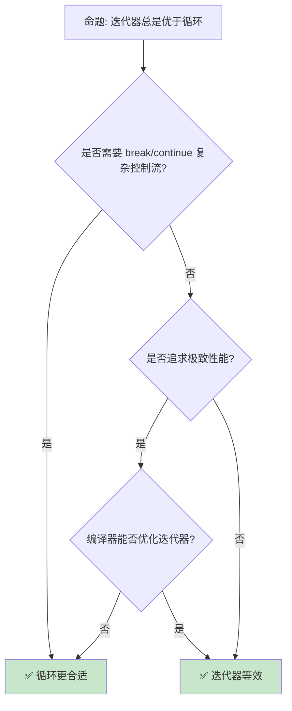

# 迭代器模式与惰性求值

> **Bloom 层级**: 分析 → 应用
> **定位**: 深入探讨 Rust 的**迭代器模式**——从 `Iterator` trait 到惰性求值链，分析零成本抽象如何实现函数式数据处理。
> **前置概念**: [Trait](../02_intermediate/01_traits.md) · [Type System](../01_foundation/04_type_system.md) · [Generics](../02_intermediate/02_generics.md)
> **后置概念**: [Performance](../06_ecosystem/15_performance_optimization.md) · [Async](../03_advanced/02_async.md)

---

> **来源**: [The Rust Programming Language](https://doc.rust-lang.org/book/) · [Rust Standard Library — Iterator](https://doc.rust-lang.org/std/iter/trait.Iterator.html) · [Rust Performance Book](https://nnethercote.github.io/perf-book/) · [Wikipedia — Iterator Pattern](https://en.wikipedia.org/wiki/Iterator_pattern) · [Wikipedia — Lazy Evaluation](https://en.wikipedia.org/wiki/Lazy_evaluation)

## 📑 目录

- [迭代器模式与惰性求值](#迭代器模式与惰性求值)
  - [📑 目录](#-目录)
  - [一、核心概念](#一核心概念)
    - [1.1 Iterator Trait](#11-iterator-trait)
    - [1.2 惰性求值](#12-惰性求值)
    - [1.3 消费与适配](#13-消费与适配)
  - [二、关键模式](#二关键模式)
    - [2.1 适配器链](#21-适配器链)
    - [2.2 自定义迭代器](#22-自定义迭代器)
    - [2.3 并行迭代](#23-并行迭代)
  - [三、性能特征](#三性能特征)
    - [3.1 零成本抽象](#31-零成本抽象)
    - [3.2 SIMD 优化](#32-simd-优化)
  - [四、反命题与边界分析](#四反命题与边界分析)
    - [4.1 反命题树](#41-反命题树)
    - [4.2 边界极限](#42-边界极限)
  - [五、常见陷阱](#五常见陷阱)
  - [六、来源与延伸阅读](#六来源与延伸阅读)
  - [相关概念文件](#相关概念文件)

---

## 一、核心概念

### 1.1 Iterator Trait

```text
Iterator Trait:

  核心方法:
  fn next(&mut self) -> Option<Self::Item>
  ├── 返回下一个元素
  ├── None 表示迭代结束
  └── 所有其他方法基于此实现

  关联类型:
  type Item;
  └── 迭代器产生的元素类型

  代码示例:

  struct Counter {
      count: u32,
  }

  impl Iterator for Counter {
      type Item = u32;

      fn next(&mut self) -> Option<Self::Item> {
          if self.count < 5 {
              self.count += 1;
              Some(self.count)
          } else {
              None
          }
      }
  }

  IntoIterator:
  ├── for x in collection — 自动调用 into_iter()
  ├── 消耗性迭代（所有权转移）
  ├── iter(): &T
  └── iter_mut(): &mut T
```

> **认知功能**: **Iterator trait 是 Rust 中最核心的抽象之一**——统一的序列访问接口，支持无限序列。
> [来源: [std::iter::Iterator](https://doc.rust-lang.org/std/iter/trait.Iterator.html)]

---

### 1.2 惰性求值

```text
惰性求值（Lazy Evaluation）:

  设计: 操作延迟到需要结果时执行
  ├── map: 不立即计算
  ├── filter: 不立即过滤
  └── collect: 触发求值

  对比急切求值:
  ┌─────────────────┬─────────────────┬─────────────────┐
  │ 方面            │ 急切            │ 惰性            │
  ├─────────────────┼─────────────────┼─────────────────┤
  │ 内存            │ 中间集合        │ 无中间集合      │
  │ 短路            │ 需手动实现      │ 天然支持        │
  │ 无限序列        │ 不可能          │ 可能            │
  │ 调试            │ 直观            │ 需理解求值时机  │
  │ 编译优化        │ 一般            │ 优秀（内联）    │
  └─────────────────┴─────────────────┴─────────────────┘

  惰性求值链:
  let result: Vec<i32> = (0..100)
      .map(|x| x * 2)        // 惰性: 不计算
      .filter(|x| x % 3 == 0) // 惰性: 不过滤
      .take(10)               // 惰性: 不截断
      .collect();             // 触发: 实际执行
```

> **惰性洞察**: **惰性求值是 Rust 迭代器零成本抽象的核心**——操作组合但不分配中间集合。
> [来源: [Rust Performance Book](https://nnethercote.github.io/perf-book/)]

---

### 1.3 消费与适配

```text
消费器（Consumers）与适配器（Adapters）:

  适配器（惰性）:
  ├── map: 转换每个元素
  ├── filter: 条件过滤
  ├── take: 限制数量
  ├── skip: 跳过元素
  ├── enumerate: 附加索引
  ├── zip: 配对两个迭代器
  ├── chain: 连接两个迭代器
  ├── flat_map: 映射后展平
  └── 返回新迭代器

  消费器（触发求值）:
  ├── collect: 收集到集合
  ├── fold: 累积计算
  ├── reduce: 归约
  ├── sum: 求和
  ├── count: 计数
  ├── any/all: 谓词测试
  ├── find: 查找
  ├── position: 定位
  └── for_each: 副作用

  短路消费器:
  ├── any: 找到一个 true 即停止
  ├── all: 找到一个 false 即停止
  ├── find: 找到即停止
  └── 天然优化大集合
```

> **消费洞察**: **消费器是惰性链的触发点**——理解何时求值对性能至关重要。
> [来源: [Rust Standard Library — Iter](https://doc.rust-lang.org/std/iter/index.html)]

---

## 二、关键模式

### 2.1 适配器链

```text
常见适配器链模式:

  过滤-映射:
  items.iter()
      .filter(|x| x.is_active)
      .map(|x| x.name)
      .collect()

  分组-聚合:
  items.iter()
      .fold(HashMap::new(), |mut acc, x| {
          *acc.entry(x.category).or_insert(0) += x.value;
          acc
      })

  展平嵌套:
  matrix.iter()
      .flat_map(|row| row.iter())
      .filter(|&&x| x > 0)
      .sum()

  窗口滑动:
  data.windows(3)
      .map(|w| w[0] + w[1] + w[2])
      .collect()
```

```rust
fn main() {
    let data = vec![1, 2, 3, 4, 5, 6, 7, 8, 9, 10];
    let result: Vec<i32> = data
        .into_iter()
        .filter(|x| x % 2 == 0)
        .map(|x| x * x)
        .take(3)
        .collect();
    println!("{:?}", result);
}
```

> **链式洞察**: **适配器链是声明式数据处理的典范**——描述"做什么"而非"怎么做"。
> [来源: [Rust By Example — Iterators](https://doc.rust-lang.org/rust-by-example/fn/closures/closure_examples/iter_any.html)]

---

### 2.2 自定义迭代器

```text
自定义迭代器实现:

  基础模式:
  struct MyIter {
      data: Vec<i32>,
      index: usize,
  }

  impl Iterator for MyIter {
      type Item = i32;
      fn next(&mut self) -> Option<Self::Item> {
          if self.index < self.data.len() {
              let val = self.data[self.index];
              self.index += 1;
              Some(val)
          } else {
              None
          }
      }
  }

  高级特性:
  ├── size_hint(): 优化预分配
  ├── count(): 默认实现，可覆盖
  ├── nth(): 随机访问优化
  ├── last(): 尾部优化
  └── fold(): 自定义累积

  双端迭代器:
  trait DoubleEndedIterator: Iterator {
      fn next_back(&mut self) -> Option<Self::Item>;
  }
  // 支持从两端迭代
```

> **自定义洞察**: **实现 Iterator trait 只需 next() 方法**——其他方法有默认实现，可按需覆盖优化。
> [来源: [Rust Reference — Iterators](https://doc.rust-lang.org/std/iter/index.html)]

---

### 2.3 并行迭代

```text
并行迭代（Rayon）:

  Rayon 适配器:
  ├── par_iter(): 并行迭代
  ├── par_iter_mut(): 并行可变迭代
  ├── into_par_iter(): 消耗性并行迭代
  └── 自动任务窃取调度

  代码示例:

  use rayon::prelude::*;

  let sum: i32 = (0..1_000_000)
      .into_par_iter()
      .map(|x| x * x)
      .sum();

  // 并行过滤 + 收集
  let evens: Vec<i32> = data
      .par_iter()
      .filter(|&&x| x % 2 == 0)
      .cloned()
      .collect();

  注意事项:
  ├── 小集合并行有开销
  ├── 需要 Send + Sync
  ├── 闭包无副作用
  └── 顺序依赖的操作不能并行
```

> **并行洞察**: **Rayon 将顺序迭代器无缝转换为并行**——数据并行化的零成本抽象。
> [来源: [Rayon](https://docs.rs/rayon/latest/rayon/)]

---

## 三、性能特征

### 3.1 零成本抽象

```text
零成本抽象:

  编译器优化:
  ├── 内联展开: 适配器链内联为单个循环
  ├── 循环融合: 多个操作合并
  ├── SIMD 向量化: 自动向量化
  └── 无动态分发

  对比循环:
  // 迭代器版本
  let sum: i32 = (0..1000).map(|x| x * 2).sum();

  // 编译后等价于:
  let mut sum = 0;
  for x in 0..1000 {
      sum += x * 2;
  }

  内存优势:
  ├── 无中间集合分配
  ├── 缓存友好（顺序访问）
  └── 分支预测友好
```

> **性能洞察**: **Rust 迭代器的零成本抽象经过编译器优化后，性能等价于手写循环**——但更安全、更可组合。
> [来源: [Rust Performance Book](https://nnethercote.github.io/perf-book/)]

---

### 3.2 SIMD 优化

```text
SIMD 与迭代器:

  自动向量化:
  ├── 编译器自动检测可向量化循环
  ├── 迭代器链可能被向量化
  └── 需要 #[repr(simd)] 或 packed_simd

  手动 SIMD:
  use std::simd::*;

  let a: Simd<f32, 4> = Simd::from_array([1.0, 2.0, 3.0, 4.0]);
  let b: Simd<f32, 4> = Simd::from_array([5.0, 6.0, 7.0, 8.0]);
  let c = a + b; // SIMD 加法

  注意事项:
  ├── 需要 nightly 或特定 crate
  ├── 对齐要求
  └── 边界处理
```

> **SIMD 洞察**: **SIMD 是迭代器性能的最后一块拼图**——向量化可将吞吐量提升 4-16 倍。
> [来源: [std::simd](https://doc.rust-lang.org/std/simd/index.html)]

---

## 四、反命题与边界分析

### 4.1 反命题树



> **认知功能**: **迭代器和循环在优化后性能等效**——迭代器胜在组合性和安全性。
> [来源: [Rust Performance Book](https://nnethercote.github.io/perf-book/)]

---

### 4.2 边界极限

```text
边界 1: 生命周期
├── 迭代器持有数据引用
├── 迭代器不能比数据活得长
└── 缓解: 使用 owning_iter 或 collect

边界 2: 无限序列
├── 无限迭代器不能 collect
├── 需要 take/break 限制
└── 缓解: 使用短路消费器

边界 3: 并行限制
├── 顺序依赖不能并行
├── 小集合并行有开销
└── 缓解: 选择合适的数据大小阈值

边界 4: 嵌套复杂度
├── 多层 flat_map 可读性差
├── 调试困难
└── 缓解: 拆分步骤，添加类型标注

边界 5: 编译时间
├── 复杂泛型迭代器增加编译时间
├── 单态化膨胀
└── 缓解: 使用 dyn Iterator（运行时开销）
```

> **边界要点**: 迭代器的边界与**生命周期**、**无限序列**、**并行**、**嵌套复杂度**和**编译时间**相关。
> [来源: [Rust Reference — Iterators](https://doc.rust-lang.org/std/iter/index.html)]

---

## 五、常见陷阱

```text
陷阱 1: 多次消费
  ❌ 迭代器只能消费一次
     let iter = vec.iter();
     let sum1: i32 = iter.sum();
     let sum2: i32 = iter.sum(); // 编译错误！

  ✅ 使用 collect 或 clone
     let sum1: i32 = vec.iter().sum();
     let sum2: i32 = vec.iter().sum();

陷阱 2: collect 类型不明确
  ❌ 未指定 collect 目标类型
     let result = iter.collect(); // 编译错误！

  ✅ 显式标注类型
     let result: Vec<i32> = iter.collect();
     // 或 let result = iter.collect::<Vec<i32>>();

陷阱 3: 在闭包中修改外部状态
  ❌ 迭代器闭包中意外修改
     let mut count = 0;
     iter.for_each(|x| { count += x; }); // 可以但谨慎

  ✅ 使用 fold 替代副作用
     let count = iter.fold(0, |acc, x| acc + x);

陷阱 4: 无限迭代器 collect
  ❌ 对无限迭代器 collect
     let v: Vec<i32> = (0..).collect(); // 内存耗尽！

  ✅ 使用 take 限制
     let v: Vec<i32> = (0..).take(10).collect();

陷阱 5: 忽略 size_hint
  ❌ 自定义迭代器不提供 size_hint
     // collect 无法预分配，多次重新分配

  ✅ 实现 size_hint
     fn size_hint(&self) -> (usize, Option<usize>) {
         (self.remaining, Some(self.remaining))
     }
```

> **陷阱总结**: 迭代器的陷阱主要与**消费一次**、**类型标注**、**副作用**、**无限序列**和**预分配**相关。
> [来源: [Rust By Example — Iterators](https://doc.rust-lang.org/rust-by-example/fn/closures/closure_examples/iter_any.html)]

---

## 六、来源与延伸阅读

| 来源 | 可信度 | 说明 |
|:---|:---:|:---|
| [std::iter](https://doc.rust-lang.org/std/iter/index.html) | ✅ 一级 | 标准库 |
| [TRPL Ch. 13](https://doc.rust-lang.org/book/ch13-00-functional-features.html) | ✅ 一级 | 函数式特性 |
| [Rust Performance Book](https://nnethercote.github.io/perf-book/) | ✅ 二级 | 性能 |
| [Rayon](https://docs.rs/rayon/latest/rayon/) | ✅ 二级 | 并行迭代 |
| [Rust By Example](https://doc.rust-lang.org/rust-by-example/fn/closures/closure_examples/iter_any.html) | ✅ 一级 | 示例 |

---

## 相关概念文件

- [Trait](../02_intermediate/01_traits.md) — Trait
- [Generics](../02_intermediate/02_generics.md) — 泛型
- [Performance](../06_ecosystem/15_performance_optimization.md) — 性能优化
- [Async](../03_advanced/02_async.md) — 异步编程

---

> **权威来源**: [Rust Reference](https://doc.rust-lang.org/reference/)
>
> **权威来源对齐变更日志**: 2026-05-22 创建 [来源: Authority Source Sprint Batch 11]

**文档版本**: 1.0
**对应 Rust 版本**: 1.96.0+ (Edition 2024)
**最后更新**: 2026-05-22
**状态**: ✅ 概念文件创建完成
