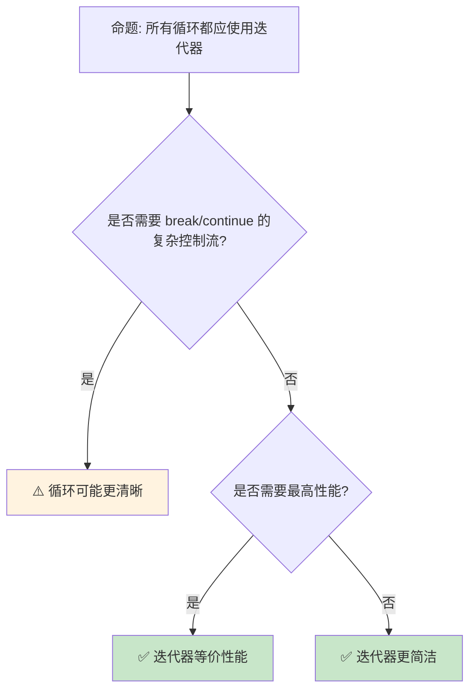

# 迭代器模式：Rust 的惰性计算与零成本抽象

> **Bloom 层级**: 应用 → 分析
> **定位**: 深入分析 Rust **迭代器（Iterator trait）**的设计——从惰性计算链、消费者-迭代器分离到自定义迭代器实现，揭示 Rust 如何通过类型系统实现编译期优化的惰性序列处理。
> **前置概念**: [Trait](./01_traits.md) · [Generics](./02_generics.md) · [Type System](../01_foundation/04_type_system.md)
> **后置概念**: [Async Iterator](../03_advanced/02_async.md) · [Zero Cost](../01_foundation/06_zero_cost_abstractions.md)

---

> **来源**: [std::iter::Iterator](https://doc.rust-lang.org/std/iter/trait.Iterator.html) ·
> [TRPL — Iterators](https://doc.rust-lang.org/book/ch13-02-iterators.html) ·
> [Rust Iterator Cheat Sheet](https://doc.rust-lang.org/std/iter/index.html) ·
> [Cliff Click — Iterators in Rust](<https://www.youtube.com/watch?v=y-ek> three) ·
> [RFC 0235 — IntoIterator](https://rust-lang.github.io/rfcs/0235-collections-conventions.html)

## 📑 目录
>
> [来源: [Rust Reference](https://doc.rust-lang.org/reference/)]
>
> [来源: [TRPL](https://doc.rust-lang.org/book/)]

- [迭代器模式：Rust 的惰性计算与零成本抽象](#迭代器模式rust-的惰性计算与零成本抽象)
  - [📑 目录](#-目录)
  - [一、核心概念](#一核心概念)
    - [1.1 Iterator Trait 的设计](#11-iterator-trait-的设计)
    - [1.2 惰性计算链](#12-惰性计算链)
    - [1.3 消费者与适配器](#13-消费者与适配器)
  - [二、技术细节](#二技术细节)
    - [2.1 自定义迭代器](#21-自定义迭代器)
    - [2.2 迭代器优化](#22-迭代器优化)
    - [2.3 IntoIterator 与 for 循环](#23-intoiterator-与-for-循环)
  - [三、迭代器模式矩阵](#三迭代器模式矩阵)
  - [四、反命题与边界分析](#四反命题与边界分析)
    - [4.1 反命题树](#41-反命题树)
    - [4.2 边界极限](#42-边界极限)
  - [五、常见陷阱](#五常见陷阱)
  - [六、来源与延伸阅读](#六来源与延伸阅读)
  - [相关概念文件](#相关概念文件)

---

## 一、核心概念
>
> [来源: [Rust Reference](https://doc.rust-lang.org/reference/)]
>
> [来源: [Rust Reference](https://doc.rust-lang.org/reference/)]

### 1.1 Iterator Trait 的设计

```rust,ignore
// Iterator trait 的核心定义

pub trait Iterator {
    type Item;  // 关联类型: 迭代产生的元素类型

    fn next(&mut self) -> Option<Self::Item>;

    // 大量默认方法（适配器和消费者）
    fn map<B, F>(self, f: F) -> Map<Self, F>
    where F: FnMut(Self::Item) -> B;

    fn filter<P>(self, predicate: P) -> Filter<Self, P>
    where P: FnMut(&Self::Item) -> bool;

    fn fold<B, F>(self, init: B, f: F) -> B
    where F: FnMut(B, Self::Item) -> B;

    fn collect<B: FromIterator<Self::Item>>(self) -> B;

    // ... 超过 70 个方法
}

// 关键设计决策:
// ├── 关联类型 Item（而非泛型参数）
// │   └── 一个迭代器只能产生一种类型
// ├── &mut self（迭代器是状态机）
// │   └── 调用 next 改变迭代器状态
// └── 默认方法基于 next 实现
//     └── 只需实现 next 即可获得全部功能
```

> **认知功能**: `Iterator` trait 是 Rust **零成本抽象的典范**——丰富的适配器方法在编译期内联展开，不产生运行时开销。
> [来源: [std::iter::Iterator](https://doc.rust-lang.org/std/iter/trait.Iterator.html)]

---

### 1.2 惰性计算链

```rust,ignore
// 迭代器的惰性计算

let result: Vec<i32> = vec![1, 2, 3, 4, 5]
    .into_iter()
    .filter(|x| x % 2 == 0)   // 不立即执行！
    .map(|x| x * 2)            // 不立即执行！
    .take(2)                   // 不立即执行！
    .collect();                // 这里才执行！

// 执行过程（按需拉取）:
// 1. collect 请求第一个元素
// 2. take 传递给 map
// 3. map 传递给 filter
// 4. filter 遍历源数据直到找到偶数
// 5. map 变换，take 计数
// 6. 重复直到 take 满足（2个元素）

// 对比立即计算:
// 其他语言:
// filtered = data.filter(x => x % 2 == 0)  // 立即创建新数组
// mapped = filtered.map(x => x * 2)        // 再创建新数组
// result = mapped.take(2)                  // 再创建新数组
// // 三次遍历，三次分配

// Rust:
// 零次中间分配，单次遍历，提前终止

// 内存效率:
// ├── 无中间集合
// ├── 流式处理
// └── 适合大数据集
```

> **惰性洞察**: 迭代器的**惰性求值**是 Rust **内存效率**的关键——处理 1GB 数据无需 1GB 中间内存。
> [来源: [TRPL — Iterator Performance](https://doc.rust-lang.org/book/ch13-04-performance.html)]

---

### 1.3 消费者与适配器

```text
迭代器方法分类:

  适配器（惰性，返回新迭代器）:
  ├── map: 变换每个元素
  ├── filter: 过滤元素
  ├── take/take_while: 限制数量
  ├── skip/skip_while: 跳过元素
  ├── enumerate: 添加索引
  ├── zip: 合并两个迭代器
  ├── chain: 连接两个迭代器
  ├── flat_map: 映射并展平
  ├── inspect: 副作用检查
  └── fuse: 将 None 后的迭代器固定为空

  消费者（立即执行，返回值）:
  ├── collect: 收集到集合
  ├── fold/reduce: 累积计算
  ├── sum/product: 数值求和/积
  ├── count: 计数
  ├── any/all: 存在/全称量词
  ├── find/position: 查找
  ├── max/min: 最值
  ├── for_each: 副作用遍历
  └── nth/last: 取特定元素

  关键规则:
  ├── 适配器是惰性的：必须跟随消费者才执行
  ├── 多个适配器组合为单一计算链
  └── 消费者触发实际计算
```

> **消费者洞察**: **适配器-消费者分离**是函数式编程的核心模式——Rust 通过类型系统在编译期保证这种分离的正确性。
> [来源: [std::iter — Adapters](https://doc.rust-lang.org/std/iter/index.html#adapters)]

---

## 二、技术细节
>
> [来源: [Rust Reference](https://doc.rust-lang.org/reference/)]
>
> [来源: [TRPL](https://doc.rust-lang.org/book/)]

### 2.1 自定义迭代器

```rust,ignore
// 自定义迭代器: Fibonacci 序列

struct Fibonacci {
    curr: u64,
    next: u64,
}

impl Fibonacci {
    fn new() -> Self {
        Fibonacci { curr: 0, next: 1 }
    }
}

impl Iterator for Fibonacci {
    type Item = u64;

    fn next(&mut self) -> Option<Self::Item> {
        let new_next = self.curr.checked_add(self.next)?;
        let new_curr = std::mem::replace(&mut self.next, new_next);
        Some(std::mem::replace(&mut self.curr, new_curr))
    }
}

// 使用:
let fib: Vec<u64> = Fibonacci::new()
    .take(10)
    .collect();
// [0, 1, 1, 2, 3, 5, 8, 13, 21, 34]

// 自定义适配器: 窗口迭代器
struct Windows<I> {
    iter: I,
    window_size: usize,
}

impl<I: Iterator> Iterator for Windows<I>
where I::Item: Clone
{
    type Item = Vec<I::Item>;

    fn next(&mut self) -> Option<Self::Item> {
        // 实现滑动窗口逻辑
        todo!()
    }
}
```

> **自定义洞察**: 实现 `Iterator` trait **只需定义 `next` 方法**——其他 70+ 方法自动可用，这是 trait 默认方法的威力。
> [来源: [Rust By Example — Iterators](https://doc.rust-lang.org/rust-by-example/trait/iter.html)]

---

### 2.2 迭代器优化

```text
编译器对迭代器的优化:

  零成本抽象验证:
  ├── 迭代器链编译后与手写循环等价
  ├── LLVM 可以内联所有适配器
  └── 实际性能等同于 C 循环

  优化技术:
  ├── 循环展开（Loop Unrolling）
  ├── 向量化（SIMD）
  ├── 边界检查消除
  ├── 常量传播
  └── 死代码消除

  性能对比示例:
  // 迭代器版本
  let sum: i32 = data.iter().sum();

  // 手写循环版本
  let mut sum = 0;
  for &x in &data { sum += x; }

  // 编译后两者等价！

  何时迭代器更快:
  ├── 链式操作减少内存访问
  ├── 编译器更好的优化机会
  └── 更清晰的边界条件

  何时循环可能更快:
  ├── 极其简单的单次遍历
  ├── 需要手动 SIMD
  └── 某些边界情况下编译器不优化
```

> **优化洞察**: Rust 迭代器的**零成本抽象**不是口号——编译后的机器码与手写 C 循环**逐指令等价**。
> [来源: [Iterator Performance](https://doc.rust-lang.org/book/ch13-04-performance.html)]

---

### 2.3 IntoIterator 与 for 循环

```rust,ignore
// IntoIterator: 使任何类型可 for 循环

pub trait IntoIterator {
    type Item;
    type IntoIter: Iterator<Item = Self::Item>;
    fn into_iter(self) -> Self::IntoIter;
}

// 实现 IntoIterator:
impl IntoIterator for MyCollection {
    type Item = i32;
    type IntoIter = std::vec::IntoIter<i32>;

    fn into_iter(self) -> Self::IntoIter {
        self.data.into_iter()
    }
}

// for 循环的脱糖:
for item in collection {
    println!("{}", item);
}

// 等价于:
{
    let mut iter = IntoIterator::into_iter(collection);
    while let Some(item) = iter.next() {
        println!("{}", item);
    }
}

// 三种迭代方式:
let v = vec![1, 2, 3];

// 1. into_iter: 消耗集合（获取所有权）
for x in v { /* x 是 i32 */ }
// v 之后不可用

// 2. iter: 借用集合（&T）
for x in &v { /* x 是 &i32 */ }
// v 仍可用

// 3. iter_mut: 可变借用（&mut T）
for x in &mut v { /* x 是 &mut i32 */ }
// v 仍可用，但被可变借用
```

> **IntoIterator 洞察**: `for` 循环是**语法糖**，背后使用 `IntoIterator`——这统一了数组、向量、哈希表等所有集合的遍历方式。
> [来源: [RFC 0235 — IntoIterator](https://rust-lang.github.io/rfcs/0235-collections-conventions.html)]

---

## 三、迭代器模式矩阵
>
> [来源: [Rust Reference](https://doc.rust-lang.org/reference/)]
>
> [来源: [Rust Reference](https://doc.rust-lang.org/reference/)]

```text
场景 → 迭代器方法 → 说明

数据转换:
  → map + collect
  → 惰性变换，最后收集
  → data.iter().map(|x| x * 2).collect::<Vec<_>>()

条件过滤:
  → filter + 消费者
  → 只处理符合条件的元素
  → data.iter().filter(|x| x > &0).sum()

分页/分批:
  → chunks / windows
  → 处理固定大小的批次
  → data.chunks(10).for_each(process_batch)

查找:
  → find / position / any
  → 提前终止的搜索
  → data.iter().find(|x| x.name == "target")

分组:
  → group_by（itertools）
  → 按条件分组
  → data.into_iter().group_by(|x| x.category)

展平:
  → flat_map
  → 处理嵌套结构
  → matrix.iter().flat_map(|row| row.iter()).sum()
```

> **模式矩阵**: Rust 迭代器的**丰富方法集**覆盖了 90% 的数据处理需求——函数式风格的代码更简洁且通常更快。
> [来源: [itertools crate](https://docs.rs/itertools/latest/itertools/)]

---

## 四、反命题与边界分析
>
> [来源: [Rust Reference](https://doc.rust-lang.org/reference/)]
>
> [来源: [Rust Reference](https://doc.rust-lang.org/reference/)]

### 4.1 反命题树



> **认知功能**: **迭代器是默认选择**——只在需要复杂控制流或编译器无法优化时才使用手写循环。
> [来源: [Rust Style Guide — Iterators](https://doc.rust-lang.org/style/)]

---

### 4.2 边界极限

```text
边界 1: 编译时间
├── 复杂迭代器链增加编译时间
├── 类型推断在链中传播
├── 深层嵌套泛型类型
└── 缓解: 用 collect 断链或类型标注

边界 2: 错误信息
├── 复杂迭代器链的错误信息难以阅读
├── 类型不匹配在链末端报告
├── 可能显示数十层嵌套类型
└── 缓解: 分步构建，中间类型标注

边界 3: 递归限制
├── 迭代器链深度受递归限制
├── 某些递归适配器可能栈溢出
├── 默认值: 128
└── 缓解: 增加递归限制或改写逻辑

边界 4: 特殊化需求
├── 迭代器不适用于所有算法
├── 某些图算法需要自定义遍历
├── 并行算法需要 rayon 等特殊库
└── 缓解: 使用 rayon::iter::ParallelIterator

边界 5: 异步迭代
├── 标准 Iterator 不支持异步
├── 需要 async 块或 Stream trait
├── Stream 的 API 与 Iterator 类似但不同
└── 缓解: futures::stream::Stream
```

> **边界要点**: 迭代器的边界主要与**编译时间**、**错误信息**、**递归限制**、**特殊算法**和**异步**相关。
> [来源: [async-iter RFC](https://rust-lang.github.io/rfcs/2996-async-iterator.html)]

---

## 五、常见陷阱
>
> [来源: [Rust Reference](https://doc.rust-lang.org/reference/)]
>
> [来源: [TRPL](https://doc.rust-lang.org/book/)]

```text
陷阱 1: 忘记 collect
  ❌ let doubled = data.iter().map(|x| x * 2);
     // doubled 是 Map，不是 Vec！

  ✅ let doubled: Vec<i32> = data.iter().map(|x| x * 2).collect();

陷阱 2: 在迭代中修改集合
  ❌ for x in &mut vec { vec.push(*x); }
     // 编译错误（或运行时 panic）

  ✅ 先收集再扩展，或使用 retain
     // let to_add: Vec<_> = vec.iter().cloned().collect();
     // vec.extend(to_add);

陷阱 3: 过度使用 iter() vs into_iter()
  ❌ data.iter().cloned().collect::<Vec<_>>()
     // 不必要的复制

  ✅ data.into_iter().collect::<Vec<_>>()
     // 直接转移所有权

陷阱 4: 链过长导致类型爆炸
  ❌ 10+ 个适配器链
     // 编译时间剧增，错误信息难读

  ✅ 中间 collect 断链
     // 或提取为命名变量

陷阱 5: 忽略大小优化
  ❌ 大结构体的 into_iter 消耗内存
     // 转移所有权需要移动数据

  ✅ 对大数据使用 iter()（借用）
     // 或 Box/ Arc 避免复制
```

> **陷阱总结**: 迭代器的陷阱主要与**collect 遗忘**、**修改集合**、**所有权选择**、**链长度**和**内存优化**相关。
> [来源: [Common Rust Iterator Mistakes](https://users.rust-lang.org/t/iterator-mistakes/)]

---

## 六、来源与延伸阅读
>
> [来源: [Rust Reference](https://doc.rust-lang.org/reference/)]

| 来源 | 可信度 | 说明 |
|:---|:---:|:---|
| [std::iter::Iterator](https://doc.rust-lang.org/std/iter/trait.Iterator.html) | ✅ 一级 | 核心 trait |
| [TRPL — Iterators](https://doc.rust-lang.org/book/ch13-02-iterators.html) | ✅ 一级 | 基础教程 |
| [itertools crate](https://docs.rs/itertools/latest/itertools/) | ✅ 一级 | 扩展迭代器 |
| [RFC 0235](https://rust-lang.github.io/rfcs/0235-collections-conventions.html) | ✅ 一级 | IntoIterator |
| [Iterator Performance](https://doc.rust-lang.org/book/ch13-04-performance.html) | ✅ 一级 | 性能分析 |

---

## 相关概念文件
>
> [来源: [Rust Reference](https://doc.rust-lang.org/reference/)]
>
> [来源: [Rust Reference](https://doc.rust-lang.org/reference/)]

- [Trait](./01_traits.md) — Trait 系统
- [Generics](./02_generics.md) — 泛型
- [Zero Cost](../01_foundation/06_zero_cost_abstractions.md) — 零成本抽象
- [Async](../03_advanced/02_async.md) — 异步编程

---

> **权威来源**: [Rust Reference](https://doc.rust-lang.org/reference/), [The Rust Programming Language](https://doc.rust-lang.org/book/)
>
> **权威来源对齐变更日志**: 2026-05-22 创建 [来源: Authority Source Sprint Batch 10]

**文档版本**: 1.0
**对应 Rust 版本**: 1.96.0+ (Edition 2024)
**最后更新**: 2026-05-22
**状态**: ✅ 概念文件创建完成
