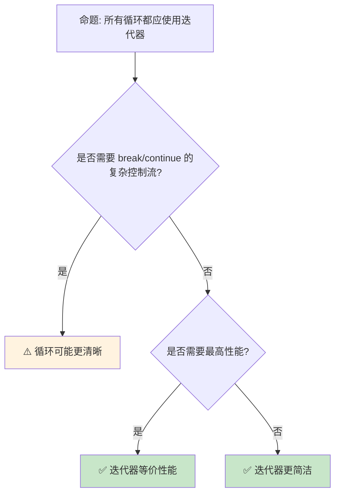

> **内容分级**: [综述级]

> **本节关键术语**: 迭代器模式 (Iterator Pattern) · 适配器 (Adapter) · 消费者 (Consumer) · 惰性求值 (Lazy Evaluation) · 自定义迭代器 — [完整对照表](../00_meta/terminology_glossary.md)
>
# 迭代器模式：Rust 的惰性计算与零成本抽象
>
> **EN**: Iterators
> **Summary**: Iterators. Core Rust concept covering mechanism analysis, in-depth analysis, performance optimization.
>
> **受众**: [进阶]
> **Bloom 层级**: 应用 → 分析
> **A/S/P 标记**: **A+S** — Application + Structure
> **双维定位**: C×App — 应用迭代器（Iterator）模式和惰性求值
> **定位**: 深入分析 Rust **迭代器（Iterator trait）**的设计——从惰性计算链、消费者-迭代器分离到自定义迭代器实现，揭示 Rust 如何通过类型系统（Type System）实现编译期优化的惰性序列处理。
> **前置概念**: [Trait](./01_traits.md) · [Generics](./02_generics.md) · [Type System](../01_foundation/04_type_system.md)
> **后置概念**: [Async Iterator](../03_advanced/02_async.md) · [Zero Cost](../01_foundation/06_zero_cost_abstractions.md)

---

> **来源**: [std::iter::Iterator](https://doc.rust-lang.org/std/iter/trait.Iterator.html) ·
> [TRPL — Iterators](https://doc.rust-lang.org/book/ch13-02-iterators.html) ·
> [Rust Iterator Cheat Sheet](https://doc.rust-lang.org/std/iter/index.html) ·
> [Cliff Click — Iterators in Rust](https://www.youtube.com/watch?v=y-ek3S9JFPw) ·
> [RFC 0235 — IntoIterator](https://rust-lang.github.io/rfcs//0235-collections-conventions.html)

## 📑 目录

- [迭代器（Iterator）模式：Rust 的惰性计算与零成本抽象（Zero-Cost Abstraction）](LINK_PLACEHOLDER)
  - [📑 目录](#-目录)
  - [一、核心概念](#一核心概念)
    - [1.1 Iterator Trait 的设计](#11-iterator-trait-的设计)
    - [1.2 惰性计算链](#12-惰性计算链)
    - [1.3 消费者与适配器](#13-消费者与适配器)
  - [二、技术细节](#二技术细节)
    - [2.1 自定义迭代器](#21-自定义迭代器)
    - [2.2 迭代器优化](#22-迭代器优化)
    - [2.3 IntoIterator 与 for 循环](#23-intoiterator-与-for-循环)
  - [三、迭代器模式矩阵](#三迭代器模式矩阵)
  - [四、反命题与边界分析](#四反命题与边界分析)
    - [4.1 反命题树](#41-反命题树)
    - [4.2 边界极限](#42-边界极限)
  - [五、常见陷阱](#五常见陷阱)
  - [六、来源与延伸阅读](#六来源与延伸阅读)
  - [相关概念文件](#相关概念文件)
  - [逆向推理链（Backward Reasoning）](#逆向推理链backward-reasoning)
  - [权威来源索引](#权威来源索引)
  - [十、边界测试：迭代器模式的编译错误](#十边界测试迭代器模式的编译错误)
    - [10.1 边界测试：`Iterator::zip` 长度不匹配（逻辑错误）](#101-边界测试iteratorzip-长度不匹配逻辑错误)
    - [10.2 边界测试：`flat_map` 与嵌套迭代器的所有权（Ownership）（编译错误）](LINK_PLACEHOLDER)
  - [十二、边界测试：迭代器模式的编译错误（续）](#十二边界测试迭代器模式的编译错误续)
    - [12.1 边界测试：`enumerate` 与索引类型（逻辑错误）](#121-边界测试enumerate-与索引类型逻辑错误)
    - [12.2 边界测试：`partition` 与所有权分割（编译错误）](#122-边界测试partition-与所有权分割编译错误)
    - [10.5 边界测试：`Iterator::fold` 的初始值类型与闭包（Closures）返回类型不匹配（编译错误）](LINK_PLACEHOLDER)
    - [10.5 边界测试：`ChunksExact` 的剩余元素处理（逻辑错误）](#105-边界测试chunksexact-的剩余元素处理逻辑错误)
    - [10.2 边界测试：`flat_map` 与嵌套迭代器的类型匹配（编译错误）](#102-边界测试flat_map-与嵌套迭代器的类型匹配编译错误)
    - [10.9 边界测试：const fn 中的非编译期操作](#109-边界测试const-fn-中的非编译期操作)
  - [嵌入式测验（Embedded Quiz）](#嵌入式测验embedded-quiz)
    - [测验 1：`Iterator::fuse()` 的作用是什么？在什么场景下需要使用它？（理解层）](#测验-1iteratorfuse-的作用是什么在什么场景下需要使用它理解层)
    - [测验 2：`peekable()` 迭代器与标准迭代器的主要区别是什么？（理解层）](#测验-2peekable-迭代器与标准迭代器的主要区别是什么理解层)
    - [测验 3：`iter.cycle()` 对迭代器有什么要求？如果原始迭代器为空会发生什么？（理解层）](#测验-3itercycle-对迭代器有什么要求如果原始迭代器为空会发生什么理解层)
    - [测验 4：`flat_map` 与 `map` 后接 `flatten` 有什么区别？（理解层）](#测验-4flat_map-与-map-后接-flatten-有什么区别理解层)
    - [测验 5：`by_ref()` 在迭代器链中的作用是什么？（理解层）](#测验-5by_ref-在迭代器链中的作用是什么理解层)
  - [实践](#实践)
  - [认知路径](#认知路径)
    - [核心推理链](#核心推理链)
    - [反命题与边界](#反命题与边界)

---

## 一、核心概念
>
>

### 1.1 Iterator Trait 的设计
>

```rust,ignore
// Iterator trait 的核心定义

pub trait Iterator {
    type Item;  // 关联类型: 迭代产生的元素类型

    fn next(&mut self) -> Option<Self::Item>;

    // 大量默认方法（适配器和消费者）
    fn map<B, F>(self, f: F) -> Map<Self, F>
    where F: FnMut(Self::Item) -> B;

    fn filter<P>(self, predicate: P) -> Filter<Self, P>
    where P: FnMut(&Self::Item) -> bool;

    fn fold<B, F>(self, init: B, f: F) -> B
    where F: FnMut(B, Self::Item) -> B;

    fn collect<B: FromIterator<Self::Item>>(self) -> B;

    // ... 超过 70 个方法
}

// 关键设计决策:
// ├── 关联类型 Item（而非泛型参数）
// │   └── 一个迭代器只能产生一种类型
// ├── &mut self（迭代器是状态机）
// │   └── 调用 next 改变迭代器状态
// └── 默认方法基于 next 实现
//     └── 只需实现 next 即可获得全部功能
```

> **认知功能**: `Iterator` trait 是 Rust **零成本抽象（Zero-Cost Abstraction）的典范**——丰富的适配器方法在编译期内联展开，不产生运行时（Runtime）开销。
> [来源: [std::iter::Iterator](https://doc.rust-lang.org/std/iter/trait.Iterator.html)]

---

### 1.2 惰性计算链
>

```rust
// 迭代器的惰性计算

let result: Vec<i32> = vec![1, 2, 3, 4, 5]
    .into_iter()
    .filter(|x| x % 2 == 0)   // 不立即执行！
    .map(|x| x * 2)            // 不立即执行！
    .take(2)                   // 不立即执行！
    .collect();                // 这里才执行！

// 执行过程（按需拉取）:
// 1. collect 请求第一个元素
// 2. take 传递给 map
// 3. map 传递给 filter
// 4. filter 遍历源数据直到找到偶数
// 5. map 变换，take 计数
// 6. 重复直到 take 满足（2个元素）

// 对比立即计算:
// 其他语言:
// filtered = data.filter(x => x % 2 == 0)  // 立即创建新数组
// mapped = filtered.map(x => x * 2)        // 再创建新数组
// result = mapped.take(2)                  // 再创建新数组
// // 三次遍历，三次分配

// Rust:
// 零次中间分配，单次遍历，提前终止

// 内存效率:
// ├── 无中间集合
// ├── 流式处理
// └── 适合大数据集
```

> **惰性洞察**: 迭代器的**惰性求值**是 Rust **内存效率**的关键——处理 1GB 数据无需 1GB 中间内存。
> [来源: [TRPL — Iterator Performance](https://doc.rust-lang.org/book/ch13-04-performance.html)]

---

### 1.3 消费者与适配器
>

```text
迭代器方法分类:

  适配器（惰性，返回新迭代器）:
  ├── map: 变换每个元素
  ├── filter: 过滤元素
  ├── take/take_while: 限制数量
  ├── skip/skip_while: 跳过元素
  ├── enumerate: 添加索引
  ├── zip: 合并两个迭代器
  ├── chain: 连接两个迭代器
  ├── flat_map: 映射并展平
  ├── inspect: 副作用检查
  └── fuse: 将 None 后的迭代器固定为空

  消费者（立即执行，返回值）:
  ├── collect: 收集到集合
  ├── fold/reduce: 累积计算
  ├── sum/product: 数值求和/积
  ├── count: 计数
  ├── any/all: 存在/全称量词
  ├── find/position: 查找
  ├── max/min: 最值
  ├── for_each: 副作用遍历
  └── nth/last: 取特定元素

  关键规则:
  ├── 适配器是惰性的：必须跟随消费者才执行
  ├── 多个适配器组合为单一计算链
  └── 消费者触发实际计算
```

> **消费者洞察**: **适配器-消费者分离**是函数式编程的核心模式——Rust 通过类型系统（Type System）在编译期保证这种分离的正确性。
> [来源: [std::iter — Adapters](https://doc.rust-lang.org/std/iter/index.html#adapters)]

---

## 二、技术细节

### 2.1 自定义迭代器
>

```rust
// 自定义迭代器: Fibonacci 序列

struct Fibonacci {
    curr: u64,
    next: u64,
}

impl Fibonacci {
    fn new() -> Self {
        Fibonacci { curr: 0, next: 1 }
    }
}

impl Iterator for Fibonacci {
    type Item = u64;

    fn next(&mut self) -> Option<Self::Item> {
        let new_next = self.curr.checked_add(self.next)?;
        let new_curr = std::mem::replace(&mut self.next, new_next);
        Some(std::mem::replace(&mut self.curr, new_curr))
    }
}

// 使用:
let fib: Vec<u64> = Fibonacci::new()
    .take(10)
    .collect();
// [0, 1, 1, 2, 3, 5, 8, 13, 21, 34]

// 自定义适配器: 窗口迭代器
struct Windows<I> {
    iter: I,
    window_size: usize,
}

impl<I: Iterator> Iterator for Windows<I>
where I::Item: Clone
{
    type Item = Vec<I::Item>;

    fn next(&mut self) -> Option<Self::Item> {
        // 实现滑动窗口逻辑
        todo!()
    }
}
```

> **自定义洞察**: 实现 `Iterator` trait **只需定义 `next` 方法**——其他 70+ 方法自动可用，这是 trait 默认方法的威力。
> [来源: [Rust By Example — Iterators](https://doc.rust-lang.org/rust-by-example/trait/iter.html)]

---

### 2.2 迭代器优化
>

```text
编译器对迭代器的优化:

  零成本抽象验证:
  ├── 迭代器链编译后与手写循环等价
  ├── LLVM 可以内联所有适配器
  └── 实际性能等同于 C 循环

  优化技术:
  ├── 循环展开（Loop Unrolling）
  ├── 向量化（SIMD）
  ├── 边界检查消除
  ├── 常量传播
  └── 死代码消除

  性能对比示例:
  // 迭代器版本
  let sum: i32 = data.iter().sum();

  // 手写循环版本
  let mut sum = 0;
  for &x in &data { sum += x; }

  // 编译后两者等价！

  何时迭代器更快:
  ├── 链式操作减少内存访问
  ├── 编译器更好的优化机会
  └── 更清晰的边界条件

  何时循环可能更快:
  ├── 极其简单的单次遍历
  ├── 需要手动 SIMD
  └── 某些边界情况下编译器不优化
```

> **优化洞察**: Rust 迭代器的**零成本抽象（Zero-Cost Abstraction）**不是口号——编译后的机器码与手写 C 循环**逐指令等价**。
> [来源: [Iterator Performance](https://doc.rust-lang.org/book/ch13-04-performance.html)]

---

### 2.3 IntoIterator 与 for 循环
>

```rust,ignore
// IntoIterator: 使任何类型可 for 循环

pub trait IntoIterator {
    type Item;
    type IntoIter: Iterator<Item = Self::Item>;
    fn into_iter(self) -> Self::IntoIter;
}

// 实现 IntoIterator:
impl IntoIterator for MyCollection {
    type Item = i32;
    type IntoIter = std::vec::IntoIter<i32>;

    fn into_iter(self) -> Self::IntoIter {
        self.data.into_iter()
    }
}

// for 循环的脱糖:
for item in collection {
    println!("{}", item);
}

// 等价于:
{
    let mut iter = IntoIterator::into_iter(collection);
    while let Some(item) = iter.next() {
        println!("{}", item);
    }
}

// 三种迭代方式:
let v = vec![1, 2, 3];

// 1. into_iter: 消耗集合（获取所有权）
for x in v { /* x 是 i32 */ }
// v 之后不可用

// 2. iter: 借用集合（&T）
for x in &v { /* x 是 &i32 */ }
// v 仍可用

// 3. iter_mut: 可变借用（&mut T）
for x in &mut v { /* x 是 &mut i32 */ }
// v 仍可用，但被可变借用
```

> **IntoIterator 洞察**: `for` 循环是**语法糖**，背后使用 `IntoIterator`——这统一了数组、向量、哈希表等所有集合的遍历方式。
> [来源: [RFC 0235 — IntoIterator](https://rust-lang.github.io/rfcs//0235-collections-conventions.html)]

---

## 三、迭代器模式矩阵

```text
场景 → 迭代器方法 → 说明

数据转换:
  → map + collect
  → 惰性变换，最后收集
  → data.iter().map(|x| x * 2).collect::<Vec<_>>()

条件过滤:
  → filter + 消费者
  → 只处理符合条件的元素
  → data.iter().filter(|x| x > &0).sum()

分页/分批:
  → chunks / windows
  → 处理固定大小的批次
  → data.chunks(10).for_each(process_batch)

查找:
  → find / position / any
  → 提前终止的搜索
  → data.iter().find(|x| x.name == "target")

分组:
  → group_by（itertools）
  → 按条件分组
  → data.into_iter().group_by(|x| x.category)

展平:
  → flat_map
  → 处理嵌套结构
  → matrix.iter().flat_map(|row| row.iter()).sum()
```

> **模式矩阵**: Rust 迭代器的**丰富方法集**覆盖了 90% 的数据处理需求——函数式风格的代码更简洁且通常更快。
> [来源: [itertools crate](https://docs.rs/itertools/latest/itertools/)]

---

## 四、反命题与边界分析

### 4.1 反命题树
>



> **认知功能**: **迭代器是默认选择**——只在需要复杂控制流或编译器无法优化时才使用手写循环。
> [来源: [Rust Style Guide — Iterators](https://doc.rust-lang.org/nightly/style-guide/)]

---

### 4.2 边界极限
>

```text
边界 1: 编译时间
├── 复杂迭代器链增加编译时间
├── 类型推断在链中传播
├── 深层嵌套泛型类型
└── 缓解: 用 collect 断链或类型标注

边界 2: 错误信息
├── 复杂迭代器链的错误信息难以阅读
├── 类型不匹配在链末端报告
├── 可能显示数十层嵌套类型
└── 缓解: 分步构建，中间类型标注

边界 3: 递归限制
├── 迭代器链深度受递归限制
├── 某些递归适配器可能栈溢出
├── 默认值: 128
└── 缓解: 增加递归限制或改写逻辑

边界 4: 特殊化需求
├── 迭代器不适用于所有算法
├── 某些图算法需要自定义遍历
├── 并行算法需要 rayon 等特殊库
└── 缓解: 使用 rayon::iter::ParallelIterator

边界 5: 异步迭代
├── 标准 Iterator 不支持异步
├── 需要 async 块或 Stream trait
├── Stream 的 API 与 Iterator 类似但不同
└── 缓解: futures::stream::Stream
```

> **边界要点**: 迭代器的边界主要与**编译时间**、**错误信息**、**递归限制**、**特殊算法**和**异步（Async）**相关。
> [来源: [async-iter RFC](https://rust-lang.github.io/rfcs//2996-async-iterator.html)]

---

## 五、常见陷阱

```text
陷阱 1: 忘记 collect
  ❌ let doubled = data.iter().map(|x| x * 2);
     // doubled 是 Map，不是 Vec！

  ✅ let doubled: Vec<i32> = data.iter().map(|x| x * 2).collect();

陷阱 2: 在迭代中修改集合
  ❌ for x in &mut vec { vec.push(*x); }
     // 编译错误（或运行时 panic）

  ✅ 先收集再扩展，或使用 retain
     // let to_add: Vec<_> = vec.iter().cloned().collect();
     // vec.extend(to_add);

陷阱 3: 过度使用 iter() vs into_iter()
  ❌ data.iter().cloned().collect::<Vec<_>>()
     // 不必要的复制

  ✅ data.into_iter().collect::<Vec<_>>()
     // 直接转移所有权

陷阱 4: 链过长导致类型爆炸
  ❌ 10+ 个适配器链
     // 编译时间剧增，错误信息难读

  ✅ 中间 collect 断链
     // 或提取为命名变量

陷阱 5: 忽略大小优化
  ❌ 大结构体的 into_iter 消耗内存
     // 转移所有权需要移动数据

  ✅ 对大数据使用 iter()（借用）
     // 或 Box/ Arc 避免复制
```

> **陷阱总结**: 迭代器的陷阱主要与**collect 遗忘**、**修改集合**、**所有权（Ownership）选择**、**链长度**和**内存优化**相关。
> [来源: [Common Rust Iterator Mistakes](https://users.rust-lang.org/t/iterator-mistakes/)]

---

## 六、来源与延伸阅读
>

| 来源 | 可信度 | 说明 |
|:---|:---:|:---|
| [std::iter::Iterator](https://doc.rust-lang.org/std/iter/trait.Iterator.html) | ✅ 一级 | 核心 trait |
| [TRPL — Iterators](https://doc.rust-lang.org/book/ch13-02-iterators.html) | ✅ 一级 | 基础教程 |
| [itertools crate](https://docs.rs/itertools/latest/itertools/) | ✅ 一级 | 扩展迭代器 |
| [RFC 0235](https://rust-lang.github.io/rfcs//0235-collections-conventions.html) | ✅ 一级 | IntoIterator |
| [Iterator Performance](https://doc.rust-lang.org/book/ch13-04-performance.html) | ✅ 一级 | 性能分析 |

---

## 相关概念文件

- [Trait](./01_traits.md) — Trait 系统
- [Generics](./02_generics.md) — 泛型（Generics）
- [Zero Cost](../01_foundation/06_zero_cost_abstractions.md) — 零成本抽象（Zero-Cost Abstraction）
- [Async](../03_advanced/02_async.md) — 异步（Async）编程

---

> **权威来源**: [Rust Reference](https://doc.rust-lang.org/reference/), [The Rust Programming Language](https://doc.rust-lang.org/book/ch13-00-functional-features.html)
>
> **权威来源对齐变更日志**: 2026-05-22 创建 [来源: Authority Source Sprint Batch 10]

**文档版本**: 1.0
**对应 Rust 版本**: 1.96.0+ (Edition 2024)
**最后更新**: 2026-05-22
**状态**: ✅ 概念文件创建完成

---

## 逆向推理链（Backward Reasoning）

> **从编译错误反推**：
>
> ```text
> 迭代器安全 ⟹ 惰性求值 + 消费语义
> ```
>
## 权威来源索引

>
>
>
>

---

> **补充来源**

## 十、边界测试：迭代器模式的编译错误

### 10.1 边界测试：`Iterator::zip` 长度不匹配（逻辑错误）

```rust
fn main() {
    let a = vec![1, 2, 3];
    let b = vec![10, 20];
    // ⚠️ 逻辑错误: zip 在较短的迭代器结束时停止
    let pairs: Vec<_> = a.iter().zip(b.iter()).collect();
    println!("{:?}", pairs); // [(1, 10), (2, 20)] — 3 被忽略！
}

// 正确: 使用 zip_longest（itertools）或显式检查长度
fn fixed() {
    let a = vec![1, 2, 3];
    let b = vec![10, 20];
    assert_eq!(a.len(), b.len(), "iterators must have same length");
    let pairs: Vec<_> = a.iter().zip(b.iter()).collect();
    println!("{:?}", pairs);
}
```

> **修正**: `Iterator::zip` 产生的新迭代器在**任一**源迭代器结束时停止，不会报错或填充默认值。这与 Python 的 `zip` 行为相同，但与 `zip_longest`（填充 `None`）不同。Rust 标准库选择最小惊讶原则：不隐式填充或扩展，要求调用者显式处理长度不匹配。`itertools` crate 提供 `zip_longest` 等扩展，但标准库的保守设计确保无意外分配。[来源: [Rust Standard Library](https://doc.rust-lang.org/std/)]

### 10.2 边界测试：`flat_map` 与嵌套迭代器的所有权（编译错误）

```rust,ignore
fn main() {
    let data = vec![vec![1, 2], vec![3, 4]];
    let iter = data.into_iter();
    // ❌ 编译错误: `into_iter` 消耗 data，后续不能使用 data
    let flat: Vec<_> = iter.flat_map(|v| v.into_iter()).collect();
    // println!("{:?}", data); // data 已被消耗
}

// 正确: 使用 iter() 借用
fn fixed() {
    let data = vec![vec![1, 2], vec![3, 4]];
    let flat: Vec<_> = data.iter().flat_map(|v| v.iter()).cloned().collect();
    println!("{:?}", flat);  // [1, 2, 3, 4]
    println!("{:?}", data);  // ✅ data 仍可用
}
```

> **修正**: `flat_map` 将嵌套迭代器扁平化为单层迭代器，但所有权规则仍然适用。若外层使用 `into_iter()`（消耗），内层也必须使用 `into_iter()`（消耗子集合），导致所有数据被转移。若需保留原数据，外层使用 `iter()`，内层使用 `iter()` + `cloned()`（复制元素）。`flat_map` 的签名 `FnMut(Self::Item) -> impl Iterator` 要求返回的迭代器与 `self` 的生命周期（Lifetimes）一致，增加了嵌套借用（Borrowing）时的复杂性。[来源: [Rust Standard Library](https://doc.rust-lang.org/std/)]

## 十二、边界测试：迭代器模式的编译错误（续）

### 12.1 边界测试：`enumerate` 与索引类型（逻辑错误）

```rust
fn main() {
    let data = vec![10, 20, 30];
    // ⚠️ 逻辑错误: enumerate 返回 usize，可能与预期类型不匹配
    for (idx, val) in data.iter().enumerate() {
        println!("idx={}, val={}", idx, val);
        // idx 是 usize，若需要 i32 需显式转换
        // let i: i32 = idx; // 编译错误
    }
}

// 正确: 显式转换索引
fn fixed() {
    let data = vec![10, 20, 30];
    for (idx, val) in data.iter().enumerate() {
        let i = idx as i32; // ✅ 显式转换
        println!("i={}, val={}", i, val);
    }
}
```

> **修正**: `Iterator::enumerate` 返回 `(usize, Item)`，索引始终是 `usize`。在需要其他整数类型（如 `i32`、`u8`）的上下文中，必须显式转换。Rust 禁止隐式整数转换，即使是缩小范围（`usize` → `u8`）也需要 `as` 关键字。这消除了 C 中常见的整数截断 bug，但增加了显式转换的代码量。`enumerate` 的索引从 0 开始，不受迭代器跳过元素的影响（如 `skip(5).enumerate()` 的索引仍从 0 开始，而非 5）。[来源: [Rust Standard Library](https://doc.rust-lang.org/std/)]

### 12.2 边界测试：`partition` 与所有权分割（编译错误）

```rust,ignore
fn main() {
    let data = vec![String::from("a"), String::from("b")];
    // ❌ 编译错误: `partition` 消耗迭代器，但以下代码试图保留原数据
    let (evens, odds): (Vec<_>, Vec<_>) = data.into_iter()
        .partition(|s| s.len() % 2 == 0);
    // println!("{:?}", data); // data 已被消耗
}

// 正确: 使用 iter() 借用，但 partition 需要 into_iter()
fn fixed() {
    let data = vec!["a", "bb", "ccc"];
    let (short, long): (Vec<_>, Vec<_>) = data.into_iter()
        .partition(|s| s.len() <= 2); // ✅ &str 是 Copy
    println!("short={:?} long={:?}", short, long);
}
```

> **修正**: `partition` 将迭代器元素分为两个集合，要求迭代器是 `IntoIterator`（消耗型）。对于非 `Copy` 类型（如 `String`），`partition` 会 move 所有元素，原集合不可用。若需保留原数据，必须先 `clone` 或使用 `iter()` + `cloned()` + `partition`。这体现了 Rust 所有权系统的严格性——数据不能同时存在于原位置和多个新位置，除非显式复制。[来源: [Rust Standard Library](https://doc.rust-lang.org/std/)]

### 10.5 边界测试：`Iterator::fold` 的初始值类型与闭包返回类型不匹配（编译错误）

```rust,compile_fail
fn main() {
    let nums = vec![1, 2, 3];
    // ❌ 编译错误: fold 的初始值类型与闭包返回类型不匹配
    let sum: String = nums.iter().fold(0, |acc, x| acc + x);
    // 初始值 0 是 i32，但期望 String
}
```

> **修正**: `Iterator::fold` 的签名：`fn fold<B, F>(self, init: B, f: F) -> B`，其中 `B` 是累加器类型，`F: FnMut(B, Self::Item) -> B`。编译器从初始值 `init` 推断 `B`，上述代码中 `0` 推断 `B = i32`，但注解 `let sum: String` 要求 `B = String`，类型冲突。正确写法：`nums.iter().fold(String::new(), |mut acc, x| { acc.push_str(&x.to_string()); acc })`。`fold` 是 Rust 迭代器的通用归约操作，类型安全但需确保初始值、闭包（Closures）参数、闭包返回类型一致。这与 Haskell 的 `foldl`（同样类型严格）或 JavaScript 的 `Array.prototype.reduce`（动态类型，无此检查）不同——Rust 的 `fold` 在编译期验证类型一致性（Coherence）。[来源: [Rust Standard Library](https://doc.rust-lang.org/std/iter/trait.Iterator.html)] · [来源: [The Rust Programming Language](https://doc.rust-lang.org/book/ch13-02-iterators.html)]

### 10.5 边界测试：`ChunksExact` 的剩余元素处理（逻辑错误）

```rust,ignore
fn main() {
    let v = vec![1, 2, 3, 4, 5];
    let mut chunks = v.chunks_exact(2);
    for chunk in &mut chunks {
        println!("{:?}", chunk); // [1,2] [3,4]
    }
    // ⚠️ 逻辑错误: 易忘记处理剩余元素
    // let remainder = chunks.remainder(); // [5]
    // println!("remaining: {:?}", remainder);
}
```

> **修正**: `chunks_exact(n)` 返回大小严格为 `n` 的块，可能剩余少于 `n` 的元素。迭代 `ChunksExact` 后，需调用 `remainder()` 获取剩余元素——遗漏是常见 bug。替代方法：`chunks(n)` 返回大小至多为 `n` 的块（最后块可能更小），无需单独处理剩余。选择取决于场景：1) 需要固定大小块（如 SIMD 处理）→ `chunks_exact` + `remainder`；2) 可接受变长块 → `chunks`。这与 Python 的 `iterools.grouper`（填充或截断）或 NumPy 的 `array_split`（自动处理剩余）类似——Rust 提供两种语义，让开发者根据需求选择。[来源: [Rust Standard Library](https://doc.rust-lang.org/std/primitive.slice.html)] · [来源: [The Rust Programming Language](https://doc.rust-lang.org/book/ch13-00-functional-features.html)]

### 10.2 边界测试：`flat_map` 与嵌套迭代器的类型匹配（编译错误）

```rust,compile_fail
fn main() {
    let data = vec![vec![1, 2], vec![3, 4]];
    // ❌ 编译错误: flat_map 要求闭包返回 Iterator，但 iter() 返回 &Vec 的迭代器
    let flat: Vec<i32> = data.iter().flat_map(|v| v.iter()).collect();
}
```

> **修正**: `flat_map` 要求闭包返回一个**迭代器（Iterator）**，然后将所有迭代器扁平化为一个。`data.iter()` 产生 `&Vec<i32>`，`v.iter()` 产生 `&i32`。`flat_map(|v| v.iter())` 返回 `Iter<&i32>`，collect 后为 `Vec<&i32>` 而非 `Vec<i32>`。修复：1) `data.into_iter().flat_map(|v| v.into_iter()).collect()`（移动所有权）；2) `data.iter().flat_map(|v| v.iter().copied()).collect()`（复制值）。`flat_map` 是 monadic `bind` 在迭代器上的实现：`Iter<Item=Iter<Item=T>>` → `Iter<Item=T>`。这与 Haskell 的 `concatMap` 或 Python 的 `itertools.chain.from_iterable` 类似——Rust 的类型系统要求迭代器元素类型精确匹配。[来源: [Rust Standard Library](https://doc.rust-lang.org/std/iter/trait.Iterator.html)] · [来源: [The Rust Programming Language](https://doc.rust-lang.org/book/ch13-00-functional-features.html)]

### 10.9 边界测试：const fn 中的非编译期操作

```rust,compile_fail
const fn foo(x: i32) -> i32 {
    // ❌ 编译错误: Vec::new() 不是 const fn（在旧版本中）
    let v = Vec::new();
    x
}

fn main() {}
```

> **修正**: **Const fn**：1) 函数体必须是编译期可计算的；2) `Vec::new()` 在某些 Rust 版本中不是 `const fn`；3) 编译期限制逐步放宽（`const_mut_refs`、`const_vec_string` 等）。

## 嵌入式测验（Embedded Quiz）

### 测验 1：`Iterator::fuse()` 的作用是什么？在什么场景下需要使用它？（理解层）

**题目**: `Iterator::fuse()` 的作用是什么？在什么场景下需要使用它？

<details>
<summary>✅ 答案与解析</summary>

`fuse()` 将迭代器包装为一旦返回 `None` 后永远返回 `None` 的迭代器。用于需要保证迭代器在结束后不再"复活"的场景，如与 `select!` 或其他状态机组合时。
</details>

---

### 测验 2：`peekable()` 迭代器与标准迭代器的主要区别是什么？（理解层）

**题目**: `peekable()` 迭代器与标准迭代器的主要区别是什么？

<details>
<summary>✅ 答案与解析</summary>

`Peekable` 允许通过 `.peek()` 查看下一个元素而不消费它。标准 `next()` 消费元素。适用于需要预读一个元素做决策的场景（如词法分析器）。
</details>

---

### 测验 3：`iter.cycle()` 对迭代器有什么要求？如果原始迭代器为空会发生什么？（理解层）

**题目**: `iter.cycle()` 对迭代器有什么要求？如果原始迭代器为空会发生什么？

<details>
<summary>✅ 答案与解析</summary>

要求迭代器元素实现 `Clone`，因为 `cycle` 需要缓存所有元素。若原始迭代器为空，`cycle` 也立即返回 `None`。
</details>

---

### 测验 4：`flat_map` 与 `map` 后接 `flatten` 有什么区别？（理解层）

**题目**: `flat_map` 与 `map` 后接 `flatten` 有什么区别？

<details>
<summary>✅ 答案与解析</summary>

语义等价，`flat_map(f)` = `map(f).flatten()`。`flat_map` 更高效，因为避免了中间嵌套迭代器的创建，直接返回展平后的迭代器。
</details>

---

### 测验 5：`by_ref()` 在迭代器链中的作用是什么？（理解层）

**题目**: `by_ref()` 在迭代器链中的作用是什么？

<details>
<summary>✅ 答案与解析</summary>

`by_ref()` 借用（Borrowing）迭代器，允许在部分消费后继续在外部使用原迭代器。没有 `by_ref()` 的话，适配器会消耗迭代器所有权，无法再次使用。
</details>

## 实践

> **相关资源**:
>
> - [crates/ 示例代码](../crates/) — 与本文概念对应的可编译示例
> - [exercises/ 练习](../exercises/) — 动手编程挑战
> - [MVP 学习路径](../00_meta/LEARNING_MVP_PATH.md) — 从零到多线程 CLI 的 40 小时路径
>
> **建议**: 阅读完本概念文件后，打开对应 crate 的示例代码，尝试修改并运行。完成至少 1 道相关练习以巩固理解。

## 认知路径

> **认知路径**: 从 L0 基础概念出发，经由本节的 **迭代器模式：Rust 的惰性计算与零成本抽象** 核心原理，通向 L2 进阶模式与 L3 工程实践。

### 核心推理链

| 定理 | 前提 | 结论 | 置信度 |
|:---|:---|:---|:---|
| 迭代器模式：Rust 的惰性计算与零成本抽象 基础定义 ⟹ 正确用法 | 理解语法与语义 | 能写出符合惯用法的代码 | 高 |
| 迭代器模式：Rust 的惰性计算与零成本抽象 正确用法 ⟹ 常见陷阱 | 忽略边界条件 | 编译错误或运行时（Runtime） bug | 高 |
| 迭代器模式：Rust 的惰性计算与零成本抽象 常见陷阱 ⟹ 深度掌握 | 系统学习反模式 | 能进行代码审查与优化 | 高 |

> 惰性求值安全 ⟸ Iterator 状态机 ⟸ 借用检查
> 适配器组合正确 ⟸ map/filter 生命周期（Lifetimes） ⟸ 闭包捕获
> **过渡**: 掌握 迭代器模式：Rust 的惰性计算与零成本抽象 的基础语法后，下一步需要理解其在类型系统中的位置与与其他概念的交互关系。

> **过渡**: 在实践中应用 迭代器模式：Rust 的惰性计算与零成本抽象 时，务必关注边界条件与异常处理，这是从"能编译"到"能生产"的关键跃迁。

> **过渡**: 迭代器模式：Rust 的惰性计算与零成本抽象 的设计理念体现了 Rust 零成本抽象与安全保证的核心权衡，理解这一权衡有助于迁移到更高级的并发与形式化验证领域。

### 反命题与边界

> **反命题**: "迭代器模式：Rust 的惰性计算与零成本抽象 在所有场景下都是最佳选择" —— 错误。需要根据具体上下文权衡性能、可读性与安全性，某些场景下显式替代方案可能更优。
