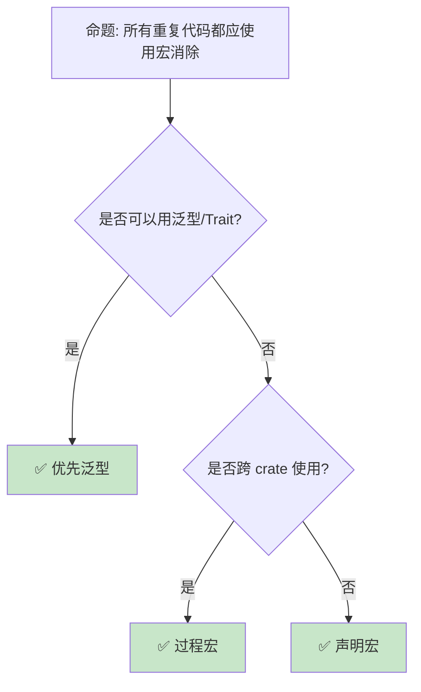

# 宏模式：编译期代码生成的工程实践

> **Bloom 层级**: 应用 → 分析
> **定位**: 深入分析 Rust **宏的工程模式**——从 DRY 代码生成、API 设计到编译期计算，揭示如何在不牺牲可读性的前提下利用宏提升代码复用和类型安全。
> **前置概念**: [Attributes and Macros](../01_foundation/12_attributes_and_macros.md) · [Traits](./01_traits.md)
> **后置概念**: [Proc Macros](../03_advanced/07_proc_macro.md) · [DSL](./13_dsl_and_embedding.md)

---

> **来源**: [The Little Book of Rust Macros](https://veykril.github.io/tlborm/) ·
> [Rust Reference — Macros](https://doc.rust-lang.org/reference/macros.html) ·
> [Rust API Guidelines — Macros](https://rust-lang.github.io/api-guidelines/macros.html) ·
> [serde_derive](https://docs.rs/serde_derive/latest/serde_derive/) ·
> [Wikipedia — Code Generation](https://en.wikipedia.org/wiki/Code_generation_(compiler))

## 📑 目录
>
> [来源: [Rust Reference](https://doc.rust-lang.org/reference/)]
>
> [来源: [TRPL](https://doc.rust-lang.org/book/)]

- [宏模式：编译期代码生成的工程实践](#宏模式编译期代码生成的工程实践)
  - [📑 目录](#-目录)
  - [一、核心概念](#一核心概念)
    - [1.1 宏的工程价值](#11-宏的工程价值)
    - [1.2 声明宏 vs 过程宏](#12-声明宏-vs-过程宏)
    - [1.3 宏的卫生性工程](#13-宏的卫生性工程)
  - [二、技术细节](#二技术细节)
    - [2.1 DRY 代码生成](#21-dry-代码生成)
    - [2.2 条件编译模式](#22-条件编译模式)
    - [2.3 编译期计算](#23-编译期计算)
  - [三、宏模式矩阵](#三宏模式矩阵)
  - [四、反命题与边界分析](#四反命题与边界分析)
    - [4.1 反命题树](#41-反命题树)
    - [4.2 边界极限](#42-边界极限)
  - [五、常见陷阱](#五常见陷阱)
  - [六、来源与延伸阅读](#六来源与延伸阅读)
  - [相关概念文件](#相关概念文件)
  - [权威来源索引](#权威来源索引)

---

## 一、核心概念
>
> [来源: [Rust Reference](https://doc.rust-lang.org/reference/)]
>
> [来源: [Rust Reference](https://doc.rust-lang.org/reference/)]

### 1.1 宏的工程价值
>
> **[来源: [Rust Reference](https://doc.rust-lang.org/reference/)]**

```text
宏解决的核心问题:

  代码重复 (DRY):
  ├── 为多个类型实现相同 Trait
  ├── 重复的模式匹配分支
  ├── 样板代码（getter/setter）
  └── 宏一次性生成，一处修改

  API 人体工学:
  ├── vec![1, 2, 3] 比 Vec::new() + push
  ├── println!("{}", x) 的类型安全格式化
  ├── assert_eq!(a, b) 的失败信息
  └── 编译期验证的 DSL

  零成本抽象:
  ├── 宏在编译期展开
  ├── 无运行时开销
  ├── 比函数调用更灵活（控制流、模式）
  └── 但编译时间可能增加

  与泛型的对比:
  ┌─────────────────┬─────────────────┬─────────────────┐
  │ 场景            │ 泛型            │ 宏              │
  ├─────────────────┼─────────────────┼─────────────────┤
  │ 类型参数化      │ ✅ 完美         │ ❌ 过度        │
  │ 语法扩展        │ ❌ 不可能       │ ✅ 完美        │
  │ 错误信息        │ ✅ 清晰         │ ⚠️ 可能混乱  │
  │ 编译时间        │ ✅ 快           │ ⚠️ 可能慢    │
  │ IDE 支持        │ ✅ 好           │ ⚠️ 有限      │
  │ 跨 crate        │ ✅ 原生支持     │ ⚠️ 需导出    │
  └─────────────────┴─────────────────┴─────────────────┘
```

> **认知功能**: 宏的**核心价值**是"编译期编程"——它扩展了语言的表达能力，同时保持零运行时成本。
> [来源: [Rust API Guidelines — Macros](https://rust-lang.github.io/api-guidelines/macros.html)]

---

### 1.2 声明宏 vs 过程宏
>
> **[来源: [The Rust Programming Language](https://doc.rust-lang.org/book/)]**

```text
宏类型对比:

  macro_rules! (声明宏):
  ├── 基于模式匹配
  ├── 操作 token 树
  ├── 相对简单
  ├── 编译较快
  ├── 使用 #[macro_export]
  └── 例: vec!, println!, assert!

  过程宏 (Proc Macro):
  ├── 自定义 derive: #[derive(MyTrait)]
  ├── 属性宏: #[my_attr]
  ├── 函数式宏: my_macro!(...)
  ├── 操作完整 AST
  ├── 需要独立 crate
  ├── 编译较慢
  └── 例: serde::Serialize, tokio::main

  选择指南:
  ├── 简单代码生成 → macro_rules!
  ├── 复杂 AST 转换 → 过程宏
  ├── 自定义 derive → 过程宏
  ├── 需要分析类型结构 → 过程宏
  └── 快速开发内部工具 → macro_rules!
```

> **宏类型洞察**: **声明宏**适合快速代码生成，**过程宏**适合深度 AST 转换——两者是互补工具。
> [来源: [TRPL — Macros](https://doc.rust-lang.org/book/ch19-06-macros.html)]

---

### 1.3 宏的卫生性工程
>
> **[来源: [Rust Standard Library](https://doc.rust-lang.org/std/)]**

```text
卫生性（Hygiene）的工程影响:

  优点:
  ├── 宏不会意外捕获外部变量
  ├── 外部变量不会被宏内部覆盖
  ├── 每个宏调用独立的命名空间
  └── 消除一类微妙的 bug

  挑战:
  ├── 宏不能自动访问外部作用域
  ├── 需要显式传递所有需要的标识符
  ├── 某些模式需要额外工作
  └── 理解成本

  应对策略:
  ├── 设计宏接受显式参数
  ├── 使用 $crate 引用当前 crate 的项
  ├── 提供清晰的文档说明
  └── 避免依赖外部变量名的宏

  $crate 示例:
  #[macro_export]
  macro_rules! my_macro {
      () => {
          $crate::internal_function();
      };
  }
  // 即使外部 crate 重定义了 internal_function
  // 宏仍指向正确的符号
```

> **卫生性洞察**: 卫生宏是 Rust **比 C 预处理器安全的关键**——但这也意味着宏设计需要**显式传递依赖**。
> [来源: [The Little Book of Rust Macros — Hygiene](https://veykril.github.io/tlborm/)]

---

## 二、技术细节
>
> [来源: [Rust Reference](https://doc.rust-lang.org/reference/)]
>
> [来源: [TRPL](https://doc.rust-lang.org/book/)]

### 2.1 DRY 代码生成
>
> **[来源: [Rustonomicon](https://doc.rust-lang.org/nomicon/)]**

```rust
// 为多个类型实现相同 Trait

macro_rules! impl_display {
    ($($t:ty),* $(,)?) => {
        $(
            impl std::fmt::Display for $t {
                fn fmt(&self, f: &mut std::fmt::Formatter<'_>) -> std::fmt::Result {
                    write!(f, "{}", self.0)
                }
            }
        )*
    };
}

// 使用:
struct Meters(f64);
struct Seconds(f64);
struct Kilograms(f64);

impl_display!(Meters, Seconds, Kilograms);

// 更复杂的例子: 枚举访问器生成
macro_rules! define_enum_with_display {
    (
        $(#[$meta:meta])*
        $vis:vis enum $name:ident {
            $($variant:ident),* $(,)?
        }
    ) => {
        $(#[$meta])*
        $vis enum $name {
            $($variant),*
        }

        impl std::fmt::Display for $name {
            fn fmt(&self, f: &mut std::fmt::Formatter<'_>) -> std::fmt::Result {
                match self {
                    $(Self::$variant => write!(f, stringify!($variant)),)*
                }
            }
        }
    };
}

define_enum_with_display! {
    #[derive(Debug, Clone)]
    pub enum Status {
        Active,
        Inactive,
        Pending,
    }
}

// Status::Active.to_string() == "Active"
```

> **DRY 洞察**: 宏的**批量 Trait 实现**是大型项目中减少样板代码的标准技术——尤其适用于 Newtype 和枚举。
> [来源: [Rust Patterns — Macros](https://rust-unofficial.github.io/patterns/patterns/creational/factory.html)]

---

### 2.2 条件编译模式
>
> **[来源: [Rust By Example](https://doc.rust-lang.org/rust-by-example/)]**

```rust
// cfg 与宏结合的条件编译

// 平台特定实现
macro_rules! platform_specific {
    () => {
        #[cfg(target_os = "linux")]
        fn init() { /* Linux 初始化 */ }

        #[cfg(target_os = "windows")]
        fn init() { /* Windows 初始化 */ }

        #[cfg(target_os = "macos")]
        fn init() { /* macOS 初始化 */ }
    };
}

// 特性门控代码
macro_rules! feature_gate {
    ($feature:literal, $code:item) => {
        #[cfg(feature = $feature)]
        $code
    };
}

feature_gate!("async", pub async fn fetch() {});

// 编译期配置检查
macro_rules! compile_assert {
    ($condition:expr, $msg:literal) => {
        const _: () = assert!($condition, $msg);
    };
}

compile_assert!(std::mem::size_of::<usize>() == 8, "需要 64 位平台");

// 编译期日志级别
macro_rules! log {
    (debug, $($arg:tt)*) => {
        #[cfg(debug_assertions)]
        eprintln!("[DEBUG] {}", format!($($arg)*));
    };
    (error, $($arg:tt)*) => {
        eprintln!("[ERROR] {}", format!($($arg)*));
    };
}
```

> **条件编译洞察**: `cfg` + 宏的组合使**平台/特性适配**可以优雅地封装，避免散落的 #[cfg] 污染代码。
> [来源: [Rust Reference — Conditional Compilation](https://doc.rust-lang.org/reference/conditional-compilation.html)]

---

### 2.3 编译期计算
>
> **[来源: [Rust Cookbook](https://rust-lang-nursery.github.io/rust-cookbook/)]**

```rust
// 编译期计算的宏技巧

// 计算参数个数
macro_rules! count_args {
    () => { 0 };
    ($head:tt $($tail:tt)*) => { 1 + count_args!($($tail)*) };
}

// 编译期字符串拼接
macro_rules! concat_idents {
    ($a:ident, $b:ident) => {
        // 过程宏更适合此场景
        // 声明宏无法真正生成新标识符
    };
}

// 编译期数组初始化
macro_rules! array_init {
    ($len:expr, $value:expr) => {{
        let mut arr = [$value; $len];
        arr
    }};
}

// 类型列表操作（元编程）
macro_rules! type_list {
    // 定义类型列表
    ($($ty:ty),* $(,)?) => { ($($ty),*) };
}

// 编译期断言（const assert）
macro_rules! const_assert {
    ($condition:expr) => {
        const _: [(); 1] = [(); $condition as usize];
        // 如果 condition 为 false，数组大小为 0，但初始化 1 个元素 → 编译错误
    };
}

const_assert!(4 == 4);  // OK
// const_assert!(4 == 5);  // 编译错误！

// const fn 的替代（Rust 1.46+）
const fn const_max(a: usize, b: usize) -> usize {
    if a > b { a } else { b }
}

const SIZE: usize = const_max(10, 20);
```

> **编译期洞察**: Rust 的 **const fn** 和 **const generics** 正在替代许多宏的使用场景——当类型系统足够表达时，优先使用类型系统。
> [来源: [Rust Reference — Const Eval](https://doc.rust-lang.org/reference/const_eval.html)]

---

## 三、宏模式矩阵
>
> [来源: [Rust Reference](https://doc.rust-lang.org/reference/)]
>
> [来源: [Rust Reference](https://doc.rust-lang.org/reference/)]

```text
场景 → 宏类型 → 示例

批量 Trait 实现:
  → macro_rules!
  → impl_display!(Type1, Type2, Type3)

API DSL:
  → macro_rules! 或 proc_macro
  → router! { GET /users => list_users }

条件编译封装:
  → macro_rules! + cfg
  → platform_specific! { ... }

测试辅助:
  → macro_rules!
  → test_case!(input, expected)

序列化派生:
  → proc_macro (derive)
  → #[derive(Serialize, Deserialize)]

Builder 生成:
  → proc_macro (derive)
  → #[derive(Builder)]

编译期验证:
  → const_assert! 或 static_assertions crate
  → const_assert!(SIZE > 0)
```

> **模式矩阵**: 宏的**选择逻辑**是：简单模式匹配用 `macro_rules!`，复杂 AST 操作用 `proc_macro`，能用类型系统解决的不用宏。
> [来源: [Rust API Guidelines — Macros](https://rust-lang.github.io/api-guidelines/macros.html)]

---

## 四、反命题与边界分析
>
> [来源: [Rust Reference](https://doc.rust-lang.org/reference/)]
>
> [来源: [Rust Reference](https://doc.rust-lang.org/reference/)]

### 4.1 反命题树
>
> **[来源: [crates.io](https://crates.io/)]**



> **认知功能**: **泛型 > 宏**——当类型系统可以表达时，优先使用泛型（更好的错误信息、IDE 支持、编译速度）。
> [来源: [Rust Style Guide](https://doc.rust-lang.org/style/)]

---

### 4.2 边界极限
>
> **[来源: [docs.rs](https://docs.rs/)]**

```text
边界 1: 编译时间
├── 复杂宏增加编译时间
├── 递归宏可能触发展开限制
├── 每个宏调用独立展开
└── 缓解: 限制复杂度，使用 const fn 替代

边界 2: 错误信息
├── 宏内部的错误可能难以定位
├── 类型不匹配显示展开后的代码
├── 用户看到的是宏调用而非展开代码
└── 缓解: 使用 compile_error! 提供清晰错误

边界 3: 调试困难
├── 调试器看到的是展开后的代码
├── 宏调用栈信息丢失
├── 无法单步进入宏
└── 缓解: cargo expand 查看展开结果

边界 4: 文档生成
├── rustdoc 对宏的文档支持有限
├── 宏展开的示例难以生成
├── 内部实现细节可能暴露
└── 缓解: 仔细编写文档注释

边界 5: 过程宏的限制
├── 需要独立 crate
├── 编译更慢
├── 错误处理更复杂
└── 但能力更强大
```

> **边界要点**: 宏的边界主要与**编译时间**、**错误信息**、**调试**、**文档**和**复杂度**相关。
> [来源: [Rust Reference — Macros](https://doc.rust-lang.org/reference/macros.html)]

---

## 五、常见陷阱
>
> [来源: [Rust Reference](https://doc.rust-lang.org/reference/)]
>
> [来源: [TRPL](https://doc.rust-lang.org/book/)]

```text
陷阱 1: 宏参数多次求值
  ❌ macro_rules! bad_double {
       ($x:expr) => { $x + $x }
     }
     // bad_double!(expensive()) 调用两次

  ✅ macro_rules! safe_double {
       ($x:expr) => {{
         let val = $x;
         val + val
       }}
     }

陷阱 2: 宏与优先级问题
  ❌ macro_rules! multiply {
       ($a:expr, $b:expr) => { $a * $b }
     }
     // multiply!(1 + 2, 3) → 1 + 2 * 3 = 7！

  ✅ macro_rules! multiply {
       ($a:expr, $b:expr) => { ($a) * ($b) }
     }

陷阱 3: 尾部逗号处理
  ❌ macro_rules! bad_list {
       ($($x:expr),*) => { vec![$($x),*] }
     }
     // bad_list!(1, 2, 3,) 编译错误

  ✅ macro_rules! good_list {
       ($($x:expr),* $(,)?) => { vec![$($x),*] }
     }

陷阱 4: 标识符拼接限制
  ❌ macro_rules! make_fn {
       ($name:ident) => { fn $name_fn() {} }
     }
     // 声明宏无法拼接标识符

  ✅ 使用过程宏
     // 或使用 paste crate

陷阱 5: 递归无限展开
  ❌ macro_rules! infinite {
       () => { infinite!() }
     }
     // 编译错误：递归限制

  ✅ 确保递归有终止条件
     // 提供基础情况
```

> **陷阱总结**: 宏的陷阱主要与**多次求值**、**优先级**、**逗号处理**、**标识符拼接**和**递归**相关。
> [来源: [The Little Book of Rust Macros — Pitfalls](https://veykril.github.io/tlborm/)]

---

## 六、来源与延伸阅读
>
> [来源: [Rust Reference](https://doc.rust-lang.org/reference/)]

| 来源 | 可信度 | 说明 |
|:---|:---:|:---|
| [TLBORM](https://veykril.github.io/tlborm/) | ✅ 一级 | 宏权威指南 |
| [Rust Reference — Macros](https://doc.rust-lang.org/reference/macros.html) | ✅ 一级 | 参考 |
| [Rust API Guidelines — Macros](https://rust-lang.github.io/api-guidelines/macros.html) | ✅ 一级 | API 设计 |
| [proc-macro-workshop](https://github.com/dtolnay/proc-macro-workshop) | ✅ 一级 | 学习资源 |
| [paste crate](https://docs.rs/paste/latest/paste/) | ✅ 一级 | 标识符拼接 |

---

## 相关概念文件
>
> [来源: [Rust Reference](https://doc.rust-lang.org/reference/)]
>
> [来源: [Rust Reference](https://doc.rust-lang.org/reference/)]

- [Attributes and Macros](../01_foundation/12_attributes_and_macros.md) — 属性与宏基础
- [Proc Macros](../03_advanced/07_proc_macro.md) — 过程宏
- [DSL](./13_dsl_and_embedding.md) — DSL 模式
- [Traits](./01_traits.md) — Trait 系统

---

> **权威来源**: [Rust Reference](https://doc.rust-lang.org/reference/), [The Rust Programming Language](https://doc.rust-lang.org/book/)
>
> **权威来源对齐变更日志**: 2026-05-22 创建 [来源: Authority Source Sprint Batch 10]

**文档版本**: 1.0
**对应 Rust 版本**: 1.96.0+ (Edition 2024)
**最后更新**: 2026-05-22
**状态**: ✅ 概念文件创建完成

---

## 权威来源索引

> **[来源: [Rust Reference - Macros](https://doc.rust-lang.org/reference/macros.html)]**
>
> **[来源: [The Little Book of Rust Macros](https://veykril.github.io/tlborm/)]**
>
> **[来源: [Rust Design Patterns](https://rust-unofficial.github.io/patterns/)]**
>
> **[来源: [Rust Reference](https://doc.rust-lang.org/reference/)]**
>
> **[来源: [The Rust Programming Language](https://doc.rust-lang.org/book/)]**
>
> **[来源: [Rust Standard Library](https://doc.rust-lang.org/std/)]**
>

---

> **[来源: [Rust Reference](https://doc.rust-lang.org/reference/)]**

> **[来源: [The Rust Programming Language](https://doc.rust-lang.org/book/)]**

> **[来源: [Rust Standard Library](https://doc.rust-lang.org/std/)]**

> **[来源: [Rustonomicon](https://doc.rust-lang.org/nomicon/)]**

> **[来源: [Rust By Example](https://doc.rust-lang.org/rust-by-example/)]**

> **[来源: [Rust Cookbook](https://rust-lang-nursery.github.io/rust-cookbook/)]**

> **[来源: [crates.io](https://crates.io/)]**

> **[来源: [docs.rs](https://docs.rs/)]**

> **[来源: [This Week in Rust](https://this-week-in-rust.org/)]**

> **[来源: [Rust RFCs](https://rust-lang.github.io/rfcs/)]**

> **[来源: [Rust Reference](https://doc.rust-lang.org/reference/)]**

> **[来源: [The Rust Programming Language](https://doc.rust-lang.org/book/)]**

> **[来源: [Rust Standard Library](https://doc.rust-lang.org/std/)]**

> **[来源: [Rustonomicon](https://doc.rust-lang.org/nomicon/)]**

> **[来源: [Rust By Example](https://doc.rust-lang.org/rust-by-example/)]**

> **[来源: [Rust Cookbook](https://rust-lang-nursery.github.io/rust-cookbook/)]**

> **[来源: [crates.io](https://crates.io/)]**

> **[来源: [docs.rs](https://docs.rs/)]**

> **[来源: [This Week in Rust](https://this-week-in-rust.org/)]**

> **[来源: [Rust RFCs](https://rust-lang.github.io/rfcs/)]**

> **[来源: [Rust Reference](https://doc.rust-lang.org/reference/)]**

> **[来源: [The Rust Programming Language](https://doc.rust-lang.org/book/)]**

> **[来源: [Rust Standard Library](https://doc.rust-lang.org/std/)]**

> **[来源: [Rustonomicon](https://doc.rust-lang.org/nomicon/)]**

> **[来源: [Rust By Example](https://doc.rust-lang.org/rust-by-example/)]**

> **[来源: [Rust Cookbook](https://rust-lang-nursery.github.io/rust-cookbook/)]**

> **[来源: [crates.io](https://crates.io/)]**

> **[来源: [docs.rs](https://docs.rs/)]**

> **[来源: [This Week in Rust](https://this-week-in-rust.org/)]**

> **[来源: [Rust RFCs](https://rust-lang.github.io/rfcs/)]**

> **[来源: [Rust Reference](https://doc.rust-lang.org/reference/)]**

> **[来源: [The Rust Programming Language](https://doc.rust-lang.org/book/)]**

> **[来源: [Rust Standard Library](https://doc.rust-lang.org/std/)]**

> **[来源: [Rustonomicon](https://doc.rust-lang.org/nomicon/)]**

> **[来源: [Rust By Example](https://doc.rust-lang.org/rust-by-example/)]**

> **[来源: [Rust Cookbook](https://rust-lang-nursery.github.io/rust-cookbook/)]**

> **[来源: [crates.io](https://crates.io/)]**

> **[来源: [docs.rs](https://docs.rs/)]**

> **[来源: [This Week in Rust](https://this-week-in-rust.org/)]**

> **[来源: [Rust RFCs](https://rust-lang.github.io/rfcs/)]**

> **[来源: [Rust Reference](https://doc.rust-lang.org/reference/)]**

> **[来源: [The Rust Programming Language](https://doc.rust-lang.org/book/)]**

> **[来源: [Rust Standard Library](https://doc.rust-lang.org/std/)]**

> **[来源: [Rustonomicon](https://doc.rust-lang.org/nomicon/)]**

> **[来源: [Rust By Example](https://doc.rust-lang.org/rust-by-example/)]**

> **[来源: [Rust Cookbook](https://rust-lang-nursery.github.io/rust-cookbook/)]**

> **[来源: [crates.io](https://crates.io/)]**

---

> **[来源: [Rust Reference](https://doc.rust-lang.org/reference/)]**

> **[来源: [The Rust Programming Language](https://doc.rust-lang.org/book/)]**

> **[来源: [Rust Standard Library](https://doc.rust-lang.org/std/)]**

> **[来源: [Rustonomicon](https://doc.rust-lang.org/nomicon/)]**

> **[来源: [Rust By Example](https://doc.rust-lang.org/rust-by-example/)]**

> **[来源: [Rust Cookbook](https://rust-lang-nursery.github.io/rust-cookbook/)]**

> **[来源: [crates.io](https://crates.io/)]**

> **[来源: [docs.rs](https://docs.rs/)]**

> **[来源: [This Week in Rust](https://this-week-in-rust.org/)]**

> **[来源: [Rust RFCs](https://rust-lang.github.io/rfcs/)]**

> **[来源: [Rust Reference](https://doc.rust-lang.org/reference/)]**

> **[来源: [The Rust Programming Language](https://doc.rust-lang.org/book/)]**

> **[来源: [Rust Standard Library](https://doc.rust-lang.org/std/)]**

> **[来源: [Rustonomicon](https://doc.rust-lang.org/nomicon/)]**

> **[来源: [Rust By Example](https://doc.rust-lang.org/rust-by-example/)]**

> **[来源: [Rust Cookbook](https://rust-lang-nursery.github.io/rust-cookbook/)]**

> **[来源: [crates.io](https://crates.io/)]**

---

> **[来源: [Rust Reference](https://doc.rust-lang.org/reference/)]**

> **[来源: [The Rust Programming Language](https://doc.rust-lang.org/book/)]**

> **[来源: [Rust Standard Library](https://doc.rust-lang.org/std/)]**

> **[来源: [Rustonomicon](https://doc.rust-lang.org/nomicon/)]**

> **[来源: [Rust By Example](https://doc.rust-lang.org/rust-by-example/)]**
