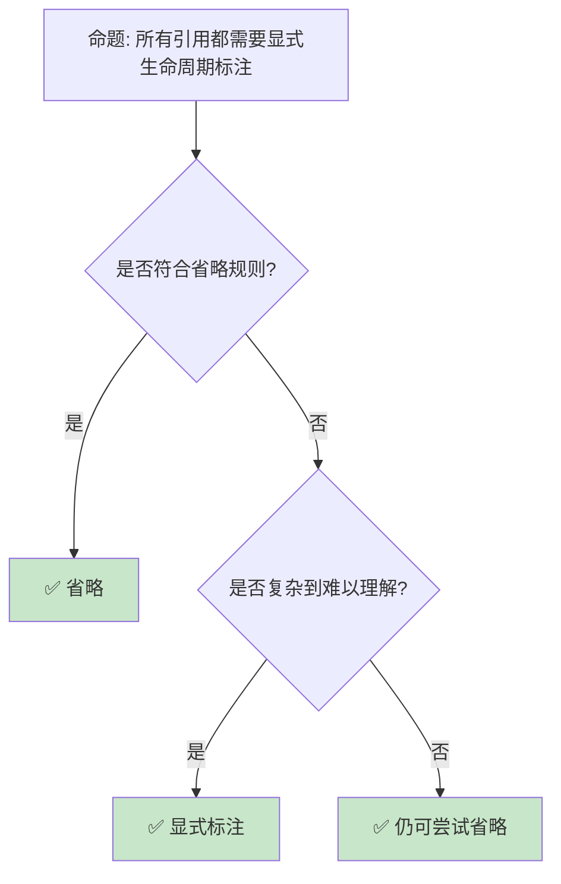

# 生命周期高级主题：从 HRTB 到自引用类型

> **Bloom 层级**: 分析 → 评价
> **定位**: 深入分析 Rust **生命周期**的高级主题——从高阶生命周期（HRTB）、生命周期省略规则到自引用结构和 Pin，揭示生命周期系统如何处理最复杂的借用场景。
> **前置概念**: [Lifetimes](../01_foundation/03_lifetimes.md) · [Traits](./01_traits.md) · [Generics](./02_generics.md)
> **后置概念**: [Pin](../03_advanced/06_pin_unpin.md) · [NLL](../03_advanced/08_nll_and_polonius.md) · [RustBelt](../04_formal/04_rustbelt.md)

---

> **来源**: [Rust Reference — Lifetimes](https://doc.rust-lang.org/reference/lifetime-elision.html) ·
> [TRPL — Advanced Lifetimes](https://doc.rust-lang.org/book/ch19-02-advanced-lifetimes.html) ·
> [RFC 0387 — Higher-Ranked Trait Bounds](https://rust-lang.github.io/rfcs/0387-higher-ranked-trait-bounds.html) ·
> [The Rustonomicon — Subtyping and Variance](https://doc.rust-lang.org/nomicon/subtyping.html) ·
> [Wikipedia — Region-based Memory Management](https://en.wikipedia.org/wiki/Region-based_memory_management)

## 📑 目录

- [生命周期高级主题：从 HRTB 到自引用类型](#生命周期高级主题从-hrtb-到自引用类型)
  - [📑 目录](#-目录)
  - [一、核心概念](#一核心概念)
    - [1.1 高阶生命周期（HRTB）](#11-高阶生命周期hrtb)
    - [1.2 生命周期省略规则](#12-生命周期省略规则)
    - [1.3 变型（Variance）](#13-变型variance)
  - [二、技术细节](#二技术细节)
    - [2.1 HRTB 的实际应用](#21-hrtb-的实际应用)
    - [2.2 自引用与 Pin](#22-自引用与-pin)
    - [2.3 生命周期与闭包](#23-生命周期与闭包)
  - [三、生命周期模式矩阵](#三生命周期模式矩阵)
  - [四、反命题与边界分析](#四反命题与边界分析)
    - [4.1 反命题树](#41-反命题树)
    - [4.2 边界极限](#42-边界极限)
  - [五、常见陷阱](#五常见陷阱)
  - [六、来源与延伸阅读](#六来源与延伸阅读)
  - [相关概念文件](#相关概念文件)

---

## 一、核心概念

### 1.1 高阶生命周期（HRTB）

```text
HRTB (Higher-Ranked Trait Bounds):

  问题场景:
  ├── 需要一个适用于"所有生命周期"的 Trait Bound
  ├── 普通泛型参数只绑定一个具体生命周期
  └── HRTB 允许"对所有生命周期成立"

  语法:
  for<'a> Trait<'a>  // 对所有生命周期 'a，Trait<'a> 成立

  对比:
  fn normal<F>(f: F)
  where F: Fn(&i32)  // F 接受某个特定生命周期的引用

  fn hrtb<F>(f: F)
  where F: for<'a> Fn(&'a i32)  // F 接受任意生命周期的引用

  经典示例:
  let closure = |x: &i32| println!("{}", x);

  // closure 的类型实际上是 for<'a> Fn(&'a i32)
  // 它可以被传入任何接受 &i32 的函数

  HRTB 的必要性:
  ├── 闭包自动实现 for<'a> Fn(&'a T)
  ├── 某些 trait 方法需要灵活的生命周期
  └── 否则泛型函数无法接受闭包
```

> **认知功能**: HRTB 是 Rust **泛型与借用结合**的关键机制——它使闭包和回调可以接受任意生命周期的引用。
> [来源: [RFC 0387 — HRTB](https://rust-lang.github.io/rfcs/0387-higher-ranked-trait-bounds.html)]

---

### 1.2 生命周期省略规则

```text
生命周期省略（Lifetime Elision）:

  规则 1: 每个引用参数获得独立生命周期
    fn foo(x: &i32)           →  fn foo<'a>(x: &'a i32)
    fn foo(x: &i32, y: &i32)  →  fn foo<'a, 'b>(x: &'a i32, y: &'b i32)

  规则 2: 单输入生命周期时，输出生命周期等于该唯一输入生命周期
    ├── 唯一输入: 函数签名中恰好只有一个引用类型的输入参数（即单一生命周期参数）
    ├── 输出等于输入: 返回值中的所有引用类型自动获得与该输入相同的生命周期参数
    ├── 形式化: 若输入仅含单一生命周期 'a，则输出自动绑定 'a
    ├── 示例: fn foo(x: &i32) -> &i32 推导为 fn foo<'a>(x: &'a i32) -> &'a i32
    ├── 关键: 输入端唯一生命周期 → 输出端自动复用该生命周期
    └── 边界: 若存在多个不同生命周期的引用参数，规则 2 不适用，需显式标注

  规则 3: 多个输入，但一个是 &self 或 &mut self，输出使用 self 的生命周期
    fn method(&self) -> &T     →  fn method<'a>(&'a self) -> &'a T
    fn method(&self, x: &T) -> &T  →  fn method<'a, 'b>(&'a self, x: &'b T) -> &'a T

  需要显式标注的情况:
  ├── 规则不适用时
  ├── 返回引用与输入无关（'static）
  ├── 复杂的多重引用关系
  └── 涉及多个生命周期的 trait bound

  示例:
  // 需要显式标注
  fn longest<'a>(x: &'a str, y: &'a str) -> &'a str {
      if x.len() > y.len() { x } else { y }
  }
  // 返回的生命周期必须 <= 两个输入的最小值
```

> **省略洞察**: 生命周期省略**不是可选特性**——它是使 Rust 代码可读的关键设计，覆盖了 90% 的常见模式。
> [来源: [Rust Reference — Lifetime Elision](https://doc.rust-lang.org/reference/lifetime-elision.html)]

---

### 1.3 变型（Variance）

```text
变型: 子类型关系在泛型参数上的传播

  三种变型:
  ├── 协变（Covariant）: T <: U ⇒ Container<T> <: Container<U>
  │   └── &'a T（生命周期越长，类型越小）
  ├── 逆变（Contravariant）: T <: U ⇒ Container<U> <: Container<T>
  │   └── fn(T)（参数类型越宽，函数越窄）
  └── 不变（Invariant）: T <: U ⇏ Container<T> <: Container<U>
      └── &mut T, Cell<T>, Mutex<T>

  生命周期变型:
  ├── &'static T <: &'a T（'static 更长，是子类型）
  ├── 协变: 长生命周期可转为短生命周期
  └── fn(&'static str) 可传入 fn(&'a str)

  Rust 中的变型:
  ┌─────────────────┬─────────────────┐
  │ 类型构造器      │ 变型            │
  ├─────────────────┼─────────────────┤
  │ &T              │ 对 T 协变       │
  │ &mut T          │ 对 T 不变       │
  │ Box<T>          │ 对 T 协变       │
  │ Vec<T>          │ 对 T 协变       │
  │ Cell<T>         │ 对 T 不变       │
  │ fn(T) -> U      │ 对 T 逆变，对 U 协变│
  │ *const T        │ 对 T 协变       │
  │ *mut T          │ 对 T 不变       │
  └─────────────────┴─────────────────┘

  变型的影响:
  ├── 协变允许放宽生命周期约束
  ├── 不变阻止危险的生命周期缩短
  └── 理解变型有助于解决生命周期错误
```

> **变型洞察**: **变型**是 Rust 类型系统的**隐藏齿轮**——它解释了为什么某些生命周期转换合法而另一些不合法。
> [来源: [The Rustonomicon — Variance](https://doc.rust-lang.org/nomicon/subtyping.html)]

---

## 二、技术细节

### 2.1 HRTB 的实际应用

```rust,ignore
// HRTB 的实际应用

// 1. 接受任意生命周期的闭包
fn with_data<F>(f: F)
where
    F: for<'a> Fn(&'a str) -> usize,
{
    let s = "hello";
    f(s);
}

// 2. 泛型 trait bound
trait Parser<'a> {
    fn parse(&self, input: &'a str) -> Result<&'a str, Error>;
}

// HRTB 使 Parser 适用于所有生命周期
fn parse_any<P>(parser: P, input: &str) -> Result<&str, Error>
where
    P: for<'a> Parser<'a>,
{
    parser.parse(input)
}

// 3. 闭包作为回调
fn process_items<F>(items: &[i32], mut callback: F)
where
    F: for<'a> FnMut(&'a i32),
{
    for item in items {
        callback(item);
    }
}

// 使用:
process_items(&[1, 2, 3], |x| println!("{}", x));
// 闭包自动满足 for<'a> FnMut(&'a i32)

// 4. 与 'static 的区别
fn static_callback<F>(f: F)
where F: Fn(&'static str)
{
    f("hello");  // 只能接受 'static 字符串
}

fn any_callback<F>(f: F)
where F: for<'a> Fn(&'a str)
{
    let s = String::from("hello");
    f(&s);  // 可以接受任意生命周期
}
```

> **HRTB 洞察**: HRTB 的**核心应用场景**是**闭包和回调**——它使泛型代码可以灵活地接受临时引用。
> [来源: [Rust Reference — HRTB](https://doc.rust-lang.org/reference/trait-bounds.html#higher-ranked-trait-bounds)]

---

### 2.2 自引用与 Pin

```rust,ignore
// 自引用结构: 结构体包含指向自身的引用

struct SelfReferential<'a> {
    data: String,
    pointer_to_data: &'a str,  // 指向 data 字段！
}

// 问题:
// ├── 移动结构体后 data 地址改变
// ├── pointer_to_data 成为悬空指针
// └── Rust 禁止这种结构（编译错误）

// 解决方案: Pin
use std::pin::Pin;
use std::marker::PhantomPinned;

struct SelfReferential {
    data: String,
    pointer_to_data: *const str,  // 使用原始指针
    _pin: PhantomPinned,           // 禁止移动
}

impl SelfReferential {
    fn new(data: String) -> Pin<Box<Self>> {
        let mut boxed = Box::new(Self {
            data,
            pointer_to_data: std::ptr::null(),
            _pin: PhantomPinned,
        });

        let ptr = &boxed.data as *const str;
        boxed.pointer_to_data = ptr;

        // Pin 保证内存位置不变
        Box::into_pin(boxed)
    }
}

// Pin 的关键保证:
// ├── Pin<P<T>> 阻止 T 被移动
// ├── 除非 T: Unpin（默认大多数类型实现 Unpin）
// ├── PhantomPinned 使类型 !Unpin
// └── 自引用结构必须 Pin 到堆上

// async/await 的内部:
// ├── Future 状态机是自引用结构
// ├── .await 点可能持有局部变量引用
// └── async fn 返回 Pin<Box<dyn Future>>
```

> **Pin 洞察**: `Pin` 是 Rust **自引用类型的解决方案**——它为 async/await、生成器等高级特性提供了内存安全保证。
> [来源: [std::pin::Pin](https://doc.rust-lang.org/std/pin/struct.Pin.html)]

---

### 2.3 生命周期与闭包

```rust,ignore
// 闭包捕获与生命周期

fn closure_lifetimes() {
    let s = String::from("hello");

    // 1. 通过引用捕获
    let closure = |x: &str| -> String {
        format!("{} {}", s, x)  // s 被 &String 捕获
    };
    // closure 的生命周期与 s 绑定

    // 2. 通过 move 捕获
    let closure = move |x: &str| -> String {
        format!("{} {}", s, x)  // s 被 move 进闭包
    };
    // s 被消耗，closure 拥有数据

    // 3. 闭包作为返回值（需要 'static）
    fn make_closure() -> impl Fn(i32) -> i32 {
        let factor = 2;
        move |x| x * factor  // factor 被 move，闭包是 'static
    }

    // 4. 借用闭包（非 'static）
    fn make_borrowed_closure<'a>(s: &'a str) -> impl Fn() -> &'a str + 'a {
        move || s  // 返回借用的引用
    }
}

// 闭包 Trait:
// ├── Fn: 不可变借用捕获 (&T)
// ├── FnMut: 可变借用捕获 (&mut T)
// └── FnOnce: 移动捕获（T），只能调用一次

// 选择:
// ├── 需要多次调用 + 不可变 → Fn
// ├── 需要多次调用 + 可变 → FnMut
// └── 只需要一次/消耗数据 → FnOnce
```

> **闭包洞察**: 闭包的**三种 Fn trait**对应三种借用模式——它们是 Rust **所有权系统**在闭包上的自然延伸。
> [来源: [TRPL — Closures](https://doc.rust-lang.org/book/ch13-01-closures.html)]

---

## 三、生命周期模式矩阵

```text
场景 → 方案 → 代码模式

简单借用:
  → 生命周期省略
  → fn foo(x: &str) -> &str

多个输入一个输出:
  → 显式生命周期标注
  → fn longest<'a>(x: &'a str, y: &'a str) -> &'a str

泛型结构体借用:
  → 结构体生命周期参数
  → struct Parser<'a> { input: &'a str }

闭包回调:
  → HRTB
  → F: for<'a> Fn(&'a str)

自引用:
  → Pin + PhantomPinned
  → Pin<Box<MyStruct>>

异步生命周期:
  → 'static Future
  → async fn 自动处理
```

> **模式矩阵**: 生命周期是 Rust **最陡峭的学习曲线**——但一旦掌握，它成为编译期保证的强大工具。
> [来源: [Rust Lifetime Visualization](https://rustc-dev-guide.rust-lang.org/borrow_check/region_inference.html)]

---

## 四、反命题与边界分析

### 4.1 反命题树



> **认知功能**: **生命周期省略**覆盖大多数场景——只在编译器无法推断或需要明确文档时显式标注。
> [来源: [Rust API Guidelines — Lifetimes](https://rust-lang.github.io/api-guidelines/flexibility.html#c-seeker)]

---

### 4.2 边界极限

```text
边界 1: 生命周期传染性
├── 一个生命周期标注可能影响整个 API
├── 可能"感染"大量代码需要标注
├── 难以局部化
└── 缓解: 使用 owned 类型（String vs &str）

边界 2: 自引用限制
├── Rust 不直接支持自引用结构
├── 需要 Pin + unsafe 原始指针
├── API 复杂度增加
└── 缓解: 使用索引替代指针，或 Rc/Arc

边界 3: 复杂泛型约束
├── HRTB + 多个生命周期 + Trait Bound
├── 类型签名极长
├── 可读性下降
└── 缓解: type alias、where 子句换行

边界 4: NLL 的局限
├── NLL 改善了常见场景
├── 但某些安全代码仍被拒绝
├── Polonius 将进一步改善
└── 缓解: 重构代码结构，或 unsafe

边界 5: 闭包与生命周期交互
├── 闭包捕获的生命周期难以显式控制
├── move 闭包可能意外复制大对象
├── Fn trait 选择可能令人困惑
└── 缓解: 显式使用 move，理解三种 Fn
```

> **边界要点**: 生命周期高级主题的边界主要与**传染性**、**自引用**、**复杂度**、**NLL 局限**和**闭包交互**相关。
> [来源: [Rust Compiler — Polonius](https://rust-lang.github.io/compiler-team/working-groups/polonius/)]

---

## 五、常见陷阱

```text
陷阱 1: 返回局部引用
  ❌ fn bad() -> &str {
         let s = String::from("hello");
         &s  // s 在函数结束时被 drop
     }

  ✅ fn good() -> String {
         String::from("hello")  // 转移所有权
     }

陷阱 2: 生命周期标注不足
  ❌ fn bad(x: &str, y: &str) -> &str { x }
     // 编译错误：无法推断返回生命周期

  ✅ fn good<'a>(x: &'a str, y: &str) -> &'a str { x }

陷阱 3: 在结构体中存储引用
  ❌ struct Bad { data: &str }
     // 需要生命周期参数

  ✅ struct Good<'a> { data: &'a str }
     // 或 struct Good { data: String }

陷阱 4: HRTB 使用错误
  ❌ fn bad<F>(f: F) where F: Fn(&str) { }
     // 某些闭包不满足

  ✅ fn good<F>(f: F) where F: for<'a> Fn(&'a str) { }

陷阱 5: 忘记 move 闭包
  ❌ let s = String::from("hello");
     let c = || println!("{}", s);
     drop(s);  // 编译错误！s 被借用

  ✅ let c = move || println!("{}", s);
     // s 被 move 进闭包
```

> **陷阱总结**: 生命周期陷阱主要与**返回局部引用**、**标注不足**、**结构体存储引用**、**HRTB**和**闭包捕获**相关。
> [来源: [Common Lifetime Mistakes](https://doc.rust-lang.org/rust-by-example/scope/lifetime.html)]

---

## 六、来源与延伸阅读

| 来源 | 可信度 | 说明 |
|:---|:---:|:---|
| [Rust Reference — Lifetimes](https://doc.rust-lang.org/reference/lifetime-elision.html) | ✅ 一级 | 生命周期参考 |
| [TRPL — Advanced Lifetimes](https://doc.rust-lang.org/book/ch19-02-advanced-lifetimes.html) | ✅ 一级 | 高级教程 |
| [RFC 0387 — HRTB](https://rust-lang.github.io/rfcs/0387-higher-ranked-trait-bounds.html) | ✅ 一级 | HRTB 设计 |
| [The Rustonomicon — Subtyping](https://doc.rust-lang.org/nomicon/subtyping.html) | ✅ 一级 | 变型详解 |
| [Pin and Suffering](https://blog.cloudflare.com/pin-and-unpin-in-rust/) | ✅ 二级 | Pin 深入讲解 |

---

## 相关概念文件

- [Lifetimes](../01_foundation/03_lifetimes.md) — 生命周期基础
- [Pin](../03_advanced/06_pin_unpin.md) — Pin 与 Unpin
- [NLL](../03_advanced/08_nll_and_polonius.md) — NLL 与 Polonius
- [RustBelt](../04_formal/04_rustbelt.md) — 形式化验证

---

> **权威来源**: [Rust Reference](https://doc.rust-lang.org/reference/), [The Rust Programming Language](https://doc.rust-lang.org/book/)
>
> **权威来源对齐变更日志**: 2026-05-22 创建 [来源: Authority Source Sprint Batch 10]

**文档版本**: 1.0
**对应 Rust 版本**: 1.96.0+ (Edition 2024)
**最后更新**: 2026-05-22
**状态**: ✅ 概念文件创建完成
