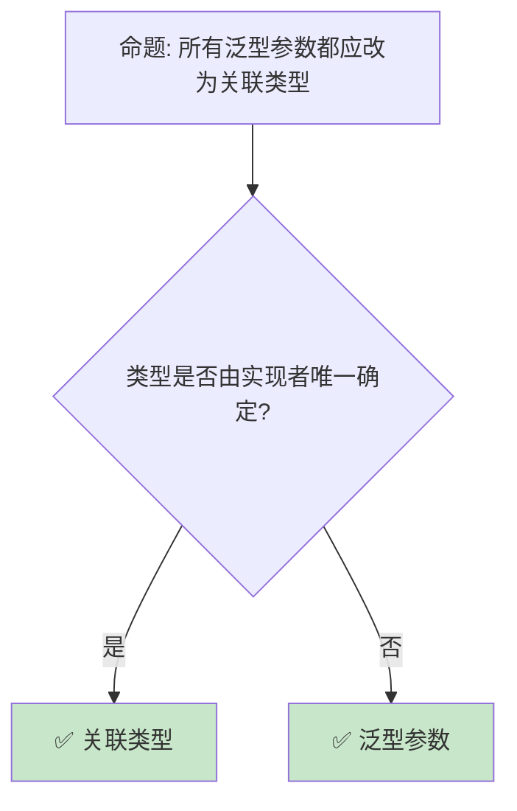

# 高级 Trait 主题：从关联类型到特化

> **Bloom 层级**: 分析 → 评价
> **定位**: 深入分析 Rust **Trait 系统的高级特性**——从关联类型、泛型关联类型（GATs）到特化（Specialization）和负实现，揭示 Trait 系统如何支持复杂抽象和零成本多态。
> **前置概念**: [Traits](./01_traits.md) · [Generics](./02_generics.md) · [Type System](../01_foundation/04_type_system.md)
> **后置概念**: [Type Inference](../04_formal/08_type_inference.md) · [RustBelt](../04_formal/04_rustbelt.md)

---

> **来源**: [Rust Reference — Traits](https://doc.rust-lang.org/reference/items/traits.html) · [TRPL — Advanced Traits](https://doc.rust-lang.org/book/ch19-02-advanced-traits.html) · [RFC 0195 — Associated Items](https://rust-lang.github.io/rfcs/0195-associated-items.html) · [RFC 1598 — Generic Associated Types](https://rust-lang.github.io/rfcs/1598-generic_associated_types.html) · [Wikipedia — Type Class](https://en.wikipedia.org/wiki/Type_class)

## 📑 目录
> [来源: [Rust Reference](https://doc.rust-lang.org/reference/)]
>
> [来源: [TRPL](https://doc.rust-lang.org/book/)]

- [高级 Trait 主题：从关联类型到特化](#高级-trait-主题从关联类型到特化)
  - [📑 目录](#-目录)
  - [一、核心概念](#一核心概念)
    - [1.1 关联类型（Associated Types）](#11-关联类型associated-types)
    - [1.2 泛型关联类型（GATs）](#12-泛型关联类型gats)
    - [1.3 特化（Specialization）](#13-特化specialization)
  - [二、技术细节](#二技术细节)
    - [2.1 关联类型 vs 泛型参数](#21-关联类型-vs-泛型参数)
    - [2.2 负 Trait 实现](#22-负-trait-实现)
    - [2.3 Trait 别名](#23-trait-别名)
  - [三、Trait 模式矩阵](#三trait-模式矩阵)
  - [四、反命题与边界分析](#四反命题与边界分析)
    - [4.1 反命题树](#41-反命题树)
    - [4.2 边界极限](#42-边界极限)
  - [五、常见陷阱](#五常见陷阱)
  - [六、来源与延伸阅读](#六来源与延伸阅读)
  - [相关概念文件](#相关概念文件)

---

## 一、核心概念
> [来源: [Rust Reference](https://doc.rust-lang.org/reference/)]
>
> [来源: [Rust Reference](https://doc.rust-lang.org/reference/)]

### 1.1 关联类型（Associated Types）

```rust,ignore
// 关联类型: Trait 中的类型占位符

pub trait Iterator {
    type Item;  // 关联类型
    fn next(&mut self) -> Option<Self::Item>;
}

// 实现时指定具体类型
impl Iterator for Vec<i32> {
    type Item = i32;  // 每个类型只能有一种实现
    fn next(&mut self) -> Option<Self::Item> {
        // ...
        None
    }
}

// 与泛型参数的对比:
// 泛型参数:
trait GenericIterator<T> {
    fn next(&mut self) -> Option<T>;
}
// 一个类型可多次实现: GenericIterator<i32>, GenericIterator<String>

// 关联类型:
trait AssociatedIterator {
    type Item;
    fn next(&mut self) -> Option<Self::Item>;
}
// 一个类型只能实现一次（Item 唯一确定）

// 为什么使用关联类型:
// ├── 更清晰: 类型与 Trait 的关系更紧密
// ├── 更少的类型参数噪声
// ├── 避免歧义: Vec<i32> 的 Iterator 只有一种
// └── 更好的类型推断

// 示例: Graph trait
pub trait Graph {
    type Node;
    type Edge;

    fn nodes(&self) -> Vec<Self::Node>;
    fn edges(&self) -> Vec<Self::Edge>;
    fn has_edge(&self, from: &Self::Node, to: &Self::Node) -> bool;
}
```

> **关联类型洞察**: 关联类型使 Trait **像一个"类型族"**——每个实现者定义自己的成员类型，而非让调用者指定。
> [来源: [RFC 0195 — Associated Items](https://rust-lang.github.io/rfcs/0195-associated-items.html)]

---

### 1.2 泛型关联类型（GATs）

```rust,ignore
// GATs: Generic Associated Types (Rust 1.65+)

// 核心概念: 关联类型可以有泛型参数
pub trait LendingIterator {
    type Item<'a> where Self: 'a;  // GAT！
    fn next<'a>(&'a mut self) -> Option<Self::Item<'a>>;
}

// 应用场景 1: 自引用迭代器
struct Windows<'a, T> {
    slice: &'a [T],
    pos: usize,
    size: usize,
}

impl<'a, T> LendingIterator for Windows<'a, T> {
    type Item<'b> = &'b [T] where Self: 'b;
    fn next<'b>(&'b mut self) -> Option<Self::Item<'b>> {
        let window = self.slice.get(self.pos..self.pos + self.size)?;
        self.pos += 1;
        Some(window)
    }
}

// 应用场景 2: 可变借用迭代器
struct MutWindows<'a, T> {
    slice: &'a mut [T],
}

impl<'a, T> LendingIterator for MutWindows<'a, T> {
    type Item<'b> = &'b mut [T] where Self: 'b;
    // ...
}

// GATs 使之前不可能的类型安全模式成为可能
// 例如: 流式反序列化、按行解析、窗口迭代
```

> **GATs 洞察**: GATs 是 Rust **类型系统的重大扩展**——它使**生命周期泛型**可以出现在关联类型上，解决了自引用和流式处理的核心问题。
> [来源: [RFC 1598 — GATs](https://rust-lang.github.io/rfcs/1598-generic_associated_types.html)]

---

### 1.3 特化（Specialization）

```text
特化: 为特定类型提供优化的 Trait 实现

  核心思想:
  ├── 泛型实现: 适用于所有类型
  ├── 特化实现: 适用于特定类型，更优
  └── 编译器选择最具体的实现

  当前状态:
  ├── 不稳定特性（feature(specialization)）
  ├── 部分实现可用
  ├── 设计复杂（_soundness 问题）
  └── 预计逐步稳定

  示例（概念性）:
  // 默认实现
  impl<T: Display> ToString for T {
      fn to_string(&self) -> String {
          format!("{}", self)
      }
  }

  // 特化: String 已有字符串，无需格式化
  impl ToString for String {
      fn to_string(&self) -> String {
          self.clone()  // 直接克隆，更高效
      }
  }

  用例:
  ├── 为特定类型提供零拷贝实现
  ├── 为原始类型提供 SIMD 优化
  ├── 为已知大小类型提供栈分配
  └── 渐进式优化（先通用，后特化）
```

> **特化洞察**: 特化是 Rust **"零成本抽象"承诺的技术支撑**——通用代码工作，特定类型可以优化到与手写代码等价。
> [来源: [Rust Tracking Issue — Specialization](https://github.com/rust-lang/rust/issues/31844)]

---

## 二、技术细节
> [来源: [Rust Reference](https://doc.rust-lang.org/reference/)]
>
> [来源: [TRPL](https://doc.rust-lang.org/book/)]

### 2.1 关联类型 vs 泛型参数

```rust,ignore
// 对比: 何时用关联类型，何时用泛型参数

// 场景 1: 多个 Trait Bound（关联类型更清晰）
fn process<I: Iterator>(iter: I) -> Vec<I::Item>  // 清晰
fn process<T, I: Iterator<T>>(iter: I) -> Vec<T>   // 参数多

// 场景 2: 类型由实现者决定（关联类型）
trait Container {
    type Item;
    fn get(&self) -> Option<Self::Item>;
}

// 场景 3: 调用者需要 flexibility（泛型参数）
trait Convert<T> {
    fn convert(&self) -> T;
}

// String 可以 Convert 到多种类型
impl Convert<Vec<u8>> for String { ... }
impl Convert<OsString> for String { ... }

// 决策树:
// ├── 类型由实现者唯一确定 → 关联类型
// ├── 一个类型可有多种实现 → 泛型参数
// ├── 需要清晰的 API 表面 → 关联类型
// └── 需要灵活性 → 泛型参数
```

> **选择洞察**: **关联类型用于"输出类型"**，**泛型参数用于"输入类型"**——这是核心设计原则。
> [来源: [Rust API Guidelines — Traits](https://rust-lang.github.io/api-guidelines/flexibility.html#c-associated-type)]

---

### 2.2 负 Trait 实现

```rust,ignore
// 负实现: 显式声明类型不实现某个 Trait

#![feature(negative_impls)]

// 正实现
impl !Trait for Type;  // Type 明确不实现 Trait

// 实际用例: 标记非 Send/Sync 类型
struct RawPointer(*mut u8);

impl !Send for RawPointer {}
impl !Sync for RawPointer {}

// 用途:
// ├── 明确标记不可安全跨线程的类型
// ├── 文档化设计决策
// ├── 防止 auto trait 的意外实现
// └── 形式化安全保证

// 与 PhantomData 结合:
use std::marker::PhantomData;

struct MyType<T> {
    _marker: PhantomData<*const T>,  // 不拥有 T
}

impl<T> !Send for MyType<T> {}  // 明确非 Send
impl<T> !Sync for MyType<T> {}  // 明确非 Sync
```

> **负实现洞察**: 负实现是 Rust **类型系统的"明确拒绝"机制**——它使 unsafe 代码的不变性可以在类型层面表达。
> [来源: [Rust Reference — Negative Implementations](https://doc.rust-lang.org/reference/items/implementations.html#negative-implementations)]

---

### 2.3 Trait 别名

```rust,ignore
// Trait 别名: 简化复杂的 Trait Bound

// 定义别名
trait Numeric = Add<Output = Self> + Sub<Output = Self> + Mul<Output = Self> + Copy;

// 使用
fn multiply<T: Numeric>(a: T, b: T) -> T {
    a * b
}

// 等价于:
fn multiply<T>(a: T, b: T) -> T
where
    T: Add<Output = T> + Sub<Output = T> + Mul<Output = T> + Copy,
{
    a * b
}

// 实际应用: 简化回调类型
pub trait Service = Fn(Request) -> Response + Send + Sync + 'static;

// 等价复杂的 where 子句:
// where F: Fn(Request) -> Response + Send + Sync + 'static
```

> **别名洞察**: Trait 别名**减少样板代码**——复杂的 where 子句可以封装为有意义的名称。
> [来源: [Rust Reference — Trait Aliases](https://doc.rust-lang.org/reference/items/trait-aliases.html)]

---

## 三、Trait 模式矩阵
> [来源: [Rust Reference](https://doc.rust-lang.org/reference/)]
>
> [来源: [Rust Reference](https://doc.rust-lang.org/reference/)]

```text
场景 → 特性 → 代码模式

类型族:
  → 关联类型
  → trait Graph { type Node; type Edge; }

流式处理:
  → GATs
  → type Item<'a> where Self: 'a;

渐进优化:
  → 特化
  → impl<T> Trait for T { default fn... }

组合约束:
  → Trait 别名
  → trait Numeric = Add + Sub + Mul + Copy;

排除实现:
  → 负实现
  → impl !Send for MyType {}

泛型编程:
  → HRTB
  → F: for<'a> Fn(&'a str)
```

> **模式矩阵**: Rust 的 **Trait 系统是 Haskell 类型类的工程化实现**——它提供表达能力，同时保持编译期单态化性能。
> [来源: [Wikipedia — Type Class](https://en.wikipedia.org/wiki/Type_class)]

---

## 四、反命题与边界分析
> [来源: [Rust Reference](https://doc.rust-lang.org/reference/)]
>
> [来源: [Rust Reference](https://doc.rust-lang.org/reference/)]

### 4.1 反命题树



> **认知功能**: **关联类型和泛型参数不是竞争关系**——它们服务于不同的抽象需求。
> [来源: [Rust API Guidelines — Associated Types](https://rust-lang.github.io/api-guidelines/flexibility.html#c-associated-type)]

---

### 4.2 边界极限

```text
边界 1: 特化的 soundness
├── 特化可能导致不一致的行为
├── "最具体实现"的定义复杂
├── 存在已知的 soundness bug
└── 缓解: 限制特化的使用场景，等待稳定

边界 2: GATs 的复杂性
├── 生命周期约束复杂
├── 错误信息难以理解
├── 某些模式仍不支持
└── 缓解: 从简单用例开始，逐步深入

边界 3: 负实现的不稳定
├── negative_impls 是不稳定特性
├── 生产代码无法使用
├── 只能用于 nightly 实验
└── 缓解: 使用 PhantomData 标记，文档说明

边界 4: Trait 别名限制
├── 不能为别名添加额外约束
├── 不能部分实现别名
├── 仅用于简化 bound
└── 缓解: 接受限制，用于简化即可

边界 5: 编译时间
├── 复杂 Trait bound 增加编译时间
├── GATs 的约束求解更慢
├── 嵌套 Trait 边界复杂度指数增长
└── 缓解: 简化 bound，使用别名
```

> **边界要点**: 高级 Trait 的边界主要与**特化 soundness**、**GATs 复杂性**、**特性稳定性**、**别名限制**和**编译时间**相关。
> [来源: [Rust Compiler — Specialization](https://rust-lang.github.io/compiler-team/working-groups/specialization/)]

---

## 五、常见陷阱
> [来源: [Rust Reference](https://doc.rust-lang.org/reference/)]
>
> [来源: [TRPL](https://doc.rust-lang.org/book/)]

```text
陷阱 1: 关联类型与泛型混用导致歧义
  ❌ trait Foo<T> { type Item; }
     // 何时用 T，何时用 Item？

  ✅ 明确区分输入/输出
     // trait Foo<T> { fn process(&self, input: T) -> Self::Item; }

陷阱 2: 忘记 GATs 的生命周期约束
  ❌ type Item<'a>;
     // 缺少 where Self: 'a

  ✅ type Item<'a> where Self: 'a;
     // 确保 Self 至少和 'a 一样长

陷阱 3: 过度使用 where 子句
  ❌ fn foo<T>() where T: A + B + C + D + E + F
     // 难以阅读

  ✅ 使用 Trait 别名
     // trait MyAlias = A + B + C + D + E + F;
     // fn foo<T: MyAlias>()

陷阱 4: 依赖不稳定特性
  ❌ 在稳定 Rust 使用 specialization
     // 编译错误

  ✅ 只在 nightly 实验
     // 或等待稳定

陷阱 5: 负实现与 auto trait 冲突
  ❌ impl !Send for MyType {}  // nightly only
     // 在稳定版无法表达

  ✅ 使用 PhantomData<*const T>
     // 间接影响 auto trait 推导
```

> **陷阱总结**: 高级 Trait 的陷阱主要与**关联类型选择**、**GATs 约束**、**where 复杂度**、**特性稳定性**和**auto trait**相关。
> [来源: [Rust Reference — Traits](https://doc.rust-lang.org/reference/items/traits.html)]

---

## 六、来源与延伸阅读
> [来源: [Rust Reference](https://doc.rust-lang.org/reference/)]

| 来源 | 可信度 | 说明 |
|:---|:---:|:---|
| [Rust Reference — Traits](https://doc.rust-lang.org/reference/items/traits.html) | ✅ 一级 | Trait 参考 |
| [TRPL — Advanced Traits](https://doc.rust-lang.org/book/ch19-02-advanced-traits.html) | ✅ 一级 | 高级教程 |
| [RFC 0195 — Associated Items](https://rust-lang.github.io/rfcs/0195-associated-items.html) | ✅ 一级 | 关联类型设计 |
| [RFC 1598 — GATs](https://rust-lang.github.io/rfcs/1598-generic_associated_types.html) | ✅ 一级 | GATs 设计 |
| [Specialization Tracking](https://github.com/rust-lang/rust/issues/31844) | ✅ 一级 | 特化追踪 |

---

## 相关概念文件
> [来源: [Rust Reference](https://doc.rust-lang.org/reference/)]
>
> [来源: [Rust Reference](https://doc.rust-lang.org/reference/)]

- [Traits](./01_traits.md) — Trait 基础
- [Generics](./02_generics.md) — 泛型系统
- [Type System](../01_foundation/04_type_system.md) — 类型系统
- [Type Inference](../04_formal/08_type_inference.md) — 类型推断

---

> **权威来源**: [Rust Reference](https://doc.rust-lang.org/reference/), [The Rust Programming Language](https://doc.rust-lang.org/book/)
>
> **权威来源对齐变更日志**: 2026-05-22 创建 [来源: Authority Source Sprint Batch 10]

**文档版本**: 1.0
**对应 Rust 版本**: 1.96.0+ (Edition 2024)
**最后更新**: 2026-05-22
**状态**: ✅ 概念文件创建完成
