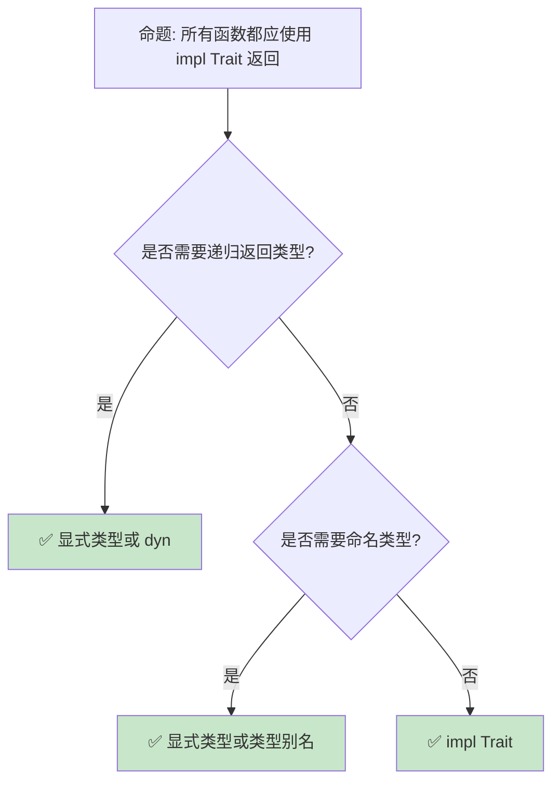

# 高级类型系统：从关联类型到类型级编程

> **Bloom 层级**: 分析 → 评价
> **定位**: 深入分析 Rust **类型系统的高级特性**——从 GATs、impl Trait 到类型级计算和 const generics，揭示 Rust 如何在保持编译期安全的同时提供强大的抽象能力。
> **前置概念**: [Type System](../01_foundation/04_type_system.md) · [Generics](./02_generics.md) · [Traits](./01_traits.md)
> **后置概念**: [RustBelt](../04_formal/04_rustbelt.md) · [Category Theory](../04_formal/10_category_theory.md)

---

> **来源**: [Rust Reference — Types](https://doc.rust-lang.org/reference/types.html) · [TRPL — Advanced Traits](https://doc.rust-lang.org/book/ch19-02-advanced-traits.html) · [RFC 2000 — Const Generics](https://rust-lang.github.io/rfcs/2000-const-generics.html) · [Rust Type System Explained](https://doc.rust-lang.org/reference/type-system.html) · [Wikipedia — Type System](https://en.wikipedia.org/wiki/Type_system)

## 📑 目录
> [来源: [TRPL](https://doc.rust-lang.org/book/)]

- [高级类型系统：从关联类型到类型级编程](#高级类型系统从关联类型到类型级编程)
  - [📑 目录](#-目录)
  - [一、核心概念](#一核心概念)
    - [1.1 impl Trait 的演进](#11-impl-trait-的演进)
    - [1.2 Const Generics](#12-const-generics)
    - [1.3 类型推断与约束求解](#13-类型推断与约束求解)
  - [二、技术细节](#二技术细节)
    - [2.1 impl Trait 在参数位置](#21-impl-trait-在参数位置)
    - [2.2 Const Generics 实战](#22-const-generics-实战)
    - [2.3 类型别名与类型族](#23-类型别名与类型族)
  - [三、类型系统模式矩阵](#三类型系统模式矩阵)
  - [四、反命题与边界分析](#四反命题与边界分析)
    - [4.1 反命题树](#41-反命题树)
    - [4.2 边界极限](#42-边界极限)
  - [五、常见陷阱](#五常见陷阱)
  - [六、来源与延伸阅读](#六来源与延伸阅读)
  - [相关概念文件](#相关概念文件)

---

## 一、核心概念
> [来源: [Rust Reference](https://doc.rust-lang.org/reference/)]

### 1.1 impl Trait 的演进

```rust,ignore
// impl Trait: 隐藏具体类型，暴露行为

// 1. 函数返回位置 (Rust 1.26+)
fn make_iter() -> impl Iterator<Item = i32> {
    vec![1, 2, 3].into_iter()
}

// 2. 函数参数位置 (Rust 1.75+)
fn process(iter: impl Iterator<Item = i32>) -> i32 {
    iter.sum()
}

// 参数位置 impl Trait 等价于泛型:
// fn process<T: Iterator<Item = i32>>(iter: T) -> i32

// 3. 在 Trait 方法中 (Rust 1.75+)
trait Factory {
    fn create() -> impl Product;
}

// 4. 与 dyn Trait 的对比:
// ├── impl Trait: 静态分发，零开销，类型隐藏
// ├── dyn Trait: 动态分发，有开销，运行时多态
// └── 选择: 性能优先 impl，灵活性优先 dyn

// 5. 在类型别名中
type IntIterator = impl Iterator<Item = i32>;
// 不稳定: type_alias_impl_trait

// 6. 关联类型位置（TAP: Type Alias Impl Trait）
trait Foo {
    type Bar: Iterator<Item = i32>;
}
```

> **impl Trait 洞察**: **impl Trait 是 Rust "零成本抽象"的关键**——它隐藏实现细节而不引入运行时开销。
> [来源: [RFC 1522 — Conservative impl Trait](https://rust-lang.github.io/rfcs/1522-conservative-impl-trait.html)]

---

### 1.2 Const Generics

```rust,ignore
// Const Generics: 泛型参数可以是常量值

// 固定大小的数组包装器
struct Array<T, const N: usize> {
    data: [T; N],
}

impl<T, const N: usize> Array<T, N> {
    fn len(&self) -> usize { N }
}

// 使用:
let a: Array<i32, 5> = Array { data: [0; 5] };
let b: Array<f64, 10> = Array { data: [0.0; 10] };

// const generics 表达式:
fn double_size<T, const N: usize>(arr: [T; N]) -> [T; N * 2] {
    // 不稳定: generic_const_exprs
    todo!()
}

// 与 const fn 结合:
const fn compute_size(n: usize) -> usize {
    n * 2 + 1
}

struct ComputedArray<T, const N: usize> {
    data: [T; compute_size(N)],
}

// 实际应用: 矩阵类型
struct Matrix<T, const ROWS: usize, const COLS: usize> {
    data: [[T; COLS]; ROWS],
}

impl<T, const R: usize, const C: usize> Matrix<T, R, C> {
    fn shape(&self) -> (usize, usize) { (R, C) }

    fn transpose(&self) -> Matrix<T, C, R>
    where T: Copy {
        // ...
        todo!()
    }
}
```

> **Const Generics 洞察**: **Const generics 使数组大小成为类型系统的一部分**——编译期验证矩阵维度匹配。
> [来源: [RFC 2000 — Const Generics](https://rust-lang.github.io/rfcs/2000-const-generics.html)]

---

### 1.3 类型推断与约束求解

```text
Rust 的类型推断机制:

  Hindley-Milner 风格:
  ├── 基于表达式的结构推断类型
  ├── 泛型函数调用时实例化
  ├── 局部变量类型可省略
  └── 但函数签名通常需显式标注

  约束求解:
  ├── 编译器收集类型约束
  ├── Trait bound 满足性检查
  ├── 生命周期包含关系
  └── 求解最优类型

  推断限制:
  ├── 函数参数需类型标注（除非 impl Trait）
  ├── 关联类型需显式指定
  ├── 复杂嵌套可能失败
  └── 通常 turbofish 语法帮助: parse::<i32>()

  示例:
  let v = vec![1, 2, 3];  // Vec<i32>
  let iter = v.iter();     // std::slice::Iter<i32>
  let sum: i32 = iter.sum(); // 类型从 sum 的目标类型推断
```

> **推断洞察**: Rust 的**类型推断是"辅助"而非"全自动"**——它减少噪声，但关键边界保持显式。
> [来源: [Rust Reference — Type Inference](https://doc.rust-lang.org/reference/type-inference.html)]

---

## 二、技术细节
> [来源: [TRPL](https://doc.rust-lang.org/book/)]

### 2.1 impl Trait 在参数位置

```rust,ignore
// impl Trait 参数 vs 泛型参数的对比

// impl Trait 参数（简洁）
fn process(items: impl Iterator<Item = i32>) -> i32 {
    items.sum()
}

// 等价泛型参数（灵活）
fn process_generic<T: Iterator<Item = i32>>(items: T) -> i32 {
    items.sum()
}

// 多个 impl Trait 参数（每个独立类型）
fn combine(a: impl Iterator, b: impl Iterator) {
    // a 和 b 可以是不同具体类型
}

// 等价泛型:
// fn combine<A: Iterator, B: Iterator>(a: A, b: B)

// 在 Trait 中:
trait Parser {
    fn parse(input: &str) -> impl Sized;
}

// 与关联类型的关系:
// impl Trait 在返回位置 ≈ 匿名关联类型
// 但更简单，无需显式 type 声明

// 限制:
// ├── 不能嵌套 impl Trait（impl Iterator<Item = impl Display>）
// ├── 不能用于 struct 字段
// └── 不能用于 trait bound 组合
```

> **参数洞察**: **impl Trait 参数是泛型的语法糖**——它更简洁，但牺牲了显式命名类型参数的能力。
> [来源: [Rust Reference — impl Trait](https://doc.rust-lang.org/reference/types/impl-trait.html)]

---

### 2.2 Const Generics 实战

```rust,ignore
// Const Generics 实战示例

// 1. 编译期大小检查的矩阵乘法
struct Matrix<T, const R: usize, const C: usize> {
    data: [[T; C]; R],
}

impl<T, const R: usize, const C: usize> Matrix<T, R, C> {
    fn multiply<const C2: usize>(
        &self,
        other: &Matrix<T, C, C2>,
    ) -> Matrix<T, R, C2>
    where T: Copy + Default + std::ops::Add<Output = T> + std::ops::Mul<Output = T> {
        let mut result = Matrix { data: [[T::default(); C2]; R] };
        for i in 0..R {
            for j in 0..C2 {
                for k in 0..C {
                    result.data[i][j] = result.data[i][j] + self.data[i][k] * other.data[k][j];
                }
            }
        }
        result
    }
}

// 编译期验证维度:
// let a: Matrix<f64, 2, 3> = ...;
// let b: Matrix<f64, 3, 4> = ...;
// let c = a.multiply(&b);  // Matrix<f64, 2, 4>
// let d = a.multiply(&a);  // 编译错误！2 != 3

// 2. 固定容量栈
struct Stack<T, const CAPACITY: usize> {
    data: [Option<T>; CAPACITY],
    top: usize,
}

impl<T: Copy, const N: usize> Stack<T, N> {
    fn new() -> Self {
        Stack { data: [None; N], top: 0 }
    }

    fn push(&mut self, value: T) -> Result<(), &'static str> {
        if self.top >= N {
            return Err("stack full");
        }
        self.data[self.top] = Some(value);
        self.top += 1;
        Ok(())
    }
}
```

> **实战洞察**: **Const generics 将运行时的维度检查提升为编译期类型检查**——矩阵乘法维度不匹配成为编译错误。
> [来源: [Const Generics MVP](https://rust-lang.github.io/rfcs/2000-const-generics.html)]

---

### 2.3 类型别名与类型族

```rust,ignore
// 类型别名: 简化复杂类型
type IntResult<T> = Result<T, std::num::ParseIntError>;
type StringMap<T> = std::collections::HashMap<String, T>;

// 使用:
fn parse_number(s: &str) -> IntResult<i32> {
    s.parse()
}

// 类型族 (Type Families): 通过关联类型实现
trait Container {
    type Item;
    type Iter: Iterator<Item = Self::Item>;

    fn iter(&self) -> Self::Iter;
}

impl<T> Container for Vec<T> {
    type Item = T;
    type Iter = std::slice::Iter<'static, T>;

    fn iter(&self) -> Self::Iter {
        // ...
        todo!()
    }
}

// 类型级计算（有限）:
// Rust 的类型系统不是图灵完备的
// 但可以通过 trait 实现有限计算

trait AddOne {
    type Result;
}

impl AddOne for std::marker::U0 { type Result = std::marker::U1; }
// ... 编译期类型级加法（typenum crate）
```

> **别名洞察**: **类型别名和类型族是管理复杂性的工具**——它们使代码更可读，同时保持类型安全。
> [来源: [Rust Reference — Type Aliases](https://doc.rust-lang.org/reference/items/type-aliases.html)]

---

## 三、类型系统模式矩阵
> [来源: [Rust Reference](https://doc.rust-lang.org/reference/)]

```text
场景 → 特性 → 代码模式

隐藏实现细节:
  → impl Trait
  → fn foo() -> impl Iterator<Item = i32>
  → 静态分发 + 类型隐藏

编译期大小检查:
  → const generics
  → struct Matrix<T, const R: usize, const C: usize>
  → 维度在类型中

类型级配置:
  → 关联类型
  → trait Service { type Config; }
  → 每个实现者定义配置类型

简化复杂签名:
  → 类型别名
  → type Result<T> = std::result::Result<T, MyError>
  → 减少重复

有限类型级计算:
  → typenum / generic-array
  → Add<B>: Output = Sum
  → 编译期算术
```

> **模式矩阵**: Rust 的类型系统**在表达力和复杂性之间取得平衡**——不像 Haskell 那样完全类型级编程，但足够处理大多数工程需求。
> [来源: [typenum crate](https://docs.rs/typenum/latest/typenum/)]

---

## 四、反命题与边界分析
> [来源: [Rust Reference](https://doc.rust-lang.org/reference/)]

### 4.1 反命题树



> **认知功能**: **impl Trait 是默认选择，但递归和需要命名类型的场景需要显式类型**。
> [来源: [Rust API Guidelines — impl Trait](https://rust-lang.github.io/api-guidelines/future-proofing.html)]

---

### 4.2 边界极限

```text
边界 1: 递归类型限制
├── impl Trait 不能用于递归函数返回
├── 编译器无法确定具体大小
├── 需要 Box<dyn Trait> 或显式命名类型
└── 缓解: 使用 indirection

边界 2: const generics 表达式
├── 复杂表达式不稳定
├── 泛型常量表达式（generic_const_exprs）
├── 限制了类型级计算能力
└── 缓解: 使用 typenum 等库

边界 3: 类型推断失败
├── 复杂嵌套泛型可能无法推断
├── 需要显式类型标注或 turbofish
├── 错误信息难以理解
└── 缓解: 分解复杂表达式

边界 4: 编译时间
├── 大量泛型实例化增加编译时间
├── 单态化生成重复代码
├── 二进制膨胀
└── 缓解: 使用 dyn Trait 在某些路径

边界 5: 与 FFI 的冲突
├── 泛型类型没有 C 兼容表示
├── impl Trait 不能跨越 FFI 边界
├── 需要手动单态化
└── 缓解: C API 使用具体类型
```

> **边界要点**: 高级类型系统的边界主要与**递归限制**、**常量表达式**、**推断失败**、**编译时间**和**FFI**相关。
> [来源: [Rust Compiler — Monomorphization](https://rustc-dev-guide.rust-lang.org/backend/monomorph.html)]

---

## 五、常见陷阱
> [来源: [TRPL](https://doc.rust-lang.org/book/)]

```text
陷阱 1: impl Trait 参数与返回混淆
  ❌ fn foo(x: impl Into<i32>) -> impl Into<i32> { x }
     // 参数和返回可以是不同类型！

  ✅ 理解 impl Trait 参数和返回是独立实例化
     // fn foo<T: Into<i32>, U: Into<i32>>(x: T) -> U

陷阱 2: const generics 默认值
  ❌ struct Array<T, const N: usize = 10> { ... }
     // 不稳定，默认参数有限制

  ✅ 使用类型别名提供默认值
     // type DefaultArray<T> = Array<T, 10>;

陷阱 3: 过度复杂的类型签名
  ❌ fn foo<T, U, V, W, X>(...) where T: A + B, U: C + D, ...
     // 难以阅读

  ✅ 使用 Trait 别名
     // trait MyBound = A + B + C;
     // fn foo<T: MyBound>(...)

陷阱 4: 忘记 turbofish
  ❌ let x = vec.into_iter().collect();
     // 编译错误：无法推断目标类型

  ✅ let x = vec.into_iter().collect::<Vec<_>>();
     // 或 let x: Vec<_> = vec.into_iter().collect();

陷阱 5: 类型别名不是新类型
  ❌ type UserId = u64;
     type OrderId = u64;
     // UserId 和 OrderId 是完全相同的类型！

  ✅ 使用 Newtype 模式
     // struct UserId(u64);
     // struct OrderId(u64);
```

> **陷阱总结**: 高级类型系统的陷阱主要与**impl Trait 语义**、**const generics 限制**、**签名复杂度**、**推断**和**类型别名**相关。
> [来源: [Rust Reference — Types](https://doc.rust-lang.org/reference/types.html)]

---

## 六、来源与延伸阅读

| 来源 | 可信度 | 说明 |
|:---|:---:|:---|
| [Rust Reference — Types](https://doc.rust-lang.org/reference/types.html) | ✅ 一级 | 类型参考 |
| [RFC 2000 — Const Generics](https://rust-lang.github.io/rfcs/2000-const-generics.html) | ✅ 一级 | 常量泛型 |
| [RFC 1522 — impl Trait](https://rust-lang.github.io/rfcs/1522-conservative-impl-trait.html) | ✅ 一级 | impl Trait |
| [Rust Type Inference](https://doc.rust-lang.org/reference/type-inference.html) | ✅ 一级 | 类型推断 |
| [typenum crate](https://docs.rs/typenum/latest/typenum/) | ✅ 一级 | 类型级数字 |

---

## 相关概念文件
> [来源: [Rust Reference](https://doc.rust-lang.org/reference/)]

- [Type System](../01_foundation/04_type_system.md) — 类型系统基础
- [Generics](./02_generics.md) — 泛型系统
- [Traits](./01_traits.md) — Trait 系统
- [RustBelt](../04_formal/04_rustbelt.md) — 形式化验证

---

> **权威来源**: [Rust Reference](https://doc.rust-lang.org/reference/), [The Rust Programming Language](https://doc.rust-lang.org/book/)
>
> **权威来源对齐变更日志**: 2026-05-22 创建 [来源: Authority Source Sprint Batch 10]

**文档版本**: 1.0
**对应 Rust 版本**: 1.96.0+ (Edition 2024)
**最后更新**: 2026-05-22
**状态**: ✅ 概念文件创建完成
