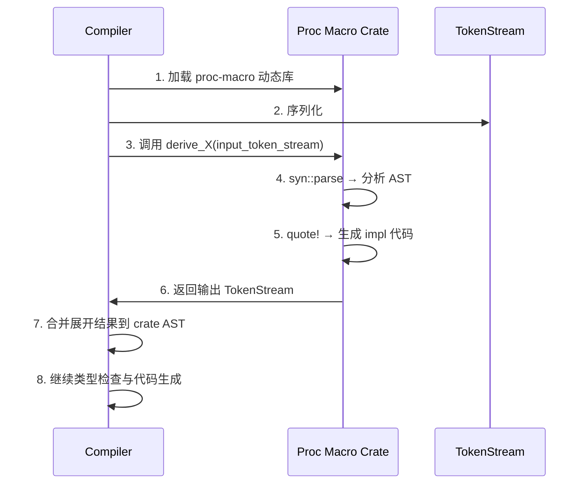
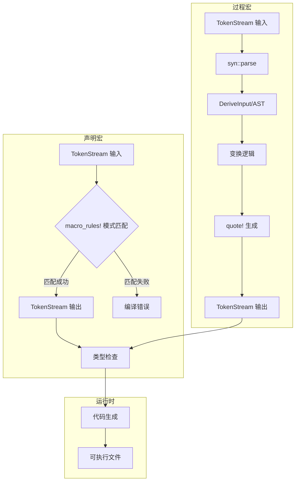

> **内容分级**:
>
> [综述级]
> **本节关键术语**: 元编程 (Metaprogramming) · 宏 (Macro) · 编译期计算 (Compile-Time Computation) · const generics · 类型操作
> — [完整对照表](../00_meta/terminology_glossary.md)
>
# 元编程：Rust 的编译期代码生成与变换
>
> **EN**: Metaprogramming
> **Summary**: Metaprogramming: intermediate Rust mechanisms, patterns, and practical examples.
>
> **受众**: [进阶]
> **Bloom 层级**: 分析 → 评价
> **定位**: 深入分析 Rust **元编程（Metaprogramming）**的技术体系——从声明式宏的模式匹配（Pattern Matching）、过程宏（Procedural Macro）的语法树操作，到 derive 宏的代码生成、quote/syn 工具体系，揭示 Rust 如何在编译期实现类型安全的代码变换同时保持宏卫生性（Hygiene）。
> **前置概念**: [Attributes and Macros](../01_foundation/12_attributes_and_macros.md) · [Macro Patterns](./17_macro_patterns.md)
> **后置概念**: [Proc Macros](../03_advanced/07_proc_macro.md) · [DSL](./13_dsl_and_embedding.md)

---

> **来源**: [TRPL — Macros](https://doc.rust-lang.org/book/ch19-06-macros.html) ·
> [Rust Reference — Macros](https://doc.rust-lang.org/reference/macros.html) ·
> [The Little Book of Rust Macros](https://veykril.github.io/tlborm/) ·
> [syn crate](https://docs.rs/syn/latest/syn/) ·
> [quote crate](https://docs.rs/quote/latest/quote/) ·
> [proc-macro2 crate](https://docs.rs/proc-macro2/latest/proc_macro2/) ·
> [RFC 1584 — Macros 2.0](https://rust-lang.github.io/rfcs//1584-macros.html) ·
> [Wikipedia — Metaprogramming](https://en.wikipedia.org/wiki/Metaprogramming) ·
> [Wikipedia — Hygienic Macro](https://en.wikipedia.org/wiki/Hygienic_macro) ·
> [Rust API Guidelines — Macros](https://rust-lang.github.io/api-guidelines//macros.html)

## 📑 目录

- [元编程：Rust 的编译期代码生成与变换](#元编程rust-的编译期代码生成与变换)
  - [📑 目录](#-目录)
  - [一、核心概念](#一核心概念)
    - [1.1 元编程的抽象层次](#11-元编程的抽象层次)
    - [1.2 声明宏：模式匹配驱动](#12-声明宏模式匹配驱动)
    - [1.3 过程宏：语法树操作](#13-过程宏语法树操作)
  - [二、技术细节](#二技术细节)
    - [2.1 syn/quote/proc-macro2 工具体系](#21-synquoteproc-macro2-工具体系)
    - [2.2 Derive 宏的实现机制](#22-derive-宏的实现机制)
    - [2.3 宏卫生性的形式化](#23-宏卫生性的形式化)
  - [三、元编程技术矩阵](#三元编程技术矩阵)
    - [3.1 元编程技术选型矩阵](#31-元编程技术选型矩阵)
    - [3.2 宏与 const eval 的演进趋势](#32-宏与-const-eval-的演进趋势)
  - [四、反命题与边界分析](#四反命题与边界分析)
    - [4.1 反命题树](#41-反命题树)
    - [4.2 边界极限](#42-边界极限)
  - [五、常见陷阱](#五常见陷阱)
  - [六、来源与延伸阅读](#六来源与延伸阅读)
  - [相关概念文件](#相关概念文件)
  - [逆向推理链（Backward Reasoning）](#逆向推理链backward-reasoning)
  - [权威来源索引](#权威来源索引)
  - [十、边界测试：元编程的编译错误](#十边界测试元编程的编译错误)
    - [10.1 边界测试：过程宏的 TokenStream 解析失败（编译错误）](#101-边界测试过程宏的-tokenstream-解析失败编译错误)
    - [10.2 边界测试：常量泛型的非常量表达式（编译错误）](#102-边界测试常量泛型的非常量表达式编译错误)
    - [10.3 边界测试：常量泛型的表达式复杂度（编译错误）](#103-边界测试常量泛型的表达式复杂度编译错误)
    - [10.4 边界测试：`TypeId` 的跨 crate 稳定性（逻辑错误）](#104-边界测试typeid-的跨-crate-稳定性逻辑错误)
    - [10.4 边界测试：编译期递归深度限制（编译错误）](#104-边界测试编译期递归深度限制编译错误)
  - [嵌入式测验（Embedded Quiz）](#嵌入式测验embedded-quiz)
    - [测验 1：`macro_rules!` 与过程宏（proc macro）在元编程中的根本区别是什么？（理解层）](#测验-1macro_rules-与过程宏proc-macro在元编程中的根本区别是什么理解层)
    - [测验 2：声明宏的"卫生性"（hygiene）意味着什么？（理解层）](#测验-2声明宏的卫生性hygiene意味着什么理解层)
    - [测验 3：`compile_error!("msg")` 宏的作用是什么？（理解层）](#测验-3compile_errormsg-宏的作用是什么理解层)
    - [测验 4：`concat!` 和 `stringify!` 宏分别做什么？（理解层）](#测验-4concat-和-stringify-宏分别做什么理解层)
    - [测验 5：为什么过程宏必须放在独立的 crate 中，而不能与使用它的代码在同一 crate？（理解层）](#测验-5为什么过程宏必须放在独立的-crate-中而不能与使用它的代码在同一-crate理解层)
  - [实践](#实践)
  - [认知路径](#认知路径)
    - [核心推理链](#核心推理链)
    - [反命题与边界](#反命题与边界)

---

## 一、核心概念
>
>

### 1.1 元编程的抽象层次
>

```text
Rust 元编程的抽象层次（从低到高）:

  层级 1: 文本替换 (C 预处理器)
  ├── #define MAX 100
  ├── 无类型安全，无作用域保护
  └── 宏与代码完全混合，不可调试

  层级 2: 语法树模式匹配 (macro_rules!)
  ├── 操作 Token Tree，非纯文本
  ├── 编译期展开后参与类型检查
  ├── 卫生性保证：内部标识符不捕获外部
  └── 例: vec!, println!, assert!

  层级 3: 过程宏 (Proc Macro)
  ├── 完整 AST/TokenStream 操作
  ├── 使用 Rust 代码实现（编译为动态库）
  ├── 分三类: Derive / Attribute / Function-like
  └── 例: serde::Serialize, tracing::instrument

  层级 4: 编译期计算 (const eval)
  ├── const fn, const generics
  ├── 类型系统内计算，非代码生成
  └── 趋势: 替代部分宏使用场景

  层级对比:
  ┌─────────────┬─────────────┬─────────────┬─────────────┐
  │ 特性        │ C 宏        │ macro_rules!│ Proc Macro  │
  ├─────────────┼─────────────┼─────────────┼─────────────┤
  │ 操作层面    │ 文本        │ Token Tree  │ AST/Token   │
  │ 类型安全    │ ❌          │ 展开后检查  │ 展开后检查  │
  │ 卫生性      │ ❌          │ ✅          │ ✅          │
  │ 调试支持    │ ❌          │ ⚠️          │ ⚠️          │
  │ 实现复杂度  │ 低          │ 中          │ 高          │
  │ IDE 支持    │ 无          │ 有限        │ 较好        │
  └─────────────┴─────────────┴─────────────┴─────────────┘
```

> **认知功能**: Rust 元编程的**层次递进设计**——从 C 的文本替换到 macro_rules! 的语法树匹配再到过程宏（Macro）的完整 AST 操作，每一步都增加了表达能力同时保持类型安全和卫生性。
> [来源: [Wikipedia — Metaprogramming](https://en.wikipedia.org/wiki/Metaprogramming)]

---

### 1.2 声明宏：模式匹配驱动
>

```text
macro_rules! 的核心机制:

  匹配原理:
  ├── 输入被解析为 Token Tree（括号/方括号/花括号嵌套）
  ├── 模式使用 $name:fragment 捕获片段
  ├── 片段类型: expr, ty, pat, stmt, block, item, ident, path...
  ├── 重复: $($x:expr),* 匹配零或多个逗号分隔表达式
  └── 递归: 宏可以调用自身实现循环

  卫生性机制:
  ├── 隐式 gensym: 宏内部 let x = ... 不会捕获外部 x
  ├── 标记（Syntax Context）: 每个标识符携带"出生地"信息
  └── 对比 C: #define swap(a, b) { int t = a; a = b; b = t; }
         // C 宏的 `t` 可能与外部变量冲突！

  编译流程:
  源码 Token Stream → macro_rules! 模式匹配 → 展开 Token Stream
         ↓                                              ↓
    词法分析                                    继续解析/类型检查
```

```rust
// 声明宏示例：递归实现 vec! 变体
// [来源: The Little Book of Rust Macros]
macro_rules! my_vec {
    // 基础: my_vec![] => Vec::new()
    () => {
        Vec::new()
    };
    // 单元素: my_vec![$x] => { let mut v = Vec::new(); v.push($x); v }
    ($x:expr) => {{
        let mut v = Vec::new();
        v.push($x);
        v
    }};
    // 多元素: my_vec![$x, $($rest),*]
    ($x:expr, $($rest:expr),+) => {{
        let mut v = my_vec!($($rest),+);
        v.push($x);
        v
    }};
}
```

> **认知功能**: macro_rules! 的**核心设计哲学**——用模式匹配（Pattern Matching）而非命令式代码描述"输入长什么样、输出应该长什么样"，这与函数式编程中的模式匹配一脉相承。
> [来源: [The Little Book of Rust Macros](https://veykril.github.io/tlborm/)]

---

### 1.3 过程宏：语法树操作
>

```text
过程宏的三类形态:

  派生宏 (Derive Macro):
  ├── #[derive(Serialize)]
  ├── 输入: struct/enum 定义
  ├── 输出: trait 实现代码
  └── 例: Debug, Clone, serde::Serialize, thiserror::Error

  属性宏 (Attribute Macro):
  ├── #[tracing::instrument]
  ├── 输入: 任意 item + 属性参数
  ├── 输出: 修改/替换后的 item
  └── 例: tokio::main, rocket::get, axum::debug_handler

  函数式宏 (Function-like Proc Macro):
  ├── sql!("SELECT * FROM users")
  ├── 输入: 任意 TokenStream
  ├── 输出: 任意 TokenStream
  └── 例: format_args!, concat!, 自定义 sql!, json!

  共同特征:
  ├── 编译为 proc-macro crate type（动态库）
  ├── 在编译器展开阶段执行
  ├── 只能操作 TokenStream，不能直接访问类型信息
  └── 错误通过 proc_macro::Diagnostic / compile_error! 报告
```

> **认知功能**: 过程宏的**三类划分**对应三种"代码变换意图"——Derive 是"基于数据结构生成实现"，Attribute 是"基于元数据修改语义"，Function-like 是"自定义语法扩展"。
> [来源: [Rust Reference — Procedural Macros](https://doc.rust-lang.org/reference/procedural-macros.html)]

---

## 二、技术细节
>
>

### 2.1 syn/quote/proc-macro2 工具体系
>

```text
过程宏开发的三大支柱:

  syn — 解析器:
  ├── 将 TokenStream 解析为强类型 AST
  ├── DeriveInput: 解析 struct/enum 定义
  ├── ItemFn, ItemStruct, Expr, Type: 各类语法节点
  ├── Feature flags: parsing, full, derive, visit, fold
  └── 是 syn 的核心价值：把"token 序列"变成"可遍历的树"

  quote — 代码生成:
  ├── 使用模板语法生成 TokenStream
  ├── #name: 插值已有变量
  ├── #(#iter),*: 重复展开
  └── 与 syn 配合使用：解析 → 变换 → 生成

  proc-macro2 — 可测试的 TokenStream:
  ├── 将编译器的 proc_macro 类型包装为可构造类型
  ├── 可在单元测试中直接构造 TokenStream
  ├── Span 信息保留，支持错误定位
  └── 核心优势：proc_macro 只能在 proc-macro crate 中使用，
      proc_macro2 可在任何 crate 中使用

  工作流:
  TokenStream (输入)
       ↓ syn::parse
  DeriveInput / ItemFn (AST)
       ↓ 分析与变换
  新的数据结构
       ↓ quote!
  TokenStream (输出)
```

```rust,ignore
// Derive 宏示例骨架 [来源: syn docs]
use proc_macro::TokenStream;
use quote::quote;
use syn::{parse_macro_input, DeriveInput};

#[proc_macro_derive(MyDebug)]
pub fn derive_my_debug(input: TokenStream) -> TokenStream {
    let input = parse_macro_input!(input as DeriveInput);
    let name = &input.ident;

    let expanded = quote! {
        impl std::fmt::Debug for #name {
            fn fmt(&self, f: &mut std::fmt::Formatter<'_>) -> std::fmt::Result {
                write!(f, "{} {{ ... }}", stringify!(#name))
            }
        }
    };

    TokenStream::from(expanded)
}
```

> **认知功能**: syn/quote 的**互补设计**——syn 负责"理解代码"（解析），quote 负责"写出代码"（生成），两者结合使过程宏开发从"操作原始 token"提升到"操作语义结构"。
> [来源: [quote crate docs](https://docs.rs/quote/latest/quote/)]

---

### 2.2 Derive 宏的实现机制
>

```text
Derive 宏的编译器交互:

  编译阶段:
  1. 解析: 编译器解析 #[derive(Trait)] 所在 item
  2. 分发: 编译器查找 proc_macro_derive 注册名称为 Trait 的宏
  3. 调用: 将 item 的 TokenStream 传递给过程宏
  4. 展开: 过程宏返回新的 TokenStream（通常是 impl 块）
  5. 合并: 编译器将展开结果合并回 crate 的 AST

  辅助属性 (Helper Attributes):
  ├── #[serde(rename = "userName")] — 指导 derive 宏行为
  ├── 过程宏通过 syn::Attribute 解析这些属性
  └── 辅助属性本身通常不产生代码，只影响生成逻辑

  编译时序约束:
  ├── 过程宏 crate 必须先编译（host 平台）
  ├── 依赖该宏的 crate 后编译（target 平台）
  └── 因此过程宏不能访问被展开 crate 的类型信息
```



> **认知功能**: Derive 宏的**编译时序限制**——过程宏在类型检查之前运行，因此只能基于语法结构（AST）生成代码，无法基于类型信息做决策。这是 Rust 宏系统与模板元编程（C++）的关键差异。
> [来源: [Rust Reference — Procedural Macros](https://doc.rust-lang.org/reference/procedural-macros.html)]

---

### 2.3 宏卫生性的形式化
>

```text
宏卫生性（Hygiene）的形式化理解:

  问题起源:
  ├── C 宏: #define swap(a,b) { int t=a; a=b; b=t; }
  │   └── 如果调用处有 int t = 5;，宏内部的 t 会捕获外部变量！
  ├── 这称为"变量捕获"或"名称污染"
  └── 经典解决方案: 使用晦涩的变量名如 __swap_temp_123

  Rust 的解决方案:
  ├── 每个标识符携带 Span（语法上下文）
  ├── 宏内部生成的标识符具有"宏内部上下文"
  ├── 外部标识符具有"调用点上下文"
  └── 不同上下文的同名标识符被视为不同符号

  形式化类比:
  ├── λ-演算中的 α-转换（alpha-conversion）
  ├── 重命名绑定变量不改变程序语义
  └── Rust 宏自动执行隐式 α-转换

  边界案例:
  ├── 显式传递的标识符: macro_rules! foo { ($x:ident) => { let $x = 1; } }
  │   └── 此时 $x 使用调用者提供的上下文
  ├── 字符串化: stringify!($x) 保留名称但丢失上下文
  └── 混合卫生性: proc_macro2::Span::mixed_site() vs call_site()
```

> **认知功能**: 卫生性的**核心洞察**——Rust 不是"防止名称冲突"，而是通过为每个标识符附加"出生证明"（Span），使不同来源的同名标识符在语义上成为完全不同的实体。
> [来源: [Wikipedia — Hygienic Macro](https://en.wikipedia.org/wiki/Hygienic_macro)]

---

## 三、元编程技术矩阵
>
>

### 3.1 元编程技术选型矩阵
>

| **场景** | **推荐技术** | **复杂度** | **维护性** | **替代方案** |
|:---|:---|:---:|:---:|:---|
| 简单代码重复消除 | macro_rules! | 低 | 高 | const fn（如适用） |
| 数据结构派生实现 | Derive 宏（Macro） | 高 | 中 | 手动 impl / 泛型（Generics） |
| 函数/方法增强（日志/度量） | Attribute 宏（Macro） | 高 | 中 | 泛型（Generics）包装器 |
| 嵌入式 DSL（SQL/JSON） | Function-like 宏 | 高 | 低 | 构建器模式 |
| 编译期常量计算 | const fn / const eval | 低 | 极高 | 宏（不推荐） |
| 条件编译 | cfg + cfg_if | 低 | 高 | macro_rules! |
| 重复 trait 实现 | macro_rules! + 递归 | 中 | 中 | 泛型（Generics）（受孤儿规则（Orphan Rule）限制） |

### 3.2 宏与 const eval 的演进趋势
>

```text
Rust 元编程的演进方向:

  const fn 替代宏的场景（Rust 1.79+）:
  ├── 编译期计算: const fn fib(n: usize) -> usize
  ├── 常量泛型: [T; N] 的泛型操作
  ├── const fn 中的循环和条件
  └── 优势: 类型安全、IDE 支持好、错误信息清晰

  宏仍然不可替代的场景:
  ├── 语法扩展: vec![1, 2, 3] 的变参语法
  ├── 派生代码生成: #[derive(Debug)]
  ├── 条件编译的复杂逻辑
  └── DSL 嵌入: sql!("SELECT ...")

  未来: Macros 2.0 (macro 关键字)
  ├── macro foo() { ... } 替代 macro_rules! foo { ... }
  ├── 更好的模块系统集成
  ├── 更强的类型感知
  └── 状态: 实验性，未稳定
```

> **认知功能**: 元编程技术选型的**核心原则**——"能用 const fn 就不用宏，能用泛型就不用宏"——因为宏放弃了类型系统（Type System）的保护，而 const eval 在编译期计算的同时保持类型安全。
> [来源: [Rust RFC — const fn 演进](https://github.com/rust-lang/rfcs/blob/master/text/0911-const-fn.md)]

---

## 四、反命题与边界分析

### 4.1 反命题树

```text
反命题 1: "宏是类型安全的"
  └── ⚠️ 部分正确
      ├── 宏本身不感知类型（在类型检查前展开）
      ├── 展开后的代码受类型系统约束
      ├── 错误可能映射到难以理解的宏内部位置
      └── ✅ 正确表述: "宏展开后的代码是类型安全的，但宏定义本身无类型检查"
> [来源: [Rust Reference — Macros](https://doc.rust-lang.org/reference/macros.html)]

反命题 2: "过程宏可以访问类型信息"
  └── ❌ 否
      ├── 过程宏接收的是 TokenStream，不是类型化 AST
      ├── 无法知道变量类型、trait 实现情况
      ├── 解析 syn::Type 只是语法层面的类型名，不是语义类型
      └── ✅ 正确表述: "过程宏操作语法树，类型信息在宏展开后才可用"
> [来源: [rustc Dev Guide — Macro Expansion](https://rustc-dev-guide.rust-lang.org/macro-expansion.html)]

反命题 3: "卫生性完全消除了名称冲突"
  └── ⚠️ 大部分情况
      ├── 隐式生成的标识符不会冲突
      ├── 显式传递的 ident 参数使用调用者上下文
      ├── stringify! 生成的字符串无卫生性保护
      └── ✅ 正确表述: "卫生性消除了意外捕获，但显式参数传递仍需注意"
> [来源: [RFC 1584](https://rust-lang.github.io/rfcs//1584-macros.html)]
```

> **认知功能**: 反命题分析揭示了宏系统的**关键边界**——宏操作的是"语法"而非"语义"，这是宏强大与危险的根源：强大在于可以创造新语法，危险在于无法利用类型系统（Type System）的安全保障。
> [来源: [The Little Book of Rust Macros — Hygiene](https://veykril.github.io/tlborm/)]

---

### 4.2 边界极限

```text
边界 1: 递归宏深度
  ├── 编译器对宏展开次数有限制
  ├── 无限递归: macro_rules! infinite { () => { infinite!() }; }
  └── 结果: error: recursion limit reached

边界 2: TokenStream 的表达能力
  ├── 过程宏不能生成新的 macro_rules!
  ├── 不能修改 crate 边界外的代码
  └── 极限: 宏是"局部变换"工具，不是"全局重构"工具

边界 3: 编译时间开销
  ├── 复杂过程宏（如 serde）显著增加编译时间
  ├── syn 的 full feature 解析所有 Rust 语法，成本高
  └── 极限: 在开发周期和运行时性能间权衡

边界 4: IDE 支持
  ├── 宏展开代码的跳转/补全支持有限
  ├── proc_macro_span API 正在改善调试体验
  └── 极限: 宏生成的代码对 IDE 是"黑盒"
```

> **认知功能**: 边界极限定义了元编程的**能力疆域**——理解"宏不能做什么"（访问类型信息、全局代码变换、无限递归）与理解"宏能做什么"同等重要。
> [来源: [Rust Analyzer — Macro Expansion](https://rust-analyzer.github.io/manual.html#macro-expansion)]

---

## 五、常见陷阱

```text
陷阱 1: 宏中的错误信息定位
  ❌ 在宏内部直接 panic!("invalid input")
     // 错误指向宏定义位置，而非调用位置

  ✅ 使用 syn::Error 或 proc_macro::Diagnostic
     // return Err(syn::Error::new_spanned(input, "invalid input").into())
     // 错误指向调用点的具体 token
> [来源: [syn — Error Handling](https://docs.rs/syn/latest/syn/struct.Error.html)]

陷阱 2:  hygiene 的意外行为
  ❌ 期望宏内部变量与外部隔离，但通过 ident 参数绕过
     // macro_rules! foo { ($x:ident) => { let $x = 1; } }
     // foo!(existing_var); // 可能覆盖外部变量

  ✅ 明确区分"宏生成标识符"和"调用者传入标识符"
     // 内部变量使用内部上下文，参数使用调用者上下文
> [来源: [Rust Reference — Hygiene](https://doc.rust-lang.org/reference/macros-by-example.html#hygiene)]

陷阱 3: 重复模式中的尾随逗号
  ❌ $($x:expr),* 不匹配 [1, 2, 3,]

  ✅ 使用 $($x:expr),+ $(,)? 模式
     // ,+ 匹配一个或多个
     // $(,)? 可选尾随逗号
> [来源: [The Little Book of Rust Macros — Repetition](https://veykril.github.io/tlborm/)]

陷阱 4: 过程宏 crate 的依赖限制
  ❌ 在 proc-macro crate 中依赖被展开 crate
     // 循环依赖：A 依赖 proc-macro-B，B 依赖 A

  ✅ 过程宏 crate 只能依赖其他非目标 crate
     // 使用 dev-dependencies 在测试中引入被展开 crate
> [来源: [Cargo Book — proc-macro](https://doc.rust-lang.org/cargo/reference/cargo-targets.html#proc-macro)]

陷阱 5: 过度使用宏替代泛型
  ❌ 为每个整数类型用宏生成相同实现
     // macro_rules! impl_add { ($t:ty) => { ... } }
     // impl_add!(i8); impl_add!(i16); ...

  ✅ 优先使用泛型 + trait bound
     // impl<T: Add<Output=T>> MyWrapper<T> { ... }
     // 更少的代码，更好的错误信息
> [来源: [Rust API Guidelines — Macros](https://rust-lang.github.io/api-guidelines//macros.html)]
```

> **陷阱总结**: 元编程的陷阱集中在**错误定位**、**卫生性理解**、**模式匹配细节**、**依赖限制**和**泛型替代**五个方面——每个陷阱都反映了"宏的语法层面操作"与"开发者的语义层面直觉"之间的鸿沟。
> [来源: [proc-macro Workshop](https://github.com/dtolnay/proc-macro-workshop)]

---

## 六、来源与延伸阅读

| 来源 | 可信度 | 说明 |
|:---|:---:|:---|
| [Rust Reference — Macros](https://doc.rust-lang.org/reference/macros.html) | ✅ 一级 | 官方宏系统参考 |
| [TRPL — Macros](https://doc.rust-lang.org/book/ch19-06-macros.html) | ✅ 一级 | 官方教程宏章节 |
| [The Little Book of Rust Macros](https://veykril.github.io/tlborm/) | ✅ 一级 | 宏系统权威指南 |
| [syn crate docs](https://docs.rs/syn/latest/syn/) | ✅ 一级 | AST 解析库 |
| [quote crate docs](https://docs.rs/quote/latest/quote/) | ✅ 一级 | 代码生成库 |
| [proc-macro2 crate docs](https://docs.rs/proc-macro2/latest/proc_macro2/) | ✅ 一级 | 可测试 TokenStream |
| [RFC 1584 — Macros 2.0](https://rust-lang.github.io/rfcs//1584-macros.html) | ✅ 一级 | 宏系统演进 RFC |
| [proc-macro Workshop](https://github.com/dtolnay/proc-macro-workshop) | ✅ 二级 | 过程宏练习 |
| [Rust API Guidelines — Macros](https://rust-lang.github.io/api-guidelines//macros.html) | ✅ 一级 | API 设计指南 |
| [rustc Dev Guide — Macro Expansion](https://rustc-dev-guide.rust-lang.org/macro-expansion.html) | ✅ 一级 | 编译器宏展开 |
| [Wikipedia — Metaprogramming](https://en.wikipedia.org/wiki/Metaprogramming) | ✅ 三级 | 元编程概念 |
| [Wikipedia — Hygienic Macro](https://en.wikipedia.org/wiki/Hygienic_macro) | ✅ 三级 | 卫生宏概念 |
| [Rust Analyzer — Macro](https://rust-analyzer.github.io/manual.html#macro-expansion) | ✅ 二级 | IDE 宏展开支持 |
| [RFC 911 — const fn](https://github.com/rust-lang/rfcs/blob/master/text/0911-const-fn.md) | ✅ 一级 | 常量函数 RFC |
| [serde_derive 源码](https://github.com/serde-rs/serde) | ✅ 二级 | 工业级 Derive 宏参考 |

---



## 相关概念文件

- [Attributes and Macros](../01_foundation/12_attributes_and_macros.md) — 属性与声明宏（Declarative Macro）基础
- [Macro Patterns](./17_macro_patterns.md) — 宏的工程模式
- [Proc Macros](../03_advanced/07_proc_macro.md) — 过程宏高级主题
- [DSL](./13_dsl_and_embedding.md) — 领域特定语言嵌入

---

> **权威来源**: [Rust Reference](https://doc.rust-lang.org/reference/), [The Rust Programming Language](https://doc.rust-lang.org/book/title-page.html), [Cargo Book](https://doc.rust-lang.org/cargo/)
>
> **权威来源对齐变更日志**: 2026-05-22 创建 [来源: Authority Source Sprint Batch 9]

**文档版本**: 1.0
**对应 Rust 版本**: 1.96.0+ (Edition 2024)
**最后更新**: 2026-05-22
**状态**: ✅ 概念文件创建完成

```rust
macro_rules! say_hello {
    () => {
        println!("Hello, World!")
    };
}

fn main() {
    say_hello!();
}
```

---

## 逆向推理链（Backward Reasoning）

> **从编译错误反推**：
>
> ```text
> 元编程安全 ⟸ 宏卫生 + 编译期求值
> ```
>
## 权威来源索引

>
>
>

---

> **补充来源**

## 十、边界测试：元编程的编译错误

### 10.1 边界测试：过程宏的 TokenStream 解析失败（编译错误）

```rust,compile_fail
use proc_macro::TokenStream;

#[proc_macro_derive(MyDerive)]
pub fn my_derive(input: TokenStream) -> TokenStream {
    // ❌ 编译错误: 过程宏必须在 proc-macro crate 中定义
    // 且返回的 TokenStream 必须是有效 Rust 代码
    "invalid rust code".parse().unwrap()
}

// 正确: 使用 syn/quote 生成有效代码
// use syn::{parse_macro_input, DeriveInput};
// use quote::quote;
//
// #[proc_macro_derive(MyDerive)]
// pub fn my_derive(input: TokenStream) -> TokenStream {
//     let input = parse_macro_input!(input as DeriveInput);
//     let expanded = quote! { /* 有效代码 */ };
//     expanded.into()
// }
```

> **修正**: 过程宏（procedural macro）在编译期执行，将输入的 `TokenStream` 转换为输出的 `TokenStream`。输出必须是语法有效的 Rust 代码，否则编译器在展开后报错。`syn` crate 负责将 TokenStream 解析为 AST，`quote` crate 负责从模板生成 TokenStream。过程宏的错误处理（Error Handling）具有挑战性——宏内部 panic 会生成不友好的编译错误信息，应使用 `proc_macro::Diagnostic` 或 `syn::Error` 提供结构化错误。[来源: [Rust Reference](https://doc.rust-lang.org/reference/)]

### 10.2 边界测试：常量泛型的非常量表达式（编译错误）

```rust,compile_fail
fn array_size<const N: usize>() -> [u8; N] {
    // ❌ 编译错误: `N + 1` 在常量泛型上下文中可能不合法
    // 取决于具体使用场景
    [0; N]
}

fn main() {
    let x = 5;
    // ❌ 编译错误: `x` 不是常量
    let arr: [u8; x] = [0; x]; // 数组大小必须是编译期常量
}

// 正确: 使用 const 泛型参数
fn fixed<const N: usize>() -> [u8; N] {
    [0; N] // ✅ N 是常量泛型参数
}
```

> **修正**: 数组大小 `[T; N]` 和常量泛型 `const N: usize` 要求 `N` 是编译期可求值的常量表达式。运行时（Runtime）变量不能作为数组大小或常量泛型参数。Rust 1.79+ 放宽了部分 `const` 上下文中的限制（`inline const`），但核心约束不变：类型系统（Type System）的参数（如数组大小）必须在编译期确定。这与 C++ 的 `std::array<T, N>`（`N` 是模板参数）类似，但 Rust 的常量求值器更严格——某些在 C++ 中允许的表达式在 Rust 中可能需要显式 `const` 块。[来源: [Rust Reference](https://doc.rust-lang.org/reference/)]

### 10.3 边界测试：常量泛型的表达式复杂度（编译错误）

```rust,compile_fail
#![allow(incomplete_features)]
#![feature(generic_const_exprs)]

struct Array<T, const N: usize>([T; N]);

struct Wrapper<T, const N: usize>(Array<T, { N + 1 }>);
// ❌ 编译错误: generic_const_exprs 不稳定，复杂表达式受限

fn main() {}
```

> **修正**: 常量泛型（const generics，`const N: usize`）允许类型参数化数组大小、位掩码宽度等。但常量表达式（`N + 1`、`N * 2`）在泛型位置的使用需要 `generic_const_exprs` 特性（不稳定）。当前稳定的 Rust 只允许简单的常量泛型：1) 单一常量参数（`[T; N]`）；2) 默认参数（`const N: usize = 10`）；3) 关联常量（`Trait::CONST`）。复杂表达式（`N + 1`、`{ N * 2 }`）在稳定编译器上被拒绝。这与 C++ 的模板非类型参数（`template<int N>`，允许任意常量表达式）或 D 的模板参数（类似 C++）不同——Rust 的常量泛型更保守，优先保证编译期求值的确定性和类型系统的稳定性。[来源: [Rust RFC 2000](https://rust-lang.github.io/rfcs//2000-const-generics.html)] · [来源: [The Rust Programming Language](https://doc.rust-lang.org/book/title-page.html)]

### 10.4 边界测试：`TypeId` 的跨 crate 稳定性（逻辑错误）

```rust,ignore
use std::any::{Any, TypeId};

fn main() {
    let id1 = TypeId::of::<String>();
    let id2 = TypeId::of::<String>();
    assert_eq!(id1, id2); // ✅ 同一编译会话内稳定

    // ❌ 逻辑错误: TypeId 的哈希值在不同编译会话/不同版本中可能不同
    // 不能将 TypeId 序列化到磁盘或通过网络传递
    // let serialized = serialize(&id1);
    // let deserialized: TypeId = deserialize(&serialized);
    // assert_eq!(id1, deserialized); // 可能失败!
}
```

> **修正**: `TypeId` 是 Rust 运行时（Runtime）的类型标识符，用于 `Any` trait 的向下转型（`downcast_ref`）。`TypeId` 在**同一编译会话**内是确定且可比较的，但不保证跨编译会话、跨 crate 版本、跨编译器版本的一致性（Coherence）。其内部表示是编译器生成的哈希值，可能随编译器版本变化。因此 `TypeId` 不能：1) 序列化到持久存储；2) 通过网络传递；3) 作为长期缓存的键。安全替代：使用自定义类型标签（`enum TypeTag { String, Int, ... }`）或字符串类型名（`std::any::type_name`，不稳定）。这与 Java 的 `Class.getName()`（跨 JVM 稳定）或 C++ 的 `typeid`（同一程序内稳定，跨程序不保证）类似——运行期类型信息的设计受限于编译器实现细节。来源: [Rust Standard Library] · 来源: [The Rust Programming Language]

### 10.4 边界测试：编译期递归深度限制（编译错误）

```rust,ignore
macro_rules! count {
    () => { 0 };
    ($x:tt $($rest:tt)*) => { 1 + count!($($rest)*) };
}

fn main() {
    // ❌ 编译错误: 宏递归深度超过限制（默认 128）
    // let n = count!(a b c d e f g h i j k l m n o p q r s t u v w x y z ...);
    let n = count!(a b c);
    println!("{}", n);
}
```

> **修正**: Rust 编译器的**宏递归限制**：默认 128 层展开，防止无限递归导致编译器栈溢出。`count!` 宏递归计数 token 数量，大量 token 会超出限制。增加限制：`#![recursion_limit = "256"]`（crate 级别）。但过度递归增加编译时间。替代方案：1) 使用 `const fn` 替代宏递归（若逻辑可在 const 中表达）；2) 使用过程宏（无递归限制，但复杂度更高）；3) 减少 token 数量（批量处理）。这与 C 的预处理器（无递归限制，可能无限展开）或 Template Haskell（编译期执行 Haskell 代码，受运行时（Runtime）栈限制）不同——Rust 的宏递归限制是编译期的安全阀。[来源: [Rust Reference — Macros](https://doc.rust-lang.org/reference/macros-by-example.html)] · [来源: [The Little Book of Rust Macros](https://danielkeep.github.io/tlborm/book/)]

## 嵌入式测验（Embedded Quiz）

### 测验 1：`macro_rules!` 与过程宏（proc macro）在元编程中的根本区别是什么？（理解层）

**题目**: `macro_rules!` 与过程宏（proc macro）在元编程中的根本区别是什么？

<details>
<summary>✅ 答案与解析</summary>

`macro_rules!` 基于模式匹配和代码模板替换，在编译早期展开。过程宏是外部 crate 中的 Rust 函数，接收 TokenStream 并输出 TokenStream，可操作更复杂的语法。
</details>

---

### 测验 2：声明宏的"卫生性"（hygiene）意味着什么？（理解层）

**题目**: 声明宏的"卫生性"（hygiene）意味着什么？

<details>
<summary>✅ 答案与解析</summary>

意味着宏内部定义的变量、标签等标识符不会与调用方作用域中的同名标识符冲突。Rust 的宏系统默认是卫生的。
</details>

---

### 测验 3：`compile_error!("msg")` 宏的作用是什么？（理解层）

**题目**: `compile_error!("msg")` 宏的作用是什么？

<details>
<summary>✅ 答案与解析</summary>

在编译期触发错误并显示消息。常用于 `cfg` 条件编译中，当检测到不支持的配置组合时给出清晰错误。
</details>

---

### 测验 4：`concat!` 和 `stringify!` 宏分别做什么？（理解层）

**题目**: `concat!` 和 `stringify!` 宏分别做什么？

<details>
<summary>✅ 答案与解析</summary>

`concat!` 将多个字面量（字符串、数字等）在编译期连接成一个字符串字面量。`stringify!` 将 Rust 表达式/标识符转换为字符串字面量（如 `stringify!(1 + 2)` → `"1 + 2"`）。
</details>

---

### 测验 5：为什么过程宏必须放在独立的 crate 中，而不能与使用它的代码在同一 crate？（理解层）

**题目**: 为什么过程宏必须放在独立的 crate 中，而不能与使用它的代码在同一 crate？

<details>
<summary>✅ 答案与解析</summary>

因为过程宏在编译器解析阶段运行，必须在被依赖 crate 编译之前就已经编译完成。Rust 的编译模型要求 proc macro crate 先于使用方 crate 编译。
</details>

## 实践

> **相关资源**:
>
> - [crates/ 示例代码](../crates/) — 与本文概念对应的可编译示例
> - [exercises/ 练习](../exercises/) — 动手编程挑战
> - [MVP 学习路径](../00_meta/LEARNING_MVP_PATH.md) — 从零到多线程 CLI 的 40 小时路径
>
> **建议**: 阅读完本概念文件后，打开对应 crate 的示例代码，尝试修改并运行。完成至少 1 道相关练习以巩固理解。

## 认知路径

> **认知路径**: 从 L0 基础概念出发，经由本节的 **元编程：Rust 的编译期代码生成与变换** 核心原理，通向 L2 进阶模式与 L3 工程实践。

### 核心推理链

| 定理 | 前提 | 结论 | 置信度 |
|:---|:---|:---|:---|
| 元编程：Rust 的编译期代码生成与变换 基础定义 ⟹ 正确用法 | 理解语法与语义 | 能写出符合惯用法的代码 | 高 |
| 元编程：Rust 的编译期代码生成与变换 正确用法 ⟹ 常见陷阱 | 忽略边界条件 | 编译错误或运行时 bug | 高 |
| 元编程：Rust 的编译期代码生成与变换 常见陷阱 ⟹ 深度掌握 | 系统学习反模式 | 能进行代码审查与优化 | 高 |

> 编译期反射安全 ⟸ 过程宏（Procedural Macro） hygiene ⟸ token 树操作
> 常量泛型正确 ⟸ const 表达式求值 ⟸ 类型级别计算
> **过渡**: 掌握 元编程：Rust 的编译期代码生成与变换 的基础语法后，下一步需要理解其在类型系统中的位置与与其他概念的交互关系。

> **过渡**: 在实践中应用 元编程：Rust 的编译期代码生成与变换 时，务必关注边界条件与异常处理，这是从"能编译"到"能生产"的关键跃迁。

> **过渡**: 元编程：Rust 的编译期代码生成与变换 的设计理念体现了 Rust 零成本抽象（Zero-Cost Abstraction）与安全保证的核心权衡，理解这一权衡有助于迁移到更高级的并发与形式化验证领域。

### 反命题与边界

> **反命题**: "元编程：Rust 的编译期代码生成与变换 在所有场景下都是最佳选择" —— 错误。需要根据具体上下文权衡性能、可读性与安全性，某些场景下显式替代方案可能更优。
