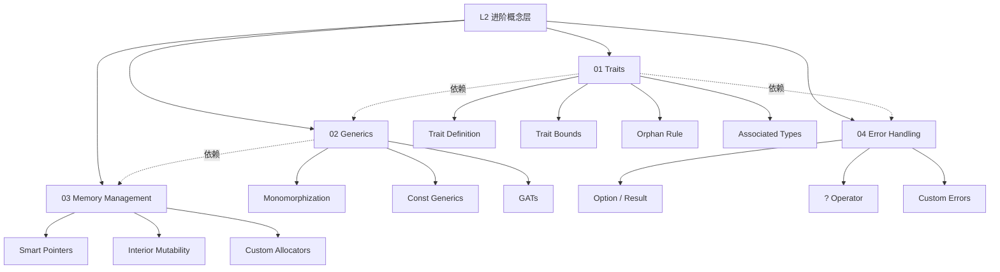

# L2 进阶概念层（Intermediate）

> **定位**：在掌握 L1 基础后，理解 Rust 的模块化、泛型、错误处理等进阶机制。本层内容对齐 TRPL 第 10-15 章、Microsoft RustTraining 进阶部分。

---

## 一、本层概念图谱



---

## 二、文件索引

| 文件 | 概念 | 核心内容 | 状态 |
|:---|:---|:---|:---|
| `01_traits.md` | Trait 系统 | 定义、约束、Orphan Rule、关联类型、Supertrait | ✅ v1.0 |
| `02_generics.md` | 泛型系统 | 单态化、约束、Const Generics、GATs | ✅ v1.0 |
| `03_memory_management.md` | 内存管理 | Box/Rc/Arc、RefCell/Mutex、自定义分配器 | ✅ v1.0 |
| `04_error_handling.md` | 错误处理 | Result/Option、`?`、自定义错误、Error trait | ✅ v1.0 |

---

## 三、学习路径建议

```
L1 Foundation
    ↓
Traits ←────→ Generics
    ↓             ↓
Error Handling ← Memory Management
    ↓
L3 Advanced
```

---

## 四、待创建内容（按 Phase 2 计划）

详见 [PLAN.md](../PLAN.md) Phase 2 部分。
