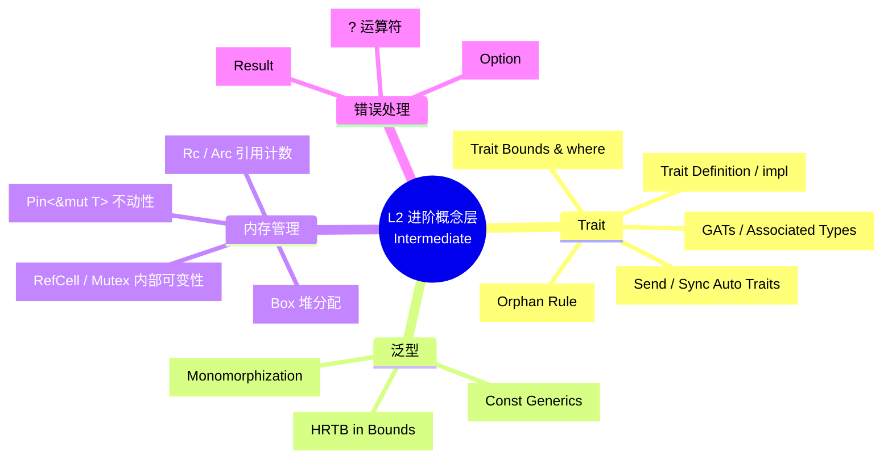
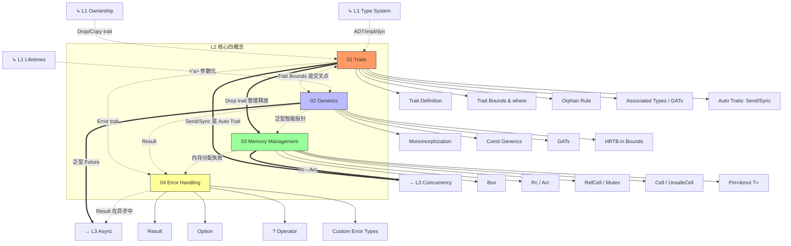

# L2 进阶概念层（Intermediate）
>
> **EN**: Readme
> **Summary**: Intermediate concepts: traits, generics, error handling, and collections.
>
> **受众**: [进阶]
> **定位**：在掌握 L1 基础后，理解 Rust 的模块（Module）化、泛型（Generics）、内存管理和错误处理（Error Handling）等进阶机制。本层内容对齐 TRPL 第 10-15 章、Microsoft RustTraining 进阶部分。
> **Bloom 层级**: 理解 → 应用
> **对应 L4 形式化**: 类型约束求解 · 参数多态 · 子类型 · 存在类型
> **来源: [TRPL Ch10](https://doc.rust-lang.org/book/ch10-00-generics.html)** ·
> **来源: [Wikipedia - Generic Programming](https://en.wikipedia.org/wiki/Generic_programming)** ·
> **来源: [Wikipedia - Trait-based Programming](https://en.wikipedia.org/wiki/Trait-based_programming)** ·
> **[来源: Microsoft Rust Training - Advanced Topics]**
> **本节关键术语**: 进阶概念 (Intermediate) · 特征 (Trait) · 泛型 (Generics) · 生命周期 (Lifetime) · 智能指针 (Smart Pointer) — [完整对照表](../00_meta/01_terminology/terminology_glossary.md)
>
> **来源**: [TRPL](https://doc.rust-lang.org/book/title-page.html) · [Rust Reference](https://doc.rust-lang.org/reference/) · [Rustonomicon](https://doc.rust-lang.org/nomicon/)
> **前置概念**: N/A
> **后置概念**: N/A
---

## 📑 目录

- [L2 进阶概念层（Intermediate）](#l2-进阶概念层intermediate)
  - [📑 目录](#-目录)
    - [〇、L2 认知入口](#〇l2-认知入口)
  - [一、本层概念关系图（完整版）](#一本层概念关系图完整版)
    - [1.1 概念间语义链接](#11-概念间语义链接)
    - [1.2 关键交叉点：Trait Bounds](#12-关键交叉点trait-bounds)
  - [二、文件索引与关系](#二文件索引与关系)
    - [补充文件索引](#补充文件索引)
  - [三、学习路径建议](#三学习路径建议)
    - [3.1 严格依赖路径](#31-严格依赖路径)
  - [四、形式化层级定位](#四形式化层级定位)
  - [五、本层定理一致性概览](#五本层定理一致性概览)
  - [六、认知路径](#六认知路径)
  - [七、跨层出口](#七跨层出口)
  - [嵌入式测验（Embedded Quiz）](#嵌入式测验embedded-quiz)
    - [测验 1：《L2 进阶概念层（Intermediate）》在本知识体系中扮演什么角色？（理解层）](#测验-1l2-进阶概念层intermediate在本知识体系中扮演什么角色理解层)
    - [测验 2：使用本索引文件时，最有效的学习策略是什么？（理解层）](#测验-2使用本索引文件时最有效的学习策略是什么理解层)
    - [测验 3：索引文档能否替代具体概念文件的学习？（理解层）](#测验-3索引文档能否替代具体概念文件的学习理解层)

### 〇、L2 认知入口



> **认知功能**: 本图是 L2 层的**全景认知地图**，帮助读者在深入学习前建立"四核机制"的整体拓扑框架。
> 建议在学习各子模块（Module）前通览此图，定位当前概念在四核中的位置。
> 关键洞察：Trait 是 Rust 行为抽象的基石，Trait Bounds 是 Trait 与泛型（Generics）的枢纽交叉点。
> [来源: 💡 原创分析]
> **认知路径**: 本 mindmap 展示 L2 层的**四核机制**。
> Trait 是 Rust 的行为抽象核心，泛型（Generics）实现零成本参数多态，内存管理扩展所有权（Ownership）的表达能力（共享、内部可变性），错误处理（Error Handling）将异常转化为类型系统（Type System）的一部分。
> 关键交叉点：**Trait Bounds** 是 Trait 与泛型（Generics）的结合部。

## 一、本层概念关系图（完整版）



> **认知功能**: 本图是 L2 层的**概念关系网络图**，可视化四核心概念间的互构关系及与 L1/L3 的跨层连接。建议在遇到概念交叉问题时查阅，定位依赖路径与前置后置关系。关键洞察：Trait Bounds 是 L2 的枢纽交叉点，L2 整体是连接 L1 所有权（Ownership）基础与 L3 并发异步（Async）的语义桥梁。

### 1.1 概念间语义链接

| 关系 | 从 | 到 | 语义类型 | 说明 |
|:---|:---|:---|:---|:---|
| 1 | **Trait** | **Generics** | `<-.->` 交叉/互构 | Trait Bounds (`T: Trait`) 是 Trait 和 Generics 的**核心交叉点**。无 Trait 则泛型无约束；无泛型则 Trait 无参数化能力。 |
| 2 | **Trait** | **Memory Management** | `==>` 启用 | `Drop` / `Copy` / `Clone` 等核心 trait 直接定义内存管理语义。 |
| 3 | **L1 Lifetimes** | **Generics** | `-.->` 前置/参数化 | 生命周期 `'a` 本质上是泛型参数的一种（region parameter），L1 → L2 的严格递进。 |
| 4 | **Generics** | **L3 Async** | `==>` 启用 | `Future` 是泛型 trait，`async fn` 的返回类型是匿名的 `impl Future<Output = T>`。 |
| 5 | **Trait (Send/Sync)** | **L3 Concurrency** | `==>` 启用 | `Send` 和 `Sync` 是 marker trait，它们是并发安全（Concurrency Safety）的**类型级证明**。 |

### 1.2 关键交叉点：Trait Bounds

```text
Trait Bounds 是 L2 的"枢纽概念"：

    Trait 定义          Generics 参数化
        │                    │
        └──────┬─────────────┘
               │
          Trait Bounds (T: Display + Clone)
               │
        ┌──────┴─────────────┐
        ▼                    ▼
    编译期多态            类型约束求解
    (静态分发)            (Horn 子句)
        │                    │
        └──────┬─────────────┘
               ▼
          零成本抽象
```

---

## 二、文件索引与关系

| 文件 | 概念 | 核心内容 | 状态 | 前置（L1） | 后置（L3） |
|:---|:---|:---|:---|:---|:---|
| [01_traits.md](00_traits/01_traits.md) | Trait 系统 | 定义、约束、Orphan Rule、关联类型/GATs、Supertrait、Auto Trait | ✅ v1.0 | Type System, Ownership | Concurrency (Send/Sync), Async (Future) |
| [02_generics.md](01_generics/02_generics.md) | 泛型系统 | 单态化（Monomorphization）、Trait Bounds、Const Generics、GATs、HRTB | ✅ v1.0 | Lifetimes, Type System | Async (Future), Memory (Pin) |
| [03_memory_management.md](02_memory_management/03_memory_management.md) | 内存管理 | Box/Rc/Arc、RefCell/Mutex、Cell/UnsafeCell、Pin、MaybeUninit | ✅ v1.0 | Ownership, Borrowing | Concurrency (Arc), Unsafe (MaybeUninit) |
| [04_error_handling.md](03_error_handling/04_error_handling.md) | 错误处理（Error Handling） | Result/Option、`?`、Custom Error、Error trait | ✅ v1.0 | Type System (enum), Trait | Async (异步错误传播) |
| [05_assert_matches.md](06_macros_and_metaprogramming/05_assert_matches.md) | 模式匹配（Pattern Matching）断言 | `matches!`、`assert_matches!`、模式断言语义 | ✅ v1.0 | Type System (Pattern), Error Handling | Macros |
| [06_range_types.md](04_types_and_conversions/06_range_types.md) | 范围类型语义 | `std::ops::Range` → `core::range`、`IntoIterator` 设计 | ✅ v1.0 | Type System, Generics | Version Tracking |
| 07_closure_types.md | 闭包类型系统（Type System） | 捕获模式、Fn/FnMut/FnOnce、move 闭包（Closures）、生命周期（Lifetimes）擦除 | ✅ v1.0 | Ownership, Borrowing | Async, Iterator |
| [08_interior_mutability.md](02_memory_management/08_interior_mutability.md) | 内部可变性 | Cell/RefCell/UnsafeCell、Mutex/RwLock、原子类型 | ✅ v1.0 | Ownership, Borrowing | Concurrency, Unsafe |
| [09_serde_patterns.md](00_traits/09_serde_patterns.md) | Serde 序列化 | Serialize/Deserialize、自定义 Visitor、性能优化 | ✅ v1.0 | Trait, Generics | Application Domains |
| [10_module_system.md](05_modules_and_visibility/10_module_system.md) | 模块系统 | Crate/Module/Package、可见性、use 声明、Workspace | ✅ v1.0 | Ownership, Type System | Macros, Toolchain |
| [11_cow_and_borrowed.md](02_memory_management/11_cow_and_borrowed.md) | Cow 写时克隆 | Clone-on-Write、零拷贝、ToOwned、API 灵活性 | ✅ v1.0 | Ownership, Borrowing | String Patterns, Zero Cost |
| [12_smart_pointers.md](02_memory_management/12_smart_pointers.md) | 智能指针（Smart Pointer） | Box/Rc/Arc/RefCell/Cell、所有权语义、组合模式 | ✅ v1.0 | Ownership, Borrowing | Pin, Concurrency |
| [13_dsl_and_embedding.md](06_macros_and_metaprogramming/13_dsl_and_embedding.md) | DSL 与嵌入 | 宏（Macro） DSL、Builder、Parser Combinator、类型安全 | ✅ v1.0 | Trait, Macros | Serde, WebAssembly |
| [14_newtype_and_wrapper.md](04_types_and_conversions/14_newtype_and_wrapper.md) | Newtype 与包装器 | 类型安全、零成本抽象（Zero-Cost Abstraction）、孤儿规则（Orphan Rule）、单位类型 | ✅ v1.0 | Type System, Trait | Patterns, Smart Pointers |

---

### 补充文件索引

- [错误处理（Error Handling）深入：从 Result 到自定义错误生态](03_error_handling/16_error_handling_deep_dive.md)
- Rust 迭代器（Iterator）模式
- [Rust 迭代器（Iterator）模式](07_iterators_and_closures/15_iterator_patterns.md)
- 宏（Macro）模式：编译期代码生成的工程实践
- [RTTI 与动态类型识别：从 C++ 到 Rust](04_types_and_conversions/25_rtti_and_dynamic_typing.md)
- [C 预处理器 vs Rust 宏（Macro）：从文本替换到语法树](06_macros_and_metaprogramming/26_c_preprocessor_vs_rust_macros.md)
- [异常安全：C++ 与 Rust 的错误处理（Error Handling）哲学](03_error_handling/27_exception_safety_rust_cpp.md)
- [构造与初始化：C++ 的构造函数 vs Rust 的结构体（Struct）字面量](00_traits/28_construction_and_initialization.md)
- [友元 vs 模块（Module）可见性：C++ 的 `friend` 与 Rust 的隐私边界](05_modules_and_visibility/29_friend_vs_module_privacy.md)
- [测验：C/C++ → Rust 基础知识对比](09_quizzes/30_quiz_cpp_rust_foundations.md)
- [生命周期（Lifetimes）高级主题：从 HRTB 到自引用（Reference）类型](00_traits/18_lifetimes_advanced.md)
- [高级 Trait 主题：从关联类型到特化](00_traits/19_advanced_traits.md)
- [高级类型系统（Type System）：从关联类型到类型级编程](04_types_and_conversions/20_type_system_advanced.md)
- [元编程：Rust 的编译期代码生成与变换](06_macros_and_metaprogramming/21_metaprogramming.md)
- [测验：Trait 与泛型（Generics）（嵌入式互动试点）](01_generics/23_quiz_traits_and_generics.md)
- [测验：内存管理（嵌入式互动试点）](02_memory_management/24_quiz_memory_management.md)

## 三、学习路径建议

```text
L1 Foundation
    │
    ├──→ Traits ←──────→ Generics
    │       │                 │
    │       │                 │
    │       └──────┬──────────┘
    │              │
    │              ▼
    │    ┌─────────────────┐
    │    │  Memory Mgmt    │
    │    │  Error Handling │
    │    └─────────────────┘
    │              │
    ▼              ▼
L3 Advanced (Concurrency / Async)
```

### 3.1 严格依赖路径

```text
Traits
    │ 必须先掌握: L1 Type System (impl/dyn), L1 Ownership (Drop trait)
    │ 后置: Trait Bounds → Generics
    │ 反事实: 若无 Trait，则无法定义泛型约束，类型系统退化为 C 模板
    ↓
Generics
    │ 必须先掌握: Traits (bounds), L1 Lifetimes (<'a>)
    │ 后置: 泛型 Future, GATs
    │ 反事实: 若无单态化，则泛型有运行时开销（如 Java 泛型擦除）
    ↓
Memory Management
    │ 必须先掌握: L1 Ownership (Rc 突破), Traits (Drop/Clone)
    │ 后置: Arc (并发), Pin (异步), MaybeUninit (unsafe)
    │ 反事实: 若无内部可变性，则共享状态需 unsafe
    ↓
Error Handling
    │ 必须先掌握: L1 Type System (enum), Traits (Error trait)
    │ 后置: 异步错误传播, ? 在闭包中的使用
    │ 反事实: 若无 Result 类型，错误处理退化为异常或返回值检查
```

---

## 四、形式化层级定位

| 概念 | 理论层 (Why) | 模型层 (What) | 实践层 (How) | L4 形式化对应 |
|:---|:---|:---|:---|:---|
| **Trait** | 接口/类型类 (Type Class) | Trait 对象表、vtable | `trait` / `impl` / `dyn` | Type Class (Haskell) · 存在类型 (∃) |
| **Generics** | 参数多态 (Parametricity) | 单态化（Monomorphization）算法、约束求解 | `<T>`、`where` 子句 | System F / Fω · HM 扩展 |
| **Memory Mgmt** | 资源管理逻辑 | 引用（Reference）计数、运行时（Runtime）借用（Borrowing）检查 | `Rc`/`RefCell`/`Arc` | 无（运行时机制，非编译期） |
| **Error Handling** | 异常代数 (Exception Monad) | Result 类型、? 运算符脱糖 | `Result<T,E>`、`?` | 和类型的错误通道 (A + E) |

---

## 五、本层定理一致性概览

| 定理 | 前提 | 结论 | 依赖的 L4 理论 | 失效条件 | 典型场景 |
|:---|:---|:---|:---|:---|:---|
| Orphan Rule 保证一致性 | crate 边界清晰 | 无矛盾 impl | Coherence (类型论) | 允许覆盖 impl（特化） | 孤儿规则冲突 |
| 单态化（Monomorphization）零成本 | 泛型（Generics）函数编译时实例化 | 无运行时（Runtime）分发开销 | Parametricity | `dyn Trait` 动态分发 | vtable 间接调用 |
| Rc 共享安全 | 单线程 | 共享所有权（Ownership）无 UAF | —（运行时） | 跨线程使用 Rc | 编译错误：Rc 非 Send |
| RefCell 运行时借用（Borrowing）检查 | 单线程 | 运行时检测借用违规 | —（运行时） | 已借出时再次借用 | panic: already borrowed |
| ? 运算符传播 | 函数返回 Result/Option | 自动错误短路 | Monad bind (>>=) | 在非 Result 返回函数中使用 | 编译错误 |

---

## 六、认知路径

```text
直觉困惑                    具体场景                  模式抽象               形式规则              代码验证              边界测试
    │                         │                       │                     │                    │                    │
    ▼                         ▼                       ▼                     ▼                    ▼                    ▼
"如何实现多态？"             "不同类型打印            "Trait = 共享          "Type Class         "impl Display        "Orphan Rule
                             需要不同代码"            行为接口"              / 存在类型"           for MyType"         限制外部 impl"

"如何写通用函数？"           "swap 任何类型           "Generics =            "System F           "fn swap<T>(a, b)"    "Const Generics
                             都要能交换"              参数化类型"            参数多态"                                数组长度"

"如何共享可变状态？"         "多个 owner 同时         "Rc/RefCell =         "运行时借用         "Rc::new(RefCell::new)" "循环引用
                             修改数据"                共享 + 内部可变性"     检查替代编译期"                          内存泄漏"

"如何处理错误？"             "函数可能失败            "Result = 显式         "错误 Monad         "fn f() -> Result<T,E>" "? 在闭包中的
                             怎么返回值？"            错误通道"             (Either A E)"                           限制"
```

---

## 七、跨层出口

掌握 L2 后可进入：

- **L3 高级**: Concurrency（Send/Sync 是 Auto Trait）、Async（Future 是泛型（Generics） Trait）、Unsafe（MaybeUninit、UnsafeCell）
- **L4 形式化**: 类型论（参数多态、约束求解）、子类型与 Variance
- **L6 生态**: 设计模式（Typestate、Builder 依赖 Trait）

---

> **权威来源**: [Rust Reference](https://doc.rust-lang.org/reference/), [The Rust Programming Language](https://doc.rust-lang.org/book/title-page.html), [Rustonomicon](https://doc.rust-lang.org/nomicon/)
>
> **权威来源对齐变更日志**: 2026-05-19 补全权威来源标注（Rust Reference、TRPL、Rustonomicon、RFCs、学术论文） [来源: Authority Source Sprint Batch 8]
> **内容分级**: [专家级]

**文档版本**: 1.1
**对应 Rust 版本**: 1.96.1+ (Edition 2024)
**最后更新: 2026-05-21
**状态**: ✅ 权威来源对齐完成 (Batch 8)

## 嵌入式测验（Embedded Quiz）

### 测验 1：《L2 进阶概念层（Intermediate）》在本知识体系中扮演什么角色？（理解层）

**题目**: 《L2 进阶概念层（Intermediate）》在本知识体系中扮演什么角色？

<details>
<summary>✅ 答案与解析</summary>

作为导航和索引文档，帮助学习者快速定位内容、理解知识结构关系，是进入各层内容的入口和路线图。
</details>

---

### 测验 2：使用本索引文件时，最有效的学习策略是什么？（理解层）

**题目**: 使用本索引文件时，最有效的学习策略是什么？

<details>
<summary>✅ 答案与解析</summary>

先浏览整体结构建立全局视野，然后根据自身水平选择对应层级，遇到模糊概念时利用交叉引用（Reference）跳转复习。
</details>

---

### 测验 3：索引文档能否替代具体概念文件的学习？（理解层）

**题目**: 索引文档能否替代具体概念文件的学习？

<details>
<summary>✅ 答案与解析</summary>

不能。索引提供的是结构框架和导航，深入理解需要通过阅读具体概念文件、完成测验和实践练习来实现。
</details>
