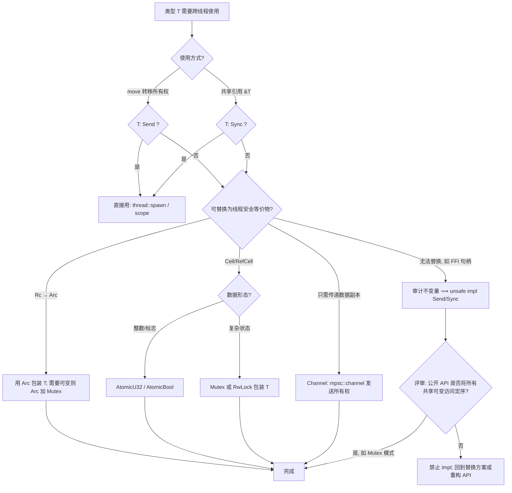

> **内容分级**: [专家级]

# Send 与 Sync：Auto Trait 的并发安全契约

> **EN**: Send and Sync — Auto Traits as Compile-Time Concurrency Contracts
> **Summary**: Send and Sync are auto traits that encode Rust's concurrency safety contract: `T: Send` means ownership of `T` can be safely transferred across threads, and `T: Sync` is equivalent to `&T: Send`, meaning shared references can be safely used from multiple threads. This page is the canonical reference for their formal contract, auto-derivation rules, negative implementations, decision matrix, counterexamples, and the boundary of manual `unsafe impl`.
>
> **Rust 版本**: 1.97.0+ (Edition 2024)
> **Bloom 层级**: L3-L4
> **受众**: [专家]
> **权威来源**: 本文件为 `concept/` 权威页。Send/Sync 的**核心定义、判定规则与 auto trait 机制**统一收敛于本页；[并发模型](01_concurrency.md)、[原子操作与内存序](05_atomics_and_memory_ordering.md)、[无锁编程](06_lock_free.md) 保留各自的应用场景章节，通过链接指向本页，不重复契约推导。
>
> **层次定位**: L3 高级概念 / 并发子域 — 类型系统（Type System）与并发（Concurrency）的交叉点
> **A/S/P 标记**: **S** — Structure（结构性契约）
> **双维定位**: C×Ana — 分析类型跨线程使用的安全性边界
> **前置概念**: [Traits](../../02_intermediate/00_traits/01_traits.md) · [Ownership](../../01_foundation/01_ownership_borrow_lifetime/01_ownership.md) · [Borrowing](../../01_foundation/01_ownership_borrow_lifetime/02_borrowing.md) · [内部可变性（Interior Mutability）](../../02_intermediate/02_memory_management/02_interior_mutability.md)
> **后置概念**: [Concurrency](01_concurrency.md) · [Atomics & Memory Ordering](05_atomics_and_memory_ordering.md) · [Lock-Free](06_lock_free.md) · [Unsafe Rust](../02_unsafe/01_unsafe.md) · [RustBelt](../../04_formal/02_separation_logic/01_rustbelt.md)

---

> **主要来源**: [TRPL Ch16 — Fearless Concurrency](https://doc.rust-lang.org/book/ch16-00-concurrency.html) ·
> [Rustonomicon — Send and Sync](https://doc.rust-lang.org/nomicon/send-and-sync.html) ·
> [Rust Reference — Special Types and Traits (auto traits)](https://doc.rust-lang.org/reference/special-types-and-traits.html) ·
> [std::marker::Send](https://doc.rust-lang.org/std/marker/trait.Send.html) ·
> [std::marker::Sync](https://doc.rust-lang.org/std/marker/trait.Sync.html) ·
> [RFC 0019 — Opt-in builtin traits](https://rust-lang.github.io/rfcs/0019-opt-in-builtin-traits.html)

## 📑 目录

- [Send 与 Sync：Auto Trait 的并发安全契约](#send-与-syncauto-trait-的并发安全契约)
  - [📑 目录](#-目录)
  - [一、为什么需要 Send/Sync：数据竞争（Data Race）的类型化](#一为什么需要-sendsync数据竞争data-race的类型化)
  - [二、形式化契约（Formal Contract）](#二形式化契约formal-contract)
    - [2.1 Send 契约](#21-send-契约)
    - [2.2 Sync 契约 ⟺ \&T: Send](#22-sync-契约--t-send)
    - [2.3 契约与线程 API 的连接点](#23-契约与线程-api-的连接点)
  - [三、Auto Trait 机制：自动推导与负实现](#三auto-trait-机制自动推导与负实现)
    - [3.1 结构化推导规则](#31-结构化推导规则)
    - [3.2 负实现（Negative Impl）：显式 `!Send` / `!Sync`](#32-负实现negative-impl显式-send--sync)
    - [3.3 stable 上的 opt-out 惯用法：`PhantomData`](#33-stable-上的-opt-out-惯用法phantomdata)
    - [3.4 orphan 规则边界](#34-orphan-规则边界)
  - [四、与泛型、组合类型、UnsafeCell 的交互](#四与泛型组合类型unsafecell-的交互)
  - [五、Send/Sync 判定矩阵](#五sendsync-判定矩阵)
  - [六、反例：编译期拒绝与 unsafe 手动 impl 对照](#六反例编译期拒绝与-unsafe-手动-impl-对照)
    - [反例 1：`Rc` 跨线程（编译期拒绝 E0277）](#反例-1rc-跨线程编译期拒绝-e0277)
    - [反例 2：`Arc<Cell<T>>` 共享可变（编译期拒绝 E0277）](#反例-2arccellt-共享可变编译期拒绝-e0277)
    - [反例 3：unsafe 手动 impl 的正确/错误对照](#反例-3unsafe-手动-impl-的正确错误对照)
  - [七、决策树：类型需要跨线程时怎么办](#七决策树类型需要跨线程时怎么办)
  - [八、与既有内容的关系声明](#八与既有内容的关系声明)
  - [九、来源与延伸阅读](#九来源与延伸阅读)
  - [嵌入式测验（Embedded Quiz）](#嵌入式测验embedded-quiz)
    - [测验 1：Send 与 Sync 的契约（🟢 基础）](#测验-1send-与-sync-的契约-基础)
    - [测验 2：`Rc` 跨线程的编译期拒绝（🟡 进阶）](#测验-2rc-跨线程的编译期拒绝-进阶)
    - [测验 3：auto trait 的手动实现边界（🔴 专家）](#测验-3auto-trait-的手动实现边界-专家)

---

## 一、为什么需要 Send/Sync：数据竞争（Data Race）的类型化

数据竞争（data race）的经典定义是：**两个线程并发访问同一内存位置，至少一个是写，且没有同步（synchronization）建立 happens-before 序**。C/C++ 中数据竞争即未定义行为（Undefined Behavior, UB），且编译器不提供任何静态保护。

Rust 的做法是把"能否安全地跨线程使用"编码为两个 **marker trait（标记 trait）**：

```rust
// std::marker（标准库定义，均为 unsafe auto trait）
pub unsafe auto trait Send { /* 无方法，纯标记 */ }
pub unsafe auto trait Sync { /* 无方法，纯标记 */ }
```

关键设计点有三：

1. **无方法（marker）**：它们不暴露任何运行时（Runtime）行为，只参与类型检查（type checking）。
2. **auto trait**：编译器按结构化规则**自动**为类型实现，程序员通常无需手写 `impl`。
3. **unsafe trait**：手动实现必须用 `unsafe impl`——因为编译器无法验证"该类型跨线程真的安全"这一语义不变量（invariant），证明责任转移给程序员。

由此，`thread::spawn`、`scope`、`mpsc::Sender::send` 等并发 API 只需在签名上写 `T: Send` / `F: Send + 'static` 约束，数据竞争就在**编译期**被排除——这就是 "fearless concurrency" 的机制根基。

## 二、形式化契约（Formal Contract）

`Send` 与 `Sync` 的形式化契约是 Rust 并发安全的公理化表述：

- **Send 契约**：`T: Send` ⟺ 「`T` 类型的值的所有权可以安全地转移到另一个线程」。「安全」的精确含义：转移后，原线程不再持有任何对该值的访问路径（move 语义保证），且值的析构发生在新线程不会违反任何线程亲和性约束（如 `Rc` 的计数增减非原子——跨线程析构会与原线程的计数操作竞争）。
- **Sync 契约 ⟺ `&T: Send`**：`T: Sync` ⟺ 「`&T` 可以安全地跨线程共享」，即多个线程同时持有 `&T` 不会引入数据竞争。由于 `&T` 只提供只读访问，契约实质是「`T` 的所有经 `&T` 可达的修改路径都有同步保护」——`Cell`/`RefCell` 的修改路径无同步（`!Sync`），`Mutex`/`Atomic` 的有（`Sync`）。
- **契约与线程 API 的连接点**：`thread::spawn<F: FnOnce() -> R + Send + 'static, R: Send + 'static>`——签名把契约写进了 API：闭包（含其捕获环境）与返回值都必须 `Send + 'static`。`'static` 约束排除「借用栈上数据的闭包」（除非用 `thread::scope` 的作用域线程，它把借用安全性编码为作用域 join 保证）。

契约的使用方式：任何「这个类型能跨线程吗」的问题，先分解为 `Send`（移动）与 `Sync`（共享）两问，再按结构化规则（复合类型 ⟺ 全字段满足）递归判定——编译器执行的就是同一算法。

### 2.1 Send 契约

> **Send 契约**：`T: Send` ⟹ 将 `T` 的**所有权（Ownership）转移**到另一个线程是安全的。

形式化地，设线程 $t_1$ 持有值 $v: T$，将其 move 到线程 $t_2$：

```text
T: Send ∧ t₁ owns v  ⟹  t₂ 独占 v 后不产生数据竞争 ∧ drop(v) 在 t₂ 执行是安全的
```

注意契约的三个隐含分量：

- **转移后原线程失去访问权**——这由所有权（move 语义）保证，Send 只管"转移这一动作"的安全性；
- **析构位置可迁移**：`Drop::drop` 可能在新线程执行，因此 `T: Send` 也要求 `drop` 不依赖线程局部状态（thread-local state）。这正是 `Rc<T>` 为 `!Send` 的深层原因之一：`Rc` 的 `drop` 要减非原子引用计数，换线程执行会破坏计数完整性；
- **不蕴含 Sync**：`T: Send` 只说"独占转移安全"，**不**说"共享引用安全"。反例：`Cell<u32>: Send`（转移独占没问题）但 `Cell<u32>: !Sync`（共享引用会数据竞争）。

### 2.2 Sync 契约 ⟺ &T: Send

> **Sync 契约**：`T: Sync` ⟹ 多个线程通过共享引用 `&T` **并发**访问 `T` 是安全的。

Rust Reference 给出的精确等价式是本页的核心定理：

```text
T: Sync  ⟺  &T: Send
```

推理链（为何这个等价成立）：

```text
前提 1: 多个线程"并发访问 &T" ⟺ 每个线程各自持有一份 &T 的拷贝
前提 2: 每个线程要拿到 &T 拷贝 ⟺ &T 被转移（move/copy）进各线程 ⟺ &T: Send
前提 3: "并发访问 &T 安全" 正是 Sync 的定义
结论:   T: Sync ⟺ &T: Send                                    ∎
```

直接推论：

- `T: Sync` 不要求 `T` 自身可变——`&T` 只允许读，**除非** `T` 有内部可变性（Interior Mutability）。因此 `Sync` 的实质是"**内部可变性的线程安全性审查**"：`Mutex<T>` 用互斥锁使内部可变安全 ⟹ `Sync`；`RefCell<T>` 的运行时借用检查不是线程安全的 ⟹ `!Sync`。
- `&mut T: Send` 当且仅当 `T: Send`（独占引用转移等价于值转移）；`&mut T: Sync` 当且仅当 `T: Sync`（透过 `&mut T` 再借用出 `&T`）。

### 2.3 契约与线程 API 的连接点

```rust
use std::thread;

// std 源码简化版：spawn 的约束把契约"接地"
// pub fn spawn<F, T>(f: F) -> JoinHandle<T>
// where
//     F: FnOnce() -> T,
//     F: Send + 'static,   // 闭包（含其捕获的环境）必须可转移
//     T: Send + 'static;   // 返回值必须可转移回主线程

fn send_contract_in_action() {
    let v = vec![1, 2, 3];              // Vec<i32>: Send + Sync
    let h = thread::spawn(move || v.len()); // move 转移所有权 ⟹ 只需 Send
    assert_eq!(h.join().unwrap(), 3);
}

fn sync_contract_in_action() {
    let v = vec![1, 2, 3];
    thread::scope(|s| {                 // scoped threads: 借用可逃逸 spawn
        s.spawn(|| assert_eq!(v[0], 1)); // &Vec<i32>: Send ⟺ Vec<i32>: Sync
        s.spawn(|| assert_eq!(v[1], 2));
    });
}
```

`'static` 约束与 Send/Sync 正交：它排除"捕获了栈引用的闭包逃到可能活得更久的线程"（scoped threads 用 `scope` 的生命周期（Lifetimes）担保放宽此约束）。

## 三、Auto Trait 机制：自动推导与负实现

`Send`/`Sync` 是 auto trait——编译器按结构自动推导实现，人工干预只在三条受控通道：

- **结构化推导规则**：编译器对每个具体类型递归判定——`struct S { a: A, b: B }` 自动 `Send` ⟺ `A: Send` 且 `B: Send`（`Sync` 同理）。推导是「语法驱动」的：不需要任何标注，新类型定义完成即获得（或失去）两个标记。泛型类型 `Vec<T>: Send ⟺ T: Send`——推导沿类型参数传播。
- **负实现（Negative Impl）**：`impl !Send for Rc<T> {}` 形式显式声明「永不实现」——标准库用它标记 `Rc`、裸指针等。负 impl 在 stable 不可写（`negative_impls` feature），它是编译器与标准库的保留机制。
- **stable 上的 opt-out 惯用法**：用户类型需 `!Send` 时，嵌入 `PhantomData<Rc<()>>` 或 `PhantomData<*mut ()>`（裸指针 `!Send + !Sync`）使自动推导失败；反之，`unsafe impl Send for T {}` 是人工签署「我保证该类型满足契约」——孤儿规则允许此 impl 当且仅当类型在本地定义。

判定一个类型的 `Send`/`Sync` 状态，按顺序查：有无显式（`unsafe`）impl → 有无负 impl（标准库类型）→ 结构化推导（字段递归）→ `PhantomData` 标记。四级机制覆盖了从「全自动」到「全人工」的完整干预谱。

### 3.1 结构化推导规则

auto trait 的自动实现是**对类型结构的归纳定义**：

```text
规则 1（标量基例）: 所有原始标量类型（i32, bool, char, f64, ...）: Send + Sync
规则 2（复合归纳）: 聚合类型 A（struct/enum/tuple/数组 [T; N]）
                    A: Send ⟺ A 的所有字段/变体载荷: Send
                    A: Sync ⟺ A 的所有字段/变体载荷: Sync
规则 3（指针特例）: *const T 与 *mut T: !Send ∧ !Sync（保守默认，见 §3.2）
规则 4（引用）:     &T: Send ⟺ T: Sync;   &T: Sync ⟺ T: Sync
                    &mut T: Send ⟺ T: Send; &mut T: Sync ⟺ T: Sync
规则 5（覆盖）:     存在显式负实现（!Send/!Sync）或 unsafe impl 时，以显式声明为准
```

```rust
struct Pair<A, B> { a: A, b: B }

// 推导：Pair<A, B>: Send ⟺ A: Send ∧ B: Send（规则 2）
fn assert_send<T: Send>() {}
fn assert_sync<T: Sync>() {}

fn structural_derivation() {
    assert_send::<Pair<i32, String>>();          // 两字段均 Send ⟹ Send
    assert_sync::<Pair<i32, String>>();          // 两字段均 Sync ⟹ Sync
    // assert_send::<Pair<i32, std::rc::Rc<i32>>>(); // 编译错误：Rc<i32>: !Send
}
```

### 3.2 负实现（Negative Impl）：显式 `!Send` / `!Sync`

标准库用**负实现**显式否定某些类型的 auto 推导（std 内部使用，源码形态）：

```rust
// std 内部（示意）——用户代码在 stable 上不能直接写 negative impl
// impl<T: ?Sized> !Send for Rc<T> {}       // 非原子引用计数
// impl<T: ?Sized> !Sync for Rc<T> {}
// impl<T: ?Sized> !Sync for Cell<T> {}     // 无同步的内部可变性
// impl<T: ?Sized> !Sync for RefCell<T> {}  // 运行时借用标志非线程安全
// impl<T: ?Sized> !Send for *const T {}    // 原始指针：保守默认
// impl<T: ?Sized> !Send for *mut T {}
// impl<T: ?Sized> !Sync for *const T {}
// impl<T: ?Sized> !Sync for *mut T {}
```

在用户代码中，显式 negative impl 仍需**每日构建版工具链**（实验特性门 `negative_impls`，截至 Rust 1.97.0 未稳定）：

```rust
// 需启用实验特性门 negative_impls —— 仅每日构建版可编译
// struct MainThreadOnly { _p: () }
// impl !Send for MainThreadOnly {}   // 显式否定：该类型绑定创建它的线程
```

### 3.3 stable 上的 opt-out 惯用法：`PhantomData`

stable 上要让自有类型 `!Send`/`!Sync`，标准惯用法是嵌入一个"毒化字段"（poison field）——规则 2 的归纳会把字段的 `!Send` 传播给整个类型：

```rust
use std::marker::PhantomData;
use std::rc::Rc;

/// 绑定创建线程的句柄（stable 惯用法）
struct ThreadBound {
    // PhantomData 零大小、零运行时成本，只参与 auto trait 推导
    _not_send: PhantomData<Rc<()>>, // Rc<()>: !Send + !Sync ⟹ ThreadBound: !Send + !Sync
    id: u64,
}

fn phantom_opt_out() {
    assert_send::<ThreadBoundSendable>();
    // let _ = std::thread::spawn(move || ThreadBound { _not_send: PhantomData, id: 1 });
    // ⟹ 编译错误 E0277：ThreadBound 无法在线程间安全转移
}

struct ThreadBoundSendable { id: u64 } // 对照：无毒化字段 ⟹ 自动 Send + Sync
```

常用毒化字段对照：

| 想要的否定 | 毒化字段 | 说明 |
|:---|:---|:---|
| `!Send + !Sync` | `PhantomData<Rc<()>>` 或 `PhantomData<*const ()>` | 最常用；`*const ()` 不引入堆分配语义暗示 |
| 仅 `!Sync`（保留 Send） | `PhantomData<Cell<()>>` | `Cell<()>: Send + !Sync` |
| 仅 `!Send`（保留 Sync） | 无现成 std 类型组合，需每日构建版 `impl !Send` | 实践中极少需要 |

### 3.4 orphan 规则边界

手动实现 auto trait 受 orphan 规则（孤立规则）约束，且因 auto trait 是 `unsafe trait`，手动实现必须 `unsafe`：

```rust
use std::marker::PhantomData;

struct MyHandle(*mut u8, PhantomData<*mut u8>); // 本地类型

// ✅ 合法：本地类型 + unsafe impl（程序员承担证明责任）
unsafe impl Send for MyHandle {}

// ❌ 非法（orphan 违规）：为外部类型实现 auto trait
// unsafe impl Send for std::rc::Rc<i32> {}  // E0117: only traits defined in the
//                                            // current crate can be implemented
//                                            // for types defined outside of the crate
//                                            // （同时触发 E0751：与 std 的负实现冲突）

// ⚠️ 注意：对本地类型显式 unsafe impl 是“覆盖”而非“冲突”——
// struct Local(i32);
// unsafe impl Send for Local {}  // 合法：显式 impl 取代自动推导结果（auto trait 特性）
```

边界总结：

1. auto trait 的手动 `unsafe impl` 只能加在**本 crate 定义**的类型上（orphan 规则）；显式 impl **覆盖**自动推导结果（auto trait 的特性，不产生 E0119 冲突）——典型场景：含原始指针字段的类型（规则 3 使其默认 `!Send`/`!Sync`）需要手动翻案；
2. 不能给外部 crate 的类型“补”Send/Sync——那等于单方面宣布别人的类型线程安全，破坏一致性（Coherence），编译器报 E0117；
3. stable 上不能给用户类型加 negative impl——只能重构类型（加毒化字段，§3.3），或使用每日构建版的 `negative_impls`。

## 四、与泛型、组合类型、UnsafeCell 的交互

**泛型（Generics）**：auto 推导对泛型参数是**按约束惰化**的——`struct Wrapper<T>(T)` 不预先判定，而是在每个具体单态化（Monomorphization）实例上按规则 2 判定。因此泛型容器"继承"元素的 Send/Sync：

```rust
use std::cell::Cell;
use std::sync::Mutex;

fn generic_inherits() {
    assert_send::<Mutex<Cell<i32>>>();   // Mutex 使内部可变线程安全 ⟹ Send
    assert_sync::<Mutex<Cell<i32>>>();   // ... 且 ⟹ Sync（即使 Cell 本身 !Sync）
    assert_send::<Vec<Cell<i32>>>();     // Send：转移独占无问题
    // assert_sync::<Vec<Cell<i32>>>();  // 编译错误：&Vec<Cell> 并发读可变 Cell ⟹ 数据竞争
}
```

**组合类型的"意外传导"**：规则 2 是**全字段合取**，一个 `!Send` 字段即可否定整个类型——包括你没想到的字段（如嵌入的 `Rc` 回调、`*mut` 句柄）。排查 `E0277` 时应沿报错中的 "within `Outer`, the trait `Send` is not implemented for `Inner`" 链逐层定位毒化字段。

**UnsafeCell 是 Sync 的"地基否定"**：`UnsafeCell<T>: !Sync` 是 std 中所有内部可变性抽象的基例。`Cell`、`RefCell`、`Mutex`、`AtomicU32` 内部都含 `UnsafeCell`；前三者保持 `!Sync`（或仅 `Send`），而 `Mutex`/`Atomic*` 通过 `unsafe impl Sync` 翻案——它们的 `unsafe impl` 之所以**正确**，是因为其 API 保证每次对 `UnsafeCell` 的访问都被互斥锁/原子操作的 happens-before 序保护。这揭示了 Sync 的本质判据：

```text
T 含 UnsafeCell ⟹ T 默认 !Sync
T: Sync 合法 ⟺ T 的公开 API 保证所有内部可变性访问都经同步原语定序
```

**`dyn Trait` 与 auto trait**：trait object 的 auto trait 必须显式写入 object bound——`Box<dyn Fn()>` 是 `!Send`（编译器无法知道擦除前的闭包捕获了什么），`Box<dyn Fn() + Send>` 才是 `Send`：

```rust
fn assert_send_dyn() {
    fn takes_send(_: Box<dyn Fn() + Send>) {}
    let x = 1i32;
    takes_send(Box::new(move || println!("{x}"))); // 捕获 i32: Send ⟹ 闭包: Send
    // let rc = std::rc::Rc::new(1);
    // takes_send(Box::new(move || println!("{}", rc))); // E0277：闭包捕获 Rc ⟹ !Send
}
```

## 五、Send/Sync 判定矩阵

| 类型 | Send | Sync | 为什么（判定依据） |
|:---|:---:|:---:|:---|
| `i32` / `bool` / `char` 等标量 | ✅ | ✅ | 规则 1：无内部状态，拷贝即独立 |
| `String` / `Vec<T>`（`T: Send`） | ✅ | ✅ | 独占堆缓冲区；`&Vec<T>` 只读 |
| `&T` | `T: Sync` 时 ✅ | `T: Sync` 时 ✅ | 规则 4：引用转移等价于被指向类型的共享安全 |
| `&mut T` | `T: Send` 时 ✅ | `T: Sync` 时 ✅ | 规则 4：独占引用 ≈ 独占值；再降级出 `&T` |
| `Box<T>` / `Option<T>` / `Result<T, E>` | 同 `T` | 同 `T` | 规则 2：单字段/变体载荷归纳 |
| `[T; N]` / 元组 | 全部元素 | 全部元素 | 规则 2 合取 |
| `Rc<T>` | ❌ | ❌ | 引用计数非原子：并发 `clone`/`drop` 竞争计数 |
| `Arc<T>` | `T: Send+Sync` 时 ✅ | `T: Send+Sync` 时 ✅ | 原子计数安全；但 `&Arc<T>` 可降级出 `&T` ⟹ 还需 `T: Sync`；`drop` 可能在他线程 ⟹ 还需 `T: Send` |
| `Cell<T>` | `T: Send` 时 ✅ | ❌ | 转移独占安全；共享时 `set` 无同步 ⟹ 数据竞争 |
| `RefCell<T>` | `T: Send` 时 ✅ | ❌ | 借用标志非原子，跨线程 `borrow_mut` 竞争 |
| `Mutex<T>` | `T: Send` 时 ✅ | `T: Send` 时 ✅ | 互斥锁为内部可变性建立 happens-before（`unsafe impl` 翻案） |
| `RwLock<T>` | `T: Send+Sync` 时 ✅ | `T: Send+Sync` 时 ✅ | 读锁共享 ⟹ 并发 `&T` ⟹ 需 `T: Sync`；写锁独占 ⟹ 需 `T: Send` |
| `AtomicU32` 等原子类型 | ✅ | ✅ | 硬件级原子定序，内部可变性天然线程安全 |
| `*const T` / `*mut T` | ❌ | ❌ | 规则 3：编译器不知指向数据的所有权与生命周期，保守拒绝 |
| `UnsafeCell<T>` | `T: Send` 时 ✅ | ❌ | 内部可变性的地基否定（§4） |
| `mpsc::Sender<T>` | `T: Send` 时 ✅ | ❌ | 发送端可克隆转移；共享 `&Sender` 内部用 `Rc` 风格状态（standard 实现） |
| `mpsc::Receiver<T>` | `T: Send` 时 ✅ | ❌ | 单消费者语义 |
| `Box<dyn Fn()>` | ❌ | ❌ | 擦除后 auto trait 信息丢失，默认最保守 |
| `Box<dyn Fn() + Send>` | ✅ | ❌ | object bound 显式声明 Send；未声明 Sync |
| `Box<dyn Fn() + Send + Sync>` | ✅ | ✅ | 全声明 |
| `MutexGuard<'_, T>` | ❌（std 实现） | `T: Sync` 时 ✅ | guard 绑定加锁线程（pthread 等平台的锁所有者约束） |
| `JoinHandle<T>` | ✅ | ❌ | handle 本身可转移，但 `&JoinHandle` 并发 `join` 无意义 |
| `fn` 项 / 函数指针 | ✅ | ✅ | 无捕获环境 |
| 闭包（Closures） | 捕获环境的合取 | 捕获环境的合取 | 规则 2：闭包是匿名 struct，捕获即字段 |

> 判定心法：先问"**共享引用能造成什么并发访问**"（决定 Sync），再问"**转移后析构/独占使用是否依赖线程**"（决定 Send）。

## 六、反例：编译期拒绝与 unsafe 手动 impl 对照

三组反例展示「编译期拒绝」与「人工 `unsafe` 契约」的边界——这是 `Send`/`Sync` 机制全部可信度的来源：

- **反例 1：`Rc` 跨线程（E0277）**：`thread::spawn(move || drop(rc))` 报 `Rc<i32> cannot be sent between threads safely`。拒绝依据：`Rc` 的引用计数增减是非原子的读-改-写，两线程并发操作同一计数即数据竞争。修复：`Arc`（原子计数，成本是每次克隆一次原子 RMW）。
- **反例 2：`Arc<Cell<T>>` 共享可变（E0277）**：`Cell<T>: !Sync` 使 `Arc<Cell<T>>: !Sync`——`Arc` 只解决「跨线程移动」（`Send`），不解决「共享后的同步访问」（`Sync`）。这是 `Send`/`Sync` 正交性的典型考题：两层约束分别由两层类型回答，修复是 `Arc<Mutex<T>>` 或 `Arc<AtomicT>`。
- **反例 3：`unsafe` 手动 impl 的正误对照**：正确情形——类型用 `AtomicUsize` 实现计数但字段组合使自动推导保守失败，人工 `unsafe impl Sync` 并在注释中给出「所有共享访问经原子操作」的论证；错误情形——为消编译错误给含 `Cell` 字段的类型 impl `Sync`，把数据竞争从编译期推迟到生产环境。判定人工 impl 是否合法的标准：能否写出「任意线程交错下，所有经 `&T` 的修改都经同步原语」的完整论证——写不出即非法。

### 反例 1：`Rc` 跨线程（编译期拒绝 E0277）

```rust
use std::rc::Rc;
use std::thread;

fn rc_not_send() {
    let counter = Rc::new(0u64);
    let cloned = Rc::clone(&counter);
    // let h = thread::spawn(move || {          // 取消注释即编译错误：
    //     println!("{cloned}");                // error[E0277]: `Rc<u64>` cannot be sent
    // });                                      // between threads safely
    // h.join().unwrap();
    drop(cloned);
}
```

错误链解读：`closure: !Send` ⟸ 捕获了 `Rc<u64>` ⟸ `Rc<u64>: !Send`（std 负实现）⟸ 非原子引用计数在两个线程并发 `clone`/`drop` 时会丢失更新（lost update），计数归零时机错误 ⟹ use-after-free。**编译器在链接期之前就把 UB 拦下了。**

### 反例 2：`Arc<Cell<T>>` 共享可变（编译期拒绝 E0277）

```rust
use std::cell::Cell;
use std::sync::Arc;
use std::thread;

fn arc_cell_not_sync() {
    let shared = Arc::new(Cell::new(0u32));
    let s2 = Arc::clone(&shared);
    // thread::spawn(move || s2.set(1));        // error[E0277]: `Cell<u32>` cannot be
    // shared.set(2);                           // shared between threads safely
    // 修复路径：Arc<AtomicU32> 或 Arc<Mutex<u32>>
    drop(shared);
    drop(s2);
}
```

`Arc` 只保证**引用计数**原子，不保证**内部数据**的访问安全。`Arc<T>: Sync` 要求 `T: Sync`（见判定矩阵），`Cell<u32>: !Sync` ⟹ 整个组合被正确拒绝。

### 反例 3：unsafe 手动 impl 的正确/错误对照

**正确**——FFI 句柄包装，不变量由外部保证且 API 不暴露共享可变：

```rust
/// 内存映射句柄：OS 保证映射页可跨线程访问；
/// 所有写操作仅通过 &mut self 方法暴露 ⟹ 不存在共享可变，Send 安全。
struct MmapHandle {
    ptr: *mut u8,   // 原始指针使类型默认 !Send + !Sync（规则 3）
    len: usize,
}

// SAFETY: ptr 指向的映射区域由 mmap 分配，生命周期由 Drop 管理；
//         类型不提供 &self 的写路径 ⟹ 转移所有权不会引入数据竞争。
unsafe impl Send for MmapHandle {}
// 故意不 impl Sync：&MmapHandle 共享虽只读，但保守起见不承诺

impl MmapHandle {
    fn write_byte(&mut self, off: usize, b: u8) {
        assert!(off < self.len);
        unsafe { self.ptr.add(off).write(b) } // 仅 &mut self ⟹ 独占访问
    }
}
```

**错误**——对含 `Cell` 的类型盲目 `unsafe impl Sync`，编译通过但运行时数据竞争（UB）：

```rust
use std::cell::Cell;

struct Counter { n: Cell<u64> }

// ⚠️ 错误示范（不要这样做）：
// unsafe impl Sync for Counter {}
// 两个线程各持 &Counter 并发 c.n.set(c.n.get()+1)
// ⟹ read-modify-write 无同步 ⟹ 丢失更新；在更复杂的类型上即 UB。
// unsafe impl 把"无数据竞争"的证明责任交给程序员——此处证明不成立。

// 正确做法：用 AtomicU64 替换 Cell，让硬件提供定序
use std::sync::atomic::{AtomicU64, Ordering};

struct SafeCounter { n: AtomicU64 } // 自动 Send + Sync，无需 unsafe

impl SafeCounter {
    fn inc(&self) { self.n.fetch_add(1, Ordering::Relaxed); }
}

fn correct_version() {
    let c = std::sync::Arc::new(SafeCounter { n: AtomicU64::new(0) });
    let c2 = std::sync::Arc::clone(&c);
    let h = std::thread::spawn(move || c2.inc());
    c.inc();
    h.join().unwrap();
    assert_eq!(c.n.load(Ordering::Relaxed), 2);
}
```

对照要点：**编译期能拒绝的（反例 1、2）绝不靠 unsafe 绕过；必须用 unsafe 时（反例 3），正确性判据是"公开 API 是否把所有内部可变性访问都定序"**，这正是 `Mutex` 的 `unsafe impl Sync` 合法而 `Counter` 的不合法之别。

## 七、决策树：类型需要跨线程时怎么办



要点：unsafe impl 是**最后手段**且必须回答决策树末端的问题；`Arc<Mutex<T>>` 与 channel 覆盖了工程实践中绝大多数场景——这正是 TRPL Ch16 推荐的两条主线（共享状态并发 vs 消息传递并发）。

## 八、与既有内容的关系声明

按 AGENTS.md §2 Canonical 规则，Send/Sync 的**契约定义、auto 推导规则、判定矩阵**以本页为唯一权威来源。相关文件分工如下：

| 文件 | 保留内容 | 与本页关系 |
|:---|:---|:---|
| [01_concurrency.md](01_concurrency.md) | fearless concurrency 全景、同步原语对比、happens-before 推理、并发模式场景 | 引用本页作为 Send/Sync 契约定义 |
| [05_atomics_and_memory_ordering.md](05_atomics_and_memory_ordering.md) | `AtomicOrdering` 与 C11 内存模型映射 | Sync 合法性的底层定序机制 |
| [06_lock_free.md](06_lock_free.md) | 无锁数据结构的 unsafe impl 实践 | 本页决策树"unsafe impl"分支的进阶实例 |
| [01_traits.md](../../02_intermediate/00_traits/01_traits.md) | Trait 系统总览、auto trait 在 trait 分类中的位置 | 机制入口，判定细节指向本页 |
| [19_advanced_traits.md](../../02_intermediate/00_traits/04_advanced_traits.md) | marker trait、negative impl 语法 | 语法入口，语义契约指向本页 |
| [08_interior_mutability.md](../../02_intermediate/02_memory_management/02_interior_mutability.md) | `UnsafeCell`/`Cell`/`RefCell` 单线程语义 | Sync 判定的前提概念 |

## 九、来源与延伸阅读

- [TRPL Ch16 — Fearless Concurrency](https://doc.rust-lang.org/book/ch16-00-concurrency.html)：消息传递与共享状态两条主线
- [Rustonomicon — Send and Sync](https://doc.rust-lang.org/nomicon/send-and-sync.html)：auto trait 的 unsafe 语义与数据竞争定义
- [Rust Reference — Special Types and Traits](https://doc.rust-lang.org/reference/special-types-and-traits.html)：auto trait 的规范定义与自动实现规则
- [RFC 0019 — Opt-in builtin traits](https://rust-lang.github.io/rfcs/0019-opt-in-builtin-traits.html)：Send/Sync 作为 opt-in 内建 trait 的原始设计
- [Jung et al. — RustBelt (POPL 2018)](https://plv.mpi-sws.org/rustbelt/popl18/)：Send/Sync 在分离逻辑（Separation Logic）中的语义建模，参见 [RustBelt](../../04_formal/02_separation_logic/01_rustbelt.md)
- [docs.rs/rayon — 生态权威 API 文档](https://docs.rs/rayon)（P2 生态：数据并行库对 Send/Sync 约束的大规模实践，2026-07-12 验证 HTTP 200）

**文档版本**: 1.0
**最后更新**: 2026-07-12

---

## 嵌入式测验（Embedded Quiz）

> W3-b 补充（2026-07-12）：本页原无嵌入式测验，按四级题型规范补 3 题（🟢🟡🔴 各 1 题，`<details>` 折叠答案），内容与本页正文严格一致。

### 测验 1：Send 与 Sync 的契约（🟢 基础）

下列哪组契约表述正确？

- A. `T: Send` ⟹ 共享引用 `&T` 可跨线程并发访问；`T: Sync` ⟹ 所有权可转移
- B. `T: Send` ⟹ 将 `T` 的所有权转移到另一个线程是安全的；`T: Sync` ⟺ `&T: Send`（共享引用可并发访问）
- C. Send 与 Sync 都提供运行时同步原语
- D. `T: Send` 蕴含 `T: Sync`

<details>
<summary>✅ 答案</summary>

**B 正确**。按本页 §2.1/§2.2：Send 契约是"所有权转移安全"，Sync 契约的精确等价式是 `T: Sync ⟺ &T: Send`。C 错：二者是无方法的 marker trait，只参与类型检查。D 错：Send **不**蕴含 Sync——反例 `Cell<u32>: Send` 但 `!Sync`（共享引用会数据竞争）。

</details>

---

### 测验 2：`Rc` 跨线程的编译期拒绝（🟡 进阶）

`thread::spawn(move || { println!("{:?}", rc); })` 捕获 `Rc<T>` 时被 E0277 拒绝，根因是？

- A. `Rc` 没有实现 `Debug`
- B. `Rc` 是 `!Send`：其引用计数非原子，转移所有权到另一线程（含在新线程执行 `drop` 减计数）会破坏计数完整性
- C. `thread::spawn` 禁止捕获任何智能指针
- D. `Rc` 只能用于 `async` 上下文

<details>
<summary>✅ 答案</summary>

**B 正确**。按本页 §2.1 与反例 1：`T: Send` 要求 `drop` 不依赖线程局部状态——`Rc` 的 `drop` 要减**非原子**引用计数，换线程执行会破坏计数完整性，这是 `Rc<T>` 为 `!Send` 的深层原因。编译器通过 auto trait 推导在编译期拒绝，无需任何运行时检查。

</details>

---

### 测验 3：auto trait 的手动实现边界（🔴 专家）

关于手动 `unsafe impl Send for MyType {}`，下列说法正确的是？

- A. 与手动实现 `Clone` 一样安全，编译器会验证正确性
- B. 必须用 `unsafe impl`：编译器无法验证"该类型跨线程真的安全"这一语义不变量，证明责任转移给程序员
- C. stable Rust 允许用负实现 `impl !Send for T {}` 任意 opt-out
- D. 手动 impl 优先于编译器的自动推导，可同时存在

<details>
<summary>✅ 答案</summary>

**B 正确**。按本页 §一与反例 3：Send/Sync 是 **unsafe auto trait**——手动实现必须用 `unsafe impl`，因为编译器无法验证跨线程安全性这一语义不变量（invariant），证明责任转移给程序员。C 错：显式 `!Send`/`!Sync` 负实现在 stable 不可用，stable 上的 opt-out 惯用法是 `PhantomData<*const T>` 之类（§3.2/§3.3）。

</details>
