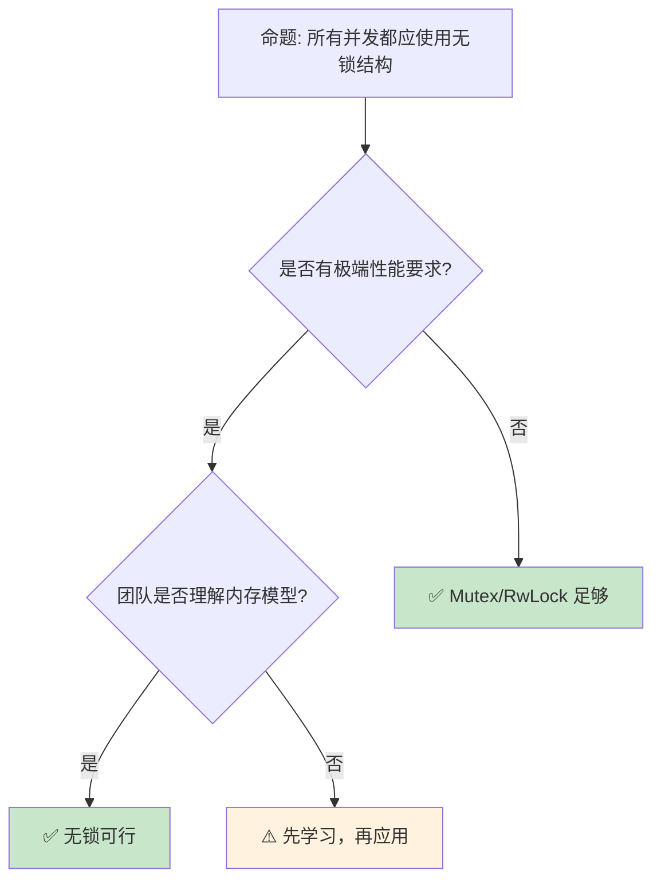
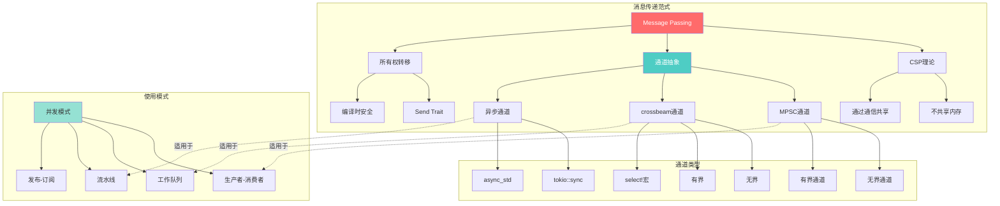
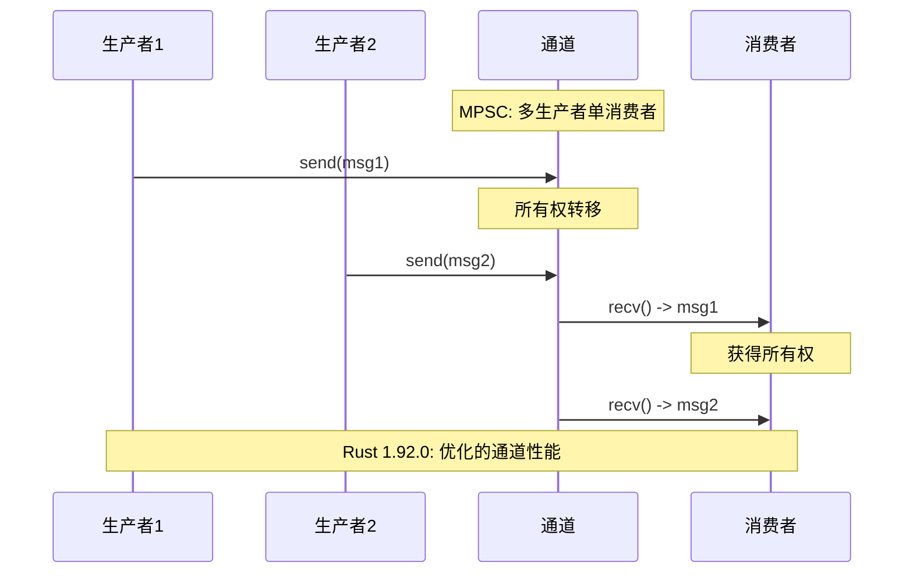
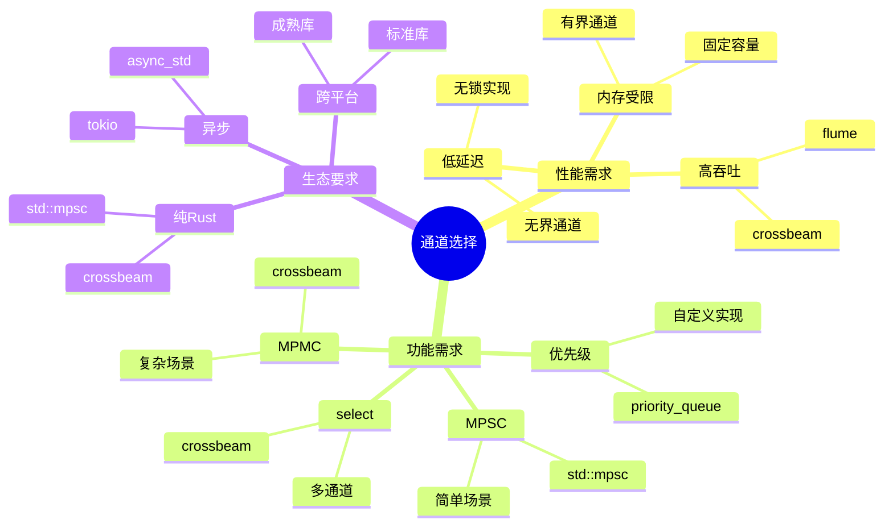

> **内容分级**: [专家级]

# 并发 模式：从消息 传递到锁自由的数据结构
>
> **EN**: Concurrency
> **Summary**: Concurrency — Advanced concurrency: actors, channels, lock-free structures, and memory ordering under ownership-based safety.
> **Rust 版本**: 1.97.0+ (Edition 2024)
> **受众**: [专家]
>
> **Bloom 层级**: L4-L5
> **权威来源**: 本文件为 `concept/` 权威页。
> **A/S/P 标记**: **S+P** — Structure + Procedure
> **双维定位**: C×Ana — 分析并发模式的设计意图
> **定位**: 深入分析 Rust **并发编程的高级模式**——从 Actor 模型、通道模式到无锁数据结构和内存序，揭示 Rust 所有权（Ownership）系统如何为并发安全（Concurrency Safety）提供编译期保证。
> **前置概念**: [Concurrency](01_concurrency.md) · [Async](../01_async/01_async.md) · [Type System](../../01_foundation/02_type_system/01_type_system.md) · [Closure Types](../../02_intermediate/04_types_and_conversions/02_closure_types.md)
> **后置概念**: [Distributed Systems](../../06_ecosystem/04_web_and_networking/01_distributed_systems.md) · [Lockfree](01_concurrency.md)

---

> **来源**: [The Rust Programming Language — Concurrency](https://doc.rust-lang.org/book/ch16-00-concurrency.html) · [rayon](https://docs.rs/rayon/latest/rayon/) · [RustBelt — POPL 2018](https://plv.mpi-sws.org/rustbelt/popl18/) · [O'Hearn — Separation Logic and Shared Mutable Data](https://doi.org/10.1017/S0960129501001003) · [Brown University — Interactive Rust Book](https://rust-book.cs.brown.edu/) · [Itanium C++ ABI](https://itanium-cxx-abi.github.io/cxx-abi/abi.html)
> [Rust Atomics and Locks](https://marabos.nl/atomics/) ·
> [crossbeam crate](https://docs.rs/crossbeam/latest/crossbeam/epoch/index.html) ·
> [rayon crate](https://docs.rs/rayon/latest/rayon/) ·
> [tokio::sync](https://docs.rs/crossbeam/latest/crossbeam/channel/index.html) ·
> [Wikipedia — Non-blocking Algorithm](https://en.wikipedia.org/wiki/Non-blocking_algorithm)
> **对应 Crate**: [`c05_threads`](../../crates/c05_threads)
> **对应练习**: [`exercises/src/concurrency/`](../../exercises/src/concurrency)

## 📑 目录

- [并发 模式：从消息 传递到锁自由的数据结构](#并发-模式从消息-传递到锁自由的数据结构)
  - [📑 目录](#-目录)
  - [一、核心概念](#一核心概念)
    - [1.1 所有权与并发的统一](#11-所有权与并发的统一)
    - [1.2 Send 与 Sync：编译期并发安全](#12-send-与-sync编译期并发安全)
    - [1.3 共享状态 vs 消息传递](#13-共享状态-vs-消息传递)
  - [二、技术细节](#二技术细节)
    - [2.1 通道模式](#21-通道模式)
    - [2.2 无锁数据结构](#22-无锁数据结构)
    - [2.3 内存顺序](#23-内存顺序)
  - [三、并发模式矩阵](#三并发模式矩阵)
  - [四、反命题与边界分析](#四反命题与边界分析)
    - [4.1 反命题树](#41-反命题树)
    - [4.2 边界极限](#42-边界极限)
  - [五、常见陷阱](#五常见陷阱)
    - [编译错误示例](#编译错误示例)
    - [4.4 边界测试：`ScopedThread` 中引用逃逸（编译错误）](#44-边界测试scopedthread-中引用逃逸编译错误)
    - [4.5 边界测试：`Condvar` 虚假唤醒未处理（逻辑错误）](#45-边界测试condvar-虚假唤醒未处理逻辑错误)
  - [六、来源与延伸阅读](#六来源与延伸阅读)
  - [相关概念](#相关概念)
  - [逆向推理链（Backward Reasoning）](#逆向推理链backward-reasoning)
  - [权威来源索引](#权威来源索引)
    - [10.3 边界测试：`crossbeam::channel` 的关闭检测与迭代终止（逻辑错误）](#103-边界测试crossbeamchannel-的关闭检测与迭代终止逻辑错误)
    - [10.4 边界测试：Send/Sync 的 auto trait 边界与线程安全（编译错误）](#104-边界测试sendsync-的-auto-trait-边界与线程安全编译错误)
  - [参考来源](#参考来源)
  - [补充视角：并发算法模式](#补充视角并发算法模式)
    - [并发计算模型](#并发计算模型)
    - [无锁数据结构](#无锁数据结构)
    - [并行设计模式](#并行设计模式)
    - [并发算法分析](#并发算法分析)
  - [认知路径](#认知路径)
    - [核心推理链](#核心推理链)
  - [实践](#实践)
    - [对应代码示例](#对应代码示例)
    - [建议练习](#建议练习)
  - [导航：下一步去哪？](#导航下一步去哪)
  - [嵌入式测验](#嵌入式测验)
    - [测验 1：并发模式识别（记忆层）](#测验-1并发模式识别记忆层)
    - [测验 2：Arc 引用计数（理解层）](#测验-2arc-引用计数理解层)
    - [测验 3：工作窃取模式（应用层）](#测验-3工作窃取模式应用层)
    - [测验 4：死锁预防（分析层）](#测验-4死锁预防分析层)
  - [补充视角：并发模式选择矩阵](#补充视角并发模式选择矩阵)
    - [模式适用场景](#模式适用场景)
    - [决策树](#决策树)
  - [补充视角：并发设计模式实践](#补充视角并发设计模式实践)
    - [模式特征对比](#模式特征对比)
    - [选择建议](#选择建议)
  - [迁移内容（来自 `crates/c05_threads/docs/03_message_passing.md`）](#迁移内容来自-cratesc05_threadsdocs03_message_passingmd)
  - [🎯 消息传递核心知识图谱](#-消息传递核心知识图谱)
    - [消息传递概念关系图](#消息传递概念关系图)
    - [通道数据流图](#通道数据流图)
  - [📊 通道类型多维对比](#-通道类型多维对比)
    - [标准库 vs 第三方库对比](#标准库-vs-第三方库对比)
    - [通道性能特征对比](#通道性能特征对比)
    - [接收方法对比](#接收方法对比)
  - [💡 思维导图：通道选择策略](#-思维导图通道选择策略)
  - [📋 快速参考](#-快速参考)
    - [常用通道API](#常用通道api)
    - [错误类型速查](#错误类型速查)
  - [迁移内容（来自 `crates/c05_threads/docs/10_message_passing.md`）](#迁移内容来自-cratesc05_threadsdocs10_message_passingmd)
  - [概述](#概述)
  - [Actor模型实现](#actor模型实现)
    - [1. 基础Actor框架](#1-基础actor框架)
    - [2. 高级Actor特性](#2-高级actor特性)
      - [2.1 监督策略](#21-监督策略)
      - [2.2 路由Actor](#22-路由actor)
  - [高级通道通信](#高级通道通信)
    - [1. 类型安全通道](#1-类型安全通道)
    - [2. 背压控制通道](#2-背压控制通道)
  - [发布订阅模式](#发布订阅模式)
    - [1. 类型安全的事件总线](#1-类型安全的事件总线)
    - [2. 异步事件流](#2-异步事件流)
  - [总结](#总结)
  - [这些模式充分利用了Rust 1.89的新特性，提供了高效、安全的消息传递解决方案](#这些模式充分利用了rust-189的新特性提供了高效安全的消息传递解决方案)
  - [补充视角：C05 Crate 并发模式实践](#补充视角c05-crate-并发模式实践)
    - [并行搜索提前返回](#并行搜索提前返回)
    - [细粒度锁：分桶缓存](#细粒度锁分桶缓存)
    - [读写锁分离的并发索引](#读写锁分离的并发索引)
    - [基于 `MaybeUninit` 的无锁单生产者单消费者队列](#基于-maybeuninit-的无锁单生产者单消费者队列)
    - [线程池与异步集成](#线程池与异步集成)

---

## 一、核心概念
>
>

### 1.1 所有权与并发的统一
>

```text
Rust 并发的核心洞察:

  所有权 → 并发安全:
  ├── 一个值只有一个所有者
  ├── 所有者移动到新线程 [来源: [std::thread](https://doc.rust-lang.org/std/thread/index.html)] → 值跟随移动
  ├── 无数据竞争（编译期保证）
  └── 无需 GC 或运行时检查

  借用 → 共享读取:
  ├── 多个不可变引用同时存在
  ├── 不可变引用可以跨线程共享
  ├── 读-读不冲突
  └── 编译期验证无写冲突

  可变借用 → 独占写入:
  ├── 一个可变引用独占访问
  ├── Mutex [来源: [std::sync::Mutex](https://doc.rust-lang.org/std/sync/struct.Mutex.html)] 包装可变引用
  ├── 运行时在锁保护下提供独占性
  └── 编译期验证正确传递

  统一模型:
  ┌─────────────────────────────────────────┐
  │  所有权规则（单线程）                    │
  │  ├─ 一个所有者                           │
  │  ├─ 多个不可变借用                       │
  │  └─ 一个可变借用（独占）                 │
  ├─────────────────────────────────────────┤
  │  并发扩展                                │
  │  ├─ 所有者跨线程移动（Send）            │
  │  ├─ 不可变借用跨线程共享（Sync）        │
  │  └─ 可变借用通过 Mutex/Arc [来源: [std::sync::Arc](https://doc.rust-lang.org/std/sync/struct.Arc.html)]Mutex 保护    │
  └─────────────────────────────────────────┘
```

> **认知功能**: Rust 的**并发安全（Concurrency Safety）不是独立的系统**——它是**所有权（Ownership）规则的自然延伸**。
> [来源: [TRPL — Concurrency](https://doc.rust-lang.org/book/ch16-00-concurrency.html)]

---

### 1.2 Send 与 Sync：编译期并发安全
>

```rust,ignore
// Send: 可以跨线程转移所有权
pub unsafe auto trait Send { }

// Sync: 可以跨线程共享引用 (&T is Send)
pub unsafe auto trait Sync { }

// 自动推导规则:
// ├── 原始类型: Send + Sync
// ├── 包含 Send 的类型: Send
// ├── 包含 Sync 的类型: Sync
// ├── 原始指针 (*const T, *mut T): !Send + !Sync
// ├── Rc<T>: !Send + !Sync（非原子引用计数）
// ├── Cell<T>: Send + !Sync（内部可变）
// └── RefCell<T>: !Send（运行时借用检查非线程安全）

// 手动实现（需要 unsafe）:
struct MyType(*mut c_void);

unsafe impl Send for MyType {}  // 我保证可以安全跨线程移动
unsafe impl Sync for MyType {}  // 我保证可以安全跨线程共享

// 使用场景:
// ├── Send: 将数据 move 到新线程
// ├── Sync: 多个线程同时读取共享数据
// └── 两者: Arc<Mutex<T>> 同时满足

// 编译期检查:
fn spawn_thread<T: Send + 'static>(data: T) {
    std::thread::spawn(move || {
        // data 在这里安全可用
    });
}
```

> **Send/Sync 洞察**: `Send` 和 `Sync` 是 Rust **并发安全（Concurrency Safety）的类型系统（Type System）根基**——它们将线程安全从文档约定提升为**编译期可验证的属性**。
> [来源: [std::marker::Send](https://doc.rust-lang.org/std/marker/trait.Send.html)]

---

### 1.3 共享状态 vs 消息传递
>

```text
两种并发模型:

  消息传递（Go 风格）:
  ├── 通道（Channel）传输数据
  ├── 所有权随消息转移
  ├── 无共享状态
  ├── 更容易推理
  └── 适合: 任务并行、流水线

  共享状态（传统风格）:
  ├── Mutex/RwLock [来源: [std::sync::RwLock](https://doc.rust-lang.org/std/sync/struct.RwLock.html)] 保护数据
  ├── Arc 共享所有权
  ├── 状态集中管理
  ├── 更细粒度控制
  └── 适合: 高性能缓存、计数器

  Rust 的融合:
  ├── 消息传递: std::sync::mpsc / crossbeam::channel [来源: [std::sync::mpsc](https://doc.rust-lang.org/std/sync/mpsc/index.html)]
  ├── 共享状态: Mutex + Arc
  ├── 混合使用: 通道传递 Arc
  └── 选择取决于场景

  代码对比:

  消息传递:
    let (tx, rx) = mpsc::channel();
    tx.send(data).unwrap();
    let received = rx.recv().unwrap();

  共享状态:
    let counter = Arc::new(Mutex::new(0));
    let counter2 = Arc::clone(&counter);
    thread::spawn(move || {
        *counter2.lock().unwrap() += 1;
    });
```

> **模型洞察**: Rust 的**所有权（Ownership）系统**使两种模型都可以**安全地实现**——消息传递自动转移所有权，共享状态通过类型系统（Type System）保证互斥。
> [来源: [Rust By Example — Concurrency](https://doc.rust-lang.org/rust-by-example/std_misc/threads.html)]

---

## 二、技术细节

并发模式的三个技术细节，分别对应「共享状态的三种替代方案」：

- **通道模式**：消息传递把「共享可变状态」转化为「所有权经消息流动」——`mpsc` 的 `send` 移动值的所有权，接收方成为新所有者。变体按拓扑分：SPSC（`mpsc` 退化情形）、MPMC（`crossbeam-channel`）、广播（`tokio::broadcast`，每个订阅者收全量）、oneshot（`tokio::sync::oneshot`，一次性应答）。通道把同步点从「锁」换成「消息边界」，死锁风险转化为「通道两端都阻塞」的活锁风险（同样需协议设计）。
- **无锁数据结构**：基于原子操作（Atomic Operations）与 CAS 循环（compare-exchange loop）实现并发容器——`Arc` 的计数、`crossbeam::epoch` 的内存回收、`dashmap` 的分片哈希。无锁 ≠ 无同步：内存序（memory ordering）是隐藏的契约，`Acquire`/`Release` 配对建立 happens-before，写错内存序的无锁代码是「编译通过的数据竞争」。
- **内存顺序**：`Ordering` 五级谱系——`Relaxed`（仅原子性，无顺序保证，计数器可用）、`Acquire`/`Release`（成对建立同步，锁的语义基础）、`AcqRel`（RMW 双向）、`SeqCst`（全序，最保守最易推理）。选型判定：只计数 → Relaxed；保护数据发布 → Acquire/Release 配对；不确定 → SeqCst（正确优先，x86 上成本几乎相同）。

三者的统一视角：并发正确性 = 对所有共享访问建立 happens-before 关系——通道经消息边界的同步建立，无锁经 Acquire/Release 建立，锁经 unlock-lock 建立。内存序是三者共同的底层语言。

### 2.1 通道模式
>

```rust,ignore
// 通道的类型与选择

use std::sync::mpsc;

// 1. 多生产者单消费者 (MPSC)
let (tx, rx) = mpsc::channel();
let tx2 = tx.clone();  // 多个发送者

// 2. 同步通道（有界容量）
let (tx, rx) = mpsc::sync_channel(100);  // 缓冲 100 个消息

// crossbeam 的无界/有界通道（更优）
use crossbeam::channel;
let (tx, rx) = channel::unbounded();  // 无界
let (tx, rx) = channel::bounded(100);  // 有界

// 通道模式:
// ├── 请求-响应: 两个通道（req, resp）
// ├── 广播: crossbeam::channel 不支持，用 bus crate
// ├── 工作窃取: crossbeam::deque
// └── select: 多路复用接收

// Select（crossbeam）:
use crossbeam::channel::select;

select! {
    recv(rx1) -> msg => println!("从 rx1: {:?}", msg),
    recv(rx2) -> msg => println!("从 rx2: {:?}", msg),
    default => println!("无消息"),
}

// async 通道（tokio）:
use tokio::sync::mpsc;
let (tx, mut rx) = mpsc::channel(100);
// 异步发送/接收
```

> **通道洞察**: **crossbeam 通道**是 Rust **同步并发**的标准选择——它比 std::sync::mpsc 更快且支持 select。
> [来源: [crossbeam::channel](https://docs.rs/crossbeam/latest/crossbeam/epoch/index.html)]

---

### 2.2 无锁数据结构
>

```text
无锁并发 primitives:

  Atomic 类型:
  ├── AtomicUsize / AtomicIsize
  ├── AtomicBool
  ├── AtomicPtr<T>
  └── 操作: load, store, swap, compare_exchange, fetch_add

  内存顺序:
  ├── Relaxed: 最弱，仅原子性
  ├── Acquire/Release: 同步点
  ├── AcqRel: 同时获取和释放
  └── SeqCst: 最强，顺序一致

  Lock-free 数据结构:
  ├── crossbeam::epoch: 基于epoch的内存回收
  ├── crossbeam::queue: MSQ 无锁队列
  └── 自定义: Atomic + unsafe

  示例（原子计数器）:
  use std::sync::atomic::{AtomicUsize, Ordering};

  let counter = AtomicUsize::new(0);
  counter.fetch_add(1, Ordering::Relaxed);
  let val = counter.load(Ordering::Acquire);

  何时使用无锁:
  ├── 极高并发（锁竞争严重）
  ├── 低延迟要求（无上下文切换）
  ├── 实时系统（避免锁的不可预测性）
  └── 但: 实现复杂，容易出错
```

> **无锁洞察**: Rust 的 **Atomic + unsafe** 使**无锁数据结构**可以安全地实现——但 `unsafe` 代码必须经过严格审查。
> [来源: [Rust Atomics and Locks](https://marabos.nl/atomics/)]

---

### 2.3 内存顺序
>

```rust,ignore
// 内存顺序详解

use std::sync::atomic::{AtomicBool, AtomicUsize, Ordering};

// 1. Relaxed: 仅保证原子性，无顺序约束
let x = AtomicUsize::new(0);
x.fetch_add(1, Ordering::Relaxed);

// 2. Acquire/Release: 成对同步
// 线程 A:
let data = vec![1, 2, 3];
let ptr = data.as_ptr();
DATA_PTR.store(ptr as usize, Ordering::Release);  // Release: 之前的写可见

// 线程 B:
let ptr = DATA_PTR.load(Ordering::Acquire) as *const i32;  // Acquire: 之后的读可见
if !ptr.is_null() {
    // 可以安全读取 *ptr（A 中 Release 之前的写已可见）
}

// 3. AcqRel: 同时获取和释放
// 用于 read-modify-write 操作
x.fetch_add(1, Ordering::AcqRel);

// 4. SeqCst: 顺序一致性
// 所有线程看到相同的操作顺序
// 最慢但最容易推理
x.store(1, Ordering::SeqCst);

// 选择指南:
// ├── 独立计数器: Relaxed
// ├── 标志位 + 数据传递: Acquire/Release
// ├── 复杂同步: SeqCst
// └── 不确定时用 SeqCst，确认瓶颈后再优化
```

> **内存序洞察**: **内存顺序是并发编程中最复杂的主题**——Rust 暴露这些细节使开发者可以**精确控制性能**，但也要求深入理解硬件内存模型。
> [source: [std::sync::atomic::Ordering](https://doc.rust-lang.org/std/sync/atomic/enum.Ordering.html)]

---

## 三、并发模式矩阵

```text
场景 → 方案 → 工具

任务并行:
  → rayon::join / par_iter
  → 数据并行，自动工作窃取
  → v.par_iter().map(|x| x * 2).sum()

生产者-消费者:
  → crossbeam::channel
  → 有界/无界通道
  → 背压控制

读者-写者:
  → RwLock
  → 多读单写
  → 注意写者饥饿

状态机并发:
  → Actor 模型 (actix)
  → 消息驱动，状态隔离
  → 每个 Actor 单线程

无锁队列:
  → crossbeam::queue::SegQueue
  → 多生产者多消费者
  → 无锁，无阻塞

定时任务:
  → tokio::time::interval
  → 异步超时和间隔
  → 与 async/await 集成
```

> **模式矩阵**: Rust 的**并发生态**覆盖了从**高层数据并行**（rayon）到**底层无锁**（crossbeam）的全谱系。
> [source: [rayon crate](https://docs.rs/rayon/latest/rayon/)]

---

## 四、反命题与边界分析

并发模式的反命题树针对五个高频误解，每条给出判定与边界：

- **反命题 1：「加锁就线程安全」**。判定：锁只保护「被同一把锁覆盖的访问」——字段级部分加锁（锁 A 保护字段 a、锁 B 保护字段 b，但不变量跨 a/b）仍竞争。边界：锁粒度与不变量粒度必须一致，「不变量涉及哪些字段」决定「需要同一把锁覆盖哪些访问」。
- **反命题 2：「无锁一定比有锁快」**。判定：CAS 循环在高竞争下退化为自旋风暴（cache line ping-pong），`Mutex` 在无竞争时约 20ns 与现代 CAS 相当。边界：无锁的优势在「读多写少 + 低竞争 + 不可阻塞（如信号处理器/中断语境）」，高竞争写密集场景分片锁（`DashMap`）常优于纯无锁。
- **反命题 3：「消息传递没有死锁」**。判定：双向同步通道两端互等（A 发等 B 收、B 发等 A 收）是活锁/死锁的同构现象。边界：消息协议需「方向分层」（请求/应答严格配对）或有界缓冲 + 超时。
- **反命题 4：「`Relaxed` 够用」**。判定：`Relaxed` 只保证单变量操作原子，不建立跨变量顺序——「数据 + 就绪标志」模式用 Relaxed 可能读到新标志配旧数据。边界：涉及「一个原子发布、其他数据跟随」必须用 Acquire/Release 配对。

每条反命题的验证方法：构造「两线程 × 特定交错」的最小反例，用 `loom` 工具穷举交错验证（loom 能系统枚举（Enum）弱内存序下的全部可见结果）。

### 4.1 反命题树
>



> **认知功能**: **无锁不是默认选择**——只有在**性能测量**证明锁是瓶颈，且团队有能力正确实现时，才使用无锁。
> [来源: [Rust Reference](https://doc.rust-lang.org/reference/introduction.html)]
> [source: [Rust Atomics and Locks — When to Use](https://mara.nl/atomics/atomics.html)]

---

### 4.2 边界极限
>

```text
边界 1: 死锁
├── Rust 不能编译期防止死锁
├── 运行时仍可能死锁
├── 需要设计层面的避免策略
└── 缓解: 锁顺序、超时、try_lock

边界 2: 优先级反转
├── 低优先级线程持有锁
├── 高优先级线程等待
├── 实时系统问题
└── 缓解: 优先级继承、无锁结构

边界 3: 伪共享（False Sharing）
├── 不同 CPU 核心访问同一缓存行的不同变量
├── 性能骤降
├── Rust 无自动防护
└── 缓解: cache-padding（crossbeam::util::CachePadded）

边界 4: ABA 问题
├── 无锁算法中的经典问题
├── 指针被释放后重新分配
├── 比较操作误判
└── 缓解: epoch-based GC, tagged pointers

边界 5: 调试困难
├── 并发 bug 难以复现
├── race condition 取决于时序
├── 传统调试器帮助有限
└── 缓解: loom model checker, TSan
```

> **边界要点**: 并发编程的边界主要与**死锁**、**优先级反转**、**伪共享**、**ABA** 和**调试**相关。
> [source: [crossbeam::epoch](https://docs.rs/crossbeam/latest/crossbeam/epoch/index.html)]

---

## 五、常见陷阱

```text
陷阱 1: 在持有锁时调用用户代码
  ❌ let data = mutex.lock().unwrap();
     callback(&data);  // 回调可能 panic 或死锁！

  ✅ let data = mutex.lock().unwrap().clone();
     drop(data);  // 先释放锁
     callback(&data);

陷阱 2: 忘记 Arc
  ❌ let data = Mutex::new(vec![]);
     thread::spawn(move || { data.lock(); });
     // Mutex 被 move，主线程无法使用

  ✅ let data = Arc::new(Mutex::new(vec![]));
     let data2 = Arc::clone(&data);
     thread::spawn(move || { data2.lock(); });

陷阱 3: 锁粒度不当
  ❌ 一个大 Mutex 保护所有数据
     // 串行化所有操作

  ✅ 细粒度锁，或按功能分区
     // 或使用 lock-free 结构

陷阱 4: 阻塞在 async 中
  ❌ async fn bad() {
         let data = mutex.lock().unwrap();  // 阻塞线程！
     }

  ✅ async fn good() {
         let data = async_mutex.lock().await;  // tokio::sync::Mutex
     }

陷阱 5: 忽略内存序
  ❌ flag.store(true, Ordering::Relaxed);
     // 其他线程可能看不到更新

  ✅ flag.store(true, Ordering::Release);
     // 配对的 Acquire 保证可见性
```

> **陷阱总结**: 并发陷阱主要与**锁内回调**、**Arc 遗漏**、**锁粒度**、**async 阻塞**和**内存序**相关。
> [source: [Common Rust Concurrency Mistakes](https://rust-unofficial.github.io/too-many-lists/)]

### 编译错误示例

```rust,compile_fail
use std::sync::Mutex;
use std::thread;

fn mutex_guard_lifetime() {
    let data = Mutex::new(0);
    let guard = data.lock().unwrap();
    // ❌ 编译错误: `MutexGuard` 不能跨线程发送
    // 某些平台/实现中 `MutexGuard` 不实现 `Send`
    thread::spawn(move || {
        println!("{}", *guard);
    });
}
```

> **修正**: 避免将 `MutexGuard` 移动到闭包（Closures）中。若需跨线程共享数据，使用 `Arc<Mutex<T>>` 并在每个线程中独立 `lock()`。

```rust,compile_fail
use std::sync::Arc;
use std::cell::RefCell;

fn arc_refcell_thread() {
    let data = Arc::new(RefCell::new(0));
    let data2 = Arc::clone(&data);
    // ❌ 编译错误: `RefCell<i32>` 未实现 `Sync`
    // Arc<T> 要求 T: Sync 才能安全跨线程共享
    std::thread::spawn(move || {
        *data2.borrow_mut() += 1;
    });
}
```

> **修正**: `RefCell` 提供单线程内部可变性。跨线程场景必须使用 `Mutex<T>`、`RwLock<T>` 或原子类型。

```rust,compile_fail
use std::thread;

fn thread_spawn_lifetime() {
    let data = vec![1, 2, 3];
    // ❌ 编译错误: `data` 的生命周期不够长
    // thread::spawn 要求闭包是 'static
    let handle = thread::spawn(|| {
        println!("{:?}", data);
    });
    drop(data); // data 可能在此 drop
    handle.join().unwrap();
}
```

> **修正**: `thread::spawn` 要求闭包（Closures）满足 `'static` 生命周期（Lifetimes）。引用（Reference）栈数据必须通过 `move` 闭包转移所有权（Ownership），或使用 `crossbeam::scope` 进行有界线程。

### 4.4 边界测试：`ScopedThread` 中引用逃逸（编译错误）

```rust,compile_fail
use std::thread;

fn scoped_borrow() {
    let mut data = vec![1, 2, 3];
    // ❌ 编译错误: `data` 的生命周期不够长
    // thread::scope 要求闭包在 scope 结束前完成
    let handle = thread::spawn(|| {
        data.push(4); // 闭包捕获 &mut data
    });
    // handle 可能在 scope 外被 join
    // 标准库 thread::spawn 要求 'static
}

// 正确: 使用 crossbeam::scope 或 std::thread::scope (Rust 1.63+)
fn scoped_fixed() {
    let mut data = vec![1, 2, 3];
    std::thread::scope(|s| {
        s.spawn(|| {
            data.push(4); // ✅ scope 保证线程在作用域结束前 join
        });
    }); // 所有子线程在此 join
    println!("{:?}", data);
}
```

> **修正**: `std::thread::scope`（Rust 1.63+）允许创建非 `'static` 线程，保证所有子线程在 scope 结束时 join。这通过编译期生命周期（Lifetimes）检查实现——闭包（Closures）借用（Borrowing）栈数据的生命周期与 scope 绑定。[来源: [Rust Standard Library](https://doc.rust-lang.org/std/index.html)]

### 4.5 边界测试：`Condvar` 虚假唤醒未处理（逻辑错误）

```rust,ignore
use std::sync::{Arc, Mutex, Condvar};
use std::thread;

fn main() {
    let pair = Arc::new((Mutex::new(false), Condvar::new()));
    let pair2 = Arc::clone(&pair);

    thread::spawn(move || {
        let (lock, cvar) = &*pair2;
        let mut started = lock.lock().unwrap();
        *started = true;
        cvar.notify_one();
    });

    let (lock, cvar) = &*pair;
    let mut started = lock.lock().unwrap();
    // ⚠️ 逻辑错误: 直接用 if 检查条件
    if !*started {
        let _ = cvar.wait(started).unwrap(); // 虚假唤醒后不会重新检查
    }
    // 可能因虚假唤醒而提前退出
}

// 正确: 始终使用 while 循环
fn fixed() {
    let pair = Arc::new((Mutex::new(false), Condvar::new()));
    let pair2 = Arc::clone(&pair);

    thread::spawn(move || {
        let (lock, cvar) = &*pair2;
        let mut started = lock.lock().unwrap();
        *started = true;
        cvar.notify_one();
    });

    let (lock, cvar) = &*pair;
    let mut started = lock.lock().unwrap();
    while !*started { // ✅ 虚假唤醒后重新检查条件
        started = cvar.wait(started).unwrap();
    }
}
```

> **修正**: `Condvar::wait` 可能因"虚假唤醒"（spurious wakeup）而在未被 `notify` 时返回。必须始终使用 `while` 循环而非 `if` 检查条件，确保在虚假唤醒后重新验证条件。[来源: [Rust Standard Library](https://doc.rust-lang.org/std/index.html)]

---

## 六、来源与延伸阅读
>

| 来源 | 可信度 | 说明 |
| [Rust Standard Library](https://doc.rust-lang.org/std/index.html) | ✅ 一级 | 标准库参考 |
| [Rust By Example](https://doc.rust-lang.org/rust-by-example/index.html) | ✅ 一级 | 交互式教程 |
| [This Week in Rust](https://this-week-in-rust.org/) | ✅ 二级 | 社区动态 |

| [Rust Reference](https://doc.rust-lang.org/reference/introduction.html) | ✅ 一级 | 语言参考 |
|:---|:---:|:---|
| [Rust Atomics and Locks](https://marabos.nl/atomics/) | ✅ 一级 | 并发权威 |
| [TRPL — Concurrency](https://doc.rust-lang.org/book/ch16-00-concurrency.html) | ✅ 一级 | 基础教程 |
| [crossbeam](https://docs.rs/crossbeam/latest/crossbeam/epoch/index.html) | ✅ 一级 | 无锁并发 |
| [rayon](https://docs.rs/rayon/latest/rayon/) | ✅ 一级 | 数据并行 |
| [tokio::sync](https://docs.rs/crossbeam/latest/crossbeam/channel/index.html) | ✅ 一级 | 异步（Async）同步 |

---

## 相关概念

- [Concurrency](01_concurrency.md) — 并发基础
- [Async](../01_async/01_async.md) — 异步编程
- [Distributed Systems](../../06_ecosystem/04_web_and_networking/01_distributed_systems.md) — 分布式系统

---

> **权威来源**: [Rust Reference](https://doc.rust-lang.org/reference/introduction.html), [The Rust Programming Language](https://doc.rust-lang.org/book/ch16-00-concurrency.html)
>
> **权威来源对齐变更日志**: 2026-05-22 创建 [Authority Source Sprint Batch 10](../../00_meta/02_sources/05_international_authority_index.md)

**文档版本**: 1.0
**最后更新**: 2026-05-22
**状态**: ✅ 概念文件创建完成

---

## 逆向推理链（Backward Reasoning）

> **从编译错误反推**：
>
> ```text
> 并发模式安全 ⟸ Send/Sync + 锁协议
> ```
>
## 权威来源索引

>
>
>
>
>
>

---

### 10.3 边界测试：`crossbeam::channel` 的关闭检测与迭代终止（逻辑错误）

```rust,compile_fail
use crossbeam::channel::bounded;

fn main() {
    let (tx, rx) = bounded::<i32>(10);

    tx.send(1).unwrap();
    tx.send(2).unwrap();
    drop(tx); // 关闭发送端

    // ❌ 逻辑错误: 未检测 channel 关闭，迭代器提前终止不通知
    for msg in rx.iter() {
        println!("{}", msg);
    }
    println!("done"); // 会执行，但无显式关闭通知
}
```

> **修正**: `crossbeam::channel` 的关闭语义：
>
> 1) 所有 `Sender` drop → `Receiver::recv()` 返回 `Err(RecvError)`（Disconnected）；
> 2) `Receiver::iter()` 在 channel 关闭且所有消息消费完后终止；
> 3) 无显式"关闭信号"——需协议层实现（发送特殊 sentinel 值）。
> 与 `std::sync::mpsc` 的区别：`crossbeam` 支持多生产者/多消费者、无界和有界 channel、选择（`select!`）。
> 有界 channel 的 `send` 在满时阻塞（或超时），防止无限内存增长。
> 这与 Go 的 channel（语言原生，自动处理关闭和 range 迭代）或 Tokio 的 `mpsc`（异步（Async），背压控制）不同——Rust 的 channel 库多样，`crossbeam` 是同步场景的性能最优选择。
> [来源: [crossbeam-channel](https://docs.rs/crossbeam-channel/)] · [来源: [Rust Atomics and Locks](https://marabos.nl/atomics/)]

### 10.4 边界测试：Send/Sync 的 auto trait 边界与线程安全（编译错误）

```rust,compile_fail,compute_fail
use std::rc::Rc;
use std::thread;

fn main() {
    let data = Rc::new(42);
    // ❌ 编译错误: Rc<i32> 未实现 Send，不能跨线程传递
    thread::spawn(move || {
        println!("{}", data);
    }).join().unwrap();
}
```

> **修正**:
> **`Send`** 和 **`Sync`** 是 auto trait：
>
> 1) `Send` — 类型可安全转移到其他线程；
> 2) `Sync` — 类型可安全被多线程共享引用（Reference）（`&T` 是 `Send`）；
> 3) `Rc<T>` 既不是 `Send` 也不是 `Sync`（引用计数非原子）。
>
> 线程安全替代：
>
> 1) `Arc<T>` — 原子引用计数，实现 `Send + Sync`（若 `T: Send + Sync`）；
> 2) `Mutex<T>` / `RwLock<T>` — 互斥访问；
> 3) `mpsc` / `crossbeam` channel — 消息传递。
>
> 自定义类型的线程安全：
>
> 1) 包含 `Send` 字段 → 自动 `Send`；
> 2) 包含 `Rc` / `Cell` / `RefCell` → 自动 `!Send`；
> 3) 可 `unsafe impl Send for MyType {}`（需手动保证）。
> 这与 Go 的 goroutine（所有数据可共享，通过 channel 或 mutex 协调）或 Java 的 `synchronized`（所有对象有 monitor，编译器不检查线程安全）不同
> ——Rust 的 `Send`/`Sync` 是编译期线程安全检查。
> [来源: [The Rust Programming Language](https://doc.rust-lang.org/book/ch16-04-extensible-concurrency-sync-and-send.html)] · [来源: [Rustonomicon — Send and Sync](https://doc.rust-lang.org/nomicon/send-and-sync.html)]

## 参考来源

> [来源: [Tokio Concurrency Primitives](https://tokio.rs/tokio/tutorial/shared-state)]
> [来源: [Rustonomicon — Concurrency](https://doc.rust-lang.org/nomicon/concurrency.html)]
> [来源: [Herlihy & Shavit — Art of Multiprocessor Programming](https://dl.acm.org/doi/book/10.5555/2385452)]
> [来源: [RFC 0458 — Send and Sync](https://rust-lang.github.io/rfcs//0458-send-improvements.html)]
> **权威来源**: [Rust Reference](https://doc.rust-lang.org/reference/introduction.html) · [The Rust Programming Language](https://doc.rust-lang.org/book/ch16-00-concurrency.html) · [Rust Standard Library](https://doc.rust-lang.org/std/index.html) · [Rustonomicon](https://doc.rust-lang.org/nomicon/index.html)

## 补充视角：并发算法模式

> migrated from `crates/c08_algorithms/docs/tier_04_advanced/02_concurrent_algorithm_patterns.md`

### 并发计算模型

| 模型 | 核心思想 | Rust 表达 | 适用场景 |
|:---|:---|:---|:---|
| Actor 模型 | 独立计算单元通过消息传递通信 | `tokio::sync::mpsc` + 任务 | 分布式/容错系统 |
| CSP | 通过 channel 进行同步通信 | `std::sync::mpsc` / `crossbeam::channel` | 流水线、素数筛 |
| Reactor 模式 | 事件驱动的异步 I/O 处理 | `tokio::net::TcpListener` + `tokio::spawn` | 高并发网络服务 |

### 无锁数据结构

无锁（lock-free）数据结构通过原子操作（Atomic Operations）（`AtomicPtr`、`AtomicUsize`）而非互斥锁实现并发访问，典型代表为 **Michael-Scott 无锁队列**。关键问题包括：

- **ABA 问题**：CAS 检查通过但中间状态被修改；解决方案包括带标签指针（tagged pointer）和 Hazard Pointer。
- **内存序**：`Acquire`/`Release` 配对保证 happens-before 关系，`SeqCst` 提供全局顺序。

### 并行设计模式

- **数据并行**：同一操作作用于数据的不同部分（`rayon::join` / `par_iter`）。
- **任务并行**：独立任务分发到多个线程（`tokio::spawn`）。
- **流水线并行**：阶段化计算通过 channel 传递中间结果。

### 并发算法分析

- **加速比 (Speedup)**：S(p) = T₁ / Tₚ
- **效率 (Efficiency)**：E(p) = S(p) / p
- **工作深度模型**：工作 (Work) = 总操作数；深度 (Span) = 关键路径长度。

## 认知路径

> **认知路径**: 从 L0 基础概念出发，经由本节的 **并发 模式：从消息 传递到锁自由的数据结构** 核心原理，通向 L2 进阶模式与 L3 工程实践。

### 核心推理链

| 定理 | 前提 | 结论 | 置信度 |
|:---|:---|:---|:---|
| 并发 模式：从消息 传递到锁自由的数据结构 基础定义 ⟹ 正确用法 | 理解语法与语义 | 能写出符合惯用法的代码 | 高 |
| 并发 模式：从消息 传递到锁自由的数据结构 正确用法 ⟹ 常见陷阱 | 忽略边界条件 | 编译错误或运行时（Runtime） bug | 高 |
| 并发 模式：从消息 传递到锁自由的数据结构 常见陷阱 ⟹ 深度掌握 | 系统学习反模式 | 能进行代码审查与优化 | 高 |

> 无数据竞争 ⟸ Send/Sync 正确实现 ⟸ 类型系统（Type System）验证
> 死锁避免 ⟸ 锁顺序协议 ⟸ 类型状态机

---

## 实践

> 将本节概念转化为可编译代码。

### 对应代码示例

- **[crates/c05_threads](../../../crates/c05_threads)** — 与本节概念对应的可编译 crate 示例

### 建议练习

1. 阅读 `crates/c05_threads/` 中与"并发设计模式"相关的源码和示例
2. 运行 `cargo test -p c05_threads` 验证理解

---

## 导航：下一步去哪？

> **自检**：你当前掌握的核心概念是否已能独立应用？

| 选择 | 条件 | 目标 |
|:---|:---|:---|
| 🔙 巩固基础 | 仍有模糊概念 | 回到 [L2 对应主题](../02_intermediate) 或 [MVP 学习路径](../../00_meta/04_navigation/08_learning_mvp_path.md) |
| 🔜 深入 L3 其他主题 | 想扩展高级技能 | [L3 README](../README.md) 选择其他主题 |
| 🎓 进入 L4 形式化 | 想理解"为什么"的数学证明 | [L4 形式化](../../04_formal/README.md) |
| 🏗️ 进入 L6 生态 | 想掌握生产工具链 | [L6 生态](../../06_ecosystem/README.md) |

---

## 嵌入式测验

本节 4 道测验覆盖并发模式的核心判别能力，按认知层级递进：

- 测验 1（记忆层）：模式识别——给定场景描述判定属于共享状态、消息传递还是工作窃取模式；
- 测验 2（理解层）：`Arc` 引用计数的原子性边界——为什么 `Arc<Mutex<T>>` 组合是共享状态并发的标准模式，而 `Rc` 跨线程直接编译失败；
- 测验 3（应用层）：工作窃取——rayon 的 `join`/`par_iter` 如何把递归分解映射到窃取队列；
- 测验 4（分析层）：死锁预防——从「锁顺序」「锁粒度」「持锁时长」三要素分析给定的双锁代码。

作答建议：测验 4 先画出锁获取顺序图再找环——死锁分析的形式化本质就是有向图环检测。

### 测验 1：并发模式识别（记忆层）

**题目**: 以下场景最适合哪种并发模式？

| 场景 | 最佳模式 |
|:---|:---|
| 多个线程读取共享配置，偶尔更新 | A. `Mutex<T>` |
| 多个线程同时读取和写入共享缓存 | B. `RwLock<T>` |
| 一个线程生产任务，多个线程消费 | C. `mpsc::channel` |
| 多个线程竞争执行一次性初始化 | D. `std::sync::OnceLock` |

- A. 1-A, 2-B, 3-C, 4-D
- B. 1-B, 2-A, 3-C, 4-D
- C. 1-B, 2-B, 3-C, 4-D
- D. 1-D, 2-A, 3-B, 4-C

<details>
<summary>✅ 答案与解析</summary>

**正确答案是 B**。

| 场景 | 最佳模式 | 原因 |
|:---|:---|:---|
| 多线程读取、偶尔更新 | **`RwLock<T>`** | 读操作可并发，写操作独占 |
| 同时读写共享缓存 | **`Mutex<T>`** | 读写都频繁时，`RwLock` 的升级/降级开销反而更差 |
| 生产者-消费者 | **`mpsc::channel`** | 天然的消息传递，无锁竞争 |
| 一次性初始化 | **`OnceLock`** | 线程安全的惰性初始化，初始化后零开销 |

**RwLock vs Mutex 的选择指南**：

```rust,ignore
use std::sync::{Mutex, RwLock};

// 场景1: 读多写少 → RwLock
let config: RwLock<Config> = RwLock::new(Config::default());
{
    let _guard = config.read().unwrap();  // 多个读锁可并发
}
{
    let mut _guard = config.write().unwrap();  // 写锁独占
}

// 场景2: 读写都频繁 → Mutex（更简单，无死锁风险）
let cache: Mutex<Cache> = Mutex::new(Cache::default());
```

> **陷阱**: `RwLock` 在写操作频繁时会**饿死读者**或**饿死写者**（取决于实现）。Tokio 的 `RwLock` 是公平锁，但 std 的 `RwLock` 平台依赖。
</details>

---

### 测验 2：Arc 引用计数（理解层）

**题目**: 以下代码能否编译？如果不能，为什么？

```rust,compile_fail
use std::sync::Arc;
use std::thread;

fn main() {
    let data = Arc::new(vec![1, 2, 3]);

    let handle = thread::spawn(move || {
        println!("{:?}", data);
    });

    println!("{:?}", data);  // 还能用吗？
    handle.join().unwrap();
}
```

- A. 可以编译，`Arc` 自动实现了 `Copy`
- B. 不能编译，`move` 将 `data` 移入闭包（Closures），主线程无法再使用
- C. 可以编译，`Arc` 的 `clone()` 在 `move` 闭包（Closures）中自动调用
- D. 不能编译，需要先 `let data2 = Arc::clone(&data)` 再 `move`

<details>
<summary>✅ 答案与解析</summary>

**正确答案是 B**。

**问题**：`move ||` 闭包会将捕获的变量**所有权移入**闭包（Closures）。`Arc` 没有实现 `Copy`，所以 `data` 被移动后，主线程无法再使用。

**修复方案**：

```rust
use std::sync::Arc;
use std::thread;

fn main() {
    let data = Arc::new(vec![1, 2, 3]);

    // 关键：先 clone Arc，增加引用计数
    let data_clone = Arc::clone(&data);

    let handle = thread::spawn(move || {
        println!("线程: {:?}", data_clone);
    });

    // 主线程仍可使用原始 data
    println!("主线程: {:?}", data);
    handle.join().unwrap();

    // 两个 Arc 都 drop 后，内部数据才被释放
}
```

**`Arc::clone(&data)` 的本质**：

```rust,ignore
// 不是深拷贝！只是增加引用计数
impl<T> Clone for Arc<T> {
    fn clone(&self) -> Self {
        // 原子操作: ref_count += 1
        self.inner().ref_count.fetch_add(1, Relaxed);
        Arc { ptr: self.ptr }
    }
}
```

**常见模式**：

```rust,ignore
// N 个线程共享同一数据
let data = Arc::new(Mutex::new(0));
let mut handles = vec![];

for _ in 0..10 {
    let d = Arc::clone(&data);
    handles.push(thread::spawn(move || {
        let mut num = d.lock().unwrap();
        *num += 1;
    }));
}

for h in handles { h.join().unwrap(); }
assert_eq!(*data.lock().unwrap(), 10);
```

> **关键洞察**: `Arc` 解决"数据该由谁释放"的问题，`Mutex`/`RwLock` 解决"数据如何安全访问"的问题。两者常配合使用，但职责不同。
</details>

---

### 测验 3：工作窃取模式（应用层）

**题目**: 以下代码使用 Rayon 的 `join` 实现了并行快速排序。`rayon::join` 的核心优势是什么？

```rust,ignore
use rayon::prelude::*;

fn quicksort(arr: &mut [i32]) {
    if arr.len() <= 1 { return; }

    let pivot = partition(arr);
    let (left, right) = arr.split_at_mut(pivot);

    rayon::join(
        || quicksort(left),
        || quicksort(right),
    );
}
```

- A. `join` 自动选择更快的分支先执行
- B. `join` 将两个闭包（Closures）分发到不同线程，利用工作窃取调度器平衡负载
- C. `join` 保证左分支总是先于右分支完成
- D. `join` 只是语法糖，等价于顺序执行两个闭包（Closures）

<details>
<summary>✅ 答案与解析</summary>

**正确答案是 B**。

**Rayon 的工作窃取调度器**：

```
线程1: [taskA] [taskB] [taskC] ← 本地队列
线程2: [taskD] ← 队列为空时，从线程1"窃取"任务
```

| 特性 | 说明 |
|:---|:---|
| **工作窃取** | 空闲线程从忙碌线程的队列尾部"偷"任务，避免负载不均 |
| **fork-join** | `rayon::join` 创建子任务，完成后自动汇合 |
| **线程池复用** | Rayon 全局线程池（默认 = CPU 核心数），避免频繁创建线程 |
| **无锁队列** | 每个线程的双端队列：本地 push/pop（无锁），窃取端（CAS）|

**为什么不用 `thread::spawn`**：

```rust,ignore
// 错误示范：每次递归都创建新线程，开销巨大
thread::spawn(|| quicksort(left));
thread::spawn(|| quicksort(right));
// 1000 个元素的快速排序可能创建 1000+ 个线程！

// Rayon 的优化：
// - 小任务内联执行（不创建线程）
// - 大任务才分发给线程池
// - 任务粒度由调度器自动决定
```

**Rayon 的阈值优化**：

```rust,ignore
fn quicksort(arr: &mut [i32]) {
    if arr.len() <= 10_000 {
        // 小数组：顺序排序更快（避免线程切换开销）
        arr.sort_unstable();
        return;
    }
    // 大数组：并行分治
    let pivot = partition(arr);
    let (left, right) = arr.split_at_mut(pivot);
    rayon::join(|| quicksort(left), || quicksort(right));
}
```

> **核心洞察**: 并行不是越多越好。Rayon 的调度器自动处理任务粒度、负载平衡和线程管理，开发者只需关注"哪些任务可以并行"。
</details>

---

### 测验 4：死锁预防（分析层）

**题目**: 以下代码存在死锁风险。问题在哪里？如何修复？

```rust
use std::sync::Mutex;

struct Account {
    balance: Mutex<i32>,
}

fn transfer(from: &Account, to: &Account, amount: i32) {
    let mut from_balance = from.balance.lock().unwrap();
    let mut to_balance = to.balance.lock().unwrap();

    *from_balance -= amount;
    *to_balance += amount;
}

fn main() {
    let a = Account { balance: Mutex::new(100) };
    let b = Account { balance: Mutex::new(100) };

    std::thread::scope(|s| {
        s.spawn(|| transfer(&a, &b, 10));
        s.spawn(|| transfer(&b, &a, 20));  // 潜在死锁！
    });
}
```

- A. 没有死锁风险，`Mutex` 会自动处理
- B. 线程1先锁a再锁b，线程2先锁b再锁a，形成循环等待 → 死锁
- C. 应该用 `RwLock` 替代 `Mutex` 避免死锁
- D. 应该用 `std::sync::atomic::AtomicI32` 替代 `Mutex`

<details>
<summary>✅ 答案与解析</summary>

**正确答案是 B**。

**死锁四条件（Coffman 条件）**：

| 条件 | 本例 |
|:---|:---|
| 互斥 | `Mutex` 保证 |
| 占有且等待 | 线程1持有 `a.lock()`，等待 `b.lock()` |
| 不可抢占 | `Mutex` 不支持强制释放 |
| 循环等待 | 线程1: a→b，线程2: b→a |

**修复方案 — 统一加锁顺序**：

```rust,ignore
use std::sync::Mutex;

fn transfer(from: &Account, to: &Account, amount: i32) {
    // 方案1: 按内存地址排序加锁
    let (first, second) = if from as *const _ < to as *const _ {
        (from, to)
    } else {
        (to, from)
    };

    let mut first_balance = first.balance.lock().unwrap();
    let mut second_balance = second.balance.lock().unwrap();

    // 现在锁顺序总是按地址升序，无循环等待
    // ... 执行转账
}
```

**或者使用 `parking_lot::deadlock` 检测**（开发环境）：

```rust,ignore
// parking_lot 提供死锁检测功能
parking_lot::deadlock::check();
```

**更优方案 — 无锁转账**：

```rust
use std::sync::atomic::{AtomicI32, Ordering};

struct Account {
    balance: AtomicI32,
}

fn transfer(from: &Account, to: &Account, amount: i32) {
    from.balance.fetch_sub(amount, Ordering::Relaxed);
    to.balance.fetch_add(amount, Ordering::Relaxed);
}
// 无锁 = 无死锁！但无法保证原子性（中间状态可见）
```

> **生产环境法则**: 多锁场景必须定义全局顺序（如资源ID升序）。如果无法定义顺序，考虑：a) 使用无锁结构 b) 使用 `try_lock` 超时重试 c) 使用事务内存（如 `stm` crate）。
</details>

---

> **测验设计来源**: [Bloom Taxonomy 2001] · [TRPL Ch16](https://doc.rust-lang.org/book/ch16-00-concurrency.html) · [Rayon Docs](https://docs.rs/rayon/) · [Brown University Interactive TRPL](https://rust-book.cs.brown.edu/ch16-00-concurrency.html)

---

## 补充视角：并发模式选择矩阵

> 本节选编自 `crates/c05_threads/docs/05_concurrency_patterns.md`，
> 作为 canonical 并发模式概念页的工程实践补充。

### 模式适用场景

| 模式 | 最佳场景 | 不适用 | 关键 crate |
| :--- | :--- | :--- | :--- |
| 异步迭代器（Iterator） | 流式网络 I/O、事件流 | CPU 密集计算 | `futures`、`tokio::sync` |
| 工作窃取 | CPU 密集并行计算 | I/O 等待型任务 | `rayon` |
| 分治算法 | 排序、搜索、递归分解 | 无法分解的问题 | `rayon` |
| 流水线 | 顺序阶段处理、数据转换 | 随机访问模式 | `crossbeam::channel` |
| 事件驱动 | GUI、游戏循环、IoT | 硬实时系统 | `tokio`、`mio` |
| 响应式编程 | 复杂事件流、数据绑定 | 简单顺序逻辑 | `futures`、`tokio::sync` |

### 决策树

1. 任务类型是 I/O 密集还是 CPU 密集？
   - I/O 密集 → 优先考虑异步或事件驱动。
   - CPU 密集 → 优先考虑工作窃取或分治。
2. 是否需要跨阶段数据流？
   - 是 → 流水线或响应式流。
3. 状态是否集中？
   - 是且需共享 → Actor 或 `Arc<Mutex<T>>`。
   - 否且可分解 → Fork-Join。

---

## 补充视角：并发设计模式实践

> 本节选编自 `crates/c09_design_pattern/docs/tier_02_guides/05_concurrency_patterns_guide.md`，
> 作为 canonical 并发模式概念页的工程实践补充。

### 模式特征对比

| 模式 | 通信方式 | 状态位置 | 适用场景 | 关键 crate |
| :--- | :--- | :--- | :--- | :--- |
| Actor | 异步消息 | 每个 Actor 私有 | 服务边界、状态机 | `tokio`、`actix` |
| Pipeline | 通道顺序传递 | 阶段间隔离 | 数据流、ETL | `crossbeam::channel` |
| Fork-Join | 任务分解 + 结果合并 | 输入不可变 | 并行计算 | `rayon` |
| 生产者-消费者 | 共享队列 | 队列共享 | 任务调度、日志 | `std::sync::mpsc` |
| 共享状态 | `Arc<Mutex<T>>` / 原子 | 共享内存 | 计数器、缓存 | `std::sync` |

### 选择建议

- 状态能否被自然划分？能 → Actor 或 Pipeline。
- 问题是否可递归分解？是 → Fork-Join。
- 是否需要低延迟共享？是 → 共享状态 + 锁/原子操作（Atomic Operations）。
- 任务到达与处理速率不匹配？使用有界队列实现背压。

---

## 迁移内容（来自 `crates/c05_threads/docs/03_message_passing.md`）

> <!-- migrated from crates/c05_threads/docs/03_message_passing.md -->
>
> 以下内容根据 AGENTS.md §6.4 从 `crates/c05_threads/docs/03_message_passing.md` 迁移至本权威页。

## 🎯 消息传递核心知识图谱

本节把消息传递并发（CSP 模型在 Rust 的落地）组织为一张可检索的知识图谱，回答四个导航问题：

- **概念关系**：通道（channel）如何实现「通过通信共享内存，而非通过共享内存通信」——`Sender`/`Receiver` 的所有权分离是类型系统（Type System）对 CSP 的编码；
- **数据流**：消息按值移动（move）穿过通道，发送方失去所有权——这与共享内存并发形成对偶：数据竞争在通道模型中不可表达；
- **选型坐标**：标准库 `mpsc`（多生产者单消费者、无界）、`crossbeam`（MPMC + 有界 + select）、`tokio::mpsc`（异步感知背压）三方对比；
- **性能特征**：无界通道的内存风险、有界通道的背压语义、`sync_channel(0)` 的会合（rendezvous）语义。

使用建议：先读概念关系图建立模型，再按选型坐标定位自己的场景，性能特征表用于容量规划。

### 消息传递概念关系图



### 通道数据流图



---

## 📊 通道类型多维对比

本节用六个维度系统对比 Rust 生态的通道实现，消除「随便选一个」的随意性：

| 维度 | `std::mpsc` | `crossbeam-channel` | `tokio::mpsc` |
|:---|:---|:---|:---|
| 生产者/消费者 | MPSC | MPMC | MPSC |
| 有界/无界 | 均无界 | 均支持 | 有界（背压）/无界 |
| `select` 多路复用 | ❌ | ✅ | ✅（`select!` 宏（Macro）） |
| 异步感知 | ❌（阻塞） | ❌（阻塞） | ✅（`.await` 挂起） |
| 关闭检测 | `RecvError` | 显式 `is_closed` | `None`/错误变体 |
| 性能（同线程乒乓） | 基线 | 通常更快 | 有执行器开销 |

判定准则：同步代码 MPMC 选 crossbeam；异步代码一律 tokio 通道（阻塞通道会卡死执行器线程）；仅需简单 MPSC 且无依赖预算时 std 足够。

### 标准库 vs 第三方库对比

| 特性 | std::mpsc  | crossbeam  | tokio::sync | flume      |
| :--- | :--- | :--- | :--- | :--- || **性能**        | ⭐⭐⭐     | ⭐⭐⭐⭐⭐ | ⭐⭐⭐⭐    | ⭐⭐⭐⭐⭐ |
| **功能**        | 基础       | 丰富       | 异步        | 全面       |
| **MPMC**        | ❌         | ✅         | ✅          | ✅         |
| **select**      | ❌         | ✅         | ✅          | ✅         |
| **无锁**        | 部分       | ✅         | ✅          | ✅         |
| **学习曲线**    | ⭐         | ⭐⭐⭐     | ⭐⭐⭐⭐    | ⭐⭐       |
| **生态成熟度**  | ⭐⭐⭐⭐⭐ | ⭐⭐⭐⭐⭐ | ⭐⭐⭐⭐⭐  | ⭐⭐⭐⭐   |
| **Rust 1.92.0** | ✅ 优化    | ✅ 兼容    | ✅ 最新     | ✅ 优化    |

### 通道性能特征对比

| 通道类型 | 延迟 | 吞吐量 | 内存     | 适用场景   |
| :--- | :--- | :--- | :--- | :--- || **Unbounded**     | 低   | 高     | 动态增长 | 突发负载   |
| **Bounded(N)**    | 中   | 很高   | 固定     | 稳定负载   |
| **Rendezvous(0)** | 高   | 低     | 极小     | 同步点     |
| **priority**      | 中   | 中     | 中       | 优先级任务 |

### 接收方法对比

| 方法 | 阻塞? | 超时? | 批量? | Rust 1.92.0改进 |
| :--- | :--- | :--- | :--- | :--- || `recv()`         | ✅    | ❌    | ❌    | 性能优化        |
| `try_recv()`     | ❌    | ❌    | ❌    | -               |
| `recv_timeout()` | ✅    | ✅    | ❌    | 更精确          |
| `try_iter()`     | ❌    | ❌    | ✅    | 新增            |
| `iter()`         | ✅    | ❌    | ✅    | -               |

## 💡 思维导图：通道选择策略



---

## 📋 快速参考

本节是通道 API 的速查页，按「常用操作 → 错误处理（Error Handling） → 进阶模式」三层组织：

- **常用通道 API**：`channel()`/`sync_channel(n)` 构造、`send`/`try_send`/`send_timeout` 三档发送语义、`recv`/`try_recv`/`recv_timeout`/`iter` 四档接收语义——记忆锚点是「try_ 前缀 = 非阻塞返回 `Result`」；
- **错误类型速查**：`SendError<T>`（接收端已关闭，**消息退回**）、`RecvError`（所有发送端已 drop，通道排空后触发）、`TrySendError::{Full, Disconnected}`——正确处理 `Disconnected` 是优雅关闭的关键；
- **进阶模式索引**：Actor 框架、类型安全通道、背压控制、事件总线的跳转链接。

本页设计为脱离上下文的速查卡，适合编码时旁置参考。

### 常用通道API

| API  | 行为 | 阻塞? | 返回类型  |
| :--- | :--- | :--- | :--- |
| `tx.send(msg)`       | 发送消息   | 可能  | `Result<(), SendError<T>>`    |
| `rx.recv()`          | 接收消息   | ✅    | `Result<T, RecvError>`        |
| `rx.try_recv()`      | 非阻塞接收 | ❌    | `Result<T, TryRecvError>`     |
| `rx.recv_timeout(d)` | 超时接收   | ✅    | `Result<T, RecvTimeoutError>` |
| `rx.iter()`          | 迭代接收   | ✅    | `Iter<T>`                     |

### 错误类型速查

| 错误 | 原因 | 处理方式  |
| :--- | :--- | :--- |
| `SendError`                  | 接收端已关闭 | 停止发送或重连 |
| `RecvError`                  | 发送端已关闭 | 优雅退出       |
| `TryRecvError::Empty`        | 通道暂时为空 | 稍后重试       |
| `TryRecvError::Disconnected` | 发送端已关闭 | 优雅退出       |
| `RecvTimeoutError::Timeout`  | 超时未收到   | 重试或降级     |

---

## 迁移内容（来自 `crates/c05_threads/docs/10_message_passing.md`）

> <!-- migrated from crates/c05_threads/docs/10_message_passing.md -->
>
> 以下内容根据 AGENTS.md §6.4 从 `crates/c05_threads/docs/10_message_passing.md` 迁移至本权威页。

## 概述

本文档介绍了Rust 1.89中支持的高级消息传递模式，包括Actor模型、通道通信、发布订阅等现代并发通信机制。

## Actor模型实现

Actor 模型把「并发单元 + 私有状态 + 邮箱」打包为进程内隔离的实体，Rust 实现的两个层级：

- **基础 Actor 框架**：一个 actor = 「状态结构体（Struct） + 消息枚举 + 处理循环」的固定三件套：`tokio::spawn` 一个任务，内部 `while let Some(msg) = rx.recv().await { state.handle(msg) }`——状态字段无需 `Mutex`（只有循环任务访问），`Send` 约束只作用于消息类型。这是「用所有权替代锁」的范式实例：actor 状态的可变性由「单一任务独占」保证，类型系统经 `Send` 校验消息可跨任务移动。
- **高级 Actor 特性**：监督策略（supervision：子 actor panic 后重启/升级，借鉴 Erlang——Rust 中用「spawn + JoinHandle 监控 + 重启循环」实现，注意状态重建策略需显式设计）；路由 actor（按消息键分发到 worker actor 池，一致性（Coherence）哈希或轮询）；背压邮箱（有界 `mpsc` 使快生产者在 actor 入口被自然限速）。

判定「是否用 Actor 模式」：状态有明确归属且交互为异步消息 → actor 合适（actix、kameo 是成熟框架）；状态需多读写者并发细粒度访问 → 共享状态 + 锁/无锁更合适。actor 的成本是「每次交互一次堆分配 + 调度」，不适合纳秒级热路径。

### 1. 基础Actor框架

利用Rust 1.89的改进异步特性实现高性能Actor系统：

```rust,ignore
use std::collections::HashMap;
use std::sync::{Arc, Mutex};
use tokio::sync::mpsc;
use tokio::time::{sleep, Duration};

#[derive(Debug, Clone)]
pub enum ActorMessage {
    Text(String),
    Number(u64),
    Command(String),
    Shutdown,
}

pub trait Actor: Send + 'static {
    type Message: Send + 'static;

    async fn handle_message(&mut self, message: Self::Message);
    async fn on_start(&mut self) {}
    async fn on_stop(&mut self) {}
}

pub struct ActorRef<M> {
    sender: mpsc::UnboundedSender<M>,
}

impl<M: Send + 'static> ActorRef<M> {
    pub fn new(sender: mpsc::UnboundedSender<M>) -> Self {
        Self { sender }
    }

    pub async fn send(&self, message: M) -> Result<(), Box<dyn std::error::Error + Send + Sync>> {
        self.sender.send(message)
            .map_err(|e| Box::new(e) as Box<dyn std::error::Error + Send + Sync>)
    }

    pub fn try_send(&self, message: M) -> Result<(), mpsc::error::TrySendError<M>> {
        self.sender.try_send(message)
    }
}

pub struct ActorSystem {
    actors: Arc<Mutex<HashMap<String, Box<dyn std::any::Any + Send + Sync>>>>,
}

impl ActorSystem {
    pub fn new() -> Self {
        Self {
            actors: Arc::new(Mutex::new(HashMap::new())),
        }
    }

    pub async fn spawn<A>(&self, name: String, actor: A) -> Result<ActorRef<A::Message>, Box<dyn std::error::Error + Send + Sync>>
    where
        A: Actor + 'static,
    {
        let (sender, mut receiver) = mpsc::unbounded_channel();
        let actor_ref = ActorRef::new(sender);

        let mut actor = actor;
        let name_clone = name.clone();

        // 启动Actor任务
        tokio::spawn(async move {
            actor.on_start().await;

            while let Some(message) = receiver.recv().await {
                actor.handle_message(message).await;
            }

            actor.on_stop().await;
        });

        // 注册Actor
        self.actors.lock().unwrap().insert(name, Box::new(actor_ref.clone()));

        Ok(actor_ref)
    }

    pub fn get_actor<M>(&self, name: &str) -> Option<ActorRef<M>>
    where
        M: Send + 'static,
    {
        self.actors.lock().unwrap()
            .get(name)
            .and_then(|any| any.downcast_ref::<ActorRef<M>>())
            .cloned()
    }
}

// 示例Actor实现
pub struct EchoActor {
    name: String,
    message_count: u64,
}

impl EchoActor {
    pub fn new(name: String) -> Self {
        Self {
            name,
            message_count: 0,
        }
    }
}

impl Actor for EchoActor {
    type Message = ActorMessage;

    async fn handle_message(&mut self, message: Self::Message) {
        self.message_count += 1;

        match message {
            ActorMessage::Text(text) => {
                println!("[{}] Echo: {}", self.name, text);
            }
            ActorMessage::Number(num) => {
                println!("[{}] Number: {}", self.name, num);
            }
            ActorMessage::Command(cmd) => {
                println!("[{}] Command: {}", self.name, cmd);
            }
            ActorMessage::Shutdown => {
                println!("[{}] Shutting down...", self.name);
            }
        }
    }

    async fn on_start(&mut self) {
        println!("[{}] Actor started", self.name);
    }

    async fn on_stop(&mut self) {
        println!("[{}] Actor stopped, processed {} messages", self.name, self.message_count);
    }
}
```

### 2. 高级Actor特性

基础 Actor（每个 actor 一个邮箱 + 处理循环）之上，生产系统需要两个高级特性：

- **监督策略（2.1）**：子 actor 崩溃时的恢复策略——one-for-one（只重启崩溃者）、one-for-all（重启整组）、rest-for-one（重启崩溃者及其后启动者）。Rust 无 Erlang 式内建监督树，需用 `JoinHandle` 结果 + 重启循环手动实现，或采用 `actix`/`riker` 框架；判定准则是「状态能否从持久层重建」——能则重启，不能则升级为 panic 传播；
- **路由 Actor（2.2）**：把消息按 key 分发到 worker 池的路由模式——round-robin、一致性哈希（会话亲和）、最小邮箱优先（负载均衡）。实现要点是路由器本身不能成为瓶颈：无状态路由用原子计数器，有状态路由用 `DashMap`。

两特性的共同教训：Actor 模型简化的是**数据竞争**，不简化**故障语义**——监督与背压仍需显式设计。

#### 2.1 监督策略

```rust,ignore
use std::sync::atomic::{AtomicU32, Ordering};

#[derive(Debug, Clone)]
pub enum SupervisionStrategy {
    OneForOne,    // 只重启失败的Actor
    AllForOne,    // 重启所有子Actor
    Restart,      // 重启策略
    Stop,         // 停止策略
}

pub struct Supervisor {
    strategy: SupervisionStrategy,
    max_restarts: AtomicU32,
    restart_window: Duration,
}

impl Supervisor {
    pub fn new(strategy: SupervisionStrategy, max_restarts: u32, restart_window: Duration) -> Self {
        Self {
            strategy,
            max_restarts: AtomicU32::new(max_restarts),
            restart_window,
        }
    }

    pub async fn supervise<A>(&self, actor: A, name: String) -> Result<ActorRef<A::Message>, Box<dyn std::error::Error + Send + Sync>>
    where
        A: Actor + 'static,
    {
        let mut restart_count = 0;
        let start_time = std::time::Instant::now();

        loop {
            match self.spawn_actor(actor.clone(), name.clone()).await {
                Ok(actor_ref) => return Ok(actor_ref),
                Err(e) => {
                    restart_count += 1;

                    if restart_count > self.max_restarts.load(Ordering::Relaxed) {
                        return Err(e);
                    }

                    if start_time.elapsed() > self.restart_window {
                        // 重置重启计数
                        restart_count = 0;
                    }

                    // 等待一段时间后重试
                    sleep(Duration::from_millis(100 * restart_count)).await;
                }
            }
        }
    }

    async fn spawn_actor<A>(&self, actor: A, _name: String) -> Result<ActorRef<A::Message>, Box<dyn std::error::Error + Send + Sync>>
    where
        A: Actor + Clone + 'static,
    {
        // 为 Actor 创建无界通道，发送端交给调用方作为 ActorRef
        let (sender, mut receiver) = mpsc::unbounded_channel();
        let actor_ref = ActorRef::new(sender);

        let mut actor = actor;
        tokio::spawn(async move {
            actor.on_start().await;

            while let Some(message) = receiver.recv().await {
                actor.handle_message(message).await;
            }

            actor.on_stop().await;
        });

        Ok(actor_ref)
    }
}
```

#### 2.2 路由Actor

```rust,ignore
pub struct RouterActor<M> {
    routes: HashMap<String, ActorRef<M>>,
    routing_strategy: RoutingStrategy,
}

#[derive(Debug, Clone)]
pub enum RoutingStrategy {
    RoundRobin,
    Random,
    Hash,
    Broadcast,
}

impl<M: Send + Clone + 'static> RouterActor<M> {
    pub fn new(strategy: RoutingStrategy) -> Self {
        Self {
            routes: HashMap::new(),
            routing_strategy,
        }
    }

    pub fn add_route(&mut self, key: String, actor: ActorRef<M>) {
        self.routes.insert(key, actor);
    }

    pub async fn route_message(&self, message: M, routing_key: Option<String>) -> Result<(), Box<dyn std::error::Error + Send + Sync>> {
        match self.routing_strategy {
            RoutingStrategy::RoundRobin => self.round_robin_route(message).await,
            RoutingStrategy::Random => self.random_route(message).await,
            RoutingStrategy::Hash => self.hash_route(message, routing_key).await,
            RoutingStrategy::Broadcast => self.broadcast_route(message).await,
        }
    }

    async fn round_robin_route(&self, message: M) -> Result<(), Box<dyn std::error::Error + Send + Sync>> {
        // 实现轮询路由：按顺序循环选择下一个目标 Actor
        use std::sync::atomic::{AtomicUsize, Ordering};

        static COUNTER: AtomicUsize = AtomicUsize::new(0);

        let actors: Vec<_> = self.routes.values().collect();
        if actors.is_empty() {
            return Err("no routes available".into());
        }

        let idx = COUNTER.fetch_add(1, Ordering::Relaxed) % actors.len();
        actors[idx].send(message).await
    }

    async fn random_route(&self, message: M) -> Result<(), Box<dyn std::error::Error + Send + Sync>> {
        // 实现随机路由：基于当前时间纳秒选择目标 Actor（教学用简单随机）
        use std::time::{SystemTime, UNIX_EPOCH};

        let actors: Vec<_> = self.routes.values().collect();
        if actors.is_empty() {
            return Err("no routes available".into());
        }

        let now = SystemTime::now()
            .duration_since(UNIX_EPOCH)
            .unwrap_or_default()
            .subsec_nanos() as usize;
        let idx = now % actors.len();
        actors[idx].send(message).await
    }

    async fn hash_route(&self, message: M, routing_key: Option<String>) -> Result<(), Box<dyn std::error::Error + Send + Sync>> {
        // 实现哈希路由：对 routing_key 做确定性哈希，保证同一 key 路由到同一 Actor
        use std::collections::hash_map::DefaultHasher;
        use std::hash::{Hash, Hasher};

        let actors: Vec<_> = self.routes.values().collect();
        if actors.is_empty() {
            return Err("no routes available".into());
        }

        let key = routing_key.unwrap_or_default();
        let mut hasher = DefaultHasher::new();
        key.hash(&mut hasher);
        let idx = (hasher.finish() as usize) % actors.len();
        actors[idx].send(message).await
    }

    async fn broadcast_route(&self, message: M) -> Result<(), Box<dyn std::error::Error + Send + Sync>> {
        // 实现广播路由
        for actor in self.routes.values() {
            actor.send(message.clone()).await?;
        }
        Ok(())
    }
}
```

## 高级通道通信

本节在基础通道之上构建两种生产级通信模式：

- **类型安全通道**：用新类型/枚举把「协议状态机」编码进类型——如连接握手 `Chan<Init> → Chan<Authed>` 的状态推进由消耗性方法（按值 `self`）保证，非法顺序在编译期拒绝；这是「让非法状态不可表示」在通信协议上的应用；
- **背压控制通道**：有界通道 + `try_send` 失败处理构成背压——三种策略：丢弃（metrics 场景）、阻塞/挂起（必须送达）、降级（切到批量模式）。Tokio 的 `mpsc::channel(n)` 把背压与异步挂起合一，`send().await` 在满时自动让出。

选型判定：协议正确性优先选类型安全通道；流量整形优先选背压通道；两者可组合（类型化消息穿过有界通道）。

### 1. 类型安全通道

利用Rust 1.89的改进类型系统（Type System）：

```rust,ignore
use std::marker::PhantomData;
use tokio::sync::mpsc;

pub struct TypedChannel<T> {
    sender: mpsc::UnboundedSender<T>,
    receiver: mpsc::UnboundedReceiver<T>,
    _phantom: PhantomData<T>,
}

impl<T: Send + 'static> TypedChannel<T> {
    pub fn new() -> Self {
        let (sender, receiver) = mpsc::unbounded_channel();
        Self {
            sender,
            receiver,
            _phantom: PhantomData,
        }
    }

    pub fn sender(&self) -> TypedSender<T> {
        TypedSender {
            inner: self.sender.clone(),
        }
    }

    pub fn receiver(&self) -> TypedReceiver<T> {
        TypedReceiver {
            inner: self.receiver.clone(),
        }
    }
}

pub struct TypedSender<T> {
    inner: mpsc::UnboundedSender<T>,
}

impl<T: Send + 'static> TypedSender<T> {
    pub async fn send(&self, message: T) -> Result<(), mpsc::error::SendError<T>> {
        self.inner.send(message)
    }

    pub fn try_send(&self, message: T) -> Result<(), mpsc::error::TrySendError<T>> {
        self.inner.try_send(message)
    }

    pub fn is_closed(&self) -> bool {
        self.inner.is_closed()
    }
}

pub struct TypedReceiver<T> {
    inner: mpsc::UnboundedReceiver<T>,
}

impl<T: Send + 'static> TypedReceiver<T> {
    pub async fn recv(&mut self) -> Option<T> {
        self.inner.recv().await
    }

    pub fn try_recv(&mut self) -> Result<T, mpsc::error::TryRecvError> {
        self.inner.try_recv()
    }
}
```

### 2. 背压控制通道

```rust,ignore
use std::sync::atomic::{AtomicUsize, Ordering};

pub struct BackpressureChannel<T> {
    sender: mpsc::Sender<T>,
    receiver: mpsc::Receiver<T>,
    capacity: usize,
    current_size: AtomicUsize,
}

impl<T: Send + 'static> BackpressureChannel<T> {
    pub fn new(capacity: usize) -> Self {
        let (sender, receiver) = mpsc::channel(capacity);
        Self {
            sender,
            receiver,
            capacity,
            current_size: AtomicUsize::new(0),
        }
    }

    pub async fn send(&self, message: T) -> Result<(), mpsc::error::SendError<T>> {
        let current = self.current_size.load(Ordering::Relaxed);

        if current >= self.capacity {
            // 等待空间可用
            while self.current_size.load(Ordering::Relaxed) >= self.capacity {
                tokio::task::yield_now().await;
            }
        }

        self.current_size.fetch_add(1, Ordering::Relaxed);
        self.sender.send(message).await
    }

    pub async fn recv(&mut self) -> Option<T> {
        let result = self.receiver.recv().await;
        if result.is_some() {
            self.current_size.fetch_sub(1, Ordering::Relaxed);
        }
        result
    }

    pub fn current_size(&self) -> usize {
        self.current_size.load(Ordering::Relaxed)
    }

    pub fn capacity(&self) -> usize {
        self.capacity
    }
}
```

## 发布订阅模式

发布订阅（pub/sub）把通道的「点对点」推广为「一对多广播」，Rust 生态的三种实现对应三种语义：

- **`tokio::sync::broadcast`**：多接收者各持独立读指针，慢消费者收到 `Lagged(n)` 错误（丢弃旧消息保最新）——适合「最新值优先」场景（行情、传感器）；
- **类型安全事件总线**：用 `TypeId` 索引的 `HashMap<TypeId, Box<dyn Any>>` 订阅表，订阅者按事件类型注册——类型擦除换来编译期事件类型检查，是游戏/GUI 框架的常见模式；
- **异步事件流**：`Stream` trait + `StreamExt::filter/map` 把事件流当作异步迭代器（Iterator）处理，背压由 `Stream` 的轮询语义自然提供。

判定准则：需要「不丢消息」时 broadcast 不合适（用 MPMC 队列或持久化日志）；需要「类型级事件契约」时用事件总线；已在 `Stream` 生态内时保持流式。

### 1. 类型安全的事件总线

```rust,ignore
use std::any::{Any, TypeId};
use std::collections::HashMap;
use std::sync::{Arc, RwLock};

pub struct EventBus {
    subscribers: Arc<RwLock<HashMap<TypeId, Vec<Box<dyn Any + Send + Sync>>>>>,
}

impl EventBus {
    pub fn new() -> Self {
        Self {
            subscribers: Arc::new(RwLock::new(HashMap::new())),
        }
    }

    pub fn subscribe<E: 'static + Send + Sync, F>(&self, handler: F) -> Subscription
    where
        F: Fn(&E) + Send + Sync + 'static,
    {
        let type_id = TypeId::of::<E>();
        let handler = Box::new(handler);

        self.subscribers.write().unwrap()
            .entry(type_id)
            .or_insert_with(Vec::new)
            .push(handler);

        Subscription { type_id }
    }

    pub fn publish<E: 'static + Send + Sync>(&self, event: E) {
        let type_id = TypeId::of::<E>();

        if let Some(subscribers) = self.subscribers.read().unwrap().get(&type_id) {
            for subscriber in subscribers {
                if let Some(handler) = subscriber.downcast_ref::<Box<dyn Fn(&E) + Send + Sync>>() {
                    handler(&event);
                }
            }
        }
    }
}

pub struct Subscription {
    type_id: TypeId,
}

// 使用示例
#[derive(Debug, Clone)]
pub struct UserEvent {
    pub user_id: u64,
    pub action: String,
}

#[derive(Debug, Clone)]
pub struct SystemEvent {
    pub component: String,
    pub status: String,
}

pub async fn example_event_bus() {
    let event_bus = EventBus::new();

    // 订阅用户事件
    let _user_sub = event_bus.subscribe(|event: &UserEvent| {
        println!("User event: {:?}", event);
    });

    // 订阅系统事件
    let _system_sub = event_bus.subscribe(|event: &SystemEvent| {
        println!("System event: {:?}", event);
    });

    // 发布事件
    event_bus.publish(UserEvent {
        user_id: 123,
        action: "login".to_string(),
    });

    event_bus.publish(SystemEvent {
        component: "database".to_string(),
        status: "connected".to_string(),
    });
}
```

### 2. 异步事件流

```rust,ignore
use tokio::sync::broadcast;
use futures::stream::{Stream, StreamExt};

pub struct AsyncEventStream<E> {
    sender: broadcast::Sender<E>,
    receiver: broadcast::Receiver<E>,
}

impl<E: Clone + Send + Sync + 'static> AsyncEventStream<E> {
    pub fn new(capacity: usize) -> Self {
        let (sender, receiver) = broadcast::channel(capacity);
        Self { sender, receiver }
    }

    pub fn subscribe(&self) -> broadcast::Receiver<E> {
        self.sender.subscribe()
    }

    pub async fn publish(&self, event: E) -> Result<usize, broadcast::error::SendError<E>> {
        self.sender.send(event)
    }

    pub fn into_stream(self) -> impl Stream<Item = Result<E, broadcast::error::RecvError>> {
        self.receiver
    }
}

// 使用示例
pub async fn example_async_stream() {
    let event_stream = AsyncEventStream::<String>::new(100);

    // 创建多个订阅者
    let mut sub1 = event_stream.subscribe();
    let mut sub2 = event_stream.subscribe();

    // 发布事件
    event_stream.publish("Event 1".to_string()).await.unwrap();
    event_stream.publish("Event 2".to_string()).await.unwrap();

    // 异步接收事件
    tokio::spawn(async move {
        while let Ok(event) = sub1.recv().await {
            println!("Subscriber 1: {}", event);
        }
    });

    tokio::spawn(async move {
        while let Ok(event) = sub2.recv().await {
            println!("Subscriber 2: {}", event);
        }
    });
}
```

## 总结

Rust 1.89的消息传递模式提供了：

1. **Actor模型**: 完整的Actor系统实现，包括监督策略和路由
2. **类型安全通道**: 编译时类型检查的通道通信
3. **背压控制**: 自动流量控制机制
4. **发布订阅**: 类型安全的事件总线
5. **异步流**: 高性能的异步事件流

这些模式充分利用了Rust 1.89的新特性，提供了高效、安全的消息传递解决方案
---

## 补充视角：C05 Crate 并发模式实践

> 来源：`crates/c05_threads/docs/tier_04_rust_194_updates/01_concurrency_patterns_rust_194.md`
> 按 AGENTS.md §6.4 迁移至此，作为 canonical 并发模式概念页的工程补充。
> 下列模式并非 Rust 1.94 独占特性，而是使用 Rust 标准库及生态 crate 实现的常见并发工程模式。

### 并行搜索提前返回

使用 `std::ops::ControlFlow` 与 `rayon` 在并行迭代中实现短路：

```rust,ignore
use std::ops::ControlFlow;
use rayon::prelude::*;

fn parallel_find_first<T, P>(data: &[T], predicate: P) -> Option<&T>
where
    T: Sync,
    P: Fn(&T) -> bool + Sync,
{
    data.par_iter().try_for_each(|item| {
        if predicate(item) {
            ControlFlow::Break(item)
        } else {
            ControlFlow::Continue(())
        }
    }).break_value()
}

fn parallel_all<T, P>(data: &[T], predicate: P) -> bool
where
    T: Sync,
    P: Fn(&T) -> bool + Sync,
{
    data.par_iter().try_for_each(|item| {
        if predicate(item) {
            ControlFlow::Continue(())
        } else {
            ControlFlow::Break(())
        }
    }).is_continue()
}
```

### 细粒度锁：分桶缓存

将数据分散到多个独立桶中，每个桶由独立的 `RefCell` 保护，降低锁竞争：

```rust,ignore
use std::cell::{RefCell, Ref, RefMut};
use std::collections::HashMap;

pub struct FineGrainedCache<K, V> {
    buckets: Vec<RefCell<HashMap<K, V>>>,
}

impl<K: Eq + std::hash::Hash, V: Clone> FineGrainedCache<K, V> {
    pub fn new(bucket_count: usize) -> Self {
        let mut buckets = Vec::with_capacity(bucket_count);
        for _ in 0..bucket_count {
            buckets.push(RefCell::new(HashMap::new()));
        }
        Self { buckets }
    }

    fn get_bucket(&self, key: &K) -> usize {
        use std::hash::{DefaultHasher, Hash, Hasher};
        let mut hasher = DefaultHasher::new();
        key.hash(&mut hasher);
        (hasher.finish() as usize) % self.buckets.len()
    }

    pub fn get(&self, key: &K) -> Option<Ref<'_, V>> {
        let bucket = self.buckets[self.get_bucket(key)].borrow();
        Ref::filter_map(bucket, |map| map.get(key)).ok()
    }

    pub fn get_mut(&self, key: &K) -> Option<RefMut<'_, V>> {
        let bucket = self.buckets[self.get_bucket(key)].borrow_mut();
        RefMut::filter(bucket, |map| map.get_mut(key)).ok()
    }

    pub fn insert(&self, key: K, value: V) {
        self.buckets[self.get_bucket(key)].borrow_mut().insert(key, value);
    }
}
```

### 读写锁分离的并发索引

使用 `RwLock<BTreeMap>` 作为主索引，配合热数据缓存实现读写分离：

```rust,ignore
use std::sync::{Arc, RwLock};
use std::collections::BTreeMap;

pub struct ConcurrentIndex<K, V> {
    index: RwLock<BTreeMap<K, Vec<V>>>,
    hot_cache: Arc<RwLock<Vec<(K, V)>>>,
}

impl<K: Ord + Clone, V: Clone> ConcurrentIndex<K, V> {
    pub fn new() -> Self {
        Self {
            index: RwLock::new(BTreeMap::new()),
            hot_cache: Arc::new(RwLock::new(Vec::with_capacity(1000))),
        }
    }

    pub fn batch_index(&self, items: Vec<(K, V)>) {
        let mut index = self.index.write().unwrap();
        for (key, value) in items {
            index.entry(key).or_default().push(value);
        }
    }

    pub fn range_query(&self, start: &K, end: &K) -> Vec<(K, Vec<V>)> {
        let index = self.index.read().unwrap();
        index.range(start..=end)
            .map(|(k, v)| (k.clone(), v.clone()))
            .collect()
    }
}
```

### 基于 `MaybeUninit` 的无锁单生产者单消费者队列

```rust,ignore
use std::mem::MaybeUninit;
use std::sync::atomic::{AtomicUsize, Ordering};
use std::cell::UnsafeCell;

pub struct LockFreeQueue<T, const N: usize> {
    buffer: [UnsafeCell<MaybeUninit<T>>; N],
    head: AtomicUsize,
    tail: AtomicUsize,
}

unsafe impl<T: Send, const N: usize> Send for LockFreeQueue<T, N> {}
unsafe impl<T: Send, const N: usize> Sync for LockFreeQueue<T, N> {}

impl<T, const N: usize> LockFreeQueue<T, N> {
    pub fn new() -> Self {
        let buffer = unsafe {
            let mut arr: [UnsafeCell<MaybeUninit<T>>; N] = std::mem::zeroed();
            for i in 0..N {
                arr[i] = UnsafeCell::new(MaybeUninit::uninit());
            }
            arr
        };
        Self {
            buffer,
            head: AtomicUsize::new(0),
            tail: AtomicUsize::new(0),
        }
    }

    pub fn enqueue(&self, value: T) -> Result<(), T> {
        let tail = self.tail.load(Ordering::Relaxed);
        let next_tail = (tail + 1) % N;
        if next_tail == self.head.load(Ordering::Acquire) {
            return Err(value);
        }
        unsafe {
            (*self.buffer[tail].get()).write(value);
        }
        self.tail.store(next_tail, Ordering::Release);
        Ok(())
    }

    pub fn dequeue(&self) -> Option<T> {
        let head = self.head.load(Ordering::Relaxed);
        if head == self.tail.load(Ordering::Acquire) {
            return None;
        }
        let value = unsafe { (*self.buffer[head].get()).assume_init_read() };
        self.head.store((head + 1) % N, Ordering::Release);
        Some(value)
    }
}

impl<T, const N: usize> Drop for LockFreeQueue<T, N> {
    fn drop(&mut self) {
        while let Some(_) = self.dequeue() {}
    }
}
```

### 线程池与异步集成

将 CPU 密集型任务通过 `tokio::task::spawn_blocking`  offload 到线程池：

```rust,ignore
use std::future::Future;
use tokio::task::JoinHandle;

pub fn spawn_blocking<F, R>(f: F) -> JoinHandle<R>
where
    F: FnOnce() -> R + Send + 'static,
    R: Send + 'static,
{
    tokio::task::spawn_blocking(f)
}

async fn hybrid_processing() -> Result<Vec<u8>, String> {
    let data = tokio::fs::read("input.dat").await.map_err(|e| e.to_string())?;
    let processed = spawn_blocking(move || {
        data.iter().map(|b| b.wrapping_mul(2)).collect::<Vec<_>>()
    }).await.map_err(|e| e.to_string())?;
    tokio::fs::write("output.dat", &processed).await.map_err(|e| e.to_string())?;
    Ok(processed)
}
```

---

> **权威来源**: [Rust Reference](https://doc.rust-lang.org/reference/), [The Rust Programming Language](https://doc.rust-lang.org/book/), [Rust Standard Library](https://doc.rust-lang.org/std/)
>
> **权威来源对齐变更日志**: 2026-05-19 新增 Rust Reference、TRPL、标准库官方来源标注 [来源: Authority Source Sprint Batch 8]

**文档版本**: 1.1
**最后更新**: 2026-05-19
**状态**: ✅ 权威来源对齐完成 (Batch 8)

---

> **Rust 1.92 起**：`RwLockWriteGuard::downgrade` 稳定，写锁可原子降级为读锁，消除「释放写锁再抢读锁」窗口期的读-写死锁风险。详见 [版本页](../../07_future/00_version_tracking/rust_1_92_stabilized.md)（特性矩阵节）。
