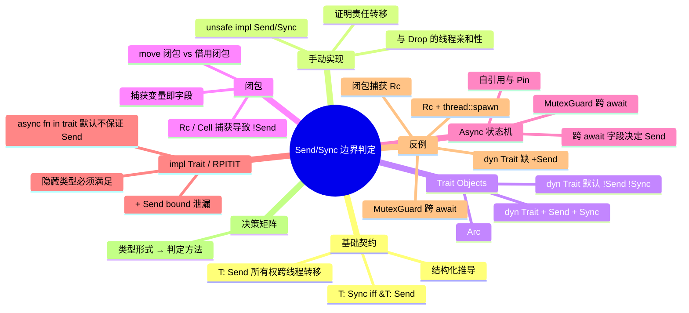

> **内容分级**: [专家级]

# Send/Sync 边界判定

> **EN**: Send/Sync Boundary Judgment — Trait Objects, Closures, and Async State Machines
> **Summary**: How to decide whether trait objects, closures, async futures, and `impl Trait` returns are Send or Sync, with counterexamples and a decision matrix.
> **Rust 版本**: 1.97.0+ (Edition 2024)
> **Bloom 层级**: L3-L4
> **受众**: [专家]
> **权威来源**:
> 本文件为 `concept/` 权威页。Send/Sync 的**核心契约、auto trait 推导与手动 impl**统一收敛于 [Send 与 Sync：Auto Trait 的并发安全（Concurrency Safety）契约](02_send_sync_auto_traits.md)；
> 本文聚焦**边界形态**（trait objects、闭包（Closures）、async 状态机、`impl Trait`）的判定方法、反例与工程决策。
>
> **层次定位**: L3 高级概念 / 并发子域 — 类型系统（Type System）与并发（Concurrency）的交叉点
> **A/S/P 标记**: **S+P** — Structure + Procedure
> **双维定位**: C×Ana — 分析跨线程类型形态的安全性边界
> **前置概念**:
> [Send 与 Sync：Auto Trait 的并发安全（Concurrency Safety）契约](02_send_sync_auto_traits.md) ·
> [Traits](../../02_intermediate/00_traits/01_traits.md) ·
> [Trait Objects / 分发机制](../../02_intermediate/00_traits/02_dispatch_mechanisms.md) ·
> [Async/Await](../01_async/01_async.md)
> **后置概念**: [并发模式](03_concurrency_patterns.md) · [跨平台并发](05_cross_platform_concurrency.md) · [Unsafe Rust](../02_unsafe/01_unsafe.md)
> **前置依赖**:
> [Ownership](../../01_foundation/01_ownership_borrow_lifetime/01_ownership.md) ·
> [Borrowing](../../01_foundation/01_ownership_borrow_lifetime/02_borrowing.md) ·
> [Smart Pointers](../../02_intermediate/02_memory_management/01_memory_management.md) ·
> [内部可变性](../../02_intermediate/02_memory_management/02_interior_mutability.md)
> **后置延伸**:
> [原子操作（Atomic Operations）与内存序](06_atomics_and_memory_ordering.md) ·
> [无锁编程](07_lock_free.md) ·
> [RustBelt](../../04_formal/02_separation_logic/01_rustbelt.md)
> **跨层映射**: L3→L4 Send/Sync ↔ 分离逻辑资源分片 | L3→L6 Tokio `spawn` 与跨线程 executor
> **定理链编号**: T-043 Send/Sync 边界判定完备性
> **unsafe 语义对齐**: 提及 `unsafe impl Send/Sync` 时遵循核心语义：`unsafe` 不是关闭检查器，而是将"该类型跨线程真的安全"这一全局假设的证明责任转移给程序员。
> **主要来源**:
> [Rust Reference — Send and Sync](https://doc.rust-lang.org/reference/special-types-and-traits.html) ·
> [Rustonomicon — Send and Sync](https://doc.rust-lang.org/nomicon/send-and-sync.html) ·
> [std::marker::Send](https://doc.rust-lang.org/std/marker/trait.Send.html) ·
> [std::marker::Sync](https://doc.rust-lang.org/std/marker/trait.Sync.html) ·
> [Asynchronous Programming in Rust](https://rust-lang.github.io/async-book/)

---

**变更日志**:

- v1.0 (2026-07-15): 初始版本，覆盖 trait objects、闭包（Closures）、async 状态机、`impl Trait` / RPITIT 的 Send/Sync 边界判定、反例与决策矩阵。

> **对应 Crate**: [`c05_threads`](../../crates/c05_threads) · [`c06_async`](../../crates/c06_async)
> **对应练习**: [`exercises/src/concurrency/`](../../exercises/src/concurrency) · [`exercises/src/async_programming/`](../../exercises/src/async_programming)

---

## 📑 目录

- [Send/Sync 边界判定](#sendsync-边界判定)
  - [📑 目录](#-目录)
  - [零、认知路径](#零认知路径)
  - [一、权威定义回顾](#一权威定义回顾)
    - [1.1 Send 与 Sync 的契约](#11-send-与-sync-的契约)
    - [1.2 Auto trait 的结构化推导](#12-auto-trait-的结构化推导)
    - [1.3 手动 `unsafe impl` 的契约](#13-手动-unsafe-impl-的契约)
  - [二、Trait Objects 中的边界](#二trait-objects-中的边界)
    - [2.1 `dyn Trait` 为什么默认不是 Send/Sync](#21-dyn-trait-为什么默认不是-sendsync)
    - [2.2 `dyn Trait + Send + Sync` 的充分必要条件](#22-dyn-trait--send--sync-的充分必要条件)
  - [三、闭包中的边界](#三闭包中的边界)
    - [3.1 捕获变量决定闭包的 Send/Sync](#31-捕获变量决定闭包的-sendsync)
    - [3.2 `move` 闭包与借用闭包的差异](#32-move-闭包与借用闭包的差异)
  - [四、Async 状态机中的边界](#四async-状态机中的边界)
    - [4.1 状态机的生成与跨 await 持有](#41-状态机的生成与跨-await-持有)
    - [4.2 自引用、`&mut` 与 `MutexGuard`](#42-自引用mut-与-mutexguard)
  - [五、`impl Trait` / RPITIT 中的 Send bound 泄漏](#五impl-trait--rpitit-中的-send-bound-泄漏)
    - [5.1 `impl Trait + Send` 对隐藏类型的约束](#51-impl-trait--send-对隐藏类型的约束)
    - [5.2 RPITIT 与 async fn in trait](#52-rpitit-与-async-fn-in-trait)
  - [六、边界测试 / 反例](#六边界测试--反例)
    - [反例 1：`Rc` 在 `thread::spawn` 中失败](#反例-1rc-在-threadspawn-中失败)
    - [反例 2：闭包捕获 `Rc` 后不是 Send](#反例-2闭包捕获-rc-后不是-send)
    - [反例 3：async fn 返回的 Future 不是 Send（`MutexGuard` 跨 await）](#反例-3async-fn-返回的-future-不是-sendmutexguard-跨-await)
    - [反例 4：`dyn Trait` 缺少 `+ Send` 导致的线程边界错误](#反例-4dyn-trait-缺少--send-导致的线程边界错误)
  - [七、决策矩阵：类型形式 → 判定方法](#七决策矩阵类型形式--判定方法)
  - [八、来源与延伸阅读](#八来源与延伸阅读)
  - [🧭 思维导图（Mindmap）](#-思维导图mindmap)

---

## 零、认知路径

要判断一个复合类型是否能跨线程，可按以下四步递归展开：

1. **先问基础形态**：它是普通复合类型、`dyn Trait`、闭包，还是 `async` 生成的 Future？
2. **再问所有权（Ownership）/共享**：它涉及所有权的转移（`Send`），还是共享引用 `&T` 的并发访问（`Sync`）？
3. **分解内部状态**：对闭包看捕获变量；对 async 状态机看跨 `await` 保有的变量；对 `dyn Trait` 看 vtable 上附加的 auto trait bound。
4. **验证边界**：用 `thread::spawn`、`tokio::spawn` 或 `assert_send::<T>()` 做编译期边界测试；若失败，按决策矩阵改造类型或显式添加 `+ Send` bound。

---

## 一、权威定义回顾

> 本节仅给出边界判定所需的**最小契约集合**。Send/Sync 的完整形式化定义、auto trait 推导、负实现与 orphan 规则，请参见 [02_send_sync_auto_traits.md](02_send_sync_auto_traits.md)。

### 1.1 Send 与 Sync 的契约

```text
T: Send  ⟺  T 的所有权可以安全地转移到另一个线程。
T: Sync  ⟺  &T: Send  ⟺  &T 可以安全地跨线程共享。
```

关键推论：

- `Send` 管**独占转移**；`Sync` 管**共享引用**。二者互不蕴含。
- `T: Sync` 并不要求 `T: Send`（例如 `MutexGuard<T>` 在某些情形下可能 `Sync` 但不是 `Send`）；但实际中常见的线程安全类型往往同时满足两者。
- 对复合类型，**结构化规则**（structural rule）成立：一个类型是 `Send`/`Sync` 当且仅当它的所有字段/变体都是 `Send`/`Sync`。

### 1.2 Auto trait 的结构化推导

`Send` 与 `Sync` 是 `unsafe auto trait`。编译器按字段递归推导：

```text
struct S<T> { a: A, b: B<T> }
S<T>: Send  ⟺  A: Send ∧ B<T>: Send
S<T>: Sync  ⟺  A: Sync ∧ B<T>: Sync
```

`auto` 意味着你通常不需要手写 `impl`；只要所有组成部分满足，编译器自动给出实现。一旦某组成部分不满足（如 `Rc`、裸指针、线程局部句柄），整个复合类型就自动失去对应实现。

### 1.3 手动 `unsafe impl` 的契约

当编译器无法从字段结构推导出 `Send`/`Sync` 时（例如包含 `UnsafeCell`、裸指针、FFI 句柄），可以手动实现，但前提是程序员能证明：

1. **Send 契约**：所有权（Ownership）转移后，原线程不再通过任何路径访问该值；且 `drop` 在新线程执行不会破坏线程安全不变量。
2. **Sync 契约**：所有通过 `&T` 触发的修改都经过同步原语（如 `Mutex`、`Atomic`）或满足 happens-before 序。
3. **与 Drop 的协同**：如果 `T: Send + Sync` 但 `T` 内部有线程亲和性资源，手动 impl 必须保证 `drop` 在正确线程执行（通常需要额外同步或 `SendWrapper`）。

错误的 `unsafe impl` 会破坏 fearless concurrency 保证，形成编译期无法检测的数据竞争。

---

## 二、Trait Objects 中的边界

本节聚焦 `dyn Trait` 这一动态分发形态下的 Send/Sync 判定。2.1 解释默认 `dyn Trait` 不实现 Send/Sync 的根本原因，2.2 给出 `+ Send + Sync` bound 的充分必要条件与常见错误。

### 2.1 `dyn Trait` 为什么默认不是 Send/Sync

`dyn Trait` 是一种**擦除具体类型**的动态分发类型。编译器只知道它实现了 `Trait`，不知道它底层封装的是 `Rc<T>`、`Cell<T>` 还是 `Mutex<T>`。因此：

```text
dyn Trait         不自动实现 Send/Sync
dyn Trait + Send  实现 Send，不保证 Sync
dyn Trait + Sync  实现 Sync，不保证 Send
dyn Trait + Send + Sync  同时实现 Send 与 Sync
```

`+ Send` / `+ Sync` 是**附加 bound**，它们把 auto trait 约束写进 vtable 的类型签名。只有当具体类型满足 `Trait + Send + Sync` 时，才能被强转为 `dyn Trait + Send + Sync`。

### 2.2 `dyn Trait + Send + Sync` 的充分必要条件

**充分必要条件**：

```text
一个值 v: T 可以被转换/包装为 Arc<dyn Trait + Send + Sync>
⟺ T: Trait + Send + Sync
```

注意这里不是 `T: Trait + Send` 就够了。因为 `Arc<T>: Send` 要求 `T: Send + Sync`（`Arc` 内部共享引用，需要 `Sync`）。因此常见的跨线程 trait object 模式总是写成：

```rust
use std::sync::Arc;
use std::thread;

trait Work: Send + Sync {
    fn call(&self);
}

fn spawn_work(w: Arc<dyn Work + Send + Sync>) {
    thread::spawn(move || w.call());
}

fn main() {}
```

如果你把 bound 写成 `dyn Work + Send`，则 `Arc<dyn Work + Send>` 仍然不是 `Send`（缺少 `Sync`），`thread::spawn` 会报 `E0277`。

---

## 三、闭包中的边界

本节分析闭包作为匿名结构体时，其捕获变量如何决定 Send/Sync 实现。3.1 给出判定规则，3.2 对比 `move` 闭包与借用闭包在捕获语义上的差异。

### 3.1 捕获变量决定闭包的 Send/Sync

闭包（closure）在 Rust 中是一个**匿名结构体（Struct）**，其字段就是捕获的环境变量。闭包是否 `Send`/`Sync`，完全由捕获变量决定：

```text
closure: Send  ⟺  所有按值/按引用捕获的变量都是 Send
closure: Sync  ⟺  所有捕获变量都是 Sync
```

注意：即使闭包签名是 `FnOnce`，如果它按引用捕获了 `Rc<T>`，该闭包仍然不是 `Send`。

### 3.2 `move` 闭包与借用闭包的差异

- **`move` 闭包**：把捕获变量按值移入闭包内部。若变量是 `Rc<T>`，闭包整体因为字段 `Rc<T>` 而 `!Send`。
- **借用闭包**：捕获的是引用 `&T`。闭包本身是否 `Send` 取决于 `&T` 是否 `Send`。`&T: Send` 当且仅当 `T: Sync`。因此借用 `Cell<T>` 的闭包不是 `Send`。

下面演示 `move` 闭包捕获 `Rc` 导致 `!Send`：

```rust,compile_fail,E0277
use std::rc::Rc;
use std::thread;

fn main() {
    let rc = Rc::new(42);
    let f = move || {
        println!("{}", *rc);
    };
    thread::spawn(f);
}
```

编译器会指出闭包类型 `!Send`，根源是 `Rc<i32>: !Send`。

---

## 四、Async 状态机中的边界

本节说明 `async fn`/`async {}` 编译生成的状态机如何继承 Send/Sync 约束。4.1 描述状态机字段与跨 `await` 持有变量的关系，4.2 列举自引用、`MutexGuard` 等导致 Future 失去 Send 的典型场景。

### 4.1 状态机的生成与跨 await 持有

`async fn` / `async {}` 会被编译器去糖为实现了 `Future` 的匿名状态机。状态机的字段包括：

- 所有在 async 块内声明并在**多个 await 点之间存活**的变量；
- 函数参数中在 await 之后仍被使用的部分；
- `self` 或 `&mut self` 等借用，若跨越 await 会形成自引用字段。

因此：

```text
async 生成的 Future: Send
⟺ 状态机暂停时保存的所有字段: Send
⟺ 每个跨 await 持有的变量/引用都是 Send
```

只在单个 await 之前或之后使用的局部变量，不会被保存到状态机中，因此不影响 `Send`。

### 4.2 自引用、`&mut` 与 `MutexGuard`

三类最常见的 Future 失去 `Send` 的原因：

1. **`Rc<T>` 跨 await**：与闭包同理，`Rc` 会进入状态机字段。
2. **`MutexGuard<'_, T>` 跨 await**：`std::sync::MutexGuard<T>` 是 `!Send`（与线程 ID 绑定）。如果它在 `.await` 之前创建、之后 drop，整个 Future 就不是 `Send`。
3. **自引用**：某些 API 返回的借用跨越 await，导致状态机含有自引用字段；Pin 与 `Send` 的交互需要额外审视。

下面用 `std::future::pending` 模拟一个挂起点，演示 `MutexGuard` 跨 await：

```rust,compile_fail
use std::future::pending;
use std::sync::Mutex;

fn assert_send<T: Send>(_: T) {}

fn demo(m: Mutex<i32>) {
    assert_send(async {
        let g = m.lock().unwrap();
        pending::<()>().await; // 在 await 期间继续持有 MutexGuard
        drop(g);
    });
}

fn main() {}
```

**修复策略**：在 await 之前 drop guard，或改用 `tokio::sync::Mutex`（其 `MutexGuard` 是 `Send`，但会引入异步（Async） lock 开销）。

---

## 五、`impl Trait` / RPITIT 中的 Send bound 泄漏

本节讨论 `impl Trait` 与 RPITIT 返回类型中 bound 向隐藏类型的反向传播。5.1 说明 `+ Send` 如何约束函数体实现，5.2 扩展到 trait 中 RPITIT 与 `async fn in trait` 的 Send 保证问题。

### 5.1 `impl Trait + Send` 对隐藏类型的约束

`impl Trait` 作为返回类型会隐藏具体类型，但类型上的 bound 会**泄漏**给调用者：

```text
fn foo() -> impl Trait + Send
  ⟹  隐藏类型 T 必须满足 T: Trait + Send
```

这意味着函数体内部若使用了 `Rc`、跨 await 持有 `MutexGuard` 等，返回值就通不过 `+ Send` 检查。

```rust,compile_fail
use std::rc::Rc;

fn rc_stream() -> impl Iterator<Item = i32> + Send {
    let rc = Rc::new(0_i32);
    std::iter::from_fn(move || Some(*rc))
}

fn main() {}
```

错误根源：`from_fn` 闭包捕获了 `Rc<i32>`，导致生成的迭代器（Iterator）类型 `!Send`，无法兑现 `+ Send` 承诺。

### 5.2 RPITIT 与 async fn in trait

在 trait 中使用 `impl Trait`（Return Position Impl Trait In Trait，RPITIT，Rust 1.75+ 稳定）时，方法签名上的 `+ Send` 同样约束实现者的隐藏类型。

```rust,compile_fail
use std::future::Future;
use std::rc::Rc;

trait Factory {
    fn make(&self) -> impl Future<Output = ()> + Send;
}

struct Bad;
impl Factory for Bad {
    fn make(&self) -> impl Future<Output = ()> + Send {
        async {
            let _rc = Rc::new(0);
            std::future::pending::<()>().await; // Rc 跨 await 保存到状态机
        }
    }
}

fn main() {}
```

对于 `async fn in trait`，默认返回类型是 `impl Future<Output = ...>`，但**不自动保证 `Send`**。若需要跨线程调度（如 `tokio::spawn`），应在 trait 方法签名上显式写 `+ Send`，或在 trait 级别约定。

---

## 六、边界测试 / 反例

本节给出四个必须掌握的编译期拒绝反例。所有示例均可在标准库下复现 `E0277`，无需外部依赖。

### 反例 1：`Rc` 在 `thread::spawn` 中失败

```rust,compile_fail,E0277
use std::rc::Rc;
use std::thread;

fn main() {
    let rc = Rc::new(42);
    thread::spawn(move || {
        println!("{}", *rc);
    }).join().unwrap();
}
```

**错误本质**：`Rc<T>` 使用非原子引用计数，跨线程转移/析构会导致计数竞争。修复：换用 `Arc<T>`。

### 反例 2：闭包捕获 `Rc` 后不是 Send

```rust,compile_fail,E0277
use std::rc::Rc;

fn require_send<T: Send>(_: T) {}

fn main() {
    let rc = Rc::new(42);
    let f = move || {
        drop(rc); // 按值捕获 Rc，导致闭包 !Send
    };
    require_send(f);
}
```

**错误本质**：闭包匿名结构体（Struct）中包含 `Rc<i32>` 字段，因此闭包整体 `!Send`。即使函数从未真正 spawn 线程，类型系统（Type System）也会拒绝。

### 反例 3：async fn 返回的 Future 不是 Send（`MutexGuard` 跨 await）

```rust,compile_fail
use std::future::pending;
use std::sync::Mutex;

fn assert_send<T: Send>(_: T) {}

async fn work(m: Mutex<i32>) {
    let g = m.lock().unwrap();
    pending::<()>().await;
    drop(g);
}

fn main() {
    assert_send(work(Mutex::new(0)));
}
```

**错误本质**：Future 状态机在挂起点保存了 `MutexGuard<i32>`，而该类型 `!Send`。修复：缩小 guard 生命周期（Lifetimes），使其在 await 前 drop。

### 反例 4：`dyn Trait` 缺少 `+ Send` 导致的线程边界错误

```rust,compile_fail,E0277
use std::sync::Arc;

trait Worker {}
struct Concrete;
impl Worker for Concrete {}

fn spawn_dyn(w: Arc<dyn Worker>) {
    std::thread::spawn(move || {
        drop(w); // 实际持有 Arc<dyn Worker>，缺少 Send/Sync bound
    });
}

fn main() {
    spawn_dyn(Arc::new(Concrete));
}
```

**错误本质**：`Arc<dyn Worker>` 的内部类型 `dyn Worker` 没有 `Send`/`Sync` bound，因此 `Arc<T>: Send` 不成立。修复：将参数类型改为 `Arc<dyn Worker + Send + Sync>`，并让 `Concrete` 满足 `Send + Sync`（`Concrete` 默认满足，前提是它的字段满足）。

---

## 七、决策矩阵：类型形式 → 判定方法

| 类型形式 | 判定 `Send` 的方法 | 判定 `Sync` 的方法 | 常见陷阱 |
|---|---|---|---|
| 普通 struct / enum | 所有字段 `Send` | 所有字段 `Sync` | 含 `Rc`、`Cell`、`RefCell`、`UnsafeCell`、裸指针时失去 |
| `dyn Trait` | 必须写 `dyn Trait + Send` | 必须写 `dyn Trait + Sync` | 默认 `dyn Trait` 不实现 Send/Sync |
| `dyn Trait + Send + Sync` | 直接 `Send` | 直接 `Sync` | `Arc<dyn Trait + Send>` 仍不是 `Send`，缺 `Sync` |
| 闭包 | 捕获变量全 `Send` | 捕获变量全 `Sync` | `move` 闭包按值捕获 `Rc`；借用闭包捕获 `&Cell` |
| `async {}` / `async fn` | 状态机所有字段 `Send` | 状态机所有字段 `Sync` | `MutexGuard`、自引用、`Rc` 跨 await |
| `impl Trait + Send` | 隐藏类型必须 `Send` | 隐藏类型必须 `Sync`（若加 `+ Sync`） | 函数体内部构造 `Rc` 会违反 bound |
| RPITIT / async fn in trait | 实现返回的隐藏类型满足签名 bound | 同上 | 默认 async fn 返回的 Future 不保证 `Send` |
| 手动 `unsafe impl` | 程序员证明转移与析构安全 | 程序员证明共享引用访问同步 | 错误的 impl 会引入不可检测的数据竞争 |

使用决策矩阵时，建议配合一个编译期断言模板：

```rust,ignore
fn assert_send<T: Send>() {}
fn assert_sync<T: Sync>() {}

// 在需要的位置调用（将 MyType 替换为实际类型）
assert_send::<MyType>();
assert_sync::<MyType>();
```

这样可以在不实际 spawn 线程的情况下，把 Send/Sync 边界错误转化为编译期 `E0277`。

---

## 八、来源与延伸阅读

- [Send 与 Sync：Auto Trait 的并发安全契约](02_send_sync_auto_traits.md)：核心契约、结构化推导、负实现与手动 impl 的完整形式化。
- [并发模型](01_concurrency.md)：并发全景、同步原语对比与 fearless concurrency 的工程视角。
- [Async/Await](../01_async/01_async.md) / [Pin 与 Unpin](../01_async/08_pin_unpin.md)：async 状态机、自引用与 `Pin<Box<dyn Future + Send>>` 的交互。
- [Trait Objects / 分发机制](../../02_intermediate/00_traits/02_dispatch_mechanisms.md)：object safety、`dyn Trait` 的内存布局与 vtable。
- [Unsafe Rust](../02_unsafe/01_unsafe.md)：手动实现 Send/Sync 的语义责任与常见反模式。

---

## 🧭 思维导图（Mindmap）


