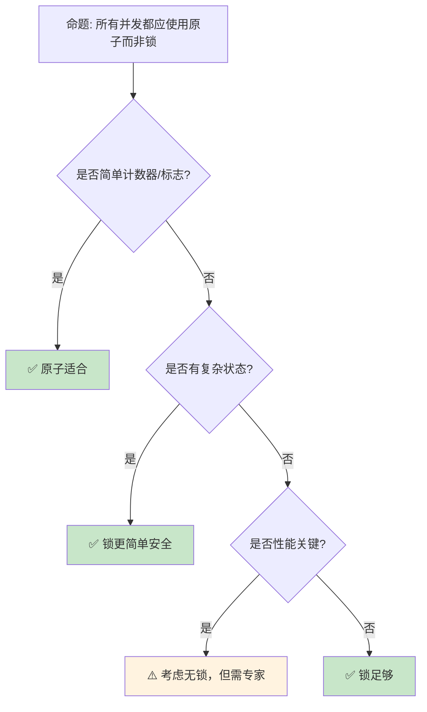
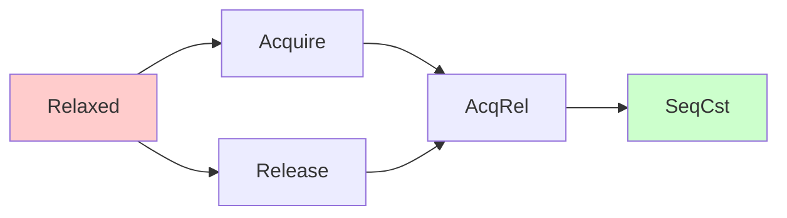

> **内容分级**: [专家级]

# 原子操作与内存序：无锁并发的精确控制
>
> **EN**: Concurrency
> **Summary**: Concurrency — Atomic types and memory ordering: load/store, compare-and-swap, and release-acquire for precise lock-free control.
> **Rust 版本**: 1.97.0+ (Edition 2024)
> **📎 交叉引用（Reference）**
>
> 本主题在 knowledge 中有系统化的知识索引：原子操作（Atomic Operations）
> **受众**: [专家]
> **Bloom 层级**: L4-L5
> **权威来源**: 本文件为 `concept/` 权威页。
> **A/S/P 标记**: **S+P** — Structure + Procedure
> **双维定位**: P×Eva — 评估原子操作（Atomic Operations）内存序的选型
> **定位**: 深入分析 Rust **原子类型（Atomic）**和**内存排序（Memory Ordering [来源: [Atomic Ordering](https://doc.rust-lang.org/std/sync/atomic/enum.Ordering.html)]）**——从基本的 load/store 到 compare-and-swap 和释放-获取语义，揭示无锁编程中硬件内存模型的精确控制。
> **前置概念**: [Concurrency](01_concurrency.md) · [Unsafe](../02_unsafe/01_unsafe.md) · [Type System](../../01_foundation/02_type_system/01_type_system.md)
> **后置概念**: [Lockfree Data Structures](https://en.wikipedia.org/wiki/Non-blocking_algorithm) · [Distributed Systems](../../06_ecosystem/04_web_and_networking/01_distributed_systems.md)

---

> **来源**: · [RustBelt — POPL 2018](https://plv.mpi-sws.org/rustbelt/popl18/) · [O'Hearn — Separation Logic and Shared Mutable Data](https://doi.org/10.1017/S0960129501001003) · [Brown University — Interactive Rust Book](https://rust-book.cs.brown.edu/)
> [std::sync::atomic](https://doc.rust-lang.org/std/sync/atomic/index.html) ·
> [Rust Atomics and Locks](https://marabos.nl/atomics/) ·
> [C++ Memory Model](https://en.cppreference.com/w/cpp/atomic/memory_order) ·
> [LLVM Atomic Instructions](https://llvm.org/docs/Atomics.html) ·
> [Wikipedia — Memory Ordering](https://en.wikipedia.org/wiki/Memory_ordering)
> **前置依赖**: [Ownership](../../01_foundation/01_ownership_borrow_lifetime/01_ownership.md) · [Borrowing](../../01_foundation/01_ownership_borrow_lifetime/02_borrowing.md)
> **前置依赖**: [Traits](../../02_intermediate/00_traits/01_traits.md)
> **对应 Crate**: [`c05_threads`](../../crates/c05_threads)
> **对应练习**: [`exercises/src/concurrency/`](../../exercises/src/concurrency)

## 📑 目录

- [原子操作与内存序：无锁并发的精确控制](#原子操作与内存序无锁并发的精确控制)
  - [📑 目录](#-目录)
  - [一、核心概念](#一核心概念)
    - [1.1 原子类型全景](#11-原子类型全景)
    - [1.2 内存序的层次](#12-内存序的层次)
    - [1.3 Happens-Before 关系](#13-happens-before-关系)
  - [二、技术细节](#二技术细节)
    - [2.1 原子操作详解](#21-原子操作详解)
    - [2.2 内存序选择指南](#22-内存序选择指南)
    - [2.3 无锁算法基础](#23-无锁算法基础)
  - [三、原子模式矩阵](#三原子模式矩阵)
  - [四、反命题与边界分析](#四反命题与边界分析)
    - [4.1 反命题树](#41-反命题树)
    - [4.2 边界极限](#42-边界极限)
  - [五、常见陷阱](#五常见陷阱)
    - [编译错误示例](#编译错误示例)
    - [4.4 边界测试：原子操作与非原子操作混用（数据竞争 / 运行时 UB）](#44-边界测试原子操作与非原子操作混用数据竞争--运行时-ub)
    - [4.5 边界测试：`Ordering::Relaxed` 导致逻辑错误（编译通过但语义错误）](#45-边界测试orderingrelaxed-导致逻辑错误编译通过但语义错误)
  - [六、来源与延伸阅读](#六来源与延伸阅读)
  - [判定表：内存序选择判定](#判定表内存序选择判定)
  - [相关概念](#相关概念)
  - [逆向推理链（Backward Reasoning）](#逆向推理链backward-reasoning)
  - [权威来源索引](#权威来源索引)
    - [10.5 边界测试：`AtomicPtr` 的 `compare_exchange` ABA 问题（运行时逻辑错误）](#105-边界测试atomicptr-的-compare_exchange-aba-问题运行时逻辑错误)
    - [10.3 边界测试：`Relaxed` 顺序与 happens-before 缺失（逻辑错误/UB）](#103-边界测试relaxed-顺序与-happens-before-缺失逻辑错误ub)
    - [10.9 边界测试：match 分支返回类型不一致](#109-边界测试match-分支返回类型不一致)
  - [📋 关键属性](#-关键属性)
  - [🔗 概念关系](#-概念关系)
  - [参考来源](#参考来源)
  - [认知路径](#认知路径)
    - [核心推理链](#核心推理链)
  - [实践](#实践)
    - [对应代码示例](#对应代码示例)
    - [建议练习](#建议练习)
  - [导航：下一步去哪？](#导航下一步去哪)
  - [嵌入式测验](#嵌入式测验)
    - [测验 1：原子操作基础（记忆层）](#测验-1原子操作基础记忆层)
    - [测验 2：内存序（理解层）](#测验-2内存序理解层)
    - [测验 3：自旋锁实现（应用层）](#测验-3自旋锁实现应用层)
    - [测验 4：SeqCst 的必要性（分析层）](#测验-4seqcst-的必要性分析层)
  - [迁移内容（来自 `crates/c05_threads/docs/09_advanced_topics_and_summary.md`）](#迁移内容来自-cratesc05_threadsdocs09_advanced_topics_and_summarymd)
  - [1. Atomics：原子类型](#1-atomics原子类型)
    - [1.1. 硬件层面的并发基石](#11-硬件层面的并发基石)
    - [1.2. 内存排序 (Memory Ordering)](#12-内存排序-memory-ordering)
  - [2. 无锁编程 (Lock-Free Programming)](#2-无锁编程-lock-free-programming)
    - [2.1. 理念与优势](#21-理念与优势)
    - [2.2. 挑战与危险](#22-挑战与危险)
  - [3. 本分册核心思想总结](#3-本分册核心思想总结)
    - [3.1. 所有权作为并发的中心法则](#31-所有权作为并发的中心法则)
    - [3.2. 两种范式，一个目标](#32-两种范式一个目标)
    - [3.3. 抽象的力量](#33-抽象的力量)
  - [4. 哲学批判性分析](#4-哲学批判性分析)
    - [4.1. "无畏"的真正含义](#41-无畏的真正含义)
    - [4.2. 未来的方向：`async/await`](#42-未来的方向asyncawait)
  - [5. 最终总结](#5-最终总结)
  - [Rust 1.97.0 交叉语义](#rust-1970-交叉语义)
    - [1. 该 cfg 在原子 codegen 中的位置](#1-该-cfg-在原子-codegen-中的位置)
    - [2. 与 `Ordering` 正交：对齐 vs 可见性](#2-与-ordering-正交对齐-vs-可见性)
    - [3. 与类型布局 / std 原子类型对齐保证的关系](#3-与类型布局--std-原子类型对齐保证的关系)
    - [4. 跨平台边界与旧名废弃说明](#4-跨平台边界与旧名废弃说明)
    - [5. Rust 1.97.0 新增 LoongArch 原子 target features（`scq` / `lamcas` / `lam-bh` / `ld-seq-sa` / `div32`）](#5-rust-1970-新增-loongarch-原子-target-featuresscq--lamcas--lam-bh--ld-seq-sa--div32)

---

## 一、核心概念
>
>

### 1.1 原子类型全景
>

```text
Rust 原子类型 (std::sync::atomic):

  整数类型:
  ┌─────────────────┬─────────────────┬─────────────────┐
  │ 类型             │ 大小            │ 主要操作        │
  ├─────────────────┼─────────────────┼─────────────────┤
  │ AtomicBool      │ 1 字节          │ swap, fetch_and │
  │ AtomicU8/I8     │ 1 字节          │ fetch_add, CAS  │
  │ AtomicU16/I16   │ 2 字节          │ fetch_or, fetch_xor│
  │ AtomicU32/I32   │ 4 字节          │ 完整操作集       │
  │ AtomicU64/I64   │ 8 字节          │ 完整操作集       │
  │ AtomicUsize/Isize│ 指针大小       │ 索引/计数        │
  │ AtomicPtr<T>    │ 指针大小        │ 指针 CAS         │
  └─────────────────┴─────────────────┴─────────────────┘
> [来源: [TRPL](https://doc.rust-lang.org/book/ch16-00-concurrency.html)] · [Brown University Interactive Book](https://rust-book.cs.brown.edu/ch16-00-concurrency.html)

  核心操作:
  ├── load: 读取值
  ├── store: 写入值
  ├── swap: 交换并返回旧值
  ├── compare_exchange: CAS（比较并交换）
  ├── fetch_add/sub: 原子加减
  ├── fetch_and/or/xor: 原子位运算
  └── fetch_max/min: 原子最值

  与 Mutex 的对比:
  ├── Atomic: 单个值，无锁，通常更快
  ├── Mutex: 任意数据，有锁，更通用
  └── 选择: 能原子则原子，否则锁
```

> **认知功能**: 原子操作是**无锁并发的基础原语**——它们提供硬件级别的原子性保证，无需操作系统介入。
> [来源: [std::sync::atomic](https://doc.rust-lang.org/std/sync/atomic/index.html)]

---

### 1.2 内存序的层次
>

```text
内存序 (Memory Ordering):

  Relaxed:
  ├── 仅保证原子性
  ├── 无顺序约束
  ├── 编译器/CPU 可重排序
  └── 最快，但最难正确使用

  Acquire [来源: [Rust Atomics](https://doc.rust-lang.org/nomicon/atomics.html)] / Release:
  ├── Acquire (加载): 之后的读写不能重排序到前面
  ├── Release (存储): 之前的读写不能重排序到后面
  ├── 成对使用建立同步点
  └── 最常用的内存序

  AcqRel:
  ├── 读-修改-写操作使用
  ├── 同时具有 Acquire 和 Release 语义
  └── 用于 CAS、fetch_add 等

  SeqCst:
  ├── 顺序一致性
  ├── 所有线程看到一致的操作顺序
  ├── 最强但最慢
  └── 不确定时用此，确认瓶颈后优化

  可视化:
  Thread A:        Thread B:
  data = 42;       while flag.load(Acquire) == false {}
  flag.store(true, Release);
                   assert!(data == 42);  // 保证可见！

  // Release 保证 data=42 在 flag=true 之前完成
  // Acquire 保证 flag 读取后，data 的写已可见
```

> **内存序洞察**: **内存序是并发编程中最易错的主题**——`SeqCst` 是安全的默认选择，只在性能分析证明是瓶颈时才使用更弱的序。
> [来源: [C++ Memory Order](https://en.cppreference.com/w/cpp/atomic/memory_order)]

---

### 1.3 Happens-Before 关系

```text
Happens-Before 关系:

  定义:
  ├── 如果 A happens-before B，则 A 的效果对 B 可见
  ├── 程序顺序: 同一线程中的操作
  ├── 同步关系: 原子操作间的 Acquire-Release
  └── 传递性: A → B 且 B → C ⇒ A → C

  建立方式:
  ├── 线程启动/结束
  ├── Mutex lock/unlock
  ├── 原子操作的 Acquire-Release
  └── 信号量/屏障

  示例:
  Thread A:
    x.store(1, Release);  // A

  Thread B:
    if x.load(Acquire) == 1 {  // B (与 A 同步)
        assert!(y == 1);  // 如果 y=1 在 A 之前
    }

  // A happens-before B（通过 Release-Acquire）
  // 因此 A 之前的写对 B 可见

  没有 Happens-Before:
  Thread A: x.store(1, Relaxed);
  Thread B: if x.load(Relaxed) == 1 { assert!(y == 1); }
  // 可能 assert 失败！因为没有同步关系
```

> **Happens-Before 洞察**: **Happens-Before 是理解并发可见性的核心概念**——没有它，一个线程的写对另一个线程可能永远不可见。
> [来源: [Rust Atomics and Locks — Happens-Before](https://mara.nl/atomics/memory-ordering.html)]

---

## 二、技术细节

本节展开原子操作的五个内存序（memory ordering）及其硬件语义：

| 内存序 | 保证 | 典型用途 |
|:---|:---|:---|
| `Relaxed` | 仅原子性，无顺序保证 | 计数器、统计量（无数据依赖） |
| `Acquire`（读）/`Release`（写） | 成对构成 happens-before：Release 前的写对 Acquire 后可见 | 锁、引用计数、发布-订阅一个数据项 |
| `AcqRel` | Acquire + Release | CAS 循环中同时读写的操作 |
| `SeqCst` | 全序：所有 SeqCst 操作存在全局一致顺序 | 多变量一致性、拿不准时的默认选择 |

关键模型：**内存序不修饰数据，修饰的是「哪些先前的写对本线程可见」**。`compare_exchange` 的成功/失败可分别指定内存序——失败分支只需读取语义（通常 `Relaxed` 或 `Acquire`）。判定准则：先 `SeqCst` 保证正确，profile 证明是热点再逐操作降级并给出论证。

### 2.1 原子操作详解

```rust
use std::sync::atomic::{AtomicUsize, Ordering, AtomicBool};

// 1. 基本计数器
static COUNTER: AtomicUsize = AtomicUsize::new(0);

fn increment() {
    COUNTER.fetch_add(1, Ordering::Relaxed);
}

fn get_count() -> usize {
    COUNTER.load(Ordering::Relaxed)
}

// 2. CAS (Compare-And-Swap) — 无锁算法核心
fn cas_example() {
    let value = AtomicUsize::new(5);

    // compare_exchange: 强 CAS
    let result = value.compare_exchange(
        5,           // 期望值
        10,          // 新值
        Ordering::AcqRel,  // 成功时的内存序
        Ordering::Acquire, // 失败时的内存序
    );
    // result == Ok(5)（返回旧值）

    // compare_exchange_weak: 弱 CAS（可能伪失败）
    // 在循环中使用，某些架构更高效
    loop {
        let current = value.load(Ordering::Relaxed);
        match value.compare_exchange_weak(
            current, current + 1,
            Ordering::AcqRel, Ordering::Relaxed
        ) {
            Ok(_) => break,
            Err(_) => continue,
        }
    }
}

// 3. 原子标志位
static FLAG: AtomicBool = AtomicBool::new(false);

fn set_flag() {
    FLAG.store(true, Ordering::Release);
}

fn check_flag() -> bool {
    FLAG.load(Ordering::Acquire)
}

// 4. 自旋锁（简单实现）
struct SpinLock {
    locked: AtomicBool,
}

impl SpinLock {
    fn lock(&self) {
        while self.locked.compare_exchange_weak(
            false, true,
            Ordering::Acquire,
            Ordering::Relaxed,
        ).is_err() {
            // 自旋等待
            std::hint::spin_loop();
        }
    }

    fn unlock(&self) {
        self.locked.store(false, Ordering::Release);
    }
}
```

> **CAS 洞察**: **Compare-And-Swap**是**无锁算法的基石**——它使多个线程可以安全地竞争更新同一内存位置。
> [来源: [std::sync::atomic::AtomicUsize](https://doc.rust-lang.org/std/sync/atomic/type.AtomicUsize.html)]

---

### 2.2 内存序选择指南
>

```text
内存序选择决策树:

  是否只是独立计数器?
  ├── 是 → Relaxed
  │   └── 例如: 统计请求数、性能计数器
  └── 否 → 是否需要与其他数据同步?
      ├── 是 → Acquire/Release
      │   └── 例如: 标志位 + 数据传递
      └── 否 → 是否需要全局顺序?
          ├── 是 → SeqCst
          │   └── 例如: 多个线程协调的复杂状态
          └── 否 → Relaxed

  具体建议:
  ┌────────────────────────┬────────────────────────┐
  │ 场景                   │ 推荐内存序             │
  ├────────────────────────┼────────────────────────┤
  │ 独立计数器             │ Relaxed                │
  │ 标志位 + 数据          │ Release/Acquire        │
  │ 初始化标志             │ Acquire (读), Release (写)│
  │ 无锁队列               │ AcqRel (CAS)           │
  │ 多生产者单消费者       │ Release (写), Acquire (读)│
  │ 全局顺序敏感           │ SeqCst                 │
  │ 不确定                 │ SeqCst                 │
  └────────────────────────┴────────────────────────┘

  性能影响:
  ├── Relaxed: 最快，接近普通操作
  ├── Acquire/Release: 中等，内存屏障开销
  └── SeqCst: 最慢，全局排序开销
```

> **选择洞察**: **从 SeqCst 开始，只在性能分析证明是瓶颈时降级**——正确性优先于性能。
> [来源: [Rust Atomics and Locks — Memory Ordering](https://marabos.nl/atomics/memory-ordering.html)]

---

### 2.3 无锁算法基础
>

```rust,ignore
// 无锁栈（Treiber Stack）

use std::sync::atomic::{AtomicPtr, Ordering};
use std::ptr;

struct Node<T> {
    data: T,
    next: *mut Node<T>,
}

struct LockFreeStack<T> {
    head: AtomicPtr<Node<T>>,
}

impl<T> LockFreeStack<T> {
    fn new() -> Self {
        LockFreeStack { head: AtomicPtr::new(ptr::null_mut()) }
    }

    fn push(&self, data: T) {
        let new_node = Box::into_raw(Box::new(Node {
            data,
            next: ptr::null_mut(),
        }));

        loop {
            let head = self.head.load(Ordering::Relaxed);
            unsafe { (*new_node).next = head; }

            match self.head.compare_exchange_weak(
                head, new_node,
                Ordering::Release,
                Ordering::Relaxed,
            ) {
                Ok(_) => break,
                Err(_) => continue,  // 被其他线程修改，重试
            }
        }
    }

    fn pop(&self) -> Option<T> {
        loop {
            let head = self.head.load(Ordering::Acquire)?;
            if head.is_null() {
                return None;
            }

            let next = unsafe { (*head).next };

            match self.head.compare_exchange_weak(
                head, next,
                Ordering::Release,
                Ordering::Relaxed,
            ) {
                Ok(_) => {
                    let node = unsafe { Box::from_raw(head) };
                    return Some(node.data);
                }
                Err(_) => continue,
            }
        }
    }
}

// 注意: 此实现缺少 ABA 防护和内存回收
// 生产代码应使用 crossbeam::epoch
```

> **无锁洞察**: **Treiber Stack**是**最简单的无锁数据结构**——它展示了 CAS 循环的核心模式：加载、修改、尝试提交、冲突时重试。
> [来源: [Treiber Stack Paper](https://domino.research.ibm.com/library/cyberdig.nsf/papers/58319A2ED2B17A64852570C30061D166/$File/r5116.pdf)]

---

## 三、原子模式矩阵

```text
场景 → 原子类型 → 内存序 → 模式

计数器:
  → AtomicUsize
  → Relaxed
  → fetch_add(1, Relaxed)

标志位:
  → AtomicBool
  → Acquire/Release
  → store(true, Release) / load(Acquire)

延迟初始化:
  → Once / AtomicBool
  → Acquire/Release
  → call_once 或 compare_exchange

自增 ID:
  → AtomicU64
  → Relaxed
  → fetch_add(1, Relaxed)

引用计数:
  → AtomicUsize
  → AcqRel / Relaxed
  → fetch_add(1, Relaxed) / fetch_sub(1, Release)

无锁队列:
  → AtomicPtr
  → AcqRel
  → CAS 循环
```

> **模式矩阵**: 原子操作的**核心模式**可以归纳为几类——计数器、标志、初始化和 CAS 循环覆盖了大多数应用场景。
> [来源: [crossbeam::atomic](https://docs.rs/crossbeam/latest/crossbeam/epoch/index.html)]

---

## 四、反命题与边界分析

本节检验原子编程的两条致命误判：

- **反命题 1：「`Relaxed` 不安全，应一律用 `SeqCst`」** —— 过度保守。`Relaxed` 在「无数据依赖」场景（递增计数器、存在性标志轮询）完全正确且是硬件原生操作；`SeqCst` 的成本在 x86 上约等于普通操作，但在 ARM/RISC-V 上需要全屏障指令。正确姿势是**按数据依赖选内存序**，而非一律拉满。
- **反命题 2：「原子操作就是无锁编程」** —— 误解。原子操作保证**单次读改写**的不可分割性，但无锁数据结构需要的不变量通常跨多次操作——这就是 ABA 问题的根源：CAS 成功只证明「值没变回去」，不证明「中间没发生过别的」。解决方案是版本号（tagged pointer）或 epoch 回收（crossbeam-epoch）。

边界极限小节量化：`fetch_update` 的 CAS 循环语义、ABA 的最小复现、以及不同硬件架构（x86 TSO vs ARM 弱序）下错误内存序的实际表现差异。

### 4.1 反命题树
>



> **认知功能**: **原子适合简单场景，锁适合复杂状态，无锁算法只在极端性能需求下考虑**。
> [来源: [Rust Atomics and Locks — When to Use](https://mara.nl/atomics/atomics.html)]

---

### 4.2 边界极限
>

```text
边界 1: ABA 问题
├── CAS 可能误判值未改变（实际已变回）
├── 无锁链表/栈的经典问题
├── 可能导致内存安全问题
└── 缓解: tagged pointers, epoch-based reclamation

边界 2: 内存回收
├── pop 出的节点何时释放？
├── 其他线程可能仍访问
├── 需要延迟释放（epoch/Hazard Pointers）
└── 缓解: crossbeam::epoch

边界 3: 伪共享（False Sharing）
├── 不同 CPU 核心修改同一缓存行
├── 性能骤降（缓存失效）
├── 原子变量布局关键
└── 缓解: CachePadded, 独立缓存行对齐

边界 4: 饥饿与公平性
├── CAS 循环可能导致某些线程饥饿
├── 高竞争下某些线程无限重试
├── 无锁不保证公平
└── 缓解: 指数退避、自适应锁

边界 5: 调试困难
├── 无锁 bug 极难复现
├── 取决于精确时序
├── 传统调试器帮助有限
└── 缓解: loom model checker, TSan
```

> **边界要点**: 原子编程的边界主要与**ABA**、**内存回收**、**伪共享**、**公平性**和**调试**相关。
> [来源: [crossbeam::epoch](https://docs.rs/crossbeam/latest/crossbeam/epoch/index.html)]

---

## 五、常见陷阱

```text
陷阱 1: Relaxed 的误用
  ❌ static FLAG: AtomicBool = AtomicBool::new(false);
     static mut DATA: i32 = 0;

     // Thread A
     unsafe { DATA = 42; }
     FLAG.store(true, Relaxed);

     // Thread B
     if FLAG.load(Relaxed) {
         assert_eq!(unsafe { DATA }, 42);  // 可能失败！
     }

  ✅ FLAG.store(true, Release);
     if FLAG.load(Acquire) { ... }

陷阱 2: compare_exchange 参数顺序
  ❌ value.compare_exchange(new, old, ...)
     // 参数顺序错误！

  ✅ value.compare_exchange(old, new, ...)
     // 先期望旧值，再设新值

陷阱 3: 忘记 SeqCst 的全局序
  ❌ 假设 Acquire/Release 提供全局可见序
     // 它们只提供成对同步

  ✅ 需要全局序时用 SeqCst
     // 或多个独立的 Acquire-Release 对

陷阱 4: 原子与非原子混用
  ❌ let x = AtomicUsize::new(0);
     let ptr = &mut x;  // 错误！不能可变借用原子

  ✅ 始终通过原子方法访问
     // x.store(1, Relaxed);

陷阱 5: 错误的内存序降级
  ❌ 从 SeqCst 降级到 Relaxed 未验证
     // 可能引入微妙 bug

  ✅ 使用 loom 等工具验证
     // 或保持 SeqCst 除非证明瓶颈
```

> **陷阱总结**: 原子操作的陷阱主要与**Relaxed 误用**、**CAS 参数**、**内存序假设**、**原子借用（Borrowing）**和**盲目优化**相关。
> [来源: [Rust Atomics and Locks — Common Mistakes](https://marabos.nl/atomics/)]

### 编译错误示例

```rust,compile_fail
use std::sync::atomic::AtomicUsize;

fn atomic_borrow() {
    let x = AtomicUsize::new(0);
    // ❌ 编译错误: 不能可变借用原子类型
    // 原子类型必须通过原子方法访问，不能通过 &mut
    let r = &mut x;
    *r = 1;
}
```

> **修正**: 原子类型（`AtomicUsize`、`AtomicBool` 等）实现了内部可变性。必须通过 `.store()`、`.load()`、`.fetch_add()` 等原子方法访问，不能通过 `&mut`。

```rust,compile_fail
use std::sync::atomic::{AtomicUsize, Ordering};

fn atomic_send() {
    let x = AtomicUsize::new(0);
    // ❌ 编译错误: `AtomicUsize` 未实现 `Sync`
    // 实际上 AtomicUsize 实现了 Sync，此示例展示静态变量约束
    static mut GLOBAL: AtomicUsize = AtomicUsize::new(0);
    unsafe {
        GLOBAL.store(1, Ordering::Relaxed);
    }
}
```

> **修正**: `static mut` 需要 `unsafe` 块访问。推荐使用 `std::sync::LazyLock` 或 `once_cell` 进行线程安全的延迟初始化，而非 `static mut`。

```rust,ignore
use std::sync::atomic::{AtomicPtr, Ordering};

fn atomic_ptr_deref() {
    let ptr = AtomicPtr::new(std::ptr::null_mut::<i32>());
    // ❌ 编译错误: AtomicPtr::load 返回 *mut T，不能直接解引用
    // 必须先加载到局部变量，再 unsafe 解引用
    let val = unsafe { *ptr.load(Ordering::Relaxed) };
}
```

> **修正**: `AtomicPtr::load` 返回 `*mut T`，解引用（Reference）需要 `unsafe` 块。编译器在此处可能给出不同错误——核心点是原子指针加载后仍需 unsafe 才能访问目标内存。

### 4.4 边界测试：原子操作与非原子操作混用（数据竞争 / 运行时 UB）

```rust,ignore
use std::sync::atomic::{AtomicUsize, Ordering};
use std::thread;

fn main() {
    let data = AtomicUsize::new(0);

    let handle = thread::spawn(|| {
        // ⚠️ 数据竞争: 原子存储与非原子读取混用
        data.store(42, Ordering::Relaxed);
    });

    // 非原子读取（通过 UnsafeCell 或裸指针）
    // let val = unsafe { *(data.as_ptr()) }; // UB！

    handle.join().unwrap();
}
```

> **修正**: 同一内存位置的原子访问与非原子访问不能混用。C++20 / Rust 内存模型规定：如果一个线程执行原子操作，另一个线程执行非原子读写同一位置，则构成数据竞争（UB）。所有访问必须通过一致的原子 API 进行。[来源: [C++ Reference — Memory Order](https://en.cppreference.com/w/cpp/atomic/memory_order)]

### 4.5 边界测试：`Ordering::Relaxed` 导致逻辑错误（编译通过但语义错误）

```rust,ignore
use std::sync::atomic::{AtomicBool, Ordering};
use std::thread;

static READY: AtomicBool = AtomicBool::new(false);
static DATA: AtomicUsize = AtomicUsize::new(0);

fn main() {
    thread::spawn(|| {
        DATA.store(42, Ordering::Relaxed);
        READY.store(true, Ordering::Relaxed);
    });

    // ⚠️ 逻辑错误: Relaxed 不保证顺序
    while !READY.load(Ordering::Relaxed) {}
    // 可能读到 DATA = 0（存储重排序）！
    println!("{}", DATA.load(Ordering::Relaxed));
}

// 正确: 使用 Acquire/Release 建立 happens-before
fn fixed() {
    thread::spawn(|| {
        DATA.store(42, Ordering::Relaxed);
        READY.store(true, Ordering::Release); // ✅ Release 保证之前的写入可见
    });

    while !READY.load(Ordering::Acquire) {} // ✅ Acquire 看到 Release 前的所有写入
    println!("{}", DATA.load(Ordering::Relaxed)); // ✅ 保证读到 42
}
```

> **修正**: `Relaxed` 只保证原子性（无撕裂读写），但不保证顺序一致性（Coherence）。在"标志位 + 数据"模式中，必须使用 `Release`（写标志）/ `Acquire`（读标志）建立 happens-before 关系，确保数据在标志可见前已完成写入。[来源: [Rustonomicon](https://doc.rust-lang.org/nomicon/index.html)]

---

## 六、来源与延伸阅读
>

| 来源 | 可信度 | 说明 |
| [Rust Standard Library](https://doc.rust-lang.org/std/index.html) | ✅ 一级 | 标准库参考 |
| [Rust By Example](https://doc.rust-lang.org/rust-by-example/index.html) | ✅ 一级 | 交互式教程 |
| [This Week in Rust](https://this-week-in-rust.org/) | ✅ 二级 | 社区动态 |

| [Rust Reference](https://doc.rust-lang.org/reference/introduction.html) | ✅ 一级 | 语言参考 |
|:---|:---:|:---|
| [Rust Atomics and Locks](https://marabos.nl/atomics/) | ✅ 一级 | 权威指南 |
| [std::sync::atomic](https://doc.rust-lang.org/std/sync/atomic/index.html) | ✅ 一级 | 标准库文档 |
| [crossbeam](https://docs.rs/crossbeam/latest/crossbeam/epoch/index.html) | ✅ 一级 | 无锁并发库 |
| [C++ Memory Model](https://en.cppreference.com/w/cpp/atomic/memory_order) | ✅ 一级 | 内存序参考 |
| [loom](https://docs.rs/loom/latest/loom/) | ✅ 一级 | 并发测试 |

---

## 判定表：内存序选择判定

| 场景/条件 | 判定结论 | 依据（定理/规则） | 反例或失效条件 |
|:---|:---|:---|:---|
| 独立计数器（统计/性能计数） | `Relaxed` | §2.2 内存序选择决策树 | 与其他数据存在依赖 ⟹ `Relaxed` 不足 |
| 标志位 + 数据传递 | `Release`（写）/ `Acquire`（读） | §2.2 决策树 | 需要双向同步 ⟹ 用 `AcqRel` |
| 无锁队列的 CAS | `AcqRel` | §2.2 决策树 | 纯读或纯写操作 ⟹ 可降级 |
| 多生产者单消费者 | `Release` 写 / `Acquire` 读 | §2.2 决策树 | — |
| 全局顺序敏感或不确定 | `SeqCst` | §2.2「不确定 → SeqCst」 | 性能瓶颈经 profile 证实后才降级 |
| 选型总原则 | 从 `SeqCst` 开始，瓶颈证实后再降级 | §2.2 选择洞察 | 盲目降级 ⟹ 弱序 bug 极难复现 |

## 相关概念

- **上层概念**: [Concurrency](01_concurrency.md) · [Unsafe](../02_unsafe/01_unsafe.md) · [Type System](../../01_foundation/02_type_system/01_type_system.md) · [Ownership](../../01_foundation/01_ownership_borrow_lifetime/01_ownership.md) · [Borrowing](../../01_foundation/01_ownership_borrow_lifetime/02_borrowing.md) · [Traits](../../02_intermediate/00_traits/01_traits.md)
- **下层概念**: [Lockfree Data Structures](https://en.wikipedia.org/wiki/Non-blocking_algorithm) · [Distributed Systems](../../06_ecosystem/04_web_and_networking/01_distributed_systems.md)

- [Concurrency](01_concurrency.md) — 并发基础
- [Unsafe](../02_unsafe/01_unsafe.md) — 不安全代码
- [Concurrency Patterns](03_concurrency_patterns.md) — 并发模式
- [Distributed Systems](../../06_ecosystem/04_web_and_networking/01_distributed_systems.md) — 分布式系统

---

> **权威来源**: [Rust Reference](https://doc.rust-lang.org/reference/introduction.html), [The Rust Programming Language](https://doc.rust-lang.org/book/ch16-00-concurrency.html)
>
> **权威来源对齐变更日志**: 2026-05-22 创建 [Authority Source Sprint Batch 10](../../00_meta/02_sources/05_international_authority_index.md)

**文档版本**: 1.0
**最后更新**: 2026-05-22
**状态**: ✅ 概念文件创建完成

---

## 逆向推理链（Backward Reasoning）

> **从编译错误反推**：
>
> ```text
> 原子操作安全 ⟸ Ordering + happens-before
> ```
>
## 权威来源索引

>
>
>
>
>

---

### 10.5 边界测试：`AtomicPtr` 的 `compare_exchange` ABA 问题（运行时逻辑错误）

```rust,ignore
use std::sync::atomic::{AtomicPtr, Ordering};

fn main() {
    let ptr = AtomicPtr::new(Box::into_raw(Box::new(42)));
    let old = ptr.load(Ordering::Relaxed);

    // 另一个线程可能:
    // 1. 读取 old
    // 2. 释放 old 指向的内存
    // 3. 分配新内存，恰好得到相同地址
    // 4. 写入新值

    // ❌ 运行时 ABA 问题: compare_exchange 成功，但内存内容已变
    let _ = ptr.compare_exchange(
        old,
        Box::into_raw(Box::new(100)),
        Ordering::SeqCst,
        Ordering::SeqCst,
    );
}
```

> **修正**: **ABA 问题**是无锁数据结构中的经典问题：指针值从 A → B → A，但 `compare_exchange` 无法检测中间变化。
> `AtomicPtr` 的 `compare_exchange` 只比较地址值，不比较内容。
> 解决方案：
>
> 1) **Tagged pointer**：在低位存储版本计数器（`(ptr & !0xF) | (version & 0xF)`）；
> 2) **Hazard pointer**：延迟释放，确保无其他线程引用（Reference）；
> 3) **Epoch-based reclamation**（`crossbeam-epoch`）：分代回收。
> Rust 的 `crossbeam`  crate 提供成熟的内存回收方案。
> 这与 C++ 的 `std::atomic<T*>`（同样 ABA 问题）或 Java 的 `AtomicReference`（同样问题，GC 缓解）相同——ABA 是所有 CAS 操作的固有限制。
> [来源: [Rust Standard Library](https://doc.rust-lang.org/std/sync/atomic/type.AtomicPtr.html)] ·

### 10.3 边界测试：`Relaxed` 顺序与 happens-before 缺失（逻辑错误/UB）

```rust,ignore
use std::sync::atomic::{AtomicUsize, Ordering};
use std::sync::Arc;
use std::thread;

fn main() {
    let data = Arc::new(AtomicUsize::new(0));
    let d1 = Arc::clone(&data);
    let d2 = Arc::clone(&data);

    thread::spawn(move || {
        d1.store(42, Ordering::Relaxed);
    });

    thread::spawn(move || {
        // ❌ 逻辑错误: Relaxed 不保证看到 42，即使 store 已发生
        let val = d2.load(Ordering::Relaxed);
        assert_eq!(val, 42); // 可能失败
    });
}
```

> **修正**: `Ordering::Relaxed` 是**最弱**的原子顺序：保证原子操作本身不撕裂，但不建立**happens-before**关系。
> 两个线程分别 `Relaxed` store/load 同一变量，load 可能看到旧值——因为编译器/CPU 可能重排序。
> 需要同步的场景：
>
> 1) `Release`/`Acquire` 对（建立单向 happens-before）；
> 2) `SeqCst`（全局总序，最强但最慢）；
> 3) `AcqRel`（组合读写）。
> Rust 的内存模型与 C++20 一致（`std::memory_order`），但 Rust 要求显式指定 Ordering（无默认）。
> 这与 Java 的 `volatile`（等价于 `SeqCst`）或 Go 的原子操作（类似 C++，但 API 更简单）不同——Rust 的原子 API 精确暴露硬件能力，开发者需理解内存模型。
> [来源: [Rust Standard Library](https://doc.rust-lang.org/std/sync/atomic/)] ·
> [来源: [Rust Atomics and Locks](https://marabos.nl/atomics/)]

### 10.9 边界测试：match 分支返回类型不一致

```rust,compile_fail
fn main() {
    let x = Some(5);
    let v = match x {
        Some(n) => n,
        // ❌ 编译错误: match arm 类型不匹配
        None => "none",
    };
    println!("{}", v);
}
```

> **修正**: **Match 表达式**：1) 所有 arm 必须返回相同类型；2) `Some(n) => n`（`i32`）与 `None => "none"`（`&str`）冲突；3) 解决：统一类型或使用 `Option` 包装。

## 📋 关键属性

| 属性 | 取值 / 判定 | 依据 |
|---|---|---|
| 原子类型谱系 | `AtomicBool` / `AtomicI32` / `AtomicU64` / `AtomicPtr` 等 | 本文 §1.1 |
| 内存序层次 | `Relaxed` < `Acquire`/`Release` < `AcqRel` < `SeqCst`，强度递增、性能递减 | 本文 §1.2 |
| happens-before | 并发操作正确性的形式判定关系 | 本文 §1.3 |
| 无锁算法 | CAS 循环为基础，需处理 ABA 问题 | 本文 §2.3 |
| 混用陷阱 | 原子与非原子访问同一变量构成数据竞争（UB） | 本文 §五 常见陷阱 |

## 🔗 概念关系

- **上位（is-a）**：[内存模型](../02_unsafe/06_memory_model.md) 在并发同步原语层的实例化。
- **下位（实例）**：五种 `Ordering`、`fence`、CAS 族操作、无锁数据结构基础。
- **组合**：与 [Send/Sync](02_send_sync_auto_traits.md)、[并发模式](03_concurrency_patterns.md) 组合。
- **依赖**：依赖 [并发](01_concurrency.md) 的线程模型与 happens-before 基础。

---

## 参考来源

> [来源: [LLVM Atomic Instructions](https://llvm.org/docs/Atomics.html)]
> [来源: [C++ Memory Model — ISO/IEC 14882](https://www.iso.org/standard/83626.html)]
> [来源: [RFC 1505 — Atomic Ordering](https://github.com/rust-lang/rfcs/pull/1505)]
> [来源: [Herlihy & Shavit — Art of Multiprocessor Programming](https://dl.acm.org/doi/book/10.5555/2385452)]
> **权威来源**: [Rust Reference](https://doc.rust-lang.org/reference/introduction.html) · [The Rust Programming Language](https://doc.rust-lang.org/book/ch16-00-concurrency.html) · [Rust Standard Library](https://doc.rust-lang.org/std/index.html) · [Rustonomicon](https://doc.rust-lang.org/nomicon/index.html)

## 认知路径

> **认知路径**: 从 L0 基础概念出发，经由本节的 **原子操作与内存序：无锁并发的精确控制** 核心原理，通向 L2 进阶模式与 L3 工程实践。

### 核心推理链

| 定理 | 前提 | 结论 | 置信度 |
|:---|:---|:---|:---|
| 原子操作与内存序：无锁并发的精确控制 基础定义 ⟹ 正确用法 | 理解语法与语义 | 能写出符合惯用法的代码 | 高 |
| 原子操作与内存序：无锁并发的精确控制 正确用法 ⟹ 常见陷阱 | 忽略边界条件 | 编译错误或运行时（Runtime） bug | 高 |
| 原子操作与内存序：无锁并发的精确控制 常见陷阱 ⟹ 深度掌握 | 系统学习反模式 | 能进行代码审查与优化 | 高 |

> 弱内存模型正确 ⟸ happens-before 关系 ⟸ Acquire/Release
> 无数据竞争 ⟸ atomic 操作 ⟸ 缓存一致性（Coherence）

---

## 实践

> 将本节概念转化为可编译代码。

### 对应代码示例

- **[crates/c05_threads](../../../crates/c05_threads)** — 与本节概念对应的可编译 crate 示例

### 建议练习

1. 阅读 `crates/c05_threads/` 中与"原子操作与内存序"相关的源码和示例
2. 运行 `cargo test -p c05_threads` 验证理解

---

## 导航：下一步去哪？

> **自检**：你当前掌握的核心概念是否已能独立应用？

| 选择 | 条件 | 目标 |
|:---|:---|:---|
| 🔙 巩固基础 | 仍有模糊概念 | 回到 [L2 对应主题](../02_intermediate) 或 [MVP 学习路径](../../00_meta/04_navigation/08_learning_mvp_path.md) |
| 🔜 深入 L3 其他主题 | 想扩展高级技能 | [L3 README](../README.md) 选择其他主题 |
| 🎓 进入 L4 形式化 | 想理解"为什么"的数学证明 | [L4 形式化](../../04_formal/README.md) |
| 🏗️ 进入 L6 生态 | 想掌握生产工具链 | [L6 生态](../../06_ecosystem/README.md) |

---

## 嵌入式测验

本组测验围绕测验 1：原子操作基础（记忆层）、测验 2：内存序（理解层）、测验 3：自旋锁实现（应用层）与测验 4：SeqCst 的必要性（分析层）设计，按 Bloom 认知层级从记忆/理解递进到应用/分析。每题给出一段最小化代码或一条论断，判定目标是「能否通过 rustc 1.97（edition 2024）的类型检查与借用检查」或「运行时行为是否符合预期」。建议先遮住答案自行作答，再核对编译器诊断（E0xxx）与修复方案——每道错题都对应一条语言规则的边界，这正是本节要建立的判定依据。

### 测验 1：原子操作基础（记忆层）

**题目**: `AtomicUsize::fetch_add(1, Ordering::Relaxed)` 与 `load()` + `store()` 的组合有什么区别？

- A. 没有区别，两者都保证原子性
- B. `fetch_add` 是原子操作，`load` + `store` 组合在多线程下可能丢失更新
- C. `load` + `store` 更快，应该优先使用
- D. `fetch_add` 只能用于整数类型，`load`/`store` 可用于所有类型

<details>
<summary>✅ 答案与解析</summary>

**正确答案是 B**。

**非原子组合的"丢失更新"问题**：

```rust
use std::sync::atomic::{AtomicUsize, Ordering};
use std::thread;

// 错误示范：非原子递增
let counter = AtomicUsize::new(0);
let c = &counter;

thread::scope(|s| {
    for _ in 0..10 {
        s.spawn(|| {
            let val = c.load(Ordering::Relaxed);  // ① 读取: 0
            // ② 此处其他线程可能已修改值！
            c.store(val + 1, Ordering::Relaxed);  // ③ 写入: 1（覆盖了其他线程的更新）
        });
    }
});

// 结果可能 < 10，因为更新被覆盖！
```

**正确的原子递增**：

```rust,ignore
// fetch_add 是单一原子操作：读取-修改-写入不可中断
counter.fetch_add(1, Ordering::Relaxed);  // 保证结果 = 10
```

**Rust 原子类型**：

| 类型 | 适用场景 |
|:---|:---|
| `AtomicBool` | 标志位、开关 |
| `AtomicUsize`/`AtomicIsize` | 计数器、索引 |
| `AtomicU32`/`AtomicI32` 等 | 精确大小的计数器 |
| `AtomicPtr<T>` | 无锁数据结构（指针交换）|

> **核心原则**: "读取-修改-写入"必须在一个原子操作中完成，否则必然出现 race condition。
</details>

---

### 测验 2：内存序（理解层）

**题目**: 以下代码中，如果线程1使用 `Relaxed` 而线程2使用 `Acquire`，可能出什么问题？

```rust
use std::sync::atomic::{AtomicBool, AtomicUsize, Ordering};

static READY: AtomicBool = AtomicBool::new(false);
static DATA: AtomicUsize = AtomicUsize::new(0);

// 线程1
fn producer() {
    DATA.store(42, Ordering::Relaxed);
    READY.store(true, Ordering::Relaxed);  // Relaxed！
}

// 线程2
fn consumer() {
    while !READY.load(Ordering::Acquire) {}  // Acquire
    println!("{}", DATA.load(Ordering::Relaxed));
}
```

- A. 没有问题，Relaxed + Acquire 组合是安全的
- B. 可能打印 0，因为 `DATA.store` 可能重排到 `READY.store` 之后（对消费者可见）
- C. 会死锁，因为 `Relaxed` 不能保证 `READY` 的修改被其他线程看到
- D. 编译错误，Relaxed 和 Acquire 不能混用

<details>
<summary>✅ 答案与解析</summary>

**正确答案是 B**。

**内存序的可见性问题**：

```
线程1 (生产者)                线程2 (消费者)
------------                 ------------
DATA = 42                    while !READY: spin
READY = true  ← 但编译器/CPU  看到 READY = true
可能重排为:                     读取 DATA → 可能是 0！
READY = true
DATA = 42
```

**为什么 `Relaxed` 会出问题**：

`Relaxed` 只保证原子性，不保证**操作顺序**对其他线程可见。编译器和 CPU 可以重排 `DATA.store` 和 `READY.store`。

**修复方案 — Release/Acquire 配对**：

```rust,ignore
fn producer() {
    DATA.store(42, Ordering::Relaxed);
    READY.store(true, Ordering::Release);  // Release: 之前的写入不会重排到之后
}

fn consumer() {
    while !READY.load(Ordering::Acquire) {}  // Acquire: 之后的读取不会重排到之前
    println!("{}", DATA.load(Ordering::Relaxed));  // 保证看到 42
}
```

**内存序速查表**：



| 内存序 | 保证 | 性能 | 场景 |
|:---|:---|:---:|:---|
| `Relaxed` | 仅原子性 | ⚡ 最快 | 独立计数器（无数据依赖）|
| `Acquire` | 后续读不提前 | 🔒 | 锁的获取端 |
| `Release` | 之前写不延后 | 🔒 | 锁的释放端 |
| `AcqRel` | Acquire + Release | 🔒 | CAS 循环（同时读写）|
| `SeqCst` | 全局顺序一致 | 🐢 最慢 | 多原子变量间有复杂依赖 |

> **90% 法则**: 使用 `Release`/`Acquire` 配对处理 90% 的场景。`SeqCst` 只在"多个独立原子变量间有逻辑依赖"时才需要。
</details>

---

### 测验 3：自旋锁实现（应用层）

**题目**: 以下是一个基于 `AtomicBool` 的自旋锁实现。它有什么问题？

```rust,ignore
use std::sync::atomic::{AtomicBool, Ordering};
use std::cell::UnsafeCell;

struct SpinLock<T> {
    locked: AtomicBool,
    data: UnsafeCell<T>,
}

unsafe impl<T> Sync for SpinLock<T> {}

impl<T> SpinLock<T> {
    fn lock(&self) -> LockGuard<T> {
        while self.locked.compare_exchange(
            false, true,
            Ordering::Relaxed,  // success
            Ordering::Relaxed   // failure
        ).is_err() {
            // 自旋等待
        }
        LockGuard { lock: self }
    }
}
```

- A. 没有问题，这是一个正确的自旋锁
- B. `compare_exchange` 的两个 `Relaxed` 导致锁释放时数据不可见
- C. 缺少 `Send` 实现
- D. `UnsafeCell` 使用不安全，应该用 `Mutex` 替代

<details>
<summary>✅ 答案与解析</summary>

**正确答案是 B**。

**内存序问题**：

```rust,ignore
// 线程1: 释放锁
self.locked.store(false, Ordering::Relaxed);
// Relaxed 不保证 data 的修改对其他线程可见！

// 线程2: 获取锁
while self.locked.compare_exchange_weak(
    false, true,
    Ordering::Acquire,   // ✅ 获取锁时 Acquire：保证看到之前释放锁的写入
    Ordering::Relaxed
).is_err() {}
// 读取 data → 可能看到旧值！
```

**修复方案**：

```rust,ignore
impl<T> SpinLock<T> {
    fn lock(&self) -> LockGuard<T> {
        while self.locked.compare_exchange_weak(
            false, true,
            Ordering::Acquire,    // 获取锁: Acquire
            Ordering::Relaxed
        ).is_err() {
            std::hint::spin_loop();  // 提示 CPU 这是自旋等待
        }
        LockGuard { lock: self }
    }

    fn unlock(&self) {
        self.locked.store(false, Ordering::Release);  // 释放锁: Release
    }
}

impl<T> Drop for LockGuard<T> {
    fn drop(&mut self) {
        self.lock.locked.store(false, Ordering::Release);
    }
}
```

**为什么用 `compare_exchange_weak`**：

- `compare_exchange`：强保证，可能多一次重试
- `compare_exchange_weak`：允许"伪失败"（spurious failure），在自旋循环中更高效

> **自旋锁适用场景**: 锁持有时间极短（< 1μs）、线程数 ≈ CPU 核心数。否则应使用 `std::sync::Mutex`（阻塞，不消耗 CPU）。
</details>

---

### 测验 4：SeqCst 的必要性（分析层）

**题目**: 以下代码使用三个 `AtomicUsize` 实现了一个"票据锁"（ticket lock）。为什么必须使用 `SeqCst`？

```rust
use std::sync::atomic::{AtomicUsize, Ordering};

struct TicketLock {
    next_ticket: AtomicUsize,
    now_serving: AtomicUsize,
}

impl TicketLock {
    fn lock(&self) {
        let my_ticket = self.next_ticket.fetch_add(1, Ordering::SeqCst);
        while self.now_serving.load(Ordering::SeqCst) != my_ticket {
            std::hint::spin_loop();
        }
    }

    fn unlock(&self) {
        self.now_serving.fetch_add(1, Ordering::SeqCst);
    }
}
```

- A. `SeqCst` 是原子操作的默认内存序，不需要理由
- B. `Release`/`Acquire` 不够，因为 `next_ticket` 和 `now_serving` 之间需要全局顺序保证
- C. 可以用 `Relaxed` 替代，因为 CAS 循环会自动重试
- D. 编译错误，fetch_add 不支持 SeqCst

<details>
<summary>✅ 答案与解析</summary>

**正确答案是 B**。

**为什么需要 `SeqCst`**：

```
线程1              线程2              线程3
-----              -----              -----
next_ticket++      next_ticket++      next_ticket++
// ticket=0        // ticket=1        // ticket=2

// 如果只用 Release/Acquire：
// 线程3 可能看到 now_serving=0 但 next_ticket=3 的异常状态
// （因为两个变量的更新在不同线程，没有全局顺序）
```

**多原子变量的全局顺序问题**：

| 场景 | 所需内存序 |
|:---|:---|
| 单变量读写（如计数器） | `Relaxed` |
| 一写多读（如标志位+数据） | `Release`/`Acquire` |
| 多变量间有逻辑顺序依赖 | `SeqCst` |

**Ticket Lock 的原理**：

```rust,ignore
// 类似银行叫号系统
next_ticket  = 下一个号码（ fetch_add 原子分配）
now_serving  = 当前叫到的号码

// 线程获取 ticket=5，等待 now_serving == 5
// 当前 serving=4 的线程释放时，serving 变为 5
// 线程5 看到匹配，进入临界区
```

**SeqCst 的代价**：

```rust
// 在 x86_64 上：
// Relaxed  → 普通 mov（零额外开销）
// Acquire  → mfence（或隐式保证）
// SeqCst   → 强 fence（可能阻塞 CPU 流水线）

// 性能对比（粗略）：
// Relaxed : SeqCst ≈ 10:1
```

**优化方案 — 大多数情况不需要 Ticket Lock**：

```rust
// 简单互斥场景：std::sync::Mutex 性能更好
// 读多写少场景：RwLock 或 RCU
// 计数器场景：AtomicUsize + Relaxed
```

> **关键洞察**: `SeqCst` 是"核武器"——它保证**所有线程以相同顺序看到所有原子操作**。只在"多个原子变量间有复杂逻辑依赖"时使用。绝大多数并发场景 `Release`/`Acquire` 足够。
</details>

---

> **测验设计来源**: [Bloom Taxonomy 2001] · [Rust Atomics and Locks](https://marabos.nl/atomics/) · [TRPL Ch16](https://doc.rust-lang.org/book/ch16-00-concurrency.html) · [Rust Reference - Memory Model](https://doc.rust-lang.org/reference/memory-model.html)

---

## 迁移内容（来自 `crates/c05_threads/docs/09_advanced_topics_and_summary.md`）

> <!-- migrated from crates/c05_threads/docs/09_advanced_topics_and_summary.md -->
>
> 以下内容根据 AGENTS.md §6.4 从 `crates/c05_threads/docs/09_advanced_topics_and_summary.md` 迁移至本权威页。

## 1. Atomics：原子类型

在同步原语如 `Mutex` 的底层，是更基础的并发构件：**原子类型 (Atomics)**。
这些类型定义在 `std::sync::atomic` 模块（Module）中，例如 `AtomicBool`, `AtomicI32`, `AtomicPtr` 等。

### 1.1. 硬件层面的并发基石

原子类型提供了一系列特殊的操作，这些操作被保证在硬件层面是**原子的**。
这意味着它们在执行过程中不会被中断，可以看作是一个不可分割的、瞬时完成的操作。

例如，`atomic_integer.fetch_add(1)` 会原子性地读取当前值，给它加一，然后写回，中间不会有其他线程能插入进来。

`Mutex` 和其他锁实际上就是使用原子操作（例如 "compare-and-swap"）和操作系统服务（如 futex）构建起来的。

### 1.2. 内存排序 (Memory Ordering)

使用原子类型不仅仅是调用 `load` 和 `store` 这么简单。
为了实现最高性能，开发者需要与 CPU 的内存模型直接对话，这涉及到**内存排序**。

- **`Ordering::Relaxed`**: 最弱的排序。
  只保证单个原子操作的原子性，不提供任何跨线程的事件顺序保证。
- **`Ordering::Release` / `Ordering::Acquire`**: 用于构建锁。
  `Release` 操作（如释放锁）保证在它之前的所有内存写入，对于之后执行 `Acquire` 操作（如获取锁）的线程都是可见的。
- **`Ordering::SeqCst` (Sequentially Consistent)**: 最强的排序，也是默认的排序。它提供了最直观的、全局一致的事件顺序，但通常也是性能最低的。

直接使用原子类型和内存排序进行编程是极其困难且容易出错的，被称为并发编程的"专家模式"。
对于绝大多数应用，使用 `Mutex` 或通道等更高层次的抽象是正确且安全的选择。

## 2. 无锁编程 (Lock-Free Programming)

无锁编程用 CAS（compare-and-swap）循环替代互斥锁，其进度保证分三级：**blocking**（锁，最弱）→ **lock-free**（至少一个线程总能推进）→ **wait-free**（每个线程有限步内完成，最强）。Rust 生态的实践要点：

- **基础构件**：`AtomicPtr`/`AtomicUsize` 的 `compare_exchange` 构成 Treiber 栈、Michael-Scott 队列的核心循环；
- **内存回收是无锁的真正难点**：节点被摘出后何时可安全 free？其他线程可能仍持有引用——方案是 epoch-based reclamation（`crossbeam-epoch`，延迟回收）或 hazard pointer（记录在用指针）；
- **`Arc` + CAS 的替代模式**：`arc-swap` 用原子指针换整个结构体，读多写极少场景（配置热更新）比无锁链表简单两个数量级。

判定准则：无锁的正确性论证需要形式化级别的心智成本——能用 `Mutex`（parking_lot）解决就不要无锁；确需无锁优先用 `crossbeam` 现成结构而非手写。

### 2.1. 理念与优势

无锁编程是一种尝试在不使用锁（如 `Mutex`）的情况下，编写多线程安全的并发数据结构的方法。
它完全依赖于原子操作来实现线程间的同步。

- **主要优势**:
  - **避免死锁**: 因为没有锁，所以从根本上消除了因锁导致的死锁问题。
  - **性能**: 在高竞争环境下，无锁数据结构可以避免线程因等待锁而被阻塞，从而提供更高的吞吐量和更低的延迟。

`crossbeam` 库中的无锁队列就是这种技术的一个杰出应用。

### 2.2. 挑战与危险

无锁编程是公认的、最具挑战性的编程领域之一。

- **ABA 问题**: 一个值从 A 变为 B，又变回 A。
  一个只检查"值是否仍为 A"的 CAS (compare-and-swap) 操作会错误地认为什么都没发生。
- **极其复杂**: 逻辑非常微妙，需要对目标硬件的内存模型有深刻理解。
- **容易出错**: 一个微小的错误就可能导致难以复现的数据竞争或逻辑 bug。

对于绝大多数开发者来说，应该使用像 `crossbeam` 或 `flume` 这样经过专家审查和严格测试的库，而不是尝试自己编写无锁数据结构。

## 3. 本分册核心思想总结

本分册（`c05_threads`）通过五个章节，系统地探索了 Rust 的并发世界，其核心思想可以归结为以下几点。

### 3.1. 所有权作为并发的中心法则

Rust 将其最核心的**所有权系统**扩展到了并发领域，这是其"无畏并发"的根基。
无论是通过 `move` 关键字将数据所有权**转移**给另一个线程，还是通过 `Arc<Mutex<T>>` 在多个线程间**共享**所有权，所有权规则始终是保证内存安全（Memory Safety）的第一道，也是最坚固的一道防线。

### 3.2. 两种范式，一个目标

Rust 同时拥抱两种主流的并发范式，并为它们都提供了顶级的安全抽象：

1. **消息传递 (Message Passing)**: "不要通过共享内存来通信"。
   通过 `mpsc` 或 `crossbeam` 的通道，将数据的所有权在线程间安全地传递。
   这种模型降低了认知复杂性，易于推理。
2. **共享状态 (Shared State)**: "通过通信来共享内存"。
   通过 `Arc`, `Mutex`, `RwLock` 等工具，允许多个线程安全地访问同一块内存。
   这种模型在某些场景下性能更高，但也引入了对死锁等逻辑问题的考量。

这两种范式并非互斥，而是互补的。
它们服务于同一个目标：**在不牺牲性能的前提下，实现编译时就能保证的并发安全（Concurrency Safety）**。

### 3.3. 抽象的力量

我们看到了从底层到高层的清晰抽象阶梯：

- **硬件原子操作**: 最底层的基石。
- **`Mutex`, 通道**: 基于原子操作构建的安全、中层抽象。
- **`Rayon`**: 基于线程池和同步原语构建的高层、面向特定问题（数据并行）的抽象。

Rust 的生态系统鼓励开发者在尽可能高的抽象层次上解决问题，将复杂性封装在经过严格测试的库中。

## 4. 哲学批判性分析

本节审视内存模型抽象的哲学代价：

- **顺序一致性是直觉，硬件不是**：程序员的默认心智模型是「所有线程看到同一个执行交错」，但现代 CPU 的存储缓冲（store buffer）与乱序执行使此模型在硬件层不存在——内存模型是「硬件实际行为」与「程序员可用推理」之间的条约，C++/Rust 选择让程序员显式标注需要的强度；
- **`SeqCst` 的诱惑与代价**：它把推理成本降到最低，但把硬件优化空间压缩到最小——在弱序架构上这是真实的性能税；
- **Rust 的独特贡献**：`Sync`/`Send` 把「哪些类型可以承担跨线程语义」类型化，使内存序推理只需在 `unsafe` 与并发原语内部进行——普通程序员站在 `Mutex`/`channel` 的肩膀上，永远不需要写 `Acquire`；
- **批判性结论**：内存序是「必要的复杂性」——它暴露了「并发 = 交错执行」这一被共享内存抽象掩盖的物理现实，任何宣称「无需理解内存序的并发」的抽象都在 leak。

### 4.1. "无畏"的真正含义

"无畏并发"是 Rust 最著名的口号，但这究竟意味着什么？

- 它**不意味着**开发者可以对并发问题掉以轻心。死锁、竞争条件（逻辑层面）、线程饥饿等问题仍然存在。
- 它**意味着**开发者可以免于恐惧**数据竞争**和**内存安全（Memory Safety）**问题。Rust 的编译器是你的守护者，它通过 `Send` 和 `Sync` Trait，在编译时就消除了整类的、最阴险的并发 bug。

这种安全保证极大地解放了生产力，让开发者可以更专注于解决业务逻辑本身，而不是花费大量时间去调试底层的、难以复现的内存错误。

### 4.2. 未来的方向：`async/await`

本分册主要讨论了基于 1:1 线程模型的并发和并行。这是处理 CPU 密集型任务的理想选择。
然而，对于需要同时管理成千上万个网络连接等 I/O 密集型任务，创建同样数量的操作系统线程是不可行的。

这正是 Rust 的 `async/await` 异步（Async）编程模型要解决的问题。
它允许在少数几个线程上高效地运行大量的并发任务。
这将在后续的分册中进行深入探讨，它是 Rust 并发故事中同样重要的另一半。

## 5. 最终总结

本分册从创建第一个线程开始，学习了如何通过消息传递和共享状态这两种模式进行线程间通信与同步，并进一步将视野扩展到数据并行和整个并发库生态。

Rust 的并发模型是其语言设计的皇冠明珠。
它通过将所有权和类型系统（Type System）这两个核心支柱与并发原语深度融合，成功地在编译时解决了困扰系统编程领域数十年的内存安全问题，真正实现了高性能与高安全的统一。

---

## Rust 1.97.0 交叉语义

> **适用版本**: Rust 1.97.0+ (Edition 2024)
> **交叉域**: 原子操作（Atomics）× 指令生成（Codegen）× 类型布局（Type Layout）× 目标平台（Target）
> **审计出处**: `reports/GLOBAL_SEMANTIC_CRITICAL_AUDIT_2026_07_11.md` §2.4、§4 P2-2 缺口 #3
> **本小节性质**: 交叉语义补充，**只增不删**；原有原子类型/内存序/happens-before（§一–§五）保持不变。与 [`29_memory_model.md`](../02_unsafe/06_memory_model.md) §Rust 1.97.0 交叉语义 互为镜像（该页从内存模型/有效性切入，本页从原子指令生成切入）。

### 1. 该 cfg 在原子 codegen 中的位置

Rust 1.97.0 稳定了 `cfg(target_has_atomic_primitive_alignment)`（release notes *Language* 类：`"Stabilize cfg(target_has_atomic_primitive_alignment)"`）。版本页 §2.4 给出的判定含义是：**目标平台上原子类型的对齐是否等于其对应原始整数类型的对齐**。对本页关心的原子操作而言，它的实际作用是**在编译期决定后端可发射哪类原子指令**：

```rust,ignore
// edition = "2024", rust = "1.97" —— 用 cfg 在编译期选择原子实现路径
use std::sync::atomic::{AtomicU64, Ordering};

#[cfg(target_has_atomic_primitive_alignment = "64")]
fn inc64(a: &AtomicU64) {
    // 目标保证 64 位原子按 u64 自然对齐 → 可发射原生 64 位原子指令
    a.fetch_add(1, Ordering::Relaxed);
}

#[cfg(not(target_has_atomic_primitive_alignment = "64"))]
fn inc64(a: &AtomicU64) {
    // 目标不保证该对齐 → 走保守实现（如对内部计数做分片或改用锁）
    a.fetch_add(1, Ordering::Relaxed);
}
```

后端在无法保证操作数自然对齐时，常见处理是退回 `compiler_rt` 的 `__atomic_*` libcall、插入额外同步，或在编译期拒绝（原理见本页已引用的 [LLVM Atomic Instructions](https://llvm.org/docs/Atomics.html)）。该 cfg 让可移植/无锁代码**不必**到运行期才发现对齐假设不成立。

### 2. 与 `Ordering` 正交：对齐 vs 可见性

一个常见误配是把“原子是否按原生对齐发射指令”与“用哪个 `Ordering`”混为一谈。二者属于不同轴：

| 轴 | 回答的问题 | 由谁决定 | 失败后果 |
|:---|:---|:---|:---|
| `Ordering`（Relaxed/Acquire/Release/SeqCst） | 跨线程**可见性/happens-before** | 程序员按同步需求选择（本页 §1.2、§2.2） | 逻辑错误 / 数据竞争（本页 §4.5、§10.3） |
| `cfg(target_has_atomic_primitive_alignment)` | 单条原子**指令能否在给定对齐上原生发射** | 目标平台 ABI/ISA，编译期查询 | 退 libcall / 编译失败 / 若强用未对齐地址则 UB |

```rust,ignore
// edition = "2024", rust = "1.97" —— 两条轴互不影响：Ordering 选可见性，cfg 选指令路径
use std::sync::atomic::{AtomicU64, Ordering};

fn release_store(a: &AtomicU64) {
    // Ordering::Release：保证之前的写对 Acquire 读者可见（可见性轴）
    a.store(1, Ordering::Release);
    // 该 store 是否由单条原生指令完成，由 cfg 在编译期决定（指令选择轴），
    // 与 Ordering 的可见性语义无关。
    let _native_aligned = cfg!(target_has_atomic_primitive_alignment = "64");
}
```

> **边界**：即使 `cfg(target_has_atomic_primitive_alignment)` 成立（可原生发射），`Ordering::Relaxed` 仍然**不**建立 happens-before（本页 §1.3）；反之，即使目标需 libcall，`SeqCst` 仍提供全局顺序。**对齐充分性不改变内存序语义，内存序语义也不改变对齐要求。**

### 3. 与类型布局 / std 原子类型对齐保证的关系

本页 §1.1 列出各 `Atomic*` 类型的大小；其**对齐**由 [`42_type_layout.md`](../../04_formal/05_rustc_internals/08_type_layout.md) §二 “Size 与 Alignment” 与标准库对 `Atomic*` 的布局保证共同决定。`#[repr(align(N))]` 可主动抬高对齐（永远安全，更强对齐 ⟹ 满足较弱要求）；`#[repr(C)]` 固定字段顺序与 C-ABI 对齐但**不**单独保证原子自然对齐。细节与反例见镜像页 [`29_memory_model.md`](../02_unsafe/06_memory_model.md) §Rust 1.97.0 交叉语义。

> ⚠ **需专家复核**：标准库普遍保证 `AtomicU*` 与对应 `u*` **大小/对齐一致**；若该保证在所有目标上成立，则版本页所述“原子类型对齐是否等于原始整数对齐”的判定在 surface 层似乎恒真，说明该 cfg 实际测试的谓词（更可能关乎“目标 ABI 是否为该宽度原子提供自然对齐/原生指令”）比 surface 字面更细。release notes 与版本页**未**给出该谓词的精确定义，本小节不臆测；请以 Rust Reference — Conditional compilation 与该 cfg 稳定化文档为准。

### 4. 跨平台边界与旧名废弃说明

- **跨平台边界（原则）**：64 位主流目标上，原子对齐多与原始整数一致且可由原生指令完成；部分 32 位或特殊目标上，某宽度原子的**要求对齐**可能高于同宽度整数的惯用对齐或高于指针宽度，需保守路径。
- ⚠ **需专家复核**：具体“哪些目标上 primitive 对齐 ≠ 指针宽度对齐”的目标清单，release notes 与版本页**未给出**；本小节不枚举目标名。
- **旧名 `target_has_atomic_equal_alignment` 的废弃**：审计背景（§2.4/P2-2）指出该 cfg 曾用名 `target_has_atomic_equal_alignment`，1.97 起稳定为现名，旧名废弃。⚠ **需专家复核**：release notes 与版本页**未提及**旧名及废弃时间表；旧名/废弃说法当前仅来自审计背景，使用前请核对 Rust Reference 与稳定化 PR。

### 5. Rust 1.97.0 新增 LoongArch 原子 target features（`scq` / `lamcas` / `lam-bh` / `ld-seq-sa` / `div32`）

Rust 1.97.0 稳定了五个 target feature（release notes *Language* 类：`"Stabilize the div32, lam-bh, lamcas, ld-seq-sa and scq target features"`）。按 Rust Reference — Codegen attributes — `#[target_feature]` 的 loongarch 表，**这五个特性全部属于 LoongArch 目标**（`loongarch32` / `loongarch64`），不属于 aarch64 或 riscv。其中四个直接决定 LoongArch 上 std 原子类型的**指令发射能力**——这正是它们与本页内存序主题的交叉点：

| feature | 指令语义（Reference 原文释义） | 与 std 原子操作的关系 |
|:---|:---|:---|
| `scq` | SCQ — Store-Conditional Quadword（四字/128 位存储条件指令） | 为 128 位 load-locked/store-conditional 提供 ISA 基础，是 LoongArch 上宽 CAS 类原子序列的指令底座 |
| `lamcas` | LAMCAS — 字节/半字/字/双字的原子比较交换（CAS）指令 | 使 `AtomicU8`/`AtomicU16`/`AtomicU32`/`AtomicU64` 的 `compare_exchange(_weak)` 可发射单条原子指令而非 LL/SC 循环 |
| `lam-bh` | LAM-BH — 字节/半字的原子交换与加法指令 | 使 `AtomicU8`/`AtomicU16` 的 `fetch_add`/`fetch_swap` 等 RMW 操作可原生发射 |
| `ld-seq-sa` | LD-SEQ-SA — 对**同一地址**的 load 按顺序执行 | 保证同址 load 的顺序性，是 LoongArch 上 `Ordering::Acquire`/`SeqCst` load 路径的硬件语义补充；不改变 `Ordering` 的程序级语义（与 §2 同理：ISA 能力轴与内存序轴正交） |
| `div32` | DIV32 — 接受非符号扩展 32 位操作数的除法指令 | **非原子**，整数除法指令扩展；与原子无关，因同属一批稳定化在此列出以完整 |

```rust
// edition = "2024", rust = "1.97" —— 编译期按 LoongArch target feature 选择实现路径
// （在本机 x86_64 上编译通过：cfg 求值为 false；rustc 1.97.0 实测）
#[cfg(all(target_arch = "loongarch64", target_feature = "lamcas"))]
pub fn sub_word_cas_native() {
    // lamcas 可用：AtomicU8/AtomicU16 的 compare_exchange 走单条原子指令
}

#[cfg(all(target_arch = "loongarch64", target_feature = "ld-seq-sa"))]
pub fn same_addr_loads_sequential() {
    // ld-seq-sa：对同一地址的 load 硬件保证顺序执行
}

fn main() {
    // 非 loongarch 目标上两个 cfg 均为 false，不生成上述代码路径
}
```

> **使用要点**：这些 feature 以 `cfg(target_feature = "...")` 查询或在编译命令行以 `-C target-feature=+lamcas` 启用（与 §1 的 `cfg(target_has_atomic_primitive_alignment)` 同属“编译期平台能力查询”家族）。`#[target_feature(enable = "lamcas")]` 属性函数在 LoongArch 目标上同样受 Reference「`#[target_feature]` 函数限制」约束（仅 `unsafe fn` 可启用非默认 feature）。
>
> **边界**：稳定化的是 **feature 名称的可查询/可启用性**，不是“所有 LoongArch 芯片都具备这些指令”——低端 LoongArch 实现可能不含 LAMCAS/SCQ，仍按 `-C target-cpu`/`-C target-feature` 选择。

> **来源**: [Rust 1.97.0 Release Notes — Language](https://releases.rs/docs/1.97.0/) · [Rust Reference — Codegen attributes — `#[target_feature]` loongarch](https://doc.rust-lang.org/reference/attributes/codegen.html)（SCQ/LAMCAS/LAM-BH/LD-SEQ-SA/DIV32 五行，curl 200 实测 2026-07-12）

> **来源**: [Rust 1.97.0 Release Notes — Language](https://releases.rs/docs/1.97.0/) · [Rust Reference — Conditional compilation](https://doc.rust-lang.org/reference/conditional-compilation.html) · [LLVM Atomic Instructions](https://llvm.org/docs/Atomics.html) · [Rustonomicon — Atomics](https://doc.rust-lang.org/nomicon/atomics.html) · 版本页 [`rust_1_97_stabilized.md`](../../07_future/00_version_tracking/rust_1_97_stabilized.md)（§2.3、§2.4）
> **交叉反链**: [`feature_domain_matrix_197.md`](../../07_future/00_version_tracking/feature_domain_matrix_197.md) · [`migration_197_decision_tree.md`](../../07_future/00_version_tracking/migration_197_decision_tree.md) · [`42_type_layout.md`](../../04_formal/05_rustc_internals/08_type_layout.md) · [`29_memory_model.md`](../02_unsafe/06_memory_model.md)

---

> **Rust 1.91 起**：`AtomicPtr::fetch_ptr_add` / `fetch_ptr_sub` 与各原子类型的 `fetch_or` / `fetch_and` / `fetch_xor` 稳定，支持无锁指针算术与位掩码操作；**1.95 起** `update` / `try_update` 稳定，将 CAS 循环闭包化。详见 [1.91 版本页](../../07_future/00_version_tracking/rust_1_91_stabilized.md) 与 [1.95 版本页](../../07_future/00_version_tracking/rust_1_95_stabilized.md)（特性矩阵节）。
