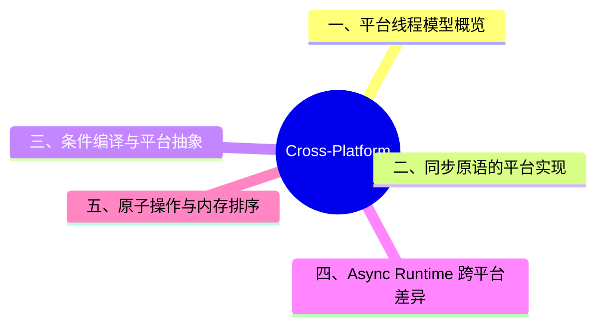

> **内容分级**: [专家级]

# Cross-Platform Concurrency（跨平台并发）
>
> **EN**: Cross-Platform Concurrency
> **Summary**: Platform-specific threading models, synchronization primitives, and conditional-compilation strategies for writing portable concurrent Rust across Windows, Linux, macOS, and mobile targets.
> **Rust 版本**: 1.97.0+ (Edition 2024)
> **受众**: [专家]
> **Bloom 层级**: L4-L5
> **权威来源**: 本文件为 `concept/` 权威页。
> **A/S/P 标记**: **S+P** — Structure + Procedure
> **双维定位**: C×Eva — 评价并发设计在不同平台下的可移植性
> **L2 基础入口**: [Smart Pointers](../../02_intermediate/02_memory_management/04_smart_pointers.md)
> **前置依赖**: [Concurrency](01_concurrency.md) · [Conditional Compilation](../03_proc_macros/11_conditional_compilation.md)
> **后置概念**: [Rust for Linux](../../07_future/04_research_and_experimental/04_rust_for_linux.md)
>
> **主要来源**: [Rust Reference — Conditional Compilation](https://doc.rust-lang.org/reference/conditional-compilation.html) · [std::thread](https://doc.rust-lang.org/std/thread/) · [Rust Platform Support](https://doc.rust-lang.org/rustc/platform-support.html)

---

## 📑 目录

- [Cross-Platform Concurrency（跨平台并发）](#cross-platform-concurrency跨平台并发)
  - [📑 目录](#-目录)
  - [一、平台线程模型概览](#一平台线程模型概览)
  - [二、同步原语的平台实现](#二同步原语的平台实现)
  - [三、条件编译与平台抽象](#三条件编译与平台抽象)
  - [四、Async Runtime 跨平台差异](#四async-runtime-跨平台差异)
  - [五、原子操作与内存排序](#五原子操作与内存排序)
  - [六、移动平台注意事项](#六移动平台注意事项)
  - [七、测试矩阵建议](#七测试矩阵建议)
  - [八、常见陷阱](#八常见陷阱)
  - [认知路径](#认知路径)
  - [定理链](#定理链)
  - [反命题](#反命题)
  - [反向推理](#反向推理)
  - [过渡段](#过渡段)
  - [权威来源索引](#权威来源索引)
  - [📋 关键属性](#-关键属性)
  - [🔗 概念关系](#-概念关系)
  - [国际权威参考 / International Authority References（P1 学术 · P2 生态）](#国际权威参考--international-authority-referencesp1-学术--p2-生态)
  - [⚠️ 反例与陷阱：spawn 闭包捕获借用数据](#️-反例与陷阱spawn-闭包捕获借用数据)
  - [🧭 思维导图（Mindmap）](#-思维导图mindmap)

---

## 一、平台线程模型概览

| 平台 | 线程模型 | 关键原生 API |
|:---|:---|:---|
| Windows | 1:1（用户线程 : 内核线程），纤程（Fibers），线程池 API | `CreateThread`, SRWLock, IOCP |
| Linux | NPTL 1:1，轻量级进程（LWP） | `pthread`, `futex`, `epoll`/`io_uring` |
| macOS | POSIX 线程 + Grand Central Dispatch | `pthread`, GCD, `NSOperationQueue` |
| Android / iOS | 继承 Linux / Darwin 模型，附加后台执行限制 | JNI, QoS |

Rust 的 `std::thread` 与 `std::sync` 已封装大部分差异，但跨平台优化仍需理解底层实现。(Source: [std::thread](https://doc.rust-lang.org/std/thread/), [std::sync](https://doc.rust-lang.org/std/sync/))

---

## 二、同步原语的平台实现

```rust
use std::sync::Mutex;

fn mutex_example() {
    let m = Mutex::new(0);
    // Windows: SRWLock (Slim Reader/Writer Lock)
    // Linux / macOS: pthread_mutex
    *m.lock().unwrap() += 1;
}
```

平台特定代码应使用 `#[cfg(target_os = "...")]` 隔离，并对外暴露统一接口。(Source: [Rust Reference — Conditional Compilation](https://doc.rust-lang.org/reference/conditional-compilation.html))

---

## 三、条件编译与平台抽象

```rust
#[cfg(target_os = "windows")]
fn optimal_thread_count() -> usize {
    std::env::var("NUMBER_OF_PROCESSORS")
        .ok()
        .and_then(|s| s.parse().ok())
        .unwrap_or(4)
}

#[cfg(not(target_os = "windows"))]
fn optimal_thread_count() -> usize {
    std::thread::available_parallelism()
        .map(|n| n.get())
        .unwrap_or(4)
}
```

**最佳实践**:

1. 优先使用 Rust 标准库抽象。
2. 用 `#[cfg]` 清晰隔离平台特定代码，并提供默认实现。
3. 在 CI 中覆盖所有目标平台。
4. 文档化平台差异与性能特性。

---

## 四、Async Runtime 跨平台差异

| Runtime | 线程模型 | 平台支持 | 适用场景 |
|:---|:---|:---|:---|
| Tokio | 多线程 work-stealing | Windows/Linux/macOS | 通用异步（Async）服务 |
| async-std | 多线程 | 主流桌面/服务器 | 与 std 风格一致的异步 |
| smol | 轻量 | 主流平台 | 嵌入式/低依赖 |
| monoio | thread-per-core (io_uring) | Linux | 极致性能 |
| embassy | async/await | 嵌入式/RTOS | no_std |

选择 Runtime 时，应优先确认目标平台是否支持其底层原语（如 io_uring 仅限较新 Linux 内核）。(Source: [Tokio docs](https://tokio.rs/), [monoio docs](https://docs.rs/monoio))

## 五、原子操作与内存排序

跨平台代码应显式选择内存排序，避免依赖平台默认：(Source: [Rust Reference — Atomic Types](https://doc.rust-lang.org/reference/types.html#atomic-types), [std::sync::atomic::Ordering](https://doc.rust-lang.org/std/sync/atomic/enum.Ordering.html))

```rust
use std::sync::atomic::{AtomicUsize, Ordering};

static COUNTER: AtomicUsize = AtomicUsize::new(0);

COUNTER.fetch_add(1, Ordering::Relaxed); // 仅用于独立计数器
COUNTER.fetch_add(1, Ordering::SeqCst);  // 需要全局顺序时
```

## 六、移动平台注意事项

- **Android**: 后台线程常通过 JNI 暴露；注意 `setpriority` 与电量管理限制。
- **iOS**: 后台执行受严格限制，应使用 QoS / GCD 而非长时间运行的原生线程。

## 七、测试矩阵建议

```yaml
# .github/workflows/ci.yml 示例（概念上）
strategy:
  matrix:
    os: [ubuntu-latest, windows-latest, macos-latest]
    target: [x86_64, aarch64]
```

## 八、常见陷阱

- 使用 `std::thread::available_parallelism()` 而非固定线程数。
- 避免在共享路径中假设文件系统大小写敏感。
- 信号处理在 Windows 与 Unix 上差异巨大，尽量使用 crossbeam 等封装库。

## 认知路径

1. **问题识别**: 同一套并发代码在 Windows、Linux、macOS 与移动平台上的线程模型、同步原语和后台策略存在差异。
2. **概念建立**: 理解 `std::thread`/`std::sync` 的跨平台封装、`#[cfg(target_os = "...")]` 条件编译与 Async Runtime 的平台适配。
3. **机制推理**: 通过平台线程模型 → 同步原语选择 → 条件编译抽象的定理链，评估可移植性。
4. **边界辨析**: 借助反命题识别“一次编写、到处运行”的误区与移动平台后台限制。
5. **迁移应用**: 将跨平台并发设计与 [Conditional Compilation](../03_proc_macros/11_conditional_compilation.md)、[Concurrency](01_concurrency.md) 链接，形成可维护的 CI 测试矩阵。

## 定理链

| 定理 | 前提 | 结论 |
|:---|:---|:---|
| 平台线程模型差异 ⟹ 同步原语选择必须显式 | 不同 OS 使用不同内核对象 | 代码中应避免隐式依赖默认排序或固定线程数 |
| 条件编译隔离平台代码 ⟹ 可维护性提升 | `#[cfg]` 将平台差异限制在最小模块（Module） | 上层逻辑可保持平台无关 |
| Async Runtime 依赖底层原语 ⟹ 选型前需确认目标平台 | io_uring / GCD / IOCP 支持不同 | 生产环境需验证 CI 矩阵覆盖 |

## 反命题

> **反命题 1**: "Rust 的 `std::sync` 在所有平台上语义完全一致" ⟹ 不成立。实现底层使用不同内核原语，性能特征与极限行为存在差异。
>
> **反命题 2**: "跨平台并发代码不需要条件编译" ⟹ 不成立。路径分隔符、信号处理、后台策略等差异必须通过 `#[cfg]` 或统一抽象处理。
>
> **反命题 3**: "移动平台可以像桌面平台一样长时间持有后台线程" ⟹ 不成立。Android / iOS 对后台执行有电量与 QoS 限制。

## 反向推理

> **反向推理 1**: 观察到某并发程序在 Linux 上性能优异而在 Windows 上抖动明显 ⟸ 说明需要检查 Mutex 底层实现差异与 IOCP / epoll 的选型。
>
> **反向推理 2**: 发现 CI 在 macOS 上频繁超时 ⟸ 说明应审查 `available_parallelism()` 与 GCD 后台 QoS 的兼容性。

## 过渡段

> **过渡**: 从平台线程模型过渡到同步原语，可以发现 `std::sync` 仅是统一接口，其性能边界仍需结合 OS 特性分析。
>
> **过渡**: 从条件编译过渡到 Async Runtime，可以理解平台抽象不仅发生在编译期，也发生在运行时原语选型。
>
> **过渡**: 从移动平台注意事项过渡到测试矩阵，可以建立“先抽象、后验证”的跨平台并发工程流程。

---

## 权威来源索引

- [Rust Reference — Conditional Compilation](https://doc.rust-lang.org/reference/conditional-compilation.html)
- [Rust Platform Support](https://doc.rust-lang.org/rustc/platform-support.html)
- [std::thread](https://doc.rust-lang.org/std/thread/)

> **权威来源**: [Rust Reference — Conditional Compilation](https://doc.rust-lang.org/reference/conditional-compilation.html), [std::thread](https://doc.rust-lang.org/std/thread/), [Rust Platform Support](https://doc.rust-lang.org/rustc/platform-support.html), [TRPL Ch16 — Fearless Concurrency](https://doc.rust-lang.org/book/ch16-00-concurrency.html)
>
> **权威来源对齐变更日志**: 2026-07-10 Stage F L3 补全权威来源块与关键引用（Reference） [Authority Source Sprint Batch 10](../../00_meta/02_sources/05_international_authority_index.md)

---

## 📋 关键属性

| 属性 | 取值 / 判定 | 依据 |
|---|---|---|
| 线程模型 | pthreads / Windows threads / wasm 受限线程等平台差异 | 本文 §一 |
| 同步原语 | `std::sync` 提供跨平台一致 API，底层映射 OS 原语 | 本文 §二 |
| 条件编译 | `#[cfg(target_os = "...")]` 封装平台特定路径 | 本文 §三 |
| async 后端 | epoll / IOCP / kqueue 差异由 runtime 屏蔽 | 本文 §四 |
| 测试矩阵 | CI 需覆盖 linux / windows / macos × 目标架构 | 本文 §七 |

## 🔗 概念关系

- **上位（is-a）**：[并发](01_concurrency.md) 的平台可移植性维度。
- **下位（实例）**：平台线程模型、同步原语映射、条件编译、移动端注意事项。
- **组合**：与 [跨平台进程管理](../08_process_ipc/04_cross_platform_process_management.md)、[原子操作与内存序](06_atomics_and_memory_ordering.md)（§五）组合。
- **依赖**：依赖 `std::sync` 的跨平台抽象（见 [并发](01_concurrency.md)）。

---

## 国际权威参考 / International Authority References（P1 学术 · P2 生态）

> 依据 `AGENTS.md` §2「对齐网络国际化权威内容」补充：仅追加已验证可达的权威链接，不改动正文事实。

- **P1 学术/形式化**: [Hoare: Communicating Sequential Processes (CACM 1978)](https://dl.acm.org/doi/10.1145/359576.359585) · [RustBelt: Securing the Foundations of the Rust Programming Language (POPL 2018)](https://dl.acm.org/doi/10.1145/3158154)

---

## ⚠️ 反例与陷阱：spawn 闭包捕获借用数据

**反例**（rustc 1.97 实测编译失败：E0373）：

```rust,compile_fail
use std::thread;
fn main() {
    let data = vec![1, 2, 3];
    thread::spawn(|| {
        println!("{}", data.len());
    }).join().unwrap();
}
```

`thread::spawn` 要求闭包 `'static`：线程可能长于栈帧，借用局部数据在所有平台上都被拒绝（与平台无关的统一保证）。

**修正**：

```rust
use std::thread;
fn main() {
    let data = vec![1, 2, 3];
    thread::spawn(move || {
        println!("{}", data.len());
    }).join().unwrap();
}
```

## 🧭 思维导图（Mindmap）


