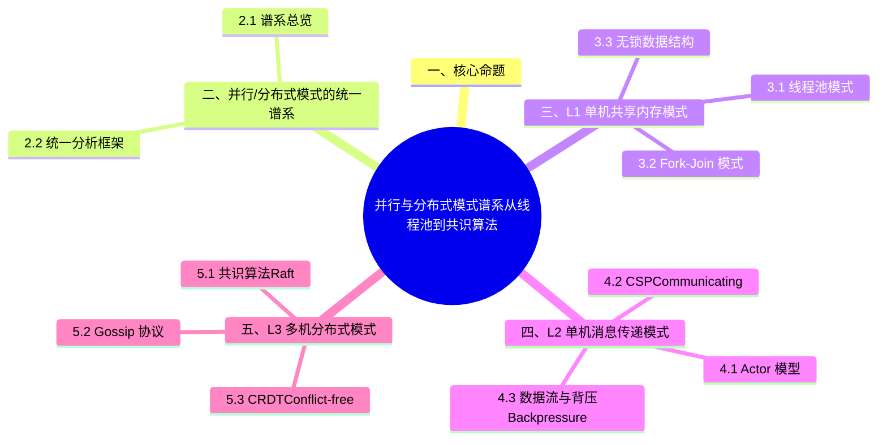

> **内容分级**: [专家级]

# 并行与分布式模式谱系：从线程池到共识算法
>
> **EN**: Parallel Distributed Pattern Spectrum
> **Summary**: Parallel Distributed Pattern Spectrum: advanced Rust topics, performance/runtime considerations, and ecosystem patterns.
> **受众**: [专家]
> **权威来源**: 本文件为 `concept/` 权威页。
> **层级**: L3 高级概念 — 并发/分布式系统设计
> **A/S/P 标记**: **S+A** — Structure + Application
> **双维定位**: C×Ana — 分析并行与分布式模式的演进谱系与统一框架
> **前置概念**:
> [Concurrency](01_concurrency.md) ·
> [Async](../01_async/01_async.md) ·
> [Lock-free](07_lock_free.md) ·
> [Traits](../../02_intermediate/00_traits/01_traits.md) ·
> [Distributed Systems](../../06_ecosystem/04_web_and_networking/01_distributed_systems.md)
> **后置概念**:
> [Pattern Composition Algebra](../../06_ecosystem/03_design_patterns/16_pattern_composition_algebra.md) ·
> [System Design Principles](../../06_ecosystem/03_design_patterns/03_system_design_principles.md)
> **主要来源**: · [Herlihy & Shavit — The Art of Multiprocessor Programming](https://dl.acm.org/doi/10.5555/2385452) · [Batty et al. — The Semantics of Multicore C](https://doi.org/10.1145/2049706.2049711) · [Oxide: The Essence of Rust](https://arxiv.org/abs/1903.00982) · [Itanium C++ ABI](https://itanium-cxx-abi.github.io/cxx-abi/abi.html)
> [Herlihy & Shavit — The Art of Multiprocessor Programming] ·
> [Lynch — Distributed Algorithms] · [Tanenbaum — Distributed Systems] ·
> [Amazon Science — Must Framework] ·
> [Rust Atomics and Locks](https://marabos.nl/atomics/)
>
> **来源**: [std::thread](https://doc.rust-lang.org/std/thread/) · [Rayon Docs](https://docs.rs/rayon/) · [TRPL — Fearless Concurrency](https://doc.rust-lang.org/book/ch16-00-concurrency.html)
---

> **Bloom 层级**: L3-L6
> **对应 Crate**: [`c05_threads`](../../crates/c05_threads)
> **对应练习**: [`exercises/src/concurrency/`](../../exercises/src/concurrency)

## 📑 目录

- [并行与分布式模式谱系：从线程池到共识算法](#并行与分布式模式谱系从线程池到共识算法)
  - [📑 目录](#-目录)
  - [一、核心命题](#一核心命题)
  - [二、并行/分布式模式的统一谱系](#二并行分布式模式的统一谱系)
    - [2.1 谱系总览](#21-谱系总览)
    - [2.2 统一分析框架](#22-统一分析框架)
  - [三、L1 单机共享内存模式](#三l1-单机共享内存模式)
    - [3.1 线程池模式](#31-线程池模式)
    - [3.2 Fork-Join 模式](#32-fork-join-模式)
    - [3.3 无锁数据结构](#33-无锁数据结构)
  - [四、L2 单机消息传递模式](#四l2-单机消息传递模式)
    - [4.1 Actor 模型](#41-actor-模型)
    - [4.2 CSP（Communicating Sequential Processes）](#42-cspcommunicating-sequential-processes)
    - [4.3 数据流与背压（Backpressure）](#43-数据流与背压backpressure)
  - [五、L3 多机分布式模式](#五l3-多机分布式模式)
    - [5.1 共识算法：Raft](#51-共识算法raft)
    - [5.2 Gossip 协议](#52-gossip-协议)
    - [5.3 CRDT（Conflict-free Replicated Data Types）](#53-crdtconflict-free-replicated-data-types)
  - [六、模式谱系的统一理论视角](#六模式谱系的统一理论视角)
    - [6.1 从并发到分布式的统一连续体](#61-从并发到分布式的统一连续体)
    - [6.2 一致性谱系](#62-一致性谱系)
  - [七、Rust 生态的并发/分布式工具谱系](#七rust-生态的并发分布式工具谱系)
  - [八、反例与边界测试](#八反例与边界测试)
    - [8.1 反例：在 Actor 中使用共享可变状态](#81-反例在-actor-中使用共享可变状态)
    - [8.2 边界测试：`!Send` 类型跨线程（编译错误）](#82-边界测试send-类型跨线程编译错误)
    - [8.3 边界测试：Raft 在网络分区下的行为](#83-边界测试raft-在网络分区下的行为)
    - [8.3 边界测试：CRDT 的合并顺序独立性](#83-边界测试crdt-的合并顺序独立性)
  - [九、知识来源关系](#九知识来源关系)
  - [十、边界测试：并行与分布式模式的编译错误](#十边界测试并行与分布式模式的编译错误)
    - [10.1 边界测试：`rayon::join` 闭包返回值生命周期（编译错误）](#101-边界测试rayonjoin-闭包返回值生命周期编译错误)
    - [10.2 边界测试：分布式 Actor 的消息类型未实现 `Serialize`（编译错误）](#102-边界测试分布式-actor-的消息类型未实现-serialize编译错误)
    - [10.3 边界测试：`rayon` 的线程池饥饿与任务粒度（运行时性能下降）](#103-边界测试rayon-的线程池饥饿与任务粒度运行时性能下降)
    - [10.4 边界测试：rayon 的并行迭代与顺序依赖（运行时逻辑错误）](#104-边界测试rayon-的并行迭代与顺序依赖运行时逻辑错误)
    - [10.8 边界测试：生命周期参数的不匹配返回](#108-边界测试生命周期参数的不匹配返回)
  - [逆向推理链（Backward Reasoning）](#逆向推理链backward-reasoning)
  - [参考来源](#参考来源)
  - [嵌入式测验（Embedded Quiz）](#嵌入式测验embedded-quiz)
    - [测验 1：`std::thread::spawn` 与 `tokio::spawn` 创建的"任务"有什么本质区别？（理解层）](#测验-1stdthreadspawn-与-tokiospawn-创建的任务有什么本质区别理解层)
    - [测验 2：Rayon 的 `par_iter()` 与标准库的 `iter()` 在 API 使用上有什么区别？（理解层）](#测验-2rayon-的-par_iter-与标准库的-iter-在-api-使用上有什么区别理解层)
    - [测验 3：Actor 模型在 Rust 中的典型实现方式是什么？（理解层）](#测验-3actor-模型在-rust-中的典型实现方式是什么理解层)
    - [测验 4：分布式系统中，Rust 的 Serde + 强类型系统在消息序列化上有什么优势？（理解层）](#测验-4分布式系统中rust-的-serde--强类型系统在消息序列化上有什么优势理解层)
    - [测验 5：`crossbeam::channel` 与 `std::sync::mpsc` 的主要改进是什么？（理解层）](#测验-5crossbeamchannel-与-stdsyncmpsc-的主要改进是什么理解层)
  - [认知路径](#认知路径)
    - [核心推理链](#核心推理链)
  - [实践](#实践)
    - [对应代码示例](#对应代码示例)
    - [建议练习](#建议练习)
  - [导航：下一步去哪？](#导航下一步去哪)
  - [迁移内容（来自 `crates/c05_threads/docs/08_parallelism_and_beyond.md`）](#迁移内容来自-cratesc05_threadsdocs08_parallelism_and_beyondmd)
  - [1. 并发 (Concurrency) vs. 并行 (Parallelism)](#1-并发-concurrency-vs-并行-parallelism)
    - [1.1. 形式化区分](#11-形式化区分)
    - [1.2. Rust 的模型映射](#12-rust-的模型映射)
  - [2. 数据并行：Rayon 库](#2-数据并行rayon-库)
    - [2.1. 核心理念：轻松将串行改为并行](#21-核心理念轻松将串行改为并行)
    - [2.2. 并行迭代器 (`ParallelIterator`)](#22-并行迭代器-paralleliterator)
    - [2.3. 工作窃取 (Work-Stealing) 调度](#23-工作窃取-work-stealing-调度)
  - [3. 其他关键并发/并行库](#3-其他关键并发并行库)
    - [3.1. `crossbeam`: 更强大的通道与工具](#31-crossbeam-更强大的通道与工具)
    - [3.2. `tokio` 和 `async-std [已归档]`: 异步运行时](#32-tokio-和-async-std-已归档-异步运行时)
  - [4. 哲学批判性分析](#4-哲学批判性分析)
    - [4.1. 抽象层次的提升](#41-抽象层次的提升)
    - [4.2. "无畏"的边界](#42-无畏的边界)
  - [5. 总结](#5-总结)
  - [🧭 思维导图（Mindmap）](#-思维导图mindmap)

## 一、核心命题

> **并行与分布式模式不是孤立的技巧集合，而是一个从"共享内存线程协作"到"广域网共识达成"的连续谱系。
> 理解这一谱系的统一结构——从 Fork-Join 到 Actor 到 CSP 到数据流再到分布式共识——是设计高性能、高可用系统的必要认知框架。**

---

## 二、并行/分布式模式的统一谱系

并行与分布式模式可以排布在一条统一谱系上，横轴是「故障与延迟模型」的严酷程度，纵轴是「共享假设」的强弱：

**谱系总览**：

| 层级 | 通信机制 | 故障模型 | 延迟假设 | 代表模式 |
|:---|:---|:---|:---|:---|
| L1 单机共享内存 | 读写共享地址空间 | 进程整体崩溃 | 纳秒级，可靠 | 线程池、Fork-Join、无锁结构 |
| L2 单机消息传递 | 进程内通道/邮箱 | 任务级 panic 可隔离 | 微秒级，可靠 | Actor、CSP、数据流 |
| L3 多机分布式 | 网络消息 | 部分故障、网络分区 | 毫秒级+，不可靠 | Raft、Gossip、CRDT |

**统一分析框架**：沿谱系右移，三个假设逐级被打破——「内存一致」→「消息必达」→「全局时钟存在」。每个层级的模式都是对该层假设的最优利用：L1 用锁/原子（依赖缓存一致性协议），L2 用隔离状态 + 消息（放弃共享换容错粒度），L3 用复制与共识（放弃单点真值换分区容忍）。

框架的实用推论：模式选型不是「哪个先进」，而是「运行环境提供哪层假设」——单机多核强行用 Raft 是复杂度浪费，跨机房用共享内存抽象（如分布式锁当本地锁）是正确性灾难。

### 2.1 谱系总览

```text
并行/分布式模式谱系:

L1: 单机共享内存
├── 线程池（Thread Pool）
├── Fork-Join（分治并行）
├── 锁与条件变量（Mutex / Condvar）
├── 读写锁（RwLock）
└── 无锁数据结构（Lock-free）

L2: 单机消息传递
├── Actor 模型（Actix / akka）
├── CSP 通道（Channel / goroutine）
├── 数据流（Dataflow / rayon）
└── 响应式流（Reactive Streams / backpressure）

L3: 多机分布式
├── 主从复制（Master-Slave Replication）
├── 分片（Sharding / Partitioning）
├── 共识算法（Consensus / Raft / Paxos）
├── Gossip 协议（Epidemic Broadcast）
└── CRDT（Conflict-free Replicated Data Types）

L4: 广域网/边缘
├── CDN / 边缘缓存
├── 联邦学习（Federated Learning）
└── 区块链共识（PoW / PoS / BFT）
```

### 2.2 统一分析框架

所有并行/分布式模式都可以通过四个维度分析：

| 维度 | 说明 | 线程池 | Actor | Raft | CRDT |
|:---|:---|:---|:---|:---|:---|
| **通信模型** | 如何交换信息 | 共享内存 | 消息传递 | RPC + 日志复制 | 操作传播 |
| **同步机制** | 如何协调执行 | 锁 / 原子操作（Atomic Operations） | 邮箱顺序 | Leader 选举 + 日志 | 无同步（最终一致） |
| **故障模型** | 假设何种故障 | 崩溃停止 | 崩溃停止 | 崩溃停止 / 拜占庭 | 网络分区 |
| **一致性（Coherence）模型** | 保证何种一致性 | 顺序一致 | 单 Actor 顺序 | 线性一致 | 最终一致 |

---

## 三、L1 单机共享内存模式

单机共享内存是并行计算的第一层谱系：所有执行单元共享同一地址空间，通信成本最低但同步复杂度最高。本节按「数据结构并行 → 任务并行」展开核心模式：

- **数据并行**：`rayon::par_iter` 把迭代器操作自动切分到线程池——工作窃取调度保证负载均衡，程序员只需保证闭包 `Sync`（类型系统强制）；
- **任务并行**：`rayon::join(a, b)` 分叉-合并（fork-join）模型，递归分解问题的标准骨架；
- **分片共享状态**：`DashMap`/分桶锁把全局锁竞争降为分片级竞争；原子计数器处理「只增」类统计。

Rust 的独特优势：`Send`/`Sync` 标记把「能否跨线程共享」变成编译期判定——共享内存模式在 C/C++ 中的主要风险（数据竞争）在此被类型系统排除，剩余风险集中在锁顺序与原子序选择。

### 3.1 线程池模式

```rust
use rayon::ThreadPoolBuilder;

// 线程池: 固定数量的工作线程 + 任务队列
let pool = ThreadPoolBuilder::new()
    .num_threads(4)
    .build()
    .unwrap();

pool.spawn(|| {
    println!("Task executed on worker thread");
});
```

**核心设计**: 避免线程创建/销毁的开销，复用固定数量的工作线程。

**与进程池的对比**:

| 维度 | 线程池 | 进程池 |
|:---|:---|:---|
| 内存共享 | 共享地址空间 | 隔离地址空间 |
| 通信开销 | 低（直接访问内存） | 高（IPC） |
| 容错 | 一个线程崩溃可能拖垮整个进程 | 一个进程崩溃不影响其他进程 |
| GIL 问题 | 无（Rust 无 GIL） | 无 |
| 适用场景 | CPU 密集型 | IO 密集型 / 需要隔离的场景 |

### 3.2 Fork-Join 模式

```rust
use rayon::prelude::*;

// Fork-Join: 递归分解任务，并行执行子任务，合并结果
fn parallel_sum(data: &[i32]) -> i32 {
    if data.len() <= 1000 {
        return data.iter().sum(); // 基例: 串行
    }

    let mid = data.len() / 2;
    let (left, right) = data.split_at(mid);

    let (sum_left, sum_right) = rayon::join(
        || parallel_sum(left),
        || parallel_sum(right),
    );

    sum_left + sum_right
}

// 更简洁: rayon 的并行迭代器
fn parallel_sum_v2(data: &[i32]) -> i32 {
    data.par_iter().sum()
}
```

**与算法层的联系**: Fork-Join 是**分治算法**的并行实现。见 [语义桥 — 分治 ↔ Composite ↔ Parallel Split](../../00_meta/00_framework/semantic_bridge_algorithms_patterns.md)。

### 3.3 无锁数据结构

```rust
use crossbeam::queue::ArrayQueue;

// Michael-Scott 无锁队列（FIFO）
let queue = ArrayQueue::new(100);

// 多生产者多消费者，无锁操作
queue.push(42).unwrap();
let value = queue.pop();
```

**锁 vs 无锁的决策树**:

```text
需要并发数据结构？
├── 读多写少？ → RwLock（读并发，写独占）
├── 写操作简单（单个 CAS）？ → Lock-free（无阻塞，高吞吐）
├── 需要阻塞等待？ → Mutex + Condvar
└── 需要等待-free 保证？ → Wait-free（ hardest to implement）
```

---

## 四、L2 单机消息传递模式

消息传递模式用通信替代共享：执行单元各自持有私有状态，通过通道交换不可变或转移所有权（Ownership）的消息。本层谱系覆盖：

- **CSP 通道**：`std::mpsc`/`crossbeam` 的点对点与广播——`Sender: Send` 使生产者可跨线程，`Receiver` 单消费者语义由类型保证；
- **Actor 模型**：邮箱 + 消息循环的封装形态，状态完全私有化——适合故障隔离与热升级场景；
- **流水线（pipeline）**：多阶段通道串联，每阶段独立线程——背压与阶段间速率匹配是主要调优点。

与 L1 的选型判定：共享数据结构复杂且竞争激烈时，消息传递用「通信成本」换「同步复杂度」；数据量大且访问模式规则时，共享内存 + rayon 几乎总是更快。

### 4.1 Actor 模型

```rust,ignore
use actix::prelude::*;

// Actor: 封装状态 + 邮箱 + 消息处理
struct Counter {
    count: usize,
}

impl Actor for Counter {
    type Context = Context<Self>;
}

// 消息定义
struct Increment;
impl Message for Increment {
    type Result = usize;
}

// 消息处理
impl Handler<Increment> for Counter {
    fn handle(&mut self, _msg: Increment, _ctx: &mut Context<Self>) -> usize {
        self.count += 1;
        self.count
    }
}
```

**Actor 模型的核心原则**:

1. **封装**: Actor 的状态不共享，只能通过消息访问
2. **异步（Async）**: 消息发送非阻塞，Actor 按顺序处理邮箱中的消息
3. **容错**: Actor 崩溃不影响其他 Actor（监督树机制）

**与共享内存的对比**:

| 维度 | 共享内存 + 锁 | Actor 模型 |
|:---|:---|:---|
| 状态共享 | 显式共享，需要同步 | 不共享，通过消息传递 |
| 死锁 | 可能 | **不可能**（无共享状态） |
| 数据竞争 | 可能（需正确使用锁） | **不可能**（单线程处理） |
| 性能 | 低延迟（直接内存访问） | 较高延迟（消息序列化） |
| 扩展性 | 单机 | 天然分布式 |

### 4.2 CSP（Communicating Sequential Processes）

```rust
use std::sync::mpsc;
use std::thread;

// CSP: 通过通道通信的并发进程
let (tx, rx) = mpsc::channel::<i32>();

thread::spawn(move || {
    for i in 0..10 {
        tx.send(i * i).unwrap(); // 发送消息
    }
});

for received in rx { // 接收消息
    println!("Got: {}", received);
}
```

**CSP 的核心原则**:

1. **不要通过共享内存通信；通过通信共享内存**
2. 通道是同步或异步（Async）的消息队列
3. 发送和接收是显式操作

**Actor vs CSP 对比**:

| 维度 | Actor | CSP |
|:---|:---|:---|
| 通信方式 | 直接发送到 Actor 邮箱（命名目标） | 发送到通道（匿名目标） |
| 耦合度 | Actor 知道接收者 | 发送者不知道接收者 |
| 消息顺序 | 每个 Actor 内部有序 | 通道内有序 |
| 典型实现 | Actix、Erlang、Akka | Go、Rust channels、Occam |

### 4.3 数据流与背压（Backpressure）

```rust,ignore
use tokio::sync::mpsc;

// 有界通道: 背压机制 —— 发送者阻塞/等待当缓冲区满
let (tx, mut rx) = mpsc::channel::<i32>(100); // 容量 100

// 生产者
 tokio::spawn(async move {
    for i in 0..1000 {
        tx.send(i).await.unwrap(); // 当通道满时，await 阻塞
    }
});

// 消费者
while let Some(value) = rx.recv().await {
    process(value).await;
}
```

**背压的必要性**: 无背压的系统在快生产者 + 慢消费者场景下会导致内存耗尽。

---

## 五、L3 多机分布式模式

多机分布式模式的三个代表，分别回答「一致性、传播、合并」三个分布式原问题：

- **共识算法：Raft**：在「节点可能崩溃、网络可能分区」下让多数派对「日志条目的全序」达成一致。核心机制三件套：领导者选举（任期 + 多数投票）、日志复制（领导者追加、 follower 确认、过半提交）、安全性约束（选举限制保证已提交条目不丢失）。Rust 实现见 `raft-rs`（TiKV 生产使用）。Raft 保证的是「顺序一致性」——代价是每次写需过半节点往返（写延迟 ≥ 1 RTT）。
- **Gossip 协议**：概率式信息传播——每节点周期性与随机邻居交换状态，信息以「传染病模型」在 O(log N) 轮内覆盖集群。适用于「最终一致即可」的元数据传播（成员列表、负载信息），不适用于需要排序/一致性的事件（那是 Raft 的领域）。`memberlist`（hashicorp）是工程基准。
- **CRDT（无冲突复制数据类型）**：把「合并」做成满足交换律/结合律/幂等律的数学结构（G-Counter 只增计数器、LWW-Register 最后写胜出寄存器、OR-Set 观察移除集合）——任意顺序、任意重复的合并都收敛到同一状态，无需协调。代价是元数据开销（版本向量/点戳）与「表达能力受格结构限制」。Rust 生态有 `crdts` 库；生产案例见 Riak/Ditto。

选型判定：需要「全序与强一致」→ Raft；需要「大规模最终一致元数据」→ Gossip；需要「离线优先 + 自动合并」→ CRDT。三者可组合（如 CRDT 存数据 + Raft 管配置）。

### 5.1 共识算法：Raft

```rust,ignore
// Raft 的核心状态机（简化概念模型）
enum NodeState {
    Follower { leader_id: Option<NodeId> },
    Candidate { votes_received: usize },
    Leader { next_index: HashMap<NodeId, usize> },
}

// Raft 保证的性质:
// 1. Election Safety: 每个任期最多一个 Leader
// 2. Leader Append-Only: Leader 从不覆盖/删除日志条目
// 3. Log Matching: 若两个日志条目索引和任期相同，则内容相同
// 4. Leader Completeness: 已提交的条目存在于所有未来 Leader 的日志中
// 5. State Machine Safety: 若节点应用了某索引的日志，则所有节点应用的该索引内容相同
```

**CAP 定理与 Raft 的定位**:

Raft 是 **CP 系统**（Consistency + Partition tolerance，牺牲 Availability）：

- 网络分区时，少数派节点不可用（不响应读写请求）
- 保证强一致性（Coherence）（线性一致性）

### 5.2 Gossip 协议

Gossip 协议是 **AP 系统**（Availability + Partition tolerance，牺牲 Consistency）：

```text
Gossip 传播模型:
  每个节点周期性地随机选择 k 个邻居，交换状态信息
  传播速度: O(log N) 轮覆盖全网（类似传染病模型）

  类型:
    - Anti-entropy: 全量同步，修复不一致
    - Rumor-mongering: 增量传播，新信息像谣言一样扩散
```

**与 Raft 的对比**:

| 维度 | Raft | Gossip |
|:---|:---|:---|
| 一致性（Coherence） | 强一致（线性一致） | 最终一致 |
| 可用性 | 分区时不可用 | 始终可用 |
| 节点数 | 3-7 个（小集群） | 100-10000 个（大规模） |
| 收敛速度 | 立即（Leader 写入即提交） | O(log N) 轮 |
| 适用场景 | 配置管理、元数据存储 | 成员发现、状态传播、缓存失效 |

### 5.3 CRDT（Conflict-free Replicated Data Types）

> **[Shapiro et al. 2011 — A Comprehensive Study of Convergent and Commutative Replicated Data Types](https://hal.inria.fr/inria-00555588/) · [Rust crdt crate] · [Wikipedia: CRDT](https://en.wikipedia.org/wiki/Conflict-free_replicated_data_type)** ✅

CRDT 是**无需同步**即可保证最终一致性（Coherence）的数据结构：

```rust,ignore
// G-Counter（Grow-only Counter）: 单调递增的分布式计数器
use crdt::GCounter;

let mut counter_a = GCounter::new();
let mut counter_b = GCounter::new();

counter_a.increment("node_a", 5);
counter_b.increment("node_b", 3);

// 合并: 取每个节点的最大值
counter_a.merge(&counter_b);
assert_eq!(counter_a.value(), 8); // 5 + 3
```

**CRDT 的数学基础**:

```text
CRDT 必须满足:
  1. 交换律（Commutativity）: A ⊔ B = B ⊔ A
  2. 结合律（Associativity）: (A ⊔ B) ⊔ C = A ⊔ (B ⊔ C)
  3. 幂等律（Idempotence）: A ⊔ A = A

∴ CRDT 的合并操作构成一个**联结半格（Join Semilattice）**
```

> **定理** [Tier 2]: 若两个 CRDT 副本独立演化后合并，其结果等价于它们所有更新按某种顺序顺序应用的结果。
>
> **来源**: [Shapiro et al., 2011] ✅

---

## 六、模式谱系的统一理论视角

本节把谱系两侧的模式纳入同一理论视角，说明 L1–L3 不是三类技术而是同一问题的三个解：

- **从并发到分布式的统一连续体**：并发控制的根本问题是「对共享状态的访问排序」。L1 用硬件缓存一致性 + 锁排序（微秒级协调），L2 用消息顺序 + 隔离状态排序（放弃共享），L3 用共识/逻辑时钟排序（放弃同时性）。CAP 定理在该连续体上的投影：L1 假设无分区（CP 天然成立），L3 必须在分区时选 C 或 A——Raft 选 CP（分区少数派拒绝服务），CRDT 选 AP（分区可写、事后合并）。
- **一致性谱系**：线性一致（linearizability，Raft 写路径）→ 顺序一致 → 因果一致（CRDT 经版本向量可达）→ 最终一致（Gossip）。谱系每降一级，可用性与延迟改善一档，推理复杂度上升一档——「读到旧值」从「不可能」变为「可能但有限窗口」再到「总是可能」。

统一视角的工程用法：设计分布式系统时，先定「每类数据需要的一致性级别」（谱系定位），再反查该级别对应的最轻机制——常见过度设计是「全部数据按最强级别处理」，常见错误是「会话状态按最终一致处理」。

### 6.1 从并发到分布式的统一连续体

并行与分布式计算的区别不是二元的，而是连续谱系：

```text
并发连续体:

共享内存 ──────────────────────────────────────── 消息传递
  │                                                  │
  ├── 同一进程的多线程（std::thread）                  ├── 同一机器的多进程（IPC）
  ├── NUMA 架构（非均匀内存访问）                      ├── 同一数据中心的 RPC
  ├── 分布式共享内存（DSM）                           ├── 广域网的 REST/gRPC
  └── "分布式系统就是网络延迟足够高的并行系统"         └── "并行系统就是网络延迟足够低的分布式系统"
```

### 6.2 一致性谱系

> **分工声明（Canonical）**: 本页为一致性谱系的**导航式概览**（强度排序图 + Rust 生态映射）；线性化与各一致性模型的**形式定义、证明方法与 CAP 关系**以 [L4 线性化与一致性谱系](../../04_formal/07_concurrency_semantics/02_linearizability_and_consistency.md) 为权威页（AGENTS.md §2）。

```text
一致性强度谱系（从强到弱）:

线性一致性（Linearizability）
  └── 顺序一致性（Sequential Consistency）
        └── 因果一致性（Causal Consistency）
              └── 会话一致性（Session Consistency）
                    └── 最终一致性（Eventual Consistency）
                          └── 弱一致性（Weak Consistency）

Rust 生态映射:
  - 线性一致: `std::sync::atomic` (SeqCst), Raft
  - 顺序一致: `Mutex`, `RwLock`
  - 因果一致: Vector Clock, Lamport Clock
  - 最终一致: Gossip, CRDT
```

---

## 七、Rust 生态的并发/分布式工具谱系

| 层级 | 工具/Crate | 模式 | 一致性（Coherence） | 适用场景 |
|:---|:---|:---|:---:|:---|
| **L1 共享内存** | `std::sync` | Mutex/RwLock/Condvar | 顺序一致 | 简单并发 |
| | `parking_lot` | 优化的锁 | 顺序一致 | 高性能锁 |
| | `crossbeam` | Lock-free / Epoch GC | 顺序一致 | 无锁数据结构 |
| | `rayon` | Fork-Join / Work Stealing | 顺序一致 | 数据并行 |
| **L2 消息传递** | `std::sync::mpsc` | CSP Channel | 顺序一致 | 线程间通信 |
| | `tokio::sync::mpsc` | Async CSP | 顺序一致 | 异步通信 |
| | `actix` | Actor | Actor 内部顺序 | 并发服务 |
| | `futures::Stream` | 数据流 / 背压 | 顺序一致 | 流处理 |
| **L2.5 流处理** | `tokio-stream` | 异步（Async）流组合子 | 处理时间语义 | 异步应用流管道 |
| | `timely-dataflow` | 分布式数据流图 | 逻辑时间戳 | 流引擎构建 |
| | `differential-dataflow` | 增量 diff 代数 | 严格串行化 | 增量查询引擎 |
| | `fluvio` | 分布式流平台 | 至少一次 | Kafka 替代 |
| **L3 分布式** | `tikv/raft-rs` | Raft 共识 | 线性一致 | 分布式 KV |
| | `libp2p` | Gossip / Kademlia | 最终一致 | P2P 网络 |
| | `crdt` crate | CRDT | 最终一致 | 协同编辑 |
| | `tonic` | gRPC | 依赖后端 | 微服务通信 |

---

## 八、反例与边界测试

本节收集并行/分布式模式的典型失败案例，按「安全代码中不可能发生 vs 仍需程序员负责」分类：

- **类型系统已排除**：数据竞争（`Send`/`Sync` 拒绝）、悬垂的线程引用（Reference）（`thread::scope` 前需 `'static`）——这些在 Rust 中根本写不出；
- **仍需程序员负责**：死锁（锁顺序环）、活锁（重试风暴）、惊群（多 worker 抢同一唤醒）、ABA 问题（无锁算法的版本号缺失）、以及分布式特有的拜占庭/网络分区假设错误。

每个反例给出最小复现与判定准则。核心教训：Rust 保证「无数据竞争」不等于「无并发 bug」——活性（liveness）问题与分布式一致性仍需形式化推理或模型检验（如 TLA+）兜底。

### 8.1 反例：在 Actor 中使用共享可变状态

```rust,compile_fail
// 错误: Actor 内部使用共享可变状态，破坏 Actor 模型的保证
use std::sync::Arc;
use std::sync::atomic::{AtomicUsize, Ordering};

struct BadActor {
    shared: Arc<AtomicUsize>, // ❌ 与其他 Actor 共享可变状态
}

impl Actor for BadActor {
    type Context = Context<Self>;
}

impl Handler<Message> for BadActor {
    fn handle(&mut self, _msg: Message, _ctx: &mut Context<Self>) {
        self.shared.fetch_add(1, Ordering::Relaxed); // 数据竞争！
    }
}
```

> **修正**: Actor 的状态应完全封装，不共享。

### 8.2 边界测试：`!Send` 类型跨线程（编译错误）

```rust,compile_fail
use std::rc::Rc;
use std::thread;

fn main() {
    let data = Rc::new(42);
    // ❌ 编译错误: `Rc<i32>` cannot be sent between threads safely
    // Rc 不是 Send，因为它使用非原子引用计数
    thread::spawn(move || {
        println!("{}", *data);
    });
}
```

> **修正**: 使用 `Arc<T>`（原子引用（Reference）计数）替代 `Rc<T>`，即可安全跨线程共享。

```rust
use std::sync::Arc;
use std::thread;

fn main() {
    let data = Arc::new(42);
    thread::spawn(move || {
        println!("{}", *data); // ✅ Arc<i32> 是 Send + Sync
    });
}
```

### 8.3 边界测试：Raft 在网络分区下的行为

```text
场景: 5 节点 Raft 集群，网络分区为 [A,B] 和 [C,D,E]

[A,B] 分区:
  - 只有 2 个节点，无法选举 Leader（需要 3 票）
  - 读写请求被拒绝（保证一致性）

[C,D,E] 分区:
  - 3 个节点，可以选举 Leader
  - 正常处理读写请求

分区恢复后:
  - [A,B] 节点的日志落后于 [C,D,E]
  - Leader 向 [A,B] 复制缺失的日志条目
  - 所有节点最终达成一致
```

### 8.3 边界测试：CRDT 的合并顺序独立性

```rust,ignore
use crdt::GCounter;

fn crdt_commutativity() {
    let mut a = GCounter::new();
    let mut b = GCounter::new();

    a.increment("x", 5);
    b.increment("y", 3);

    let mut ab = a.clone();
    ab.merge(&b); // a ⊔ b

    let mut ba = b.clone();
    ba.merge(&a); // b ⊔ a

    assert_eq!(ab.value(), ba.value()); // ✅ 交换律保证
}
```

---

## 九、知识来源关系

| **论断** | **来源** | **可信度** | **Tier** |
|:---|:---|:---:|:---:|
| Actor 模型 | [Hewitt et al. 1973] | ✅ | Tier 1 |
| CSP | [Hoare 1978](https://en.wikipedia.org/wiki/Communicating_sequential_processes) | ✅ | Tier 1 |
| Raft 算法 | [Ongaro & Ousterhout 2014] | ✅ | Tier 1 |
| CAP 定理 | [Brewer 2000] · [Gilbert & Lynch 2002] | ✅ | Tier 1 |
| CRDT 理论 | [Shapiro et al. 2011] | ✅ | Tier 1 |
| Gossip 协议 | [Demers et al. 1987] | ✅ | Tier 1 |
| 并发连续体 | [Lynch, §1.2] · [💡 原创分析] | ✅/💡 | Tier 2 |
| Rust 生态工具谱系 | [💡 原创分析] | ⚠️ | Tier 3 |

---

> **权威来源**:
> [Herlihy & Shavit — The Art of Multiprocessor Programming](https://cs.brown.edu/courses/csci2951-s/) ·
> [Lynch — Distributed Algorithms](https://mitpress.mit.edu/books/distributed-algorithms) ·
> [Ongaro & Ousterhout — Raft](https://raft.github.io/raft.pdf) ·
> [Shapiro et al. — CRDT](https://hal.inria.fr/hal-00932836/document) ·
> [Rust Atomics and Locks](https://marabos.nl/atomics/)
>
> **文档版本**: 1.0
> **Rust 版本**: 1.97.0+ (Edition 2024)
> **最后更新**: 2026-05-24
> **状态**: ✅ 新建 — 表征空间坐标系

## 十、边界测试：并行与分布式模式的编译错误

本节的边界用例展示「类型系统作为并发规则执行者」的具体表现：

- **`Rc`/`RefCell` 跨线程**：`thread::spawn` 要求闭包 `Send + 'static`，捕获 `Rc` 直接触发 E0277——编译器代替你执行了「无数据竞争」检查；
- **`&mut` 跨 `join`**：`rayon::join` 的两个闭包同时可变借用（Mutable Borrow）同一变量被拒绝（E0524）—— disjoint 字段借用或 `split_at_mut` 是标准修复；
- **非 `'static` 引用逃逸**：scoped threads（1.63+）之前，`thread::spawn` 捕获局部引用是编译错误——`thread::scope` 用生命周期编码「join 先于作用域结束」；
- **`MutexGuard` 跨 `.await`**：异步上下文中持锁挂起使 `Future` 非 `Send`（`std::MutexGuard: !Send`）——需 `tokio::sync::Mutex` 或缩短临界区。

每条用例的价值：编译错误信息本身就是并发规则的教科书，读懂错误比记住规则更可靠。

### 10.1 边界测试：`rayon::join` 闭包返回值生命周期（编译错误）

```rust,compile_fail
use rayon::join;

fn parallel_bad() {
    let data = vec![1, 2, 3];
    let r = &data;
    // ❌ 编译错误: `r` 的生命周期不够长
    // join 的两个闭包可能在不同线程执行，引用栈数据不安全
    join(
        || println!("{}", r[0]),
        || println!("{}", r[1]),
    );
}

// 正确: 使用所有权转移
fn parallel_fixed() {
    let data = vec![1, 2, 3];
    join(
        move || println!("{}", data[0]), // ✅ 所有权移入闭包
        move || println!("{}", data[1]), // ❌ 编译错误: data 被 move 两次
    );
}

// 正确: 使用 Arc
use std::sync::Arc;

fn parallel_arc() {
    let data = Arc::new(vec![1, 2, 3]);
    let data2 = Arc::clone(&data);
    join(
        move || println!("{}", data[0]),  // ✅ Arc 可 Clone
        move || println!("{}", data2[1]), // ✅ 两个独立的 Arc
    );
}
```

> **修正**: `rayon::join` 将两个闭包（Closures）并行执行（若可用），闭包必须满足 `'static` 或从环境中转移所有权（Ownership）。引用（Reference）栈数据的闭包不能安全传递给 `join`。`rayon` 的并行迭代器（Iterator）（`par_iter()`）通过数据分割避免此问题——每个子闭包处理数据切片（Slice），而非共享引用。来源: [Rayon Documentation]

### 10.2 边界测试：分布式 Actor 的消息类型未实现 `Serialize`（编译错误）

```rust,compile_fail
use serde::Serialize;

struct Message {
    data: String,
}

// ❌ 编译错误: `Message` 未实现 `Serialize`
// 分布式 Actor 系统（如 Actix、Riker）要求消息可序列化
fn send_message<M: Serialize>(msg: M) {
    // 序列化后通过网络发送
}

fn main() {
    let msg = Message { data: "hello".to_string() };
    send_message(msg);
}

// 正确: 为 Message 实现 Serialize
#[derive(Serialize)] // ✅ serde derive
struct MessageFixed {
    data: String,
}
```

> **修正**:
> 分布式系统中的消息传递要求类型可序列化（`Serialize`/`Deserialize`）。
> Rust 的类型系统（Type System）通过 trait bound 在编译期强制这一约束——未实现 `Serialize` 的类型不能作为网络消息。
> 这与 Erlang 的动态序列化或 Java 的默认 `Serializable` 不同：Rust 要求显式 opt-in（通过 derive 或手动实现），确保类型变化时序列化格式同步更新，避免版本不兼容导致的运行时（Runtime）错误。
> [来源: [Serde Documentation](https://serde.rs/)]

### 10.3 边界测试：`rayon` 的线程池饥饿与任务粒度（运行时性能下降）

```rust,compile_fail
use rayon::prelude::*;

fn main() {
    let v: Vec<i32> = (0..100).collect();
    // ❌ 运行时性能问题: 任务过小，线程同步开销超过并行收益
    let sum: i32 = v.par_iter()
        .map(|x| x * 2)
        .sum();
    println!("{}", sum);
}
```

> **修正**:
> `rayon` 是 Rust 的数据并行库，基于 **work-stealing** 线程池自动并行化迭代器（Iterator）。
> 但**任务粒度**是关键：
>
> 1) 任务太小（如 `x * 2`）→ 线程调度开销 > 并行收益；
> 2) 任务太大 → 负载不均衡，某些线程空闲。
>
> `rayon` 的启发式：通过 `join` 递归分割任务，但无法控制最小分割粒度。
>
> 优化：
>
> 1) `par_chunks` 增加每任务工作量；
> 2) `with_min_len(n)` 设置最小长度；
> 3) 只在计算密集型操作中使用 `par_iter`（I/O 密集型用 `tokio`）。
> 这与 Java 的 `ForkJoinPool`（类似 work-stealing）或 C++ 的 `std::execution::par`（C++17，类似抽象）类似——数据并行的性能取决于任务粒度，无万能配置。
> [来源: [rayon Documentation](https://docs.rs/rayon/)] · [来源: [Rust Performance Book](https://nnethercote.github.io/perf-book/)]

### 10.4 边界测试：rayon 的并行迭代与顺序依赖（运行时逻辑错误）

```rust,compile_fail
use rayon::prelude::*;

fn main() {
    let mut sum = 0;
    // ❌ 编译错误: 不能在 par_iter 闭包中捕获 &mut sum（非 Send + Sync）
    (0..100).into_par_iter().for_each(|i| {
        sum += i; // sum 是 &mut i32，不能跨线程共享
    });
    println!("{}", sum);
}
```

> **修正**:
> **`rayon`** 的**并行迭代器（Iterator）**：
>
> 1) `par_iter()` / `into_par_iter()` — 将工作负载分片到线程池；
> 2) 闭包（Closures）必须是 `Send`（跨线程安全）和 `Fn`（无 `&mut` 环境捕获）；
> 3) 顺序结果需使用 `reduce`、`fold` + `sum`、或原子变量。
>
> 正确模式：
>
> 1) `(0..100).into_par_iter().sum::<i32>()` — 内置求和；
> 2) `fold` + `reduce`（分片累积后合并）；
> 3) `AtomicUsize` / `Mutex`（共享可变状态，但不推荐）。
>
> `rayon` 的线程池：
>
> 1) 全局线程池（默认线程数 = CPU 核心数）；
> 2) `ThreadPoolBuilder` 自定义；
> 3) `join`（分治并行）。
> 这与 OpenMP 的 `parallel for`（编译指令，隐式 reduction）或 C++ 的 `std::execution::par`（类似 rayon，但标准库支持）不同——Rust 的 rayon 是库级并行，类型安全。
> [来源: [Rayon](https://docs.rs/rayon/)] · [来源: [Data Parallelism](https://doc.rust-lang.org/book/title-page.html)]

### 10.8 边界测试：生命周期参数的不匹配返回

```rust,compile_fail
fn longest<'a, 'b>(x: &'a str, y: &'b str) -> &'a str {
    // ❌ 编译错误: 不能返回 y，因为 y 的生命周期 'b 可能短于 'a
    y
}

fn main() {}
```

> **修正**: **生命周期（Lifetimes）标注**：1) `&'a str` 表示引用（Reference）至少存活 `'a`；2) 返回 `'a` 要求数据存活至少 `'a`；3) `y` 的 lifetime `'b` 可能短于 `'a`，返回会导致悬垂引用。

## 逆向推理链（Backward Reasoning）

> **从编译错误反推**：
>
> ```text
> 分布式安全 ⟸ 一致性模型 + 故障隔离
> ```
>
## 参考来源

> [来源: [Herlihy & Shavit — The Art of Multiprocessor Programming](https://cs.brown.edu/courses/csci2951-s/)]
> [来源: [Lynch — Distributed Algorithms](https://mitpress.mit.edu/books/distributed-algorithms)]
> [来源: [Ongaro & Ousterhout — Raft](https://raft.github.io/raft.pdf)]
> [来源: [Shapiro et al. — CRDT](https://hal.inria.fr/hal-00932836/document)]
> [来源: [Rust Atomics and Locks](https://marabos.nl/atomics/)]
> [来源: [Rust Reference](https://doc.rust-lang.org/reference/introduction.html)]
> [来源: [The Rust Programming Language](https://doc.rust-lang.org/book/title-page.html)]
> [来源: [RFC 2349 — Async Closures](https://rust-lang.github.io/rfcs/index.html)]
> [来源: [Data Parallelism in Rust](https://doc.rust-lang.org/std/thread/)]
> [来源: [MPI for Rust](https://docs.rs/mpi/)]
> [来源: [Apache Arrow Rust](https://arrow.apache.org/rust/)]
> [来源: [Rust Concurrency Patterns](https://rust-lang.github.io/async-book/index.html)]
> **权威来源**: [Rust Reference](https://doc.rust-lang.org/reference/introduction.html) · [The Rust Programming Language](https://doc.rust-lang.org/book/title-page.html) · [Rust Standard Library](https://doc.rust-lang.org/std/index.html)

## 嵌入式测验（Embedded Quiz）

「嵌入式测验（Embedded Quiz）」部分按测验 1：`std::thread::spawn` 与 `tokio:…、测验 2：Rayon 的`par_iter()` 与标准库的 `it…、测验 3：Actor 模型在 Rust 中的典型实现方式是什么？（理解…、测验 4：分布式系统中，Rust 的 Serde + 强类型系统在消息…等5个方面的顺序逐层展开。

### 测验 1：`std::thread::spawn` 与 `tokio::spawn` 创建的"任务"有什么本质区别？（理解层）

**题目**: `std::thread::spawn` 与 `tokio::spawn` 创建的"任务"有什么本质区别？

<details>
<summary>✅ 答案与解析</summary>

`std::thread::spawn` 创建 OS 线程，由操作系统调度，切换成本高。`tokio::spawn` 创建异步（Async）任务（绿色线程/协程），由 Tokio runtime 在用户态调度，切换成本极低。
</details>

---

### 测验 2：Rayon 的 `par_iter()` 与标准库的 `iter()` 在 API 使用上有什么区别？（理解层）

**题目**: Rayon 的 `par_iter()` 与标准库的 `iter()` 在 API 使用上有什么区别？

<details>
<summary>✅ 答案与解析</summary>

API 几乎相同（得益于相同的 `Iterator`/`ParallelIterator` 接口），但 `par_iter()` 自动将工作负载分发到线程池并行执行。无需手动管理线程。
</details>

---

### 测验 3：Actor 模型在 Rust 中的典型实现方式是什么？（理解层）

**题目**: Actor 模型在 Rust 中的典型实现方式是什么？

<details>
<summary>✅ 答案与解析</summary>

通常通过 `tokio::sync::mpsc` 通道实现消息传递，每个 actor 是一个异步（Async）任务 + 一个接收端，通过消息循环处理 mailbox。也可用 `actix` 等框架。
</details>

---

### 测验 4：分布式系统中，Rust 的 Serde + 强类型系统在消息序列化上有什么优势？（理解层）

**题目**: 分布式系统中，Rust 的 Serde + 强类型系统（Type System）在消息序列化上有什么优势？

<details>
<summary>✅ 答案与解析</summary>

编译期保证消息结构与 schema 一致，反序列化失败在类型层面可处理。相比动态语言，消除了"字段名拼写错误导致运行时（Runtime）错误"的问题。
</details>

---

### 测验 5：`crossbeam::channel` 与 `std::sync::mpsc` 的主要改进是什么？（理解层）

**题目**: `crossbeam::channel` 与 `std::sync::mpsc` 的主要改进是什么？

<details>
<summary>✅ 答案与解析</summary>

`crossbeam` 提供更高效的 MP/MC（多生产者多消费者）通道、支持 select 操作（`Select`）、无锁/低锁实现，性能通常优于标准库通道。
</details>

## 认知路径

> **认知路径**: 从 L0 基础概念出发，经由本节的 **并行与分布式模式谱系：从线程池到共识算法** 核心原理，通向 L2 进阶模式与 L3 工程实践。

### 核心推理链

| 定理 | 前提 | 结论 | 置信度 |
| :--- | :--- | :--- | :--- |
| 并行与分布式模式谱系：从线程池到共识算法 基础定义 ⟹ 正确用法 | 理解语法与语义 | 能写出符合惯用法的代码 | 高 |
| 并行与分布式模式谱系：从线程池到共识算法 正确用法 ⟹ 常见陷阱 | 忽略边界条件 | 编译错误或运行时 bug | 高 |
| 并行与分布式模式谱系：从线程池到共识算法 常见陷阱 ⟹ 深度掌握 | 系统学习反模式 | 能进行代码审查与优化 | 高 |

> 分布式容错 ⟸ 错误传播边界 ⟸ 效果系统追踪
> 并行计算正确 ⟸ rayon 工作窃取 ⟸ Send 边界

---

## 实践

> 将本节概念转化为可编译代码。

### 对应代码示例

- **[crates/c05_threads](../../../crates/c05_threads)** — 与本节概念对应的可编译 crate 示例

### 建议练习

1. 阅读 `crates/c05_threads/` 中与"并行与分布式模式"相关的源码和示例
2. 运行 `cargo test -p c05_threads` 验证理解

---

## 导航：下一步去哪？

> **自检**：你当前掌握的核心概念是否已能独立应用？

| 选择 | 条件 | 目标 |
|:---|:---|:---|
| 🔙 巩固基础 | 仍有模糊概念 | 回到 [L2 对应主题](../02_intermediate) 或 [MVP 学习路径](../../00_meta/04_navigation/08_learning_mvp_path.md) |
| 🔜 深入 L3 其他主题 | 想扩展高级技能 | [L3 README](../README.md) 选择其他主题 |
| 🎓 进入 L4 形式化 | 想理解"为什么"的数学证明 | [L4 形式化](../../04_formal/README.md) |
| 🏗️ 进入 L6 生态 | 想掌握生产工具链 | [L6 生态](../../06_ecosystem/README.md) |

---

## 迁移内容（来自 `crates/c05_threads/docs/08_parallelism_and_beyond.md`）

> <!-- migrated from crates/c05_threads/docs/08_parallelism_and_beyond.md -->
>
> 以下内容根据 AGENTS.md §6.4 从 `crates/c05_threads/docs/08_parallelism_and_beyond.md` 迁移至本权威页。

## 1. 并发 (Concurrency) vs. 并行 (Parallelism)

在深入探讨生态系统之前，必须对两个核心概念进行精确的形式化区分。

### 1.1. 形式化区分

- **并发 (Concurrency)**: 是关于**构造 (structuring)**。它是一种处理**多个独立任务**的能力。
  这些任务的执行可以在时间上重叠（例如，在单核处理器上通过时间分片交替执行），也可以不重叠。
  并发是一种程序设计模型，其核心在于**任务的分解与交互**。
  - _关注点_: 管理多个逻辑上的执行流，处理非确定性，确保任务间的安全交互。
  - _模型_: CSP (消息传递), 共享状态与锁。
- **并行 (Parallelism)**: 是关于**执行 (execution)**。它是指**同时执行多个计算任务**的能力。
  并行需要硬件支持（例如，多核处理器）。并行是一种提升计算速度的手段，其核心在于**任务的分解与同时处理**。
  - _关注点_: 将单个计算密集型任务分解成子任务，并分配到不同的计算单元上以缩短总执行时间。
  - _模型_: 数据并行，任务并行。

一个程序可以是并发的但不是并行的（如在单核 CPU 上的 web 服务器），也可以是并行的但不是并发的（如对一个大数组进行分块并行计算），还可以两者都是。

### 1.2. Rust 的模型映射

- **`std::thread`**: 提供了并发执行的基本单元。
- **`mpsc` 和 `Mutex`**: 提供了**并发**构造的工具，用于管理这些并发执行单元之间的关系。
- **Rayon 库**: 提供了**并行**计算的强大抽象，专注于将计算密集型任务并行化。

## 2. 数据并行：Rayon 库

Rayon 是 Rust 生态中最著名、使用最广泛的并行计算库。
它使得将计算密集型的顺序代码（特别是迭代器）转化为并行代码变得异常简单和安全。

### 2.1. 核心理念：轻松将串行改为并行

Rayon 的设计哲学是，对于许多数据处理任务，并行化不应该要求对代码进行大规模的重构。
理想情况下，它应该只是一个"开关"。

### 2.2. 并行迭代器 (`ParallelIterator`)

Rayon 的核心抽象是 `ParallelIterator` Trait。
它几乎镜像了标准库的 `Iterator` Trait，但其方法（如 `map`, `filter`, `fold`）会并行地执行。

将一个顺序的迭代器操作改为并行的，通常只需要一步：将 `.iter()` 修改为 `.par_iter()`。

**代码示例**:

```rust,ignore
// 首先，需要将 rayon 添加到 Cargo.toml
// [dependencies]
// rayon = "1.5"

use rayon::prelude::*;

fn main() {
    let mut numbers = (1..=1_000_000).collect::<Vec<i32>>();

    // 顺序计算
    // numbers.iter_mut().for_each(|n| *n *= 2);

    // 并行计算，只需改变这一点
    numbers.par_iter_mut().for_each(|n| *n *= 2);

    println!("并行计算完成。");
}
```

Rayon 会自动处理线程池的创建、任务的分割和结果的合并。
最重要的是，这一切都是安全的。因为 `ParallelIterator` 的约束要求被处理的数据必须是 `Send` 和 `Sync` 的，Rust 的类型系统从根本上防止了在并行处理中出现数据竞争。

### 2.3. 工作窃取 (Work-Stealing) 调度

Rayon 的高性能得益于其底层的**工作窃取调度器**。

1. **任务分割**: 它首先将整个工作（如一百万个元素的数组）分割成若干个大块，分配给线程池中的每个线程。
2. **本地队列**: 每个线程都有一个自己的双端队列 (deque) 来存放分配给它的任务。
3. **工作窃取**: 当一个线程完成了自己队列中的所有任务后，它不会闲置，而是会随机地查看其他线程的队列，并从队列的**另一端**"窃取"一个任务来执行。

这种调度策略已被证明在理论和实践中都非常高效，能够很好地实现负载均衡，确保所有核心都保持繁忙。

## 3. 其他关键并发/并行库

本节盘点 rayon/tokio 之外的关键并发库及其生态位：

- **crossbeam**： scoped threads、epoch-based 内存回收（无锁数据结构的基础）、MPMC 通道——系统级并发的基础设施；
- **parking_lot**：更小更快的 `Mutex`/`RwLock`（无 poisoning、无 lock API 返回 Result），性能敏感场景的 std 锁替代；
- **dashmap**：分片并发 HashMap，读多写多场景免锁设计；
- **flume**：功能完备的 MPMC 通道（同步/异步双 API）；
- **lockfree/arc-swap**：无锁容器与原子引用交换——读远多于写的配置热更新场景。

选型判定：先确认 std/rayon/tokio 不够用（profile 或功能缺失），再按「锁替代 / 通道替代 / 无锁」三档下沉——每下沉一层，正确性论证成本显著上升。

### 3.1. `crossbeam`: 更强大的通道与工具

`crossbeam` 是一个提供了多种高效并发数据结构和算法的库。

- **无界/有界通道**: 它提供了比标准库 `mpsc` 功能更强大的通道，支持多生产者、多消费者 (MPMC)，并且在许多基准测试中性能更高。
- **原子操作（Atomic Operations）工具**: 提供了如 `AtomicCell` 等方便的原子类型。
- **内存管理**: 提供了线程安全的内存回收机制，如 `epoch`。

### 3.2. `tokio` 和 `async-std [已归档]`: 异步运行时

虽然我们将在后续章节深入探讨异步编程，但在这里有必要提及 `tokio` 和 `async-std [已归档]`。
它们是完整的异步运行时，提供了事件循环、异步 I/O、定时器和任务调度器。

它们解决的是**I/O 密集型**并发问题，而不是 **CPU 密集型**并行问题。
一个异步运行时可以用很少的操作系统线程（甚至一个）来高效地管理成千上万个并发的 I/O 操作（如网络连接、文件读写）。

## 4. 哲学批判性分析

本节审视并发抽象的哲学代价，回答「为什么没有银弹」：

- **共享内存的代价**：程序正确性依赖程序员对交错执行（interleaving）的全局推理——人脑不擅长指数级交错空间，锁只是把这种推理局部化的社会约定；
- **消息传递的代价**：把同步问题换成协议设计问题——死锁变成「互相等消息」，数据竞争变成「消息顺序假设错误」；复杂度没有消失，只是转移；
- **Rust 的位置**：类型系统把「安全性（safety）」证明机器化，但「活性（liveness）」与「公平性」仍在程序员肩上——这是所有命令式语言的共同边界，不是 Rust 的局限；
- **函数式替代**：不可变数据 + 显式效果（Haskell STM、Erlang 进程）把共享状态连根移除，代价是性能可预测性与生态惯性。

批判性结论：选择并发模型 = 选择「把复杂度放在哪里」；Rust 的独特贡献是让「不放在类型系统里」的部分变得显式可审计。

### 4.1. 抽象层次的提升

从 `std::thread` 到 `Mutex`，再到 `Rayon`，我们看到了一个清晰的抽象层次提升。

- `std::thread` 是最底层的抽象，直接映射到操作系统线程。开发者需要手动管理所有事情。
- `Mutex` 和通道是中层抽象，它们封装了特定的同步逻辑，降低了心智负担。
- `Rayon` 是高层抽象，它将并行化的"意图"与"实现"完全分离。开发者只需声明"我希望这段代码并行运行"，而 Rayon 则负责处理所有复杂的调度和同步细节。

这种分层抽象是 Rust 生态系统成熟的标志。

### 4.2. "无畏"的边界

Rayon 和其他库极大地扩展了"无畏并发"的边界。
对于数据并行这类高度结构化的问题，它们几乎完全消除了并发编程的复杂性。

然而，"无畏"并非"无思"。
开发者仍然需要理解其代码的并行潜力。
一个本质上是顺序的算法，无论如何使用 Rayon 也无法获得加速。
此外，对于小任务量的计算，并行化引入的调度开销甚至可能超过其带来的收益。
性能分析和基准测试仍然是不可或缺的。

## 5. 总结

Rust 的并发故事远不止于标准库。
通过像 Rayon 这样的第三方库，Rust 将高性能的**并行计算**变得像顺序编程一样简单和安全。
工作窃取等先进的调度算法确保了高资源利用率。
同时，`crossbeam` 和异步运行时等库为更广泛的并发问题提供了强大的、生产级的解决方案。

理解并发与并行的区别，并根据问题是 **CPU 密集型**还是 **I/O 密集型**来选择合适的工具（例如 Rayon vs. Tokio），是成为一名高效 Rust 程序员的关键一步。

## 🧭 思维导图（Mindmap）


