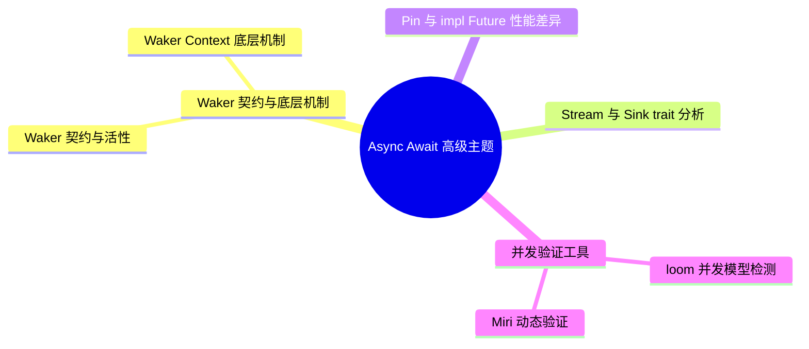

> **内容分级**: [专家级]

# Async/Await 高级主题
>
> **EN**: Async Advanced
> **Summary**: Async Advanced: advanced Rust topics, performance/runtime considerations, and ecosystem patterns.
> **受众**: [专家]
> **权威来源**: 本文件为 `concept/` 权威页。
> **层次定位**: L3 高级概念 / 异步（Async）子域 — 高级主题
> **前置依赖**: [Async/Await 基础](01_async.md)
> **定理链编号**: T-053 Waker 活性 ⟹ T-054 Stream 安全性
>
> **来源**:
> [Async Book](https://rust-lang.github.io/async-book/index.html) ·
> [TRPL — Async/Await](https://doc.rust-lang.org/book/ch17-00-async-await.html) ·
> [std::future::Future](https://doc.rust-lang.org/std/future/trait.Future.html) ·
> [Herlihy & Shavit — The Art of Multiprocessor Programming](https://dl.acm.org/doi/10.5555/2385452) ·
> [Batty et al. — The Semantics of Multicore C](https://doi.org/10.1145/2049706.2049711) ·
> [Brown University — Interactive Rust Book](https://rust-book.cs.brown.edu/) ·
> [Jung et al. — RustBelt: Securing the Foundations of Rust](https://plv.mpi-sws.org/rustbelt/popl18/) ·
> [Itanium C++ ABI](https://itanium-cxx-abi.github.io/cxx-abi/abi.html)
> **前置概念**: N/A
---

> **后置概念**: [Formal Verification](../../04_formal/01_ownership_logic/02_ownership_formal.md)
> **对应 Crate**: [`c06_async`](../../crates/c06_async)
> **对应练习**: [`exercises/src/async_programming/`](../../exercises/src/async_programming)

## 📑 目录

- [Async/Await 高级主题](#asyncawait-高级主题)
  - [📑 目录](#-目录)
    - [8.8 Waker 契约与活性](#88-waker-契约与活性)
    - [8.9 Waker/Context 的底层机制](#89-wakercontext-的底层机制)
    - [8.10 `Stream` / `Sink` trait 完整分析](#810-stream--sink-trait-完整分析)
    - [8.11 `Pin<Box<dyn Future>>` vs `impl Future` 的性能差异](#811-pinboxdyn-future-vs-impl-future-的性能差异)
    - [8.12 `loom` 并发模型检测工具](#812-loom-并发模型检测工具)
    - [8.13 Miri 动态验证：async 状态机的内存安全检测](#813-miri-动态验证async-状态机的内存安全检测)
  - [九、知识来源关系（Provenance）](#九知识来源关系provenance)
  - [十、边界测试：高级异步模式的编译错误](#十边界测试高级异步模式的编译错误)
    - [10.1 边界测试：`select!` 宏中分支完成后的变量使用（编译错误）](#101-边界测试select-宏中分支完成后的变量使用编译错误)
    - [10.2 边界测试：`Stream::next()` 与所有权冲突（编译错误）](#102-边界测试streamnext-与所有权冲突编译错误)
    - [10.5 边界测试：`Pin` 与 `Unpin` 的自动实现冲突（编译错误）](#105-边界测试pin-与-unpin-的自动实现冲突编译错误)
    - [10.3 边界测试：类型不匹配的基础错误](#103-边界测试类型不匹配的基础错误)
  - [逆向推理链（Backward Reasoning）](#逆向推理链backward-reasoning)
  - [📋 关键属性](#-关键属性)
  - [🔗 概念关系](#-概念关系)
  - [参考来源](#参考来源)
  - [认知路径](#认知路径)
    - [核心推理链](#核心推理链)
  - [实践](#实践)
    - [对应代码示例](#对应代码示例)
    - [建议练习](#建议练习)
  - [导航：下一步去哪？](#导航下一步去哪)
  - [嵌入式测验](#嵌入式测验)
    - [测验 1：async fn in trait（记忆层）](#测验-1async-fn-in-trait记忆层)
    - [测验 2：Stream trait（理解层）](#测验-2stream-trait理解层)
    - [测验 3：spawn\_blocking 的使用场景（应用层）](#测验-3spawn_blocking-的使用场景应用层)
    - [测验 4：async 递归（分析层）](#测验-4async-递归分析层)
  - [补充视角：异步性能优化实践](#补充视角异步性能优化实践)
    - [优化维度速查](#优化维度速查)
    - [关键指标](#关键指标)
    - [测量工具](#测量工具)
  - [相关概念](#相关概念)
  - [🧭 思维导图（Mindmap）](#-思维导图mindmap)

### 8.8 Waker 契约与活性

> **权威来源**：本节完整论述（Waker 契约形式化、活性反例三连、活性调试决策树）统一维护于
> [01_async.md §8.8](01_async.md#88-waker-契约与活性)。本页保留高级摘要。
> 取消安全（Cancellation Safety）的完整论述集中于 [05_async_cancellation_safety.md](05_async_cancellation_safety.md)（权威来源）。

**要点摘要**：

- **Waker 契约**：`poll` 返回 `Poll::Pending` ⟹ Waker 已注册到 Reactor；资源就绪时 Reactor 必须调用 `wake()`。
- **活性（Liveness）三反例**：遗忘 wake → 永久 Pending（活锁）；虚假 wake → 无害空转；Waker 过早释放 → 永久 Pending。
- **活性调试路径**：Future 陷入永久 Pending 时，按「Waker 注册 → Reactor 唤醒 → poll 返回值合法性」三层决策树定位根因（完整 Mermaid 决策树见权威节）。
- Waker 与具体执行器解耦：任何实现 `Wake` trait 的类型均可作为 Waker，同一 Future 可跨运行时（Runtime）复用。

> **实现纵深**: RawWakerVTable 手工实现的正确模式全集与契约违反反例集（丢失 wake 死锁 / 记账错误 double-free）见 [Waker 契约深度解析](12_waker_contract_deep_dive.md)。

### 8.9 Waker/Context 的底层机制

> **权威来源**：本节完整论述（VTable 实现代码、Context 关系、自定义 Waker 与 OS 异步 I/O 唤醒路径）统一维护于
> [01_async.md §8.9](01_async.md#89-wakercontext-的底层机制)。本页保留高级摘要。

**要点摘要**：

- `Waker` 是不透明句柄，由执行器经 `RawWaker` + `RawWakerVTable` 类型擦除实现；VTable 含 `clone` / `wake` / `wake_by_ref` / `drop` 四个函数指针。
- `wake` 获取所有权（减少 Arc 引用（Reference）计数），`wake_by_ref` 借用（Borrowing）；性能敏感场景优选 `wake_by_ref`。
- `std::task::Wake` trait 提供比手写 `RawWakerVTable` 更安全的自定义路径：`Waker::from(Arc<T>)`。
- Waker 的最终消费者是 OS 异步 I/O 机制（epoll / kqueue / IOCP），Reactor 将 I/O 就绪事件映射为 `wake()` 调用。

### 8.10 `Stream` / `Sink` trait 完整分析

> **权威来源**：本节完整论述（`Stream` 状态机推导、`Sink` 四阶段生命周期（Lifetimes）、futures vs tokio-stream 对比）统一维护于
> [01_async.md §8.10](01_async.md#810-stream--sink-trait-完整分析)。本页保留高级摘要。

**要点摘要**：

- `Stream` 是异步版 `Iterator`：核心方法 `poll_next(self: Pin<&mut Self>, cx) -> Poll<Option<Self::Item>>`，与 Future 的惰性语义一致。
- `Sink` 表示可异步发送值的消费者（TCP 连接、消息通道），生命周期四阶段：`poll_ready` → `start_send` → `poll_flush` → `poll_close`。
- `futures::Stream` 面向通用异步管道与跨运行时兼容；`tokio_stream` 面向 Tokio 生态（axum、tonic 流处理）。

### 8.11 `Pin<Box<dyn Future>>` vs `impl Future` 的性能差异

> **权威来源**：本节完整论述（静态/动态分发的汇编级对比、装箱开销测量）统一维护于
> [01_async.md §8.11](01_async.md#811-pinboxdyn-future-vs-impl-future-的性能差异)。本页保留高级摘要。

**要点摘要**：

- `impl Future`：零成本静态分发、具体类型暴露、编译期内联优化最大化——库内部实现与热路径首选。
- `Pin<Box<dyn Future>>`：运行时类型擦除 + 一次堆分配与间接调用——用于 trait 对象、递归 async fn、运行时类型选择。
- 执行器统一存储不同任务的 Future 时需 `Pin<Box<dyn Future + Send>>`；其余场景避免无谓装箱。

> **交叉链接（向下引用 L2）**：单态化（Monomorphization）机制见 [L2 泛型（Generics）](../../02_intermediate/01_generics/01_generics.md)（单态化与代码膨胀）；
> trait 对象的内存布局（vtable）见 [L2 Trait](../../02_intermediate/00_traits/01_traits.md)。

### 8.12 `loom` 并发模型检测工具

> **权威来源**：本节完整论述（loom 排列测试原理、与 async 结合的完整示例）统一维护于
> [01_async.md §8.12](01_async.md#812-loom-并发模型检测工具)。本页保留高级摘要。

**要点摘要**：

- `loom` 通过穷举所有合法的线程交错（model checking）验证并发代码在 C11 内存模型下的正确性。
- **注意**：`loom::future` 主要用于测试同步原语在异步上下文中的使用（如 `Mutex`、`Atomic` 在 async 块中的交互），而非测试 async/await 本身的调度语义。

### 8.13 Miri 动态验证：async 状态机的内存安全检测

> **权威来源**：本节完整论述（场景 1–3：悬垂指针 / 非法 bool 构造 / 未初始化内存，及 Miri 与 async 状态机的特殊关联）统一维护于
> [01_async.md §8.13](01_async.md#813-miri-动态验证async-状态机的内存安全检测)。本页保留高级摘要。

**要点摘要**：

- Miri 是 Rust MIR 解释器，可动态检测 UB：use-after-free、无效值、未初始化内存读取等。
- **关键洞察**：Miri 不仅报告 UB，还精确追踪分配点与释放点；对 Pin 后的 async 自引用状态机尤为重要——状态机若被 unsafe 代码移动将产生悬垂指针。
- 三个标准场景（悬垂 Box、非法 bool 构造、未初始化内存）的完整可运行示例见权威节。

## 九、知识来源关系（Provenance）

> **权威来源**：完整论断-来源-可信度对照表统一维护于 [01_async.md §九](01_async.md#九知识来源关系provenance)。
> 本页各节的来源标注随各摘要保留；高级主题特有条目（如 Tokio 生产级运行时定位，来源 [tokio.rs](https://tokio.rs/) · 社区共识 ✅）在此登记。

---

## 十、边界测试：高级异步模式的编译错误

本节的边界用例覆盖高级异步模式的四类编译错误：

- **`select!` 分支完成后的变量使用**：分支 Future 完成后其局部状态不可再用——`select!` 每轮重新求值分支表达式，跨轮状态必须提升到循环外（`pin!` 或普通变量）；
- **`Stream::next()` 与所有权冲突**：`stream.next().await` 需要 `&mut stream`——与同时持有的借用冲突（E0502），`while let Some(x) = stream.next().await` 是正确模式（借用在每轮结束）；
- **`Pin`/`Unpin` 自动实现冲突**：含 `PhantomPinned` 或自引用的类型 `!Unpin`——`Box::pin` 前试图 move 触发 E0277；
- **类型不匹配的基础错误**：`async` 块捕获与 `Send` 要求的组合——`spawn` 边界处的完整约束检查链。

每组用例给出「错误信息 → 根因 → 修复」三段式，异步编译错误的关键技能是读懂「future is not Send」的推导链。

### 10.1 边界测试：`select!` 宏中分支完成后的变量使用（编译错误）

```rust,compile_fail
use tokio::sync::mpsc;

async fn bad_select() {
    let (tx, mut rx) = mpsc::channel::<i32>(10);
    let (tx2, mut rx2) = mpsc::channel::<i32>(10);

    tokio::select! {
        Some(val) = rx.recv() => {
            println!("rx: {}", val);
        }
        Some(val2) = rx2.recv() => {
            println!("rx2: {}", val2);
        }
    }
    // ❌ 编译错误: `val` 可能未绑定
    // select! 只有一个分支完成，其他分支的变量不可用
    // println!("{}", val); // 若 rx2 完成，val 未定义
}

// 正确: 在 select! 内部完成所有操作
async fn fixed_select() {
    let (mut rx, mut rx2) = (tokio::sync::mpsc::channel::<i32>(10).1, tokio::sync::mpsc::channel::<i32>(10).1);
    tokio::select! {
        Some(val) = rx.recv() => {
            println!("rx: {}", val); // ✅ 在分支内使用
        }
        Some(val2) = rx2.recv() => {
            println!("rx2: {}", val2); // ✅ 在分支内使用
        }
    }
}
```

> **修正**: `tokio::select!`（以及 `futures::select!`）在编译时生成状态机，但只有**一个**分支完成执行。其他分支的绑定变量在 `select!` 之后不可用。试图在 `select!` 块外使用分支变量是编译错误（或未定义行为，取决于宏（Macro）实现）。这类似于 `match` 的变量绑定只在对应臂中有效。[来源: [Tokio Documentation](https://docs.rs/tokio/)]

### 10.2 边界测试：`Stream::next()` 与所有权冲突（编译错误）

```rust,compile_fail
use futures::stream::{self, StreamExt};

async fn bad_stream() {
    let mut s = stream::iter(vec![1, 2, 3]);
    while let Some(item) = s.next().await {
        // ❌ 编译错误: cannot borrow `s` as mutable more than once at a time
        // 若尝试在循环内重新 poll stream
        s.next().await; // s 已被 while let 的可变借用占用
        println!("{}", item);
    }
}

// 正确: 顺序消费 stream
async fn fixed_stream() {
    let mut s = stream::iter(vec![1, 2, 3]);
    while let Some(item) = s.next().await {
        println!("{}", item); // ✅ 每次迭代只 poll 一次
    }
}
```

> **修正**: `Stream::next()` 获取 `&mut self`，返回的 `Item` 可能与 Stream 的内部状态关联。在 `while let Some(item) = s.next().await` 中，`s` 被可变借用（Mutable Borrow）直到 `item` 释放。不能在循环体内再次调用 `s.next()`。这与迭代器（Iterator）的借用规则一致——`Iterator::next(&mut self)` 要求独占可变访问。[来源: [futures-rs Documentation](https://docs.rs/futures/)]

### 10.5 边界测试：`Pin` 与 `Unpin` 的自动实现冲突（编译错误）

```rust,ignore
use std::pin::Pin;

struct SelfRef {
    data: String,
    ptr: *const String,
}

impl SelfRef {
    fn new() -> Self {
        let mut s = SelfRef {
            data: String::from("hello"),
            ptr: std::ptr::null(),
        };
        s.ptr = &s.data;
        s
    }
}

fn main() {
    let s = SelfRef::new();
    // ❌ 编译错误: SelfRef 自动实现 Unpin（无 PhantomPinned），
    // 因此 Pin<&mut SelfRef> 不阻止移动
    // let mut pinned = Box::pin(s);
    // std::mem::swap(&mut pinned, &mut Box::pin(SelfRef::new())); // 可能移动!
}
```

> **修正**:
> `Pin<P<T>>` 只在 `T: !Unpin` 时保证 `T` 不被移动。
> `SelfRef` 未包含 `std::marker::PhantomPinned`，因此自动实现 `Unpin`——`Pin<&mut SelfRef>` 允许 `get_mut()` 获取 `&mut SelfRef`，进而允许移动。
> 正确做法：
> `struct SelfRef { data: String, ptr: *const String, _pin: std::marker::PhantomPinned }`，
> 显式标记 `!Unpin`。这与 C++ 的 `std::pin`（C++20，类似概念）或 Swift 的 `inout`（无 Pin 概念）不同——Rust 的 `Unpin` 是自动 trait，`PhantomPinned` 是显式禁用自动实现的方法。
> [来源: [The Rust Programming Language](https://doc.rust-lang.org/book/ch17-02-concurrency-with-async.html)] ·
> [来源: [The Rustonomicon](https://doc.rust-lang.org/std/pin/index.html)]

### 10.3 边界测试：类型不匹配的基础错误

```rust,compile_fail
fn main() {
    // ❌ 编译错误: 类型不匹配
    let x: i32 = "hello";
}
```

> **修正**:
> **类型不匹配**是 Rust 最常见的编译错误：
>
> 1) `let x: i32 = "hello"` — `&str` 不能隐式转为 `i32`；
> 2) Rust 无隐式类型转换（C/Java 的自动转换）；
> 3) 需显式转换：`"42".parse::<i32>().unwrap()` 或 `42i32.to_string()`。

## 逆向推理链（Backward Reasoning）

> **从编译错误反推**：
>
> ```text
> 高级异步安全 ⟸ Pin + Send 边界
> ```
>

## 📋 关键属性

| 属性 | 取值 / 判定 | 依据 |
|---|---|---|
| Waker 契约 | `wake` 必须保证任务被再次 poll；丢失 wake 即死锁 | 本文 §8.8–8.9 |
| Stream/Sink | 拉取式异步序列与推送式接收端的对偶抽象 | 本文 §8.10 |
| 装箱选型 | `Pin<Box<dyn Future>>`（动态）vs `impl Future`（静态）的取舍 | 本文 §8.11 |
| 验证工具 | loom 做并发交错模型检测，Miri 做解释器级 UB 检测 | 本文 §8.12–8.13 |
| 取消边界 | `select!` 分支完成后变量使用受所有权限制 | 本文 §10.1 |

## 🔗 概念关系

- **上位（is-a）**：[Async 基础](01_async.md) 的高级专题集（机制层 + 验证层）。
- **下位（实例）**：Waker/Context 机制、Stream/Sink、装箱选型、loom/Miri 验证。
- **组合**：与 [Pin/Unpin](08_pin_unpin.md)、[Waker 契约深度解析](12_waker_contract_deep_dive.md)、[异步模式](03_async_patterns.md) 组合。
- **依赖**：依赖 [生命周期进阶](../../01_foundation/01_ownership_borrow_lifetime/04_lifetimes_advanced.md) 的 HRTB 知识。

---

## 参考来源

> [来源: [Rust Reference — Async Blocks](https://doc.rust-lang.org/reference/expressions/block-expr.html#async-blocks)]
> [来源: [RFC 2515 — Pinning](https://rust-lang.github.io/rfcs//2515-type_alias_impl_trait.html)]
> [来源: [Pin API Documentation](https://doc.rust-lang.org/std/pin/struct.Pin.html)]
> [来源: [Futures crate](https://docs.rs/futures/)]
> [来源: [Tokio Internals](https://docs.rs/tokio/latest/tokio/)]
> **权威来源**: [Rust Reference](https://doc.rust-lang.org/reference/introduction.html) · [The Rust Programming Language](https://doc.rust-lang.org/book/ch17-00-async-await.html) · [Rust Standard Library](https://doc.rust-lang.org/std/index.html)
> **Rust 版本**: 1.97.0+ (Edition 2024)

## 认知路径

> **认知路径**: 从 L0 基础概念出发，经由本节的 **Async/Await 高级主题** 核心原理，通向 L2 进阶模式与 L3 工程实践。

### 核心推理链

| 定理 | 前提 | 结论 | 置信度 |
|:---|:---|:---|:---|
| Async/Await 高级主题 基础定义 ⟹ 正确用法 | 理解语法与语义 | 能写出符合惯用法的代码 | 高 |
| Async/Await 高级主题 正确用法 ⟹ 常见陷阱 | 忽略边界条件 | 编译错误或运行时 bug | 高 |
| Async/Await 高级主题 常见陷阱 ⟹ 深度掌握 | 系统学习反模式 | 能进行代码审查与优化 | 高 |

> 异步状态机安全 ⟸ Pin 不动性 ⟸ Future::poll
> 取消安全 ⟸ async drop 设计 ⟸ 结构化并发

---

## 实践

> 将本节概念转化为可编译代码。

### 对应代码示例

- **[crates/c06_async](../../../crates/c06_async)** — 与本节概念对应的可编译 crate 示例
- **[exercises/src/async_programming/](../../../exercises/src/async_programming)** — 配套练习题

### 建议练习

1. 阅读 `crates/c06_async/` 中与"高级异步模式"相关的源码和示例
2. 运行 `cargo test -p c06_async` 验证理解
3. 完成 `exercises/src/async_programming/` 中的练习任务

---

## 导航：下一步去哪？

> **自检**：你当前掌握的核心概念是否已能独立应用？

| 选择 | 条件 | 目标 |
|:---|:---|:---|
| 🔙 巩固基础 | 仍有模糊概念 | 回到 [L2 对应主题](../02_intermediate) 或 [MVP 学习路径](../../00_meta/04_navigation/08_learning_mvp_path.md) |
| 🔜 深入 L3 其他主题 | 想扩展高级技能 | [L3 README](../README.md) 选择其他主题 |
| 🎓 进入 L4 形式化 | 想理解"为什么"的数学证明 | [L4 形式化](../../04_formal/README.md) |
| 🏗️ 进入 L6 生态 | 想掌握生产工具链 | [L6 生态](../../06_ecosystem/README.md) |

---

## 嵌入式测验

本节 4 道测验覆盖高级异步的核心判别点：

- 测验 1（记忆层）：async fn in trait（1.75 稳定）的语义——脱糖为返回 `impl Future` 的方法，`dyn` 不兼容的原因；
- 测验 2（理解层）：`Stream` trait 与 `Future` 的关系——「异步迭代器（Iterator）」模型，`poll_next` 的 `Option` 语义（`None` = 流结束）；
- 测验 3（应用层）：`spawn_blocking` 的适用场景——阻塞 IO/CPU 密集工作移出执行器线程，防止饿死其他任务；
- 测验 4（分析层）：async 递归的 `Box::pin` 必要性——递归 async fn 生成无限尺寸的状态机，`Box::pin` 提供间接层切断。

作答建议：测验 4 先尝试直接写递归 async fn 并读编译器建议——错误信息本身就是教材。

### 测验 1：async fn in trait（记忆层）

**题目**: `async fn` 在 trait 中可以直接使用吗？Rust 1.75+ 的解决方案是什么？

- A. 可以，任何版本的 Rust 都支持 `async fn` in trait
- B. 不可以，必须使用返回 `Box<dyn Future>` 的函数
- C. Rust 1.75+ 支持 `async fn` in trait，通过返回位置 impl Trait（RPITIT）实现
- D. 必须使用 `#[async_trait]` 宏（Macro），这是唯一方案

<details>
<summary>✅ 答案与解析</summary>

**正确答案是 C**。

`async fn` in trait 的历史演进：

| 版本 | 方案 | 说明 |
|:---|:---|:---|
| < 1.75 | `#[async_trait]` 宏（Macro） | 将 `async fn` 展开为返回 `Pin<Box<dyn Future>>` 的函数，有堆分配开销 |
| ≥ 1.75 | 原生 `async fn` in trait | 使用 RPITIT（Return Position Impl Trait In Traits），零成本抽象（Zero-Cost Abstraction） |

**Rust 1.75+ 代码**：

```rust,ignore
trait HttpClient {
    async fn fetch(&self, url: &str) -> Result<String, Error>;
}

// 编译器展开后等价于：
// trait HttpClient {
//     fn fetch(&self, url: &str) -> impl Future<Output = Result<String, Error>> + '_;
// }
```

**为什么不再需要 `#[async_trait]`**：

- 原生实现没有 `Box` 堆分配
- 支持 `Send` 边界自动推导
- 编译器可以内联和优化

> `#[async_trait]` 仍然有用：需要动态分发（`dyn HttpClient`）时，因为 `impl Future` 是静态分发。
</details>

---

### 测验 2：Stream trait（理解层）

**题目**: 以下代码试图实现一个产生定时事件的 Stream，但无法编译。问题是什么？

```rust
use std::pin::Pin;
use std::task::{Context, Poll};

struct Interval {
    period: std::time::Duration,
}

impl futures::Stream for Interval {
    type Item = std::time::Instant;

    fn poll_next(self: Pin<&mut Self>, cx: &mut Context<'_>) -> Poll<Option<Self::Item>> {
        // 模拟：检查定时器是否到期
        Poll::Ready(Some(std::time::Instant::now()))
    }
}
```

- A. `Stream` trait 需要 `#[pin_project]` 或手动 `Pin` 处理
- B. `self` 参数应为 `&mut self` 而非 `Pin<&mut Self>`
- C. Stream 已经稳定于标准库，应使用 `std::stream::Stream`
- D. 代码正确，可以编译

<details>
<summary>✅ 答案与解析</summary>

**正确答案是 A**。

`Stream::poll_next` 要求 `self: Pin<&mut Self>` 的原因：

Stream 通常是自引用（Reference）的（包含定时器、I/O 句柄等），需要通过 `Pin` 保证内存位置不变。如果 Stream 包含需要 `Pin` 的字段（如 `Sleep` future），必须正确处理 `Pin` 投影。

**修复方案**：

```rust
use std::pin::Pin;
use std::task::{Context, Poll};
use std::time::{Duration, Instant};
use tokio::time::{interval, Interval as TokioInterval};
use tokio_stream::Stream;

// 方案1: 使用 pin_project 宏（推荐）
pin_project_lite::pin_project! {
    struct MyInterval {
        #[pin]
        inner: TokioInterval,
    }
}

impl Stream for MyInterval {
    type Item = Instant;

    fn poll_next(self: Pin<&mut Self>, cx: &mut Context<'_>) -> Poll<Option<Self::Item>> {
        let mut this = self.project();
        this.inner.poll_tick(cx).map(|_| Some(Instant::now()))
    }
}

// 方案2: 使用 tokio_stream::wrappers::IntervalStream（生产环境推荐）
// let stream = tokio_stream::wrappers::IntervalStream::new(interval(Duration::from_secs(1)));
```

> **关键洞察**: `Pin<&mut Self>` 是 async/await 生态的基石。任何包含 `.await` 点的结构体（Struct）都需要 `Pin` 保证，因为编译器生成的状态机可能自引用（Reference）。
</details>

---

### 测验 3：spawn_blocking 的使用场景（应用层）

**题目**: 以下代码在一个 Tokio 异步任务中执行 CPU 密集型计算，有什么问题？如何修复？

```rust
#[tokio::main]
async fn main() {
    let result = compute_hash("large_data").await;
    println!("{}", result);
}

async fn compute_hash(data: &str) -> String {
    // 模拟 CPU 密集型计算
    let mut result = String::new();
    for i in 0..1_000_000 {
        result.push_str(&format!("{}", i));
    }
    result
}
```

- A. 没有问题，Tokio 会自动调度 CPU 密集型任务
- B. `compute_hash` 会阻塞当前线程的 async 任务，应使用 `tokio::spawn_blocking`
- C. 应该将 `for` 循环替换为 `rayon::join`
- D. 代码在编译时会报错，因为 `String` 不能在 async fn 中构建

<details>
<summary>✅ 答案与解析</summary>

**正确答案是 B**。

**问题分析**：

Tokio 使用协作式调度：一个线程驱动多个 `Future`。如果某个 `Future` 长时间占用线程（不做 `.await`），其他 `Future` 无法执行，导致**整个运行时饿死**。

```rust,ignore
// 错误示范：compute_hash 占用线程 100ms，期间其他任务无法运行
async fn bad(data: &str) -> String {
    // 100ms 的纯 CPU 计算，没有 .await 点
    expensive_cpu_work(data)  // 阻塞！
}
```

**修复方案**：

```rust
use tokio::task;

async fn compute_hash(data: &str) -> String {
    let data = data.to_string();
    task::spawn_blocking(move || {
        // 在独立线程池中运行 CPU 密集型计算
        let mut result = String::new();
        for i in 0..1_000_000 {
            result.push_str(&format!("{}", i));
        }
        result
    })
    .await
    .expect("spawn_blocking failed")
}
```

**spawn_blocking 内部机制**：

- Tokio 维护一个独立线程池（默认 512 线程）
- CPU 密集型任务在独立线程运行，不占用 async 执行线程
- 通过 `oneshot::channel` 将结果返回给 async 上下文

> **黄金法则**: 任何可能阻塞超过 10μs 的操作（CPU 计算、同步 I/O、锁等待）都应使用 `spawn_blocking` 或等价机制。
</details>

---

### 测验 4：async 递归（分析层）

**题目**: 以下代码试图实现一个异步递归的目录遍历函数，但无法编译。为什么？如何修复？

```rust,compile_fail
async fn traverse_dir(path: &std::path::Path) -> Vec<String> {
    let mut files = vec![];
    let mut entries = tokio::fs::read_dir(path).await.unwrap();

    while let Some(entry) = entries.next_entry().await.unwrap() {
        if entry.file_type().await.unwrap().is_dir() {
            files.extend(traverse_dir(&entry.path()).await);  // 递归调用！
        } else {
            files.push(entry.path().to_string_lossy().into_owned());
        }
    }

    files
}
```

- A. 递归 async fn 需要 `Box::pin`，因为编译器无法确定返回类型大小
- B. `tokio::fs::read_dir` 不支持嵌套调用
- C. 应使用 `loop` 替代递归，避免栈溢出
- D. 代码正确，编译失败是 Tokio 版本问题

<details>
<summary>✅ 答案与解析</summary>

**正确答案是 A**。

**编译错误根源**：

`async fn` 编译后返回 `impl Future<Output = Vec<String>>`。递归调用时，返回类型包含自身，形成**无限大小的类型**——编译器无法计算其大小。

```rust
// 编译器视角：
// traverse_dir 返回一个状态机，状态机的一个变体包含 "正在等待子 traverse_dir"
// 这个子 traverse_dir 也是一个状态机，可能还包含孙子 traverse_dir...
// 类型大小 = 无限！
```

**修复方案 — 使用 `Box::pin`**：

```rust
use std::future::Future;
use std::pin::Pin;
use std::path::Path;

// 将返回类型显式 Box 化，使大小固定
fn traverse_dir(path: &Path) -> Pin<Box<dyn Future<Output = Vec<String>> + Send + '_>> {
    Box::pin(async move {
        let mut files = vec![];
        let mut entries = tokio::fs::read_dir(path).await.unwrap();

        while let Some(entry) = entries.next_entry().await.unwrap() {
            if entry.file_type().await.unwrap().is_dir() {
                files.extend(traverse_dir(&entry.path()).await);  // 递归调用
            } else {
                files.push(entry.path().to_string_lossy().into_owned());
            }
        }

        files
    })
}
```

**或者使用 `async_recursion` 宏（Macro）**（简化版）：

```rust,ignore
use async_recursion::async_recursion;

#[async_recursion]
async fn traverse_dir(path: &Path) -> Vec<String> {
    // 宏自动展开为 Box::pin 版本
    // ...
}
```

> **核心洞察**: `async fn` 的递归 = 返回类型的递归 = 需要 `Box` 消除无限大小。这是 Rust 类型系统（Type System）的根本限制，不是 Tokio 的问题。
</details>

---

> **测验设计来源**: [Bloom Taxonomy 2001] · [TRPL Ch17](https://doc.rust-lang.org/book/ch17-00-async-await.html) · [Async Book](https://rust-lang.github.io/async-book/index.html) · [Brown University Interactive TRPL](https://rust-book.cs.brown.edu/ch17-00-async-await.html)

---

## 补充视角：异步性能优化实践

> 本节选编自 `crates/c06_async/docs/tier_02_guides/04_async_performance_optimization_guide.md`，
> 作为 canonical 异步高级主题概念页的工程实践补充。

### 优化维度速查

| 维度 | 技术 | 效果 | 注意点 |
| :--- | :--- | :--- | :--- |
| 并发 | `join!` 替代顺序 `.await` | 降低总延迟 | 确保任务间无依赖 |
| 并发 | 合理使用 `spawn` | 利用多核 | `spawn` 有 `Send + 'static` 约束 |
| 内存 | 避免不必要的 `Box::pin` | 减少分配 | 优先栈上 Future |
| 内存 | 使用 `bytes::Bytes` | 减少拷贝 | 适合网络 I/O |
| 内存 | 对象池 | 降低分配频率 | 注意生命周期（Lifetimes）管理 |
| CPU | `spawn_blocking` | 避免阻塞运行时 | 仅用于真正的 CPU/阻塞操作 |
| I/O | 调整缓冲区大小 | 平衡延迟与吞吐 | 通常 4KB-64KB |
| I/O | 批量操作 | 减少系统调用 | 注意超时与尾延迟 |

### 关键指标

- **吞吐量 (Throughput)**：每秒处理请求数，优先通过并发与批量提升。
- **P99 延迟**：关注长尾，通常由锁竞争、同步阻塞或过大缓冲区导致。
- **内存占用**：异步任务句柄与通道缓冲是主要来源。

### 测量工具

- `tokio-console`：实时任务、资源与运行时诊断。
- `criterion` + `tokio::test`：异步基准测试。
- 火焰图：`perf` 或 `cargo-flamegraph` 定位热点。

## 相关概念

- [Stream 代数与背压](09_stream_algebra_and_backpressure.md) — 承接 §8.10 Stream/Sink 的代数纵深
- [Executor 公平性与调度](10_executor_fairness_and_scheduling.md) — Waker 契约之上的调度公平性
- [Waker 契约深度解析](12_waker_contract_deep_dive.md) — Waker 契约两节的实现层纵深（RawWakerVTable 模式全集 + 违反反例集）
- [Async Trait 对象安全](13_async_trait_object_safety.md) — dyn 兼容 async trait 的方案谱系与选型矩阵

## 🧭 思维导图（Mindmap）


