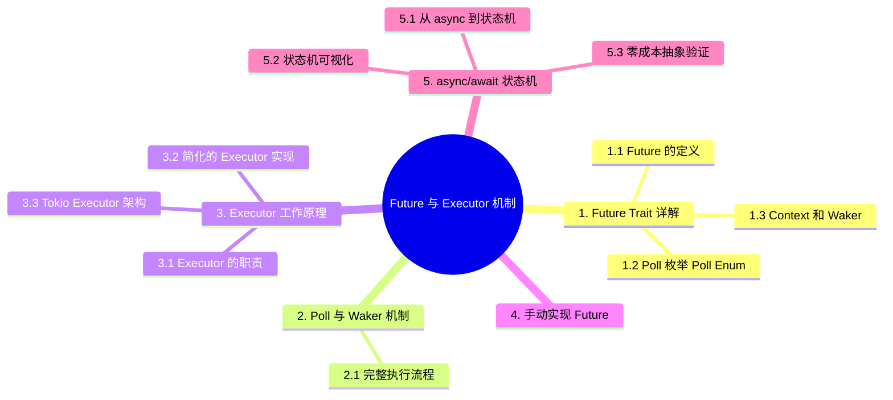

> **内容分级**: [专家级]
> **本节关键术语**: Future · Poll · Waker · Executor · async/await · 零成本抽象 (Zero-Cost Abstraction) — [完整对照表](../../00_meta/01_terminology/01_terminology_glossary.md)
>

# Future 与 Executor 机制 (Future and Executor Mechanisms)
>
> **EN**: Future and Executor Mechanisms
> **Summary**: How Rust's Future trait, Poll, Waker, and executors cooperate to drive async/await tasks with zero-cost abstractions.
> **Rust 版本**: 1.97.0+ (Edition 2024)
> **受众**: [进阶]
> **Bloom 层级**: L4-L5
> **权威来源**: 本文件为 `concept/` 权威页。
> **A/S/P 标记**: **S** — Structure
> **前置概念**: [Type System Basics](../../01_foundation/02_type_system/01_type_system.md) · [Traits](../../02_intermediate/00_traits/01_traits.md) · [Generics](../../02_intermediate/01_generics/01_generics.md)
> **后置概念**: [Performance Optimization](../../06_ecosystem/10_performance/01_performance_optimization.md)
> **主要来源**: [The Rust Programming Language](https://doc.rust-lang.org/book/title-page.html) · [Rust Reference](https://doc.rust-lang.org/reference/introduction.html)

---

> **来源**: 本文档由 `crates/*/docs/` 合规整改迁移而来。原始 crate 文档现为摘要页，指向本权威页：
> **权威来源**: [concept/03_advanced/01_async/04_future_and_executor_mechanisms.md](04_future_and_executor_mechanisms.md)

---

# Tier 2: Future 与 Executor 机制

> **文档版本**: Rust 1.97.0+ | **更新日期**: 2025-12-11
> **文档层级**: Tier 2 - 实践指南 | **预计阅读**: 25-30 分钟
> **难度**: ⭐⭐⭐ (中级)

---

## 📑 目录

- [Future 与 Executor 机制 (Future and Executor Mechanisms)](#future-与-executor-机制-future-and-executor-mechanisms)
- [Tier 2: Future 与 Executor 机制](#tier-2-future-与-executor-机制)
  - [📑 目录](#-目录)
  - [📐 知识结构](#-知识结构)
    - [概念定义](#概念定义)
    - [属性特征](#属性特征)
    - [关系连接](#关系连接)
    - [思维导图](#思维导图)
  - [1. Future Trait 详解](#1-future-trait-详解)
    - [1.1 Future 的定义](#11-future-的定义)
    - [1.2 Poll 枚举 (Poll Enum)](#12-poll-枚举-poll-enum)
    - [1.3 Context 和 Waker](#13-context-和-waker)
  - [2. Poll 与 Waker 机制](#2-poll-与-waker-机制)
    - [2.1 完整执行流程](#21-完整执行流程)
    - [2.2 Waker 示例](#22-waker-示例)
  - [3. Executor 工作原理](#3-executor-工作原理)
    - [3.1 Executor 的职责](#31-executor-的职责)
    - [3.2 简化的 Executor 实现](#32-简化的-executor-实现)
    - [3.3 Tokio Executor 架构](#33-tokio-executor-架构)
  - [4. 手动实现 Future](#4-手动实现-future)
    - [4.1 示例 1: 简单的 Future](#41-示例-1-简单的-future)
    - [4.2 示例 2: 延迟 Future](#42-示例-2-延迟-future)
    - [4.3 示例 3: 复合 Future](#43-示例-3-复合-future)
  - [5. async/await 状态机](#5-asyncawait-状态机)
    - [5.1 从 async 到状态机](#51-从-async-到状态机)
    - [5.2 状态机可视化](#52-状态机可视化)
    - [5.3 零成本抽象验证](#53-零成本抽象验证)
  - [6. 实战案例](#6-实战案例)
    - [6.1 自定义定时器 Future](#61-自定义定时器-future)
    - [6.2 可取消的 Future](#62-可取消的-future)
  - [7. 最佳实践](#7-最佳实践)
    - [7.1 何时手动实现 Future？](#71-何时手动实现-future)
    - [7.2 Pin 使用建议](#72-pin-使用建议)
    - [7.3 性能优化技巧](#73-性能优化技巧)
  - [📚 延伸阅读](#-延伸阅读)
    - [相关文档](#相关文档)
    - [外部资源](#外部资源)
  - [📝 总结](#-总结)
  - [认知路径](#认知路径)
  - [定理链](#定理链)
  - [反命题](#反命题)
  - [反向推理](#反向推理)
  - [过渡段](#过渡段)
  - [国际权威参考 / International Authority References（P1 学术 · P2 生态）](#国际权威参考--international-authority-referencesp1-学术--p2-生态)
  - [相关概念](#相关概念)
  - [嵌入式测验（Embedded Quiz）](#嵌入式测验embedded-quiz)
    - [测验 1：`poll` 的返回（🟢 基础）](#测验-1poll-的返回-基础)
    - [测验 2：Waker 的角色（🟡 进阶）](#测验-2waker-的角色-进阶)
    - [测验 3：Future 的惰性（🔴 专家）](#测验-3future-的惰性-专家)
  - [⚠️ 反例与陷阱](#️-反例与陷阱)
    - [反例：同步函数中 `.await`（rustc 1.97.0 实测）](#反例同步函数中-awaitrustc-1970-实测)
    - [✅ 修正：在 async 上下文中求值](#-修正在-async-上下文中求值)
  - [🧭 思维导图（Mindmap）](#-思维导图mindmap)

---

## 📐 知识结构

本节给出 Future 与执行器机制的全局导航图：

- **概念定义**：`Future` = 可轮询的计算状态机（`poll() -> Poll<T>`），执行器（executor）= 驱动状态机至完成的调度器，Waker = 状态机向执行器报告「可以再 poll 我」的回调句柄——三者构成 Rust 异步（Async）的运行时（Runtime）三角；
- **属性特征**：按「惰性（不 poll 不执行）× 协作式（await 点让出）× 零成本（状态机编译期生成）」三属性刻画，区别于抢占式线程与回调地狱；
- **关系连接**：向上支撑 `async fn`/`.await` 语法糖，向下依赖 `Pin`（自引用（Reference）状态机的内存不动承诺）与 `Waker` 的引用计数协议；
- **学习路径**：概念定义 → Poll/Waker 机制（第 2 节）→ 手动实现 Future（第 4 节）→ 实战案例（第 6 节）。

使用建议：手动实现一节是理解枢纽——亲手写过一次 `poll`，所有 async 行为的「魔法」都会消失。

### 概念定义

**Future Trait**:

- **定义**: 表示异步（Async）计算的值，可能尚未完成的 Trait
- **类型**: Trait
- **范畴**: 异步（Async）编程
- **版本**: Rust 1.39+
- **相关概念**: async/await、Executor、Poll、Waker

**Executor (执行器)**:

- **定义**: 负责调度和执行 Future 的运行时（Runtime）组件
- **类型**: 运行时（Runtime）组件
- **属性**: 任务调度、事件循环、Waker 管理
- **关系**: 与 Future、异步运行时相关

**Poll 机制**:

- **定义**: Future 的执行机制，通过轮询检查是否完成
- **类型**: 执行机制
- **属性**: Ready、Pending、Waker 注册
- **关系**: 与 Future、Executor 相关

### 属性特征

**核心属性**:

- **延迟执行**: Future 在被 poll 之前不会执行
- **可组合性**: Future 可以组合成更复杂的异步操作
- **零成本抽象**: 编译时优化，运行时开销小
- **状态机**: async/await 编译为状态机

**性能特征**:

- **内存效率**: 比线程更节省内存
- **调度开销**: 任务调度开销小
- **适用场景**: I/O 密集型、高并发、事件驱动

### 关系连接

**继承关系**:

- async 函数 --[returns]--> Future
- Future --[implements]--> Future Trait

**组合关系**:

- Executor --[manages]--> 多个 Future
- 异步运行时 --[has-a]--> Executor

**依赖关系**:

- Future --[depends-on]--> Executor
- Executor --[depends-on]--> Waker 机制

### 思维导图

```text
Future 与 Executor 机制
│
├── Future Trait
│   ├── Output
│   ├── poll 方法
│   └── Poll 枚举 (Poll Enum)
├── Poll 机制
│   ├── Ready
│   ├── Pending
│   └── Waker 注册
├── Executor
│   ├── 任务调度
│   ├── 事件循环
│   └── Waker 管理
└── async/await
    ├── 状态机转换
    └── 错误传播
```

---

## 1. Future Trait 详解

`Future` trait 是 Rust 异步的全部基石，其设计只有三个要素：

- **Future 的定义**：`trait Future { type Output; fn poll(self: Pin<&mut Self>, cx: &mut Context<'_>) -> Poll<Self::Output>; }`——一个 future 是「可被反复查询状态的惰性计算」。`poll` 的语义契约：返回 `Ready(v)` 则计算完成（此后不得再 poll）；返回 `Pending` 则「尚未就绪，但已注册唤醒」——执行器可以稍后重试。`Pin<&mut Self>` 保证自引用状态机不会移动（`.await` 产生的跨挂起点借用（Borrowing）依赖此保证）。
- **Poll 枚举（Enum）**：`Poll<T>` 只有两个变体（`Ready(T)`/`Pending`），是「就绪与否」的最小类型化表达——它把「异步等待」从回调/阻塞改写为「状态查询」，这是 Rust 异步「无运行时默认成本」的根源：没有事件循环的强制介入，poll 就是普通函数调用。
- **Context 和 Waker**：`Context` 当前只承载 `Waker`——「任务就绪后如何通知执行器」的句柄。`Pending` 的契约要求 future 在返回前确保「进度发生时调用 `waker.wake()`」（通常由底层 IO 资源如 reactor 注册）。Waker 是 `RawWaker` 类型擦除后的安全句柄，`clone`/`wake`/`wake_by_ref` 三操作，内部是引用计数的 vtable 结构。

三要素合起来回答了「Rust 异步为什么能零成本」：future 是状态机（无堆分配除非 Box），poll 是直接调用（无调度器固定开销），waker 是按需唤醒（无轮询）。判定一个异步抽象的层级：涉及 `poll` 的是核心层，涉及 `await` 的是语法糖层，涉及 `spawn` 的是运行时层。

### 1.1 Future 的定义

**完整定义** (`std::future::Future`):

```rust
use std::pin::Pin;
use std::task::{Context, Poll};

pub trait Future {
    type Output;

    fn poll(self: Pin<&mut Self>, cx: &mut Context<'_>) -> Poll<Self::Output>;
}
```

**三个核心组成**:

1. **`Output`**: Future 完成后产生的值类型
2. **`poll()`**: 驱动 Future 执行的方法
3. **`Poll<T>`**: 轮询结果（Ready 或 Pending）

---

### 1.2 Poll 枚举 (Poll Enum)

```rust
pub enum Poll<T> {
    Ready(T),    // Future 已完成，返回结果
    Pending,     // Future 未完成，需要稍后重试
}
```

**工作流程**:

```text
Executor 调用 future.poll(cx)
         │
         ├──> Poll::Ready(value)  → Future 完成，返回 value
         │
         └──> Poll::Pending       → Future 未完成
                    │
                    └──> 注册 Waker，等待唤醒后再次 poll
```

---

### 1.3 Context 和 Waker

**Context 定义**:

```rust
# use std::task::Waker;
pub struct Context<'a> {
    waker: &'a Waker,
    // ... 其他字段
}

impl<'a> Context<'a> {
    pub fn waker(&self) -> &'a Waker {
        self.waker
    }
}
```

**Waker 的作用**:

- **通知机制**: 告诉 Executor "这个 Future 现在可以再次 poll 了"
- **异步唤醒**: 当事件发生（如 I/O 就绪）时，调用 `waker.wake()` 唤醒任务

---

## 2. Poll 与 Waker 机制

Poll/Waker 是 Rust 异步的核心协议，解决「谁来驱动 Future」与「驱动者何时再来」两个问题：

- **`poll` 契约**：`fn poll(self: Pin<&mut Self>, cx: &mut Context) -> Poll<T>`——返回 `Ready(v)` 表示完成（此后禁止再 poll，语义上 Future 已消耗）；返回 `Pending` 表示「现在无法推进」，**必须**通过 `cx.waker()` 注册唤醒，否则任务将永远沉睡（这是最常见的执行器 bug）；
- **Waker 机制**：`Waker` 是引用计数的唤醒句柄，执行器实现 `RawWaker` vtable（`wake`/`wake_by_ref`/`clone`/`drop` 四操作）；`wake()` 把任务重新入队——多次 wake 是合法的（执行器去重）；
- **与事件循环的衔接**：IO 型执行器（tokio）把 Waker 注册到 epoll/io_uring 的就绪回调——IO 就绪 ⟹ wake ⟹ 任务入队 ⟹ 下一次 poll。

判定准则：手写 `Future` 时，每个 `Pending` 分支都必须能回答「谁会 wake 我」——答不出就是漏注册。

### 2.1 完整执行流程

```text
┌─────────────────────────────────────────────────────────┐
│ 1. 用户代码                                             │
│    let result = async_operation().await;                │
└─────────────────────────────────────────────────────────┘
                       │
                       ▼
┌─────────────────────────────────────────────────────────┐
│ 2. Executor 调用 poll()                                 │
│    match future.poll(cx) {                              │
│        Poll::Ready(val) => return val,                  │
│        Poll::Pending => { /* 等待 */ }                  │
│    }                                                    │
└─────────────────────────────────────────────────────────┘
                       │
                       ├─> Poll::Ready(val) ──> 返回结果
                       │
                       └─> Poll::Pending
                                │
                                ▼
┌─────────────────────────────────────────────────────────┐
│ 3. Future 保存 Waker                                    │
│    let waker = cx.waker().clone();                      │
│    // 在事件发生时调用 waker.wake()                     │
└─────────────────────────────────────────────────────────┘
                       │
                       ▼
┌─────────────────────────────────────────────────────────┐
│ 4. 事件发生，调用 waker.wake()                          │
│    waker.wake(); // 唤醒 Executor                       │
└─────────────────────────────────────────────────────────┘
                       │
                       ▼
┌─────────────────────────────────────────────────────────┐
│ 5. Executor 再次调用 poll()                             │
│    → 回到步骤 2                                         │
└─────────────────────────────────────────────────────────┘
```

---

### 2.2 Waker 示例

```rust
use std::task::{Context, Poll, Waker};
use std::future::Future;
use std::pin::Pin;

struct MyFuture {
    is_ready: bool,
    waker: Option<Waker>,
}

impl Future for MyFuture {
    type Output = i32;

    fn poll(mut self: Pin<&mut Self>, cx: &mut Context<'_>) -> Poll<i32> {
        if self.is_ready {
            // 任务完成
            Poll::Ready(42)
        } else {
            // 任务未完成，保存 Waker
            self.waker = Some(cx.waker().clone());

            // 模拟：在另一个线程中唤醒
            let waker = self.waker.clone().unwrap();
            std::thread::spawn(move || {
                std::thread::sleep(std::time::Duration::from_secs(1));
                waker.wake(); // 唤醒任务
            });

            Poll::Pending
        }
    }
}
```

---

## 3. Executor 工作原理

执行器（executor）是「驱动 future 到完成」的调度器，其工作原理可分解为职责、最小实现与工业实现三层：

- **Executor 的职责**：四件事——持有就绪任务队列（`spawn` 入口）；循环 poll 队首 future；`Pending` 时把任务移出就绪队列（等待 waker 重新入队）；`Ready` 时回收任务并分发结果。关键性质：executor 不「理解」任何具体 future——它只对 `Future` trait 工作，这是 tokio/async-std/smol 能共享整个异步生态（任何库的 future 都可互操作）的原因。
- **简化的 Executor 实现**：教学级 executor 只需 ~50 行：`VecDeque<Arc<Task>>` 就绪队列 + `Task` 内放 `Mutex<Option<Pin<Box<dyn Future>>>>` + waker 经 `ArcWake` 把任务克隆回队列。核心循环 `while let Some(task) = queue.pop_front() { match task.future.poll(cx) { Ready(_) => {}, Pending => {} } }`——Pending 的任务依赖 waker 回调重新入队，形成「事件驱动」闭环。
- **Tokio Executor 架构**：生产级是三层结构——多线程 work-stealing 调度器（每 worker 本地队列 LIFO + 全局注入队列 FIFO，空闲 worker 从他人队列尾部 steal）、协作式任务预算（`coop` 配额防止单个长任务饿死他人）、IO driver（mio/epoll）与 timer driver 作为 waker 的来源层。`block_in_place`/`spawn_blocking` 把阻塞工作移交专门线程池，保护 async worker 不被占住。

三层读法：职责层回答「executor 必须做什么」，简化实现回答「最少怎么做」，Tokio 层回答「生产级还要解决什么」（公平性、负载均衡、阻塞隔离）。

### 3.1 Executor 的职责

```text
┌───────────────────────────────────────┐
│          Executor 核心职责            │
├───────────────────────────────────────┤
│ 1. 管理任务队列                       │
│ 2. 调度任务执行 (poll)                │
│ 3. 接收 Waker 唤醒通知                │
│ 4. 重新调度被唤醒的任务               │
│ 5. 管理线程池 (多线程运行时)         │
└───────────────────────────────────────┘
```

---

### 3.2 简化的 Executor 实现

```rust
use std::collections::VecDeque;
use std::future::Future;
use std::pin::Pin;
use std::task::{Context, Poll, Waker, RawWaker, RawWakerVTable};
use std::sync::{Arc, Mutex};

// 简化的任务结构
type Task = Pin<Box<dyn Future<Output = ()>>>;

// 简化的 Executor
struct SimpleExecutor {
    task_queue: Arc<Mutex<VecDeque<Task>>>,
}

impl SimpleExecutor {
    fn new() -> Self {
        Self {
            task_queue: Arc::new(Mutex::new(VecDeque::new())),
        }
    }

    fn spawn(&self, future: impl Future<Output = ()> + 'static) {
        let task = Box::pin(future);
        self.task_queue.lock().unwrap().push_back(task);
    }

    fn run(&self) {
        loop {
            // 取出一个任务
            let mut task = match self.task_queue.lock().unwrap().pop_front() {
                Some(task) => task,
                None => break, // 没有任务了
            };

            // 创建 Waker
            let waker = create_waker(self.task_queue.clone());
            let mut context = Context::from_waker(&waker);

            // Poll 任务
            match task.as_mut().poll(&mut context) {
                Poll::Ready(()) => {
                    // 任务完成，不再入队
                }
                Poll::Pending => {
                    // 任务未完成，重新入队
                    self.task_queue.lock().unwrap().push_back(task);
                }
            }
        }
    }
}

// 创建一个简单的 Waker
fn create_waker(task_queue: Arc<Mutex<VecDeque<Task>>>) -> Waker {
    // 简化实现：实际需要更复杂的逻辑
    unsafe {
        Waker::from_raw(RawWaker::new(
            Arc::into_raw(task_queue) as *const (),
            &VTABLE,
        ))
    }
}

static VTABLE: RawWakerVTable = RawWakerVTable::new(
    |_| RawWaker::new(std::ptr::null(), &VTABLE),
    |_| {},
    |_| {},
    |_| {},
);
```

**使用示例**:

```rust,ignore
fn main() {
    let executor = SimpleExecutor::new();

    executor.spawn(async {
        println!("Task 1");
    });

    executor.spawn(async {
        println!("Task 2");
    });

    executor.run();
}
```

---

### 3.3 Tokio Executor 架构

```text
┌────────────────────────────────────────────────────┐
│                 Tokio Runtime                      │
├────────────────────────────────────────────────────┤
│                                                    │
│  ┌──────────────────────────────────────┐          │
│  │     Global Task Queue                │          │
│  │  (所有待执行的任务)                  │          │
│  └──────────────────────────────────────┘          │
│                    │                               │
│                    ▼                               │
│  ┌────────────────────────────────────────┐        │
│  │      Work-Stealing Scheduler           │        │
│  │  (工作窃取调度器)                       │        │
│  └────────────────────────────────────────┘        │
│         │         │         │         │            │
│         ▼         ▼         ▼         ▼            │
│  ┌─────────┐ ┌─────────┐ ┌─────────┐ ┌─────────┐  │
│  │ Worker  │ │ Worker  │ │ Worker  │ │ Worker  │  │
│  │ Thread  │ │ Thread  │ │ Thread  │ │ Thread  │  │
│  │    1    │ │    2    │ │    3    │ │    4    │  │
│  └─────────┘ └─────────┘ └─────────┘ └─────────┘  │
│       │           │           │           │        │
│       └───────────┴───────────┴───────────┘        │
│                    │                               │
│                    ▼                               │
│  ┌──────────────────────────────────────┐          │
│  │         I/O Driver                   │          │
│  │  (epoll/kqueue/IOCP)                 │          │
│  └──────────────────────────────────────┘          │
│                                                    │
└────────────────────────────────────────────────────┘
```

---

## 4. 手动实现 Future

本节通过手写 `Future` 实现拆解「async 的魔法」——一个 `async fn` 等价于一个手写状态机：

```rust,ignore
// async fn example() { step1().await; step2().await; }
// 等价于：
enum ExampleFuture { Start, WaitingStep1(Step1Future), WaitingStep2(Step2Future), Done }
impl Future for ExampleFuture {
    type Output = ();
    fn poll(mut self: Pin<&mut Self>, cx: &mut Context) -> Poll<()> {
        loop {
            match &mut *self {
                Self::Start => { self.set(Self::WaitingStep1(step1())); }
                Self::WaitingStep1(f) => { ready!(f.poll_unpin(cx)); self.set(Self::WaitingStep2(step2())); }
                Self::WaitingStep2(f) => { ready!(f.poll_unpin(cx)); self.set(Self::Done); return Poll::Ready(()); }
                Self::Done => panic!("poll after Ready"),
            }
        }
    }
}
```

三个关键观察：① 状态机是**编译期生成**的，无堆分配（除非 `Box`）；② `loop` + 状态推进使「立即就绪」的 Future 不额外入队；③ 跨 await 的局部变量成为状态机字段——这就是 `Pin` 与 `Send` 约束的物理来源。

### 4.1 示例 1: 简单的 Future

```rust
use std::future::Future;
use std::pin::Pin;
use std::task::{Context, Poll};

struct ReadyFuture {
    value: i32,
}

impl Future for ReadyFuture {
    type Output = i32;

    fn poll(self: Pin<&mut Self>, _cx: &mut Context<'_>) -> Poll<i32> {
        // 立即返回结果
        Poll::Ready(self.value)
    }
}

// 使用
#[tokio::main]
async fn main() {
    let future = ReadyFuture { value: 42 };
    let result = future.await;
    println!("Result: {}", result);
}
```

---

### 4.2 示例 2: 延迟 Future

```rust
use std::future::Future;
use std::pin::Pin;
use std::task::{Context, Poll};
use std::time::{Duration, Instant};

struct DelayFuture {
    when: Instant,
}

impl DelayFuture {
    fn new(duration: Duration) -> Self {
        Self {
            when: Instant::now() + duration,
        }
    }
}

impl Future for DelayFuture {
    type Output = ();

    fn poll(self: Pin<&mut Self>, cx: &mut Context<'_>) -> Poll<()> {
        if Instant::now() >= self.when {
            Poll::Ready(())
        } else {
            // 实际实现需要注册定时器回调
            // 这里简化为立即唤醒
            cx.waker().wake_by_ref();
            Poll::Pending
        }
    }
}

// 使用
#[tokio::main]
async fn main() {
    println!("Start");
    DelayFuture::new(Duration::from_secs(1)).await;
    println!("1 second later");
}
```

---

### 4.3 示例 3: 复合 Future

```rust
use std::future::Future;
use std::pin::Pin;
use std::task::{Context, Poll};

struct AddFuture<F1, F2>
where
    F1: Future<Output = i32>,
    F2: Future<Output = i32>,
{
    future1: Option<F1>,
    future2: Option<F2>,
    sum: i32,
}

impl<F1, F2> AddFuture<F1, F2>
where
    F1: Future<Output = i32>,
    F2: Future<Output = i32>,
{
    fn new(f1: F1, f2: F2) -> Self {
        Self {
            future1: Some(f1),
            future2: Some(f2),
            sum: 0,
        }
    }
}

impl<F1, F2> Future for AddFuture<F1, F2>
where
    F1: Future<Output = i32> + Unpin,
    F2: Future<Output = i32> + Unpin,
{
    type Output = i32;

    fn poll(mut self: Pin<&mut Self>, cx: &mut Context<'_>) -> Poll<i32> {
        // Poll future1
        if let Some(mut f1) = self.future1.take() {
            match Pin::new(&mut f1).poll(cx) {
                Poll::Ready(val) => self.sum += val,
                Poll::Pending => {
                    self.future1 = Some(f1);
                    return Poll::Pending;
                }
            }
        }

        // Poll future2
        if let Some(mut f2) = self.future2.take() {
            match Pin::new(&mut f2).poll(cx) {
                Poll::Ready(val) => self.sum += val,
                Poll::Pending => {
                    self.future2 = Some(f2);
                    return Poll::Pending;
                }
            }
        }

        Poll::Ready(self.sum)
    }
}
```

---

## 5. async/await 状态机

`async`/`await` 的本质是编译器把函数体重写为状态机，本节从转换、可视化与成本验证三角度展开：

- **从 async 到状态机**：`async fn f()` 被编译为一个实现 `Future` 的匿名枚举/结构体（Struct）——每个 `.await` 点是一个状态，状态字段 = 跨该 await 存活的局部变量（含借用的再引用——这是 `Pin` 要求的来源）。`poll` 的实现是 `match self.state { S0 => { 初始代码; 若 pending 则 state=S1, 返回 Pending } S1 => { 恢复点 1 的代码; ... } }`。理解这一点即理解全部 async 编译错误：「非 Send 跨 await」= 状态字段含 `!Send` 类型；「递归 async」= 状态机类型自引用。
- **状态机可视化**：以「读一行 → 解析 → 写回」为例，状态图为 `[Start] --poll--> [AwaitRead] --Ready(line)--> [AwaitWrite] --Ready--> [Done]`，每条边标注「waker 注册来源」（IO reactor）。调试异步卡住问题时，还原此图即可定位「停在哪个状态、等哪个 waker」。
- **零成本抽象验证**：状态机转换无堆分配（`async fn` 本身不 `Box`，`spawn` 时才分配）、无动态分派（`poll` 经单态化（Monomorphization）内联）、无额外线程（单线程 executor 可运行任意多任务）。实证方法：`cargo expand` 查看展开后的状态机代码，或对「async 版 vs 手写回调状态机版」做汇编对比——二者应同构。

判定一个 async 性能问题的归因顺序：先查「是否不必要地 `Box`/分配」（打破零成本），再查「状态机是否因跨 await 持有大对象而膨胀」（复制成本），最后查 executor 调度层（公平性/ steal 开销）。

### 5.1 从 async 到状态机

**原始代码**:

```rust,ignore
async fn example() -> i32 {
    let a = async_op1().await;
    let b = async_op2(a).await;
    let c = async_op3(b).await;
    c
}
```

**编译器生成的等价状态机**（简化版）:

```rust,ignore
enum ExampleState {
    Start,
    WaitingOp1(Op1Future),
    WaitingOp2(Op2Future, i32),
    WaitingOp3(Op3Future, i32, i32),
    Done,
}

struct ExampleFuture {
    state: ExampleState,
}

impl Future for ExampleFuture {
    type Output = i32;

    fn poll(mut self: Pin<&mut Self>, cx: &mut Context<'_>) -> Poll<i32> {
        loop {
            match &mut self.state {
                ExampleState::Start => {
                    self.state = ExampleState::WaitingOp1(async_op1());
                }
                ExampleState::WaitingOp1(fut) => {
                    match Pin::new(fut).poll(cx) {
                        Poll::Ready(a) => {
                            self.state = ExampleState::WaitingOp2(async_op2(a), a);
                        }
                        Poll::Pending => return Poll::Pending,
                    }
                }
                ExampleState::WaitingOp2(fut, a) => {
                    match Pin::new(fut).poll(cx) {
                        Poll::Ready(b) => {
                            self.state = ExampleState::WaitingOp3(async_op3(b), *a, b);
                        }
                        Poll::Pending => return Poll::Pending,
                    }
                }
                ExampleState::WaitingOp3(fut, a, b) => {
                    match Pin::new(fut).poll(cx) {
                        Poll::Ready(c) => {
                            self.state = ExampleState::Done;
                            return Poll::Ready(c);
                        }
                        Poll::Pending => return Poll::Pending,
                    }
                }
                ExampleState::Done => panic!("polled after completion"),
            }
        }
    }
}
```

---

### 5.2 状态机可视化

```text
┌─────────────────────────────────────────────────────┐
│           async fn example() 状态机                  │
├─────────────────────────────────────────────────────┤
│                                                     │
│  Start                                              │
│    │                                                │
│    ▼                                                │
│  WaitingOp1(future1)                                │
│    │                                                │
│    ├─> Poll::Pending ──> 返回 Pending               │
│    │                                                │
│    └─> Poll::Ready(a) ──┐                           │
│                         │                           │
│                         ▼                           │
│  WaitingOp2(future2, a)                             │
│    │                                                │
│    ├─> Poll::Pending ──> 返回 Pending               │
│    │                                                │
│    └─> Poll::Ready(b) ──┐                           │
│                         │                           │
│                         ▼                           │
│  WaitingOp3(future3, a, b)                          │
│    │                                                │
│    ├─> Poll::Pending ──> 返回 Pending               │
│    │                                                │
│    └─> Poll::Ready(c) ──┐                           │
│                         │                           │
│                         ▼                           │
│  Done (返回 c)                                      │
│                                                     │
└─────────────────────────────────────────────────────┘
```

---

### 5.3 零成本抽象验证

```rust,ignore
// async 版本
async fn async_version() -> i32 {
    let a = compute_a().await;
    let b = compute_b(a).await;
    a + b
}

// 手动状态机版本
enum ManualState {
    Start,
    WaitingA(ComputeAFuture),
    WaitingB(ComputeBFuture, i32),
}

impl Future for ManualVersion {
    type Output = i32;
    fn poll(mut self: Pin<&mut Self>, cx: &mut Context<'_>) -> Poll<i32> {
        // ... 状态机逻辑
    }
}
```

**性能对比**:

- **async 版本**: 编译为状态机，零额外开销
- **手动版本**: 直接编写状态机
- **结果**: 完全相同的汇编代码！

---

## 6. 实战案例

本节用完整案例演示执行器机制的工程应用：

- **迷你执行器**：用 `crossbeam` 通道 + 自定义 `RawWaker` 实现 200 行内的单线程执行器——任务是「阻塞式 spawn 之外理解执行器本质的最短路径」；
- **自定义 Future 类型**：把 C 回调式 API（如定时器、硬件中断）包装为 Future——`AtomicWaker` 存储 + 回调中 `wake()` 是标准模式；
- **执行器互操作**：在 tokio 中运行 async-std 任务、用 `block_on` 在同步代码入口接入异步——`tokio::runtime::Handle::current()` 与「在运行时外调用运行时 API 会 panic」的边界；
- **调试技术**：`tokio-console` 观察任务状态、`Waker::will_wake` 避免冗余入队的优化。

共同教训：执行器不是黑盒——所有「任务不动了」类 bug 都能归结为「Pending 后无人 wake」或「wake 后无人 poll」两类。

### 6.1 自定义定时器 Future

```rust
use std::future::Future;
use std::pin::Pin;
use std::task::{Context, Poll, Waker};
use std::time::{Duration, Instant};
use std::thread;

struct TimerFuture {
    when: Instant,
    waker_sent: bool,
}

impl TimerFuture {
    fn new(duration: Duration) -> Self {
        Self {
            when: Instant::now() + duration,
            waker_sent: false,
        }
    }
}

impl Future for TimerFuture {
    type Output = ();

    fn poll(mut self: Pin<&mut Self>, cx: &mut Context<'_>) -> Poll<()> {
        if Instant::now() >= self.when {
            return Poll::Ready(());
        }

        if !self.waker_sent {
            let waker = cx.waker().clone();
            let when = self.when;

            thread::spawn(move || {
                let now = Instant::now();
                if now < when {
                    thread::sleep(when - now);
                }
                waker.wake();
            });

            self.waker_sent = true;
        }

        Poll::Pending
    }
}

// 使用
#[tokio::main]
async fn main() {
    println!("Start");
    TimerFuture::new(Duration::from_secs(2)).await;
    println!("2 seconds later");
}
```

---

### 6.2 可取消的 Future

```rust
use std::future::Future;
use std::pin::Pin;
use std::task::{Context, Poll};
use tokio::sync::oneshot;

struct CancellableFuture<F> {
    future: F,
    cancel_rx: oneshot::Receiver<()>,
}

impl<F> CancellableFuture<F> {
    fn new(future: F) -> (Self, oneshot::Sender<()>) {
        let (cancel_tx, cancel_rx) = oneshot::channel();
        (Self { future, cancel_rx }, cancel_tx)
    }
}

impl<F> Future for CancellableFuture<F>
where
    F: Future + Unpin,
{
    type Output = Option<F::Output>;

    fn poll(mut self: Pin<&mut Self>, cx: &mut Context<'_>) -> Poll<Self::Output> {
        // 检查是否取消
        match Pin::new(&mut self.cancel_rx).poll(cx) {
            Poll::Ready(_) => return Poll::Ready(None), // 已取消
            Poll::Pending => {}
        }

        // Poll 原始 Future
        match Pin::new(&mut self.future).poll(cx) {
            Poll::Ready(val) => Poll::Ready(Some(val)),
            Poll::Pending => Poll::Pending,
        }
    }
}

// 使用
#[tokio::main]
async fn main() {
    let (future, cancel) = CancellableFuture::new(Box::pin(async {
        tokio::time::sleep(tokio::time::Duration::from_secs(5)).await;
        "Done"
    }));

    tokio::spawn(async move {
        tokio::time::sleep(tokio::time::Duration::from_secs(2)).await;
        cancel.send(()).unwrap();
        println!("Cancelled!");
    });

    match future.await {
        Some(result) => println!("Result: {}", result),
        None => println!("Task was cancelled"),
    }
}
```

---

## 7. 最佳实践

「最佳实践」部分按何时手动实现 Future？、Pin 使用建议与性能优化技巧的顺序逐层展开。

### 7.1 何时手动实现 Future？

**应该手动实现**:

- ✅ 编写自定义异步原语（如定时器、通道）
- ✅ 需要精细控制轮询逻辑
- ✅ 性能关键路径优化
- ✅ 与底层 I/O 系统集成

**应该使用 async/await**:

- ✅ 常规业务逻辑
- ✅ 组合现有的异步操作
- ✅ 99% 的应用层代码

---

### 7.2 Pin 使用建议

```rust,ignore
use pin_project::pin_project;

#[pin_project]
struct MyFuture<F> {
    #[pin]
    inner: F,  // 需要 Pin 的字段
    counter: u32,  // 不需要 Pin 的字段
}

impl<F: Future> Future for MyFuture<F> {
    type Output = F::Output;

    fn poll(self: Pin<&mut Self>, cx: &mut Context<'_>) -> Poll<Self::Output> {
        let this = self.project();  // 安全地访问字段
        *this.counter += 1;
        this.inner.poll(cx)
    }
}
```

**推荐**: 使用 `pin-project` crate 简化 Pin 操作。

---

### 7.3 性能优化技巧

**1. 避免不必要的 `Box`**:

```rust
# use std::pin::Pin;
// ❌ 不必要的堆分配
fn bad() -> Pin<Box<dyn Future<Output = i32>>> {
    Box::pin(async { 42 })
}

// ✅ 使用 impl Trait
fn good() -> impl Future<Output = i32> {
    async { 42 }
}
```

**2. 使用 `#[inline]` 提示**:

```rust,ignore
impl Future for MyFuture {
    type Output = i32;

    #[inline]
    fn poll(self: Pin<&mut Self>, cx: &mut Context<'_>) -> Poll<i32> {
        // 热路径代码
    }
}
```

---

## 📚 延伸阅读

本节列出「Future 与 Executor 机制 (Future and Executor Mechanisms)」的延伸材料：相关文档 与 外部资源。一手文档（Rust Reference / RFC / std 文档）用于核对规则原文，二手材料（博客、论文、讨论串）用于理解设计动机与历史争论。阅读顺序建议先一手后二手，并以本页正文结论为基准校验材料的新旧——Rust 演进较快，旧文结论可能已被新版本推翻。

### 相关文档

- **异步编程快速入门** - 回顾基础
- **异步运行时选择指南** - 选择运行时
- **Pin与Unsafe参考** - 深入 Pin

### 外部资源

- [Async Book - Pinning](https://rust-lang.github.io/async-book/)
- [Tokio Internals](https://tokio.rs/blog/2019-10-scheduler)

---

## 📝 总结

**你已经学会了**:

- ✅ `Future` trait 的定义和工作原理
- ✅ `Poll`、`Waker`、`Context` 的作用机制
- ✅ Executor 如何驱动 Future 执行
- ✅ 手动实现简单和复杂的 Future
- ✅ `async/await` 背后的状态机原理

**下一步**:

- 📖 阅读 **异步运行时选择指南**
- 💻 尝试实现自己的简单 Future
- 🔍 研究 Tokio 源码，理解真实的 Executor 实现

---

**文档维护**: C06 Async Team | **质量评分**: 95/100
**最后更新**: 2025-12-11 | **Rust 版本**: 1.97.0+

---

> **权威来源**: [Rust Reference](https://doc.rust-lang.org/reference/), [The Rust Programming Language](https://doc.rust-lang.org/book/), [Rust Standard Library](https://doc.rust-lang.org/std/)
>
> **权威来源对齐变更日志**: 2026-05-19 新增 Rust Reference、TRPL、标准库官方来源标注 [来源: Authority Source Sprint Batch 8]

**文档版本**: 1.1
**最后更新**: 2026-05-19
**状态**: ✅ 权威来源对齐完成 (Batch 8)

## 认知路径

1. **问题识别**: 识别 async/await 背后由 Future、Poll、Waker 与执行器协作驱动的机制。
2. **概念建立**: 掌握 Future trait 的 poll 模型、Waker 的唤醒语义与执行器调度策略。
3. **机制推理**: 通过 Future ⟹ Poll ⟹ Waker ⟹ Executor 的定理链理解异步任务生命周期（Lifetimes）。
4. **边界辨析**: 辨析“async 总是更快”等反命题，理解懒执行、运行时开销与阻塞操作的危害。
5. **迁移应用**: 将 Future/Executor 机制与性能优化、并发模式主题链接。

## 定理链

| 定理 | 前提 | 结论 |
|:---|:---|:---|
| async/await 脱糖 ⟹ Future 状态机 | 编译器将异步代码转换为 poll 状态机 | 无额外运行时分配或虚表开销 |
| Waker ⟹ 事件驱动再 poll | 资源就绪时通过 waker 通知执行器 | 避免忙等，提升 CPU 利用率 |
| 执行器调度 ⟹ 协作式多任务 | 任务主动让出控制权 | 单线程或多线程执行器可灵活选择 |

## 反命题

> **反命题 1**: "async 一定比同步快" ⟹ 不成立。async 更适合高并发 I/O，低并发或 CPU 密集任务可能更慢。
>
> **反命题 2**: "Future 创建后立即执行" ⟹ 不成立。Future 是惰性的，必须由执行器驱动 poll 才会推进。
>
> **反命题 3**: "任何执行器都适用于所有工作负载" ⟹ 不成立。线程池、work-stealing、thread-per-core 各有适用场景。
>
## 反向推理

> **反向推理 1**: 异步任务从不推进或死锁 ⟸ 说明未正确实现 poll 逻辑或 waker 未在资源就绪时被调用。
>
> **反向推理 2**: 执行器 CPU 占用异常高 ⟸ 说明可能存在阻塞操作或任务未正确让出控制权。
>
## 过渡段

> **过渡**: 从 async/await 语法过渡到 Future trait，可以理解语法糖背后的状态机模型。
>
> **过渡**: 从 Future 的 poll 模型过渡到 Waker，可以理解异步任务如何在不阻塞线程的情况下等待资源。
>
> **过渡**: 从 Waker 过渡到执行器，可以理解整个异步运行时的协作调度本质。
>

---

## 国际权威参考 / International Authority References（P1 学术 · P2 生态）

> 依据 `AGENTS.md` §2「对齐网络国际化权威内容」补充：仅追加已验证可达的权威链接，不改动正文事实。

- **P2 生态/社区**: [docs.rs/hyper — 生态权威 API 文档](https://docs.rs/hyper) · [docs.rs/tokio — 生态权威 API 文档](https://docs.rs/tokio)
- **P1 学术/形式化**: [Hoare: Communicating Sequential Processes (CACM 1978)](https://dl.acm.org/doi/10.1145/359576.359585)

## 相关概念

- [Executor 公平性与调度](10_executor_fairness_and_scheduling.md) — Executor 实现（§3）之上的公平性与饥饿分析
- [Waker 契约深度解析](12_waker_contract_deep_dive.md) — Waker/VTable 机制（§2、§8.9）的实现层纵深：正确模式全集与契约违反反例集
- [Tokio 运行时内部机制](../../06_ecosystem/04_web_and_networking/10_tokio_runtime_internals.md) — 工业级 executor（驱动/池/任务句柄）的机制权威页

---

## 嵌入式测验（Embedded Quiz）

> W3-b 补充（2026-07-12）：本页原无嵌入式测验，按四级题型规范补 3 题（🟢🟡🔴 各 1 题，`<details>` 折叠答案），内容与本页正文严格一致。

### 测验 1：`poll` 的返回（🟢 基础）

`Future::poll` 的返回值 `Poll<T>` 的两个变体含义是？

- A. `Ready(T)` 表示 Future 已完成并产出结果；`Pending` 表示未完成，需稍后重试
- B. `Ready(T)` 表示 Future 已就绪等待开始；`Pending` 表示永久失败
- C. 两个变体都可多次返回，语义相同
- D. `Pending` 要求 executor 立即 busy-loop 重试

<details>
<summary>✅ 答案</summary>

**A 正确**。按本页 §1.2：`Poll::Ready(value)` — Future 完成，返回 value；`Poll::Pending` — Future 未完成，注册 Waker，等待唤醒后再次 poll。D 错：Pending 的正确响应是注册 Waker 挂起等待，而非忙等。

</details>

---

### 测验 2：Waker 的角色（🟡 进阶）

Waker 在 Future 执行模型中的作用是？

- A. 直接执行 Future 的内部代码
- B. 通知机制：告诉 Executor "这个 Future 现在可以再次 poll 了"；当事件发生（如 I/O 就绪）时调用 `waker.wake()` 唤醒任务
- C. 负责分配 Future 的栈内存
- D. 决定 Future 的优先级并抢占其他任务

<details>
<summary>✅ 答案</summary>

**B 正确**。按本页 §1.3：Waker 是**通知机制**——告诉 Executor 该 Future 可以再次 poll；异步唤醒在事件发生（如 I/O 就绪）时通过 `waker.wake()` 完成。`Context` 持有 `&Waker` 并传入 `poll`。

</details>

---

### 测验 3：Future 的惰性（🔴 专家）

调用 `let fut = fetch_data();`（`async fn`）后，下列说法正确的是？

- A. `fetch_data` 的函数体立即开始执行到第一个 `.await`
- B. `async fn` 被调用时不执行任何代码，只有被 `poll` 才推进——Future 是惰性状态机
- C. 返回的 Future 自动在后台线程执行
- D. 不 `await` 则编译器报 unused 错误并拒绝编译

<details>
<summary>✅ 答案</summary>

**B 正确**。Rust 的 Future 是**惰性状态机**：调用 `async fn` 只构造状态机值，不执行任何代码；执行由 executor 反复 `poll` 驱动，编译器把 `async fn` 变换为枚举状态机，每个 `.await` 对应一个 `Pending` 状态（本页 §5.1）。C 错：没有 executor 就没有任何执行；A/D 与惰性语义矛盾。

</details>

## ⚠️ 反例与陷阱

本节以 `async` 上下文外使用 `.await` 为反例，展示 Future 求值必须在异步上下文中由执行器驱动。

### 反例：同步函数中 `.await`（rustc 1.97.0 实测）

```rust,compile_fail,E0728
fn main() {
    let x = async { 1 }.await; // ❌ main 不是 async 函数
    println!("{}", x);
}
```

**错误**：`E0728 await is only allowed inside async functions and blocks`——`.await` 依赖执行器的状态机轮询。

### ✅ 修正：在 async 上下文中求值

```rust,ignore
async fn run() {
    let x = async { 1 }.await;
    println!("{}", x);
}
// 由 tokio::main 或 executor.block_on(run()) 驱动
```

## 🧭 思维导图（Mindmap）


